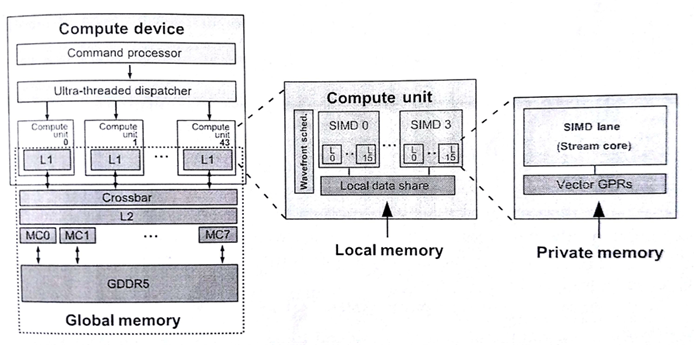
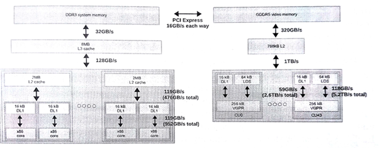
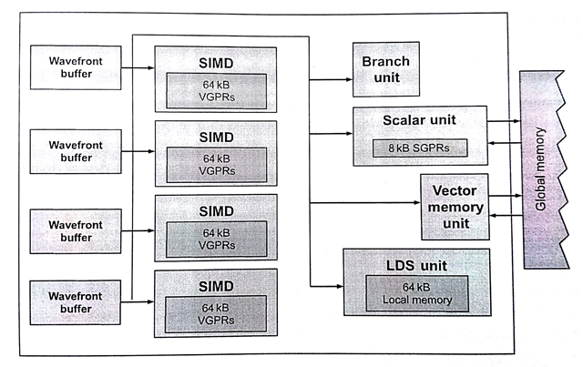
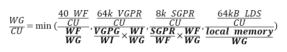
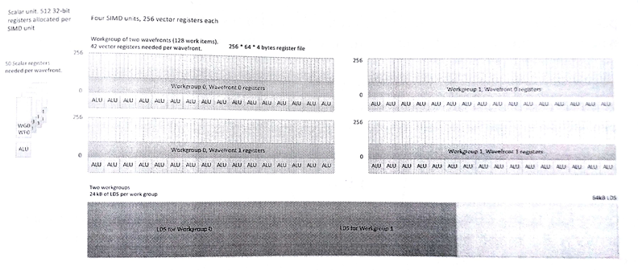

#8.2 AMD RADEON R9 290X GPU

本節我們將討論一下AMD GPU中的“波面陣”(在NVIDIA顯卡中稱為“線程塊”)。這個概念是有助於我們區分OpenCL工作項和CUDA線程。不過，有時會無可避免的使用“線程”這個詞來對GPU的工作方式進行描述。本書中我們將會使用“線程”來描述硬件線程。雖然，本節指定的設備為AMD Radeon R9 290X GPU，但是硬件線程與工作項映射的關係、線程調度和搶佔的考量，以及內存系統的佈局，不同廠商的同類產品其實很相似。

GPU上OpenCL的目標代碼與CPU上的差別很大。讀者應該還記得，圖像處理器主要用來對3D圖像進行渲染。這種設計讓使得資源的優先級有所不同，與CPU架構也有很大的區別。目前GPU市場上，GPU的一些主要特性的差距越來越小，這些特性我們在第2章討論過：

1. 執行寬SIMD：大量執行單元對不同的數據，執行相同的指令。
2. 大量多線程：GPU計算核支持併發大量線程。
3. 硬件暫存式內存：物理內存可由編程者控制。

下面羅列出來的區別則更加微妙，不過其根據工作分配和交互對應用性能進行提高：

- 支持硬件同步：併發線程間支持細粒度交互。
- 硬件管理任務分配：工作隊列管理與負載均和由硬件控制。

硬件同步能為計算單元中的多個波面陣減少同步開銷，並且細粒度交互的開銷非常低。

GPU為任務分發提供廣闊的硬件空間，因為圖像處理器支持三維圖像。遊戲任務在顯卡的流水線上交錯排布，讓圖形任務的管理變得更加複雜。圖8.5中展示了OpenCL模型在AMD Radeon R9 290X GPU映射關係，其架構包含一個命令處理器和工作組生成器(生成工作組供硬件調度)。調度器會將計算任務分配到設備的44個核上。有關計算單元的內容將在8.2.2中詳細討論。



圖8.5 OpenCL執行模型和內存模型在Radeon R9 290X上的映射

為了使用GPU獲得高性能加速，調度需要十分高效。對於圖像處理器，波面陣調度的開銷必須很低，因為工作塊可能很小(例如，一個像素只包含三個元素)。因此，當我們需要使用GPU獲取較高的性能時，我們需要：

- 提供大量的內核任務供硬件分發
- 如果內核過小，考慮將內核進行合併

為每個內核提供足夠工作，這樣就能持續的佔用工作組的流水線，所以調度器總能收到很多的任務，並且調度器通常會將給多的任務推到SIMD單元上。所以我們希望，設備每一次的吞吐可以創建大量的波面陣發送給GPU。

第二點是因為OpenCL設備支持隊列模式。當OpenCL運行時選擇執行相關設備上任務隊列中的任務時，運行時會掃描隊列中的任務，並選擇合適大小的任務進行執行。這種任務由一個GPU工作命令緩存構成，其命令的執行放置在GPU的前端流水線上。其執行內容包括(1)構建一個隊列，(2)將該隊列放置在內存的某個位置上，(3)告訴設備這個隊列在哪裡，(4)要求設備執行這個隊列。因為操作階段這幾個步驟是串行的關係，所以對於單個工作塊來說，就會導致較高的延遲。另外，GPU在驅動層之下執行內核的過程中，為了能讓GPU正常工作，需要在大量執行內核的上下文中進行切換。CPU端如果涉及到線程上下文切換，那應用的性能肯定不會太好。所以，如果任務量太小，就會出現多個上下文切換的情況，從而導致應用性能的下降。不過，這裡有個開銷常量，也就是對於單個工作隊列的分配，以及之後對隊列上任務執行的開銷。通過傳遞大內核的方式(或較長的內核序列)，可以避免這種開銷的累積。這樣做的目的，就是為了增加每個隊列中所要處理的任務量。

##8.2.1 線程和內存系統

CPU緩存層級結構的設計就是為了減少內存訪問流的延遲，一旦內存訪問流出現了重大的延遲，那麼會對性能造成很大的影響。另外，因為GPU核使用線程和寬SIMD單元，所以其能在和標量相同的延遲開銷下，將數據吞吐量最大化。圖8.6展示了一個包含FX-8350 CPU和Radeon R9 290X GPU系統的內存層級結構。

這種內存系統中，GPU具有如下特徵：

- 大量的寄存器
- 用於管理軟件的便籤式內存，在AMD硬件中稱為*共享本地數據*(LDS, local data shares)
- 高級別的片上多線程
- 單個L2緩存
- 高帶寬內存



圖8.6 分佈式系統中的內存帶寬

如之前所提到的，圖像任務與計算任務有很大的區別，這就導致GPU需要有自己的執行和內存模型。實際上，GPU比CPU更加少的依賴數據重用，並且GPU的緩存大小要比CPU的小很多。即使在x86核和Radeon R9 290X計算單元上的L1緩存數據大小相同，GPU一次執行40個波面陣的話，每個波面陣所分配到的緩存更加的有限。GPU對於緩存的弱依賴是由一系列原因的，其中包括時域圖像數據不可複用和由於數據集過大和大量的線程，無法保證為每個工作集提供足夠的緩存空間。當數據複用發生時，多線程和高帶寬內存將有助於克服緩存空間有限的情況。

GPU內存系統中，每個計算單元中有一個L2緩存。計算單元中的單L2緩存是為了保證GPU中L1緩存和外部緩存數據一致性而設計。如果向L2寫入數據從而導致寄存器數據溢出，那麼後續的每次訪問則會有很高的的延遲，並且訪存操作會阻塞在L2緩存處。

為了避免溢出，GPU提供了大量的寄存器。例如，x86架構下通用寄存器的數量是固定的(每個線程上下文中有16個通用寄存器)，Radeon R9 290X顯卡單個波面陣可用的寄存器數量為16384個！波面陣嘗試只使用寄存器進行計算，並且也會使用到LDS，也會盡可能避免訪存衝突。

LDS允許高帶寬低延遲(編程可控)的讀寫訪問。這種可編程模式的數據複用要比硬件控制更加高效。減少垃圾數據(加載到緩存而從不使用的數據)訪問，可以認為LDS的容量要比同級的緩存小得多。另外，減少控制邏輯和結構體標記就可以節省出很多LDS空間。

GPU核中允許硬件控制多線程，可以很好的掩蓋內存訪問延遲。為了讓性能和利用率達到最高，就要有足夠多的波面陣執行起來。每個SIMD單元上能運行4個以上(包括4個)波面陣，或是很多應用需要每個計算單元上能運行16個波面陣。如果每個SIMD單元可以運行10個波面陣，那麼就有顯卡中就會同時有40個活動的波面陣。為了能更加快速的進行切換，波面陣的狀態則保存在寄存器中，而非緩存中。雖然大量的波面陣可以掩蓋內存訪問延遲，但每個波面陣也都是需要資源支持的，這裡必須要進行權衡。

為了減少每個波面陣產生的請求，系統中的緩存會通過一種過濾機制進行合併讀取操作，將寫入操作合併，儘可能一次性寫入更多的內容——這種機制被稱為*合併訪問*(coalesing)。向量從規劃好的內存(基於DRAM)中讀取數據會更加的高效。

圖8.6中CPU和GPU是通過PCIe總線連接在一起，兩設備間的數據傳輸則由該總線完成。應為PCIe總線的帶寬要比DRAM低很多，和片上內存的帶寬沒法進行比較。CPU和GPU交互比較多的應用中，帶寬會成為應用的性能瓶頸。OpenCL應用中必須最小化與執行相關的數據拷貝。使用離散GPU時，如果應用總要將GPU執行的數據通過PCIe進行拷貝，那麼應用就不可能達到最佳的性能。

##8.2.2 指令集和執行單元

圖8.7展示了基於AMD下一代核芯顯示架構Radeon R9 290X中的計算單元。計算單元在該顯卡中具有四個SIMD單元。當創建一個波面陣，其就會被指定到計算單元中的一個SIMD單元上(分配寄存器)，並且在LDS上分配對應尺寸的內存。當波面陣有64個工作項，SIMD單元具有16個通道，那麼SIMD單元上執行一個波面陣至少需要4個週期。這幾個週期都需要一個SIMD單元上完成。這樣的話，四個週期之後才能執行新的指令，確切的時間要從前一個指令完全提交到流水線上開始算起。



圖8.7 Radeon R9 290X計算單元的微架構

回到計算單元，Radeon R9 290X除了SIMD單元，還有一定數量的執行單元。為了能夠進行指令級別的並行，Radeon R9 290X計算單元不僅會將波面陣分配給SIMD單元，還會將對應的指令發送給其他硬件設備。調度器可能會將5個指令的每個週期放在不同單元上完成，這些單元包括SIMD單元、標量單元、內存單元、LDS或其他指定的功能硬件設備[2]。其他單元的調度與SIMD單元有些不同。比如，標量單元可以完成波面陣中的一條指令，其設計在每個週期可獲得一個新指令。

之前提到的設備，比如第2章提到的Radeon HD 6970，其控制流就由分支單元全權管理。這種比較特殊的執行方式和市面上其他的向量結構有些不同。Radeon R9 290X的設計集成了標量和矢量，就像x86架構的CPU兼容SSE或AVX操作一樣。

再回到有64個工作組的波面陣中，每個波面陣都具有一個指令流(64個工作項共用一個程序計數器)，並且所有分支都以波面陣為粒度進行執行。為了在Radeon R9 290X上支持分支控制流，架構提供給了執行掩碼，用以表示哪些部分寫入或不寫入結果。因此，波面陣中工作項間的任何分支，都需要使用*架構指令集*(instruction set architecture，ISA)對指令加以限制，將對應的操作的寫入功能開啟或關閉。這樣執行單元必須指令塊隊列中的所有可能的分支覆蓋到。這樣的分支執行會讓向量單元執行的效率大大下降。不過，這樣的問題完全可以在編程階段避免，編程者可以通過手動的方式向量化代碼。相同的問題也會出現在其他具有計算能力的架構中，比如NVIDIA的GeForce GTX 780，其軟件產品支持寬向量架構，同樣也會遇到分支問題。應對分支問題的方式：編程者手動修改代碼，編譯器對代碼進行調整，或是硬件向量化等。

下面的例子會運行在Radeon R9 290X的計算單元上(可見Radeon R9 290X海島系列ISA標準[3])。下面運行一個簡單的內核，在一維索引為0和不為0時所要執行的代碼不同：

```c++
kernel void foo(
  const global int *in,
  global int *out){
  
  if (get_global_id(0) == 0){
    out[get_global_id(0)] = in[get_global_id(0)];
  } else {
    out[get_global_id(0)] = 0;
  }
}
```

這個簡單的內核代碼需要使用編譯器進行編譯，編譯出的指令要與ISA進行映射。下面就讓我們來看看，編譯器是如何在Radeon R9 290X上翻譯這段代碼的。

```
s_buffer_load_dword s0, s[4:7], 0x04
s_buffer_load_dword s1, s[4:7], 0x18
s_waitcnt lgkmcnt(0)
s_min_u32 s0, s0, 0x0000ffff
v_mov_b32 v1, s0
v_mul_i32_i24 v1, s12, v1
v_add_i32 v0, vcc, v0, v1
v_add_i32 v0, vcc, s1, v0
s_buffer_load_dword s0, s[8:11], 0x00
s_buffer_load_dword s1, s[8:11], 0x04
v_cmp_eq_i32 s[4:5], v0, 0
s_and_saveexec_b64 s[4:5], s[4:5]
v_lshlrev_b32 v1, 2, v0
s_cbranch_execz label_0016
s_waitcnt lgkmcnt(0)
v_add_i32 v1, vcc, s0, v1
s_load_dwordx4 s[8:11], s[2:3], 0x50
s_waitcnt lgkmcnt(0)
tbuffer_load_format_x v1, v1, s[8:11], 0 offen
	format:[BUF_DATA_FORMAT_32, BUF_NUM_FORMAT_FLOAT]
label_0016:
s_andn2_b64 exec, s[4:5], exec
v_mov_b32 v1, 0
s_mov_b64 exec, s[4:5]
v_lshlrev_b32 v0, 2, v0
s_waitcnt lgkmcnt(0)
v_add_i32 v0, vcc, s1, v0
s_load_dwordx4 s[0:3], s[2:3], 0x58
s_waitcnt vmcnt(0) & lgkmcnt(0)
tbuffer_store_format_x v1, v0, s[0:3], 0, offen
	format:[BUF_DATA_FORMAT_32, BUF_NUM_FORMAT_FLOAT]
s_endpgm
```

清單8.1 Radeon R9 290X上分支操作所生成的ISA指令

這段代碼表示在一個通道上所執行的所有操作(一個工作項)。不過，不同於高級語言，這裡的標量操作(前綴為`s_`)會在圖8.7所示的GPU標量單元上完成，矢量操作(前綴為`v_`)會在GPU矢量單元上完成。

清單中第11行(`v_cmp_eq_i32 s[4:5], v0, 0`)，我們能看到這裡執行的是矢量比較操作，將工作項ID(存與v0)與常量數0進行比較。比較的結果存於一個64位布爾掩碼中，64位掩碼由連續的兩個標量寄存器組成(`s[4:5]`)。得到的布爾掩碼則用來決定OpenCL C內核所要執行的分支。

第12行(`s_and_saveexec_b64 s[4:5], s[4:5]`)，這裡隱式的將當前執行掩碼與比較結果後的掩碼進行與操作。例子中最後得到的執行掩碼將用於判斷執行if的哪個分支。目標標量寄存器中會將上次執行的掩碼進行保存(本例中，`s[4:5]`將保存上次比較的結果掩碼，目前存儲的是上次的執行掩碼)。當決定哪個工作項走else分支時，就需要使用上次得到的執行掩碼。同樣，在條件執行完成後需要上次的掩碼用來重置執行掩碼。這些操作保證對*標量條件代碼*(SCC, scalar condition code)寄存器的設置，該寄存器用於觸發條件分支。

設置SCC寄存器對程序來說是一種優化，因為其能保證對應工作項進入對應分支，不需要走的分支則不會去執行(本例中，當掩碼為0，14行的s_cbranch_execz指令將保證if分支在執行過程中不會觸發)。如果條件不滿足，代碼將進入else分支。本例中，工作項0將使if分支條件成立，其分支掩碼為1，所以工作項0則會執行if分支中的語句——用一條SIMD通道完成(從第16行開始(`v_add_i32 v1, vcc, s0, v1`))。

當if分支執行完成，則會在第19行執行一個矢量加載(從tbuffer或紋理內存中加載數據，)，將期望的數據存儲到向量寄存器中，v1。第19行是if分支中最後一個操作。注意，在OpenCL C代碼中在加載操作完成後，還有一個存儲操作。因為，不同分支所要寫入的地址是相同的，所以這裡編譯器將這個存儲操作放在程序的最後進行(`tbuffer_store_format_x v1, v0, s[0:3], 0, offen`)。

第22行(`s_andn2_b64 exec, s[4:5], exec`)會將當前執行掩碼與原始執行掩碼進行與操作。新的執行掩碼則表示當前工作項執行的是else分支的語句。else分支不需要從內存中加載數據，工作項只需要將常量0存儲v1即可(第23行(`v_mov_b32 v1, 0`))。注意不同的分支都將結果保存在v1寄存器中，這樣就可以將存儲操作放在之後完成。

細心的讀者可能已經發現了，指令中這裡並沒有對else分支進行忽略。本例中，編譯器認為與其忽略else分支，不如不對其進行加載，這樣就節省了執行預測的性能開銷。而且，這樣操作就不會對v1寄存器進行更新，和忽略else分支達到了同樣的效果。

這是一個簡單的例子。在當有嵌套或深層條件時，就會有更加複雜和更加長的序列用來存儲條件掩碼，並且與執行掩碼進行與操作，逐級縮小執行管道最後所要執行的變量分支。逐級縮小的過程將會對造成執行性能的下降。所以，良好的代碼設計將會在執行相同指令的前提下，獲得更佳的性能。程序的掩碼管理十分複雜，並且GPU向量操作與CPU向量操作(SSE)也區別。其在多核系統下，向量操作就並非是一種抽象的概念了。

最後，第24行(`s_mov_b64 exec, s[4:5]`)，將執行掩碼進行重置，並且將數據存儲在v1寄存器中，在第30行(`tbuffer_store_format_x v1, v0, s[0:3], 0, offen`)使用tbuffer將數據存儲到對應位置上。

##8.2.3 資源分配

GPU中的每個SIMD單元都有固定數量的寄存器和LDS存儲空間。每個計算單元中有256KB的空間供寄存器使用。這些寄存器分為四組，每個SIMD單元有256個寄存器，每個寄存器，每個單元有64個通道，每個通道具有32位。計算單元中，寄存器是執行波面陣的最小單位。每個計算單元有64KB的LDS，就像對32行的SRAM一樣可以進行隨機訪問。LDS會在計算單元中分成多份，劃分給對應的工作組，用於開闢對應的局部內存(通過OpenCL運行時傳入的參數進行分配)。

計算單元執行內核時，我們可能看到如圖8.8所示的資源瓶頸。圖中兩個波面陣，每個波面陣中有兩個工作組，每個工作項需要42個向量寄存器(按照波面陣的尺寸等比例放大)，並且共享50個標量寄存器，並且每個工作組需要24KB LDS。每個計算單元能夠同時執行4個這樣的波面陣，這樣可將每個波面陣分配給一個SIMD單元，同時運行4個會讓設備保持忙碌狀態。不過，當執行標量代碼或內存操作時，就沒有空間進行切換操作。下面給出在Radeon R9 290X上工作組對一個計算單元的佔用比(等式8.1)：

 (8.1)



圖8.8 R9 290X GPU物理內存與OpenCL內存間的映射關係

等式8.1中，VGRP表示矢量通用寄存器，SGPR表示標量通用寄存器，WI表示工作項，WG表示工作組，WF表示波面陣。通過OpenCL內核參數傳入的部分使用粗體表示。

圖8.8的例子中，如果增加SIMD單元中波面陣運行的數量(4個或更多)，在控制流和內存延遲方面，讓標量和矢量單元忙碌起來，有助於對延遲的隱藏。本例中LDS有限，對於算法來說，將波面陣數量(只有一個波面陣)增加到3個是個不錯的選擇。另外，減少LDS內存分配，則可讓每個工作單元多執行三分之一個工作組。這個方式在波面陣等待柵欄或內存訪問時非常有用(SIMD單元閒置狀態)。

每個波面陣運行在一個SIMD單元上，直到執行完成。任意組具有相同工作組的波面陣都會在同一個計算單元上完成。由於每個工作組的狀態存儲量的原因，才將這些工作放在同一個計算單元完成。本例中，我們看到每個工作組需要24KB LDS，且寄存器可操作的空間超過21KB。在刷新內存和搬移到其他核上時，這個數據量還是相當大的。當內存控制器執行高延遲的讀或寫操作時，如果沒有其他波面陣在計算邏輯單元(ALU)中時，那就沒有任務分配到SIMD單元上，計算硬件這時處於閒置狀態。

------------

[2] Advanced Micro Devices, GCN Whitepaper. AMD Graphics Core Next(GCN) Architecture, 2013. http://www.amd.com/Documents/GCN_Architecture_whitepaper.pdf

[3] Advanced Micro Devices, ADM Sea Islands Series Instruction Set Architecture, 2013. http://developer.amd.com/wordpress/media/2013/07/AMD_Sea_Islands_Instruction_Set_Architecture.pdf.