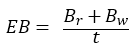
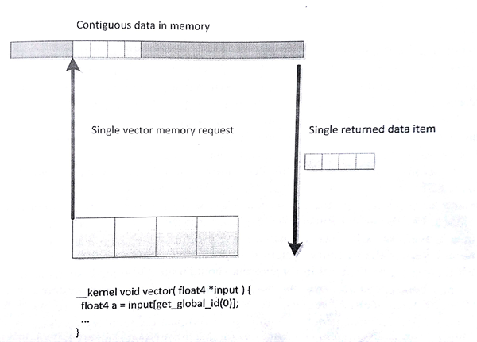
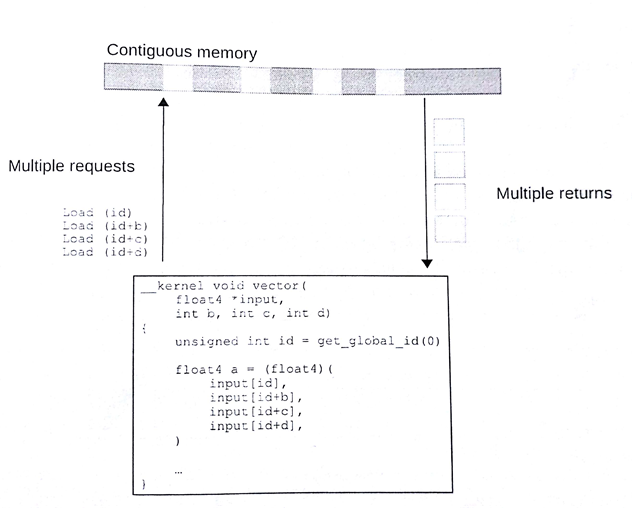
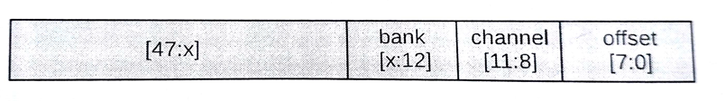
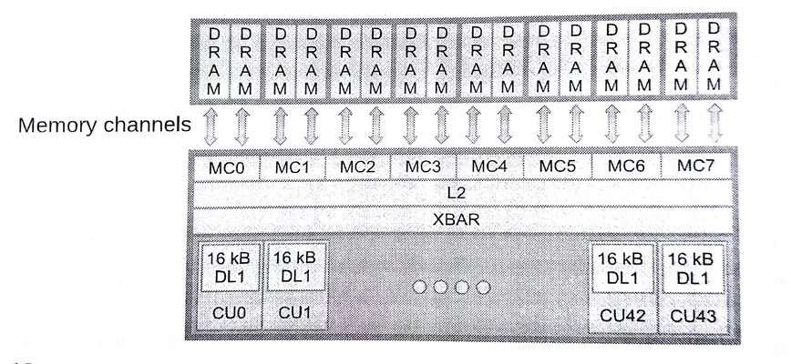
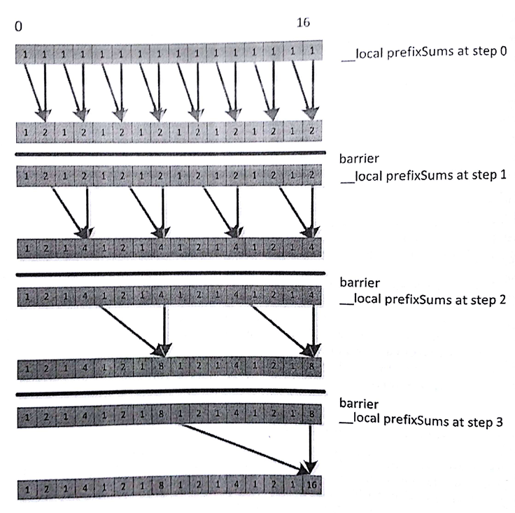
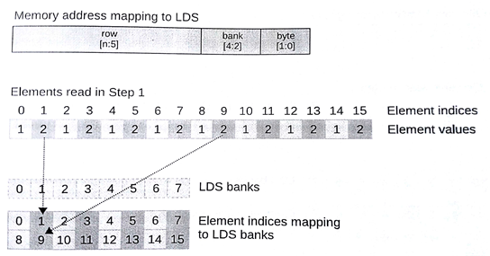
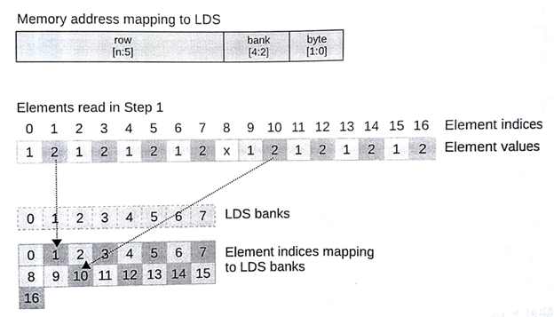

#8.3 OpenCL內存性能的考量

##8.3.1 全局內存

與內存相關的話題我們在第2章有詳細的討論過。OpenCL應用的性能與是否高效的使用的內存有著很大的關係。不過，高效的內存則依賴與具體的硬件(執行OpenCL內核的設備)。因此，同樣的訪存模式，在GPU上是高效的，不過在CPU上就不一定了。因為GPU的供應商繁多，且與CPU在製造方面有很大的區別。

所有例子中，內核吞吐量的級別是內存性能分析的開端。下面簡單的計算公式，就是用來計算內核的帶寬大小：

 (8.2)

EB代表有效帶寬，Br代表從全局內存上讀取的數據量(單位：byte)，Bw表示寫入全局內存的數據量(單位：byte)，t代表內核運行的時間。

時間t的獲取，可以通過一些性能測評工具，比如：ADM的CodeXL。Br和Bw可以通過每個工作項所讀取或寫入的數據量，然後乘以工作項的數量計算得出。所以，在某些情況下，這些讀寫的數據量都是估算出來的。

當我們測得當前執行內核的帶寬，我們可以將測出帶寬與執行設備的峰值帶寬進行比較，看一下二者在數值上差多少。如果二者很接近，那說明我們充分的利用了當前內存系統；如果二者相差甚遠，那我們就需要考慮重構我們內存訪問的方式，以提高內存的利用率，增大內核帶寬。

OpenCL程序在對內存訪問時，需要考慮對內存所處的位置。大多數架構在運行OpenCL內核時，會基於不同等級的矢量進行(可能像SSE，或使用管道導向型輸入語言進行在佛那個向量化，例如AMD的IL或NVIDIA的PTX)，內存系統會將向量中的數據打包一起處理以加速應用。另外，局部訪問通常會使用緩存進行。

大多數現代CPU都支持不同版本的SSE和AVX向量指令集。將內存部分設計成全對齊的模式，向量讀取這樣的內存會有使用到相關的指令集，並且向量指令會使內存訪問更加高效。可以給定一個較小的向量尺寸(比如float4)，這樣編譯器會生成更加高效的向量讀取指令。其很好的利用了緩存行，緩存和寄存器間做數據移動是最高效的。不過，CPU在處理未對齊的內存或更多的隨機訪問時，緩存會幫助掩蓋一些性能損失。圖8.9和圖8.10提供了兩個例子，一個用於讀取一段連續的4個數據，另一個則是通過隨機訪問4個數據。如果緩存行較窄，則會出現很多次緩存未命中，這樣的情況會大大影響應用的性能。



圖8.9 內存系統中使用向量的讀取數據的方式會更加高效。當工作項訪問連續的數據時，GPU硬件會使用合併訪問的方式獲取數據。



圖8.10 訪問非連續元素時，性能會有一定的損失。

之前的章節中我們曾討論過，GPU內存架構與CPU的內存架構有著很大的不同。GPU使用多線程的方式來掩蓋不同級別的內存延遲，CPU則會更多的是用ALU的能力，而非緩存和複雜的亂序邏輯。傳統GPU具有更多的計算資源可用，如果我們不想GPU餓死，就需要具有更加高帶寬的內存系統。很多現代GPU架構，特別是高性能桌面版本，比如AMD的Radeon系列和NVIDIA的GeForce系列，都在使用寬SIMD架構。試想8.10圖中的例子，將向量擴展成(AMD Radeon R9支持的)64位硬件向量。

高效的訪問在不同的架構中也有不同的方式。對於x86 CPU來說使用的是SSE指令集，我們可能會使用128位的float4類型作為數據處理的單元，這樣可能會增加緩存行的利用率，減少緩存未命中的概率。對於AMD Radeon R9 290X GPU架構，同一波面陣中連續的工作項就可以同時對內存進行訪問。如果內存系統不能及時的處理這些請求，則會造成訪存延遲。對於最高的性能，同一波面陣的工作項同時發起32位的讀取請求時，就意味著最多需要讀取256字節(32bit x 64個工作項)內存數據，這樣內存系統只需要相應開闢一塊較大內存上的請求。為了可在不同的架構間進行移植，一個好的解決方式就是讓內存訪問的效率儘可能的高，可以在寬矢量設備(AMD和NVIDIA GPU)和窄矢量設備(x86 CPU)都有很好的訪存效率。為了達到這種效果，我們可以通過工作組計算出所要放訪問的內存起始地址，該地址應為work-groupSIze x loadSize對齊，其中loadSize是每個工作項所加載的數據大小，其應該是一個合理的值——對於AMD GCN架構的設備來說，32位是一個不錯大小；對於x86 CPU和舊一些的GPU架構來說，128位則是很好的選擇；對支持AVX架構的設備來說，256位則是不二之選。為什麼32位對於AMD GCN架構來說是一個不錯的選擇，下面我們就來解釋一下。

要處理不同的內存系統，需要面對很多問題，比如：減少片外鏈接DRAM的訪存衝突。先讓我們來看一下AMD Radeon架構中如何進行地質分配。圖8.11中低8位展示了給定內存塊中的數據內存起始地址；這段信息可以存儲在緩存行和子緩存行中，供我們進行局部讀取。如果嘗試讀取二維數據中一列的數據，對於行優先的存儲方式，這種方式對於片上總線來說是低效的。其也意味著，設備上同時執行的多個工作組，訪問的內存通道和內存塊都有所不同。



圖8.11 將Radeon R9 290X地址空間的內存通道與DRAM塊間的映射



圖8.12 Radeon R9 290X內存子系統

每個內存通道的控制器與片外內存進行連接(圖8.12)。我們希望執行設備能夠通過內存系統，訪問到其中的所有內存塊與內存通道。不過，一個波面陣中某個矢量將會命中多個內存通道(或內存塊)佔用和阻塞他們，導致其他波面陣對相應地址訪問的延遲，從而導致帶寬的下降。最佳的方式是，給定的波面陣能夠連續的讀取指定內存通道和內存塊上的數據，允許更多波面陣可以並行的對內存進行訪問，形成高效的數據流。

為了避免使用多個通道，一個波面陣所能訪問到的區域在64個字(256字節)之內，這就能保證所有工作項在讀取32位數據時，是從連續的地址上獲取。這裡需要討論一下訪存最壞的結果——"當多個波面陣中的每個工作項對同一地址的數據進行訪問"——每個工作項中的變量都將命中同一內存通道和內存塊，並且串行的獲取數據，訪存吞吐量比頂峰時降低數倍。更多的有關AMD架構主題的內容，可以在《AMD的OpenCL編程指南》中找到[4]。同樣的信息也在其他GPU供應商的計算架構中出現——例如，NVIDIA的《CUDA編程指南》[5]。

##8.3.2 局部內存——軟件可控緩存

大多數支持OpenCL的設備都支持不同形式的緩存。由於面向圖像的設計，很多GPU只提供只讀數據緩存，這樣能複用大量的數據。

OpenCL使用緩存最簡單的方式就是使用圖像類型(第6和第7章討論過)。GPU上，圖像可以將數據映射成硬件可讀紋理。假設複雜的濾波器不需要進行二維內存訪問，那麼訪問內存效率將會提高。不過，GPU緩存相較波面陣所要讀取的內存，則是相形見絀。編程者可通過代碼控制暫存式內存在局部空間的大小，在高效獲取數據的同時，減少了硬件控制緩存的開銷，有效的節約資源。這對於工作組內工作項的數據交換來說，能夠減少柵欄衝突和訪問延遲。(圖5.5就是一個例子)

當然，考慮對數據進行優化時，需要認真的考慮如何利用數據的局部性。很多例子中，其消耗在於使用額外的拷貝指令將數據搬移到局部內存中，之後搬運到ALU中(可能通過寄存器)進行計算，這種方式的效率通常要比簡單的複用緩存中數據的效率低得多。大量的讀取和寫入操作複用同一地址時，將數據搬移到局部內存中將會很有用，讀取和寫入操作對局部內存的操作延遲要遠遠小於對於全局內存的操作。並且，對二維數據進行訪問時，就不需要通過全局變量進行數據加載，從而減少緩存加載所需要的時間。

下例中的讀/寫操作，將會大大收益與局部內存，特別是給定寬度的只讀緩存。讀者可以嘗試，寫出前綴求和的C代碼和下面的代碼進行對照：


void localPrefixSum(
  __global unsigned *input,
  __global unsigned *output,
  __local  unsigned *prefixSums,
           unsigned numElements){
  
  /* Copy data from global memory to local memory */
  for (unsigned index = get_local_id(0);
  	index < numElements;
    index += get_local_size(0)){
    prefixSums[index] = input[index];
  }
  
  /* Run through levels of tree, each time halving the size
   * of the element set performing reduction phase */
  int offset = 1;
  for (unsigned level = numElements / 2;
  	level > 0;
    level /= 2){
    barrier(CLK_LOCAL_MEM_FENCE);
    
    for (int sumElement = get_local_id(0);
    	sumElement < level;
        sumElement += get_local_size(0)){
        int ai = offset * (2 * sumElement + 1) - 1;
        int bi = offset * (2 * sumElement + 2) - 1;
        prefixSums[bi] = prefixSums[ai] + prefixSums[bi];
    }
    offset *= 2;
  }
  
  barrier(CLK_LOCAL_MEM_FENCE);
  
  /* Need to clear the last element */
  if (get_local_id(0) == 0){
    prefixSums[numElements - 1] = 0;
  }
  
  /* Push values back down the tree */
  for (int level = 1; level < numElements; level *= 2){
    offset /= 2;
    barrier(CLK_LOCAL_MEM_FENCE);
    
    for (int sumElement = get_local_id(0);
    	sumElement < level;
        sumElement += get_local_size(0)){
        int ai = offset * (2 * sumElement + 1) - 1;
        int bi = offset * (2 * sumElement + 2) - 1;
        unsigned temporary = prefixSums[ai];
        prefixSums[ai] = prefixSums[bi];
        prefixSums[bi] = temporary + prefixSums[bi];
    }
  }
  
  barrier(CLK_LOCAL_MEM_FENCE);
  
  /* Write the data out to global memory */
  for (unsigned index = get_local_id(0);
  	index < numElements;
    index += get_local_size(0)){
    output[index] = prefixSums[index];
  }
}


程序清單8.2 單工作組的前綴求和

這段代碼是進行過一定優化的，其讓工作組中的工作項共享一段數組，從而降低訪問數據的延遲。數據流中的第一個循環(第19行)如圖8.13所示。注意循環中的每次迭代更新一些工作項中的數據，以供下次迭代使用。這裡需要工作項之間的合作，才能完成這項工作。內部的循環最好能覆蓋大部分工作項，以避免執行分支。為了保證工作項的正確行為，我們在外層循環中添加了柵欄，同步對應的工作項，以確保數據在下次循環時已經準備好。



圖8.13 展示了代碼清單8.2中將16個元素存入局部內存，使用8個工作項進行前綴累加

代碼清單8.2中的前綴求和使用的是局部內存的方式，這種方式在大多數寬SIMD架構下的效率並不高(比如：高端GPU)。之前我們討論過全局變量，內存系統傾向於將內存進行分塊，而非讓每個內存位置都能讓外部訪問到。最後，硬件的暫存式內存(比如：緩存)更加傾向於讓每個內存塊執行多次讀操作，或者併發的進行讀寫操作(或其他一些多次訪問操作)，多次讀取操作可以跨越多個內存塊進行。所以在使用寬硬件SIMD訪問內存時，這點必須要考慮到。每個週期中，Radeon R9 290X GPU使用4個SIMD單元可以處理兩個局部內存操作。每個SIMD單元具有16個通道，每個週期可以完成32個讀或寫操作，可以LDS上32個內存塊。每個內存塊支持一個訪問入，那麼每個內存塊只能提供一個值，所以只有在所有訪問目標都在不同的內存塊上時，才能獲取最好的吞吐率。同樣的規則也適用於其他計算架構：NVIDIA的費米框架，局部內存分為32個內存塊。

局部內存的問題並沒有全局內存那麼嚴重。全局內存中，大範圍跨越訪問會因緩存行上的多個訪問丟失，導致訪存延遲。局部內存中，至少架構中是由暫存器的，編程者可以根據自身意願將數據放到該內存上。這裡需要的是，我們發起的16次局部內存訪問，最好訪問的是不同的內存塊。

圖8.14中展示了圖8.13前綴求和在8個LDS塊上進行的第一步，這裡每個工作項在每個週期中能執行一次局部內存操作。這個例子中，我們的局部內存可以在一個週期內返回8個值。那麼我們應該如何在第一步中提升應用的執行效率呢？

注意16個元素的局部內存(對於前綴求和來說是很有必要的)已經超過兩行。每列上的數據在一個內存塊上，每行上只存放每個內存塊的一個地址。假設(通常在很多架構中)每個內存塊都是32位寬，並且假設當前波面陣不需要依賴其他波SIMD單元處理後的數據。不過在圖8.14中，我們的第一步可謂是失敗的。局部內存和全局內存一樣，一個SIMD矢量會根據矢量長度連續，並高效的訪問數據，並且局部內存不存在訪問爭奪。圖8.13中我們看到的是另一番景象。29行中prefixSums[bi]=perfixSums[ai]+perfixSums[bi]中，對prefixSums[bi]訪問了兩次。圖中就是嘗試對位置3、7、11和15進行讀取。圖8.14中，3和11都存儲在內存塊3上，7和15存儲在內存塊7上。根據之前的描述，就不要想同時讀取到內存塊上的兩個值，所以訪問同一塊內存的操作只能在GPU上串行執行，從而導致讀取延遲。為了達到最優性能，我們要儘可能避免衝突。有個十分有用的技巧是進行簡單的填充地址，就如圖8.15所示。為了偏移地址(以內存塊大小對齊)，甚至可以改內存訪問的跨度。不過，對地址操作的開銷要比內存塊衝突嚴重的大多；因此，我們要在具體的架構上進行調試。



圖8.14 圖8.13中的第一步，LDS上具有8個內存塊



圖8.15 圖8.14中的第一步，為了避免LDS中的內存塊訪問衝突，則去訪問下個內存塊的數據

局部內存的大小是固定的。任何OpenCL設備都具有一段暫存式內存，這塊內存大小有限，且不歸硬件管理。Radeon R9 290X GPU式例中，其局部空間大小為64KB。要注意的是這64KB是所有工作組一共可以使用的共享內存。因為GPU是用多線程提高吞吐量，從而掩蓋訪存的延遲。如果每個工作組使用16KB，那麼每個核上只能運行4個工作組。如果幾個波面陣(一個或兩個)中包含有幾個工作組，那麼這樣就剛好能夠掩蓋訪問延遲。雖然局部內存能提升應用性能，不過局部內存大小有限。因此，我們需要在使用局部內存和減少硬件線程方面進行平衡。

OpenCL運行時API也支持查詢對應設備上局部內存的大小。在編程者編譯或暫存局部內存數據時，其可以作為OpenCL內核參數。下面代碼第一個調用，是用來查詢局部內存類型，其可以用來判斷哪些內存屬於局部內存或全局內存(哪些是可以緩存或不能緩存的)，第二個調用時用來返回局部內存的大小：

```c++
cl_int err;
cl_device_local_mem_type type;
err = clGetDeviceInfo(
  deviceId,
  CL_DEVICE_LOCAL_MEM_TYPE,
  sizeof(cl_device_local_mem_type),
  &type,
  0);
  
cl_ulong size;
err = clGetDeviceInfo(
  deviceId,
  CL_DEVICE_LOCAL_MEM_SIZE,
  sizeof(cl_ulong),
  &size,
  0);
```

----------

[4] Advanced Micro Device, The AMD Accelerated Paralel Processing-OpenCL Programming Guide, Advanced Micro Devices, Inc,. Sunnyvale, CA, 2012.

[5] NVIDIA, CUDA C Programming Guide, NVIDIA Corporation, Santa Clara, CA, 2012.
