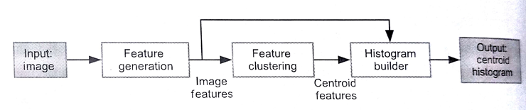
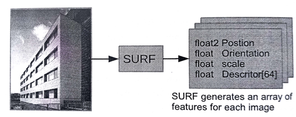

#9.1 圖像聚類簡介

圖像分類源於機器視覺，其根據圖像可見內容對圖像進行分類。例如，某個圖像算法可能會用來告訴你該圖片中是否有人。雖然檢測人可能是很簡單的事情，但能將圖像進行準確分類的算法，仍然是目前的所要面臨的挑戰。

BoW模型通常會用於文本分類或自然語言處理。BoW模型中每個詞出現的頻度都會作為一個訓練參數傳入對應的機器學習算法中。除了進行文本分類，BoW也可以應用於圖像。為了讓BoW能對圖像進行分類，我們需要從圖像中獲取一組詞(和文本分類一樣)，以及對應詞的出現頻率。機器視覺中，這裡的“詞”通常被看做是圖像的一個“特徵”。特徵算法將圖像縮小成一組特徵值。圖9.1展示了個圖像分類的高端算法，其包括生成特徵、聚合和直方圖建立這幾步。

圖9.1 圖像分類流程。像SURF這樣的算法可以用來產生特徵。像k-means類的聚合算法之後會產生一組質心特徵，這些特徵可以用來描述原始圖像。通過直方圖構建算法將這些計算出的特徵賦予質心。

圖9.2 使用SURF算法生成特徵。SURF算法可以將一副圖像作為輸入，並且產生一組對應的特徵。每個特徵包括圖像位置信息和一個具有64個值的描述符。

下面簡單的描述一下這幾步：

1. 生成特徵：我們已經將特徵產生算法應用於BoW模型，將其稱為*加速穩健特徵算法*(SURF，Speeded Up Robust Features)。SURF算法在2006年，由Bay等人在歐洲計算機視覺會議(ECCV)上發表[1]，其對不同大小的圖像進行尺度不變的變換。如圖9.2所示，將圖像出入SURF算法中，將會得到一組用來描述原始圖像的特徵值。每個特徵值包含圖像位置和描述矢量。每個特徵中的描述符向量是一個64維的向量。沒描述符中包括該特徵顏色和特徵位置周圍顏色梯度關係。本章中的特徵，都具有一個有著64個元素的描述符。其餘的成員變量則不是本章關注的焦點。
2. 圖像聚合：SURF產生的描述符通常都經過量化，通常會經過k-means聚合，然後映射到群組中。每個群組的質心就是所謂的“視覺詞”。
3. 直方圖構建：這一階段的任務是將SURF算法產生的描述符設置到直方圖的視覺詞中去。為了完成這項工作，我們需要確定描述符和質心的對應關係。本例中，SURF產生的特徵描述符和質心都由64維構成。我們通過計算描述符和所有質心的歐式距離，並且將描述符賦予距離最近的質心。直方圖在這裡就是用於統計每個質心被賦予描述符的次數。

使用這種方法，我們就能表示視覺詞出現的頻度。機器算法，例如支持向量機就能使用模型對圖片進行分類。這一過程在圖9.1中展示。

本章我們將探索在直方圖構建步驟上的並行化。我們首先使用在CPU上的串行算法對該算法做一個具體的瞭解，然後使用OpenMP進行CPU版本的並行化優化。然後將多線程實現換成OpenCL，讓這一階段的計算在GPU上完成。我們會有多個GPU版本的實現，包括原始實現，對全局內存進行優化的實現，以及利用局部內存的實現。本章最後，我們將使用AMD的Radeon HD 7970 GPU對相應的實現進行性能評估。

> 貼士
> 本章著重於圖像分類算法中的直方圖構建步驟。
> 讀者如果對特徵生成算法感興趣，這裡提供一個開源版本的SURF實現(OpenCL)：https://code.google.com/p/clsurf/
> google code無法使用，GitHub地址：https://github.com/perhaad/clsurf

----------------

[1] H. Bay, T. Tuytelaars, L.V.Gool, SURF:speed up robust features, in: ECCV, 2006, pp.404-417.