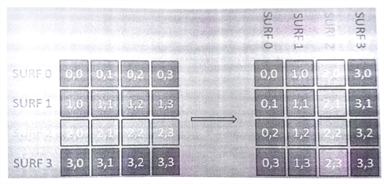
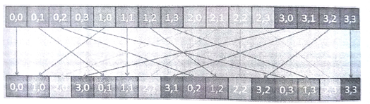

#9.3 OpenCL實現

本節，我們將瞭解一下如何在GPU上實現直方圖構建。首先實現實現了一個常規內核，該內核代碼基於串行和OpenMP版本的算法。然後，再來對GPU實現進行優化，這裡使用的優化策略為：合併訪問和局部內存。

##9.3.1 常規GPU實現：GPU1

根據清單9.2中的OpenMP實現，我們可以實現一個最簡單OpenCL版本，也就是將循環迭代拆開，讓每個工作項完成一個標識符的歸屬計算。

不過，OpenMP實現中，我們遇到了條件競爭的問題，這裡工作項需要對在全局內存上的直方圖進行更新。為瞭解決這一問題，在OpenCL中我們依舊使用原子操作。下面的OpenCL內核就是我們的實現。我們暫且稱這段代碼為GPU1：


__kernel
void kernelGPU1(
  __global float *descriptors,
  __global float *centroids,
  __global int *histogram,
  int n_descriptors,
  int n_centroids,
  int nfeatures){

  // Global ID identifies SURF descriptor
  int desc_id = get_global_id(0);
  
  int membership = 0;
  float min_dist = FLT_MAX;
  
  // For each cluster, compute the membership
  for (int j = 0; j < n_centroids; j++){
    float dist = 0;
    
    // n_features: No. of elements in each descriptor(64)
    // Calculate the distance between the descriptor and the centroid
    for (int k = 0; k < n_features; k++){
      float temp = descriptors[desc_id * n_features + k] -
        centroids[j * n_features + k];
      dist += temp * temp;
    }
    
    // Update the minimum distance
    if (dist < min_dist){
      min_dist = dist;
      membership = j;
    }
  }
  
  // Atomic increment of histogram bin
  atomic_fetch_add_explicit(&histogram[membership], 1, memory_order_relaxed, memory_scope_device);
}


代碼清單9.3 內核GPU1，直方圖基線內核

注意清單9.3中，第37行的原子加操作，使用的自由序進行。我們選擇這個內存序的原因是，更新操作比較簡單，並不需要對內存訪問順序進行嚴格要求。詳細內容可回顧第7章中的相關章節。

##9.3.2 合併訪問內存：GPU2

例子中對於數據的訪問不存在跨距，所以工作項可以在GPU執行單指令多數據命令(SIMD)。並且SURF描述符和集群質心矢量都具有64個連續數據。再來看看清單9.3中的第24行，並且注意描述符訪問的方式。對於給定的GPU硬件來說，第24行對於內存的訪問是否高效呢？

假設有4個並行的工作項，其全局索引分別是0到3。在GPU執行最內部的循環時，這個四個工作項所訪問的數據間具有很大的跨距——在這個版本的內核代碼中，數據跨距為n_features。假設我們現在在處理質心0(j=0)，並且正在處理質心0與特徵0(k=0)之間的距離。那麼工作項分別訪問的數據為：descriptors[0]、descriptors[64]、descriptors[128]、descriptors[192]。那麼計算下一個特徵時就要訪問descriptors[1]、descriptors[65]、descriptors[129]、descriptors[193]，以此類推。

第8章中我們介紹了對於連續數據的合併訪問方式，該方式只向內存系統發出更少的請求，以高效的方式獲取相應的數據。不過，跨距訪問方式需要產生多個訪存請求，從而導致性能下降。這種帶有跨距的訪存方式是無法進行合併訪問的。

為了通過使用合併訪問的方式提升內存帶寬的利用率，我們需要調整數據在descriptors存放的順序。可以通過一種常用的矩陣操作來完成——轉置，如圖9.3所示。轉置過程中，矩陣的行列座標互換。我們可以創建一個簡單的內核來完成這項工作。



圖9.3 將描述符中的數據進行轉置，以便進行合併訪問



圖9.4 對一維數組進行轉置。

一維數組的轉置如圖9.4所示。轉置後，descriptors[0]、descriptors[64]、descriptors[128]、descriptors[192]就是連續的。並且內核內部可以進行合併訪問，只需要一個訪存請求，即可直接將4個連續的數據取出。


__kernel
void kernelGPU2(
  __global float *descriptors,
  __global float *centroids,
  __global int *histogram,
  int n_descriptors,
  int n_centroids,
  int nfeatures){

  // Global ID identifies SURF descriptor
  int desc_id = get_global_id(0);
  
  int membership = 0;
  float min_dist = FLT_MAX;
  
  // For each cluster, compute the membership
  for (int j = 0; j < n_centroids; j++){
    float dist = 0;
    
    // n_features: No. of elements in each descriptor(64)
    // Calculate the distance between the descriptor and the centroid
    for (int k = 0; k < n_features; k++){
      float temp = descriptors[k * n_descriptors + desc_id] -
        centroids[j * n_features + k];
      dist += temp * temp;
    }
    
    // Update the minimum distance
    if (dist < min_dist){
      min_dist = dist;
      membership = j;
    }
  }
  
  // Atomic increment of histogram bin
  atomic_fetch_add_explicit(&histogram[membership], 1, memory_order_relaxed, memory_scope_device);
}


代碼清單9.4 使用內存合併訪問的內核——GPU2

清單9.4中的第24行，現在使用的是k * n_descriptors + desc_id，可與清單9.3進行對比。當k和n_descriptors具有相同的值時，所有工作項就挨個對數據進行計算，不同工作項可以通過唯一標識符對數據進行訪問(desc_id)。我們之前舉了4個工作組的例子，在k=0時，就只需要訪問descriptors[0]、descriptors[1]、descriptors[2]和descriptors[3]即可。當k=1時，則需要訪問descriptors[64]、descriptors[65]、descriptors[66]和descriptors[67]。這樣的訪存方式是最理想的，並且在GPU上進行合併訪問可以高效的對內存系統進行操作。

##9.3.3 向量化計算：GPU3

當SURF算法生成特徵之後，描述符的長度固定為64維，這時使用向量float4可以對應用進行提速。在CPU上，對於其擴展流媒體SIMD指令來說，能夠獲得較高的吞吐量。同樣的方式也適用於GPU(比如，AMD Radeon 6xxx 系列)，在GPU上使用向量化方式的計算也能帶來相應的性能收益。AMD和NVIDIA的新型GPU都不會顯式的執行向量指令，不過在某些情況下向量的方式也會提升內存系統的使用效率。

```c++
float a[4], b[4], c[4];

a[0] = b[0] + c[0];
a[1] = b[1] + c[1];
a[2] = b[2] + c[2];
a[3] = b[3] + c[3];
```

向量化可以推廣到一些可擴展的數據類型，比如：向量、矩陣和高維數組。這裡的例子中，我們將數組中的元素由編程者顯式的放入float4類型中。下面的代碼就向量化所要進行的一些操作。

```c++
float a[4], b[4], c[4];

float4 b4 = (float4)(b[0], b[1], b[2], b[3]);
float4 c4 = (float4)(b[0], b[1], b[2], b[3]);
float4 a4 = b4 + c4;
```

為了將向量化應用到我們的算法中，我們在這裡更新一下內核實現(代碼清單9.5)，稱這個內核為GPU3。


__kernel
void kernelGPU3(
  __global float *descriptors,
  __global float *centroids,
  __global int *histogram,
  int n_descriptors,
  int n_centroids,
  int nfeatures){

  // Global ID identifies SURF descriptor
  int desc_id = get_global_id(0);
  
  int membership = 0;
  float min_dist = FLT_MAX;
  
  // For each cluster, compute the membership
  for (int j = 0; j < n_centroids; j++){
    float dist = 0;
    
    // n_features: No. of elements in each descriptor(64)
    // Calculate the distance between the descriptor and the centroid
    // The increment of 4 is due to the explicit verctorization where
    // the distance between 4 elements is calculated in each
    // loop iteration
    for (int k = 0; k < n_features; k++){
      float4 surf_temp = (float4)(
        descriptors[(k + 0) * n_descriptors + desc_id],
        descriptors[(k + 1) * n_descriptors + desc_id],
        descriptors[(k + 2) * n_descriptors + desc_id],
        descriptors[(k + 3) * n_descriptors + desc_id]);
      float4 cluster_temp = (float4)(
       	centroids[j * n_feature + k],
        centroids[j * n_feature + k + 1]
        centroids[j * n_feature + k + 2]
        centroids[j * n_feature + k + 3]);
        
      float4 temp = surf_temp - cluster_temp;
      temp = temp * temp;
      
      dist += temp.x + temp.y + temp.z + temp.w;
    }
    
    // Update the minimum distance
    if (dist < min_dist){
      min_dist = dist;
      membership = j;
    }
  }
  
  // Atomic increment of histogram bin
  atomic_fetch_add_explicit(&histogram[membership], 1, memory_order_relaxed, memory_scope_device);
}


代碼清單9.5 使用向量化的內核代碼——GPU3

##9.3.4 將SURF特徵放入局部內存：GPU4

下面是代碼清單9.4中，訪問descriptors和centroids的代碼片段：

```c++
for (int k = 0; k < n_features; k++){
  float temp = descriptors[k * n_features + k] -
    centroids[j * n_features + k];
  dist += temp * temp;
}
```

從上面的片段可以看出，要對這個內存進行多次的訪問。有沒有可能將這段內存放置到OpenCL特定的內存空間中，以提升性能呢？

這裡訪問centroids的位置可以使用工作項的索引進行表示。常量內存非常適合以這種方式進行訪問，下節中我們將介紹如何將centroids放入常量內存。當前版本中，重點放在對descriptors訪存的優化。當使用工作項索引對descriptors數據進行訪存時，因為其存在訪存跨度的原因，所以不是很適合放入常量內存中。那麼這個數組能放入到局部內存中嗎？

GPU上的局部內存是一段具有高帶寬、低延遲的內存區域，其可以將數據共享給工作組內每一個工作項。GPU上有專用的局部內存，訪問局部內存的速度通常要比全局內存快很多。同樣，與全局內存訪問不同，訪問局部內存通常都不需要合併訪問，就算是在局部內存上產生了內存訪問衝突，其性能也要優於全局內存。不過，局部內存的大小有限——在AMD Radeon HD 7970 GPU上每個計算單元只有64KB大小的局部內存，所以能分配給一個每個工作組的只有32KB。若是為每個工作組分配一個很大的內存，則會限制GPU上執行線程的數量。對於GPU來說，減少線程就意味著不能很好的掩蓋訪存延遲，同樣也會讓計算資源閒置。

最初，數據放到局部內存上似乎並不是最好的選擇，因為局部內存能在工作項間共享數據，不過對於descriptors來說沒有數據是需要共享的。不過，對於很多GPU，局部內存具有一些額外的優勢。首先，局部內存與本地數據存(LDS)相對應，其比L1緩存大4倍。其次再說緩存命中，LDS內存訪存的延遲也要比L1緩存低很多。為了充分複用，數據放在LDS將會帶來比放在L1緩存上更好的性能，因為LDS的延遲很小，即使是高頻度訪問也能輕鬆應對。這裡所要權衡的是局部內存使用的多少與執行工作組數量，換句話說就是更多的使用執行單元還是內存系統。優化策略的權衡，需要根據不同的架構特點決定。代碼清單9.6展示了，descriptors使用局部內存的內核代碼。


__kernel
void kernelGPU4(
  __global float *descriptors,
  __global float *centroids,
  __global int *histogram,
  int n_descriptors,
  int n_centroids,
  int nfeatures){

  // Global ID identifies SURF descriptor
  int desc_id = get_global_id(0);
  int local_id = get_local_id(0);
  int local_size = get_local_size(0);
  
  // Store the descriptors in local memory
  __local float desc_local[4096]; // 64 descriptors * 64 work-items
  for (int i = 0; i < n_features; i++){
    desc_local[i * local_size + local_id] =
    	descriptors[i * n_descriptors + desc_id];
  }
  barrier(CLK_LOCAL_MEM_FENCE);
  
  int membership = 0;
  float min_dist = FLT_MAX;
  
  // For each cluster, compute the membership
  for (int j = 0; j < n_centroids; j++){
    float dist = 0;
    
    // n_features: No. of elements in each descriptor(64)
    // Calculate the distance between the descriptor and the centroid
    for (int k = 0; k < n_features; k++){
      float temp = descriptors[k * local_size + desc_id] -
        centroids[j * n_features + k];
      dist += temp * temp;
    }
    
    // Update the minimum distance
    if (dist < min_dist){
      min_dist = dist;
      membership = j;
    }
  }
  
  // Atomic increment of histogram bin
  atomic_fetch_add_explicit(&histogram[membership], 1, memory_order_relaxed, memory_scope_device);
}


代碼清單9.6 將descriptor數據存放在局部內存中的內核——GPU4

訪問descriptor時，n_descriptors和desc_id對於所有工作項來說都是固定的。索引值都是基於k變化的。因此，每個工作項都能訪問到desctiptor中的n_feature個元素(64)。GPU上L1緩存的大小非常小，每次緩存訪問丟失都會給訪問全局內存的過程帶來更多冗餘的開銷。

將secriptors放入LDS將需要64x4=256字節。一個波面陣中有64個工作項，每個波面陣就需要是用16KB的LDS空間用來緩存desctiptor。當有64KB的LDS空間時，就能在每個計算單元上運行4個波面陣(每個波面陣只有一個工作項)。在HD 7970上，每個計算單元由4個SIMD單元組成，這樣的話每個SIMD單元就只能處理一個波面陣，SIMD單元之間的延遲掩蓋就沒有了。為了獲取最佳性能，我們需要在低延遲訪問和減少並行化中進行權衡。

##9.3.5 將聚類中點座標放入常量內存：GPU5

第4章中我們討論過卷積操作，並且在第7章介紹過內存模型，常量內存所放置的數據可以讓所有工作項同時訪問。通常放置在常量內存中的數據有卷積的內核和一些常量數據。直方圖的例子中，每個質心的描述符就是固定的數據。訪問centroids時，地址要根據兩層循環的索引進行計算得出，並非按照工作項索引。因此，所有工作項都要進行一定的計算才能產生所要訪問的地址。

GPU常量內存通常會映射到一塊較為特殊的緩存硬件上，其大小是固定的。所以，將centroids放置到常量內存中時，需要考慮其數據的大小。本例中Radeon HD 7970，其常量內存大小為64KB。本例中每個特徵的質心數據有256字節。因此，我們最多隻能同時將256個質心放置到常量內存中。

相信會有讀者對映射到常量內存上數據的性能有疑問。如果所有工作項同時訪問同一個地址，以非合併訪問的方式下，是否對常量內存只產生一個訪問請求？大多數現代GPU上，對這個問題的回答是“是”：只產生一個訪問請求。不過，與LDS上的descriptors類似，將centroids放置在常量內存上也會帶來性能收益。首先，使用常量內存會減小GPU上L1緩存的壓力。GPU上的L1緩存比較小，現在將一塊64KB的空間移除L1緩存，將其他數據放置在這裡，從而會帶來巨大的性能提升。其次，GPU常量內存的訪存延遲也要比通用L1緩存低很多。當我們的數據不是那麼多的時候，我們可以考慮將其放置在常量內存中，這將帶來很好的性能收益。

將centroids數組映射到常量內存的方式很簡單，只需要將`__global`改成`__constant`即可。具體代碼見代碼清單9.7。


__kernel
void kernelGPU4(
  __global float *descriptors,
  __constant float *centroids,
  __global int *histogram,
  int n_descriptors,
  int n_centroids,
  int nfeatures){

  // Global ID identifies SURF descriptor
  int desc_id = get_global_id(0);
  int local_id = get_local_id(0);
  int local_size = get_local_size(0);
  
  // Store the descriptors in local memory
  __local float desc_local[4096]; // 64 descriptors * 64 work-items
  for (int i = 0; i < n_features; i++){
    desc_local[i * local_size + local_id] =
    	descriptors[i * n_descriptors + desc_id];
  }
  barrier(CLK_LOCAL_MEM_FENCE);
  
  int membership = 0;
  float min_dist = FLT_MAX;
  
  // For each cluster, compute the membership
  for (int j = 0; j < n_centroids; j++){
    float dist = 0;
    
    // n_features: No. of elements in each descriptor(64)
    // Calculate the distance between the descriptor and the centroid
    for (int k = 0; k < n_features; k++){
      float temp = descriptors[k * local_size + desc_id] -
        centroids[j * n_features + k];
      dist += temp * temp;
    }
    
    // Update the minimum distance
    if (dist < min_dist){
      min_dist = dist;
      membership = j;
    }
  }
  
  // Atomic increment of histogram bin
  atomic_fetch_add_explicit(&histogram[membership], 1, memory_order_relaxed, memory_scope_device);
}


代碼清單9.7 將質心數據放置在常量內存中——GPU5
