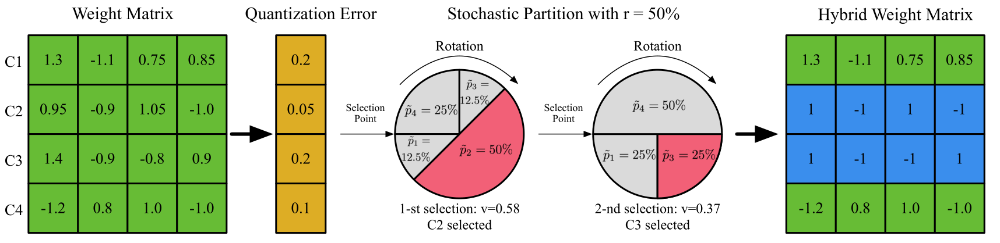
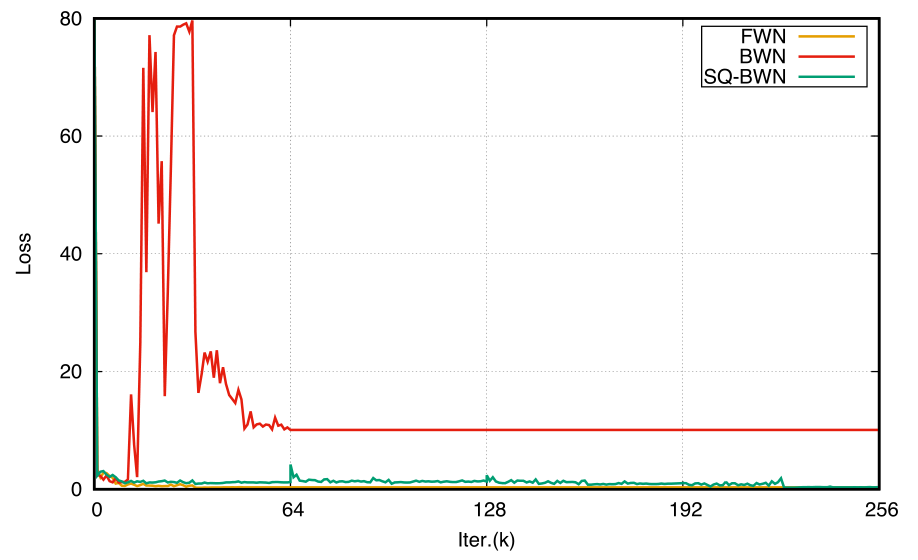
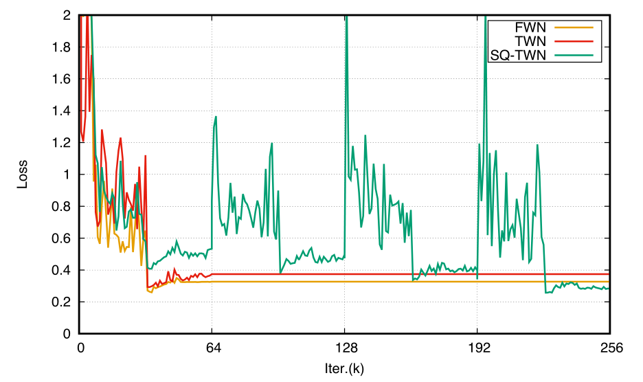

# 使用隨機量化算法量化深度神經網絡

[原文鏈接](https://arxiv.org/abs/1708.01001)

作者：

* Yinpeng Dong \(dyp17@mails.tsinghua.edu.cn\) 計算機科學與技術系，清華大學，北京，中國
* Renkun Ni \(rn9zm@virginia.edu\) 美國弗吉尼亞大學
* Jianguo Li \(jianguo.li@intel.com\) 英特爾實驗室的中國北京，中國
* Yurong Chen\(yurong.chen@intel.com\) 英特爾實驗室的中國北京，中國
* Jun Zhu \(dcszj@mail.tsinghua.edu.cn\) 計算機科學與技術系，清華大學，北京，中國
* Hang Su \(suhangss@mail.tsinghua.edu.cn\) 計算機科學與技術系，清華大學，北京，中國

## 摘要

由於嵌入式應用對存儲需求和計算能力較為苛刻，使得使用較少位數表示深度神經網絡勢在必行。不過，這樣會使得精度有所損失。本文的目的是使用隨機量化\(SQ\)算法來將DNN網絡使用低位數表示。我們使用這種量化方式是基於以下的觀察。現有的訓練算法在將每一次迭代中都近似地將實數值/濾波器彙總在一起，並使用低位表示。有些數值/濾波器的量化損失比較小，但有些卻十分大，這會導致訓練時梯度指向不合適的方向，這會導致精度顯著下降。另外，SQ量化將一部分數值/濾波器量化為低位表示，這裡量化誤差與隨機概率成反比\(其他未量化的值保持全精度\)。每次迭代中，量化和全精度的部分會根據相關的梯度進行更新。SQ率會隨著整個網絡的量化而增加。這個過程中會對量化的誤差進行補償，並且使低位表示的DNN獲取較好的精度。我們用實驗展示了SQ算法，可以在各種數據集和網絡結構下保證\(並提高\)不同位數表示的DNN網絡的精度。

## 1. 算法介紹

深度神經網絡\(DNN\)在大多數機器視覺任務上可以具有顯著的性能提升，例如圖像分類，物體檢測和語法分割。DNN通常具有幾十層或上百層，那其中的參數的數量幾乎是天文數字。因此，使用DNN的系統通常要考慮自身的存儲和計算能力。這就阻礙了DNN應用在資源比較缺乏的系統上的部署，尤其是物聯網領域的嵌入式設備。

很多方法為了減少模型參數的尺寸或計算的複雜度，導致DNN網絡過度冗餘。其中，低位寬深度神經網絡旨在使用少量的位數來表示模型權重，甚至是激活輸出，由於其對模型尺寸和計算量都很有效，所以吸引了很多注意。在二值鏈接\(BNN\)中，權重只有兩個值，+1和-1，並且使用加法和減法來代替乘法，從而加速計算。在《Xnor-net:Imagenet classification using binary convolutional neural networks》這篇論文中，作者將二值權重網絡\(BWN\)的每個濾波器加上特定的縮放因子，並且講這種方法擴展到XNOR-Net\(將權重和激活數據都進行二值化\)。另外，三值權重網絡\(TWN\)增加了0，元素由+1,0和-1表示，使用兩個bit。不過，低位深度神經網絡也被不可忽略的精度下降所困擾，特別是特別大的模型\(比如：ResNet\)。我們認為由於模型的尺寸的原因，導致這些放在每一次訓練迭代是對DNN的權重進行低位量化。並不是所有元素和濾波器的量化誤差都特別小。大誤差的元素和濾波器將會在訓練時將梯度的方向帶跑偏，並且會讓模型收斂與相對較差的局部最小。

除了在訓練時的低位量化方案，這裡同樣也有後量化的方案，也就是對預訓練的全精度模型直接進行量化。這種方法有兩個侷限。首先，其對做分類的DNN網絡較好，不過對於其他類型\(比如：檢測和語法分割\)的網絡就缺乏靈活性。其次，低位量化可作為對局部最小值的量化解決方案或正則約束。不過，將局部最小從全精度量化為低位寬，並做到權重無損，對於後量化方案\(即使有微調\)也是相對困難的。

本文中，我們嘗試對DNN使用隨機量化\(SQ\)算法對上述問題進行攻克。受隨機深度和dropout的影響，SQ算法會在每次迭代時，隨機選擇DNN中的部分權重，並使用低位對其進行量化，不過會保存這部分全精度的數值。選擇概率與量化誤差成反比。我們會逐漸的增加SQ率，直到網絡完全量化。

我們在不同方面對SQ算法進行了一個綜合的調研。首先，我們對選擇粒度的影響進行調研，將濾波器的每個通道看作為隨機選擇的量化結果，要好於將每個權重值進行量化的結果。這是因為濾波器中的每個通道中的權重會互相作用，從而正確表示濾波器的結構，因此當把權重獨立看待時\(濾波器通道中一些權重是量化過的，有些是全精度表示\)，可能會帶來結果的變形。其次，我們比較了輪盤\(_roulette_\)算法和一些具有選擇性的算法進行了比較。輪盤算法選擇量化的值/濾波器其概率與量化誤差成反比。如果量化誤差特別明顯，我們就不能對相應的值/濾波器進行量化，因為量化的話可能帶來不準確的梯度信息。輪盤算法比其他選擇算法好的方面在於，它消除了尋找最佳初始分區的要求，並且由於隨機算法的探索性，使得其有能力為解決方案提供更好的搜索空間。其三，我們對比了不同方法間計算量化與所形成量化誤差比例。其四，我們設計了一種可行的方案用於計算SQ率。

SQ算法普遍適用與任意低位DNN網絡，包括BWN和TWN，等等。實驗表明SQ方法可以提升低位DNN網絡的精度\(二值或三值\)，可使用任意網絡結構\(VGGNet, ResNet等\)，以及任意數據集\(CIFAR，ImageNet等\)。例如，TWN使用SQ算法進行訓練，在很多測試集上能與全精度模型相抗衡。

我們做了如下幾件事：

1. 我們的使用隨機量化\(SQ\)算法克服目前低位DNN訓練算法所存在的精度損失問題。
2. 我們在不同場景對SQ進行綜合調研，比如選擇粒度，劃分算法，量化概率的方法和更新SQ率的方案，這些對於在深度學習領域對其他隨機算法進行研究的人員來說，可能會有較大的幫助。
3. 各種低位設置，網絡架構和測試數據下，我們的方案都對性能有很大的提升。

## 2. 低位深度神經網絡

本節我們先來簡單的介紹幾個典型的低位DNN網絡，包括BNN，BWN和TWN。我們將DNN的第$$l$$ 層表示為$$\mathcal W_l = \{ W_1,...,W_i,...,W_m \}$$ ，這裡的$$m$$表示為輸出通道的數量。$$W_i \in\mathbb{R}^d$$ 用來表示濾波器第$$i$$個通道的權重向量，這裡卷積層中的$$d =n \times w \times h$$，全連接層中的$$d=n$$\(這裡的$$n, w,h$$表示_輸入通道數_，_卷積核寬度_和_卷積核高度_\)。$$\mathcal W_l$$也可以看作為有$$m$$行的權重矩陣，並且每行$$W_i$$都是一個$$d$$維向量。方便起見，我們後面暫時忽略$$l$$。

**二值權重網絡**使用簡單的隨機方式將32位權重向量$$W_i$$使用如下方程量化為二值$$B_i$$：

$$
 (1)\   B_i^j=\left\{
 \begin{aligned}
+1   && \ , p=  \sigma(W^j_i)  \\
-1    && \ ,1 - p \\
 \end{aligned}
 \right.
$$

這裡的$$\sigma(x) = max(0,min(1,\frac{x+1}{2})) $$函數是個稜角分明的S曲線，並且$$j$$為$$W_i$$向量的索引。

訓練階段，算法會將全精度權重和二值化的權重都進行保存。二值化權重用於梯度和前向loss的計算，不過使用全精度權重用於對權重進行更新。

測試階段，使用二值化的權重，能讓模型減少32倍。

**BWN**是一個擴展二值權重網絡，不過要引入實值比例因子$$\alpha \in \mathbb{R}^+$$與$$B_i$$計算可以近似得到全精度向量$$W_i$$ ,$$\alpha$$可以通過求解一個優化方程$$\mathcal{J}=min||W_i-\alpha B_i||$$獲得：

$$
(2) \ B_i =sign(W_i),\alpha=\frac{1}{d} \sum_{j=1}^{d} |W_i^j|
$$

**TWN**在BWN基礎上添加了0，可以通過量化因子$$\alpha$$與三元向量$$T_i \in \{1,0,-1\}^d$$進行計算，可以得到更加靠近原始$$W_i$$權重的向量。同時，又能保證對模型尺寸的高度壓縮\($$16 \times$$\)。$$\alpha$$可以通過求解一個優化方程$$\mathcal{J}=min||W_i-\alpha T_i||$$獲得：

$$
(3) \ T_i^j=\left\{
\begin{aligned}
+1   && ,if \quad W_i^j >\Delta  \\
0 && ,if \quad |W_i^j| \le \Delta \\
-1    && ,if \quad W_i^j <-\Delta \\
\end{aligned}
\right.
\quad ,
\alpha = \frac{1}{|I_{\Delta}|} \sum_{i \in I_{\Delta}}|W^j_i|
$$

這裡的$$\Delta$$是通過下面一些值計算出的一個正閾值：

$$
(4)\ \Delta=\frac{0.7}{d}\sum_{j=1}^d|W_i^j|
$$

$$I_\Delta=\{j||W_i^j|>\Delta\}$$，$$|I_\Delta|$$為$$I_\Delta$$的子集。

## 3. 具體方法

本節，我們會對SQ算法進行詳細的說明。對於已知的低位深度神經網絡我們會逐層進行量化。簡單起見，我們只對網絡中的一層進行處理。我們是要前向和後向過程中對每層中一部分權重進行低位量化，這是為了讓量化信息的損失最小化。

> 圖1：展示了隨機量化的整個過程。要給定一個卷積層的權重矩陣和一個SQ率$$r$$，首先要計算出量化誤差。然後，我們就可以得到濾波器中每個通道\(圖中表示為矩陣的行\)的概率，並且採用基於概率的無替換輪盤算法來對矩陣中的一部分行進行選擇性量化。最後，我們獲得了量化和未量化行的混合矩陣。在訓練過程中，前向和後向傳播的執行都基於這個混合矩陣。

圖1描述了隨機量化算法。我們首先計算量化誤差，然後推算出每個值/濾波器的量化概率$$p$$\(3.2節詳述\)。給定一個SQ值$$r$$，然後隨機的選擇一部分值/濾波器，使用輪盤算法進行量化\(3.1節詳述\)。最後，我們會在3.3節中對訓練過程進行論證。

### 3.1 隨機分配

每次迭代中，每層的權重矩陣為$$\mathcal{W}=\{W_1,...,W_m\}$$，我們將$$\mathcal{W}$$中的行劃分成兩個不相交的組$$G_p=\{W_{q1},...,W_{q_{N_q}}\}$$和$$G_r=\{W_{r_1},...,W_{r_{N_r}}\}$$，這兩個組滿足下述條件：

$$
(5) \ G_q \cup G_r , G_q \cap G_r = \varnothing,
$$

這裡$$W_i \in \mathbb{R}_d$$表示濾波器中的第$$i$$個輸出通道，或權重矩陣$$\mathcal{W}$$的第$$i$$行。這裡我們將$$G_p$$中的權重行量化位低位值，同時$$G_r$$中的權重保持不變。$$G_p$$包括$$N_q$$個數，其個數受限於SQ值$$r(N_q=r\times m)$$。同時，$$N_r =(1-r) \times m $$。SQ值$$r$$會隨著整個量化矩陣$$\mathcal{W}$$的過程逐漸增加，直到對量化網絡的訓練完成。我們為權重矩陣$$\mathcal{W}$$的每行量化概率$$p \in \mathbb{R}^m$$，這裡第$$i$$個元素的概率為$$p_i$$，這個概率即為第$$i$$行的量化概率。量化概率的定義高於量化誤差，將會在3.2節詳述。

給定網絡中每層的SQ值$$r$$和量化概率$$p$$，我們建議使用過使用輪盤算法選擇$$G_p$$中的$$N_q$$行進行量化，同時剩下的$$N_r$$行依舊使用全精度表示。算法1展示了輪盤選擇算法流程。

---

**算法1** 輪盤算法將權重矩陣分成量化值與真實值兩部分

* **輸入**: 所有通道的權重矩陣$$\mathcal{W}$$ 的SQ率$$r$$和量化概率向量$$p \in \mathbb{R}_m$$ 。
* **輸出**: $$G_q$$和$$G_r$$權重組

$$G_q = \varnothing;G_r = \varnothing$$

$$N_q =r \times m;$$

$$for \  i = 1 \ to \ N_q \ do$$

$$Normalize   {p}  \ (with \ {p} = p / ||p||_1);  \ \ \  \triangleright ||p||_1 \ is \ L1 \ norm \ of \ p$$

$$Sample \  a \ random \ value \ v_i \ uniformly \ in \ (0,1];$$

$$Set \ s_i = 0, \ and \ j \ = 0;  \ \ \ \triangleright s_i  \ accumulates \ the \ normalized \ probability$$

$${while} \  s_i < v_i \  {do};$$

$$j=j+1;s_i=s_i+ \hat{{p}_j}; \ \ \  \triangleright  \hat{{p}_j} \ is \ the \ j-th \ element \ p$$

$${end \ while}$$

$$G_q = G_q \cup \{W_j\};$$

$$p_j =0;   \ \ \ \triangleright   avoid \ j \ th \ channels \ being \ selected \ again$$

$$ {end \ for}$$

$$G_r= \mathcal{W} /\ G_q;$$

---

### 3.2 從量化誤差到量化概率

話說回來，我們的這種方法可以緩解由於過大的量化誤差所導致的梯度方向偏差，每個通道的量化概率應該基於量化權重與實際權重之間的量化誤差。如果量化誤差很小，相關通道的量化的信息損失將會非常小，那麼我們就應該給這個通道一個比較大的量化概率。這就意味著量化概率與量化誤差之間成反比關係。

我們用$$W_i$$表示全精度的權重向量，用$$Q_i$$表示這個權重向量的量化版本。簡單起見，這裡省略$$Q_i$$的位寬或縮放係數$$\alpha$$。也就意味著使用$$B_i, T_i$$或$$\alpha B_i, \alpha T_i$$用來表示不同低位DNN網絡。我們根據$$W_i$$和$$Q_i$$的正則$$L_1$$距離來衡量量化誤差：

$$
(6) \ e_i = \frac{||W_i - Q_i||_1}{||W_i||_1}
$$

之後，我們使用計算出來的量化誤差向量$$ {e}=[e_1, e_2, ...,e_n]$$來定義量化概率。量化概率$$p_i$$與$$e_i$$成反比。我們定義了一箇中間變量$$f_i= \frac{1}{e_i + \varepsilon}$$ 來表示這個反比關係，這裡$$\varepsilon$$是一個非常小的值，例如$$10^{-7}$$，加上這個數僅是為了避免除零操作。概率方程$$f_i$$必須是一個單調遞增函數。這裡我們可以考慮四種不同的選擇：

1. 常量函數：對於所有通道使用同一個概率：$$p_i= \frac{1}{m}$$。這樣在對全局使用隨機選擇策略時，就能忽略量化誤差。
2. 線性函數：比如$$p_i = \frac{f_i}{\sum_jf_j}$$。
3. softmax函數：比如$$p_i = \frac{e^{f_i}}{\sum_je^{f_j}}$$。
4. S形函數：比如$$p_i= \frac{1}{1+e^{-f_i}}$$。

我們會在4.2節來展示這四種選擇的性能。

### 3.3 使用隨機量化進行訓練

當我們要應用隨機量化算法去訓練一個低位DNN網絡，其需要四步：

1. 隨機分割權重
2. 前向預測
3. 後向傳播
4. 參數更新

算法2展示了使用隨機量化方式訓練低位DNN網絡的過程。

---

**算法2** 基於SQ的訓練算法

* **輸入**: 迷你批次數據，目標{X, Y}和損失函數$$\mathcal{L}(Y, \hat{Y})$$；權重$$\mathcal{W}^t$$，第t次迭代時的學習率$$\eta^t$$和SQ率$$r^t$$。
* **輸出**: 更新過的$$\mathcal{W}^{t+1}$$，學習率$$\eta^{t+1}$$和SQ率$$r^{t+1}$$

量化$$\mathcal{W}^t$$的每行，並得到量化矩陣 $$\mathcal{Q}^t$$；

if $$r^t$$ &lt; 100% then​

計算量化誤差e；

計算量化概率p；

使用算法1中的$$r^t$$和**p**向量，將$$\mathcal{W}^t$$劃分為$$G_q$$和$$G_r$$ ；

計算得混合矩陣$$ { \mathcal{Q}^t}$$：當$$W_i \in G_r$$ 那麼$$  {Q_i} = W_i$$，否則$$  {Q_i} = Q_i$$ ；

$$else$$

​ $$ {Q^t}=Q^t$$;

$$end \ if$$

$$\hat{Y} = Forward(X,  {\mathcal{Q}^t})$$;

$$\frac{\partial \mathcal{L}}{\partial  { \mathcal{Q}_t}}=Backward(\frac{\partial \mathcal{L}}{\partial \hat{Y}},   { \mathcal{Q}^t })$$

根據等式7更新$$\mathcal{W}^{t+1}$$

$$\eta^{t+1}, r^{t+1} = Update(\eta^t, r^t, t)$$

---

首先，對$$\mathcal{W}$$的所有行進行量化後，得到$$\mathcal{Q}$$。注意我們這裡並沒有指定量化算法和位寬，所以我們的算法可以靚貨的應用於所有的情況。我們之後會通過等式\(6\)計算量化誤差，以及相關量化概率。通過給定的參數，我們使用算法1將$$\mathcal{W}$$劃分為$$G_q$$和$$G_r$$。然後我們就獲得了由量化權重和未量化權重組成的權重矩陣$$ {Q}$$。當$$W_i \in G_q$$時，我們使用$$ {Q}$$中量化的版本$$Q_i$$。否則，我們就直接使用$$W_i$$。$$ {Q}$$與$$\mathcal{Q}$$相比，更接近實際值的量化矩陣$$\mathcal{W}$$，這樣就能提供更加合適的梯度方向。我們使用混合梯度$$\frac{\partial \mathcal{L}}{\partial  { \mathcal{Q}_t}}$$ 在每次迭代時對$$\mathcal{W}$$進行更新：

$$
(7) \ \mathcal{W}^{t+1} = \mathcal{W}^t - \eta^t \frac{\partial \mathcal{L}}{\partial  { \mathcal{Q} ^t}}
$$

這裡$$\eta^t$$是第t次迭代的學習率。這就意味著量化部分可以通過量化後的權重的梯度進行更新，並且未量化部分將使用全精度的梯度進行更新。最後，學習率和SQ率按照預定義的一種規則進行更新。我們將在4.1節介紹這個規則。

當訓練停止，$$r$$將會增加到100%，並且網絡中的所有權值都被量化。這也意味著，最後就沒有必要保留全精度的$$\mathcal{W}$$矩陣了。我們執行前向預測過程時，只需要使用低位量化權重$$\mathcal{Q}$$矩陣進行。

## 4 實際操作

我們使用CIFAR-10，CIFAR-100和ImageNet這種大型的分類網絡的數據，來驗證我們的算法是否有效。我們在兩種低位網絡\(BWN和TWN\)上使用SQ算法，並且展示了其在現存低位DNN的量化優勢。

### 4.1 數據集和實現細節

我們簡單的介紹一下在我們使用該算法時所使用到的數據集，包括相關網絡結構和訓練設置。

* **CIFAR** 其訓練集包括5萬張圖片，測試集包括1萬張圖片，每張圖片都是彩色圖片，分辨率為$$32 \times 32 $$ ，在CIFAR-10中圖片分為10類，在CIFAR-100中圖片分為100類。我們兩種分類都進行了測試。首先使用的是VGGNet網絡，表示為VGG-9，其結構為“\(2 x 64  C3\) - MP2 - \(2 x 128  C3\) -MP2-\(2 x 256  C3\) - MP2 - \(2 x 512  FC\) - 10/100  FC - Softmax”。網絡使用SGD方式作為訓練方案，衰退率為0.9，權重衰退為0.0001，並且批量尺寸為100。我們在網絡中未使用增強的方式。我們其實的學習率為0.1，每1.5萬次迭代就除以10，訓練一共迭代10萬次。第二個網絡是ResNet-56期架構就不詳述了。
* **ImageNet** 是一個大型的數據分類數據集。我們使用ILSVRC 2012數據集，其具有128萬張訓練圖片，其中有1000個類別。我們使用5萬張交叉驗證圖片對網絡性能進行評估。我們使用了AlexNet的一個變種，其架構帶有批量歸一化\(AlexNet-BN\)和ResNet-18。我們使用SGD\(衰退率為0.9，權重衰退為$$5 \times 10^{-5}$$\)，並且批次尺寸為256。初始化學習率為0.01，在第10萬、15萬和18萬次迭代時學習率除以10，訓練一共迭代20萬次。在AlexNet中使用批歸一化，是為了得到更快的收斂速度和更好的穩定性。ResNet-18使用SGD方法進行訓練，批次尺寸為100，衰退參數與AlexNet-BN相同。學習率初始化為0.05，在錯誤平穩期除以10，訓練一共迭代30萬次。

我們基於Caffe框架來實現我們的算法，並且在訓練和測試時使用nVidia Titan X GPU進行測試。我們對比了全精度權重網絡\(FWN\)，二值權重網絡\(BWN\)和三值權重網絡\(TWN\)。我們將使用SQ算法訓練過的二值和三值網絡表示為SQ-BWN和SQ-TWN。對於CIFAR-10和CIFAR-100來說，我們對比了基於VGG-9和ResNet-56網絡的FWN，BWN，TWN，SQ-BWN和SQ-TWN。對於ImageNet，我們將上5個網絡與AlexNet-BN和ResNet-18網絡架構進行了比較。

SQ率$$r$$在我們的算法中是一個很關鍵的超參，其會逐步的增加到100%\(表示有多少網絡權重被量化\)。在這個網絡中，我們將訓練分成好幾個階段，每個階段所使用的$$r$$相同。當訓練到達某個階段，我們會增加$$r$$的值，並且進入下一個階段，直到最終階段$$r=100\%$$。我們將會在4.2節中使用剃刀研究的方式對SQ率進行更新。我們使用了另一種簡化的方法，就是對於同一訓練階段的所有層，其$$r$$值相同。當SQ算法應用於低位網絡的訓練時，其訓練迭代次數為原始迭代次數的s倍，這裡的s表示SQ階段數，在每個階段的迭代次數都相同\(雖然我們並不需要這麼多次數來達到收斂\)。

### 4.2 剃刀研究

有很多因素會影響到我們算法的結果，包括選擇粒度、分割算法、量化概率方程和SQ率更新的方式。因此，我們對這些因素設計了一些實驗，並且分析了其對我們算法的影響。所有剃刀研究都是基於ResNet-56網絡和CIFAR-10數據集。考慮到這些因素的互相作用，我們採用變量控制的方法來減輕我們的負擔。選擇粒度、分割算法、量化概率方程和SQ率更新的方式默認都是對通道級別的，隨機分割\(輪盤\)、線性函數和訓練的四個階段的SQ率r分別為50%, 75%, 87.5%和100%。

**通道級別量化** vs. **元素級別量化**

我們首先研究量化粒度對性能的影響。我們採用了兩種策略，通道級和元素級，結果在表1中展示。元素級選擇忽略了濾波器結構和通道內元素的相互作用，這都是會導致低精度的原因。通過將每個濾波器的通道看做一個整體，我們可以保持通道的結構，並獲得較高的精度。

|  | 通道級 | 元素級 |
| :---: | :---: | :---: |
| SQ-BWN | **7.15** | 7.67 |
| SQ-TWN | **6.20** | 6.53 |

> 表1：選擇粒度的測試誤差\(%\) \[使用ResNet-56網絡和CIFAR-10數據集\]

**隨機選擇** vs. **確定分割** vs. **固定分割**

我們的算法使用基於輪盤算法的隨機分割方式，來選擇$$N_q$$行被量化。我們認為，隨機劃分可以消除初始化後尋找最佳分區的要求，並且具有開拓性的探索空間，可尋求更好的解決方案。為了證明，我們比較了純隨機方法和其他兩種非完全隨機的方式。第一個為確定性方式，其使用了基於排序的分割。給定SQ率r和量化誤差向量e，我們將權重矩陣按照向量e進行排序，然後每次迭代時，選取誤差最小的$$N_q$$行作為$$G_q$$。另一種是固定選擇方式，這裡我們只在第一次迭代時進行輪盤分割，並且保持$$G_q$$和$$G_r$$在整個訓練過程中固定。

表2展示了對比結果。其顯示隨機方式對於BWN和TWN要明顯好於其他兩種方式，這也就證明了隨機分割對於這個算法的成功來說十分重要。另一個插值方式是將隨機量化正規化，這也有利於性能。

|  | 隨機分割 | 確定分割 | 固定分割 |
| :---: | :---: | :---: | :---: |
| SQ-BWN | **7.15** | 8.21 | \* |
| SQ-TWN | **6.20** | 6.85 | 6.50 |

> 表2：不同分割方式的測試誤差\(%\) \[使用ResNet-56網絡和CIFAR-10數據集\]。其中\*表示沒有覆蓋到。

**量化概率方程**

在3.2節中，我們介紹了四種量化概率方程，可用於計算量化誤差。分別為常數、線性、softmax和S形方程。我們比較的結果如表4所示。在這些選擇中，線性方式因具有更好的性能擊敗了其他幾種方式，並且這是一種非常簡單的方式。我們發現不同方程的性能都很接近，這表明這項可能對隨機分割速算法影響不大。

|  | 線性 | 常量 | Softmax | S型 |
| :---: | :---: | :---: | :---: | :---: |
| SQ-BWN | **7.15** | 7.44 | 7.51 | 7.37 |
| SQ-TWN | **6.20** | 6.30 | 6.29 | 6.28 |

> 表4：給定的四種量化概率方程所得到的測試誤差\(%\) \[使用ResNet-56網絡和CIFAR-10數據集\]

**更新SQ率的策略**

我們也對更新SQ率的方式進行了研究。我們假設訓練使用隨機量化，並且會分割成很多階段，並且每個階段都有固定的SQ率。在這樣的設置下，我們使用四個SQ率50%，75%，87.5%和100%。我們稱這為指數方式\(Exp\)，為量化部分是之前階段的一半。我們將我們的結果與其他兩種方式進行了比較：平均方式\(Ave\)和微調方式\(Tune\)。平均方式包括了5個階段，SQ率為20%，40%，60%，80%和100%。微調方式嘗試使用微調預訓練的全精度模型，其中階段與指數方式相同，而非重頭開始。

表3展示了我們比較的結果。指數方式很明顯的要好於其他兩種方式。使用我們的方法最好是重頭進行訓練。

|  | Exp | Ave | Tune |
| :---: | :---: | :---: | :---: |
| SQ-BWN | **7.15** | 7.35 | 7.18 |
| SQ-TWN | **6.20** | 6.88 | 6.62 |

> 表3：使用不同方式更新SQ率所得到的測試誤差\(%\) \[使用ResNet-56網絡和CIFAR-10數據集\]

### 4.3 性能測試

我們在BWN和TWN上，使用CIFAR-10，CIFAR-100和ImageNet數據集對SQ算法和傳統算法進行比較。為了公平起見，我們為其設置了相同的學習率、優化方法、批次尺寸等參數。我們對使用SQ方式的實驗使用最佳配置\(通道級量化選擇，隨機劃分，線性量化概率方程和指數SQ率更新方式\)。

表5展示了使用CIFAR-10和CIFAR-100的結果。在這兩個例子中，SQ-BWN和SQ-TWN性能極大的超越了BWN和TWN，特別在ResNet-56上，這個網絡比較深，而且其梯度容易被量化後的權重所造成的誤差所影響。例如，使用ResNet-56網絡結構，配合CIFAR-10數據集，SQ-BWN的精度要比BWN高9.27%。具有2位的SQ-TWN模型甚至可以獲得比全精度模型更高的準確率。我們的結果展示了，SQ-TWN相對於全精度的模型，分別將精度提升了0.63%\(VGG-9網絡，CIFAR-10數據集\), 0.49%\(ResNet-56網絡，CIFAR-10數據集\)和0.59%\(ResNet-56網絡，CIFAR-100數據集\)。

|  |  | CIFRA-10 | CIFRA-10 | CIFRA-100 | CIFRA-100 |
| :---: | :---: | :---: | :---: | :---: | :---: |
|  | Bits | VGG-9 | ResNet-56 | VGG-9 | ResNet-56 |
| FWN | 32 | 9.00 | 6.69 | 30.68 | 29.49 |
| BWN | 1 | 10.67 | 16.42 | 37.68 | 35.01 |
| SQ-BWN | 1 | 9.40 | 7.15 | 35.25 | 31.56 |
| TWN | 2 | 9.87 | 7.64 | 34.80 | 32.09 |
| SQ-TWN | 2 | **8.37** | **6.20** | 34.24 | **28.90** |

> 表5：5中不同組合間的測試誤差\(%\)比較。我們的SQ算法依舊具有很好的效果。SQ-TWN的精度甚至超過了全精度模型。

圖2和圖3展示了ResNet-56網絡在CIFAR-10上的測試損失曲線。

> 圖2：FWN，BWN和SQ-BWN使用ResNet-56網絡和CIFAR-10數據集的測試損失。

> 圖3：FWN，TWN和SQ-TWN使用ResNet-56網絡和CIFAR-10數據集的測試損失。

圖2中BWN的損失比SQ-BWN高很多，SQ-BWN和FWN相對就要低很多。圖3中，我們可以看到每個階段的開始，量化更多的權重意味著就有更大的損失。最後，SQ-TWN會得到比FWN更低的損失，同時TWN的損失要比FWN高很多。

表6展示了在標準ImageNet的5萬交叉驗證集上的結果。

|  |  | AlexNet-BN | AlexNet-BN | ResNet-18 | ResNet-18 |
| :---: | :---: | :---: | :---: | :---: | :---: |
|  | Bits | top-1 | top-5 | top-1 | top-5 |
| FWN | 32 | 44.18 | 20.83 | 34.80 | 13.60 |
| BWN | 1 | 51.22 | 27.18 | 45.20 | 21.08 |
| SQ-BWN | 1 | 48.78 | 24.86 | 41.64 | 18.35 |
| TWN | 2 | 47.54 | 23.81 | 39.83 | 17.02 |
| SQ-TWN | 2 | 44.70 | 21.40 | 36.18 | 14.26 |

> 表6：AlexNet-BN和ResNet-18 在5中不同的組合下，使用ImageNet數據集的測試誤差\(%\)。

我們比較了SQ-BWN, SQ-TWN，FWN， BWN和帶AlexNet-BN的TWN和ResNet-18架構，所有的錯誤都只對圖片進行了中心縮放。這展示了我們的算法對於提升性能有很大的幫助，甚至有些能超過全精度基線。我們可以看到SQ-TWN的結果更加接近FWN。這裡需要注意有些方法會保證網絡的第一層和最後一層為全精度，這是為了緩解精度損失。雖然我們沒那樣做，但是SQ-TWN也能達到近似全精度模型的精度水平。所以，我們的結論是，SQ算法能有效地提高網絡性能。

## 5 總結

本文旨在使用SQ算法獲得低位的高精度DNN網絡。在每次迭代中，我們基於輪盤算法對權重進行隨機選取後量化，同時我們保證其餘的權重為全精度表示。混合權重能提供更好的梯度指向，並達到較好的局部最小值。我們證明了我們的算法在比較低的位數時，對於算法有較為有效的提升。我們的代碼在github上開源，可以訪問  [https://github.com/dongyp13/Stochastic-Quantization](https://github.com/dongyp13/Stochastic-Quantization) 獲得源碼。未來我們會考慮將隨機量化算法應用到權重以及激活輸出端。

## 鳴謝

Yinpeng Dong和Renkun Ni在Intel實驗室實習時完成，他們的導師是Jianguo Li。Yinpeng Dong, Jun Zhu和Hang Su也得到了中國國家重點基礎研究發展計劃項目\(2013CB329403\)和中國國家自然科學基金\(61620106010, 61621136008\)的支持。

