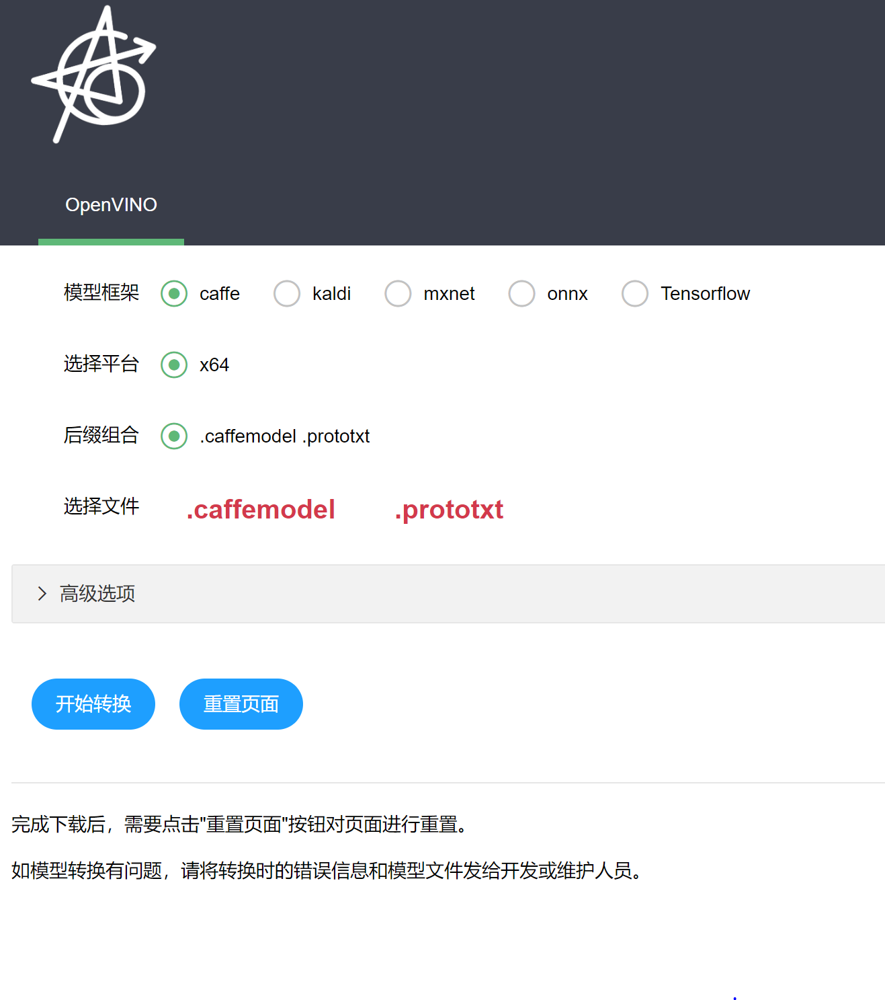

# OpenVINO Model Convert Website

The Website tool for OpenVINO model convert.

Backend: Python(flask)

Frontend: [Layui]( https://www.layui.com/ )(js and css)

It look like below:

## Environment

1. Need Python 3.x.
2. Install Flask: `pip install flask`
3. Make sure the OpenVINO model optimizer dependencies have been install. 
   * Go to `<Openvino_Install_Dir>/deployment_tools/model_optimizer`, and see some `requirements_xxx.txt`. Use `pip -r requirements_xxx.txt`  install the model optimizer dependencies.
   * Go to `<Openvino_Install_Dir>/python`, install the dependencies in `requirement.txt`
4. Chrome browser is best, other may be well.(not tested other browsers)

## How to use it

1. Download OpenVINO binary Release package from intel [official website]( https://software.intel.com/en-us/openvino-toolkit ) (Free), and install the package content to your local environment.
2. To `<Openvino_Install_Dir>/bin`, such as `G:\xiaowei\software\openvino\openvino_2019.3.379\bin` or `/opt/intel/openvino`. And run the `setupvars.bat` or `setupvars.sh` in console. Don't close the console after setup variables.
3. Go to this repository directory in above 2rd step console, and run `python converter.py` or `python3 converter.py`, the website is running.
4. The default address and port is 0.0.0.0/5002. 
   * if you want to access it by local, typing `127.0.0.1:5002` in browser，you you will see the web page like above image.
   * if you want to remote accessing it, typing `<host_ip>:5002`，you will see the page.

## Contribution

En... I am not a professional Website Frontend engineer, so this page is not very prefect. 

When I do something research for OpenVINO, this tool would save more time for me. I open source it for helping others which do OpenVINO researching.

If you have good idea for this tool, welcome to pull request this repo. Thank you! 