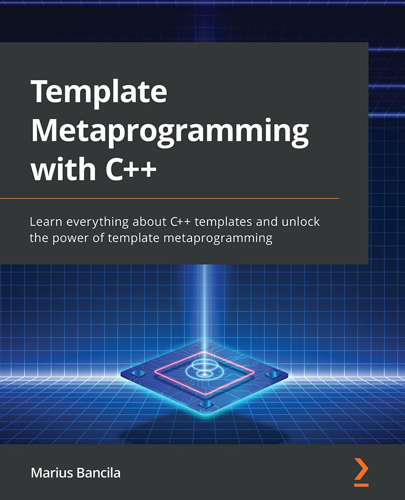

# Template Metaprogramming with C++  

*Learn everything about C++ templates and unlock the power of template metaprogramming*

*詳細的瞭解C++模板，釋放模板元編程的力量*

 

* 作者：Marius Bancila   
* 譯者：陳曉偉
* 首次發佈時間：2022年8月29日([來源](https://www.amazon.sg/Template-Metaprogramming-template-metaprogramming-efficient/dp/1803243457/ref=sr_1_1?keywords=Template+Metaprogramming+with+C%2B%2B&qid=1671973833&sr=8-1))

> 翻譯是譯者用自己的思想，換一種語言，對原作者想法的重新闡釋。鑑於我的學識所限，誤解和錯譯在所難免。如果你能買到本書的原版，且有能力閱讀英文，請直接去讀原文。因為與之相較，我的譯文可能根本不值得一讀。
>
> 
 — 雲風，程序員修煉之道第2版譯者

PDF可在本庫的[Release頁面](https://github.com/xiaoweiChen/Template-Metaprogramming-with-CPP/releases)獲取。

## 本書概述

瞭解元編程，可以創建在編譯時進行計算的數據結構和函數。本書將帶您瞭解如何使用模板避免編寫重複的代碼，以及其為什麼會成為通用庫(如標準庫或Boost)的關鍵(通用庫可用於很多程序中)。

本書將深入瞭解模板和元編程的基礎知識，再練習編寫複雜的模板，並探索高級概念，如模板遞歸、模板參數推導、轉發引用、類型特徵和條件編譯。這個過程中，將瞭解如何編寫可變參數模板，以及如何使用C++20約束和概念為模板參數進行限制。最後，可以使用C++元編程模板來實現各種元編程模式。

本書的最後，將學習如何在日常編程中編寫有效的模板和實現元編程。

#### 關鍵特性

- 瞭解C++20的最新特性，並使用STL編寫更好的代碼

- 減少應用程序的開發時間，可以更快的進行部署
- 使用最新標準中引入的新而精簡的STL功能

#### 將會學到

- 類型模板的語法

- 特化和實例化如何工作

- 模板參數推斷和轉發引用

- 編寫可變參數見模板

- 熟悉類型特徵和條件編譯

- 用約束和概念限制C++20中的模板參數

- 實現CRTP、Mixins和標籤分派等模式

  

## 適讀人群

這本書是為初學者到中級C++開發人員(想要學習和了解模板元編程的人員)，以及高級C++開發人員(希望瞭解與模板相關的新C++20特性和各種習語和模式)。閱讀這本書之前，需要有基本的C++編程經驗。

## 作者簡介

Marius Bancila是一名軟件工程師，為工業和金融部門開發解決方案方面，擁有近20年的經驗。他是《現代C++挑戰》的作者和《學習C\#編程》的合著者。並且是一名軟件架構師，專注於Microsoft技術，主要使用C++和C\#開發桌面應用程序。熱衷於分享其技術專長，自2006年以來，他一直是微軟C++和開發人員眼中的技術MVP。Marius住在羅馬尼亞，並且活躍在各種網絡社區

## 本書相關

* github地址：https://github.com/xiaoweiChen/Template-Metaprogramming-with-CPP
* 譯文的LaTeX 環境配置：https://www.cnblogs.com/1625--H/p/11524968.html 
  * 禁用拼寫檢查：https://blog.csdn.net/weixin_39278265/article/details/87931348

* vscode中配置latex：https://blog.csdn.net/Ruins_LEE/article/details/123555016
* 原書示例：https://github.com/PacktPublishing/Template-Metaprogramming-with-CPP

