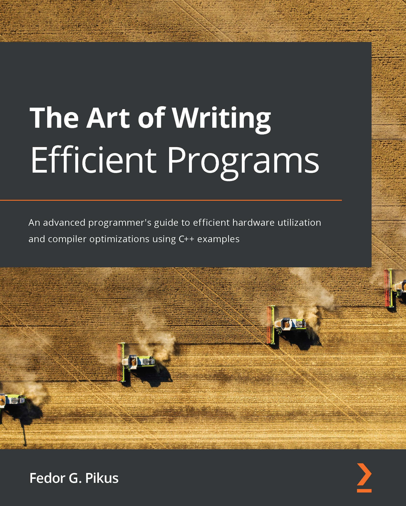

# The Art of Writing Efficient Programs

An advanced programmer's guide to efficient hardware utilization and compiler optimizations using C++ examples

(*一本高級編程指南，使用C++介紹如何高效利用硬件和編譯器優化*)

* 作者：Fedor G. Pikus

* 譯者：陳曉偉

* 首次發佈時間：2021年10月22日([來源](https://www.amazon.com/Art-Writing-Efficient-Programs-optimizations/dp/1800208111/ref=sr_1_1?crid=3TMU5SFAS6D5M&keywords=The+Art+of+Writing+Efficient+Programs&qid=1643976993&sprefix=%E7%BE%8E%E5%9B%BD%E4%BA%9A%E9%A9%ACthe+art+of+writing+efficient+programs%E9%80%8A%2Caps%2C657&sr=8-1))

> 翻譯是譯者用自己的思想，換一種語言，對原作者想法的重新闡釋。鑑於我的學識所限，誤解和錯譯在所難免。如果你能買到本書的原版，且有能力閱讀英文，請直接去讀原文。因為與之相較，我的譯文可能根本不值得一讀。
>
> 
 — 雲風，程序員修煉之道第2版譯者

## 本書概述

*掌握各種性能提升技術，如併發性、無鎖編程、原子操作、並行性和內存管理。*

性能自提升的時代結束了，以前隨著CPU的升級，程序本身的速度也在加快，現在情況不一樣了。新架構的處理器時鐘頻率幾乎達到了峰值，對現有的程序性能上的改進並不多。雖然處理器的體積更大、性能更強，但這些能力的都在增多的核數和其他的計算單元上消耗掉了。為了編寫高效的軟件，現在的開發者必須瞭解如何利用現有的計算資源進行編程，這本書將說明如何做到這一點。

這本書涵蓋了編寫高效程序的主要方面：高效地使用CPU資源和內存，避免不必要的計算，性能測試，以及如何充分利用併發性和多線程。還會瞭解編譯器優化，以及如何更有效地使用編程語言(C++)。最後，瞭解設計決策如何對性能產生影響。

讀完這本書，可以利用處理器和編譯器的知識來編寫高效的程序，還能夠理解使用這些技術和在提高性能時如何進行測試。而本書的核心在於學習的方法論。

#### 關鍵特性

- 瞭解現代CPU的侷限性及對性能的影響
- 瞭解如何避免編寫效率低下的代碼，並使用編譯器進行優化
- 瞭解編寫高性能程序需要權衡策略和成本

#### 內容綱要

- 瞭解如何有效地使用程序中的硬件計算資源
- 理解內存序和內存柵欄之間的關係
- 熟悉不同數據結構和組織方式對性能的影響
- 評估併發內存訪問對性能的影響，以及如何將影響最小化
- 瞭解何時使用和不使用無鎖編程技術
- 探索提高編譯器優化效率的不同方法
- 為避免效率低下的開發，針對併發和高性能數據結構設計API

## 適讀人群

這本書是為有經驗的開發人員和程序員編寫的，他們從事對性能至關重要的項目，並希望學習不同的技術來提高代碼的性能。屬於算法交易、遊戲、生物信息學、計算基因組學或計算流體動力學社區的開發者，可以從這本書中學習各種技術，並將其應用到他們的工作領域中。

雖然本書使用的是C++語言，但本書的概念可以很容易地轉移或應用到其他編譯語言，如C、Java、Rust、Go等。

## 作者簡介

**Fedor G. Pikus**是Mentor Graphics公司(西門子公司)硅設計部門的首席工程科學家。他曾在谷歌擔任高級軟件工程師，在Mentor Graphics擔任Calibre PERC、LVS、DFM的首席軟件架構師。1998年，他從計算物理的學術研究轉向軟件行業，加入Mentor Graphics。Fedor是高性能計算和C++方面公認的專家，他的作品在CPPCon, SD West, DesignCon, Software Development Journal上進行過展示，也是O'Reilly的作者。作為首席科學家，他的職責包括規劃Calibre產品的長期技術方向，指導和培訓從事這些產品、軟件設計和架構的工程師，以及研究新的設計和軟件技術。Fedor在物理學、EDA、軟件設計和C++語言方面擁有超過25項專利和超過100篇論文和會議報告。

> 我要感謝我的妻子加林娜(Galina)，我的兒子亞倫(Aaron)和本傑明(Benjamin)，他們支持和鼓勵我，對我信心十足，還有我的貓維尼(Pooh)，也會在我需要的時候鼓勵我。
>
> 
 —Fedor G. Pikus

## 審評者介紹

**Sergey Gomon**在12年前在白俄羅斯國立大學信息和無線電電子學院的人工智能系，開始了他的IT之旅。他在網絡編程、信息安全、圖像處理等多個領域擁有大約8年使用C++的工業編程經驗。他目前在N-able工作，是CoreHard C++社區的活躍成員。

## 本書相關

* github翻譯地址：https://github.com/xiaoweiChen/The-Art-of-Writing-Efficient-Programs
* 譯文的LaTeX 環境配置：https://www.cnblogs.com/1625--H/p/11524968.html 

