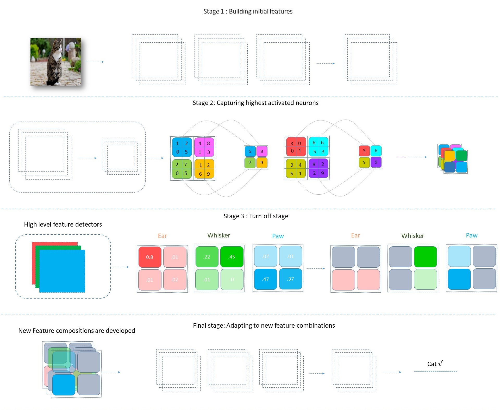

# 深度卷積網絡的原理設計：一個簡單的SimpNet

[原文鏈接](https://arxiv.org/pdf/1802.06205.pdf)

作者：

 * Seyyed Hossein Hasanpour 
* Mohammad Rouhani
* Mohsen Fayyaz
* Mohammad Sabokrou 
* Ehsan Adeli

譯者：

* 陳曉偉

## 摘要

近年來，卷積神經網絡(CNN)獲得非常重大的成功，其代表就有VGGNet、ResNet和DenseNet等等，不過這些模型的參數達到了上億個(幾億到幾十億不等)，這就需要更加關注網絡推算所需要的計算資源，以及網絡所佔用的內存開銷。由於這些現實的問題，限制了其在訓練和優化的應用。這時，輕量級架構(比如：SqueezeNet)的提出，志在解決以上的問題。不過，要在計算資源和高效運行之間進行權衡，就會碰到精確度不高的問題。網絡低效的問題大部分源自於架構的點對點設計。本文在討論過程中會為構建高效的架構提出幾個原則，並會闡述在設計網絡結構過程中對於不同方面的考慮。此外，我們還會介紹一個新層——*SAF-pooling*，在加強網絡歸一化能力的同時，通過選擇最好的特徵保持網絡的簡單性。根據這些原則，我們提出一個簡單的網絡架構，稱為*SimpNet*。*SimpNet*架構根據提到的原則設計，其在計算/存儲效率和準確性之間有很好的折衷。*SimpNet*在一些知名性能測試集上的表現，要優於那些更深和更復雜的架構，比如VGGNet、ResNet和WideResidualNet等，並且在參數和操作數量上要比這些網絡少2~25倍。同時，我們在一些測試集上獲得了很不錯的結果(在模型精度和參數數量平衡方面)，比如CIFAR10，CIFAR100，MNIST和SVHN。*SimpNet*的實現可以在這裡看到：https://github.com/Coderx7/SimpNet

## 索引詞

深度學習，卷積神經網絡，簡單網絡，分類，效率

### 1. 介紹原因

自從神經網絡復興以來，深度學習在不同應用領域中都獲得了巨大的成功，其中包括語義分割、分類、物體識別、圖像標註和自然語言處理[1]。卷積神經網絡能在給定的數據中發現複雜的結構，並且以分層的方式對數據進行表示[2-4]，對於表徵學習來說是一大利器。因此，神經網絡結構中，很少有人工設置的參數。最近，神經網絡結構發展的共同之處在於其深度和複雜度都在不斷的增加，使給定的任務能獲得更好的準確性。2015年，大規模視覺識別競賽(ILSVRC)[5]的冠軍是ImageNet，其成功之處在於使用了一個具有152層的深層次結構[2]，當年的亞軍也有非常深的結構[3]。這種讓網絡更深的趨勢，一直沿襲至今[6-9]。

隨著網絡結構的加深，為了提高辨別能力，需要更多的計算資源和內存開銷參與網絡推算，這也使得這些網絡很難用於實際應用，或對其結構進行擴展。所以，我們會對現存的學習算法進行改進，比如：不同的初始化方式[10-13]、歸一化和正則化[14-18]、非線性[11, 19-21]和數據增強[4, 14, 22–24]。當在一個性能良好的結構中使用這些方法，那麼會受益匪淺。不過，這些方法中可能會消耗更多的計算資源或增加內存開銷[6, 15, 16]。因此，特別希望設計出具有低複雜度(少量的層數和參數)的高效網絡結構，並且效果與那些更深和更復雜的網絡結構一樣。具有了這樣高效的架構，再用剛才提到的方法進行調整，就能獲得更好的效果。

設計性能良好的網絡結構也有一些關鍵性的原則，每個原則所對應的目標有所不同，將這些原則結合起來，則能對網絡的各個方面進行補強。原則性方法具有允許粒度調優和自動化結構設計的優點。換言之，已經通過驗證的設計原則可以用來實現一個定製化的架構，或將這些原則應用在網絡架構的不同方面。另外，這種有策略的設計方式能有效的展示哪些方面對當前網絡結構更具有影響力，並且可以更好的修正當前網絡結構中存在的問題，而不會對主要問題有所偏離，或是去針對影響力較小的方面。這種影響就是可以通過相關研究，使用優化的算法來創建一個網絡結構。因具有更好的識別感知，相關領域的知識可以轉移到算法中去。比如，Google的AutoML就旨在自動化的設計機器學習模型[25]。

本文中，我們會介紹一些設計原則，創建一個條用於建立符合預期目標網絡結構的路線圖。我們會對結構的不同方面進行詳細的描述，例如：不同的池化操作、卷積核大小和深度等等，為架構底層組件提供良好的洞察力。根據提出的原則，我們提出了一種的新操作，名為SAF-pooling，其能提升網絡的辨識能力。這層中，我們強制網絡通過對最高激活值進行池化，從而學習到更加強健的特徵。這裡的“最高激活值”指的是與特定類強相關的特徵，並在之後會隨機的對這些特徵進行關閉。這個過程中，我們模擬了由於遮擋、視點變化、光照變化等原因造成特徵不全的情況，因此網絡必須通過找到新的特徵檢測器來適應這些情況。

考慮這些原則的原因是因為我們要構建一個新的SimpNet架構，這個架構必須是簡單並高效的。為了展示這些原則的高效性，我們會在4個主流的性能數據集(CIFAR10/100、SVHN和MNIST)上進行測試，結果顯示我們的架構要優於那些更深、更復雜的網絡結構，並且我們的架構減少了2~25倍的參數數量。除此之外，我們也對每個原則的進行了大量的測試，就是為了證明其必要性。簡單且高效的架構(比如SimpNet)會對這些原則尤為重視。這些原則為很多場景提供了高效和理想的模型架構，特別是對移動端設備(比如無人機、手機)，嵌入式系統(物聯網應用)，雲邊上的人工智能(AI)和深度學習(DL)應用(比如：從雲中獲取AI和DL應用到端點設備)。這種網絡架構在未來可以使用[26,27]中提到的壓縮方法進行壓縮，這樣對存儲器和處理器的要求會有大幅度的下降。我們想要避免設計的混亂，所以採用簡單和基礎的方法進行設計。這樣我們的注意力就不會被其他因素所幹擾，集中精力關注這些原則，確定其對性能的影響。否則，工作量就會變得很大，需要面對許多來自不同方面的挑戰，從而導致工作週期拉的很長，並且有可能沒法去確定哪些因素才是真正重要的原則，從而導致遠離初心，偏離主題。因此，解決方法就是從現有的文獻中找尋相關的方法，並對這些方法分別進行研究。通過這種方式，在模型表現的比較理想的情況下，放鬆對模型的約束(受一些文獻中的方法的啟發)，這樣不需要太大的功夫就能進一步的對性能進行提升。當然，性能的提升與框架設計的水平直接相關。拙劣的設計因為其先天的缺陷，從而無法利用這些原則性的優勢達到加速的效果。

本文剩餘內容的組織方式：第2節，會對相關工作進行介紹；第3節，會展示我們設計的原則；第4節，展示根據我們的原則設計的SImpNet框架；第5節，展示4大數據集(CIFAR10/100、SVHN和MNIST)的實驗結果，網絡結構的細節和對於每個數據集預訓練的不同之處；第6節，對當前工作的總結，以及對未來發展的展望。

### 2. 相關工作

這一節中，我們將分為兩小節來回顧一下網絡的最新趨勢和相關工作。據我們所知，目前幾乎沒有對通用網絡架構設計原則的研究。[8, 28, 29]在我們之前對適合於特定場景原則或策略進行過研究，雖然其中有一些原則可以應用於其他架構，但大多數的原則還是隻適用於某個特定的框架結構，所以不會在其他的場景進行測試或實驗。[30]中只是列出了一些以前使用過的技術，而沒有更廣義的討論其有效性和可用性。其只是一個有關使用了哪些技術的報告，並沒有說明這些技術在不同情況下的有效性。從方向性上說，[28]與我們的工作最為相似。接下來，我們就簡單的聊聊這些年網絡結構發展的總體趨勢。

#### A. 網絡複雜性

從神經網絡出現以來，人們都在積極地設計更為有效的網絡結構[31-33]。因此出現了更加深層、更加複雜的網絡結構[2-4, 6, 9, 22, 34-37]。第一群吃螃蟹的Ciresan等人[34]使用GPU訓練了一個9層的*多層感知器*(MLP,  multi-layer precenteron)，然後其他的研究人員也接踵而至[2-4, 6, 9, 21, 34-38]。在不同的研究領域中，有一些實踐標準在創建和設計網絡架構上起著非常重要的作用。2012年時，Krizhevsky等人[22]創建了一個8層版本的LeNet5，稱為AlexNet[39]。相較於LeNet5，AlexNet添加了一種新的歸一化層稱為局部對比歸一化(譯者：我看到的資料都是添加了"局部響應歸一化"(LRN))，和使用校正線性單元(ReLU)[21]作為非線性激活函數，用來取代原始的雙曲正切方式(比如：Tanh)。當然，還有一個新的正則化層，稱為Dropout層[40]。這個網絡在ILSVRC 2012[5]測試集上，在當時達到了世界領先水平。2013年時，Lin等人[41]在論文中引入了一種新的概念，其方式與已經建立好的網絡發展趨勢完全不同。他們提出的這個概念叫做*網中網*(NIN, network-in-network)，使用一個1x1的濾波器在卷積神經網絡中構建微型神經網絡，並用全局池化作為結構化正則來代替全連接層，顯式的將特徵圖轉換成置信圖，並在CIFAR10數據集上達到了當時領先世界的水平。2014年時，Simonyan等人設計的VGGNet[4]引用了幾種網絡結構，其深度從11層增加到19層，並且表明網絡的層級越深，效果越好。也使用了3x3卷積層，並說明使用小尺寸濾波器對非線性有更好的擬合性，同時能獲得更好的精度。同年，受NIN結構的啟發產生了一種新的網絡結構GoogLeNet[3]，56個卷積層構成了一個具有22個模塊化層級的網絡。模塊是由幾個1x1，3x3和5x5卷積層構成，這種結構稱為Inception模塊。與以往的網絡結構相比，這種結構極大的減少了模型參數的數量，並且在ILSVRC測試中刷新了記錄。新的Inception版本中，5x5的卷積層被替換成兩個連續的3x3卷積層。網絡中使用批量歸一化[16]可以減少網絡內部協變量的偏移；這種方法在訓練深層網絡結構是十分重要的，並在ImageNet的挑戰中刷新了當時的最好成績。

2015年時，He等人[11]使用VGGNet19[4]再次刷新了ILSVRC的成績，其使用參數化ReLU層(PReLU)來替代ReLU，從而改進了模型的擬合性。其還引入了一種新的初始化方法，從而能用來增強新非線性激活層的性能。網絡層間的連通性在當時是一個全新的概念，其目的就是增強網絡中的梯度傳遞和信息流。相關原理在[2]和[37]中有詳細介紹。[2]中會對殘差塊進行介紹，說明哪些結構適合殘差映射。在前人的研究基礎上，他們成功的訓練出從152層到1000層的極深網絡結構，並再次刷新了ILSVRC的成績。同樣，[37]中提出了一個遞歸神經網絡(即使用自適應門單元調節網絡中的信息流)，其靈感來自於長短期記憶(LSTM)。這種遞歸神經網絡也成功的訓練出從100層到1000層的網絡。

2016年時，Szegedy等人[7]將殘差鏈接與Inception-V3結構相結合，得到了更好的效果。他們也給出了相關經驗證明，使用殘差鏈接對Inception進行訓練，可以顯著的加速訓練速度，並且具有殘差版本的Inception網絡的性能與原始版本的Inception網絡差不多。隨著網絡的發展， ILSVRC 2012分類任務[5]在單幀識別的性能上，有了質的提升。Zagoria等人[9]在寬殘差網絡(WRN)[2]上進行了詳細的實驗，與以往窄而深的網絡不同，其擴展了網絡的寬度，而非深度(即降低深度)。這種新的網絡結構，並沒有減少特徵重用，以及訓練變慢的問題。Huang等人[6]引入了一種新的層間鏈接方式——DenseBlock，其中每層以前饋的方式直接連到其他的層。這種連通模式減輕了梯度消失的問題，並增強了特徵的傳播。雖然跨層鏈接有所增加，但是其鼓勵特徵複用，從而極大的減少了模型參數數量。這種模型的泛化能力出奇的好，並刷新了好幾個測試集的性能成績，比如CIFAR 10/100和SVHN。

#### B. 輕量級架構

除了讓網絡更復雜的研究方向之外，一些研究者還在相反的方向進行研究。Springenberg等人[42]研究了簡單結構的可行性。它們打算設計一個簡化的架構，不一定要更加的淺，但性能一定要比複雜的網絡好。它們建議使用帶跨距的卷積來替代池化層，並且證明結構中並不需要池化，並且這樣能獲得更好的性能。它們對不同版本的結構進行測試，並且其中一個17層的版本(進行了數據擴充)，與當時CIFAR 10的最好成績十分接近。2016年時，Iandola等人[29]提出了SqueezeNet架構，這是一種輕量級的CNN架構，在只有AlexNet的50分之一參數的情況下，在ImageNet挑戰中達到了與AlexNet相同的精度。他們使用了bottleneck技術，並且認為空間相關性並不是那麼重要，所以可以使用1x1的濾波器代替3x3的濾波器。另外，[43]提出了一個簡單的13層結構，為了避免結構過深，參數量過於龐大，其網絡只使用3x3卷積層和2x2池化層。這個網絡要比那些深度網絡少2到25倍的參數量，並在CIFAR 10上的成績要比更深和更復雜的ResNet更好，並且在沒有進行數據擴充的情況下在CIFAR 10上刷新了當時的最好成績。其在其他數據集上的成績也是非常有競爭力。

2017年時，Howard等人[44]提出了一個有28層結構的MobileNet，其基於一種流線型結構，使用深度可分離卷積來構建輕量級的深度神經網絡。他們在ImageNet上進行了測試，實現了VGG16級別的精確度，模型減少了32倍，計算量減少了27倍。幾個月後，Zhang等人[45]提出了一個名為ShuffleNet的架構，其專為計算能力有限的移動設備設計(比如10-150MFLOPs的設備)。借鑑*深度可分離卷積*(depth-wise separable convolution)的思想，提出了兩種操作，*點級卷積組*(point-wise group convolution)和*通道混洗*(channel shuffle)，這兩種操作在保持精度的同時可以大大降低計算量。

本文中，我們會介紹一些可用於設計高效的網絡架構的基本原則。使用這些原則，我們設計了一個簡單的13層卷積網絡，在一些競賽的性能數據集上進行測試，並取得了非常好的結果。該網絡因更少的參數和運算量，幾乎優於目前所有更深、更復雜的網絡結構。相比於SqueezeNet和FitNet的架構(具有比我們結構更少的參數，但是比我們的結構更深)，我們的網絡結構要遠遠優於這兩種結構。這就展示了之後所要提及的原則在設計新網絡是的有效性和必要性。對於簡單的架構可以根據後文所提到的技術原則和改進意見，對網絡結構進行增強。

### 3. 設計原則

設計一個優秀的架構需要對性能和複雜度進行認真地權衡。實際中要處理好這兩方面，需要考慮很多的因素。之前的一些研究中，因只基於其應用的特定性，所以會忽略一些因素。這裡，我們就要來研究一下這些因素，並且對這些因素進行明確的歸類和分項，並在設計一個網絡的時候，將其作為某個需要考慮的原則。然後，基於這些原則，我們提出了一個網絡結構，並說明我們在獲得更好的結果的同時，也減少了對計算資源的需求。

#### A. 從最小分配逐漸擴展

設計一個網絡架構時，其給人的第一個印象就是要設計一個非常深的網絡結構。在學術界中，這是一個被廣泛接受的想法——更深的網絡會有更好的表現。這種現象形成的原因是近年來更深層次網絡的成功[2-4, 46-51]。Romero等人[52]還展示了更深和更窄的結構會有更好的表現。通過增加網絡層，我們可以為網絡提供更多的能力，用來學習不同的知識和不同知識間的關係。此外，研究表明前期網絡層學習到的是比較低級別的特徵，而較深的層學習到的是更加抽象、更加高級的特徵，屬於某個特定領域的概念。因此，更深層次的特徵會產生更好的結果[22, 53]。此外，使用更深的網絡結構對複雜的數據集擬合度會更高，而較淺的網絡結構則與簡單的數據集擬合的比較好[2-4, 22, 48]。雖然深層結構確實比淺層架構有更好的準確性，但是當深度到達一定程度時，它們的性能就會開始下降[28]，並且深層結構的性能要低於淺層結構，這說明淺層架構可能才是更好的選擇。因此，有人嘗試對寬而淺的網絡進行測試，以表明其能力也可以和深而窄的網絡一樣[9, 43]。為了能有更好的性能，網絡的深度必須首先考慮的因素。基於之前的論斷，似乎要獲得比較好的結果，網絡必須要有一定的深度。然而，深度、寬度和參數之間的比例是未知的，並且不同的比例關係所構成的網絡的會產生完全不同的結果。基於上述討論，為了能夠很好的利用網絡深度、內存和參數，最好的設計方式就是以循序漸進的方式進行，即建議從小而淺的網絡開始，逐步深入，然後擴大網絡，而不是創建一個很深，且有隨機數目的神經元網絡。這有助於處理神經元過度分配的問題，這會造成一些開銷，並導致網絡過擬合。此外，採用漸進策略有助於對網絡中熵的管理。網絡保留的參數越多，其收斂速度也就越快，達到的精度也會越高，但也更容易過擬合。當具有較少參數的模型能提供與複雜模型相當的結果或性能，就表明網絡已經學習到了用於完成該任務的特徵。換句話說，通過對網絡熵添加更多的約束，網絡被迫尋找和學習更加健壯的特徵。網絡基於更重要、更具有辨別力和更少噪聲的特徵去做判斷的能力，決定了其泛化的能力。為網絡分配足夠的容量，更淺和更寬的網絡要比更深和更窄的網絡執行的更好，我們的實驗結果能證明這一點，並且[8, 9, 28]也指出了這一點。結果還表明，將現有的殘差結構進行拓寬，會比將其加深的性能更好[9]。因此，有一定深度的更寬和更淺的網絡，相較於更深的網絡來說是更好的選擇。此外，由於GPU在並行計算中對大型的張量處理效率非常高，因此增加網絡層的寬度，要比單獨數千個小卷積核的計算更加高效[9]。

如果此階段的網絡深度過深，則會導致一些問題(例如，梯度弱化、網絡退化[2]和增加計算開銷)，而在許多應用中通常並不需要十分深的網絡。建議以金字塔的形狀對網絡進行擴充，這就意味著特徵圖數量的增加，特徵圖的空間分辨率逐漸降低，從而保持特徵的表現力。通過增加特徵的豐富度(特徵圖的數量)[39]來補償空間分辨率的降低，從而保證對輸入集合最大程度的不變性。有趣的是，在相同的參數數量下，更深版本可能無法達到淺層網絡的精度，這看上去與我們之前討論的有些矛盾。因為淺網絡結構能更方便對層處理能力的分配，所以性能方面會有較好的改進。網絡架構中的每一層都需要分配特定數量的處理單元，從而能夠正確的執行相應的任務。因此，在參數數量相同的情況下，淺層結構相較深層結構參數能更好的在層與層之間分配。顯然，使用相同計算資源的硬件，在相對較深的網絡架構中，每層中需要處理的單元很少，因此會導致網絡性能退化。這種情況下，我們可以說在層級方面遇到了欠擬合或容量過低的問題。降低處理能力將無法利用網絡深度的優勢，因此網絡無法正常運行。更深的網絡結構中，處理單元分配不均的幾率非常高。因此，處理能力相同的情況下，計算單元在神經元之間的分配上，更深的網絡更容易不均。當網絡越來越深時，這個問題會更加凸顯。換句話說，隨著網絡結構深度的加深，很難將神經元分配到所有層上，並且給定的計算資源將無法讓網絡正常運行。當更深的網絡遇到缺少處理能力的問題時，就可以認為這個網絡結構還不夠簡單，其需要保證數據被正確的表示，這種現象我們稱為**處理級枯竭**，這會導致更深的網絡架構不如比較淺的網絡架構。不過，隨著計算能力的增加，淺層網絡的性能要低於更深層的網絡結構，並且隨著計算能力的逐步增加，這個趨勢會變得越來越明顯。這是因為淺層網絡架構在計算量上已經飽和，會讓計算力過剩，我們將這種現象稱為**處理級飽和**現象，其中過剩的處理能力沒有被充分的利用，所以網絡結構的性能達到了飽和。在計算能力充足的情況下，更深的網絡架構能夠更多的利用計算資源，開發出更有趣的功能，從而處理極枯竭的現象也會有進一步的改善。隨著參數數量的增加，這種差異更加的明顯。需要注意的是，當我們考慮增加計算能力時(適合更深的網絡架構，這樣所有的層都有足夠的算力來執行相應的任務)，相同數量的參數會在更淺的網絡結構中顯得過於飽和，從而導致計算力過剩(反之亦然)。這也說明了為什麼逐漸擴展和最小分配能成為關鍵概念，因為其不會讓你一開始就設計非常深的網絡架構，並阻止分配過多的神經元，從而有效避免處理級枯竭和處理級飽和的問題。

#### B. 同類層組

傳統的網絡結構設計可以看作將若干類型的網絡層(卷積、池化、歸一化等)堆疊在一起。與其將設計過程看作是簡單的堆疊過程，不如將網絡結構看成由同樣層構成的組。由幾個同類型的層組構成，每個層組負責特定的任務(實現一個目標)。這種對稱和同質的設計，不僅可以很容易地管理網絡中參數的數量，同時也為每個語義提供了更好的信息池，而且還為以分組的方式，為達到更細粒度的微調和參數更新提供了可能性。自從[22]的方法成功以來，大家都在心照不宣的在使用這項技術，並且這項技術目前已經越來越多的應用在當前主流到的網絡架構中，其中就包括[2, 6-9, 54]。當然，以前這種技術只是為了讓概念聽起來很炫，而非對這種構建塊進行充分的利用。因此，這種信息在其他方面的優點並未充分利用起來。換句話說，之前大多數的用例都是這種形式，其利用了網絡內部的點對點方式。儘管如此，這種方案還是對網絡拓撲管理需求和參數管理具有很大的幫助。

#### C. 保留局部關聯性

保持網絡中的局部性很重要，尤其是在前期的層中要避免使用1x1的卷積核。卷積神經網絡(CNN)成功的基石就依賴於局部相關性的保留[39, 55]。不過，[29]的作者們有著相反的想法，在他們的設計中，更多使用了1x1的卷積(而不是3x3的卷積)，並且也得到了非常好的結果，這樣看來在卷積神經網絡中空間分辨率並不是那麼得重要。我們的實驗經驗和其他文獻[4, 8, 39]中都得到的是相反的結論，所以我們認為得到那樣的結論很可能是遵循了某種特定的前提假定，當經過更加完整和徹底的試驗後，可能就會得到不同的結果。舉個例子，濾波器在網絡中的分佈，並沒有一個準則可以參照，對於特定的網絡架構設計也是一樣的。所以，目前的網絡沒辦法充分利用大卷積核提供的內容信息。其中的一個原因，可能是過度的使用了bottleneck技術，對特徵表示過度的壓縮，從而導致了這樣的結果。更進一步的實驗驗證了我們的想法，僅使用3x3卷積核且具有較少參數的更淺層網絡，性能要好過與具有其兩倍參數的SqueezeNet。基於我們的實驗結果，建議前期層不要使用1x1卷積層或全連接層，信息的局部性問題對於網絡前期層尤為重要，1x1的卷積核也具有很多功能，比如提升網絡非線性和融合特徵[41]的能力，以及根據因式分解和類似技巧[8]減少網絡參數的特性。不過，從另一方面來說，他們忽略了輸入中的局部相關性。由於只考慮通道信息，而不考慮輸入中的領域，因此他們曲解了局部性信息。除了前期以外，1x1的卷積層還是優先的選擇。如果打算在網絡終端層之外的地方使用1x1卷積層，建議使用2x2卷積層代替1x1卷積層。使用2x2的卷積層即減少了參數的數量，同時也保留了鄰域的信息。還應該注意的是，應該避免使用1x1卷積層對bottleneck策略中的特徵表示進行過度的壓縮，否則會損壞數據信息[8]。

雖然[8]中大量的使用聚合和因式分解等技術，將大的卷積核替換成小的卷積核，並能大量減少計算量，不過由於以下一些原因，我們不會使用這種方式。

1. 為了儘可能的保證簡潔，需要對基本元素進行評估，並確定關鍵元素，這些元素在之後的工作中要能合併到其他方案中，這就包括類似Inception的模塊。
2. 嘗試將當前網絡中的卷積核全部使用一系列連續更小的卷積核進行替代(使用兩個3x3或四個2x2的卷積替換一個5x5)，這裡對其有效性和增加的網絡深度不進行追究的話，對於網絡效率的把控將會變得特別困難。
3. 需要了解不同大小的卷積核的有效性，從而準確地利用不同大小的卷積核來提升網絡的性能。
4. 多路徑設計已經使用在Inception等模塊上[3, 7, 8]，其將幾個具有不同卷積核尺寸或數量的卷積層直接相連，但目前沒有足夠的證據表明其工作的獨立性[28]。當有內核在旁邊作為補充時，這種網絡會有很好的效果。因此，它們獨立工作的效果需要更多的研究和實驗來論證。此外，這種多路徑的網絡結構，對於其超參的設計原理也還需要進一步進行研究。目前還有一些困惑：每個分支的起到的作用，並不是那麼清楚[28]，因此我們只考慮沒有平行卷積層的"單路徑"設計(在面臨大量選擇的情況下)。
5. 像Inception這樣的模塊，確實減少了參數的數量[8]，但其會帶來額外的計算開銷。因為其複雜性，要考慮的變量有很多，其定製化過程會十分困難。所以，我們選擇單路徑設計。我們至少使用了這些原則，提升了網絡的效果。

最後，需要注意的是，在前期層中具有較少的特徵尺寸的情況下，避免在輸出幾個層中將特徵尺寸縮小的太多，以及分配過多的神經元給它們。網絡末端使用小的特徵圖尺寸(比如1x1)，會帶來幾乎可以忽略的信息增益，並且分配過多的神經元會導致內存的浪費。

#### D. 最大化信息利用率

前期網絡層中還有一點非常重要，避免進行過快地下采樣或池化，[8, 28, 29]也給出過類似的建議。因為需要更多的信息來提升網絡的鑑別能力，所以也需要通過更大的數據集(收集更多的數據，或者對現有數據進行有效的擴充)，或者使用更大的特徵圖和更好的信息池對信息進行充分的利用。技術方面，比如Inception[3, 7, 8, 16]，殘差網絡的層間連通性[2]，密集連接[6]和池化融合[56]，這些比較複雜的方式都能提供更好的信息池。不過，至少在目前的網絡基本形式中，架構可以在沒有這些技術的幫助下，實現更好的信息池。如果沒有特別大的數據集可用，那麼必須有效的利用當前訓練樣本。在網絡架構前期，較大的特徵圖與較小的特徵圖相比，能為網絡提供更有價值的信息。在相同深度和參數數量的前提下，如果網絡能利用更大的特徵圖，則能獲得較高的精確度[4, 8, 28]。因此，與其通過增加網絡的深度和參數來增加網絡的複雜性，還不如使用較大的輸入維度或避免快速的進行下采樣，從而獲取更好的結果。這是一種檢查網絡複雜程度的技術，並且能提高準確性。類似的觀點在[3, 4, 8]中也有提及。儘管參數很少，但使用較大的特徵圖來表示信息池，可能會導致較大的內存消耗。DenseNet就是一個例子，其模型(DenseNet-BC, L = 100, k = 12, 參數只有0.8M)需要佔用超過8G的GPU內存(視頻內存)。這種內存消耗部分原因可能是實現代碼寫的比較渣，但即便是進行了充分的優化之後，其內存的佔用還是非常的大。其他案例可以參考[2]和[9]的內容，也是使用了很多特別大的特徵圖。這就說明，這些網絡架構的成功，很大程度上要歸功於信息池，因為在信息池中的特徵圖數量是在增加的，但是尺寸並未減小(沒有進行下采樣)。除了使用平移不變性[57]對數據進行增強外，(最大)池化在降低輸出對位移和失真[39]的敏感度方面起著重要的作用。其對轉換不變性的實現也非常有幫助[28, 58]。Scherner等人[58]指出相較於二次採樣操作，最大池化操作要優於捕獲圖像數據中的不變性技術。因此，在網絡結構中安排合理數量的池化層是非常重要的。使用最大池化會對準確定位有所影響，因此池化層的過量使用會對一些應用場景產生負面的影響，比如語義分割和物體檢測。合理的使用池化技術即獲得轉換不變性，又能減少內存和計算資源的佔用。還需要注意的是，池化操作本質上並不等同於簡單的下采樣。理論上，在池化操作完成後，卷積層能學的更好。網絡可以從池化操作後學得正確的東西，這已經被證明過很多次了[15, 56, 59, 60]，不過具有較大步長的卷積層[42]還遠沒做到這點。因此，比如跨距卷積之類的技術不會與池化操作有同樣的效果，因為一個簡單卷積層需要經過帶校正的線性激活，其本身無法實現p範數計算[42]。此外，[42]還指出當池化僅僅是用作下采樣處理的話，那麼可以使用帶有跨距的卷積對其進行替代。然而，我們結合實驗結果進行了更進一步的思考，通過合併池化(稍後解釋)並不能提升網絡結構的性能。我們的測試例中更加明顯，在具有相同數量參數的情況下，具有簡單的最大池化層的網絡結構，性能要優於具有跨度步長的卷積的網絡結構。其中依據在我們實驗結果章節會進行詳實的展示。

#### E. 最大化性能利用率

結合實現細節和當前的經過優化的底層庫，可以非常的簡單的設計出性能優良、效率超高的網絡架構。例如，NVIDIA的cudnn 5.x或更高版本，使用該庫實現3x3卷積，除了已知的一些優點[4]之外，其還能給予性能上的顯著提升。就如同圖1和表1展示的那樣，與其v4版本相比，v5的速度要快2.7x；在更新版本的cudnn v7.x版本中，性能提升更是非常明顯。

*圖1：對不同網絡架構的加速進行對比。在3x3的卷積核使用cuDNN v5.x後，圖中的訓練速度提升了2.7x。*

|            | k80+cuDNN 6 | P100+cuDNN 6 | V100+cuDNN 7 |
| :--------: | :---------: | :----------: | :----------: |
| 2.5x + CNN |     100     |     200      |     600      |
| 3x + LSTM  |     1x      |      2x      |      6x      |

*表格1：使用cuDNN v7.x能很大程度的改善性能*

工業生產時，充分利用算力來提升性能十分重要。不過，在使用5x5和7x7這樣的大卷積核計算時，計算開銷通常會非常的高昂。例如，在一個具有m個卷積核的網絡上有n個5x5的卷積核，其計算成本就要比相同數目的3x3卷積核高2.78倍(25/9)。當然，5x5的卷積核可以在前期網絡層中，獲取激活單元之間的信息相關性，因此減小卷積核的尺寸可能會耗費更大的成本[8]。除了性能之外，較大卷積核上的每個參數，無法像3x3卷積核上的參數那麼高效。我們也許可以這樣理解，由於較大的卷積核對輸入數據較大的領域空間進行捕獲，因此可以在一定程度上對噪聲進行抑制，從而能夠更好的捕獲輸入數據的特徵。在實際中，大卷積核所佔用的計算資源，使其無法成為一個理想的選擇。而且，較大的卷積核可以分解為多個小卷積核[8]，因此使用大卷積核使得每個參數的效率下降，從而造成不必要的計算負擔。使用小卷積核代替大卷積核，在曾在[7, 8]中進行過研究和探討。另一方面，小卷積核(包括3x3的卷積核在內)都不會去捕獲數據的局部相關性。一組級聯的3x3卷積核可以代替任意一個比較大的卷積核，且能達到相同的感受野。此外，入之前所說，這樣做也能帶來性能上的提升。

#### F. 均衡方案

通常，我們會建議在網絡中等比例的分配神經元個數，因為不均勻的分配會導致某些層中的信息短缺，從而造成操作無效。例如，如果前期層沒有足夠的神經元來容納低級特徵，或者隱藏層沒有足夠的空間容納中級特徵，那麼輸出層則沒有足夠的信息進行抽象。這適用於網絡的語義層，也就是當輸出層沒有足夠的容量，那麼網絡將不能為精準判斷提供更高級別的語義抽象。因此，為了增加網絡的容量(也就是神經元的數量)，最好就是將神經元散佈在整個網絡中，而不是僅僅添加在一個或幾個特定的層中[8]。在深度學習架構中神經元分佈不均，就是導致網絡結構退化的原因之一。隨著網絡結構的加深，網絡中適當的分配處理能力變得越來越差，這個原因也會導致一些較深層的網絡架構表現不佳。這實際上就是處理級飽和和枯竭問題的原因。我們將在實驗結果章節對此進行詳細的描述。使用均勻分配的方案，可以讓網絡中的所有語義層的容量增加，併為性能做出貢獻；反之，若僅為某些特定的層增加容量，增加的這些容量可能會被浪費。

####  G. 快速成型技術

對網絡架構進行調整前，使用不同的學習策略對網絡架構進行測試是非常有必要的。大多數時候，需要改變的並不是網絡架構，而是優化策略。選擇了不適合的優化策略會導致網絡結構的效率低下，從而浪費網絡資源。一些很簡單的超參，比如學習速率和正則化方法，如果沒有進行正確的調整，通常會對網絡結構產生不利的影響。因此，建議首先使用自動優化策略對網絡結構進行快速的測試，當網絡架構完成時，仔細調整優化策略可以使網絡的性能最大化。我們在對其中的某個新特性進行測試或修改時，需要保證其他的設置是不變的。例如，當測試5x5和3x3的卷積時，需要保證網絡整體的熵保持不變。在很多實驗中，這條規則經常被忽略，從而導致測試結果的不準確，或是得到更加糟糕的推斷結果。

#### H. 利用Dropout

深層網絡架構中，Dropout幾乎是必備的一部分，其也通常被認為能起到很好的正則化作用。Dropout可以理解為幾個網絡的集合，其會在幾個不同的子訓練數據上進行訓練。Dropout所具有的正則化能力，對於卷積層來說，就像是在輸入數據中添加了噪聲，增加了相關卷積核的健壯性。為了避免過擬合，我們通常會將一半的特徵檢測器關閉[40]。然而，這常會導致網絡需要花費更多的時間才能收斂，甚至是不收斂，為了彌補這一點，需要向網絡添加額外的參數，不過這樣也會導致在計算和內存使用方面有著比較高的開銷。為了能夠很好的應用這項技術，[42]中不僅僅是全連接層，幾乎所有的卷積層後面都跟有Dropout層，在那時這樣的做法看來對避免過擬合起到了很好的作用。近期，[6]中將Dropout用於所有卷積層，並將失效率調的比較低。我們的實驗和文獻[61]都發現，在所有卷積層上應用Dropout的技術，可以在一定程度上提高網絡的精度和泛化能力，這歸因於神經元在不同網絡層中的具體行為。當網絡結構中大部分的神經元從未被激活，從而導致網絡容量被大量浪費的情況，稱為僵化的ReLU問題。這個問題可以使用幾種方式避免(例如：使用非線性族的ReLU[11, 20])。另一種方法就是通過隨機關閉一些神經元，使得學習到的特徵更加稀疏，使得這些神經元的貢獻值為負值，從而平衡神經元之間的權重值，從而避免問題的發生。Dropout能夠隨機的關閉一些神經元，因此能避免僵化ReLU問題(見圖2和圖3)

*圖2：層1中神經元使用和沒有使用dropout的區別。在使用dropout時，更多的神經元被激活，這也就意味著獲得了更多比較好的濾波器。*

*圖3：使用dropout之後，所有的神經元都被迫參與到學習過程中，因此會減少死亡神經元的產生。其結果就是產生的濾波器更加的多樣化，更加的健壯。*

此外，深度網絡架構是由不同類型的非線性函數組成，Dropout能讓網絡適應新的特徵組合，從而提高其健壯性(詳見圖4)。

*圖4：當不使用dropout時，濾波器樣式比較單一，並且很多單元都是死的，這也表明學習數據中存在著很大的噪聲。*

其還通過抑制複雜的協適應性，來改進分佈式的效果[40]。這都可以在前期層中觀察到，因為CNN網絡架構中，前期層捕獲都是一些公共特徵，所以所有神經元具有比較平均的值(這是一個比較理想的結果)。Dropout通過更好的稀疏性，提高了網絡的泛化能力。這可以通過較高層的神經元激活來查看，這表明有很多的神經元在0值左右被激活[61] (詳見圖5)。

*圖5：使用dropout時，更多的神經元在0左右被激活，這意味著有網絡有更強的稀疏性。*

#### I. 簡單的自適應特徵組合池

最大和均值池化是在所有網絡架構中使用最多的兩種池化操作。當然，也有很多網絡架構中使用著這些池化操作的變體[56]，並獲得了不錯的結果；我們這裡也要提供一種池化變體——SAF-pooling，其與傳統的最大或均值池化相比，可以為網絡架構提供更優的性能。SAF-pooling其實就是在dropout前進行最大池化操作。如果我們將輸入看作為一幅圖像，池化操作就為其提供了一種空間轉換的不變性，並且為接下來網絡計算降低了計算複雜度。此外，由於遮擋、視點變化，光照變化等原因，同一類圖像通常不能進行特徵共享。因此，圖像分類識別中起到重要作用的特徵，可能不會出現在同一類的不同圖像中。當在Dropout之前使用最大池化，其就能通過關閉一些已確定高激活神經元來模擬這樣的情況(因為高激活神經元已經由最大池化合並)，其作用就是讓這些特徵好像是不存在一樣。這種放棄高激活神經元模擬了由於一些客觀原因所導致的輸入變化，從而能學習到一些在較好學習樣本中沒有出現過的特徵。因此，放棄高激活神經元能讓其他神經元更好的參與到學習過程當中來。同時，網絡也有很好的機會去適應新的和多樣化的特徵組合。此外，每個特徵圖中，都可能存在有不同的特徵實例，並且我們可以進一步對這些實例進行研究，這不同於平均池化，所有特徵圖級的信息都會進行響應。通過這種方式，那些較弱的響應也有機會進行提升，從而形成更加健壯的特徵檢測器。這個概念會在論文補充部分進行可視化，並更加詳細地進行描述。

#### J. 最終的方案

雖然我們嘗試以規則或指南的形式制定更加準確的方法，但這些方法並非放之四海而皆準的。我們所總結提出的這些原則，旨在幫助大家實現在性能和效果上有比較良好平衡性的網絡結構。因此，最好根據上述的設計原則來對網絡結構進行構建，然後逐漸改善體系結構，以便找到性能與資源開銷之間最佳的折衷方案。

### 4. SimpNet

根據我們上面提到的原則，我們構建了一個簡單的13層卷積網絡。該網絡使用均勻的設計，使用3x3的卷積和2x2的池化。圖6描述了其體系架構。

*圖6：SimpNet未使用dropout的基礎網絡結構。*

為了基於上述原則設計網絡，我們首先指定了可接受的最大深度，這樣方便與其他更深和更寬的網絡結構進行對比，從而來評估整個網絡架構的設計。按照第一條原則，我們開始創建了一個具有10層的網絡結構，然後逐漸將其寬度進行增加，從而對網絡進行改善。然後，在寬度保持不變的情況下，再增加深度。反覆實驗過程中，寬度逐漸增加(與第一條原則和快速成型技術相關)。過程中，我們固定了所有層的寬度比，從而避免過多或過少的神經元分配(均衡方案)。為了使用原則，我們在具有相似特徵的組中設計層，即相同數量的特徵圖和特徵圖尺寸(同類型的組)。為了儘可能地提取和保存更多的信息，我們減少了池化操作，因此每5個卷積層之後，放置1個池化層。這使得網絡夠具有良好非線性(從而對信息最大化利用)。通過幾個測試，我們就能確定要將池化操作放在哪個位置。由於層組非常均勻，所以實驗非常簡單，就是在每組之後放置一個池化層。我們使用3x3卷積核最大程度地保留局部信息，並使用cuDNN庫將性能最大化。為了評估不同網絡的特性，我們又進行了一些實驗，就是為了避免一些無關緊要的細節信息對最後結果的影響。所以，我們獨立地進行實驗，也就是當實驗在運行時，所有準則都是確定的，不能進行修改。最後，修改網絡以解決內部限制，即內存佔用和參數數量(最終階段的調節方案)。

### 5. 實驗結果

這節中，我們設置了幾個實驗來說明以上原理的意義所在。最後的結果並沒有對超參進行過任何的調整。這些實驗使用的是我們框架的變體進行。架構總體與第4節中的介紹相同，兩個原因讓網絡結構有了些變化，其一是為了不同測試用例之間的公平測試，其二為了讓網絡架構本身具有多樣性。比如，我們嘗試了具有不同深度和不同參數數量的網絡架構。因此，每個實驗中使用該網絡架構的不同版本，就是為了強調其所使用的原理。此外，實驗中的不同情況下，所使用的網絡結構和優化策略時相同的，以便得到只對原則進行修改後的結果。我們在對每個網絡結構進行評估時，都會對層數和參數數量進行記錄，以便觀察對於同一網絡，隨著參數數量和深度變化所得到的效果。我們將在以下的小節中，展示我們的實驗結果，我們設計了兩個不同類型的實驗：首先對第3節給出的原則進行評估， 然後基於這些原則對網絡結構(比如：SimpNet)的性能進行評估，並與幾個領先的網絡結構進行比較。

#### A. 實驗細節

關於設計原理的實驗使用CIFAR 10作為性能測試集。第二組實驗會在4個主流的性能測試集上進行，CIFAR 10, CIFAR 100, SVHN和MNIST。CIFAR 10/100數據集[62]包含6萬個彩色圖像，5萬個用於訓練集，剩下的用於測試驗證集。使用Top-1進行分類的性能評估。SVHN數據集[63]是源於谷歌街景的門牌號碼圖片。其由630420個32x32大小的彩色圖像組成，其中73257個圖片用於訓練，26032個圖片用於測試，另外531131個圖片用於額外的訓練。MNIST數據集[39]包括7萬張28x28手寫數字的灰度圖，0到9，其中6萬張用於訓練，1萬張用於測試。使用Caffe框架[64]對我們的框架進行訓練，然後使用Intel Corei7 4790K CPU, 20GB內存和NVIDIA GTX1080 GPU的硬件組合來運行實驗。

#### B. 設計審查

第一組實驗所要檢查的設計原則，會運行在CIFAR 10[62]數據集上。

**從最小分配逐漸擴展**

表2表明，逐步對網絡進行擴展能得到較好的結果。將深度增加到某一界限可以提高精度(最多10層)，在此之後增加層數則會讓準確率下降。

|  網絡特性   | 參數數量 | 準確率(%) |
| :---------: | :------: | :-------: |
| Arch1, 8層  |   300K   |   90.21   |
| Arch1, 9層  |   300K   |   90.55   |
| Arch1, 10層 |   300K   |   90.61   |
| Arch1, 13層 |   300K   |  89.78   |

*表2：層數逐漸增加。*

這裡值的注意的是，10層的網絡要優於13層的網絡。而在下一個實驗中，較深的網絡要比較淺的網絡參數量更少。第3節的A和F小節中，對於影響深層次網絡性能的原因之一就是處理能力分配不均，更具體的說就是處理級飽和和枯竭問題，可見表2和表3。

|  網絡特性   | 參數數量 | 準確度(%) |
| :---------: | :------: | :-------: |
| Arch1, 6層  |   1.1M   |   92.18   |
| Arch1, 10層 |   570K   |   92.23   |

*表3：淺網絡層vs.深網絡層(與最小分配相關)，表明了即便具有很少的參數，也能使用逐漸增加的原則獲得很好的結果。*

表中問題顯示的很明確，特定網絡結構中需要包括更多的處理或表達能力。可以認為在較淺的結構中，仍然可以容納更多特徵，直到其容量的飽和點；因此，在容量不飽和時，精度的差異可能會呈現一種不良的病態分佈。處理級枯竭和飽和問題本身其實是處理單元分配的問題。此外，飽和是一個過程，從某一點開始，隨著時間推移，飽和狀態表現的越突出。我們指出這些，只是給讀者留個印象，探尋結構飽和點已經超出了本文的範疇。SimpNet網絡結構使用第2個原則的變體，具有不同的深度，我們在表格中使用**Arch1**來對其進行區別表示。補充材料中給出了更多有關架構，以及拓撲結構的信息。

除了第一個測試外，表3還展示了，一個較深具有相對較少的參數的網絡，比更淺但更寬的網絡得到更好的效果。更深的網絡結構可以開發出更多有意思的功能，因此適當的進行擴充，可以讓很多簡單的功能組合起來，從而獲得更好的推理結果。這也就是為什麼在參數量不同的情況下，更深的網絡執行的更好的原因。該實驗表明了漸進分配方案中最小分配方法的重要性。表3中所使用的網絡都是Arch1的變體。表4展示了關於在整個網絡體系中如何進行均衡分配和分配不當所產生的結果。表4中我們使用的網絡是[43]的變體，我們稱其為**Arch2**。其中只使用前10層的結構我們標記其為10層結構，這裡用於第二次測試的13層網絡架構已經精簡到128K個參數。

|        網絡特性         | 參數數量 | 準確率(%) |
| :---------------------: | :------: | :-------: |
| Arch2, 10層(非平衡分配) |    8M    |   95.19   |
|  Arch2, 10層(平衡分配)  |    8M    |   95.51   |
| Arch2, 13層(非平衡分配) |   128K   |   87.20   |
|  Arch2, 13層(平衡分配)  |   128K   |   89.70   |

*表4：平衡分配方案使用10層和13層的SimpNet網絡結構變體，來展示每一層的分配差異如何導致最後結果不同，以及通過平衡分配改善最後結果。*

**最大化信息利用率**

我們將結果彙總在表5中，其顯式的推遲池化操作在網絡結構中的效果，並且展示瞭如何以較大的特徵圖來利用更多的信息來提升網絡的精度。這個表中的網絡也是SimpNet的一個變體，這個網絡結構具有13層和53K個參數，其可以對池化進行推遲和不推遲的操作。我們稱這個架構為**Arch3**。為了評估其效果，我們會每次在不同的層上應用池化操作，其他都保持不變。L5、L3和L7分別指層5, 層3和層7。這個結果就是為了展示改進後和剛開始的網絡結構的效果。

|      網絡特性      | 參數數量 | 準確度(%) |
| :----------------: | :------: | :-------: |
| Arch3, L5 默認方式 |   53K    |   79.09   |
| Arch3, L3 提前池化 |   53K    |   77.34   |
| Arch3, L7 推遲池化 |   53K    |   79.44   |

*表5：在不同層上使用池化的效果。前期網絡層中過早的使用池化對於準確度來說是不利的。*

**跨距卷積 vs. 最大池化**

表6展示了，無論體系結構、數據集和參數有多少，池化操作都會優於跨度卷積。

| 網絡特性 | 深度 | 參數數量 | 準確率(%) |
| :------: | :--: | :------: | :-------: |
| SimpNet∗ |  13  |   360K   |   62.28   |
| SimpNet∗ |  15  |   360K   |   68.89   |
| SimpNet† |  15  |   360K   |   68.10   |
| ResNet∗  |  32  |   460K   |   93.75   |
| ResNet†  |  32  |   460K   |   93.46   |

*表6：†表示使用的跨距卷積 vs. \*表示最大池化。最大池化的效果在相應的網絡結構中，要好於跨距卷積。前三行的數據使用CIFAR 100作為測試集，最後兩行是以CIFAR 10作為測試集。*

和我們開始所想的一樣，實驗結果對兩種理論進行反駁：1.下采樣可以用跨距卷積替換池化；2.跨距卷積要優於池化。除了這些，從設計的角度來看，跨距卷積會為網絡結構帶來更多不必要的開銷，從而與設計初衷不符，特別是逐漸擴展和最低分配這項。更加確切地說，其引入了點對點的分配策略，從而會將處理級枯竭問題引入到架構中。為什麼這麼說，會在補充材料中進行解釋。

**保留關聯性**

表7展示了關聯性的作用，以及為什麼在網絡結構中3x3即有較少的參數，比那些更大的卷積核好。表8描繪了幾個具有相同內容，但類型的不同的幾個網絡結構，並展示了在不同的位置的層上，1x1/2x2/3x3的卷積核是如何進行比較的。

|  網絡特性  | 參數數量 | 準確率(%) |
| :--------: | :------: | :-------: |
| Arch4, 3x3 |   300K   |   90.21   |
| Arch4, 3x3 |   1.6M   |   92.14   |
| Arch4, 5x5 |   1.6M   |   90.99   |
| Arch4, 7x7 | 300K.v1  |   86.09   |
| Arch4, 7x7 | 300K.v2  |   88.57   |
| Arch4, 7x7 |   1.6M   |   89.22   |

*表7：卷積核大小和網絡參數數量的不同組合，導致輸出精度的差異，這表明了關聯性會直接影響網絡結構整體的精度。*

|                     網絡特性                     | 參數數量 |    準確率(%)    |
| :----------------------------------------------: | :------: | :-------------: |
|         Arch5, 13層，1x1 vs. 2x2(前期層)         |   128K   | 87.71 vs. 88.50 |
|         Arch5, 13層，1x1 vs. 2x2(中間層)         |   128K   | 88.16 vs. 88.51 |
| Arch5, 13層，1x1 vs. 3x3(較小和較大輸出層的比較) |   128K   | 89.45 vs. 89.60 |
|    Arch5, 13層，2x2 vs. 3x3(更大尺寸的特徵圖)    |   128K   | 89.30 vs. 89.44 |

*表8：網絡的不同部分使用不同的卷積核大小，對網絡整體的性能是有影響的，也就是最能保持特徵關聯性的內核會產生最佳的精度。同樣，前期層的特徵關聯性要比後期層更為重要。*

可以從表中看出，前期層中使用1x1對於網絡結果的影響比較大，而在中期層中應用1x1對網絡最後的結果影響並不大。在所有情況下，2x2卷積要優於所有1x1卷積的結果，而3x3卷積要優於前兩者。

這裡，我們使用了幾個不同大小的內核進行測試，其中有兩個不同的變體，一個有300K個參數，另一個具有1.6M個參數。在使用7x7的網絡會有更多的參數，因此在和使用3x3卷積相同的網絡結構下，7x7的網絡參數就有1.6M。此外，為了減少參數的數量，層中需要較少的神經元(減少通道數量)。因此，我們為基於7x7的模型創建了兩個具有300K個參數結構的網絡變體，這樣既能證明7x7卷積核的作用，又能儘可能地保持整個網絡的計算能力(即3x3 vs. 7x7)。另一方面，我們也將基準框架的參數格式從300K增加到1.6M，從而對3x3的卷積核進行測試。表7展示了這些架構的結果，其中300K.v1的網絡架構與原來的架構相同，不過是將神經元的個數減少到了300K個而已。300K.v2也與原來的網絡架構相同，不過7x7卷積核盡在前兩層使用，其餘層都是用3x3的卷積核。這樣就能證明使用了7x7卷積核的效果，而網絡中的大多數層都和3x3卷積核構成網絡中的對應層容量相同。最後，使用7x7卷積核具有1.6M個參數的網絡結構，與使用3x3卷積核具有300K個參數的網絡結構的結果幾乎持平。為了公正性，我們還將使用3x3卷積核的網絡架構中的參數個數增加到1.6M，並測試這些框架在不同場景下的運行效果。我們還是用了5x5的卷積核和1.6M個參數的網絡進行測試，並給出幾乎與7x7卷積核和1.6M個參數的網絡結構相同的結果。這次用於測試的SimpNet結構具有8層，我們稱其為**Arch4**。表8中，使用的也是SimpNet的變體，其深度或參數數量有些變化，我們用**Arch5**來表示。

**隔離實驗**

圖9展示了在嘗試不同網絡超參時的一個無效的假設。

|          網絡特性          | 準確率(%) |
| :------------------------: | :-------: |
|       使用3x3卷積核        |   90.21   |
| 使用5x5卷積核代替3x3卷積核 |   90.99   |

*表9：用同一種網絡結構對3x3和5x5的卷積核分別進行測試。*

接下來，我們將對5x5卷積核進行測試，看下其是否能比3x3的卷積核有著更好的精度。結果表明，5x5的卷積核的精度更高。然而，這個高精度是由於第二種網絡架構中有著更多的參數，從而使得網絡的精度更高。兩個網絡架構相同，不過第一個有300K個參數，第二個有1.6M個參數。第二個例子可見表10，其參數數量和網絡容量都被忽略。

|        網絡特性         | 準確率(%) |
| :---------------------: | :-------: |
| 開始階段使用5x5的卷積核 |   89.53   |
| 末尾階段使用5x5的卷積核 |   90.15   |

*表10：這是一個錯誤的示範，在不同等的條件下進行實驗比較。*

通過實例測試，將5x5的卷積核放在開始要比放在末尾要好。實驗證明，第二個網絡架構應該是首選，不過可以清楚的看到，第一個網絡架構只有412K個參數，而第二個網絡架構有640K個參數。因為兩個網絡架構的容量是有差別的，所以這裡的假設無效。

**SAF-pooling**

為了對我們在第3小節的I子節中提到的有效性進行評估，我們在CIFAR 10數據上進行了一些測試，這些測試使用了不同的網絡框架，有使用和沒有使用SAF-pooling操作的框架。我們使用SqueezeNet v1.1和我們的精簡版框架進行對比。結果如表11所示。

|    網絡特性     | 準確率(%) 有-沒有 SAF-pooling操作 |
| :-------------: | :-------------------------------: |
| SqueezeNet v1.1 |       88.05(avg)–87.74(avg)       |
|     SimpNet     |            94.76–94.68            |

*表10：使用SAF-pooling操作提升網絡架構性能。在CIFAR 10測試集上進行測試。*

#### C. SimpNet在不同數據集上的結果

CIFAR 10/100[62]、SVHN[63]和MNIST[39]數據集上對SimpNet進行測試，以評估我們設計的網絡架構，並將我們設計的網絡架構，與目前頂級的網絡和更深的網絡架構進行了對比。我們使用以0進行填充的方式，並在CIFAR 10/100數據集上進行鏡像填充。 MNIST[39], SVHN[63]和ImageNet[5]數據集上的測試，並沒有在數據增強的情況下進行。實驗中，我們對所有數據集進行了統一的配置，並沒有進行微調，除了CIFAR 10之外。我們這樣做的目的就是，看有沒有一種配置可以泛化到所有的場景中。

##### 1) CIFAR10/100

表12展示了不同架構所得到的結果。

|         網絡結構          | \#參數數量 |   CIFAR 10    |  CIFAR 100  |
| :-----------------------: | :--------: | :-----------: | :---------: |
|  VGGNet(16L) [65]/增強版  |    138m    | 91.4 / 92.45  |      -      |
| ResNet-110L / 1202L [2] * | 1.7/10.2m  | 93.57 / 92.07 | 74.84/72.18 |
|   SD-110L / 1202L [66]    | 1.7/10.2m  | 94.77 / 95.09 |  75.42 / -  |
|  WRN-(16/8)/(28/10) [9]   |   11/36m   | 95.19 / 95.83 | 77.11/79.5  |
|       DenseNet [6]        |   27.2m    |     96.26     |    80.75    |
|   Highway Network [37]    |    N/A     |     92.40     |    67.76    |
|        FitNet [52]        |     1M     |     91.61     |    64.96    |
|    FMP* (1 tests) [14]    |    12M     |     95.50     |    73.61    |
|     Max-out(k=2) [15]     |     6M     |     90.62     |    65.46    |
|  Network in Network [41]  |     1M     |     91.19     |    64.32    |
|         DSN [67]          |     1M     |     92.03     |    65.43    |
|     Max-out NIN [68]      |     -      |     93.25     |    71.14    |
|         LSUV [69]         |    N/A     |     94.16     |     N/A     |
|          SimpNet          |   5.48M    |  95.49/95.56  |    78.08    |
|          SimpNet          |    8.9M    |     95.89     |    79.17    |

*表12：CIFAR10-100的結果。*

我們嘗試了兩種不同的CIFAR 10實驗，一種沒有數據擴充，即沒有零填充和歸一化，另一種使用了數據擴充。前一種方式達到了95.26%的準確度，後者達到了95.56%的準確度。簡單向網絡架構中添加更多的參數，不需要對體系架構進一步的進行微調或大量的修改，我們就可以輕鬆地超越所有WRN(寬殘差網絡)的結果，參數範圍從8.9M(在相同的模型複雜度下)到11M、17M，以及在CIFAR10/100的測試中達到36M。其中具有36M個參數模型的結果與目前CIFAR 100最好的記錄已經十分接近了。這說明，該架構的參數和層雖然少，但是仍然5M個參數限制的情況下，達到我們意料之外的結果。因此，若通過增加參數的數量，這個網絡甚至能超過一些更為複雜網絡的準確度。

##### 2) MNIST

這個數據集上，我們有沒有使用數據增強和微調，但我們也獲得目前第二高的分數。[18]中集成了目前最先進的數據增強模型。我們也簡化了我們的架構，只有300K個參數，並達到了99.73%的準確度。詳見表13。

|             網絡架構              | 誤差率 |
| :-------------------------------: | :----: |
| Batch-normalized Max-out NIN [68] | 0.24%  |
|    Max-out network (k=2) [15]     | 0.45%  |
|      Network In Network [41]      | 0.45%  |
|  Deeply Supervised Network [67]   | 0.39%  |
|           RCNN-96 [70]            | 0.31%  |
|              SimpNet              | 0.25%  |

*表13：在沒有數據增強情況下，MNIST測試集上的結果。*

##### 3) SVHN

和 [15, 41, 66]一樣，我們僅適用訓練和測試集進行實驗，並沒有使用任何數據增強技術。可以在表14中看到最好的結果。我們瘦身完後的網絡架構，只有300K個參數，就能達到1.95%的誤差率。

|              網絡架構               |  誤差率   |
| :---------------------------------: | :-------: |
|       Network in Network[41]        |   2.35    |
|      Deeply Supervised Net[67]      |   1.92    |
| ResNet[2] (reported by [66] (2016)) |   2.01    |
|  ResNet with Stochastic Depth[66]   |   1.75    |
|             DenseNet[6]             | 1.79-1.59 |
|           Wide ResNet[9]            | 2.08-1.64 |
|               SimpNet               |   1.648   |

*表14：SVHN測試數據集上的測試結果。*

##### 4) 較少參數的網絡架構

當處理能力降低時，有些架構不能很好地進行擴展。這就表明網絡設計不夠健壯，並不能充分利用其處理能力。我們嘗試了一個精簡的版本，其參數只有300K，這樣就能來查看其執行效果是否依然有效。表14展示了我們只具有300K和600K個參數的模型，與其他具有2x到20x參數的網絡結果相當。可以看出，精簡後的架構要比ResNet和WRN網絡具有更少的參數，並且在測試集上的結果也差不太多。

|                模型                |    參數     |   CIFAR 10    |   CIFAR 100   |
| :--------------------------------: | :---------: | :-----------: | :-----------: |
|                Ours                | 300K - 600K | 93.25 - 94.03 | 68.47 - 71.74 |
|            Maxout [15]             |     6M      |     90.62     |     65.46     |
|              DSN [67]              |     1M      |     92.03     |     65.43     |
|            ALLCNN [42]             |    1.3M     |     92.75     |     66.29     |
|            dasNet [71]             |     6M      |     90.78     |     66.22     |
| ResNet [2] (Depth32, tested by us) |    475K     |     93.22     |  67.37-68.95  |
|              WRN [9]               |    600K     |     93.15     |     69.11     |
|              NIN [41]              |     1M      |     91.19     |       -       |

*表14：精簡版本的網絡架構在CIFAR 10/100數據集上進行測試的結果。*

### 6. 總結

本文，我們提出了一系列構建網絡架構的原則，一個新的池化層，詳細觀察了設計中的不同的部分，並最終完成了一個輕量級網絡架構——SimpNet。儘管SimpNet的參數和操作數量要少很多，但其性能要優於更深和更復雜的網絡架構。不過，其目標不是設定最先進的技術程度，而是展示所提出原則的有效性。我們認為一個好的設計就應該能有效的利用處理能力，並且我們精簡版本的網絡架構中具有更少數量的參數，其性能也優於更深和更復雜的網絡架構。我們有意的將自己設計的網絡體系侷限於一些層，這樣其基本因素就能讓我們忽略那些不必要的細節，並能讓我們集中精力於網絡架構關鍵的方面，通過保持運算能力，從而提高運行效率，進而能對影響性能設計的子模塊做更為深入的研究。未來，迫切的需要為深層網絡架構的設計進行研究，以便能為更加高效的設計更好的網絡提供指導性意見。

### 鳴謝

這裡要感謝Sensifai的CTO，Ali Diba博士，給予我們幫助與指導。馬里蘭-巴爾的摩大學助理教授，Hamed Pirsiavash博士，給了我們的工作很多富有見地的評論

*引用文獻部分請讀者在原文章中進行查找。*

# 補充部分

## S1.  深入討論

### A. 跨距卷積 vs. 最大池化

表6中展示了池化操作是如何優於跨距卷積的(不論是網絡結構、數據集，還是參數數量)。我們所要反駁的假設是：1）下采樣時，跨距卷積可以代替池化。2）跨距卷積的效果要優於池化。此外，從設計角度來看，跨距卷積給網絡架構帶來了不必要的開銷，因此與漸進擴展和最小分配原則矛盾。其引入了點對點分配，從而導致了處理級枯竭問題。假定處理能力Y對應的最佳網絡深度是X，使用漸進擴展的方式，使用池化操作將深度擴展到X，現在使用跨距卷積替換池化層，將K層卷積引入架構(K也是池化的層數)。在有限的計算資源面前，網絡很可能會面臨處理級枯寂的問題，因為這時神經元在該深度上並不是最優的均衡分佈。此外，為了對處理級枯竭問題進行處理，需要大幅度的增加容量以適應K個新層。因此，最終得到的網絡結構與使用池化操作的結構相比，性能會差很多。因為卷積不等於池化，其只能對池化層的下采樣部分進行模擬。從得到的結果中，可以清楚的看到這一點。在參數相同的情況下，13層帶有池化的網絡架構，結果要優於15層具有跨距卷積的網絡架構。對於第一個論點，即便是15層帶池化的版本，也要好過跨距卷積的網絡，儘管二者都會出現處理級枯竭的情況，但是基於池化的網絡架構效果要好的多。對於第二個論點，我們使用具有32層的ResNet進行測試。ResNet在使用池化層的時候，效果會表現的更好。相同深度、參數數量和分佈的情況下，基於池化層的網絡架構要優於跨步卷積的網絡架構。因此，不建議使用跨步卷積來代替池化。

### B. 簡單的自適應特徵池化

最大和平均池化是常用的池化操作，所有網絡架構都會用到。池化操作也有很多的變體[1]，也能得到令人滿意的結果，我們在這裡提出了一種變體稱為SAF-Pooling，與傳統的池化操作相比，其效果更佳好。SAF-Pooling就是在完成Dropout操作前，進行最大池化操作。

### C. SAF-Pooling直觀感受

如果將輸出視為圖像，則池化操作通過空間變換不變性，減少了網絡層上計算的複雜度。然而，池化層是將一系列不同的特徵彙集到一起，這實際上可能是多個層上的特徵縮小之後的結果，其將選擇較為突出的特徵用來對輸入進行描述。這樣，就能將與任務相關的信息進行保留，從而拋棄無關的細節信息。需要注意，若將輸入視為圖像，那麼由於非重疊的池化與對應的池化操作部分的輸入來說，會損失更多的空間信息，因此這裡需要重疊在一起的池化操作。如果前提假設不成立的話，那麼非重疊池化將會是更好的選擇。可以注意到，在我們的實驗中，非重疊版本的性能要比重疊版本高出許多，這個提升可以總結成兩個原因：1）由於網絡的分佈和層次性表示，前期底級層獲取到的多為細節特徵，後期高級層獲取到更多的抽象特徵。2）更深的網絡架構，由於輸入圖像本質的改變，所以不再等同與輸入圖像與表示，而是所謂的特徵圖，每個像素都可能會為特徵圖有所貢獻。某些階段之後，圖像的概念將失去意義，因為輸入的空間維度可能縮小到肉眼無法識別的程度(想象32x32的CIFAR 10數據集中的圖像，縮小到8x8的網格中)。考慮到這兩點，我們似乎意識到，真正需要處理的是網絡中的特徵圖，尤其是在網絡架構的中高層。因此，第二點似乎更有意義，至少在後期層中池化能將相應的特徵進行會集；而在前期層中，需要用到圖像的更多的屬性。第一點可能更適用於語義分割和物體檢測，而除此之外的應用則可能不適用。此外，非重疊池化操作導致信息加速丟失，通常是由於池化操作適用的過於頻繁所引起的，我們會在非常深的結構中看到這樣的情況。那為什麼會有人這樣做呢？因為池化操作能減少計算量，從而能讓網絡運行的更快。因此，在沒有這種先決條件的情況下，不重疊的池化不會造成問題，而且還會帶來效果收益，正如我們實驗中展示的那樣。因此，我們遵循第二個原則。另一個是平均池化，它和最大池化處理的方式相同嗎？平均池化是讓激活值做出平等的貢獻。這樣做可能會降低激活值，因為平均包含有很多低的激活值。然而，最大池化能得到最強的激活值，並且忽略池化操作中其他的所有激活值[2]。我們看到，在早期層使用平均池化層對於精確度有著不利的影響。不過，在網絡的較高層中，這兩種方式的差異並不大。此外，由於遮擋、視點變化、光照前度的變化等因素，同一類別的圖現象往往不具有相同的特徵。因此，一些重要的特徵可能不會出現在同一類中的不同圖像上。當將最大池化放在Dropout操作之前，其通過刪除高激活來模擬這種情況(因為高激活已經被最大池化所合併)，就像是這些特徵從來沒有存在過一樣。在Dropout後放置池化，可以模擬隨機池化的操作，該操作隨機的對神經元進行關閉。在我們的實驗中，這種組合的效果不是很好。這種放棄最大激活的過程就是在模擬由於遮擋等一些原因，使得一些重要特徵產生變化的情況。因此，關閉高激活，能讓其他不突出的特徵稱為重要特徵，這樣也能讓更多的神經元參與到網絡的辨別過程中，也為網絡提供網絡更豐富和更多樣化的功能。此外，每個特徵圖中，可能存在一些不同的特徵，通過這些不同的特徵，我們可以進一步的對這些特徵進行研究。不同於平均池化進行性的特徵圖級的平均，這種方式讓那些比較弱的響應都得到改進的機會，這樣就會讓相應的特徵圖在成為更健壯的特徵檢測器方面扮演更加重要的角色。同時，如果這些響應是假陽性的，那麼則會在反向傳播過程中對相應的操作進行抑制，從而讓特徵檢測器更加健壯。這樣，就能產生更加強壯的特徵檢測器，並且網絡還能更好地學習特性類的特徵[3]和相應的特徵組合。接下來，我們將給出如何提高網絡泛化的例子。

### D. SAF Pooling vs. 相關方法

SAF-Pooling操作和[3]中的工作十分類似，不過兩種操作的執行方式還是存在著差異的。[3]中，第一步是將最高激活值設置為0。這個操作關閉了特徵圖中響應最為強烈的特徵。我們的例子中，首先激活高激活值，然後在隨機關閉其中一些。除此之外，我們使用Dropout的方式替代了[3]中概率選擇的方式。這就能確保，在保證有足夠的特徵的同時，不會拖緩網絡收斂速度。同時，通過關閉其他一些高激活的值，就逼迫網絡去學習更加健壯的特徵來彌補這些特徵的確實，這樣就能避免引入新的概率方案，從而使得程序更加複雜。此外，[2]中也提出了一個類似的層，稱為最大池化Dropout層，其工作方式與[3]給出的方案相同，不同之處在於他們選擇的是不同的概率方案。Wu等人[2]在最大池化前使用Dropout，因此需要執行某種類型的隨機池化。與之相反，SAF-Pooling是由我們有意設計成這樣的，從而能讓所有事情變得簡單。圖S1展示了我們的想法。

*圖S1： SAF-Pooling：該方案中，網絡被迫去通過激活一些特徵值，來適應不同的特徵組合，從而在由於遮擋、視點變化、噪聲等因素印象下，仍然能有可以使用的特徵來對輸入進行辨別。這個過程分為幾個階段進行：在一些中/高級特徵可用的情況下(階段1)，將最顯著的響應特徵進行匯聚(階段2)。然後，其中一些特徵會被選擇性的關閉。網絡必須適應一些重要特徵的確實，從而開發新的特徵成分(階段3)。在經過幾次迭代後，由於較弱的特徵有了更多可開發的激活，一些較為不相關的特徵逐漸被信息量更大的特徵所取代。隨著週期性的訓練，可以開發出更多的特徵組合。因為更多的神經元進入了稀疏化的獨立學習模式，所以使得網絡容量利用率最大化，最終通過對特徵的組合，開發出更加多樣化的特徵檢測器。*

### E. 可視化SAF-Pooling

為了能更好的說明在這種思想下，是如何影響網絡性能的，我們進行了一系列的實驗。在下面的一組圖中，我們將通過可視化的方式展示網絡的變化，特別是在網絡的高層，以這種方式能夠更好的觀察，SAF-Pooling層是如何對網絡的性能進行改善的。這種觀察方式，不適合於用在前期的池化層上，這也意味著使用重疊的池化來保持圖像的空間信息沒有太大的意義，如果只將其當做簡單的特徵圖來看待，其讓網絡提高的方式簡單的出奇(即SAF)。圖S2展示了一個頭/頸部檢測器。

*圖2：整個網絡中，輸入轉變成特徵圖，其中每個相應都表示有相應的特徵存在。使用最大池化操作，就可以將最突出的相應進行捕獲，並在之後的通道中形成更加有趣的特徵組合。*

接下來通過最大池化操作，捕獲最突出的響應。可以將此機制視為一種對有效特徵的過濾方法，並在最後得到健壯的特徵組合。這裡使用到的可視化工具是DeepVis工具箱[4]。

這種觀察方式對於網絡性能和其構造方式有著很重要的影響。這樣，我們就能瞭解網絡架構中在處理些什麼東西，這將有助於我們設計出更加直觀，以及性能良好的網絡架構。當我們在處理特徵時，這似乎是符合邏輯的，並且我們可以簡單對顯著的特徵進行過濾，從而通過動態顯示的方式創造出一些新的特徵組合來增強特徵的分佈。這可以使得網絡有更好的靈活性，並且會引起很多的變化(當有些特徵消失時，其他特徵還存在)。這樣的方式，直接讓自適應特徵組合池化操作變得簡單了。圖S3中，我們可以看到網絡如何在CIFAR 10數據集上進行訓練，其能識別很多難以識別的樣本。這個網絡就使用了簡化的自適應特徵組合池化操作。

*圖3：在缺少某些特徵的情況下，網絡已經學會使用其他特徵，並且成功的將喵識別了出來。*

接下來的例子還展示了，網絡如何通過健壯的特徵來對特定類的圖片進行識別。我們創建了一個隨機的圖像，其類似於CIFAR 10中存在的幾類圖片，我們就是要看看網絡是否能將這幾個類識別出來(即預測的5個結果，其中一個需要與正確的類型相關)。圖S4展示了這個樣圖。

*圖S4：使用合成圖像來測試網絡的泛化能力和特徵的魯棒性。*

有趣的是，網絡成功的識別了這張圖片。有些特徵會對應多個類，而網絡則要使用這些特徵來對輸入進行標識。從而，網絡不僅要學習健壯的特徵集，並且需要將這些特徵集組合在一起使用。這將有助於網絡架構更好的泛化，從而進行可能的避免對單一特徵的依賴。

需要注意的是，圖S4既不是狗，也不是貓或鹿，甚至不是任何一種生物/物體。它是以一些能夠表現出來的特徵進行創建的，因此與很多類型類似。用這個圖進行測試的原因，是要看網絡是否能做出合理的推測結果。比如，應該預測出是相似的類，而非任意的類。如果其預測結果是隨機的，那麼就意味著這個網絡結構還沒有學會如何使用學到的特徵。需要注意的是，我們這裡所說的預測結果，是指前5個預測結果(top5)。通過合理的預測，我們可以基於圖像中的內容預測其歸屬的類別。不同類之間的相似性，是基於這些對象的抽象屬性的。狗和貓不一樣，馬和鹿也不一樣，但當我們人看到狗的不清晰圖片時，我們也會將其誤認為是貓，不過我們不可能將其誤認為青蛙或罐頭！這種不同類別間的區分，其相應的特徵組對網絡的泛化能力起著至關重要的作用。通過觀察相應顯著的特徵，我們可以對實際物體進行推斷。舉個例子，通過觀察一幅曲棍球手的海報，我們可以立即確定這幅海報是對人的描述，不過這裡很多與人相關的特徵，或者說是外表特徵在這裡都不可用。我們通過觀察非常簡單的汽車圖畫，可以正確的對畫中內容進行識別。現在，我們需要面對這樣一種情況，比如一開始我們並沒有真正看請物體(第一次相遇)，或者是開始的形狀或特徵與我們觀察到的不同，這也就意味著，我們可以完全使用一些抽象的屬性或者說是相似度，對我們觀察到的物體進行辨別。通過這種相似度，我們可以說這張圖片比較像貓，不太像狗，但絕對不是青蛙、鯊魚或飛機。這些信息對於改進泛化能力來說十分關鍵，因為其需要知道哪些是高抽象的特徵，然後在這些信息的基礎上判斷相似度。這樣的信息提取技術也很重要，這種方式可以直接用來對其學生網絡進行訓練。這種信息越準確，網絡對不可見的數據表現的越好，對知識轉移越有用。這樣的信息可以看作是隱藏信息，網絡可以使用這些信息來完成相應的任務，這種使用通常無法像網絡參數那樣能直接進行觀察。因此，這是對於網絡的性能可以帶來極大的提升，因為我們為網絡隱式的提供了其所需要的信息。這也是個很好跡象，表明網絡是如何在不可見的數據上學習和執行的。這是一種很有趣的觀察，並且能說明網絡已經學習到了非常好的特徵組合可以對一個類進行判別。這裡需要再次強調神經網絡分佈的特點，從而對合理的對特徵圖進行認知，並不只是當其為圖像。有了這樣的觀察力，網絡就可以有效的利用學習到的這些特徵，做出自己的判斷了。

下圖中(圖S5和圖S6)還展示瞭如何開發出健壯的特徵，以及在變化輸入時，這些特徵是如何健壯起來的。需要注意的，這次是在CIFAR 10數據集上進行訓練，並沒有任何的微調，也沒有對數據進行擴充。這裡只是使用了相同的網絡結構，在CIFAR 10數據集上進行訓練。

*圖S5：我們創建一些圖來查看網絡的響應情況，看下網絡是否是隨機的，或者符合學習到的特徵。這裡可以看到網絡成功的列舉出相近的類別，這些類別的表徵也存在於輸入圖中。*

*圖S6：健壯的特徵可以被直接學習，這樣網絡就有非常好的泛化能力。*

### F. 最大化利用性能

表S1中展示了使用不同大小內核所表現的性能和所需的時間。3x3的表現是最好的。

|      網絡特性       |  3x3  |  5x5  |  7x7  |
| :-----------------: | :---: | :---: | :---: |
|  準確度(越高越好)   | 92.14 | 90.99 | 89.22 |
| 耗時(min，越少越好) | 41.32 | 45.29 | 64.52 |

*表S1：使用Caffe框架，cuDNN v6，網絡的參數數量為1.6M個，並且深度相同。*

### G. 保存關聯性

在CIFAR 10上對SqueezeNet 和SimpNet(簡化版，只是用3x3卷積層)進行對比。

## S2.  網絡結構實驗

這裡不同種類的網絡，都是基於SimpNet進行的修改。這裡我們會給出一些與主論文不同的實驗報告，測試的每種架構使用的是一般性配置。完整的實現細節，可以在我們的Github庫中看到。下文中，$C_x\{y\}$表示一個有x個特徵圖的卷積，重複了y次。當y=1時，就不用大括號了。我們接下來就用這種方式對實驗結果進行展示。

### A. 逐步擴展

配置為表2所示，結果為表S3所示。

| 網絡 | 參數數量 |                             配置                             |
| :--: | :------: | :----------------------------------------------------------: |
| 8層  |   300K   |        $C_{41}, C_{43}, C_{70}\{4\}, C_{85}, C_{90}$         |
| 9層  |   300K   |      $C_{44}\{2\}, C_{57}\{4\}, C_{75}, C_{85}, C_{96}$      |
| 10層 |   300K   |      $C_{40}\{3\}, C_{55}\{4\}, C_{75}, C_{85}, C_{95}$      |
| 13層 |   300K   | $C_{30}, C_{40}\{3\}, C_{50}\{5\}, C_{58}\{2\}, C_{70}, C_{90}$ |

*表S3：逐步擴展：網絡配置*

### B. 最小分配

配置為表3所示，結果為表S4所示。

| 網絡 | 參數 |                   配置                    |
| :--: | :--: | :---------------------------------------: |
| 6層  | 1.1M | $C_{64}\{2\}, C_{128}\{2\}, C_{256}\{2\}$ |
| 10層 | 570K |    $C_{32}, C_{48}\{2\}, C_{96}\{7\}$     |

*表S4：最小分配：網絡配置*

### C. 平衡分佈

配置為表4所示，結果為表S5所示。

|   網絡   | 參數 |                             配置                             |
| :------: | :--: | :----------------------------------------------------------: |
| 10層，WE |  8M  | $C_{64}, C_{128}\{2\}, C_{256}\{3\}, C_{384}\{2\},C_{512}\{2\}$ |
| 10層，BW |  8M  |      $C_{150}, C_{200}\{2\}, C_{300}\{5\},C_{512}\{2\}$      |
| 13層，WE | 128K |     $C_{19}, C_{16}\{7\}, C_{32}\{3\}, C_{252},C_{300}$      |
| 13層，BW | 128K |       $C_{19}, C_{25}\{7\}, C_{56}\{3\},C_{110}\{2\}$        |

*表S5：平衡分佈：網絡配置。WE表示寬輸出，BW表示平衡寬度。*

### D. 最大化利用信息

配置為表5所示，結果為表S6所示。

| 網絡 | 參數 | 配置                                                         |
| ---- | ---- | ------------------------------------------------------------ |
| Arch | 53K  | $C_{6}, C_{12}\{3\}, C_{19}\{5\}, C_{28}\{2\}, C_{35}, C_{43}$ |

*表S6：最大化利用信息：網絡配置。*

### E. 保存關聯性

配置為表6所示，結果為表S7所示。

表S8中包含了與表7相關配置信息。

| 內核大小 | 參數 |                       配置                       |
| :------: | :--: | :----------------------------------------------: |
|   3x3    | 300K |  $C_{41}, C_{43}, C_{70}\{4\}, C_{85}, C_{90}$   |
|   3x3    | 1.6M | $C_{66}, C_{96}, C_{128}\{4\}, C_{215}, C_{384}$ |
|   5x5    | 1.6M | $C_{53}, C_{55}, C_{90}\{4\}, C_{110}, C_{200}$  |
|  7x7.v1  | 300K |    $C_{20}\{2\}, C_{30}\{4\}, C_{35}, C_{38}$    |
|  7x7.v2  | 300K |  $C_{35}, C_{38}, C_{65}\{4\}, C_{74}, C_{75}$   |
|   7x7    | 1.6M |  $C_{41}, C_{43}, C_{70}\{4\}, C_{85}, C_{90}$   |

表S7：保留相關性：網絡配置。

|  內核大小  | 參數 |                             配置                             |
| :--------: | :--: | :----------------------------------------------------------: |
| 1×1.L1 →L3 | 128K |     $C_{21}, C_{32}\{8\}, C_{37}, C_{48},C_{49}, C_{50}$     |
| 2×2.L1 →L3 | 128K |          $C_{20}, C_{32}\{8\}, C_{38}, C_{46}\{3\}$          |
| 1×1.L4 →L8 | 128K |   $C_{20}, C_{32}\{2\}, C_{46}\{6\}, C_{48}\{3\}, C_{49}$    |
| 2×2.L4 →L8 | 128K | $C_{20}, C_{32}, C_{33}, C_{41}\{2\}, C_{40}\{4\}, C_{41}, C_{43}, C_{44}, C_{45}$ |
|  1×1.End   | 128K |   $C_{19}, C_{25}\{7\}, C_{64}, C_{53}\{2\}, C_{108}\{2\}$   |
|  3×3.End   | 128K |      $C_{19}, C_{25}\{7\}, C_{26}, C_{51}\{3\},C_{52}$       |
|  2×2.End   | 128K |              $C_{19}, C_{257}, C_{91}, C_{922}$              |
|  3×3.End   | 128K |                  $C_{20}, C_{257}, C_{643}$                  |

*表S8：保留相關性2：網絡配置。*

| Arch1  | Arch2       | Arch3  | Arch4  | Arch5  |
| ------ | ----------- | ------ | ------ | ------ |
| Conv1  | Conv1       | Conv1  | Conv1  | Conv1  |
| Conv2  | Conv2       | Conv2  | Conv2  | Conv2  |
| Conv3  | Conv3       | Conv3  | Conv3  | Conv3  |
| Conv4  | Conv4       | Conv4  | Conv4  | Conv4  |
| Conv5  | Pool        | Conv5  | Conv5  | Conv5  |
| Pool   | Conv5       | Pool   | Pool   | Pool   |
| Conv6  | Conv6       | Conv6  | Conv6  | Conv6  |
| Conv7  | Conv7       | Conv7  | Conv7  | Conv7  |
| Conv8  | Pool        | Conv8  | Conv8  | Conv8  |
| Conv9  | Conv8       | Conv9  | Conv9  | Conv9  |
| Conv10 | Conv9       | Conv10 | Conv10 | Pool   |
| Pool   | Pool        | Pool   | Pool   | Conv10 |
| Conv11 | Conv10      | Conv11 | Conv11 | Conv11 |
| Conv12 | Conv11(1x1) | Conv12 | Conv12 | Conv12 |
| Conv13 | Conv12(1x1) | Conv13 | Conv13 | Conv13 |
| GP     | Pool        | GP     | GP     | GP     |
|        | Conv13      |        |        |        |
|        | Pool        |        |        |        |

*表S9：使用不同的基礎架構。使用的內核都是3x3的，如果有使用其他方法會在括號內註明，這裡GP表示全局池化。*