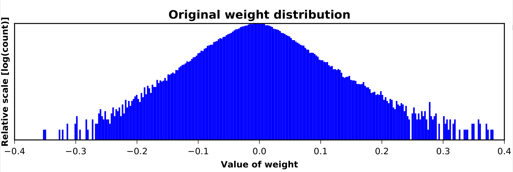
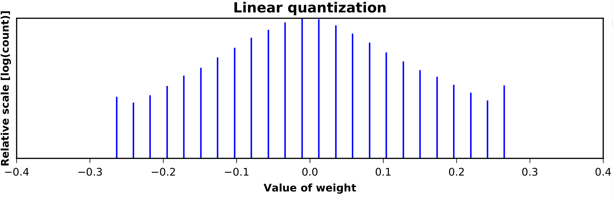
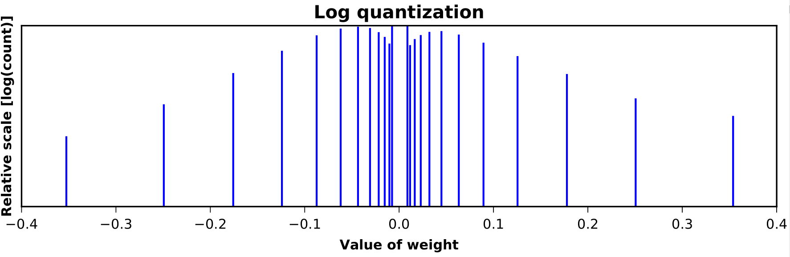
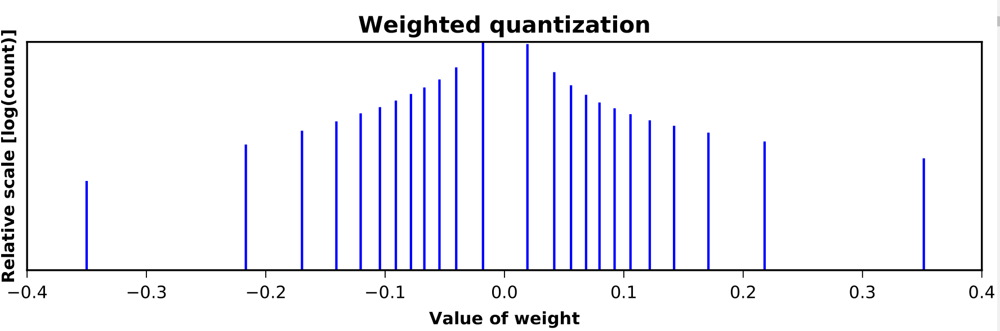
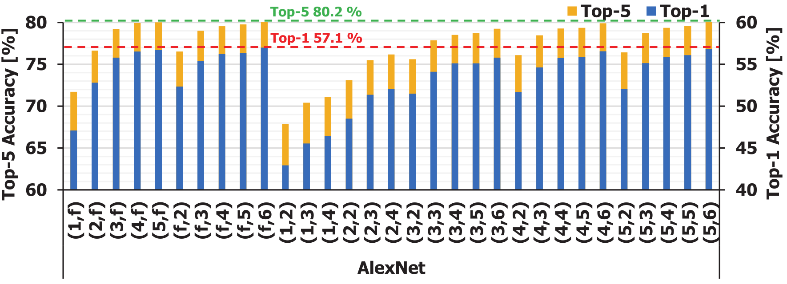
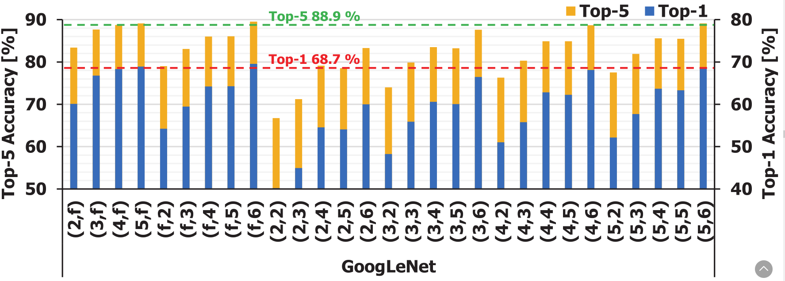
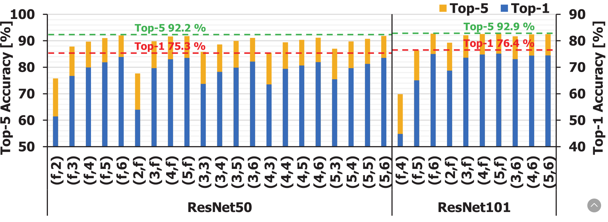
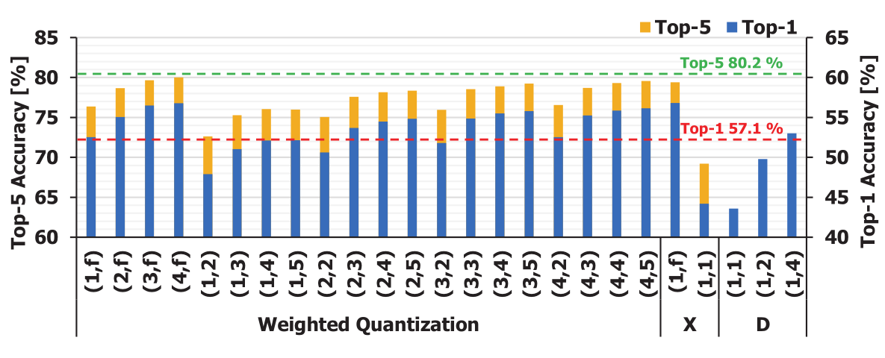
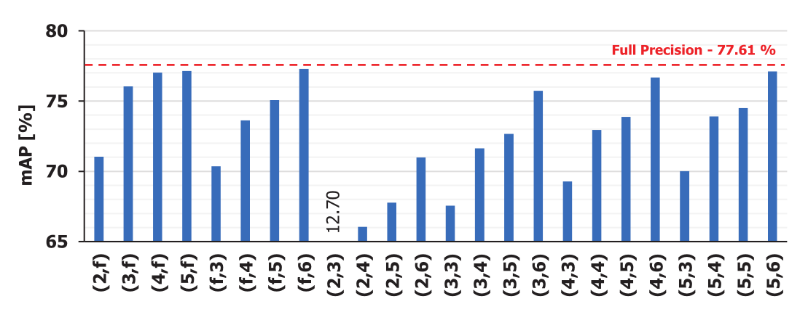

# 基於加權熵對深度神經網絡進行量化的方法

[原文鏈接](http://openaccess.thecvf.com/content_cvpr_2017/papers/Park_Weighted-Entropy-Based_Quantization_for_CVPR_2017_paper.pdf)

作者：

* Eunhyeok Park\(canusglow@gmail.com\)
* Junwhan Ahn § \(junwhan@snu.ac.kr\)
* Sungjoo Yoo \(sungjoo.yoo@gmail.com\)
* 首爾國立大學：計算和內存架構實驗室 和 §自動化設計實驗室

## 摘要

當使用嵌入式或移動設備進行開發時，由於硬件資源的限制，將原始神經網絡進行量化\(優化前向預測的開銷\)成為一種高效的優化手段。量化時需要對其進度損失進行嚴格的控制。本文旨在提供一種新穎的量化權重和激活輸出的方式\(基於加權熵\)。與二值神經網絡不同，我們的方法是進行多位\(bit\)量化，也就是將權重和激活輸出可以被量化到對應位數，從而達到對應的精度。這有利於更靈活地利用不同級別的量化，達到精度和性能的折衷。此外，我們的方案提供了一種基於傳統訓練算法的自動化量化流程，從而節省了為量化網絡所花費的時間。根據對實際神經網絡模型的評估：圖像分類\(_AlexNet_, _GoogLeNet_ 和 _ResNet-50/101_\)，物體檢測\(基於_ResNet-50_的_R-FCN_\)和語言建模\(一種 _LSTM_ 網絡\)，我們的方法在損失很小精度的前提下，對模型大小和計算量都有大幅度的消減。同樣，與目前已知的量化方式相比，我們的方式在工作量更低和相同的資源約束的前提下，具有更高的精度。

## 1. 方案介紹

目前\(2017年\)，深度神經網絡在移動和嵌入式端越來越火。由於這類系統的特點是硬件資源緊俏\(能耗和內存容量\)，導致程序的性能受到很大的影響。基於目前這種情況，比較典型的應用方式是將DNN前向預測過程在移動設備上進行，而對DNN的訓練使用服務器進行。因此，減少前向預測消耗對於DNN應用來說非常有必要，尤其是在移動和嵌入式系統上。

減少前向消耗的一種方式就是犧牲計算精度。雖然原始模型中的數值使用的是32/64位浮點表示，但目前研究已經論證，將原始浮點數據轉換成8位數據也可以精確的進行DNN的前向預測，更有甚者轉換到更窄的位寬來表示權重和激活輸出值，並進行前向預測過程。另外，目前相關的研究也很活躍，旨在通過量化權重和/或激活輸出，進一步降低計算量和精度。很多的量化方案，通過使用專用的硬件加速器來保證其能大幅的減小前向預測運行的時間、功耗和內存需求；例如NVIDIA的P40和P4，其支持8位整數算法或_位級串行深度神經網絡計算_\(其提供了與位寬成比例的執行時間和能量消耗\)。

不過，現存的量化技術具的兩個限制，可能會阻礙其在移動和嵌入式系統中的實際應用程序。

首先，現有的方案缺少對輸出質量和前向預測的折中。移動和嵌入式系統對資源和預測精度是有嚴格的限制，這就需要對輸出質量和預測性能進行權衡。不過，目前存在的方案都不夠靈活，無法利用這種關係。例如，二值權重\(深度網絡\)技術就會有預測輸出質量損失很大的問題，這種方案就無法使用到需要很少精度損失的系統上。

其次，即使現有的量化技術能提供這種權衡，但是這些技術都需要對目標網絡進行修改，以及/或只對網絡的部分進行量化，從而獲得不錯的量化質量。由此，使用這種技術需要花費大量的時間進行設計，由於使用代價比較大，相關技術很難得到推廣。另外一些技術，例如對XNOR-Net和DoReFa-Net的第一層和最後一層不進行量化，為了避免有太大的精度損失，這可能對限制精度下降有所幫助。

為瞭解決這兩種限制，我們採用了一種新方案——基於權重上的量化方式。我們的方法在解決了上述的兩個問題的同時，量化了權重和激活輸出。我們做的事情可以總結為如下幾點：

1. 我們提供了一種新的多位量化方案。與二值量化方案不同，我們的方案能夠為網絡提供任意位的量化，從而實現對精度-性能進行更加靈活的控制。
2. 我們的方案有助於自動化對整個神經網絡進行量化。除了激活量化之外，不需要對網絡進行任何修改，因此很容易地集成到神經網絡的傳統訓練算法中。
3. 我們用各種實際的神經網絡論證了方法的效果，包括AlexNet, GoogLeNet, ResNet50/101, R-FCN和一種語言建模的LSTM網絡。

## 2. 相關工作

本節，我們簡單的回顧一下DNN預測的量化方式。 Vanhoucke等人對8位和32位神經網絡進行過比較。 Miyashita等人建議對權重和激活輸出使用以2為底的算法進行量化\(稱為_LogQuant_算法\)，並且展示對AlexNet使用4位權重量化和5位激活輸出量化的結果，其精度損失大概只有1.7%左右。使用對數量化將模型量化到比8位更窄的數值上更具有潛力，不過AlexNet在進行低於4位的量化時，精度卻有很大的損失。

目前有很多方法能將權重和/或激活輸出量化到2或3級。Hwang和Sung展示了3級權重\(例如：-1, 0和+1\)和3位激活輸出可以保證字符和音素識別任務的準確性。Courbariaux等人展示了一種二值權重網絡\(名為_BinaryConnect\)_，並證明其對小型網絡\(例如CIFAR-10和SVHN\)有較好的精度。Rastegari等人展示了一種二值網絡\(二值權重版的XNOR-Net\)，在AlexNet上進行實驗時沒有精度的損失。

Zhou等人創造了DoReFa-Net，其對已量化的權重和有界的激活輸出使用了線性量化的方式對AlexNet進行量化，權重使用1位，激活輸出使用2位，與top-1的精度相差6%。他們也展示了權重使用1位，激活輸出使用k位的結果，這種方式允許我們利用精度損失和性能/能耗/模型尺寸的關係進行權衡。

之前的章節中，我們瞭解到這種量化方式的最大優點有兩個：

1. 能靈活的使用多位的量化與精度-性能權衡和選擇。
2. 量化過程無需對整個網絡和現有的工作進行修改。

在這方面，大多數二級或三級權重方式都無法提供具體的方程。雖然XNOR-Net和DoReFa-Net提供了方程，但是這個方程卻無法實現。XNOR-Net需要對通道進行縮放，以及使用歸一化的方式重排網絡層的順序，以及將激活層放在卷積層前面。DoReFa-Net位現有網絡添加了有界激活的方法。對XNOR-Net和DoReFa-Net的量化方式都不會對第一層和最後一層進行量化，這是為了避免明顯的精度損失。這種限制導致要在修改網絡上花費很多的時間，全精度層上具有很大性能-功耗開銷，並且為了更快的對這些層進行計算，需要額外的硬件單元來支持大規模的全精度層。

## 3. 研究動機

最近的研究表明，卷積或全連接層的權重都集中的0左右，結果曲線為鐘形分佈。激活輸出的分佈曲線也類似，除了在經過ReLU層之後將激活輸出的值都置為非負值。已知的量化方法也會根據這種特點決定量化的級別。例如，可以為0值嘗試多種量化級數，從而使用基於對數的量化\(或稱_LogQuant_\)可得到權值在0附近的密度分佈。

除了權重或激活值的分佈，我們也觀察到一個很重要的信息：_量化過程中也需要考慮每個權重/激活輸出值對最終結果的影響_。由於量化方法的目標是以最小的量化級別使精度損失最小化，所以考慮量化每個值的實際影響，那就需要我們開發出新方案，並更有效地的使用每個量化級別。進一步來說，我們的觀點可以總結為如下幾點：

1. **0附近的值**在權重和激活輸出數據的分佈中佔據了主導地位；不過，其對輸出來說影響極小\(例如：權重比較小的錯誤值，對於卷積結果的影響是非常的小\)。因此，這些值期望得到更小的量化級別\(總之，_levels_ 的概念貫穿全文\)，而非通過傳統的基於線性或對數的方式進行量化。
2. **大量的權重和激活輸出**對於輸出質量有很大的影響，不過具有大量的權重和激活輸出的網絡也比較罕見。因此，為了使這些值最大化的利用，這裡也期望使用較小的量化級數進行。
3. **不屬於上面描述的值**中的很大部分會對輸出質量有影響。因此，與傳統方法相比，可為這些值分配更高的量化級別。

圖1描述了現存方法為給定權重分佈分配級數。

> 圖1 比較各種量化方法。其中權重值是從GoogLeNet的第二個$$3\times3$$ 卷積層獲取。每種量化方式都將該分佈量化到24級。我們使用$$2^{0.5}$$作為對數量化的底， 並對線性和對數量化進行優化，儘可能最小化L2歸一化對整體激活輸出的影響。

誠然，線性量化不會考慮權重分佈，對數量化會對近似為0的數給予太多的量化級數，我們的方法得到的分佈更集中於那些既不太小也不太大的值。通過對量化的評估，我們將會在後面展示這種比別於傳統方法效率更高的方法。

## 4. 基於加權熵的量化

### 4.1 權值量化

我們量化方法的思想是通過某種方法將權重分成N個集群，這樣就會有更多的集群分佈在權重較為重要範圍內，為每一個集群分配一個值，並且將每個集群中的權重量化到這個表示值內。為此，我們需要評估集群的質量，以及找到一組集群\(由多個集群組成\)使用該質量進行優化。

第一步，我們定義一個量化度量來決定單個權重的重要性\(或影響權重的輸出質量\)。由於較大的權重對於輸出質量有較大的影響，我們根據經驗定義了重要性$$i_{(n, m)}$$，其為第n個集群的第m個權重的重要性。例如，$$w_{(n, m)}$$與其重要性的大小成一定的比例，比如，$$i_{(n,m)} = w_{(n,m)}^2$$。

基於每個權重的重要性，我們推導出一種用於評估集群結果\(基於加權熵\)質量的方式\(例如：量化結果\)。加權熵源於物理學中熵的概念，旨在考慮數據的重要性。

對於一組集群$$C_0, ..., C_{N-1}$$，加權熵S可定義為：

\(1\) $$S = -\sum_nI_nP_nlogP_n$$

這裡：

\(2\) $$P_n = \frac{\left| C_n \right|}{\sum_k\left| C_k \right|}$$ \(相對頻率\)

\(3\) $$I_n = \frac{\sum_mi_{(n,m)}}{\left| C_n \right|}$$ \(重要性\)

在這個等式中，$$P_n$$表示有多少個權重在集群$$C_n$$的範圍內，並且$$I_n$$代表$$C_n$$集群中所有權重的平均重要性。大致的說，集群組中具有大量的權重，將會生成很高的的$$I_n$$，不過$$P_n$$非常小\(高重要性的頻率低\)。根據我們的經驗，通過找到集群組的最大S值，其量級會稀疏的分佈在特別大的值或特別小的值附近，就如圖1所示。因此，我們認為我們的權重量化有如下問題：

**問題1：權重量化**

給定訓練數據\(例如：迷你批量的輸入\)和所需要的N位對數精度\(例如：N為集群的數量\)，我們的方法旨在找到N個權重熵最大的N個權重集群。群集的代表值對應於權重量化中的級別。

我們使用算法1來解決這個問題：

---

**算法1：權重量化**

**function** OptSearch\(N, w\)

 **for** k = 0 to $$N_w$$ - 1 do

  $$i_k\leftarrow f_i(w_k)$$

 $$s \leftarrow sort([i_0,...,i_{N_w -1}] )$$

 $$ c_0, ..., c_N \leftarrow$$ initial cluster boundary

 **while** S is increased **do**

  **for** k = 1 to $$N - 1$$ **do**

   **for** $$c_k'  \in [c_{k-1}, c_{k+1}]$$ **do**

    $$S' \leftarrow$$ S with $$c_0, ..., c'_k, ..., c_N$$

    **if** $$S' > S$$ **then**

     $$c_k \leftarrow c'_k$$

 **for** k = 0 to $$N - 1$$ **do**

  $$I_k \leftarrow \sum_{i=c_k}^{c_{k+1}-1}s[i]/(c_{k+1}-c_k)$$

  $$r_k \leftarrow f^{-1}_i(I_k)$$

  $$b_k \leftarrow f^{-1}_i(s[c_k])$$

 $$b_N \leftarrow \infty$$

 **return** $$[r_0:r_{N-1}],[b_0:b_N]$$

**function** Quantize\($$w_n$$, \[$$r_0:r_{N-1}$$\], \[$$b_0:b_N]$$\)

​ **return** $$r_k$$ for k 滿足條件 $$b_k \le w_n < b_{k+1}$$

* $$N$$：級數
* $$N_w$$：權重的數量
* $$w_n$$：第n個權重值
* $$i_n$$：第n個權重的重要性
* $$f_i$$：映射函數的重要性
* $$c_i$$：集群的邊界索引
* $$S$$： 整體的加權熵

---

這裡需要注意的是，算法1只對非負的權值進行量化。這是因為加權熵理論的侷限性所導致，我們無法獲得既有負面又有非負面的聚類結果。因此，我們將權重分為兩類，一類為負權重，另一類為非負權重。並且，使用我們的算法進行量化時，每組都進行$$\frac{N}{2}$$級量化。

算法開始時，我們計算了每個權重的重要性\(第2和3行\)。這個過程有映射函數$$f_i$$完成，其使用$$w_k$$計算得到$$i_k$$。這個過程中，我們的經驗使用的是平方函數$$f_i(w) = w^2$$來計算每個權重的重要性。在獲得了所有權重的重要性值之後，我們會按增序的方式對結果進行排序\(第4行\)。

基於對重要性值的排序，算法會對集群進行邊界索引的初始化從$$c_0$$到$$c_N$$\(第5行\)，

> 集群邊界索引決定了權重屬於哪個集群。準確的來說，集群$$C_i$$中包含了權重數組s中第$$c_i$$個權重到第$$c_{i+1}-1$$個權重\(索引以0開始\)。

因此：

1. 每個集群都具有相同數量的權重值

2. $$C_{i+1}$$中權重的重要性要高於$$C_i$$中的權重。

這個可以簡單的將重要性排序後的數組s分為N份，並制定給每個集群。例如：$$s=[1,2,3,4]$$，N為2，我們可以設置$$c_0=0, c_1 =2,c_2=4$$，所以$$C_0=$$ {1, 2}，$$C_1=$${3, 4}。

在開始對進行集群邊界初始化時，我們在新集群邊緣迭代的執行增量搜索\(第6行到第11行\)。每次迭代中，每個集群$$C_i$$和其邊界$$c_i$$ 和$$c_{i+1}$$，我們會使用二分法在$$c_{i-1}$$到 $$c_{i+1}$$ 間查找$$c_i$$。對每個集群的候選邊緣索引為$$c'_i$$，我們都會重新計算集群$$C_{i-1}$$ 和$$C_i$$的加權熵\(新邊界值只對加權熵有影響\)，當新的加權熵$$S'$$大於當前的加權熵，則將邊界更新為$$c'_i$$。

在獲取新集群邊界之後，我們需要計算每個集群中$$C_k$$ 的重要性\(第13行\)。我們獲得集群$$C_k$$中表示權重的值$$r_k$$\(第14行\)。為了界定那些權重屬於哪些集群，我們可以通過集群邊緣權值——$$b_k$$進行判別\(以及進行權值量化\)\(第15行\)；例如，集群$$C_i$$包含有w個權值，w需要滿足條件$$b_k \le w < b_{k+1}$$。函數Quantize實現了量化過程。簡而言之就是，給定一個權重$$w_n$$，其會為相關集群$$c_k$$產生表達權重值$$r_k$$。

基於加權熵的聚類可以提供滿意的級數，該級數為在第3節所序。最大化加權熵，在考慮數據的重要性的同時優化量化結果\(以使熵最大化\)。因此，考慮到0附近的值重要性很低，我們的方法將0附近的值都分到一個大集群中。雖然該集群涵蓋了大量的權重值，但只是將不常見的值分到一個集群中而已。

### 4.2 激活輸出量化

激活輸出的量化方式與權重的量化完全不同。因為權重在訓練過程結束之後就已經固定，但是前向預測的激活輸出與運行時給定的輸入數據有很大的關係。這使得激活不太適合通過基於聚類的方法進行量化，因為聚類的方法需要穩定分佈。

根據我們的調研，基於對數的量化\(LogQuant\)對於激活輸出的量化有較好的結果。LogQuant也有利於最大限度地降低成本\(例如：專用硬件加速器\)，因為它可以將乘法轉換成按位移位操作\(例如：$$w\times2^x=w<<x$$\)。不過，LogQuant方法並不提供某種有效的搜索策略，來查找網絡中每個層中最優的LogQuant參數\(比如：底數和偏移\)。

---

**算法2：激活輸出量化**

**function** BinaryToLogQuant\($$a_n$$\)

 **return** $$round(\frac{16\times log_2a_n-fsr}{step}) +1$$

**function** LogQuantToBinary\(index\)

 **if** index == 0 **then**

  **return** 0

 **else**

  **return** $$2^{\frac{1}{16}\times (fsr +step \times (index-1))}$$

**function** WeightedLogQuantReLU\($$a_n$$\)

 **if** $$a_n$$ &lt; 0 **then**

  **return** 0

 level\_idx $$\leftarrow BinaryToLogQuant(a_n)$$

 **if** level\_idx $$\le$$ 0 **then**

  **return** 0

 **else if** level\_idx $$\ge$$ N - 1 **then**

  **return** LogQuantToBinary\(N - 1\)

 **else**

  **return** LogQuantToBinary\(level\_idx\)

**function** ReprImportance\(index\)

 **return** LogQuantToBinary\(index\)

**function** RelativeFrequency\(index, a\)

​ **for** k = 0 to $$N_a$$ - 1 **do**

  level\_idx$$_k \leftarrow$$ BinaryToLogQuant\($$a_n$$\)

 **if** index == 0 **then**

  **return** $$\left| \{ a_n| level\_idx_n\le0\}\right|$$

 **else if** index == N - 1 **then**

  **return** $$\left|\{ a_n | level\_idx_n \ge N -1 \}  \right|$$

 **else**

  **return** $$\left|\{ a_n | level\_idx_n =index \}  \right|$$

* $$N:$$ 級數
* $$N_a$$：激活輸出的總量
* $$a_n$$：激活輸出中第n個值
* $$fsr$$：最優的fsr值\(整型\)
* $$step$$：最優的step值\(2的倍數\)

---

我們對激活輸出量化分為兩步：修改過的 LogQuant方法和一個快速搜索LogQuant參數的策略。算法2展示我們在修改過的 LogQuant方法中使用到的主要函數。

首先，我們修改了原始LogQuant方法用來提高整體的精確度和穩定性。與傳統的LogQuant方法不同，我們採用了更小的對數底\($$\frac{1}{8}$$的倍數\)和偏移\($$\frac{1}{16}$$的倍數\)，分別對應算法2中的‘step’和'fsr'。我們將第一量化級別定為零激活，並且其他的對數值對應相應的等級。例如，當我們要對激活輸出進行3位量化時，第一級為0，第二級為$$2^{\frac{fsr}{16}}$$，第三級為$$2^{\frac{fsr+step}{16}}$$，以此類推。簡單起見，我們將我們的輸出激活量化整合為線性單元激活函數的一部分，在算法2中的WeightedLogQuantReLU進行描述。

其次，為我們的LogQuant變體提供了一種參數搜索的方法，其能找到最合適的底數和偏移，來保證輸出質量損失最小化。我們的想法是利用的權重量化中加權熵最大化的概念。算法2中也有計算重要性I的函數\(ReprImportance\)和計算相對頻率P的函數\(RelativeFrequency\)\(這兩個部分是用來計算加權熵到的\)。訓練過程中，為了在LogQuant中最大化給定每層激活輸出的加權熵，我們對“fsr”和“step”進行仔細的搜索，因為可能的基數和偏移量通常都很小\(例如，我們的經驗是底數為16，偏移在500左右\)。

### 4.3  將權重/激活量化集成入訓練過程

我們將權重/激活輸出量化的方法集成到傳統神經網絡的訓練過程中。由於在每個小批量作為輸入期間權重不變，所以可以通過每個小批量結束時更新之後的權重進行重量化。這裡需要注意的是，我們在權重更新過程中使用全精度進行，之前的工作同樣使用全精度。

另外，激活輸出量化需要應用到前向/後向的傳遞過程中，因為每個傳遞過程都有一組屬於自己的激活輸出值。對於每一層，我們首先執行前向過程，然後使用普通的ReLU\(不帶LogQuant\)。激活輸出的結果會傳入到我們的算法中，用於對LogQuant參數的搜索。通過算法找到最優的底數/偏移組合，然後使用WeightedLogQuantReLU函數對激活輸出進行量化。激活輸出的量化結果將傳遞到下一層中，網絡中其他的層也會進行相同的操作。

在我們的訓練框架中，任何網絡都能通過我們的量化方式收益，而且不需要對網絡進行修改。這使得將量化應用到網絡上要簡單的多，量化後的網絡可以大大減少前向預測的所需的時間。現有方法不太實用，因為它們需要在設計時對網絡進行修改，這就需要耗費大量的人力。

## 5. 實際操作

我們從神經網絡的三個應用領域來評估我們的方案：圖像分類，物體識別和語言建模。我們對Caffe進行了修改，從而使所有網絡採用我們的方案；這裡我們使用TensorFlow處理語言建模，並實現了LSTM框架。

> 修改後的Caffe代碼可以在 [https://github.com/EunhyeokPark/script\_for\_WQ](https://github.com/EunhyeokPark/script_for_WQ) 中看到

我們將精度損失約束在1%以內，旨在找到在滿足精度約束的同時，給出最小位寬的量化配置。為了方便起見，我們使用\(x, y\)符號：x表示權重的位寬，y表示激活輸出的位寬。這個表示法中`f`代表全精度。例如，\(1, f\)則表示權重使用1位表示，激活輸出使用全精度表示。

### 5.1 圖像分類: AlexNet, GoogLeNet和ResNet-50/101

對於圖像分類任務來說，我們使用兩個廣為人知的網絡\(AlexNet和GoogLeNet\)來測試我們的量化方案\(都是用Caffe框架進行\)，以及ResNet。

> ResNet的模型可以從[https://github.com/KaimingHe/deep-residual-networks](https://github.com/KaimingHe/deep-residual-networks) 處獲取

為了在這幾個網絡使用我們的量化方案，我們在批次尺寸設置為256\(AlexNet\), 64 \(GoogLeNet\)和16 \(ResNet-50/101\)，結合微調的方式使用我們的方案進行量化。在GoogLeNet和ResNet的測試中，批次尺寸受到了GPU內存不足的影響；這可能會增加整體的精度損失。我們使用ILSVRC2012數據集，其包含128萬張訓練圖片，和5萬張測試圖片。在微調的前6個週期，我們首先將初始化學習率設置為0.001，然後每兩輪降低10倍。

下面的子章節中，我們會展示兩種評測結果。首先，我們會證明我們的量化方式對於整個網絡\(全網絡量化\)是有用的，這在其他的方法中是無法做到的。其次，我們對除了第一層和最後一層使用我們的方案，與部分網絡量化的方案進行比較，這裡第一層和最後一層使用全精度表示。

#### 5.1.1 量化整個網絡

圖2用我們的方法對量化後的CNN的網絡進行精度測試。可以看到對CNN進行限制位寬的量化可以獲得較高的精度。

> 圖2 Top-1和Top-5都是在微調模型後，進行量化的精度。虛線代表使用全精度算法網絡的基線準確度。

AlexNet，最好的量化配置使用最窄的位寬在top-5上精度下降只在1%以內，這幾種配置為\(3, 6\), \(4, 4\), \(4, 5\)和\(4, 6\)。例如，\(4, 4\)都減少了表示位寬，其精度為87.5%\(= 1 - 4/32\)，相較top-5下降了不到1%的精度。此外，與以前的工作相比，我們的方法提供了更低的等精度位寬。例如，LogQuant能達到75.1%，測試top-5使用4位表示權重，5位表示激活輸出；Qiu等人使用8位表示權重和激活輸出，在top-5上達到76.6%，top-1上達到53.0%。我們方法在使用2位表示權重，3位表示激活輸出的情況下，就可達到相似的精度，top-1為51.37%，top-5為75.49%。

GoogLeNet，將精度損失嚴格的控制在1%內，我們的量化方式使用4-5位表示權重，6位表示激活輸出。我們也觀察到，在同等位寬限制下GoogLeNet的精度下降要比AlexNet大的多。我們認為這是因為GoogLeNet的模型規模比AlexNet更緊湊造成的，GoogLeNet的計算量要大於AlexNet，從而使得GoogLeNet權重的精度的下降很明顯。即使這樣，我的方案依舊比全精度實現的模型小5倍。

ResNet，據我們所知，本文是第一篇對具有50層和101層的網絡進行整體量化進行記錄的文章。兩個網絡即使在權重量化之後，也能保持相似的準確性，例如3位。不過，我們觀察到，越深的網絡就需要更多的位數來表示激活輸出數據，比如6位，這可能是因為量化錯誤在較深的網絡中會進行積累。

#### 5.1.2 量化部分網絡

這節中，我們將我們的方法與目前最先進的兩種方式\(XNOR-Net和DoReFa-Net\)進行了對比。為了公平起見，我們的比較方式是，網絡中除了第一層和最後一層以外的層都進行量化。這裡要注意的是，比較還並非公平。

1. 之前方式的最好結果中，權重使用1位表示，激活輸出使用k位表示；而我們的方式是使用k位表示權重和激活輸出。
2. XNOR-Net和DoReFa-Net都對網絡進行了修改，而我的方法要包括ReLU層\(在激活輸出量化\)。

圖3比較了XNOR-Net和DoReFa-Net兩種方式。

> 圖3 這裡使用對AlexNet網絡進行量化，並對精度進行比較。權重量化\(_Weighted Quantization_\)表示我們的方案，這裡‘X’和'D'分別表示 XNOR-Net和DoReFa-Net。虛線表示使用全精度網絡得到的精度基線。

圖3展示了 XNOR-Net和DoReFa-Net方案使用二值權重的比較，例如\(1, f\)，1位的權重損失也非常小，其僅限於二值量化和全精度激活輸出，在嚴格的精度損失約束下，不能很好的對精度和性能進行權衡。XNOR-Net 二值化權重和激活輸出的量化，例如\(1, 1\)，這樣過低的降低了準確性，而我們的方法提供了滿足精度需求的多位量化。 DoReFa-Net通過對激活輸出的多位量化緩解了這樣的限制。不過，在相似的配置下，我們的方式\(2位表示權重，3位表示激活輸出\)在top-1方面要優於DoReFa-Net\(1位表示權重，4位表示激活輸出\)0.69個百分點\(0.69%\)。總之，我們的方式使用了更加靈活的量化配置，可以使用比之前算法更窄的位寬，這對於需要在嚴格精度約束下進行高效推理的系統非常有用。

#### 5.1.3 壓縮分析

|  | Weights | Weights | Weights | Activations | Top-1 |
| :---: | :---: | :---: | :---: | :---: | :---: |
|  | P \[%\] | Q\[MB\] | +H | Q \[MB\] | \[%\] |
| WQ\(4,4\) | - | 30.5 | 18.1 | 0.47 | 55.8 |
| WQ\(2,3\) | - | 15.3 | 12.5 | 0.35 | 53.7 |
| XNOR-Net | - | 23.7 | - | 0.72 | 44.2 |
| DoReFa-Net | - | 23.6 | - | 0.47 | 53.0 |
| Deep Compression | 11 | 8.9 | 6.9 | 3.75 | 57.2 |
| Deep Compression + WQ\(4,6\) | 11 | 8.3 | 6.5 | 0.70 | 56.3 |

> 表1 壓縮AlexNet所需的內存\(P：裁剪比例，Q：量化，H：哈夫曼編碼\)。

表1比較了我們的方法和現有的方法。從表格中我們觀察到如下現象

首先，XNOR-Net和DoReFa-Net要比我們的方法\(WQ\)有更多的權重，這是因為他們沒有量化第一層和最後一層。另外，當使用全精度和二值化權重對於哈夫曼編碼並沒有什麼幫助。

其次，當WQ以用於裁剪時，激活和權重\(分別為8.9MB和8.3MB\)會縮小5.4倍，另外進度損失為0.9%。我們在激活輸出部分獲得了比權重更多的位寬縮小，因為利用深度壓縮利用的是全精度激活輸出，而我們使用的是6位激活輸出。

#### 5.1.4 分層量化的可行性研究

在之前的章節中，我們對網絡中所有層使用相同的位寬表示。不過，根據我們的觀察，不同的層對於量化位寬的敏感度不同。因此，我們研究層級\(_layer-wise_\)量化的可行性，也就是不同的層使用不同的位寬表示。在這項研究中，我們基於AlexNet評估了四種為每層指定位寬的方式：單調遞減\(Dec\)，單調遞增\(Inc\)，凹形\(Doncave\)和凸形\(Convex\)。所有四種方案都被設計成都具有相同的位數。例如，單調遞減方法對第一個卷積層使用6位表示權重/激活輸出，那麼其他方法也一樣；同時，對最後一個全連接層使用2位表示權重/激活輸出，那麼其他方法也一樣。

|  | Dec | Inc | Concave | Convex |
| :---: | :---: | :---: | :---: | :---: |
| Top-1\[%\] | 53.79 | 50.35 | 54.45 | 54.33 |
| Top-5\[%\] | 77.59 | 74.89 | 76.43 | 78.20 |

> 表2 在不同的層級量化方式下，我們的方法的精度比較。

如表2所示，我們觀察到使用較少位來表中間的層\(Convex\)能獲得較高的精度，但是給輸入附近的層給予更少的位寬\(Inc\)精度則會有很大的損失。Zhou等人也觀察到了相同的情況。我們相信，在量化過程中考慮這種層級的敏感度，從而考慮更大的位寬進行優化的方案是可行的。對所有可能的位寬組合進行逐一測試不太現實，因為即使是小型網絡，也會有很多組合\(例如：AlexNet每層從2位到6位的量化具有$$5^{15} \approx 3 \times 10^{10}$$種配置\)。快速探索分層量化的算法留在未來進行。

### 5.2 物體檢測：基於_ResNet-50_的_R-FCN_

為了評估我們的量化方法對更復雜的視覺任務的有效性，我們使用了具有50層的R-FCN模型進行物體檢測。R-FCN模型結合了一種殘差網絡\(ResNet\)和Faster R-CNN網絡\(使用區域匡定位的方式進行物體分類\)。在全精度模型上，我們用量化方法進行微調。

因為量化誤差是在深層積累的，所以深層模型是難以量化的，但是我們的方法成功量化了50層的物體檢測模型，並且精度損失非常小。

> 圖4 R-FCNd的mAP結果。虛線為基準線，是使用全精度網絡計算出的精度。

圖4中\(5, 6\)的配置對於[mAP](https://www.zhihu.com/question/53405779)的損失只有0.51%，同時將模型的體積和計算量減少了5倍以上。我們也觀察到，使用我們的方法時，激活輸出通常會需要比權重更高的位數表示\(比如：使用6位來表示激活輸出，4或5位表示權重也可以達到比較穩定和滿意的效果\)。我們認為這是因為R-FCN中使用了簡單的邊界框迴歸機制\(直接從指定網絡區域中直接提取邊框\)，因此才會對激活輸出的精度很敏感。我們會在以後來對該情況進行調研。

我們未來的工作中，我們將會研究我們的方法在更深的網絡上的可行性。根據我們對基於ResNet-100的R-FCN網絡的初步研究，當用PASCAL VOC數據集對模型進行微調時，我們未能在損失合理的精度的前提下獲得量化級數。我們認為，這個是由於轉移學習和量化在一個非常深的網絡上的混合效應，這需要在深度網絡上對量化進行進一步的研究。

### 5.3 語言建模：一種LSTM網絡

為了驗證我們的方法是否能用於遞歸神經網絡，將方法應用到用於語言建模的LSTM網絡進行初步分析，這裡我們使用TensorFlow進行驗證。我們評估了三種尺寸的RNN網絡，小型尺寸\(200個隱藏單元和20個時間步數\)，中型尺寸\(650個隱藏單元和35個時間步數\)，大型網絡\(1500個隱藏單元和35個時間步數\)，這些網絡都只有兩層。我們使用Penn Tree Bank數據集對這個三個RNN網絡進行量化之前/之後進行測試，記錄網絡的詞級困惑度。

|  | Large | Large | Medium | Medium | Small | Small |
| :---: | :---: | :---: | :---: | :---: | :---: | :---: |
|  | Valid | Test | Valid | Test | Valid | Test |
| float | 82.77 | 78.63 | 87.69 | 83.54 | 119.19 | 114.46 |
| 1-bit | 92.20 | 88.48 | 104.0 | 100.7 | 147.19 | 141.07 |
| 2-bit | 86.73 | 82.90 | 92.49 | 89.24 | 137.34 | 131.15 |
| 3-bit | 85.59 | 81.57 | 86.73 | 83.50 | 121.21 | 117.00 |
| 4-bit | 81.83 | 78.09 | 88.01 | 83.84 | 121.84 | 114.95 |

> 表3 對一個語言建模LSTM模型進行量化後，記錄詞級困惑度\(概率越高, 困惑度越低, 語言模型越好\)。

表3展示了LSTM網絡使用全精度\(float\)和量化後的詞級困惑度。結果展示了4位量化的權重與全精度的實現結果非常相近。同樣，我們方法提供了選項，可以使用更窄的位寬，進一步的減小模型尺寸和計算量，不過代價就是要降低輸出的質量\(例如：更加高的困惑度\)。

## 6. 總結

本文中，我們提供了一種基於加權熵實的權重/激活輸出量化實現。我們的方法有兩大好處:

1. 靈活的多位量化，允許我們在很小的精度下降的前提下對神經網絡進行優化。
2. 自動量化，不需要對網絡進行修改。

更具我們很多實際神經網絡評估結果\(AlexNet, GoogLeNet, ResNet-50/101, R-FCN和某個LSTM網絡\)，我們方法能讓保證精度下降在1%內\(top-5或mAP\)。使用4位權重/激活輸出表示AlexNet，4/5位權重和6位激活輸出\(GoogLeNet, ResNet和R-FCN\)，都能保證精度下降在1%。下一步我們的調研將會是特別深的神經網絡模型\(例如：ResNet-152\)，以及對RNN模型的量化。

## 鳴謝

該研究得到韓國國家研究基金會\(NRF-2016R1A2B3009361\)和三星電子\(三星尖端技術研究所\(_SAIT_\)和三星研究資助中心 SRFC-TC1603-04\)資助。

