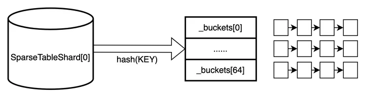
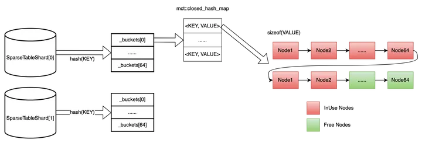

# C++ 資料結構設計：如何高效地儲存並操作超大規模的 <KEY, VALUE>


在搜、廣、推場景中，Embedding 層有海量的稀疏參數（以 <key, value> 的形式儲存在參數伺服器上），規模可達千億等級。其中，key 的類型是 uint64_t，value 的類型是 float 類型的陣列，而且這個陣列的長度對於不同的模型是可變的。那麼，如何設計這樣一個儲存結構並能實現最高效地增、刪、改、查呢？

## 方案 1：

**純 map 實現，log(n) 的複雜度**

- 優點：實現簡單，直接呼叫 stl 庫或者第三方 hash_map 即可
- 缺點：大量的記憶體申請、釋放操作，而且會產生大量的記憶體碎片，開銷非常大

## 方案2：

**標準的 hash 表，分桶（bucket），每個桶裡使用鏈表**

優點：實現相對簡單

缺點：查詢的時候，定位到具體的桶 id 之後，還需要遍歷鏈表



## 方案3：

**和方案2基本差不多，區別是桶裡的鏈表用 map 實現**

優點：查詢的速度比方案 2 快

缺點：記憶體分配和釋放及記憶體碎片的問題還是沒得到解決

## 終極方案：

**在方案 3 的基礎上，加上動態記憶體技術（見下圖）。簡單來說，就是每次申請固定個數（比如 64）的節點記憶體（鏈表形式），每個節點的記憶體大小是 sizeof(VALUE)，分別用兩個指針表示空閒鏈表（綠色部分，表示可用）和佔用鏈表（紅色部分，已使用）**

優點：增、刪、改、查速度都得到大大提升



## 實現（參見 Paddle 開放原始碼）：

### 1. 記憶體分配器

```cpp
template <class T>
class ChunkAllocator {
   public:
    explicit ChunkAllocator(size_t chunk_size = 64) {
        CHECK(sizeof(Node) == std::max(sizeof(void*), sizeof(T)));
        _chunk_size = chunk_size;
        _chunks = NULL;
        _free_nodes = NULL;
        _counter = 0;
    }
    ChunkAllocator(const ChunkAllocator&) = delete;
    ~ChunkAllocator() {
        while (_chunks != NULL) {
            Chunk* x = _chunks;
            _chunks = _chunks->next;
            free(x);
        }
    }
    template <class... ARGS>
    T* acquire(ARGS&&... args) {
        if (_free_nodes == NULL) {
            create_new_chunk();
        }

        T* x = (T*)(void*)_free_nodes;  // NOLINT
        _free_nodes = _free_nodes->next;
        new (x) T(std::forward<ARGS>(args)...);
        _counter++;
        return x;
    }
    void release(T* x) {
        x->~T();
        Node* node = (Node*)(void*)x;  // NOLINT
        node->next = _free_nodes;
        _free_nodes = node;
        _counter--;
    }
    size_t size() const { return _counter; }

   private:
    struct alignas(T) Node {
        union {
            Node* next;
            char data[sizeof(T)];
        };
    };
    struct Chunk {
        Chunk* next;
        Node nodes[];
    };

    size_t _chunk_size;  // how many elements in one chunk
    Chunk* _chunks;      // a list
    Node* _free_nodes;   // a list
    size_t _counter;     // how many elements are acquired

    void create_new_chunk() {
        Chunk* chunk;
        posix_memalign(reinterpret_cast<void**>(&chunk),
                       std::max<size_t>(sizeof(void*), alignof(Chunk)),
                       sizeof(Chunk) + sizeof(Node) * _chunk_size);
        chunk->next = _chunks;
        _chunks = chunk;

        for (size_t i = 0; i < _chunk_size; i++) {
            Node* node = &chunk->nodes[i];
            node->next = _free_nodes;
            _free_nodes = node;
        }
    }
};
```

### 2. SparseTableShard

```cpp
#include <mct/hash-map.hpp>

template <class KEY, class VALUE>
struct alignas(64) SparseTableShard {
   public:
    typedef typename mct::closed_hash_map<KEY, mct::Pointer, std::hash<KEY>>
        map_type;
    struct iterator {
        typename map_type::iterator it;
        size_t bucket;
        map_type* buckets;
        friend bool operator==(const iterator& a, const iterator& b) {
            return a.it == b.it;
        }
        friend bool operator!=(const iterator& a, const iterator& b) {
            return a.it != b.it;
        }
        const KEY& key() const { return it->first; }
        VALUE& value() const { return *(VALUE*)(void*)it->second; }  // NOLINT
        VALUE* value_ptr() const {
            return (VALUE*)(void*)it->second;
        }  // NOLINT
        iterator& operator++() {
            ++it;

            while (it == buckets[bucket].end() &&
                   bucket + 1 < CTR_SPARSE_SHARD_BUCKET_NUM) {
                it = buckets[++bucket].begin();
            }

            return *this;
        }
        iterator operator++(int) {
            iterator ret = *this;
            ++*this;
            return ret;
        }
    };
    struct local_iterator {
        typename map_type::iterator it;
        friend bool operator==(const local_iterator& a,
                               const local_iterator& b) {
            return a.it == b.it;
        }
        friend bool operator!=(const local_iterator& a,
                               const local_iterator& b) {
            return a.it != b.it;
        }
        const KEY& key() const { return it->first; }
        VALUE& value() const { return *(VALUE*)(void*)it->second; }  // NOLINT
        local_iterator& operator++() {
            ++it;
            return *this;
        }
        local_iterator operator++(int) { return {it++}; }
    };

    ~SparseTableShard() { clear(); }
    bool empty() { return _alloc.size() == 0; }
    size_t size() { return _alloc.size(); }
    void set_max_load_factor(float x) {
        for (size_t bucket = 0; bucket < CTR_SPARSE_SHARD_BUCKET_NUM;
             bucket++) {
            _buckets[bucket].max_load_factor(x);
        }
    }
    size_t bucket_count() { return CTR_SPARSE_SHARD_BUCKET_NUM; }
    size_t bucket_size(size_t bucket) { return _buckets[bucket].size(); }
    void clear() {
        for (size_t bucket = 0; bucket < CTR_SPARSE_SHARD_BUCKET_NUM;
             bucket++) {
            map_type& data = _buckets[bucket];
            for (auto it = data.begin(); it != data.end(); ++it) {
                _alloc.release((VALUE*)(void*)it->second);  // NOLINT
            }
            data.clear();
        }
    }
    iterator begin() {
        auto it = _buckets[0].begin();
        size_t bucket = 0;
        while (it == _buckets[bucket].end() &&
               bucket + 1 < CTR_SPARSE_SHARD_BUCKET_NUM) {
            it = _buckets[++bucket].begin();
        }
        return {it, bucket, _buckets};
    }
    iterator end() {
        return {_buckets[CTR_SPARSE_SHARD_BUCKET_NUM - 1].end(),
                CTR_SPARSE_SHARD_BUCKET_NUM - 1, _buckets};
    }
    local_iterator begin(size_t bucket) { return {_buckets[bucket].begin()}; }
    local_iterator end(size_t bucket) { return {_buckets[bucket].end()}; }
    iterator find(const KEY& key) {
        size_t hash = _hasher(key);
        size_t bucket = compute_bucket(hash);
        auto it = _buckets[bucket].find_with_hash(key, hash);
        if (it == _buckets[bucket].end()) {
            return end();
        }
        return {it, bucket, _buckets};
    }
    VALUE& operator[](const KEY& key) { return emplace(key).first.value(); }
    std::pair<iterator, bool> insert(const KEY& key, const VALUE& val) {
        return emplace(key, val);
    }
    std::pair<iterator, bool> insert(const KEY& key, VALUE&& val) {
        return emplace(key, std::move(val));
    }
    template <class... ARGS>
    std::pair<iterator, bool> emplace(const KEY& key, ARGS&&... args) {
        size_t hash = _hasher(key);
        size_t bucket = compute_bucket(hash);
        auto res = _buckets[bucket].insert_with_hash({key, NULL}, hash);

        if (res.second) {
            res.first->second = _alloc.acquire(std::forward<ARGS>(args)...);
        }

        return {{res.first, bucket, _buckets}, res.second};
    }
    iterator erase(iterator it) {
        _alloc.release((VALUE*)(void*)it.it->second);  // NOLINT
        size_t bucket = it.bucket;
        auto it2 = _buckets[bucket].erase(it.it);
        while (it2 == _buckets[bucket].end() &&
               bucket + 1 < CTR_SPARSE_SHARD_BUCKET_NUM) {
            it2 = _buckets[++bucket].begin();
        }
        return {it2, bucket, _buckets};
    }
    void quick_erase(iterator it) {
        _alloc.release((VALUE*)(void*)it.it->second);  // NOLINT
        _buckets[it.bucket].quick_erase(it.it);
    }
    local_iterator erase(size_t bucket, local_iterator it) {
        _alloc.release((VALUE*)(void*)it.it->second);  // NOLINT
        return {_buckets[bucket].erase(it.it)};
    }
    void quick_erase(size_t bucket, local_iterator it) {
        _alloc.release((VALUE*)(void*)it.it->second);  // NOLINT
        _buckets[bucket].quick_erase(it.it);
    }
    size_t erase(const KEY& key) {
        auto it = find(key);
        if (it == end()) {
            return 0;
        }
        quick_erase(it);
        return 1;
    }
    size_t compute_bucket(size_t hash) {
        if (CTR_SPARSE_SHARD_BUCKET_NUM == 1) {
            return 0;
        } else {
            return hash >>
                   (sizeof(size_t) * 8 - CTR_SPARSE_SHARD_BUCKET_NUM_BITS);
        }
    }

   private:
    map_type _buckets[CTR_SPARSE_SHARD_BUCKET_NUM];
    ChunkAllocator<VALUE> _alloc;
    std::hash<KEY> _hasher;
};
```

### 3. 使用示例

```cpp
class FixedFeatureValue {
   public:
    FixedFeatureValue() {}
    ~FixedFeatureValue() {}
    float* data() { return _data.data(); }
    size_t size() { return _data.size(); }
    void resize(size_t size) { _data.resize(size); }
    void shrink_to_fit() { _data.shrink_to_fit(); }

   private:
    std::vector<float> _data;
};

typedef SparseTableShard<uint64_t, FixedFeatureValue> shard_type;
```

