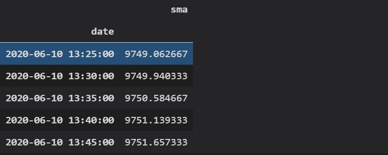

# Python Binance API 教學


## 幣安帳務下單＆ websocket 

```python
import asyncio
import json
import websockets
from binance.client import Client
from binance.enums import *

class mid_class:
    def __init__(self, api_key, api_secret):
        self.client = Client(api_key, api_secret)
        self.balance = None
        self.ticker = None
        self.depth = None
        self.order = None

    def get_account(self):
        self.balance = self.client.get_asset_balance(asset='USDT')

    def get_ticker(self):
        self.ticker = self.client.get_symbol_ticker(symbol='BTCUSDT')

    def get_depth(self):
        self.depth = self.client.get_order_book(symbol='BTCUSDT')

    def create_order(self):
        self.order = self.client.create_test_order(
            symbol='BTCUSDT',
            side=SIDE_BUY,
            type=ORDER_TYPE_LIMIT,
            timeInForce=TIME_IN_FORCE_GTC,
            quantity=100,
            price='1000')

    def cancel_order(self):
        self.client.cancel_order(
            symbol='BTCUSDT',
            orderId=self.order['orderId'])

async def main():
    api_key = 'your_api_key'
    api_secret = 'your_api_secret'
    mid = mid_class(api_key, api_secret)
    #mid.get_account()
    #mid.get_ticker()
    #mid.get_depth()
    #mid.create_order()
    #mid.cancel_order()
    await fetch_depth(mid)

async def fetch_depth(mid):
    async with websockets.connect('wss://stream.binance.com:9443/ws/btcusdt@depth@100ms') as websocket:
        while True:
            depth_json = await websocket.recv()
            depth_dict = json.loads(depth_json)
            print(depth_dict)

if __name__ == '__main__':
    asyncio.run(main())
```


## 使用Websocket 訂閱幣安 orderbook  100ms 

```python
import asyncio
import json
import websockets

async def fetch_depth(symbol):
    while True:
        try:
            async with websockets.connect(f'wss://stream.binance.com:9443/ws/{symbol}@depth@100ms') as websocket:
                while True:
                    depth = await websocket.recv()
                    depth = json.loads(depth)
                    print(depth)
        except websockets.exceptions.ConnectionClosed:
            print(f'Connection to {symbol} WebSocket closed, reconnecting...')

async def main():
    tasks = [
        asyncio.create_task(fetch_depth('btcusdt')),
        asyncio.create_task(fetch_depth('ethusdt'))
    ]
    await asyncio.gather(*tasks)

asyncio.run(main())
```


## 如何獲取 SMA 等技術指標？

我們已經討論瞭如何將 DataFrame 輸出為 CSV 檔。你可以用 Python Pandas 做更多的事情，計算移動平均線就是其中之一。

下面是一個示例：

```python
import btalib
import pandas as pd

# load DataFrame
btc_df = pd.read_csv('btc_bars3.csv', index_col=0)
btc_df.set_index('date', inplace=True)
btc_df.index = pd.to_datetime(btc_df.index, unit='ms')

# calculate 20 moving average using Pandas
btc_df['20sma'] = btc_df.close.rolling(20).mean()
print(btc_df.tail(5))
```

在上面的代碼中，我們從之前創建的CSV檔載入了數據。然後，我們使用mean（） 函數來計算收盤列上的平均值。

滾動函數允許我們為移動平均線設置一個週期。所有這些內容都將附加到現有的數據幀中。這就是結果的樣子。


如您所見，已使用 20 移動平均線創建了一個新列。

假設您只需要知道移動平均線現在的位置。或者從數據幀中的最後一個價位開始。

我們可以使用相同的 mean（） 函數，只需在 DataFrame 的最後 20 行上運行它，如下所示：

```python
# calculate just the last value for the 20 moving average
mean = btc_df.close.tail(20).mean()
```

熊貓可以做的還有很多。我們可以很容易地抓住今年交易的最高價格比特幣，如下所示 –

```python
# get the highest closing price in 2020
max_val = btc_df.close['2020'].max()
```

但Pandas無法計算其他技術指標，如RSI或MACD。幣安 API 也不提供此資訊。

TA-LIB一直是一個流行的庫一段時間了。我們最近有機會測試了一個新的庫 – bta-lib。

該庫由Backtrader的作者創建。他在博客上討論TA-LIB有幾個指標實施不當。

此外，TA-LIB不是為Python設計的。有一個可用的包裝器，但是為Python設計的解決方案的開銷要少得多。

可以使用 PIP 安裝 Bta-lib，如下所示。

```
pip install bta-lib
```

讓我們嘗試用庫計算相同的移動平均線作為比較 –

```python
sma = btalib.sma(btc_df.close)
print(sma.df)
```

現在，我們有一個單獨的數據幀，其中包含移動平均線的值。它看起來像這樣：



請注意，bta-lib 將返回一個對象到我們的 sma 變數。若要訪問其中包含的數據幀，只需在變數名稱後鍵入即可。`.df`

默認情況下，該庫使用 30 週期移動平均線。

我們可以複製我們之前的相同函數，並計算20條移動平均線，並將其作為列附加到我們原來的DataFrame上，就像這樣。

```python
# create sma and attach as column to original df
btc_df['sma'] = btalib.sma(btc_df.close, period=20).df
print(btc_df.tail())
```

讓我們再創建幾個指標。以下是我們使用bta-lib庫計算RSI的方法 –

```python
rsi = btalib.rsi(btc_df, period=14)
```

再次返回包含 df 的物件。我們可以像這樣訪問最後一個值。

```python
print(rsi.df.rsi[-1])
```

在實時環境中，您可能只需要最後一個值。

以下是我們如何計算bta-lib中比特幣的MACD。

```python
macd = btalib.macd(btc_df, pfast=20, pslow=50, psignal=13)
```

最後，我們將把RSI和MACD值加入到我們的原始比特幣價格DataFrame中。

```python
# join the rsi and macd calculations as columns in original df
btc_df = btc_df.join([rsi.df, macd.df])
print(btc_df.tail())
```

現在，我們可以從一個數據幀輕鬆訪問所有計算 –


## 如何使用幣安API觸發乙太坊訂單？

我們使用的庫具有一個函數，允許我們創建測試訂單。下面是一個示例：

```python
buy_order_limit = client.create_test_order(
    symbol='ETHUSDT',
    side='BUY',
    type='LIMIT',
    timeInForce='GTC',
    quantity=100,
    price=200)
```

我們可以確保我們的語法是正確的，而不必提交實時訂單。當您瞭解 API 時，這非常有用。

例如，如果我們將上述代碼中的類型更改為”MARKET”，它將引發異常。原因是**timeInForce**和**價格**參數不用於市場訂單。相反，市場訂單將如下所示：

```python
buy_order = client.create_test_order(symbol='ETHUSDT', side='BUY', type='MARKET', quantity=100)
```

一旦您滿意語法正確，只需將 替換為 .`create_test_order function``create_order function`

注意：如果您按照示例進行操作，則在將上述限價訂單代碼用於ETHUSDT時，如果自編寫本文以來價格已大幅變動，則可能會收到API錯誤。幣安只允許與硬幣當前交易價格相差一定百分比的訂單。

由於可能存在異常，因此我們將代碼包裝在 try/except 塊中，並從庫中導入一些定義的異常。

```python
import os

from binance.client import Client
from binance.enums import *
from binance.exceptions import BinanceAPIException, BinanceOrderException

# init
api_key = os.environ.get('binance_api')
api_secret = os.environ.get('binance_secret')

client = Client(api_key, api_secret)
```

除了用戶端和自定義異常之外，我們還導入了 binance.enums，我們稍後將對此進行討論。

這是訂單代碼塊。

```python
# create a real order if the test orders did not raise an exception

try:
    buy_limit = client.create_order(
        symbol='ETHUSDT',
        side='BUY',
        type='LIMIT',
        timeInForce='GTC',
        quantity=100,
        price=200)

except BinanceAPIException as e:
    # error handling goes here
    print(e)
except BinanceOrderException as e:
    # error handling goes here
    print(e)
```

訂單確認將從交易所發回並存儲在我們的buy_limit變數中。這是它的樣子：


它是字典格式。請注意，它包含一個 orderId。我們可以使用此ID來取消像這樣的限價訂單 –

```python
    # cancel previous orders
    cancel = client.cancel_order(symbol='ETHUSDT', orderId=buy_limit['orderId'])
```

我們再次收到確認。我們可以列印出 cancel 變數來查看它。


該函數是下訂單的主要方法。我們可以在這裡傳遞幾個參數。`create_order`

但是有一些常見的順序，並且已經為它們創建了説明器函數。它們縮短了下訂單所需的代碼，使事情變得容易一些。以下是一些範例：

```python
    # same order but with helper function
    buy_limit = client.order_limit_buy(symbol='ETHUSDT', quantity=100, price=200)

    # market order using a helper function
    market_order = client.order_market_sell(symbol='ETHUSDT', quantity=100)
```

以下是您可能希望使用的一些幫助程式函數：

- `order_limit_buy()`
- `order_limit_sell()`
- `order_market_buy()`
- `order_market_sell()`
- `order_oco_buy()`
- `order_ocosell()`

最後兩個被視為高級訂單類型。**OCO**代表**O**ne **C**ancels the **O**ther。

一個很好的例子是當您使用止損和止盈目標時。如果其中一個訂單被擊中，您可能希望另一個訂單被取消。

某些訂單類型需要字串常量，例如**「MARKET」**或**「BUY」。。**另一個經紀人可能會使用「**MKT」 所以**關於你應該使用什麼並不總是有一個合乎邏輯的答案。

如果需要，您可以在文檔中查找這些內容。或者，該庫將硬編碼字串轉換為您可以使用的變數。

如果您的編碼編輯器具有自動完成功能，這將特別有用，因為您可以快速確定要使用的參數，而無需拉出文檔。

下面是一個不使用內置變數的訂單示例：

```python
buy_order = client.create_test_order(symbol='ETHUSDT', side='BUY', type='MARKET', quantity=100)
```

使用內置變數也是一樣的。

```python
buy_order = client.create_test_order(symbol='ETHUSDT', side=SIDE_BUY, type=ORDER_TYPE_MARKET, quantity=100)
```

如果計劃採用此路由，則需要前面討論的枚舉導入。

所有硬編碼字串的完整清單可以[在這裡](https://python-binance.readthedocs.io/en/latest/constants.html#)找到。

## 如何使用幣安API實現止損或止盈？

與其他市場（如股票或外匯）相比，加密貨幣的止損或止盈方法不同。

原因是，對於股票，你有一個基礎貨幣。這通常以美元為單位。一旦你買了一隻股票，你就處於”交易”中。在某些時候，您將希望出售該股票並返回到您的基礎美元貨幣。

對於加密貨幣，實際上沒有基礎貨幣的概念。當您進行交易時，您正在將一種貨幣換成另一種貨幣。系統不會將其視為您最終想要擺脫的”交易”。

因此，幣安不允許您將止損和止盈本機附加到主訂單上。

但是我們仍然可以手動實現一個。

為此，我們可以下OCO訂單。這個想法是，如果止損或止盈被擊中，另一個訂單應該被取消。

回到我們的ETH訂單，以下是我們如何實現止損和止盈。


```python
try:
    order = client.create_oco_order(
        symbol='ETHUSDT',
        side='SELL',
        quantity=100,
        price=250,
        stopPrice=150,
        stopLimitPrice=150,
        stopLimitTimeInForce='GTC')

except BinanceAPIException as e:
    # error handling goes here
    print(e)
except BinanceOrderException as e:
    # error handling goes here
    print(e)
```

請注意，我們正在傳遞**止損價格**和**止損限價**。一旦**達到止損價格**水準，將使用**止損限價**。在大多數情況下，這兩個參數的價格將相同。

雖然大多數資產都接受止損限價單，但並非所有資產都接受止損限價單。在下訂單之前，最好檢查它是否受支援。

為此，可以使用交換信息終結點。

```python
# use exchange info to confirm order types
info = client.get_symbol_info('ETHUSDT')
print(info['orderTypes'])
```

以下是回應 –


在**orderTypes**下，它表明該資產確實接受止損限值。

這裡還有其他有用的資訊，例如資產是否可以以保證金交易，最小數量和價格變動大小。

## 如何使用幣安幣（BNB）獲得交易手續費折扣？

幸運的是，幣安有一個交易手續費折扣計劃。


The image above shows the fee schedule and discounts for trading the spot market. There are discounts for futures trading too. 

You can either qualify for a discount depending on your trading volume or the quantity of Binance coin you own.

Binance coin or BNB was created by Binance in 2017. It can be used as a currency although perhaps the more common usage for it is to pay trading fees.

If you’re not keen on owning BNB, it still makes sense to own just a little bit to pay your trading fees with. After all, any amount of BNB will qualify you for the first tier.

Keep in mind, if you’re using BNB to pay for trading fees, your balance will reduce over time.

The function below ensures there is a minimum amount of BNB in your account and tops it up if there isn’t.

```python
def topup_bnb(min_balance: float, topup: float):
	''' Top up BNB balance if it drops below minimum specified balance '''
	bnb_balance = client.get_asset_balance(asset='BNB')
	bnb_balance = float(bnb_balance['free'])
	if bnb_balance < min_balance:
		qty = round(topup - bnb_balance, 5)
		print(qty)
		order = client.order_market_buy(symbol='BNBUSDT', quantity=qty)
		return order
	return False
```

Trading scripts are usually run in a loop, so periodically calling the above function will ensure there is enough BNB in the account to qualify for the minimum discount.

As an example, we can call the above function like this – 

```python
min_balance = 1.0
topup = 2.5
order = topup_bnb(min_balance, topup)
```

這將檢查至少1 BNB的餘額。如果BNB的金額低於此值，它將使其達到2.5 BNB。

要使用BNB支付交易費用並獲得折扣，需要啟用它。在幣安主頁面中，登錄後按兩下右上角的個人資料圖標。

第一個選項應該是您的電子郵件位址，按下該位址以訪問您的儀錶板。從那裡，將有一個看起來像這樣的部分 –


在這裡，您可以啟用和禁用使用BNB支付交易費用的選項。

## 當BTC達到一定價格時，如何在ETH上執行交易？

在下一個示例中，當比特幣突破10，000美元的價格點時，我們將在乙太坊中下達買入訂單。

我們將使用Binance WebSocket來跟蹤比特幣的價格。

```python
import os
from time import sleep

from binance.client import Client
from binance import ThreadedWebsocketManager

# init
api_key = os.environ.get('binance_api')
api_secret = os.environ.get('binance_secret')
client = Client(api_key, api_secret)
price = {'BTCUSDT': None, 'error': False}
```

上面的代碼看起來與前面的示例非常相似，我們在前面的例子中展示瞭如何使用 WebSocket。

```python
def btc_pairs_trade(msg):
    ''' define how to process incoming WebSocket messages '''
    if msg['e'] != 'error':
        price['BTCUSDT'] = float(msg['c'])
    else:
        price['error'] = True
```

接下來，我們有回調函數。這是所有 WebSocket 數據流經的地方。我們也可以在這裡對交易邏輯進行程式設計。

但是，由於我們需要對訂單輸入使用 try/except 塊，因此最好不要這樣做，因為這可能會干擾在庫中的後端進行的錯誤檢查。

我們將啟動 WebSocket 並將其定向到我們剛剛創建的函數。`btc_pairs_trade`

```python
bsm = ThreadedWebsocketManager()
bsm.start()
bsm.start_symbol_ticker_socket(symbol='BTCUSDT', callback=btc_pairs_trade)
```

在開始之前，請快速檢查以確保我們有數據。

```python
while not price['BTCUSDT']:
    # wait for WebSocket to start streaming data
    sleep(0.1)
```

一旦WebSocket用新值填充我們的價格字典，上述無限迴圈就會中斷。

關於主要的交易邏輯。

```python
while True:
    # error check to make sure WebSocket is working
    if price['error']:
        # stop and restart socket
	bsm.stop()
	sleep(2)
	bsm.start()
        price['error'] = False

    else:
        if price['BTCUSDT'] > 10000:
            try:
                order = client.order_market_buy(symbol='ETHUSDT', quantity=100)
                break
            except Exception as e:
                print(e)

    sleep(0.1)
```

在這裡，我們正在檢查價格是否高於我們的參數，在這種情況下為10，000美元。如果是這樣，我們會發送市場訂單以購買ETHUSDT。

在發送買入訂單後，我們打破迴圈，我們的腳本完成。

不要忘記正確終止 WebSocket

```python
bsm.stop()
```

## 當BTC在過去5分鐘內移動5%時，如何執行ETH交易？

我們將再次做出基於比特幣的乙太坊交易決策。儘管在此示例中，我們正在尋找過去五分鐘內大於5%的價格變動。

因此，如果比特幣漲幅超過5%，我們就會買入乙太坊。如果它下跌超過5%，我們將出售乙太坊。

由於我們可能在這裡持有空頭頭寸，因此我們將交易期貨。在現貨市場上，只有當您已經擁有該加密貨幣時，您才能出售。

我們的導入和腳本的大部分初始部分都沒有改變。這裡的主要區別在於我們使用Pandas，因為我們將從WebSocket的傳入數據存儲到DataFrame中。

```python
import os
from time import sleep

import pandas as pd
from binance import ThreadedWebsocketManager
from binance.client import Client

# init
api_key = os.environ.get('binance_api')
api_secret = os.environ.get('binance_secret')
client = Client(api_key, api_secret)
price = {'BTCUSDT': pd.DataFrame(columns=['date', 'price']), 'error': False}
```

因此，我們導入了Pandas，並在價格字典中創建了一個空白的數據幀。數據幀有兩列，一列用於日期，或者更確切地說是時間。另一列將持有價格。

回調函數包含用於從 WebSocket 數據填充數據幀的代碼。

```python
def btc_pairs_trade(msg):
	''' define how to process incoming WebSocket messages '''
    if msg['e'] != 'error':
        price['BTCUSDT'].loc[len(price['BTCUSDT'])] = [pd.Timestamp.now(), float(msg['c'])]
    else:
        price['error'] = True
```

我們使用該函數通過最後一個索引值將數據追加到 DataFrame 中。我們使用數據幀的長度來確定索引值。`.loc`

此時，我們只是插入當前時間（使用 Pandas 中的時間戳函數獲得）和來自套接字流的價格。

現在我們已經創建了回調函數，我們將啟動 WebSocket。

```python
# init and start the WebSocket
bsm = ThreadedWebsocketManager()
bsm.start()
bsm.start_symbol_ticker_socket(symbol='BTCUSDT', callback=btc_pairs_trade)
```

再一次，我們將進行快速檢查，以確保數據正在流式傳輸。

```python
## main
while len(price['BTCUSDT']) == 0:
	# wait for WebSocket to start streaming data
	sleep(0.1)
	
sleep(300)
```

在開始主交易邏輯之前，我們將把腳本休眠五分鐘，因為我們至少需要那麼多數據。

```python
while True:
	# error check to make sure WebSocket is working
    if price['error']:
        # stop and restart socket
        bsm.stop()
	sleep(2)
        bsm.start()
        price['error'] = False
    else:
		df = price['BTCUSDT']
		start_time = df.date.iloc[-1] - pd.Timedelta(minutes=5)
		df = df.loc[df.date >= start_time]
		max_price = df.price.max()
		min_price = df.price.min()
```

在主迴圈中，我們首先從字典檔中獲取DataFrame並將其分配給變數**df**。此步驟不是必需的，但會使我們的示例中的代碼更易於閱讀。

接下來，我們確定五分鐘前的時間。我們可以通過從DataFrame中獲取最後一個日期值並使用Pandas內置的Timedelta函數減去5分鐘來做到這一點。我們將此值分配給變數start_time。

使用**start_time**值，我們可以向下篩選數據幀，使其僅包含最後五分鐘的數據。

從那裡，我們可以使用Pandas的max（）和min（）函數來找到最高和最低的價格。

現在我們需要做的就是確定最後一個價格與最大值或最小值之間的變動是否大於5%。

```python
		if df.price.iloc[-1] < max_price * 0.95:
			try:
				order = client.futures_create_order(symbol='ETHUSDT', side='SELL', type='MARKET', quantity=100)
				break
			except Exception as e:
				print(e)

		elif df.price.iloc[-1] > min_price * 1.05:
			try:
				order = client.futures_create_order(symbol='ETHUSDT', side='BUY', type='MARKET', quantity=100)
				break
			except Exception as e:
				print(e)

	sleep(0.1)
```

如果最新價格比上一個值大5%，我們知道比特幣正在上漲，我們將做空乙太坊作為我們均值回歸策略的一部分。

如果最後一個價格比數據幀中的最高價格低 5%，那麼我們就會反其道而行之。

請注意，該庫沒有期貨市場訂單的説明器函數，因此我們使用的方法類似於用於現貨市場的create_order函數。

再一次，如果我們的訂單被填滿，我們將打破我們的主循環並正確終止WebSocket。

```
# properly stop and terminate WebSocket
bsm.stop()
```

但是，你的策略可能是無限期運行的策略。如果您不打算在下訂單後突破，最好將腳本置於睡眠狀態一段時間。

否則，每逢價格變動時都會發送新訂單，直到 5% 的背離缺口關閉。


## 出處

 https://www.coreenginepro.com/python/python-binance-api-%e6%95%99%e5%ad%b8-4-%e6%8a%80%e8%a1%93%e6%8c%87%e6%a8%99%e5%88%86%e6%9e%90/

---

```python
from binance.client import Client
import pandas as pd
import matplotlib.pyplot as plt
import os
import json


class binanceAPI:
    def __init__(self, configPath):
        with open(configPath, "r") as f:
            self.kw_login = json.loads(f.read())
        self.api = self.__login(self.kw_login["PUBLIC"], self.kw_login["SECRET"])

    def __login(self, PUBLIC, SECRET):
        return Client(api_key=PUBLIC, api_secret=SECRET)


if __name__ == "__main__":
    cols = [
        "timestamp",
        "open",
        "high",
        "low",
        "close",
        "volume",
        "close_time",
        "quote_av",
        "trades",
        "tb_base_av",
        "tb_quote_av",
        "ignore",
    ]
    """
    Jan
    Feb
    Mar
    Apr
    May
    Jun
    Jul
    Aug
    Sep
    Oct
    Nov
    Dec
    """
    # client = binanceAPI(os.environ["HOME"] + f"/.mybin/jason/binance_login.txt")
    # klines = client.api.get_historical_klines(
    #    "BTCUSDT", "1m", "1 JAN, 2022", "20 JUN, 2023"
    # )
    # df = pd.DataFrame(klines, columns=cols)
    # df["timestamp"] = pd.to_datetime(df["timestamp"], unit="ms")
    # df["close"] = df["close"].astype(float)
    # df["change"] = round(df["close"].pct_change() * 100, 4)
    # df = df.set_index("timestamp")
    # print(df)
    # df.to_csv("BTCUSDT_1m.csv")

    # Load the DataFrame from the CSV file
    df = pd.read_csv("BTCUSDT_1m.csv", index_col="timestamp")
    df["change"] = df["change"].astype(float)

    # Create a line chart for the "change" column
    plt.plot(df["change"])

    # Add a title and axis labels
    plt.title("BTCUSDT 1m Change")
    plt.xlabel("Time")
    plt.ylabel("Change (%)")

    # Display the chart
    plt.show()
```
