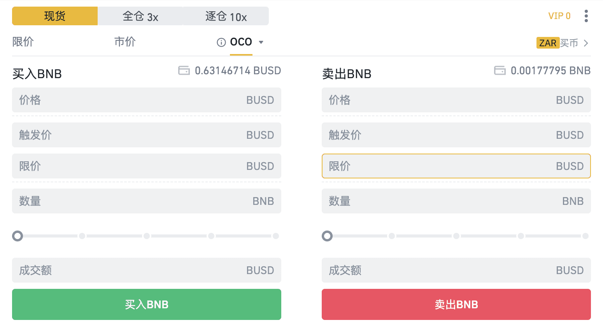
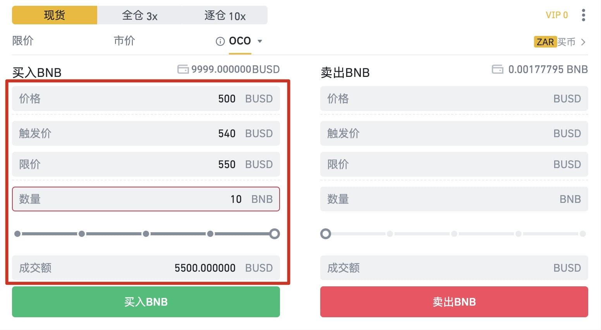
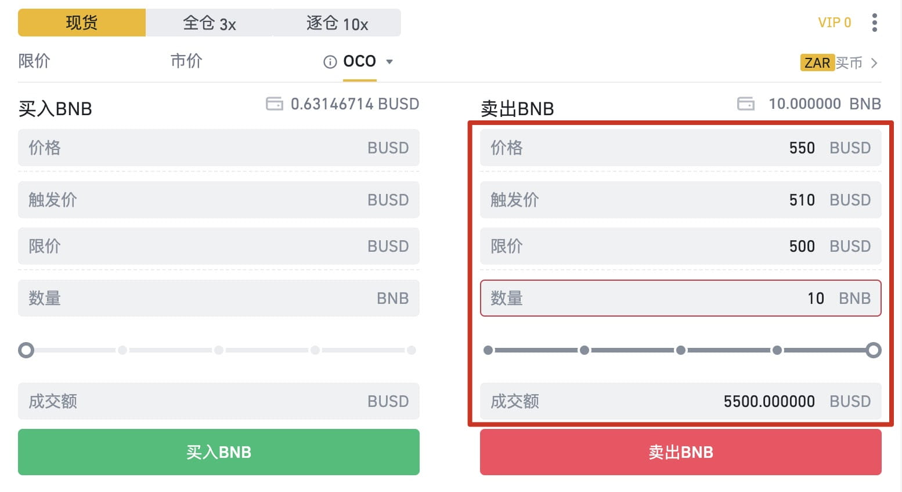

# 如何使用幣安OCO訂單功能？

### **一、什麼是OCO訂單？**

OCO (One-Cancels-the-Other)訂單即選擇性委託訂單，是指將止損單和限價單組合成一個OCO訂單發出委託，其中的一個訂單成交或部分成交時，另一個訂單則自動撤銷。OCO訂單可在保證買入/賣出達成的情況下，爭取較好的成交價格。

可以想成「限價單 + 限價止損單」的綜合版，又被稱為「 OCO 選擇性委託」

### **二、名詞解釋**

限價價格（Limit Price）：當價格達到限價價格時將會按照該價格全部成交或者部分成交（根據對手單數量決定）。

止盈止損價（Stop-Limit）: 設定觸發價格及限定價格，當市場價格達到觸發價格時，將會按照限價價格成交限價委託。

### **三、如何使用OCO訂單**

用戶可以根據自身對市場方向判斷設置OCO訂單。

### 看漲

交易者看漲BNB，想要買入BNB，他可以使用OCO訂單設置一個低於市場價的限價買單，和一個高於市價的止損買單。

如：BNB當前市場價格510 BUSD，交易者想要買入10個BNB，交易者認為500是很好的買入價，如果價格上漲到540可以接受最高買入價為550。那麼交易者就可以按照以下方式設置。

- 價格 為500
- 【止盈止損】觸發價 為540
- 【止盈止損】限價 為550
- 數量10

若價格下跌至500，500的限價單會被觸發，交易者訂單會全部成交或者部分成交，則止損單會被自動撤銷。

若價格上漲至540，則觸發止損單，以委託價550買入10個BNB，交易者訂單會全部成交或者部分成交，同時取消500的限價買單。

### 看跌

交易者看跌BNB，想要賣出BNB，他可以使用OCO訂單設置一個高於市場價的限價賣單，和一個低於於市價的止損賣單。

如：BNB當前市場價格540 BUSD，交易者想要賣出10個BNB，交易者認為550是很好的賣出價，如果價格下跌到510可以接受最低賣出價為500。那麼交易者就可以按照以下方式設置。

- 價格 為550
- 【止盈止損】觸發價 為510
- 【止盈止損】限價 為500
- 數量10

若價格上漲至550，550的限價單會被觸發，交易者訂單會全部成交或者部分成交，則止損單會被自動撤銷。

若價格下跌至510，則觸發止損單，以委託價500賣出10個BNB，交易者訂單會全部成交或者部分成交，同時取消550的限價賣單。

### **四、價格限制**

賣單： 限價>當前市價>止損觸發價（stop limit）

買單： 限價<當前市價<止損觸發價(stop limit)

*為了更快速的成交，根據買賣建議限價價格比觸發價價格稍微高或者低一點。