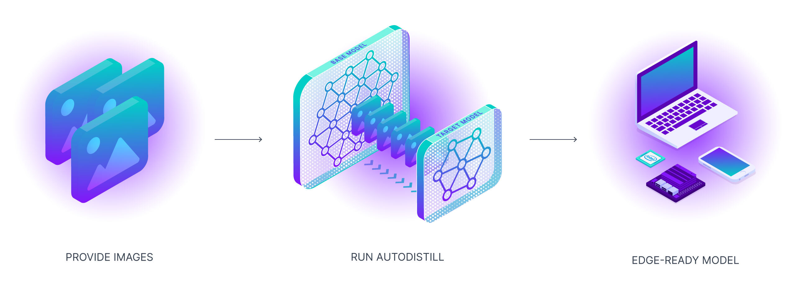
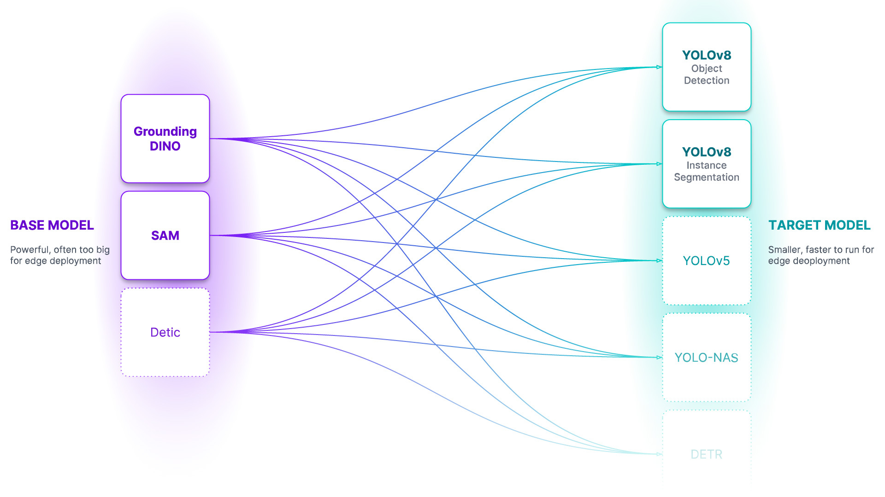

# 使用 Autodistill 自動訓練 YOLOv8 模型教學

## 關於 Autodistill

以下是使用 Autodistill 標記資料並訓練模型的[官方案例](https://github.com/autodistill/autodistill)

- [英文官方 DEMO](https://colab.research.google.com/github/roboflow-ai/notebooks/blob/main/notebooks/how-to-auto-train-yolov8-model-with-autodistill.ipynb)
- [中文版 DEMO](https://colab.research.google.com/drive/1f-sQfSnk3GsLNvtHvJN1IffsPCMMNA9c?usp=sharing)

要使用的人可以修改資料集（就改 load 資料集那部分就可以了）、標記資料的大模型（ontology 那邊）、微調的目標模型（target model 那部分的程式碼）以符合自己的需求。

> **注意：** 訓練（微調）時如果要修改超參數（除了 epoch），可能還是要看下官方文件，然後修改、測試直到符合需求。

---

## 如何使用 Autodistill 自動訓練 YOLOv8 模型

Autodistill 利用大型、較慢的基礎模型來訓練小型、更快的監督模型。使用 Autodistill，您可以從未標記的圖像開始，無需人工干預，直接在邊緣運行自定義模型進行推理。



隨著基礎模型（大模型）越來越優秀，它們將越來越能夠在標記過程中輔助或替代人類。我們需要工具來引導、利用和比較這些模型。此外，這些基礎模型很大、昂貴，並且經常被私有 API 所控制。對於許多生產用例（製造端的應用場景），我們需要的是能夠在邊緣以低成本和實時運行的模型。



---

## 教學大綱

在本教學中，我們將涵蓋：

- 檢查 GPU 的設定
- 圖片資料集準備
- 自動標記資料集
- 訓練目標模型
- 評估目標模型
- 執行視頻推理

---

## 🔥 Let's begin!

### ⚡ 檢查 GPU 的設定

讓我們確保我們有訪問 GPU 的權限。我們可以使用 `nvidia-smi` 命令來做到這一點。

如果遇到任何問題，請導航到 `Edit` → `Notebook settings` → `Hardware accelerator`，將其設置為 `GPU`，然後點擊 `Save`。

```bash
!nvidia-smi
```

---

## 🧪 安裝 Autodistill

> **注意：** Autodistill 是一個生態系統，用於使用大型、較慢的基礎模型來訓練小型、更快的監督模型。每個基礎模型（Base）以及目標模型（Target model）都有其自己獨立的代碼庫和 pip 包。

```bash
!pip install -q \
    autodistill \
    autodistill-grounded-sam \
    autodistill-yolov8 \
    supervision==0.9.0
```

> **注意：** 為了方便管理數據集、圖像和模型，這邊創建了一個 `HOME` 常量。

```python
import os
HOME = os.getcwd()
print(HOME)
```

---

## 🖼️ 圖像資料集準備

> **注意：** 使用 Autodistill 所需要的就是一組你希望自動標註並用於目標模型訓練的圖像。

```bash
!mkdir {HOME}/images
```

> **注意：** 如果您想要在您的資料上構建 YOLOv8，請確保將其上傳到我們剛剛建立的 `images` 目錄中。☝️

### 下載原始影片（可選）

> **注意：** 在本教程中，我們將從包含影片文件的目錄開始，我將向您展示如何將其轉換為一組可立即使用的圖像。如果您正在使用您自己的圖像，則可以跳過此部分。

```bash
!mkdir {HOME}/videos
%cd {HOME}/videos

# 下載包含視頻的 zip 文件
!wget --load-cookies /tmp/cookies.txt "https://docs.google.com/uc?export=download&confirm=$(wget --quiet --save-cookies /tmp/cookies.txt --keep-session-cookies --no-check-certificate 'https://docs.google.com/uc?export=download&id=1wnW7v6UTJZTAcOQj0416ZbQF8b7yO6Pt' -O- | sed -rn 's/.*confirm=([0-9A-Za-z_]+).*/\1\n/p')&id=1wnW7v6UTJZTAcOQj0416ZbQF8b7yO6Pt" -O milk.zip && rm -rf /tmp/cookies.txt

# 解壓縮視頻
!unzip milk.zip
```

### 將視頻轉換為圖片（可選）

> **注意：** 現在，讓我們將視頻轉換為圖片。默認情況下，下面的程式碼會從每個影片中保存每個第 10 幀。您可以通過調整 `FRAME_STRIDE` 參數的值來更改這一點。

```python
VIDEO_DIR_PATH = f"{HOME}/videos"
IMAGE_DIR_PATH = f"{HOME}/images"
FRAME_STRIDE = 3
```

> **注意：** 請注意，我們將兩個影片放在一旁，以便在筆記本的末尾使用它們來評估模型。

```python
import supervision as sv
from tqdm.notebook import tqdm

video_paths = sv.list_files_with_extensions(
    directory=VIDEO_DIR_PATH,
    extensions=["mov", "mp4"])

print(video_paths)

for video_path in tqdm(video_paths):
    video_name = video_path.stem
    image_name_pattern = video_name + "-{:05d}.png"
    with sv.ImageSink(target_dir_path=IMAGE_DIR_PATH, image_name_pattern=image_name_pattern) as sink:
        for image in sv.get_video_frames_generator(source_path=str(video_path), stride=FRAME_STRIDE):
            sink.save_image(image=image)
```

### 顯示圖片樣本

> **注意：** 在開始使用 Autodistill 構建模型之前，先檢查下所需的資料。

```python
import supervision as sv

image_paths = sv.list_files_with_extensions(
    directory=IMAGE_DIR_PATH,
    extensions=["png", "jpg", "jpg"])

print('image count:', len(image_paths))
```

我們也可以繪製我們的圖片資料集的幾個樣本：

```python
IMAGE_DIR_PATH = f"{HOME}/images"
SAMPLE_SIZE = 16
SAMPLE_GRID_SIZE = (4, 4)
SAMPLE_PLOT_SIZE = (16, 16)
```

```python
import cv2
import supervision as sv

titles = [
    image_path.stem
    for image_path
    in image_paths[:SAMPLE_SIZE]]

images = [
    cv2.imread(str(image_path))
    for image_path
    in image_paths[:SAMPLE_SIZE]]

sv.plot_images_grid(images=images, titles=titles, grid_size=SAMPLE_GRID_SIZE, size=SAMPLE_PLOT_SIZE)
```

---

## 🏷️ 自動標註資料集

### 定義 Ontology 本體

**Ontology 本體** - 本體論定義了你的基礎模型如何被提示（prompt），你的資料集將描述什麼，以及你的目標模型將預測什麼。`CaptionOntology` 是個較簡單的本體設定，它用文本標題（Caption）提示基礎模型並將它們映射到類名。其他本體可能會使用 CLIP 向量或示例圖像，而不是文本標題。

```python
from autodistill.detection import CaptionOntology

ontology = CaptionOntology({
    "car": "car",
    "building": "building"
})
```

### 初始化基礎模型並自動標記

**基礎模型** - 基礎模型是一個大型的基礎模型，對很多事物都有很多了解。基礎模型通常是多模態的，能夠執行許多任務。它們體積大、速度慢、成本高。基礎模型的例子包括 GroundedSAM 和即將推出的 GPT-4 多模態變體。我們使用基礎模型（以及未標記的輸入數據和本體設定）來創建資料集。

```python
DATASET_DIR_PATH = f"{HOME}/dataset"
```

> **注意：** 基礎模型運行緩慢... 為自己泡杯咖啡，自動標記可能需要一段時間。☕

```python
from autodistill_grounded_sam import GroundedSAM

base_model = GroundedSAM(ontology=ontology)
dataset = base_model.label(
    input_folder=IMAGE_DIR_PATH,
    extension=".png",
    output_folder=DATASET_DIR_PATH)
```

### 展示資料集樣本

**資料集** - 資料集是一組可以用來訓練目標模型的自動標記數據。它是由基礎模型生成的輸出。

```python
ANNOTATIONS_DIRECTORY_PATH = f"{HOME}/dataset/train/labels"
IMAGES_DIRECTORY_PATH = f"{HOME}/dataset/train/images"
DATA_YAML_PATH = f"{HOME}/dataset/data.yaml"

import supervision as sv

dataset = sv.DetectionDataset.from_yolo(
    images_directory_path=IMAGES_DIRECTORY_PATH,
    annotations_directory_path=ANNOTATIONS_DIRECTORY_PATH,
    data_yaml_path=DATA_YAML_PATH)

len(dataset)
```

```python
import supervision as sv

image_names = list(dataset.images.keys())[:SAMPLE_SIZE]

mask_annotator = sv.MaskAnnotator()
box_annotator = sv.BoxAnnotator()

images = []
for image_name in image_names:
    image = dataset.images[image_name]
    annotations = dataset.annotations[image_name]
    labels = [
        dataset.classes[class_id]
        for class_id
        in annotations.class_id]
    annotates_image = mask_annotator.annotate(
        scene=image.copy(),
        detections=annotations)
    annotates_image = box_annotator.annotate(
        scene=annotates_image,
        detections=annotations,
        labels=labels)
    images.append(annotates_image)

sv.plot_images_grid(
    images=images,
    titles=image_names,
    grid_size=SAMPLE_GRID_SIZE,
    size=SAMPLE_PLOT_SIZE)
```

---

## 🔥 訓練目標模型 - YOLOv8

**目標模型** - 目標模型是一種監督模型，它消耗一個資料集並輸出一個經過提煉、準備好部署的模型。目標模型通常小巧、快速，並經過微調，以便非常好地執行特定任務（但它們不會很好地泛化到資料集中描述的信息之外）。目標模型的例子包括 YOLOv8 和 DETR。

```python
%cd {HOME}

from autodistill_yolov8 import YOLOv8

target_model = YOLOv8("yolov8l.pt")
target_model.train(DATA_YAML_PATH, epochs=100)
```

---

## ⚖️ 評估目標模型

> **注意：** 就像常規的 YOLOv8 訓練一樣，我們現在可以查看存儲在 `runs` 目錄中的產物。

### 混淆矩陣

```python
%cd {HOME}

from IPython.display import Image

Image(filename=f'{HOME}/runs/detect/train/confusion_matrix.png', width=600)
```

### 訓練結果

```python
%cd {HOME}

from IPython.display import Image

Image(filename=f'{HOME}/runs/detect/train/results.png', width=600)
```

### 驗證批次預測

```python
%cd {HOME}

from IPython.display import Image

Image(filename=f'{HOME}/runs/detect/train/val_batch0_pred.jpg', width=600)
```

---

## 🎬 對影片進行分析

```python
import locale
locale.getpreferredencoding = lambda: "UTF-8"
```

```python
INPUT_VIDEO_PATH = TEST_VIDEO_PATHS[0]
OUTPUT_VIDEO_PATH = f"{HOME}/output.mp4"
TRAINED_MODEL_PATH = f"{HOME}/runs/detect/train/weights/best.pt"
```

```bash
!yolo predict model={TRAINED_MODEL_PATH} source={INPUT_VIDEO_PATH}
```

---

## 將模型導出

```bash
yolo export model=yolov8n.pt
```

---

## 參考資料

- [Autodistill GitHub](https://github.com/autodistill/autodistill)
- [Roboflow 官方教學](https://colab.research.google.com/github/roboflow-ai/notebooks/blob/main/notebooks/how-to-auto-train-yolov8-model-with-autodistill.ipynb)
