# labelImg 教學：標註 YOLO 格式資料

## 目錄
- [零、建立 Python 環境](#零建立-python-環境)
- [一、安裝 labelImg](#一安裝-labelimg)
- [二、啟動 labelImg](#二啟動-labelimg)
- [三、使用 labelImg 標註 YOLO](#三使用-labelimg-標註-yolo)
- [四、其他功能](#四其他功能)

## 零、建立 Python 環境

> 待補充。
>
> 建議使用 Python 3.9.x（例如 3.9.10），避免使用 3.10 以上版本，以免發生相容性問題。

## 一、安裝 labelImg

1. 開啟終端機。
2. 在 Windows 搜尋欄輸入 `CMD`，開啟「命令提示字元」。
3. 執行以下指令安裝 `labelImg`：

```bash
pip install labelImg
```

## 二、啟動 labelImg

1. 在圖片資料夾中建立 `classes.txt`（每行一個類別名稱）。

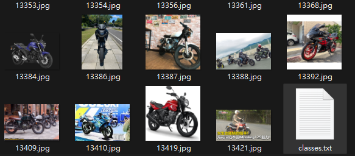
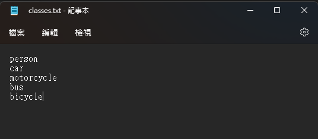

2. 在命令提示字元輸入：

```bash
labelImg class_file {classes.txt 的路徑}
```

如果成功開啟 `labelImg`，代表安裝完成。

> `classes.txt` 的路徑請改成你自己的實際路徑。

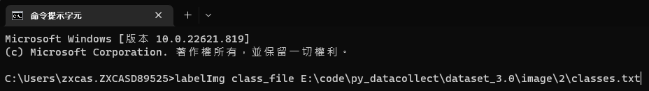

3. 成功開啟後，會看到如下視窗：

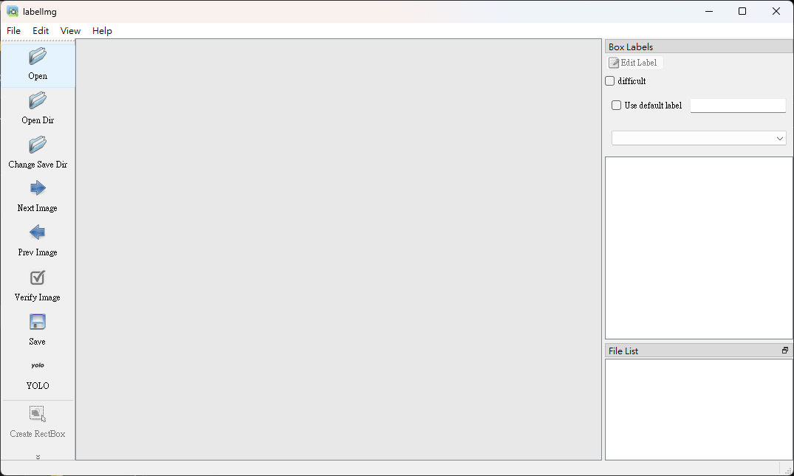

4. 左側工具列可拖曳調整位置。

> 下方教學以工具列放在上方為例。

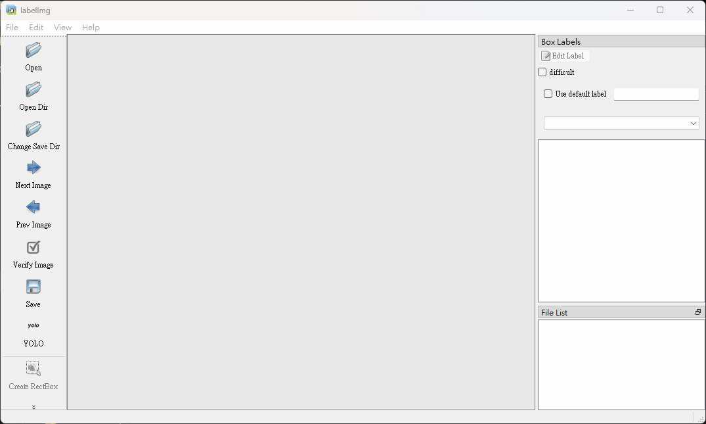

## 三、使用 labelImg 標註 YOLO

1. 切換到 YOLO 格式。

> 先確認目前格式顯示為 `YOLO`。

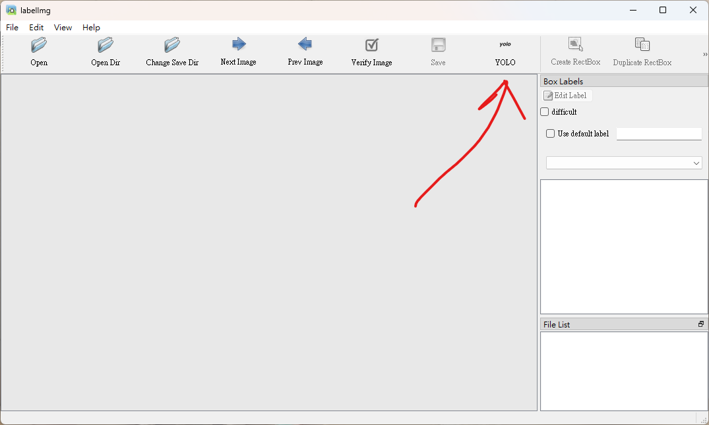

> 若不是 `YOLO`，就持續按到切換為 `YOLO`。

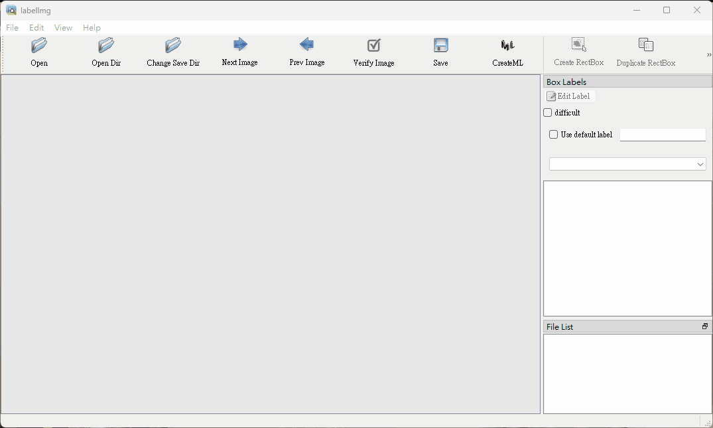

2. 點選 `Open Dir`。

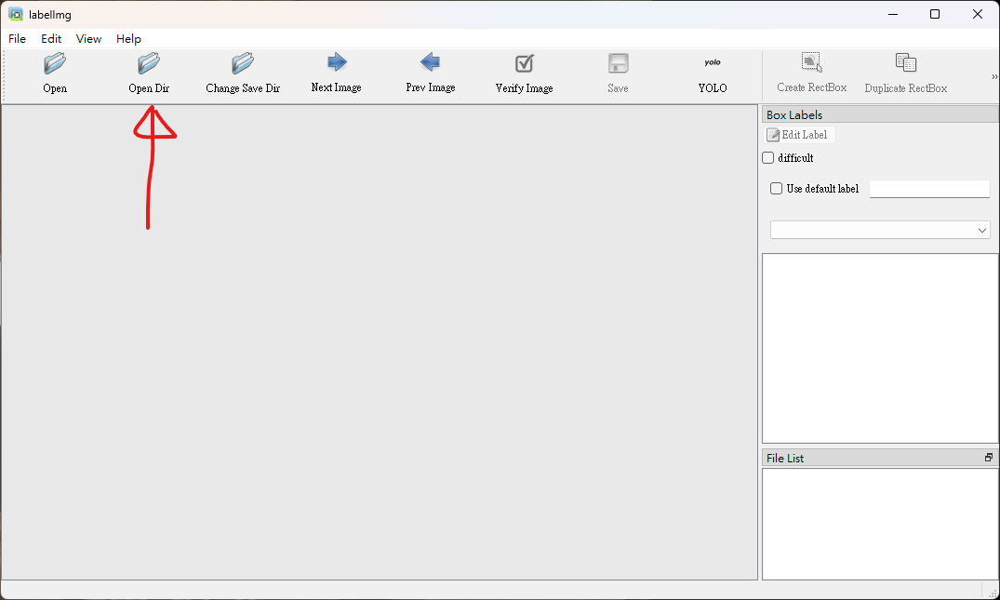

> 若前面有改過格式，可能會出現警告視窗，點選 `Yes` 即可。

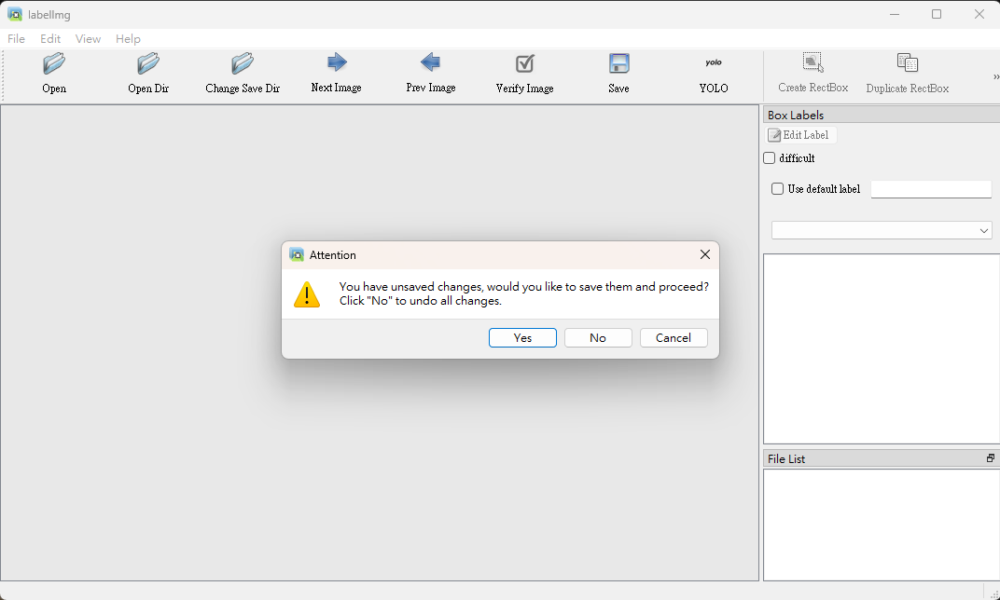

3. 選擇要標註的圖片資料夾。

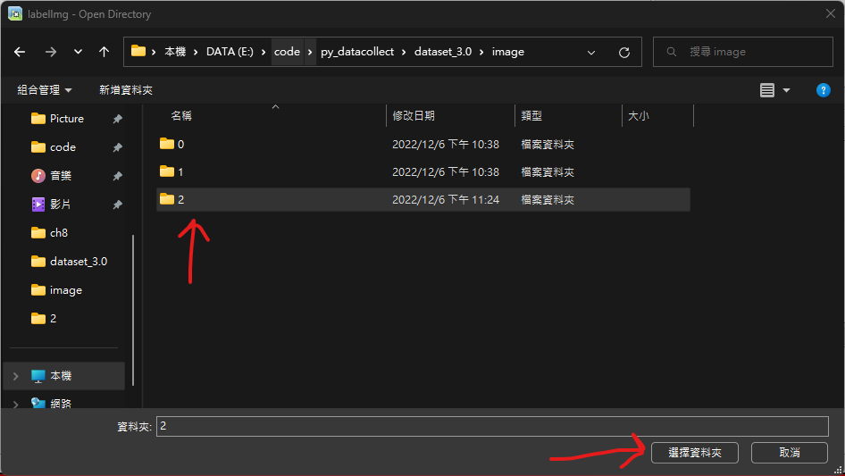

4. 畫面會顯示該資料夾中的第一張圖片。


若圖片 `5.jpg` 同資料夾內已有同名標註檔 `5.txt`，程式會自動讀取 `5.txt` 內容並顯示已存在的框。

5. 點選 `Change Save Dir`。


> 建議選擇與圖片同一層資料夾。


6. 開始標註。

點選 `Create RectBox` 或按快捷鍵 `W` 進入畫框模式。

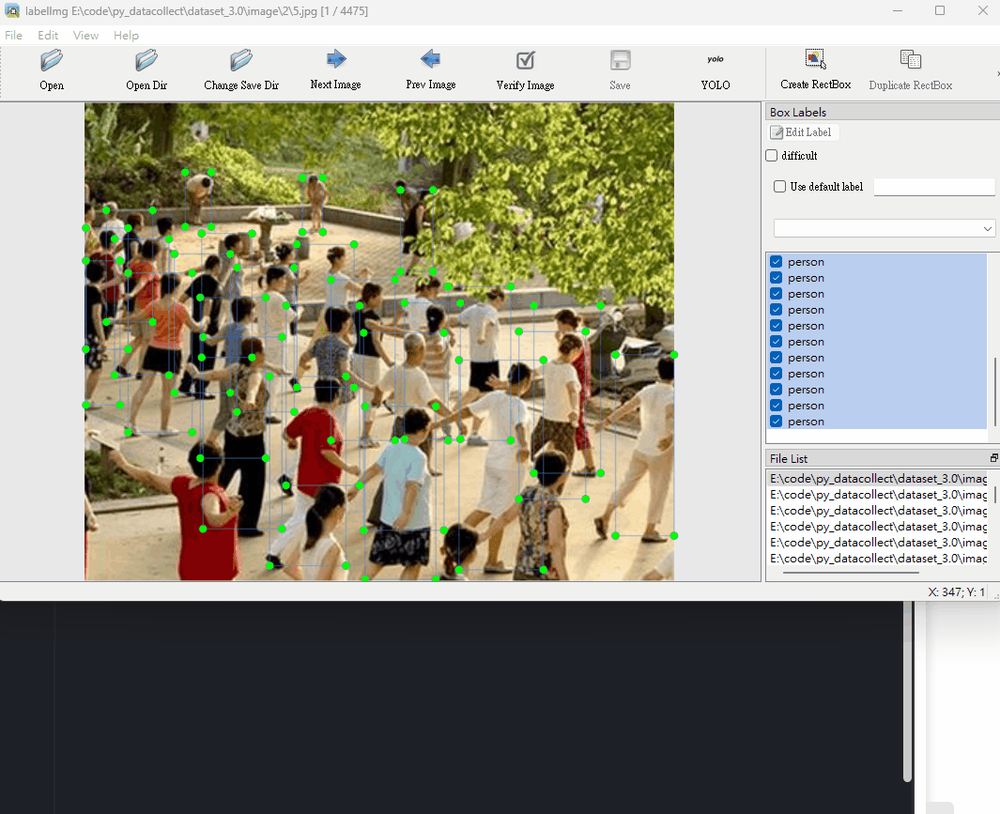

在目標物件上按住滑鼠左鍵拖曳，建立完整包覆目標的 `bounding box`，放開後選擇對應類別。

若啟動 `labelImg` 時已載入 `classes.txt`，選類別時可直接從列表挑選，不必手動輸入。

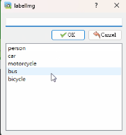

7. 儲存標註。

點選 `Save` 或按快捷鍵 `Ctrl + S`。


儲存後會產生與圖片同名的標註檔，例如：

- 圖片：`5.jpg`
- 標註：`5.txt`

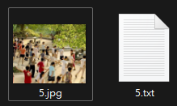

`5.txt` 的每行為一個框，格式如下：

```text
<class_id> <x_center> <y_center> <width> <height>
```

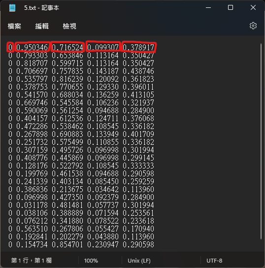

數值都落在 `0` 到 `1`，因為會自動正規化。舉例：

- 影像尺寸：`640 x 640`
- 原始框資訊：

```text
x = 150
y = 300
width = 50
height = 200
```

正規化後：

```text
x = 150 / 640 = 0.234375
y = 300 / 640 = 0.46875
width = 50 / 640 = 0.078125
height = 200 / 640 = 0.3125
```

8. 切換圖片。

標完並儲存後可按 `Next Image` 前往下一張；若要回上一張可按 `Prev Image`。


9. Auto Save（自動存檔）。

若擔心忘記按 `Save`，可開啟自動存檔模式。

- 點選上方 `View`。

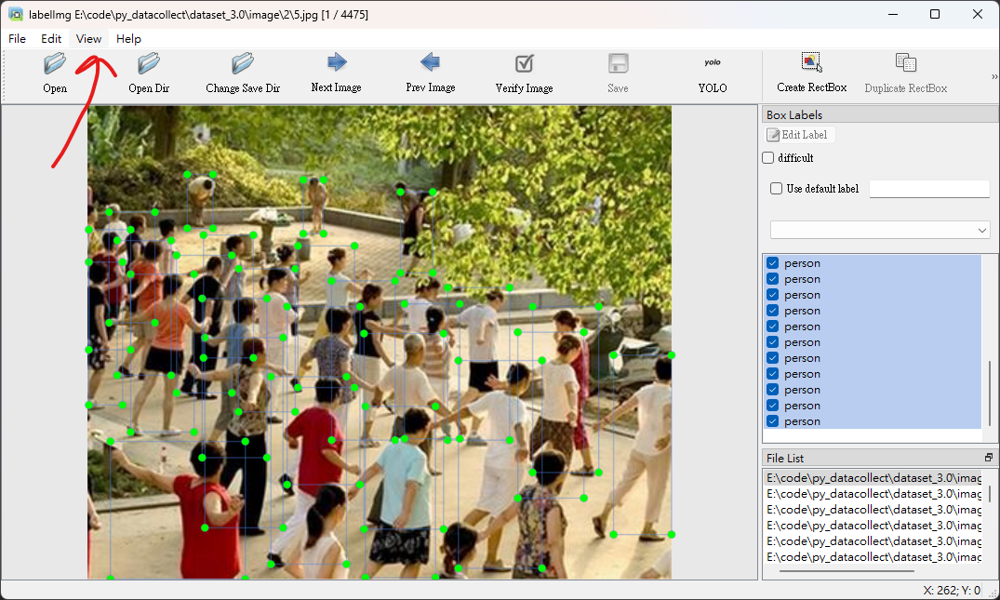

- 點選 `Auto Save mode`。

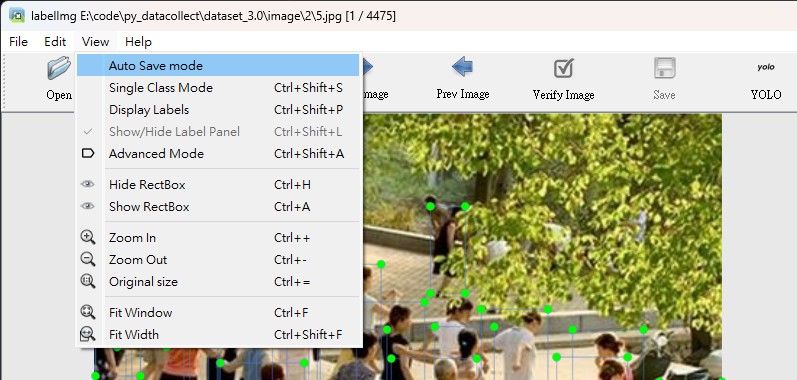

- 有打勾即代表已啟用。

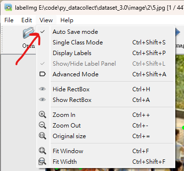

## 四、其他功能

1. File List

右下角 `File List` 會列出資料夾內所有圖片。在該視窗連按兩下可彈出，再連按兩下可收回。

`File List` 也會顯示目前所在圖片，可直接連按兩下跳轉到指定圖片。


## 結語

如果內容有錯，歡迎回報。
