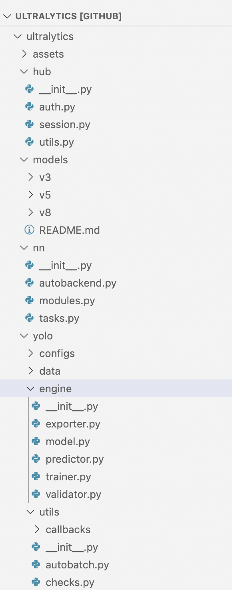
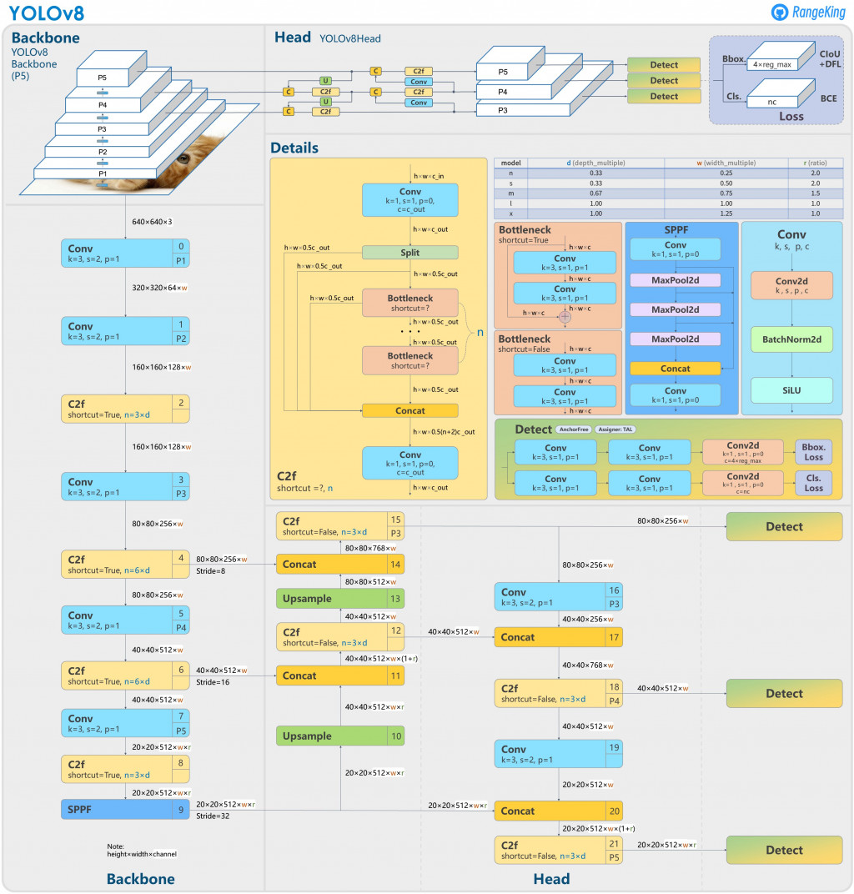
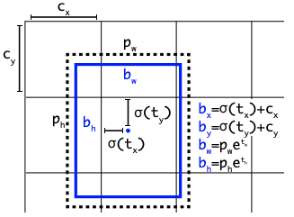
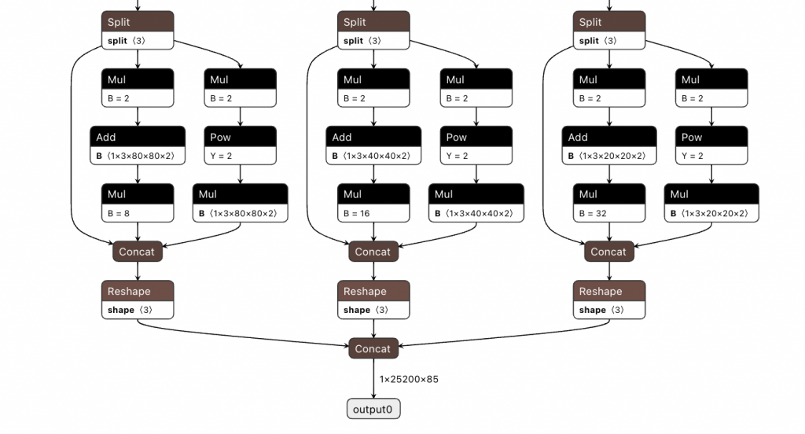
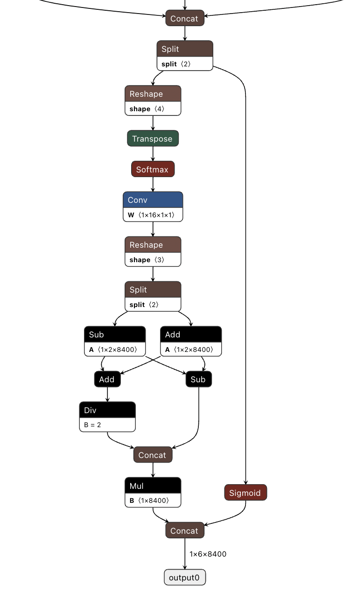
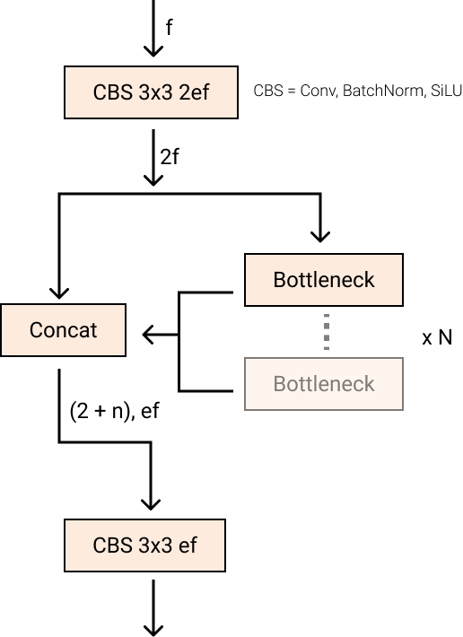
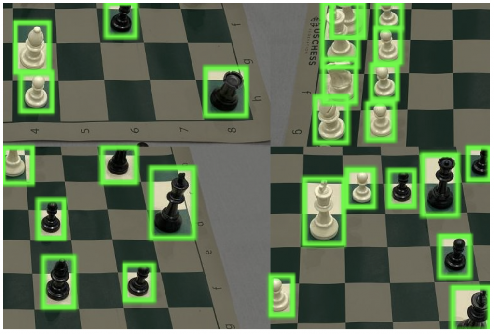
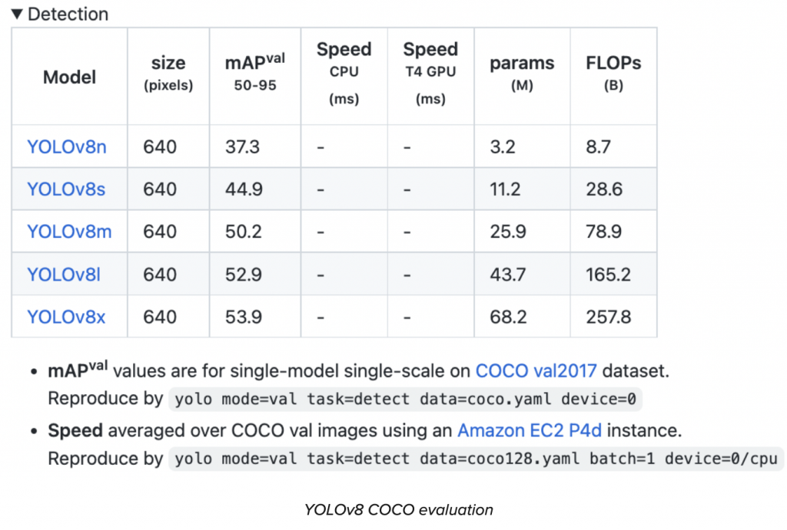
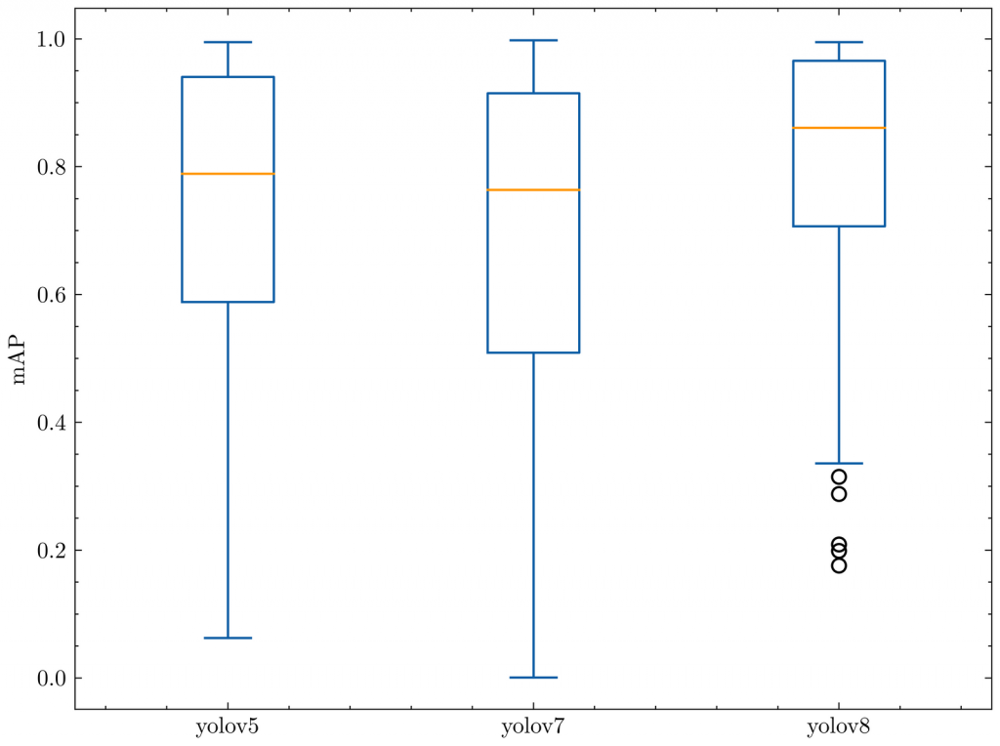
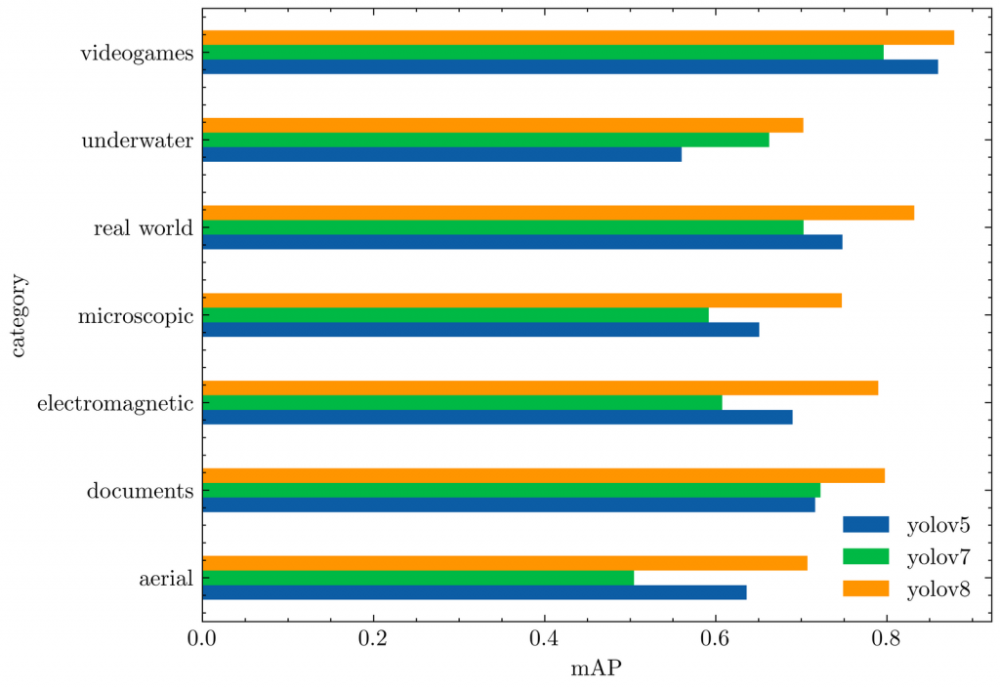

# YOLOv8 物體檢測玩具專案 - Yolo v8 介紹

大概來不及弄完，先貼大致的東西

## (一)參考連結以及影片

### 1. [How to Train YOLOv8 Object Detection on a Custom Dataset (官網教學)](https://blog.roboflow.com/how-to-train-yolov8-on-a-custom-dataset/)

這是使用官網教學是都使用他們家的套件去訓練。

### 2. YOLOv8 Instance Segmentation on Custom Dataset | Windows & Linux

這個是在本地端使用 Labelme 筐圖（傳統的方法），然後使用Yolo v8 訓練

[](https://www.youtube.com/watch?v=DMRlOWfRBKU)

### 3. Auto Label your Custom Dataset with Autodistill for YOLOv8

這邊是使用 Autodistill label 搜集好的圖片並使用 Yolo v8 訓練

[](https://www.youtube.com/watch?v=7tuXEvZ2YNw)

## (二)估計會用到的模型

### 1. Yolo v8 介紹（官網 Blog 介紹）


隨著 [YOLOv8](https://github.com/ultralytics/ultralytics?ref=blog.roboflow.com) 的發布，電腦視覺方向又更前進了一步，該模型重新定義了物件偵測方面的最前端的平均技術水準（官方的宣傳 哈哈）。

除了模型架構本身的改進之外，YOLOv8還透過PIP套件向開發人員介紹了一個方向以使用YOLO模型（使用pip 就可以安裝）。

---

官方建議可以直接開始 [YOLOv8的教學](https://blog.roboflow.com/how-to-train-yolov8-on-a-custom-dataset/)。上面的連結是使用 Yolo v8 用自己的資料訓練模型，也是這個玩具專案的參考之一。

---

在這篇文章中，我們將深入 YOLOv8 在電腦視覺領域的較獨特的地方，並將其與類似模型的準確性進行比較，並討論 YOLOv8 GitHub 儲存庫中的最新的改變。Let's go!

[](https://www.youtube.com/watch?v=x0HlrCjJDjs)

### 什麼是 YOLOv8？

YOLOv8 是最新、最先進的 YOLO 模型，可用於物件偵測、影像分類和實例分割任務。YOLOv8 由 [Ultralytics](https://ultralytics.com/?ref=blog.roboflow.com) 開發，Ultralytics 還創建了具有影響力和行業定義的 YOLOv5 模型。與 YOLOv5 相比，YOLOv8 包含大量架構和開發人員體驗變更和改進。

截至官方撰寫本文（JAN 11, 2023）時，YOLOv8 正在積極開發中，Ultralytics 正在開發新功能並根據社群的回饋修改或調整模型。事實上，當 Ultralytics 發布模型時，此模型會得到長期的支持：該組織與社區合作，使模型達到最佳狀態。

### YOLO 如何成長為 YOLOv8

[YOLO（You Only Look Once）](https://blog.roboflow.com/guide-to-yolo-models/)系列模型在電腦視覺界聲名大噪。YOLO 的名氣歸因於其在保持較小模型尺寸的同時具有相當高的準確性。YOLO 模型可以在單一 GPU 上進行訓練，這使得大多數的開發人員可以使用以及調優這個模型。機器學習從業者可以以低成本將其部署在邊緣硬體或雲端。

YOLO 自 Joseph Redmond 於 2015 年首次推出以來一直受到電腦視覺社群的培育。在早期（版本 1-4），YOLO 在 Redmond 編寫的名為 [Darknet](https://blog.roboflow.com/training-yolov4-on-a-custom-dataset/) 的自訂深度學習框架中以 C 程式碼進行維護。

[](https://www.youtube.com/watch?v=fptraskX2-Y)

YOLOv5 inferring on a bicycle

YOLOv8 作者為 Ultralytics 的 Glenn Jocher，在 PyTorch 中追蹤以及深度了解了 [YOLOv3 in pytorch](https://blog.roboflow.com/training-a-yolov3-object-detection-model-with-a-custom-dataset/) 的程式碼以及運作。隨著影子倉庫中的訓練跟對項目跟程式碼的了解變得更深，Ultralytics 最終推出了自己的模型：[YOLOv5](https://blog.roboflow.com/how-to-train-yolov5-on-a-custom-dataset/)。

YOLOv5 由於其靈活的 Pythonic 結構，迅速成為了世界上的 SOTA（最先進的技術）倉庫。這種結構讓社群能夠創造新的模型改進，並通過類似的 PyTorch 方法快速在倉庫中分享。

除了具備堅實的模型基礎外，YOLOv5的維護者們也致力於支持模型周圍的健康軟體生態系統。他們積極修復問題並隨著社群的需求推進倉庫的功能。

在過去兩年中，YOLOv5 PyTorch 儲存庫中衍生出了各種模型，包括 [Scaled-YOLOv4](https://roboflow.com/model/scaled-yolov4?ref=blog.roboflow.com)、[YOLOR](https://blog.roboflow.com/train-yolor-on-a-custom-dataset/) 和 [YOLOv7](https://blog.roboflow.com/yolov7-breakdown/)。世界各地出現了基於 PyTorch 的其他模型，例如 [YOLOX](https://blog.roboflow.com/how-to-train-yolox-on-a-custom-dataset/) 和 [YOLOv6](https://blog.roboflow.com/how-to-train-yolov6-on-a-custom-dataset/)。一路走來，每個 YOLO 模型都帶來了新的 SOTA 技術，不斷推動模型的準確性和效率。

在過去的六個月中，Ultralytics 致力於研究 YOLO 的最新 SOTA 版本 YOLOv8。YOLOv8於2023年1月10日上線。

### 為什麼要使用 YOLOv8？

以下是您應該考慮在下一個電腦視覺專案中使用 YOLOv8 的幾個主要原因：

1. YOLOv8 在COCO和Roboflow 100測得的準確率很高。
2. YOLOv8 具有許多方便開發人員的功能，從易於使用的 CLI 到結構良好的 Python 套件。
3. 圍繞著 YOLO 有一個大型社區，圍繞 YOLOv8 模型的社區也在不斷增長，這意味著電腦視覺圈子裡有很多人可能能夠在你需要指導時為你提供幫助。

YOLOv8 在 COCO 上實現了很高的準確率。例如，YOLOv8m 模型（中等模型）在 COCO 上測量時實現了 50.2% 的 mAP。當針對 Roboflow 100（專門評估各種特定任務領域的模型效能的資料集）進行評估時，YOLOv8 的得分明顯優於 YOLOv5。本文後面的性能分析中提供了有關這方面的更多資訊。

此外，YOLOv8 中方便開發人員的功能也很重要。與其他模型中的任務分散在許多不同的 Python 檔案中執行不同，YOLOv8 附帶的 CLI 使模型訓練更加直觀。這是對 Python 套件的補充，它提供了比以前的模型更無縫的編碼體驗。

YOLO 的社區是這個模型的優秀之處。許多電腦視覺專家都了解 YOLO 及其工作原理，網路上有大量有關在實踐中使用 YOLO 的指南。儘管 YOLOv8 在撰寫本文時還是新的，但網路上有許多指南可以提供幫助。

以下是官方的一些學習資源，可以使用它們來增進對 YOLO 的了解：

- [Roboflow 模型上的 YOLOv8 模型文件](https://roboflow.com/model/yolov8?ref=blog.roboflow.com)
- [如何在自訂資料集上訓練 YOLOv8 模型](https://blog.roboflow.com/how-to-train-yolov8-on-a-custom-dataset/)
- [如何將 YOLOv8 模型部署到 Raspberry Pi](https://blog.roboflow.com/how-to-deploy-a-yolov8-model-to-a-raspberry-pi/)
- [用於訓練 YOLOv8 目標偵測模型的 Google Colab Notebook](https://colab.research.google.com/github/roboflow-ai/notebooks/blob/main/notebooks/train-yolov8-object-detection-on-custom-dataset.ipynb?ref=blog.roboflow.com)
- [用於訓練 YOLOv8 分類模型的 Google Colab Notebook](https://colab.research.google.com/github/roboflow-ai/notebooks/blob/main/notebooks/train-yolov8-classification-on-custom-dataset.ipynb?ref=blog.roboflow.com)
- [用於訓練 YOLOv8 分割模型的 Google Colab Notebook](https://colab.research.google.com/github/roboflow-ai/notebooks/blob/main/notebooks/train-yolov8-instance-segmentation-on-custom-dataset.ipynb?ref=blog.roboflow.com)
- [使用 YOLOv8 和 ByteTRACK 追蹤和計數車輛](https://youtu.be/OS5qI9YBkfk?ref=blog.roboflow.com)

### YOLOv8 repository 和 PIP 包

[YOLOv8 code repository](https://github.com/ultralytics/ultralytics?ref=blog.roboflow.com) 旨在成為社區使用和迭代模型的地方。由於我們知道該模型將不斷改進，因此我們可以將初始的 YOLOv8 模型結果作為基準，並期望隨著新的迷你版本的發布，未來的改進。

我們期望的最佳狀況是研究人員開始在 Ultralytics 儲存庫的基礎上開發他們的網路。研究一直在 YOLOv5 的分支中進行，但如果模型在一個位置製作並最終合併到主線中會更好。

#### YOLOv8 repository 佈局

YOLOv8 模型使用與 YOLOv5 類似的程式碼再加上部分新的結構，其中相同的程式碼流程支援分類、實例分割和物件偵測任務類型。

模型仍使用相同的 [YOLOv5 YAML 格式](https://roboflow.com/formats/yolov8-pytorch-txt?ref=blog.roboflow.com) 進行初始化，資料集格式也保持不變。



#### YOLOv8 CLI

該 `ultralytics` 軟體包透過 CLI 進行分發。這對於許多 YOLOv5 用戶來說是類似的，其中核心訓練、檢測和匯出互動也是透過 CLI 完成的。

```bash
yolo task=detect mode=val model={HOME}/runs/detect/train/weights/best.pt data={dataset.location}/data.yaml
```

您可以將 `task` in `[detect, classify, segment]`、`mode` in `[train, predict, val, export]`、`model` 作為未初始化的檔案 `.yaml` 或先前訓練過的 `.pt` 檔案傳遞。

#### YOLOv8 Python 套件

除了可用的 CLI 工具外，YOLOv8 現在還作為 PIP 套件分發。這使得開發變得有點困難，但這個套件解鎖了將 YOLOv8 編織到 Python 程式碼中的所有可能性。

```python
from ultralytics import YOLO

# Load a model
model = YOLO("yolov8n.yaml")  # build a new model from scratch
model = YOLO("yolov8n.pt")  # load a pretrained model (recommended for training)

# Use the model
results = model.train(data="coco128.yaml", epochs=3)  # train the model
results = model.val()  # evaluate model performance on the validation set
results = model("https://ultralytics.com/images/bus.jpg")  # predict on an image
success = YOLO("yolov8n.pt").export(format="onnx")  # export a model to ONNX format
```

#### YOLOv8 註釋格式

YOLOv8 使用 YOLOv5 PyTorch TXT 註解格式，這是 Darknet 註解格式的修改版本。如果您需要將資料轉換為 YOLOv5 PyTorch TXT 以在 YOLOv8 模型中使用，我們可以滿足您的需求。查看我們的 [Roboflow Convert](https://roboflow.com/formats/yolov8-pytorch-txt?ref=blog.roboflow.com) 工具，以了解如何轉換資料以在新的 YOLOv8 模型中使用。

#### YOLOv8 標記工具

Ultralytics 是 YOLOv8 的創建者和維護者和 Roboflow 合作，成為推薦在 YOLOv8 專案中使用的註解和匯出工具。使用 Roboflow，這邊可以為 YOLOv8 支援的所有任務（物件檢測、分類和分割）註釋數據，並匯出數據，以便可以將其與 YOLOv8 CLI 或 Python 套件一起使用。

#### YOLOv8 入門

要開始將 YOLOv8 應用到您自己的用例中，[請查看我們關於如何在自訂資料集上訓練 YOLOv8 的指南](https://blog.roboflow.com/how-to-train-yolov8-on-a-custom-dataset/)。

假如要了解其他人使用 YOLOv8 所做的事情，[請瀏覽 Roboflow Universe 以獲取其他 YOLOv8 模型](https://blog.roboflow.com/yolov8-models-apis-datasets/)、資料集和靈感。

對於將模型投入生產並使用主動學習策略不斷更新模型的從業者 - 我們添加了一個方法，[讓很多人能根據這個流程在其中部署 YOLOv8 模型](https://blog.roboflow.com/upload-model-weights-yolov8/)，在我們的推理引擎中使用它並在資料集上進行標籤輔助。

總之，要在訓練跟推理的過程中玩得愉快！

#### YOLOv8 常見問題解答

##### YOLOv8 有哪些版本？

截至2023年1月10日發布，YOLOv8有五個版本，從YOLOv8n（最小模型，在COCO上mAP得分為37.3）到YOLOv8x（最大模型，在COCO上得分為53.9）。

##### YOLOv8 可以用於哪些任務？

YOLOv8 開箱即用支援物件偵測、實例分割和影像分類。

接下來讓我們深入了解該架構以及 YOLOv8 與先前的 YOLO 模型的不同之處。

### 2. YOLOv8 架構

#### YOLOv8 架構：深入探討

YOLOv8 尚未發表論文，因此我們缺乏對其創建期間所做的直接研究方法和消融研究的直接了解。話雖如此，我們分析了存儲庫和有關模型的可用信息，以開始記錄 YOLOv8 中的新增功能。

如果您想親自查看程式碼，請查看 [YOLOv8 儲存庫](https://github.com/ultralytics/ultralytics?ref=blog.roboflow.com)，並查看此 [程式碼差異](https://github.com/ultralytics/yolov5/compare/master...exp13?ref=blog.roboflow.com) 以了解一些研究是如何完成的。

在這裡，官方的blog快速總結了有影響力的模型更新，然後這邊將看看模型的評估。

下圖由 GitHub 用戶 RangeKing 製作，展示了網路架構的詳細視覺化（結構圖）。



YOLOv8 Architecture, visualisation made by GitHub user RangeKing

##### 無錨檢測

YOLOv8是一種無錨模型。這意味著它直接預測物件的中心，而不是與已知[錨框](https://blog.roboflow.com/whats-new-in-yolov8/#:~:text=from%20a%20known-,anchor%20box,-.)的偏移量。



[錨框](https://blog.roboflow.com/what-is-an-anchor-box/)是早期 YOLO 模型中眾所周知的棘手部分，因為它們可能代表目標基準框的分佈（distribution），但不能代表自訂資料集的分佈（distribution）。

在這裡，"distribution" 指的是「分佈」。這個詞在統計學中常用來描述一組數據或一個隨機變量的所有可能值及其相應的概率。在給定的上下文中，"distribution" 描述的是目標基準的框（boxes）或自定義數據集的框在特定空間或範圍內的分佈情況，這可能包括框的大小、形狀、位置等特性的分佈。



YOLOv5 的偵測頭（輸入處理？），在 [netron.app](https://netron.app/?ref=blog.roboflow.com) 中可視化
(The detection head of YOLOv5, visualized in netron.app)

無錨檢測減少了框預測的數量，從而加快了非極大值抑制 (NMS) 的速度，這是一個複雜的後處理步驟，在推理後篩選候選檢測。



YOLOv8 的偵測頭（輸入處理？），在 [netron.app](https://netron.app/?ref=blog.roboflow.com) 中圖像化

##### 新的捲積

莖的第一個 `6x6` 轉換被替換為 `3x3`，主要構建塊被更改，並且 **C2f** 替換了 **C3**。此模組總結如下圖，其中「f」是特徵數，「e」是擴展率，CBS是由 `Conv`, `BatchNorm` 和 `SiLU` 組成的區塊。

在 `C2f` 中，C2f的所有 `Bottleneck`（兩個帶有殘差連接的3x3 `convs` 的花俏名稱）都被連接起來。但在 `C3` 中，只有最後的 `Bottleneck` 被使用。



新的 YOLOv8 `C2f` 模組

與 YOLOv5 中的相同 `Bottleneck`，但第一個 conv 的核心大小從 `1x1` 更改為 `3x3`。從這些資訊中，我們可以看到YOLOv8 的ResNet區塊重新使用2015年定義的ResNet區塊。

在頸部，特徵直接連接，而不強制使用相同的通道尺寸。這減少了參數數量和張量的整體大小。

##### 關閉馬賽克增強（Mosaic Augmentation）

深度學習研究往往側重於模型架構，但 YOLOv5 和 YOLOv8 中的訓練流程是其成功的重要組成部分。

YOLOv8 在線上訓練期間增強影像。在每個時期，模型看到的圖像與所提供的圖像略有不同。

其中一種增強稱為[馬賽克增強](https://blog.roboflow.com/advanced-augmentations/)。這涉及將四張影像拼接在一起，迫使模型學習新位置、部分遮蔽以及針對不同周圍像素的物件進行調整。



棋盤照片的馬賽克增強

然而，經驗表明，如果在整個訓練過程中進行這種增強，則會降低表現。在最後十個訓練週期中關閉它是有利的。

這種變化體現了 YOLOv5 儲存庫和 YOLOv8 研究中對 YOLO 建模的認真關注。

##### YOLOv8 準確性改進

YOLOv8 研究的主要動機是對COCO 基準的實證評估。隨著網路和訓練例程的每個部分進行調整，都會執行新的實驗來驗證變更對 COCO 建模的影響。

##### YOLOv8 COCO 準確率

COCO（情境中的常見物件）是評估物件偵測模型的業界標準基準。在比較 COCO 上的模型時，我們會查看 mAP 值和 FPS 測量值來衡量推理速度。應以相似的推理速度比較模型。

下圖使用 Ultralytics 團隊收集並在其 [YOLOv8 README](https://github.com/ultralytics/ultralytics?ref=blog.roboflow.com) 中發布的數據顯示了 YOLOv8 在 COCO 上的準確性。



截至撰寫本文時，YOLOv8 COCO 的準確性對於推理延遲相當的模型來說是最先進的。

##### RF100 精度

在 Roboflow，他們從 [Roboflow Universe](https://universe.roboflow.com/?ref=blog.roboflow.com)（包含超過 100,000 個資料集的儲存庫）中抽取了 100 個樣本資料集，以評估模型泛化到新領域的效果。他們的基準測試是在英特爾的支援下開發的，是為電腦視覺從業者提供的基準測試，旨在為以下問題提供更好的答案："該模型在我的自訂資料集上的工作效果如何？"

我們在 [RF100](https://www.rf100.org/?ref=blog.roboflow.com) 基準測試上對 YOLOv8 以及 YOLOv5 和 YOLOv7 進行了評估，下面的框圖顯示了每個模型的 mAP@.50。

我們運行每個模型的小版本 100 個 epoch，我們使用單一種子運行一次，因此由於梯度抽籤，我們對這個結果持保留態度。

下面的箱線圖告訴我們，根據 Roboflow 100 基準進行測量時，YOLOv8 的異常值更少，整體上具有更好的 mAP。



YOLO相對於 RF100 的mAP@.50

下面的長條圖顯示了每個 RF100 類別的平均mAP@.50。YOLOv8 再次優於之前的所有模型。



YOLO相對於 RF100 類別的平均mAP@.50

相對於 YOLOv5 評估，YOLOv8 模型在每個資料集上產生相似的結果，或顯著改善結果。

對Yolo的演變有興趣的話，可以看下這個 [A Comprehensive Review of YOLO: From YOLOv1 and Beyond](https://paperswithcode.com/paper/a-comprehensive-review-of-yolo-from-yolov1-to)
