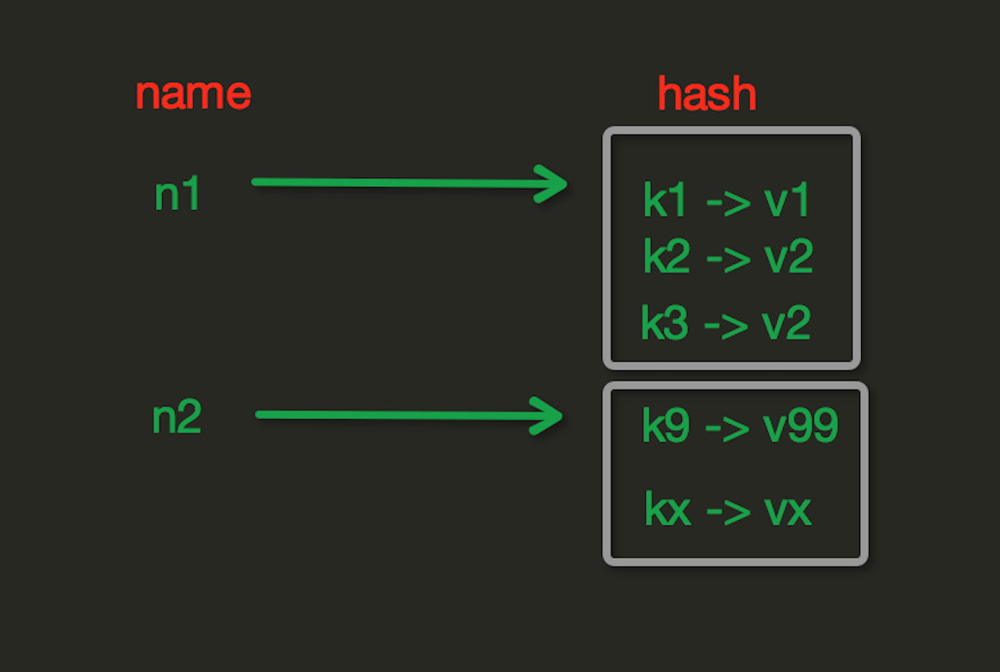

# Redis Hash操作]

Redis 數據庫hash數據類型是一個string類型的key和value的映射表，適用於存儲對象。Redis 中每個 hash 可以存儲 232 - 1 鍵值對（40多億）。 hash表現形式上有些像pyhton中的dict,可以存儲一組關聯性較強的數據 ， redis中Hash在內存中的存儲格式如下圖：




```python
# 連接redis
 
import redis
 
host = '172.16.200.49'
port = 6379
 
pool = redis.ConnectionPool(host=host, port=port)
 
r = redis.Redis(connection_pool=pool)
```

**hset(name, key, value)**

```python
# name對應的hash中設置一個鍵值對（不存在，則創建；否則，修改）
  
# 參數：
    # name，redis的name
    # key，name對應的hash中的key
    # value，name對應的hash中的value
  
# 註：
    # hsetnx(name, key, value),當name對應的hash中不存在當前key時則創建（相當於添加）
 
 
r.hset('p_info', 'name', 'bigberg')
r.hset('p_info', 'age', '22')
r.hset('p_info', 'gender', 'M')
 
# 設置了姓名、年齡和性別
```

**hmset(name, mapping)**

```python
# 在name對應的hash中批量設置鍵值對
  
# 參數：
    # name，redis的name
    # mapping，字典，如：{'k1':'v1', 'k2': 'v2'}
  
# 如：
    # r.hmset('xx', {'k1':'v1', 'k2': 'v2'})
 
 
r.hmset('info_2', {'name': 'Jerry', 'species': 'mouse'})
```

**hget(name, key)**

```python
# 在name對應的hash中獲取根據key獲取value
 
# 獲取的bytes 類型
print(r.hget('p_info', 'name').decode())
 
# 輸出
bigberg
```

**hmget(name, key, \*args)**

```python
# 在name對應的hash中獲取多個key的值
  
# 參數：
    # name，reids對應的name
    # keys，要獲取key集合，如：['k1', 'k2', 'k3']
    # *args，要獲取的key，如：k1,k2,k3
  
# 如：
print(r.hmget('p_info', ['name', 'age', 'gender']))
```

**hgetall(name)**

```python
獲取name對應hash的所有鍵值
 
print(r.hgetall('p_info'))
 
#輸出是一個字典
 
{b'name': b'bigberg', b'gender': b'M', b'age': b'22'}
```

**hlen(name)**

```python
# 獲取name對應的hash中鍵值對的個數
 
print(r.hlen('p_info'))
 
#輸出
3
```

**hkeys(name)**

```python
# 獲取name對應的hash中所有的key的值
 
print(r.hkeys('p_info'))
 
#輸出
[b'name', b'age', b'gender']
```

**hvals(name)**

```python
# 獲取name對應的hash中所有的value的值
 
print(r.hvals('p_info'))
 
#輸出
 [b'bigberg', b'22', b'M']
```

**hexists(name, key)**

```python
# 檢查name對應的hash是否存在當前傳入的key
 
print(r.hexists('p_info', 'name'))
print(r.hexists('p_info', 'job'))
 
#輸出
True
False
```

**hdel(name,\*keys)**

```python
# 將name對應的hash中指定key的鍵值對刪除
 
r.hdel('p_info', 'gender')
print(r.hgetall('p_info'))
 
# 刪除了性別
#輸出
{b'name': b'bigberg', b'age': b'22'
```

**hincrby(name, key, amount=1)**

```python
# 自增name對應的hash中的指定key的值，不存在則創建key=amount
# 參數：
    # name，redis中的name
    # key， hash對應的key
    # amount，自增數（整數）
 
r.hincrby('p_info', 'age', 1)
print(r.hget('p_info', 'age'))
 
#輸出，年齡增加1
b'23'
```

**hincrbyfloat(name, key, amount=1.0)**

```python
# 自增name對應的hash中的指定key的值，不存在則創建key=amount
  
# 參數：
    # name，redis中的name
    # key， hash對應的key
    # amount，自增數（浮點數）
  
# 自增name對應的hash中的指定key的值，不存在則創建key=amount
```

**hscan(name, cursor=0, match=None, count=None)**

```python
# 增量式迭代獲取，對於數據大的數據非常有用，hscan可以實現分片的獲取數據，並非一次性將數據全部獲取完，從而放置內存被撐爆
  
# 參數：
    # name，redis的name
    # cursor，遊標（基於遊標分批取獲取數據）
    # match，匹配指定key，默認None 表示所有的key
    # count，每次分片最少獲取個數，默認None表示採用Redis的默認分片個數
 
 
print(r.hscan('p_info', cursor=0))
print(r.hscan('p_info', cursor=0, match='n*'))
 
#輸出
 
(0, {b'age': b'23', b'address': b'hz', b'name': b'bigberg'})
(0, {b'name': b'bigberg'})
```

**hscan_iter(name, match=None, count=None)**

```python
# 利用yield封裝hscan創建生成器，實現分批去redis中獲取數據
   
# 參數：
    # match，匹配指定key，默認None 表示所有的key
    # count，每次分片最少獲取個數，默認None表示採用Redis的默認分片個數
   
# 如：
    # for item in r.hscan_iter('xx'):
    #     print(item)
```


