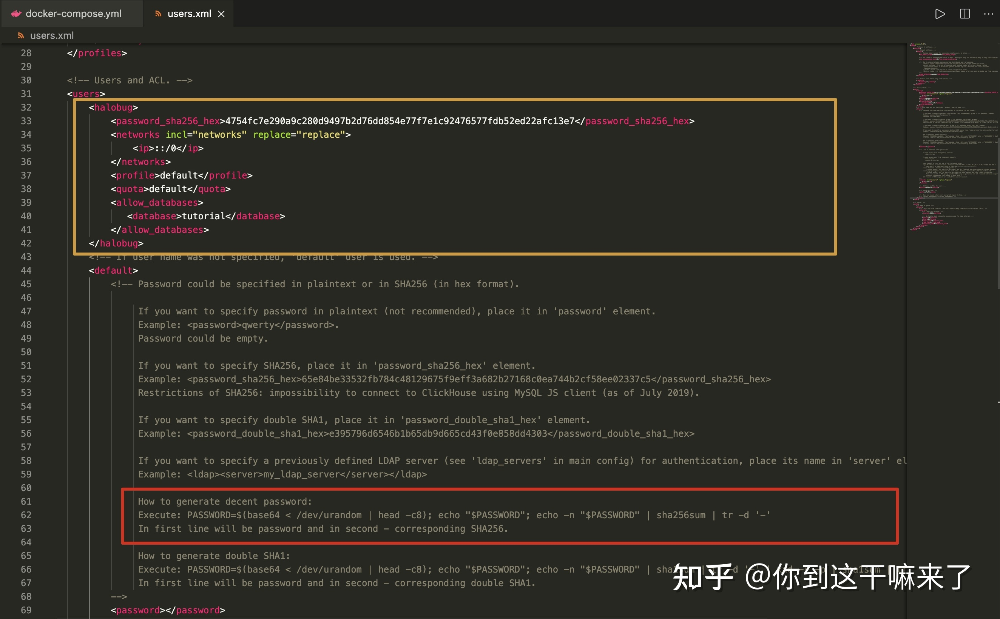
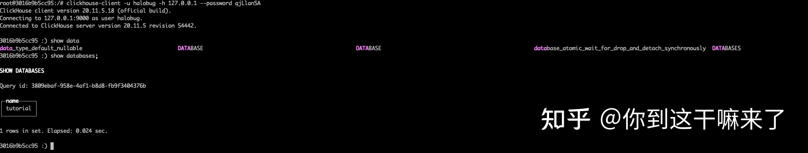
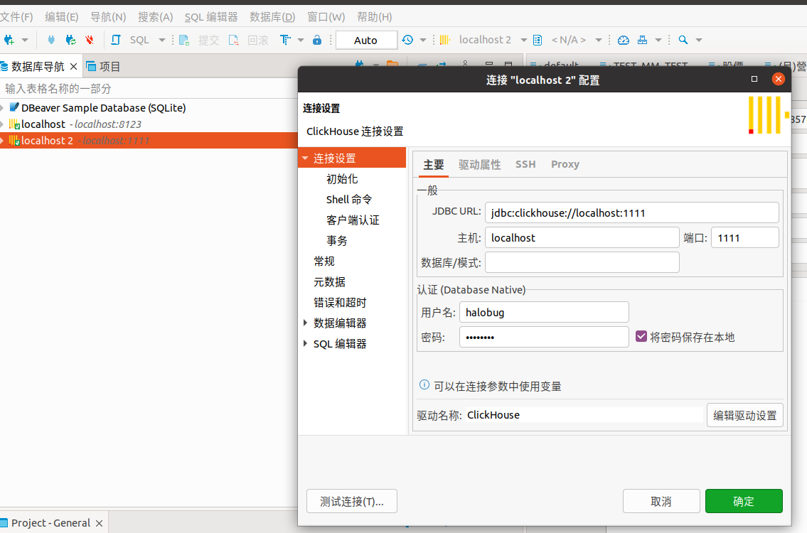

# ClickHouse 簡單部署&使用測試

出處:https://zhuanlan.zhihu.com/p/383817560

### 介紹

ClickHouse 是一個真正的列式資料庫管理系統（DBMS)。在 ClickHouse 中，資料始終是按列儲存的，包括向量（向量或列塊）執行的過程。只要有可能，操作都是基於向量進行分派的，而不是單個的值，這被稱為«向量化查詢執行»，它有利於降低實際的資料處理開銷。

這個想法並不新鮮，其可以追溯到 APL 程式語言及其後代：A +、J、K 和 Q。向量程式設計被大量用於科學資料處理中。即使在關係型資料庫中，這個想法也不是什麼新的東西：比如，向量程式設計也被大量用於 Vectorwise 系統中。

通常有兩種不同的加速查詢處理的方法：向量化查詢執行和執行階段程式碼生成。在後者中，動態地為每一類查詢生成程式碼，消除了間接分派和動態分派。這兩種方法中，並沒有哪一種嚴格地比另一種好。執行階段程式碼生成可以更好地將多個操作融合在一起，從而充分利用 CPU 執行單元和流水線。向量化查詢執行不是特別實用，因為它涉及必須寫到快取並讀回的臨時向量。如果 L2 快取容納不下臨時資料，那麼這將成為一個問題。但向量化查詢執行更容易利用 CPU 的 SIMD 功能。朋友寫的一篇研究論文表明，將兩種方法結合起來是更好的選擇。ClickHouse 使用了向量化查詢執行，同時初步提供了有限的執行階段動態程式碼生成。

[瞭解更多詳情...](https://link.zhihu.com/?target=https%3A//clickhouse.tech/docs/zh/development/architecture/)

## 1.部署 Clickhouse 服務

建立clickhouse 工作目錄

### 1.1, pull 鏡像

```text
按照官方推薦的鏡像拉取

docker pull yandex/clickhouse-server
```

### 1.2，docker-compose 啟動鏡像

```yaml
version: "3"

services:
  clickhouse-server:
    image: yandex/clickhouse-server:latest
    container_name: clickhouse-server
    hostname: clickhouse-server
    networks:
      - my-network
    ports:
      - 1111:8123
    restart: always


  python-client:
    image: python:3.11
    container_name: python-client
    hostname: python-client
    command: sh -c 'apt-get update && apt-get install -y vim iputils-ping net-tools && pip install lxml loguru line-notify clickhouse_driver rel numpy pandahouse websocket-client && tail -f /dev/null'
    networks:
      - my-network
    restart: always
    volumes:
      - ./python-client:/app

networks:
  my-network:
    driver: bridge
```

查看運行狀態

http://127.0.0.1:1111/  會出現OK字樣代表成功


思考：如何修改clickhouse默認組態？資料如何持久化？如何查看日誌？

### 1.3 更改默認組態，資料持久化，查看日誌

進入容器查看組態

```sh
docker exec -it clickhouse-server /bin/bash
```

clickhouse 默認組態路徑是: /etc/clickhouse-server/

退出容器，複製組態檔案當前工作目錄

```sh
docker cp 容器名:/etc/clickhouse-server/config.xml .
docker cp 容器名:/etc/clickhouse-server/uses.xml .
```

修改docker-compose 組態檔案

```yaml
volumes: 
  # 默認組態 寫入config.d/users.d 目錄防止更新後檔案丟失
  - ./config.xml:/etc/clickhouse-server/config.d/config.xml:rw
  - ./users.xml:/etc/clickhouse-server/users.xml:rw
  # 運行日誌
  - ./logs:/var/log/clickhouse-server
  # 資料持久
  - ./data:/var/lib/clickhouse:rw
```

修改後的完整組態如下

```sh
docker network ls  // 如果沒 my-network 要create
docker network create my-network
```

```yaml
version: "3"

services:
  clickhouse-server:
    image: yandex/clickhouse-server:latest
    container_name: clickhouse-server
    hostname: clickhouse-server
    networks:
      - my-network
    ports:
      - 1111:8123
      - 8888:9000
    restart: always
    volumes: 
      # 默認組態 寫入config.d/users.d 目錄防止更新後檔案丟失
      - ./config.xml:/etc/clickhouse-server/config.d/config.xml:rw
      - ./users.xml:/etc/clickhouse-server/users.xml:rw
      # 運行日誌
      - ./logs:/var/log/clickhouse-server
      # 資料持久
      - ./data:/var/lib/clickhouse:rw


  python-client:
    image: python:3.11
    container_name: python-client
    hostname: python-client
    command: sh -c 'apt-get update && apt-get install -y vim iputils-ping net-tools && pip install lxml loguru line-notify clickhouse_driver rel numpy pandahouse websocket-client && tail -f /dev/null'
    networks:
      - my-network
    volumes:
      - ./python-client:/app

networks:
  my-network:
    driver: bridge
```

重新啟動服務

```text
docker-compose down && docker-compose up -d
```

啟動後目錄結構

```
├── config.xml
├── data
├── docker-compose-final.yml
├── docker-compose.yml
├── log
├── logs
└── users.xml
```

瀏覽器再次訪問  http://127.0.0.1:1111/  會出現OK字樣代表成功

查看容器日誌

```sh
docker-compose logs -f
```

進入容器查看服務資料庫

```sh
docker exec -it clickhouse-server /bin/bash

root@clickhouse-server:/# clickhouse-client 
ClickHouse client version 22.1.3.7 (official build).
Connecting to localhost:9000 as user default.
Connected to ClickHouse server version 22.1.3 revision 54455.


clickhouse-server :) show databases;

SHOW DATABASES

Query id: aef1df36-bc09-4c33-8821-c669c8a93c2c

┌─name───────────────┐
│ INFORMATION_SCHEMA │
│ default            │
│ information_schema │
│ system             │
└────────────────────┘

4 rows in set. Elapsed: 0.001 sec. 
```

服務運行正常！

### 1.4，建立使用者登錄 （後期使用）

查看users.xml檔案

自訂使用者

```xml
<halobug>
    <password_sha256_hex>4754fc7e290a9c280d9497b2d76dd854e77f7e1c92476577fdb52ed22afc13e7</password_sha256_hex>
    <networks incl="networks" replace="replace">
        <ip>::/0</ip>
    </networks>
    <profile>default</profile>
    <quota>default</quota>
    <allow_databases>
       <database>tutorial</database>
       <database>CRYPTO</database>
    </allow_databases>
</halobug>
```

生成密碼（進入容器運行）

```sh
PASSWORD=$(base64 < /dev/urandom | head -c8); echo "$PASSWORD"; echo -n "$PASSWORD" | sha256sum | tr -d '-'

FcP5O5HY
8aaa72053341d6fa19bdd150c8e1ff328e2d56444df1c977ac22f88710bac5ae 
```

黃色標註為自訂使用者，紅色為生成密碼



驗證使用者密碼，重新啟動服務

```text
# 重啟
docker-compose down && docker-compose up -d
# 進入容器
docker exec -it clickhouse-server /bin/bash
# 驗證使用者名稱密碼
clickhouse-client -u halobug -h 127.0.0.1 --password FcP5O5HY  # FcP5O5HY 是出生成來的


# 建立資料庫 tutorial , tutorial 是 users.xml 建立
CREATE DATABASE tutorial;
CREATE DATABASE CRYPTO;
```

查看驗證結果



成功！到此服務就搭建完成！

## 登入 python-clinet 測試讀寫 clickhost

```sh
docker exec -it python-client /bin/bash

# 測試是否連通
ping clickhouse-server 
```

```python
import clickhouse_driver
import pandas as pd


connection_settings = {
    'host': 'clickhouse-server',
    'port': '9000',
    'user': 'halobug',
    'password': 'FcP5O5HY'
}

client = clickhouse_driver.Client(**connection_settings)

# 建立新資料庫
client.execute('CREATE DATABASE IF NOT EXISTS CRYPTO')

print(client.execute("SHOW DATABASES"))
client.execute('USE CRYPTO')

# 創建一個簡單的表格
df = pd.DataFrame({'name': ['Alice', 'Bob', 'Charlie'], 'age': [25, 30, 35]})
client.execute('CREATE TABLE IF NOT EXISTS test_table (name String, age Int32) ENGINE = Memory')

# 將資料框寫入表格
client.execute('INSERT INTO test_table VALUES', df.to_dict('records'))

# 讀取表格中的資料
result = client.execute('SELECT * FROM test_table')
print(result)
```

```python
from line_notify import LineNotify
from loguru import logger
from clickhouse_driver import Client
from multiprocessing import Process, Queue, Pipe
import signal
import multiprocessing
import rel
import numpy as np
import pandahouse as ph
import pandas as pd
import json
import websocket
import datetime as dt
import os
import sys
import traceback
import time


def monitor(monitor_queue, thread_name, ws_client_p, record_p):
    while True:
        try:
            data = monitor_queue.get(timeout=30)
            logger.info(f"{thread_name}, {os.getpid()}, {data[0]}")
        except Exception as e:
            logger.warning(f"{thread_name} monitor queue is empty, {e}")
            LineNotify("KXwzqEGtIp1JEkS5GjqXqRAT0D4BdQQvCNcqOa7ySfz").send(
                f"{thread_name} monitor queue is empty"
            )
            os.kill(ws_client_p.pid, signal.SIGUSR1)


def getErrMsg(e):
    error_class = e.__class__.__name__  # 取得錯誤類型
    detail = e.args[0]  # 取得詳細內容
    cl, exc, tb = sys.exc_info()  # 取得Call Stack
    lastCallStack = traceback.extract_tb(tb)[-1]  # 取得Call Stack的最後一筆資料
    fileName = lastCallStack[0]  # 取得發生的檔案名稱
    lineNum = lastCallStack[1]  # 取得發生的行號
    funcName = lastCallStack[2]  # 取得發生的函數名稱
    errMsg = 'File "{}", line {}, in {}: [{}] {}'.format(
        fileName, lineNum, funcName, error_class, detail
    )
    return errMsg


logger.add(
    f"{__file__}.log", encoding="utf-8", enqueue=True, retention="10 days",
)


class Watcher:
    def __init__(self):
        self.child = os.fork()
        if self.child == 0:
            return
        else:
            self.watch()

    def watch(self):
        try:
            os.wait()
        except KeyboardInterrupt:
            self.kill()
        sys.exit()

    def kill(self):
        try:
            print("kill")
            os.kill(self.child, signal.SIGKILL)
        except OSError:
            pass


class WebSocketClient(multiprocessing.Process):
    def __init__(
        self, thread_name, ws_url, symbol, params, queue, monitor_queue, line_notify
    ):
        multiprocessing.Process.__init__(self)
        self.__thread_name = thread_name
        self.__ws_url = ws_url
        self.__symbol = symbol
        self.__params = params
        self.__queue = queue
        self.__monitor_queue = monitor_queue
        self.__line_notify = line_notify
        self.__ws = websocket.WebSocketApp(
            self.__ws_url,
            on_open=self.on_open,
            on_message=self.on_message,
            on_close=self.on_close,
            on_error=self.on_error,
            # on_cont_message=self.on_cont_message,
            on_ping=self.on_ping,
            on_pong=self.on_pong,
        )
        self.msg_count = 0
        self.reconnecting_flag = False
        signal.signal(signal.SIGUSR1, self.receive_signal)

    def receive_signal(self, signum, stack):
        logger.warning(
            f"Received:, {signum}, {os.getpid()}, reconnecting_flag:{self.reconnecting_flag}"
        )
        # if not self.reconnecting_flag:
        #    self.reconnecting_flag = True
        #    self.reconnecting()
        # thread = threading.Thread(target=self.reconnecting, args=())
        # thread.start()

    def run(self):
        # self.__ws.run_forever()
        try:
            self.__ws.run_forever(ping_interval=0, dispatcher=rel, reconnect=3)
            rel.signal(2, rel.abort)  # Keyboard Interrupt
            rel.dispatch()
        except Exception as e:
            logger.exception(e)
            # os.kill(os.getpid(), signal.SIGUSR1)
            self.reconnecting()

    def on_open(self, ws):
        logger.info(f"on_pong : {self.reconnecting_flag}")
        self.reconnecting_flag = False
        subscribe_message = {
            "method": "SUBSCRIBE",
            "params": [self.__params],
            "id": 1,
        }
        ws.send(json.dumps(subscribe_message))

    def on_message(self, ws, message):
        if self.__queue.full():
            logger.error("queue is full")
            self.__line_notify.send("queue is full")
        else:
            msg = json.loads(message)
            self.__queue.put(msg)
            self.msg_count = self.msg_count + 1

        if self.msg_count % 20 == 0:
            self.__monitor_queue.put([dt.datetime.now().strftime("%Y-%m-%d %H:%M:%S")])
            logger.info(
                f"{self.__thread_name} msg_count:{self.msg_count} qsize:{self.__queue.qsize()}"
            )
            self.msg_count = 0

        # print(json.dumps(msg, indent=4, ensure_ascii=False))

    def on_close(self, ws, status_code, message):
        logger.warning(f"on_close {status_code} {message}")
        self.__line_notify.send("on_close " + str(message))
        self.reconnecting()

    def on_error(self, ws, error):
        logger.error(str(error))
        self.__line_notify.send("on_error " + str(error))
        # self.reconnecting()

    def on_cont_message(self, ws, message, flag):
        logger.warning(f"on_cont_message: {message} {flag}")

    def on_ping(self, ws, message):
        logger.info(f"{self.__thread_name} on_ping")
        ws.send(message, websocket.ABNF.OPCODE_PONG)

    def on_pong(self, ws, message):
        logger.info(f"{self.__thread_name} on_pong")
        ws.send(message, websocket.ABNF.OPCODE_PONG)

    def reconnecting(self):
        logger.info(f"{self.__thread_name} {os.uname()[1]} reconnecting")
        # self.__ws.close()
        # thread = threading.Thread(target=self.__ws.close, args=())
        # thread.start()
        # thread.join()

        # self.__ws.my_close()
        # rel.abort()
        # logger.info(f"{self.__thread_name} websocket closed")

        rel.abort()
        self.__ws.run_forever(ping_interval=0, dispatcher=rel, reconnect=3)
        rel.signal(2, rel.abort)
        rel.dispatch()


class Record(multiprocessing.Process):
    def __init__(self, thread_name, ws_client_p, queue, line_notify):
        multiprocessing.Process.__init__(self)
        self.__thread_name = thread_name
        self.__ws_client_p = ws_client_p
        self.__queue = queue
        self.__line_notify = line_notify
        self.__data = []

    def clear_data(self):
        self.__data.clear()

    def create_db_table(self, df, str_database, str_table):
        dtypes_dict = dict(df.dtypes)
        ch_type_convert_dict = {
            np.dtype("datetime64[ns]"): "Datetime64",
            np.dtype("int64"): "Int64",
            np.dtype("float64"): "Float64",
            np.dtype("object"): "String",
            np.dtype("bool"): "Bool",
        }
        create_table_cmd_str = ""
        for x in dtypes_dict:
            type_str = ch_type_convert_dict.get(dtypes_dict[x], None)
            if type_str is None:
                print(f"Undefined type {dtypes_dict[x]}")
            create_table_cmd_str = (
                create_table_cmd_str + f"`{x}` {type_str} DEFAULT 0, "
            )
        # create_table_cmd_str = f"CREATE TABLE IF NOT EXISTS {str_database}.{str_table} ( {create_table_cmd_str[:-2]}) ENGINE = Log"
        create_table_cmd_str = f"CREATE TABLE IF NOT EXISTS {str_database}.{str_table} ({create_table_cmd_str[:-2]}) ENGINE = MergeTree PARTITION BY year_month_day ORDER BY year_month_day SETTINGS index_granularity = 16384"
        client = Client(host="clickhouse-server", port="9000", user="halobug", password="FcP5O5HY")
        client.execute(f"CREATE DATABASE IF NOT EXISTS {str_database};")
        client.execute(create_table_cmd_str)

    def write_orderbook_to_db(self):
        df = None
        try:
            if "e" in self.__data[0].keys() and self.__data[0]["e"] == "depthUpdate":
                df = pd.DataFrame(self.__data)
                if not df.isnull().values.any():
                    df.rename(
                        columns={"E": "timestamp", "a": "asks", "b": "bids"},
                        inplace=True,
                    )
                    df["date"] = [
                        dt.datetime.fromtimestamp(x / 1000.0) for x in df["timestamp"]
                    ]
                    df["year_month_day"] = [
                        dt.datetime.fromtimestamp(x / 1000.0).strftime("%Y-%m-%d")
                        for x in df["timestamp"]
                    ]
                    df.rename(columns={"s": "pair"}, inplace=True)
                    # 僅保留需要的列
                    df = df[["pair", "asks", "bids", "date", "year_month_day"]]

                    db_name = "CRYPTO"
                    table_name = "BinanceOrderbookPartition_simplifiedFields"
                    connection_info = dict(
                        database=db_name,
                        host="http://clickhouse-server:8123/",
                        user="halobug",
                        password="FcP5O5HY",
                    )

                    self.create_db_table(df, db_name, table_name)
                    ph.to_clickhouse(
                        df,
                        table_name,
                        index=False,
                        chunksize=100000,
                        connection=connection_info,
                    )
                print(df)

            if (
                "event" in self.__data[0].keys()
                and self.__data[0]["event"] == "ORDER_BOOK"
            ):
                df = pd.DataFrame(self.__data)
                if not df.isnull().values.any():
                    df["date"] = [
                        dt.datetime.fromtimestamp(x / 1000.0).strftime(
                            "%Y-%m-%d %H:%M:%S.%f"
                        )
                        for x in df["timestamp"]
                    ]
                    df["year_month_day"] = [
                        dt.datetime.fromtimestamp(x / 1000.0).strftime("%Y-%m-%d")
                        for x in df["timestamp"]
                    ]

                    df = df[["pair", "asks", "bids", "date", "year_month_day"]]
                    db_name = "CRYPTO"
                    table_name = "BitoProOrderbookPartition_simplifiedFields"
                    connection_info = dict(
                        database=db_name,
                        host="http://clickhouse-server:8123/",
                        user="halobug",
                        password="FcP5O5HY",
                    )

                    self.create_db_table(df, db_name, table_name)
                    ph.to_clickhouse(
                        df,
                        table_name,
                        index=False,
                        chunksize=100000,
                        connection=connection_info,
                    )
                print(df)
            self.__data.clear()
        except Exception as e:
            logger.error(df)
            self.__data.clear()
            self.__line_notify.send(getErrMsg(e))
            logger.exception(e)
            os.kill(self.__ws_client_p.pid, signal.SIGUSR1)

    def run(self):
        while True:
            try:
                msg = self.__queue.get(block=True)
                self.__data.append(msg)
                if len(self.__data) > 100:
                    self.write_orderbook_to_db()
            except Exception as e:
                self.__line_notify.send(getErrMsg(e))
                logger.exception(e)


class Manager(multiprocessing.Process):
    def __init__(self, thread_name, ws_url, symbol, params, queue, line_token):
        # threading.Thread.__init__(self)
        multiprocessing.Process.__init__(self)
        self.__thread_name = thread_name
        self.__ws_url = ws_url
        self.__symbol = symbol
        self.__params = params
        self.__queue = queue
        self.__line_notify = LineNotify(line_token)

    def run(self):
        self.__line_notify.send(f"thread_name:{self.__thread_name}")
        monitor_queue = Queue(100)
        ws_client_p = WebSocketClient(
            thread_name=self.__thread_name,
            ws_url=self.__ws_url,
            symbol=self.__symbol,
            params=self.__params,
            queue=self.__queue,
            monitor_queue=monitor_queue,
            line_notify=self.__line_notify,
        )
        record_p = Record(
            thread_name=self.__thread_name,
            ws_client_p=ws_client_p,
            queue=self.__queue,
            line_notify=self.__line_notify,
        )
        tasks = [
            ws_client_p,
            record_p,
        ]
        for t in tasks:
            t.start()

        monitor_task = Process(
            target=monitor,
            args=(monitor_queue, self.__thread_name, ws_client_p, record_p),
        )
        monitor_task.start()

        for task in tasks:
            task.join()


if __name__ == "__main__":
    Watcher()
    bitopro_orderbook_queue = Queue(1000)
    binance_orderbook_queue = Queue(1000)
    tasks = [
        Manager(
            thread_name="BitoPro Thread",
            ws_url="wss://stream.bitopro.com:9443/ws/v1/pub/order-books/BTC_USDT:20",
            symbol="",
            params="",
            queue=bitopro_orderbook_queue,
            line_token="KXwzqEGtIp1JEkS5GjqXqRAT0D4BdQQvCNcqOa7ySfz",
        ),
        Manager(
            thread_name="Binance Thread",
            ws_url="wss://stream.binance.com:9443/ws",
            symbol="",
            params="btcusdt@depth@100ms",
            queue=binance_orderbook_queue,
            line_token="KXwzqEGtIp1JEkS5GjqXqRAT0D4BdQQvCNcqOa7ySfz",
        ),
    ]
    for t in tasks:
        t.start()

    for task in tasks:
        task.join()

```


## dbeaver 登入 docker clickhouse

```sh
port 1111
halobug
FcP5O5HY
```



