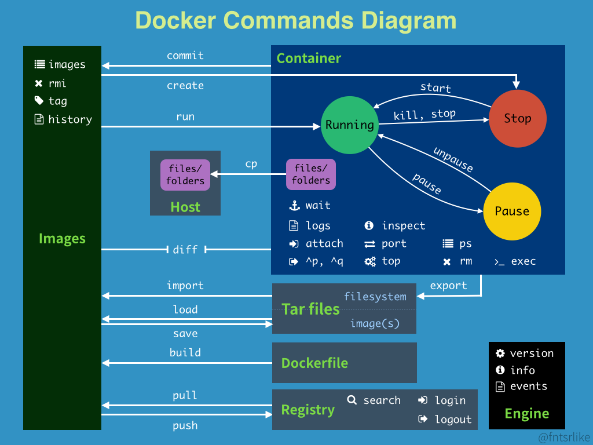
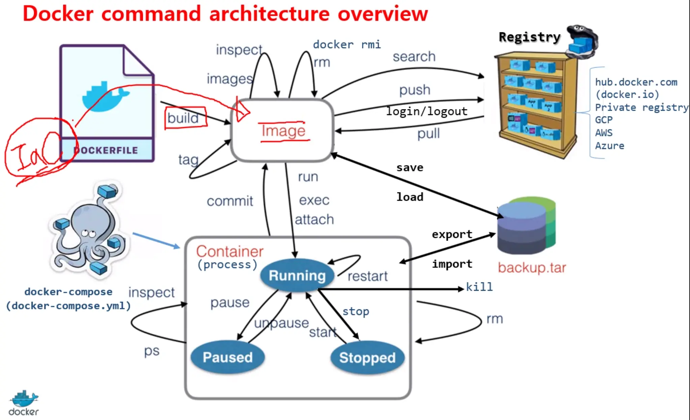

## Docker 常用的指令






## image

如果要搜索 image 可以上 dockerhub 找(裡面都有可以直接抓下來的指令)

```
docker pull image_name
# 從 Dockerhub 拉回 image
docker images
docker image ls
# 列出本地 image
docker rmi (image_name or image_id)
#移除 image
```

## Container

```
# 查看本地 container
# -a：顯示所有執行中的 container。
docker ps (-a)
docker container ls (-a)
# 執行 container
docker start (container_id or container_name)
# 離開 container
exit  (退出並停止容器)
# 停止 container
docker stop (container_id or container_name)
# 移除 container
docker rm (container_id or container_name)
```

## volume

將本機的某個位置掛載至 Container 的某個位置。

```
# 列出本地 volume
docker volume ls
# 移除 volume
docker volume rm volume_name

# 移除所有未使用的 volume
docker volume prune
```

---


## 清理Docker的container，image與volume

出處: https://note.qidong.name/2017/06/26/docker-clean/

Docker的鏡像（image）、容器（container）、資料卷（volume）， 都是由daemon託管的。 因此，在需要清理時，也需要使用其自帶的手段。

## 清理技巧 [¶](https://note.qidong.name/2017/06/26/docker-clean/#清理技巧)

清理所有停止運行的容器：

```sh
docker container prune
# or
docker rm $(docker ps -aq)
```

清理所有懸掛（`<none>`）鏡像：

```sh
docker image prune
# or
docker rmi $(docker images -qf "dangling=true")
```

清理所有無用資料卷：

```sh
docker volume prune
```

由於`prune`操作是批次刪除類的危險操作，所以會有一次確認。 如果不想輸入`y<CR>`來確認，可以新增`-f`操作。慎用！

## 清理停止的容器 [¶](https://note.qidong.name/2017/06/26/docker-clean/#清理停止的容器)

```sh
docker rm -lv CONTAINER
```

`-l`是清理link，`v`是清理volume。 這裡的CONTAINER是容器的name或ID，可以是一個或多個。

參數列表：

| Name, shorthand | Default | Description                                             |
| --------------- | ------- | ------------------------------------------------------- |
| –force, -f      | false   | Force the removal of a running container (uses SIGKILL) |
| –link, -l       | false   | Remove the specified link                               |
| –volumes, -v    | false   | Remove the volumes associated with the container        |

### 清理所有停止的容器 [¶](https://note.qidong.name/2017/06/26/docker-clean/#清理所有停止的容器)

通過`docker ps`可以查詢當前運行的容器資訊。 而通過`docker ps -a`，可以查詢所有的容器資訊，包括已停止的。

在需要清理所有已停止的容器時，通常利用shell的特性，組合一下就好。

```sh
docker rm $(docker ps -aq)
```

其中，`ps`的`-q`，是隻輸出容器ID，方便作為參數讓`rm`使用。 假如給`rm`指定`-f`，則可以清理所有容器，包括正在運行的。

這條組合命令，等價於另一條命令：

```sh
docker container prune
```

`container`子命令，下面包含了所有和容器相關的子命令。 包括`docker ps`，等價於`docker container ps`或`docker container ls`。 其餘還有`start`、`stop`、`kill`、`cp`等，一級子命令相當於二級子命令在外面的alias。 而`prune`則是特別提供的清理命令，這在其它的管理命令裡還可以看到，比如`image`、`volume`。

### 按需批次清理容器 [¶](https://note.qidong.name/2017/06/26/docker-clean/#按需批量清理容器)

清除所有已停止的容器，是比較常用的清理。 但有時會需要做一些特殊過濾。

這時就需要使用`docker ps --filter`。

比如，顯示所有返回值為0，即正常退出的容器：

```sh
docker ps -a --filter 'exited=0'
```

同理，可以得到其它非正常退出的容器。

目前支援的過濾器有：

> - id (container’s id)
> - label (`label=<key>` or `label=<key>=<value>`)
> - name (container’s name)
> - exited (int - the code of exited containers. Only useful with –all)
> - status (`created|restarting|running|removing|paused|exited|dead`)
> - ancestor (`<image-name>[:<tag>]`, `<image id>` or `<image@digest>`) - filters containers that were created from the given image or a descendant.
> - before (container’s id or name) - filters containers created before given id or name
> - since (container’s id or name) - filters containers created since given id or name
> - isolation (`default|process|hyperv`) (Windows daemon only)
> - volume (volume name or mount point) - filters containers that mount volumes.
> - network (network id or name) - filters containers connected to the provided network
> - health (`starting|healthy|unhealthy|none`) - filters containers based on healthcheck status

### 清理失敗 [¶](https://note.qidong.name/2017/06/26/docker-clean/#清理失敗)

如果在清理容器時發生失敗，通過重啟Docker的Daemon，應該都能解決問題。

```sh
# systemd
sudo systemctl restart docker.service

# initd
sudo service docker restart
```

## 清理鏡像 [¶](https://note.qidong.name/2017/06/26/docker-clean/#清理鏡像)

與清理容器的`ps`、`rm`類似，清理鏡像也有`images`、`rmi`兩個子命令。 `images`用來查看，`rmi`用來刪除。

清理鏡像前，應該確保該鏡像的容器，已經被清除。

```sh
docker rmi IMAGE
```

其中，IMAGE可以是name或ID。 如果是name，不加TAG可以刪除所有TAG。

另外，這兩個命令也都屬於alias。 `docker images`等價於`docker image ls`，而`docker rmi`等價於`docker image rm`。

### 按需批次清理鏡像 [¶](https://note.qidong.name/2017/06/26/docker-clean/#按需批量清理鏡像)

與`ps`類似，`images`也支援`--filter`參數。

與清理相關，最常用的，當屬`<none>`了。

```sh
docker images --filter "dangling=true"
```

這條命令，可以列出所有懸掛（dangling）的鏡像，也就是顯示為`<none>`的那些。

```sh
docker rmi $(docker images -qf "dangling=true")
```

這條組合命令，如果不寫入Bash的alias，幾乎無法使用。 不過還有一條等價命令，非常容易使用。

```sh
docker image prune
```

`prune`和`images`類似，也同樣支援`--filter`參數。 其它的filter有：

> - dangling (boolean - true or false)
> - label (`label=<key>` or `label=<key>=<value>`)
> - before (`<image-name>[:<tag>]`, `<image id>` or `<image@digest>`) - filter images created before given id or references
> - since (`<image-name>[:<tag>]`, `<image id>` or `<image@digest>`) - filter images created since given id or references
> - reference (pattern of an image reference) - filter images whose reference matches the specified pattern

### 清理所有無用鏡像 [¶](https://note.qidong.name/2017/06/26/docker-clean/#清理所有無用鏡像)

這招要慎用，否則需要重新下載。

```sh
docker image prune -a
```

## 清理資料卷 [¶](https://note.qidong.name/2017/06/26/docker-clean/#清理數據卷)

資料卷不如容器或鏡像那樣顯眼，但佔的硬碟卻可大可小。

資料卷的相關命令，都在`docker volume`中了。

一般用`docker volume ls`來查看，用`docker volume rm VOLUME`來刪除一個或多個。

不過，絕大多數情況下，不需要執行這兩個命令的組合。 直接執行`docker volume prune`就好，即可刪除所有無用卷。

注意：**這是一個危險操作！甚至可以說，這是本文中最危險的操作！** 一般真正有價值的運行資料，都在資料卷中。 （當然也可能掛載到了容器外的檔案系統裡，那就沒關係。） 如果在關鍵服務停止期間，執行這個操作，很可能會**丟失所有資料**！

## 從檔案系統刪除 [¶](https://note.qidong.name/2017/06/26/docker-clean/#從文件系統刪除)

除組態檔案以為，Docker的內容相關檔案，基本都放在`/var/lib/docker/`目錄下。

該目錄下有下列子目錄，基本可以猜測出用途：

- aufs
- containers
- image
- network
- plugins
- swarm
- tmp
- trust
- volumes

一般不推薦直接操作這些目錄，除非一些極特殊情況。 操作不當，後果難料，需要慎重。


##  這兩個 Docker 命令的差異在於它們的目的和執行方式。

```sh
docker run -it --rm redis bash 
docker exec -it redis sh
```

- `docker run -it --rm redis bash` 命令的目的是啟動一個 Redis 容器，然後在容器中執行一個交互式 Bash shell。這個命令會建立一個新的容器，並且在容器內啟動一個新的 Bash shell。在這個 shell 中，您可以在容器內進行任何操作，就像在一個本地的 Bash shell 中一樣。這個容器會在退出 shell 後立即被刪除，因為我們使用了 `--rm` 選項。
- `docker exec -it redis sh` 命令的目的是在一個已經運行的 Redis 容器中執行一個新的交互式 shell。這個命令不會創建新的容器，而是在現有的 Redis 容器內運行一個新的 shell。因此，使用這個命令，您必須先啟動一個 Redis 容器。在 shell 中，您可以在容器內進行任何操作，並且這些操作將會對容器內的系統環境進行更改。該容器不會被刪除，因為我們沒有使用 `--rm` 選項。

簡而言之，`docker run` 命令用於啟動新容器，而 `docker exec` 命令則用於在現有容器中運行命令。