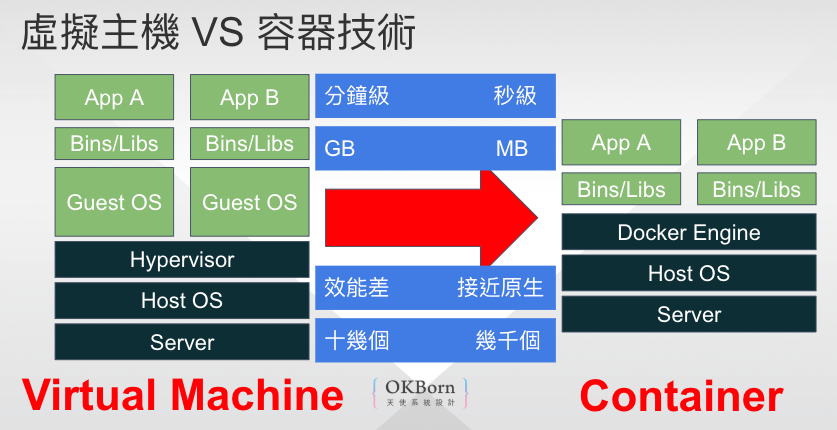
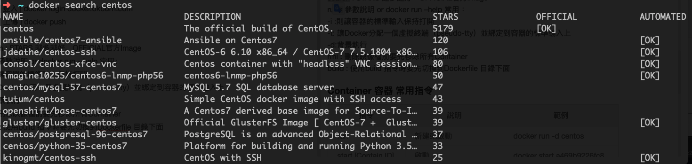
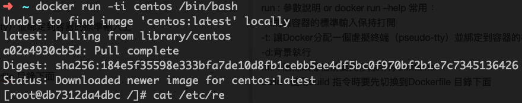
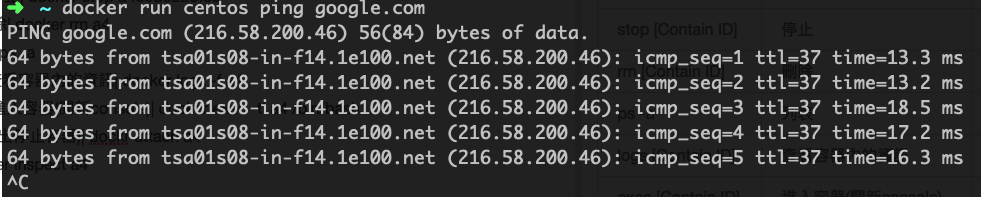
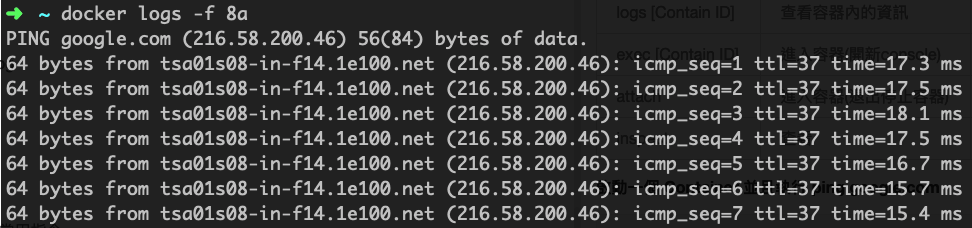
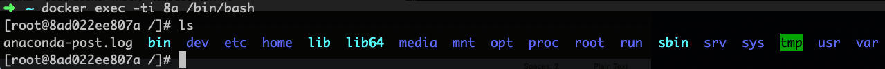
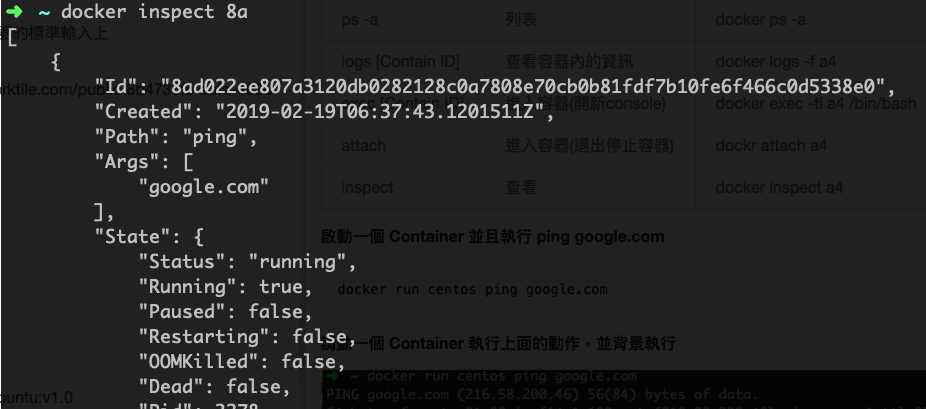
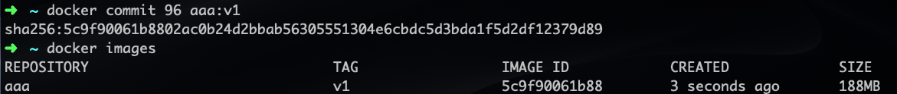

# Docker & Docker Compose 安裝與配置

## Docker 安裝

### Ubuntu/Debian 系統安裝 Docker

```bash
# 更新系統套件
sudo apt update

# 安裝 Docker
sudo apt install docker.io

# 創建 docker 用戶組（如果不存在）
sudo groupadd docker

# 將當前用戶加入 docker 組
sudo usermod -aG docker ${USER}

# 設置 Docker socket 權限
sudo chmod 666 /var/run/docker.sock

# 重啟 Docker 服務
sudo systemctl enable docker
sudo systemctl start docker

# 需要退出重新登錄後才會生效
```

### 驗證 Docker 安裝

```bash
docker --version
docker run hello-world
```

## Docker Compose 安裝

### 方法 1: 使用 apt 安裝（推薦）

```bash
# Ubuntu 20.04+ 可直接使用 apt 安裝最新版本
sudo apt update
sudo apt install docker-compose-plugin

# 驗證安裝
docker compose version
```

### 方法 2: 手動安裝最新版本

```bash
# 下載最新版本的 Docker Compose
# 請先檢查最新版本：https://github.com/docker/compose/releases/
COMPOSE_VERSION="v2.24.0"
sudo curl -L "https://github.com/docker/compose/releases/download/${COMPOSE_VERSION}/docker-compose-$(uname -s)-$(uname -m)" -o /usr/local/bin/docker-compose

# 設置可執行權限
sudo chmod +x /usr/local/bin/docker-compose

# 創建符號連結（可選）
sudo ln -s /usr/local/bin/docker-compose /usr/bin/docker-compose

# 驗證安裝
docker-compose --version
```

### 方法 3: 使用 pip 安裝

```bash
# 使用 Python pip 安裝
pip3 install docker-compose

# 或者使用虛擬環境安裝
python3 -m venv docker-env
source docker-env/bin/activate
pip install docker-compose
```


---

# Docker Compose 基本使用

## Docker Compose 簡介

Docker Compose 是用於定義和執行多容器 Docker 應用程式的工具。使用 YAML 檔案來配置應用程式的服務，然後使用一個命令就可以創建並啟動所有服務。

## Docker Compose 基本命令

| 命令 | 說明 | 範例 |
|------|------|------|
| `docker compose up` | 啟動所有服務 | `docker compose up -d` |
| `docker compose down` | 停止並移除所有服務 | `docker compose down` |
| `docker compose ps` | 查看服務狀態 | `docker compose ps` |
| `docker compose logs` | 查看服務日誌 | `docker compose logs -f` |
| `docker compose build` | 建置服務 | `docker compose build` |
| `docker compose restart` | 重啟服務 | `docker compose restart web` |

## docker-compose.yml 範例

### 基本的 Web 應用程式 + 資料庫

```yaml
version: '3.8'

services:
  web:
    build: .
    ports:
      - "5000:5000"
    depends_on:
      - db
    environment:
      - DATABASE_URL=postgresql://user:pass@db:5432/mydb
    volumes:
      - .:/app
    
  db:
    image: postgres:15
    environment:
      POSTGRES_DB: mydb
      POSTGRES_USER: user
      POSTGRES_PASSWORD: pass
    volumes:
      - postgres_data:/var/lib/postgresql/data
    ports:
      - "5432:5432"

volumes:
  postgres_data:
```

### WordPress + MySQL 範例

```yaml
version: '3.8'

services:
  wordpress:
    image: wordpress:latest
    ports:
      - "8080:80"
    environment:
      WORDPRESS_DB_HOST: mysql:3306
      WORDPRESS_DB_USER: wordpress
      WORDPRESS_DB_PASSWORD: password
      WORDPRESS_DB_NAME: wordpress
    volumes:
      - wordpress_data:/var/www/html
    depends_on:
      - mysql

  mysql:
    image: mysql:8.0
    environment:
      MYSQL_DATABASE: wordpress
      MYSQL_USER: wordpress
      MYSQL_PASSWORD: password
      MYSQL_ROOT_PASSWORD: rootpassword
    volumes:
      - mysql_data:/var/lib/mysql

volumes:
  wordpress_data:
  mysql_data:
```

## Docker Compose 常用選項

### 服務配置選項

- `build`: 建置 Docker 映像檔的路徑或配置
- `image`: 使用的 Docker 映像檔
- `ports`: 連接埠映射
- `volumes`: 資料卷掛載
- `environment`: 環境變數
- `depends_on`: 服務依賴關係
- `networks`: 網路配置
- `restart`: 重啟策略

### 執行選項

```bash
# 背景執行
docker compose up -d

# 重新建置並啟動
docker compose up --build

# 指定檔案
docker compose -f docker-compose.prod.yml up

# 擴展服務實例
docker compose up --scale web=3

# 停止並移除所有容器、網路
docker compose down

# 停止並移除所有容器、網路、映像檔、卷
docker compose down --rmi all --volumes
```

---

# Docker 教學

***docker*實際上,就是一個系統聯合幾個元件一直在欺騙一個處理程序,主要依靠了三個幫凶namespace,*chroot,cgroup*** 

Containers as a Service ( CaaS ) - 容器如同服務
Docker 是一個開源專案，出現於 2013 年初，最初是 Dotcloud 公司內部的 Side-Project。
它基於 Google 公司推出的 Go 語言實作。（ Dotcloud 公司後來改名為 Docker ）

## Agenda

- 基本介紹 - 映像檔、容器、倉庫
- 指令說明 - 安裝、指令
- Dockerfile 說明
- 進階應用 - docker compose
- 進階應用 - docker machine
- 實際案例

### 基本介紹

#### 什麼是容器技術Container： **應用程式為中心的虛擬化**

#### Docker 歷史

1982年Unix系統內建的chroot機制
LXC 利用controler groups 與namespaces的功能， 提供應用軟體一個獨立的作業系統環境
2013 Linux之父Linus Torvalds 發布Linux核心3.8版 支援Container技術
2013 dotCloud公司將內部專案Docker開源釋出程式碼

#### Containers(容器) vs Virtual Machines(虛擬主機)



#### Docker 三個基本概念

##### 映像檔（Image）

- Docker 映像檔就是一個唯讀的模板。
- 映像檔可以用來建立 Docker 容器。

##### 容器（Container）

- 容器是從映像檔建立的執行實例。
- Docker 利用容器來執行應用。
- 可以被啟動、開始、停止、刪除。
- 每個容器都是相互隔離的、保證安全的平臺。

##### 倉庫（Repository）

- 倉庫是集中存放映像檔檔案的場所。
- 每個倉庫中又包含了多個映像檔。
- 每個映像檔有不同的標籤（tag）。
- 倉庫分為公開倉庫（Public）和私有倉庫（Private）兩種形式。


### 指令說明 - 安裝、指令

```
docker --help
```


#### 安裝Docker

[官方文件 Get started with Docker for Mac](https://docs.docker.com/docker-for-mac/)
[官方官方 Get started with Docker for Windows](https://docs.docker.com/docker-for-windows/)
[Docker Toolbox overview](https://docs.docker.com/toolbox/overview/)

#### Image 映像檔 常用指令

|      指令      | 說明 |              範例               |
| :------------: | :--: | :-----------------------------: |
|     search     | 搜尋 |      docker search centos       |
|      pull      | 下載 |       docker pull centos        |
|     images     | 列表 |          docker images          |
|      run       | 執行 | docker run -ti centos /bin/bash |
| rmi [Image ID] | 刪除 |     docker rmi 615cb40d5d19     |
|     build      | 建立 |   docker build -t member:1 .    |
|     login      | 登入 | docker login docker.okborn.com  |
|      push      | 上傳 |           docker push           |

##### Search 搜尋 CentOS 映像檔

```bash
docker search centos
```



NAME：映像檔名稱
DESCRIPTION：映像檔描述
STARS：越多代表越多人使用
OFFICIAL：官方Image
AUTOMATED：自動化

##### 顯示目前本機的 Images 列表

```bash
docker images
```

REPOSITORY：倉庫位置和映像檔名稱
TAG：映像檔標籤(通常是定義版本號)
IMAGE ID：映像檔ID(唯一碼)
CREATED：創建日期
SIZE：映像檔大小

##### 啟動容器

```
docker run -ti centos /bin/bash
```

run : 參數說明 or docker run --help 常用：
-i ：則讓容器的標準輸入保持打開
-t：讓Docker分配一個虛擬終端（pseudo-tty）並綁定到容器的標準輸入上
-d：背景執行
-e：設定環境變數(AAA=BBB)
-p：Port 對應(host port:container port)
-v：資料對應(host folder:container folder)
--name：設定容器名稱

** 在執行RUN 映像檔時，如果沒有下載會先下載在執行 **


rmi : 刪除映像檔前要先移除所有Container
build : 使用build 指令時要先切換到Dockerfile 目錄下面

#### Container 容器 常用指令

|        指令        |          說明          |             範例             |
| :----------------: | :--------------------: | :--------------------------: |
|        run         |       新建或啟動       |     docker run -d centos     |
| start [Contain ID] |          啟動          |  docker start a469b9226fc8   |
| stop [Contain ID]  |          停止          |   docker stop a469b9226fc8   |
|  rm [Contain ID]   |          刪除          |         docker rm a4         |
|       ps -a        |          列表          |         docker ps -a         |
| logs [Contain ID]  |    查看容器內的資訊    |      docker logs -f a4       |
| exec [Contain ID]  | 進入容器(開新console)  | docker exec -ti a4 /bin/bash |
|       attach       | 進入容器(退出停止容器) |       dockr attach a4        |
|      inspect       |          查看          |      docker inspect a4       |

##### 啟動一個 Container 並且執行 ping google.com

```
docker run centos ping google.com
```

##### 請動一個 Container 執行上面的動作，並背景執行



##### 使用 查看 Container 指令

```
docker ps 
docker ps -a
```

ps : 參數說明 or docker ps --help 常用：
-a：顯示全部的容器

CONTAINER ID：容器ID
IMAGE：映像檔名稱
COMMAND：執行指令
CREATED：創建時間
STATUS：容器狀態
POSTS：開啟的Port號
NAMES：容器名稱

##### 顯示容器的 log

```
docker logs -f 8a
```

logs : 參數說明 or docker logs --help 常用：
-f：不會跳出，會一直列印最新的log資訊


##### 進入容器

```
docker exec -ti 8a /bin/bash
```

exec : 參數說明 or docker exec --help 常用：
-i ：則讓容器的標準輸入保持打開
-t：讓Docker分配一個虛擬終端（pseudo-tty）並綁定到容器的標準輸入上
-e：設定環境變數(AAA=BBB)


##### 查看容器資訊

```
docker inspect 8a
```



##### 開啟容器到關閉容器

```
docker run -d ubuntu:14.04 /bin/sh -c "while true; do echo hello world; sleep 1; done"
db0e9dbb150596a3a89db056d0ecb765c54c3c2fb5d428e3b35fc20b55813862
docker logs -f db
docker ps -a
docker stop db
docker ps -a
```

#### Registry 倉庫 常用指令

|  指令  |   說明   |                         範例                         |
| :----: | :------: | :--------------------------------------------------: |
| commit | 容器存檔 |               docker commit db aaa:v1                |
|  pull  |   下載   |      docker pull docker.okborn.com/okborn:base       |
|  tag   |   標籤   |         docker tag aaa docker.okborn.com/aaa         |
|  push  |   上傳   |        docker push docker.okborn.com/member:1        |
| login  |   登入   |            docker login docker.okborn.com            |
| export |   匯出   |       docker export 7691a814370e > ubuntu.tar        |
| import |   匯入   | cat ubuntu.tar sudo docker import - test/ubuntu:v1.0 |

##### 對容器存檔

```
docker run -d ubuntu:14.04 /bin/sh -c "while true; do echo hello world; sleep 1; done"
96ea2a3f99e92ddd5fa0ec29f21d035703b6512f59c4f54fbaee551ee8fc044a
docker commit 96 aaa:v1
```



##### 對映像檔打標籤

```
docker tag centos aaa asia.gcr.io/joyi-205504/aaa:v1
```

##### 上傳到 GCP Registry

```
gcloud docker -- push  asia.gcr.io/joyi-205504/aaa:v1
```

#### 其他常用指令

刪除

```
docker rmi `docker images|grep sele |awk '{print $3}'`
```

#### Dcoker 資料管理

##### 資料卷（Data volumes）

- 資料卷可以在容器之間共享和重用
- 對資料卷的修改會立馬生效
- 對資料卷的更新，不會影響映像檔
- 卷會一直存在，直到沒有容器使用

##### 範例：建立一個 web 容器，並載入一個資料捲到容器的 /webapp 目錄

```
docker run -d -P --name web -v /webapp training/webapp python app.py
```

##### 範例：本機的 /src/webapp 目錄到容器的 /opt/webapp 目錄

```
docker run -d -P --name web -v /src/webapp:/opt/webapp training/webapp python app.py
```

##### 範例：Docker 掛載資料卷的預設權限是讀寫，使用者也可以透過 :ro 指定為唯讀

```
docker run -d -P --name web -v /src/webapp:/opt/webapp:ro training/webapp python app.py
```

##### 資料卷容器（Data volume containers）

持續更新的資料需要在容器之間共享，最好建立資料卷容器。
一個正常的容器，專門用來提供資料卷供其它容器掛載的。

##### 範例：建立一個命名的資料卷容器 dbdata

```
docker run -d -v /dbdata --name dbdata postgres echo Data-only container for postgres
```

##### 範例：他容器中使用 --volumes-from 來掛載 dbdata 容器中的資料卷

```
docker run -d -P --volumes-from dbdata --name db1 postgres
docker run -d -P --volumes-from dbdata --name db2 postgres
```

##### 範例：也可以從其他已經掛載了容器卷的容器來掛載資料卷。

```
docker run -d --name db3 --volumes-from db1 postgres
```

##### 範例：備份

首先使用 --volumes-from 標記來建立一個載入 dbdata 容器卷的容器，並從本地主機掛載當前到容器的 /backup 目錄。

```
docker run --volumes-from dbdata -v $(pwd):/backup ubuntu tar cvf /backup/backup.tar /dbdata
```

##### 範例：恢復

恢復資料到一個容器，首先建立一個帶有資料卷的容器 dbdata2

```
docker run -v /dbdata --name dbdata2 ubuntu /bin/bash
```

然後建立另一個容器，掛載 dbdata2 的容器，並使用 untar 解壓備份檔案到掛載的容器卷中。

```
docker run --volumes-from dbdata2 -v $(pwd):/backup busybox tar xvf /backup/backup.tar
```

##### Docker 中的網路功能介紹

- 要讓外部也可以存取這些應用
- 可以通過 -P 或 -p 參數來指定連接埠映射。

##### 範例：隨機本機Port

```
docker run -d -P training/webapp python app.py
```

##### 範例：指定本機Port

```
docker run -d -p 5000:5000 training/webapp python app.py
```

##### 範例：綁定 localhost 的任意連接埠到容器的 5000 連接埠，本地主機會自動分配一個連接埠

```
docker run -d -p 127.0.0.1::5000 training/webapp python app.py
```

##### 範例：還可以使用 udp 標記來指定 udp 連接埠

```
docker run -d -p 127.0.0.1:5000:5000/udp training/webapp python app.py
```

##### 範例： -p 標記可以多次使用來綁定多個連接埠

```
docker run -d -p 5000:5000  -p 3000:80 training/webapp python app.py
```

### Dockerfile 說明

- Dockerfile 由一行行命令語句組成，並且支援以 # 開頭的註解行。
- Dockerfile 分為四部分：
  - 基底映像檔資訊
  - 維護者資訊
  - 映像檔操作指令
  - 容器啟動時執行指令。

```shell
# This dockerfile uses the ubuntu image
# VERSION 2 - EDITION 1
# Author: docker_user
# Command format: Instruction [arguments / command] ..

# 基本映像檔，必須是第一個指令
FROM ubuntu

# 維護者： docker_user <docker_user at email.com> (@docker_user)
MAINTAINER docker_user docker_user@email.com

# 更新映像檔的指令
RUN echo "deb http://archive.ubuntu.com/ubuntu/ raring main universe" >> /etc/apt/sources.list
RUN apt-get update && apt-get install -y nginx
RUN echo "\ndaemon off;" >> /etc/nginx/nginx.conf

# 建立新容器時要執行的指令
CMD /usr/sbin/nginx
```


#### Dockerfile 基本語法

|                     指令                      |           說明           |                            範例                             |
| :-------------------------------------------: | :----------------------: | :---------------------------------------------------------: |
|                    FROM :                     |        映像檔來源        |                       FROM python:3.5                       |
|                  MAINTAINER                   |        維護者訊息        |        MAINTAINER docker_user docker_user@email.com         |
|                      RUN                      |   創建映像檔時執行動作   |   RUN apt-get -y update && apt-get install -y supervisor    |
|    RUN ["executable", "param1", "param2"]     |   創建映像檔時執行動作   |            RUN ["/bin/bash", "-c", "echo hello"]            |
|           CMD command param1 param2           |   啟動容器時執行的命令   |                 CMD pserve development.ini                  |
|     CMD ["executable","param1","param2"]      |   啟動容器時執行的命令   |                                                             |
|            CMD ["param1","param2"]            |   啟動容器時執行的命令   |                                                             |
|                    EXPOSE                     |      容器對外的埠號      |                         EXPOSE 8082                         |
|                      ADD                      |      複製檔案(單檔)      |             ADD requirements.txt /usr/src/app/              |
|                     COPY                      |     複製檔案(資料夾)     |                     COPY . /usr/src/app                     |
|                      ENV                      |         環境變數         |                    ENV PG_VERSION 9.3.4                     |
|       ENTRYPOINT command param1 param2        | 指定容器啟動後執行的命令 |                                                             |
| ENTRYPOINT ["executable", "param1", "param2"] | 指定容器啟動後執行的命令 |            ENTRYPOINT ["/docker-entrypoint.sh"]             |
|               VOLUME ["/data"]                |        掛載資料卷        |               VOLUME /var/lib/postgresql/data               |
|                  USER daemon                  |      指定運行使用者      | RUN groupadd -r postgres && useradd -r -g postgres postgres |
|           WORKDIR /path/to/workdir            |       指定工作目錄       |                    WORKDIR /usr/src/app                     |
|             ONBUILD [INSTRUCTION]             |   基底映像檔建立時執行   |                 ONBUILD COPY . /usr/src/app                 |

RUN 當命令較長時可以使用 \ 來換行。
RUN : 在 shell 終端中運行命令，即 /bin/sh -c；
RUN ["executable", "param1", "param2"] : 使用 exec 執行。

CMD 指定啟動容器時執行的命令， **每個 Dockerfile 只能有一條 CMD 命令** 。
如果指定了多條命令，只有最後一條會被執行。
CMD ["executable","param1","param2"] 使用 exec 執行，推薦使用；
CMD command param1 param2 在 /bin/sh 中執行，使用在給需要互動的指令；
CMD ["param1","param2"] 提供給 ENTRYPOINT 的預設參數；

ENTRYPOINT：每個 Dockerfile 中只能有一個 ENTRYPOINT，當指定多個時，只有最後一個會生效。
USER：要臨時取得管理員權限可以使用 gosu，而不推薦 sudo。
WORKDIR：可以使用多個 WORKDIR 指令，後續命令如果參數是相對路徑，則會基於之前命令指定的路徑

#### Docker File Base

```dockerfile
# 映像檔Image
FROM python:3.11
# 維護者（已廢棄，建議使用 LABEL）
# MAINTAINER Pellok "pellok@double-cash.com"
LABEL maintainer="pellok@double-cash.com"
# 更新
RUN apt-get -y update && apt-get install -y supervisor
# 創建專案資料夾
RUN mkdir -p /usr/src/app
# 指定工作目錄在專案資料夾
WORKDIR /usr/src/app
# 預先要安裝的requirements複製到Docker裡面
COPY requirements.txt /usr/src/app/
# 安裝需要用的插件
RUN pip install --upgrade pip setuptools
RUN pip install --no-cache-dir -r requirements.txt
# 下次Build 的時候複製專案目錄到Docker 裡面
ONBUILD COPY . /usr/src/app
```

建置

```
docker build -t sample:base .
```

##### Docker File for Project

```dockerfile
#  挑選Image
FROM sample:base
# 安裝cryptography
RUN pip install cryptography 
# 設定工作目錄
WORKDIR /usr/src/app/
# 執行Python Setup
RUN python setup.py develop
# 開啟Port號
EXPOSE 8082
# 執行專案
CMD pserve development.ini
```

建置

```
docker build -t project:v1 .
```

#### Pyramid 專案 Docker 化

```shell
#創建一個新專案
pcreate -s alchemy pyramid_dockerlize
cd pyramid_dockerlize
# 創建dockerfile
touch Dockerfile
# 編輯 Dockerfile
# 建置映像檔
docker build -t pyramid_dockerlize .
# 執行容器
docker run -d -P pyramid_dockerlize
```

Dockerfile

```dockerfile
# This dockerfile uses the python pyramid
# VERSION 1 - EDITION 1
# Author: pellok
# Command describe

# 使用的python映像檔版本
FROM python:3.5

MAINTAINER pellok pellok@okborn.com

# 創建存放專案的資料夾
RUN mkdir -p /usr/src/app

# 複製當前目錄的所有檔案到容器內的，資料放在/usr/src/app
COPY . /usr/src/app

# 指定工作目錄
WORKDIR /usr/src/app/

# 安裝環境變數和相依性套件
RUN python setup.py develop

# 初始化DB
RUN initialize_pyramid_dockerlize_db development.ini

# 專案監聽的Port號
EXPOSE 6543

# 啟動專案
CMD pserve production.ini
```


---
要在 Docker 中安裝 Ubuntu 24.04 並登入 Bash，然後安裝 `pip`、`python`、`vim`、`unzip` 和 `wget`，你可以按照以下步驟操作：

### 1. 建立並啟動 Docker 容器
首先，在終端機中執行以下命令來從 Docker Hub 拉取 Ubuntu 24.04 的映像檔，並建立一個容器：

```bash
docker pull ubuntu:24.04
docker run -it --name ubuntu-container ubuntu:24.04 bash
```

這會將你帶入 Ubuntu 容器的 Bash 環境中。

### 2. 更新軟體包
在容器內，首先更新軟體包列表：

```bash
apt update
```

### 3. 安裝 Python, pip, vim, unzip, wget
接下來，安裝所需的軟體包：

```bash
apt install -y python3 python3-pip vim unzip wget
```

### 4. 驗證安裝
確認安裝是否成功：

```bash
python3 --version
pip3 --version
vim --version
unzip -v
wget --version
```

這些指令應該顯示安裝的版本資訊。

### 5. 保存和退出 Docker 容器
完成後，可以保存和退出容器：

```bash
exit
```

### 6. 再次進入容器
你可以隨時再次進入容器：

```bash
docker start ubuntu-container
docker exec -it ubuntu-container bash
```

這樣你就能再次進入並使用已安裝的軟體。


這個錯誤訊息是由於 Ubuntu 24.04 預設使用 "externally managed environment" 來管理 Python 軟體包，這意味著你不能直接使用 `pip` 在系統範圍內安裝 Python 軟體包（例如在全域範圍內）。這是因為使用 `pip` 安裝軟體包可能會和系統管理的 Python 軟體包產生衝突。

### 解決方案
你可以有以下幾個選項來解決這個問題：

#### 1. 使用 `apt` 安裝 Python 軟體包
如果你需要安裝 Python 軟體包，建議使用 Ubuntu 的套件管理工具 `apt`：

```bash
apt install python3-pip
```

這樣可以避免和系統衝突，因為 `apt` 會使用預先打包好的軟體包版本。

#### 2. 創建一個虛擬環境
如果你需要使用 `pip` 安裝一些系統沒有的 Python 軟體包，建議創建一個虛擬環境：

```bash
apt install python3-venv  # 首先安裝虛擬環境模組
python3 -m venv myenv     # 創建虛擬環境
source myenv/bin/activate # 啟用虛擬環境
```

在啟用虛擬環境後，使用 `pip` 安裝軟體包：

```bash
pip install <package_name>
```

當你不再需要虛擬環境時，可以執行 `deactivate` 來退出。

#### 3. 使用 `pipx` 來安裝應用程式
如果你想安裝一個獨立的 Python 應用程式，可以使用 `pipx` 來安裝。首先安裝 `pipx`：

```bash
apt install pipx
pipx ensurepath
```

然後使用 `pipx` 安裝應用程式：

```bash
pipx install <application_name>
```

#### 4. 使用 `--break-system-packages` 強制安裝（不推薦）
你也可以強制繞過這個限制，但這可能會導致系統不穩定或產生衝突，不推薦這樣做：

```bash
pip install <package_name> --break-system-packages
```

這種方式應謹慎使用，只適合那些了解其風險的用戶。

#### 建議
建議使用虛擬環境 (`venv`) 或 `pipx`，這樣可以避免破壞系統環境，同時也能滿足你對 Python 軟體包的安裝需求。

### 參考

[VM-for-Devops](http://school.soft-arch.net/courses/enrolled/vm-for-devops)
[Virtual Box](https://www.virtualbox.org/wiki/Downloads) [[VirtualBox5.1.8](http://download.virtualbox.org/virtualbox/5.1.8/VirtualBox-5.1.8-111374-OSX.dmg)][[Extension Pack](http://download.virtualbox.org/virtualbox/5.1.8/Oracle_VM_VirtualBox_Extension_Pack-5.1.8-111374.vbox-extpack)]
[Vagrant](https://www.vagrantup.com/downloads.html)[[Vagrant1.8.7](https://releases.hashicorp.com/vagrant/1.8.7/vagrant_1.8.7.dmg)]
[kubernetes](http://kubernetes.io/docs/getting-started-guides/)
[minikube](http://kubernetes.io/docs/getting-started-guides/minikube/#install-minikube)

