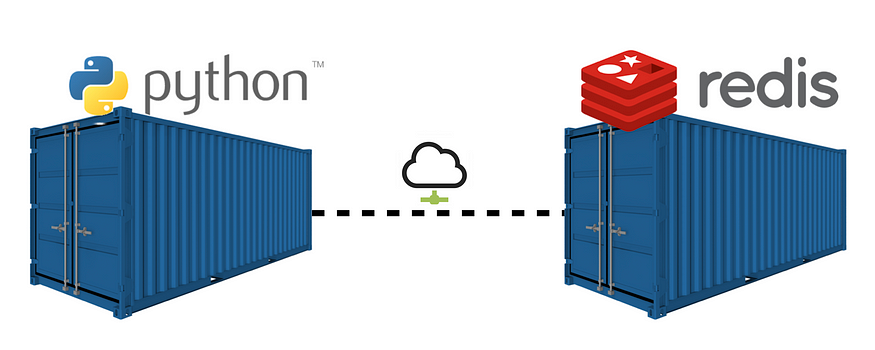
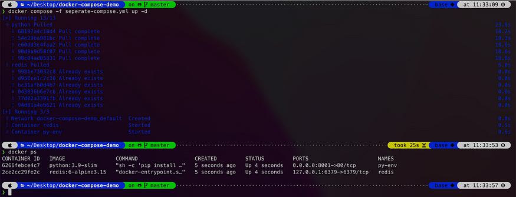
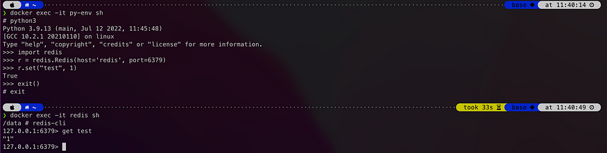
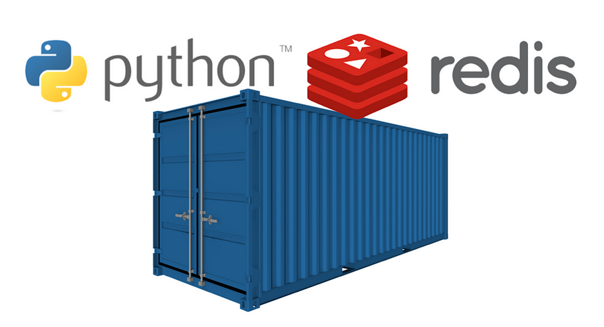
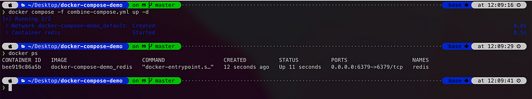
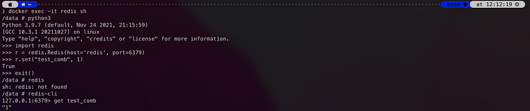

# docker compose + Dockerfile 綜合應用

出處:https://medium.com/%E7%A8%8B%E5%BC%8F%E4%B9%BE%E8%B2%A8/docker-docker-compose-dockerfile-%E7%B6%9C%E5%90%88%E6%87%89%E7%94%A8-7e71ff371ebc


## 先來講講使用場景吧

舉個簡單的例子：假設我需要一個可以運行 python 的環境、還有一個 redis server 的環境，我要執行 python script 在 redis 上做一些資料儲存與運算。我一開始可能會這樣子啟動、`seperate-compose.yml`會這樣寫：



兩個容器，彼此用網路連接

seperate-compose.yml

```dockerfile
version: '3.5'
services:
  python:
    image: python:3.9-slim
    container_name: py-env
    restart: always
    ports:
      - 8001:80
    command: sh -c 'pip install redis && tail -f /dev/null'
    links:
      - redis # 連結到 redis，讓兩個 container 可以互通網路
  redis:
    image: redis:6-alpine3.15
    restart: always
    container_name: redis
    ports:
      - 127.0.0.1:6379:6379
```

用指令 

````
docker compose -f seperate-compose.yml up -d
````

來啟動之後，就可以啟動兩個 container(py-env, redis)



成功啟動 py-env, redis 兩個容器

接著進去剛啟動的 py-env 容器，bash 啟動 python環境連看看 redis，成功在redis這個container中塞入一筆資料(Key: “test”, Value: 1)。來敲指令吧～

```sh
$ docker exec -it py-env sh #先進入 py-env 並啟動 shell
# python3 #在容器裡運行python
>>> import redis #載入redis套件
>>> r = redis.Redis(host='redis', port=6379) #連進容器的redis
>>> r.set("test", 1) #塞一筆資料看看
True #代表塞入成功！
>>> exit() #退出python
# exit #退出container
```

接著來 redis 這個容器看一下資料情形吧～一樣敲指令～

```dockerfile
$ docker exec -it redis sh
# redis-cli #進入redis client端
127.0.0.1:6379> get test #獲取剛剛的key值: test
"1" # 成功返回Value
127.0.0.1:6379>
```



分別進入 py-env, redis 這兩個容器測試資料

## BUT…我想要換個做法

這樣我每次都要啟動 py-env, redis這兩個 container 互連才能夠把服務建立起來，我能不能一次到位？只啟動一個 container 就好呢？

> i.e 我想要一個 container 同時擁有 python 與 redis 的服務！



一個容器兩種享受，我全都要 🤤

眼尖的讀者可發現在前面的`seperate-compose.yml` ，其實兩個容器的基底image分別是 `python:3.9-slim` 與 `redis:6-alpine3.15` ，那要在哪裡找一個基底image、是在 build 的時候同時擁有 python+redis的環境呢？

答案就在一開始，我要自己寫一個 Dockerfile 定義好 image。接著再利用 docker compose 把這個強大的 image 啟動成 container💪

# 先來看看 Dockerfile吧

首先，用下面這個 Dockerfile 建立起 image，簡單敘述一下裡頭做了些什麼事情：

```dockerfile
# 1. 抓取基底image: redis
FROM redis:6-alpine3.15 

# 2. 基於redis image, 開始安裝 python 相關環境與套件
RUN apk add --update --no-cache python3 && ln -sf python3 /usr/bin/python
RUN python3 -m ensurepip
RUN pip3 install --no-cache --upgrade pip setuptools
RUN pip install --no-cache-dir redis
```

# 再來就是 docker compose 的 yml 檔

重頭戲來撰寫 combine-compose.yml

```dockerfile
# docker compose -f redis-compose.yml up -d
version: "3"

services:
  redis:
    build:
      dockerfile: Dockerfile #基於Dockerfile建立image
    restart: always
    container_name: redis #容器名稱
    ports:
      - 6379:6379
    command: sh -c "redis-server --daemonize yes && tail -f /dev/null" #啟動 redis-server
```


接著執行 `docker compose -f combine-compose.yml up -d` 來啟動 container



只剩下一個 redis 容器，還擁有 python 環境喔 🥳

## 接下來進去 redis 這個 container 玩玩看吧

1. 進入容器並啟動shell
   ```sh
   $ docker exec -it redis sh
   ```

   

2. 啟動python並嘗試在redis中塞入一筆資料，再退出python
   ```sh
   # python3
   >>> import redis
   >>> r = redis.Redis(host='redis', port=6379)
   >>> r.set("test_comb", 1)
   True
   >>> exit()
   ```

   

3. 去redis-server看看資料有沒有成功塞入
   ```sh
   /data# redis-cli
   127.0.0.1:6379> get test_comb
   "1"
   ```

   



你有發現嗎？所有動作都在 redis 這個容器裡完成

如此一氣呵成～都在同一個容器內完成🥴

## 總結

核心概念就是先建立 image，才能啟動 container。建立 image 的方式可以用現成的 docker pull、或是自己寫 Dockerfile 建立; 啟動 container 的方式可以用一般 docker run 指令、或是本文中 docker compose 的方式一次啟動多個。只要掌握住了，萬變不離其宗😎

以上程式碼都放在 [github](https://github.com/pcchencode/docker-compose-demo) 上了，有興趣的讀者可以抓下來玩玩看

# 延伸閱讀

以現今的趨勢，其實還是以啟動多容器來架構整個服務比較常見。我會有這種搞怪的做法，單純是因為我想要在 redis 啟動時可以 config 做一些特殊設定，例如：*在每天的半夜12點reset鍵值、或是每隔1小時新增一個鍵值。*

這些需求沒有辦法用 redis 本身提供的指令做到，所以我只能另外啟動一個 python 環境運行 python script，來做 redis config 特殊設定。

當然可能還是有redis本身支援的方式，就有勞各位大神如果有更好的做法，還請不吝告知小弟，大家互相學習增長：）


---

```makefile
#up：啟動 Docker 組合。
#down：停止 Docker 組合。
#logs：顯示 Docker 組合的日誌。
#redis-cli：啟動 Redis 容器的 CLI。
#build：編譯映像。
REDIS_COMPOSE = combine-compose.yml
REDIS_CONTAINER = redis
IMAGE_NAME = redis-python

.PHONY: up down logs redis-cli exec build

up:
	@docker-compose -f $(REDIS_COMPOSE) up -d

down:
	@docker-compose -f $(REDIS_COMPOSE) down

logs:
	@docker-compose -f $(REDIS_COMPOSE) logs -f

redis-cli:
	@docker exec -it $(REDIS_CONTAINER) redis-cli

exec:
	@docker exec -it $(REDIS_CONTAINER) /bin/bash

build:
	docker build -t $(IMAGE_NAME) .
```

```dockerfile
FROM redis

RUN apt-get update && apt-get install -y vim redis-server wget build-essential && \
    wget -q http://prdownloads.sourceforge.net/ta-lib/ta-lib-0.4.0-src.tar.gz && \
    tar xzf ta-lib-0.4.0-src.tar.gz && \
    cd ta-lib/ && \
    ./configure --prefix=/usr && \
    make && \
    make install && \
    cd .. && \
    rm -rf ta-lib ta-lib-0.4.0-src.tar.gz

RUN wget https://repo.anaconda.com/miniconda/Miniconda3-py38_23.1.0-1-Linux-x86_64.sh -O /tmp/miniconda.sh && \
    /bin/bash /tmp/miniconda.sh -b -p /opt/conda && \
    rm /tmp/miniconda.sh

ENV PATH=/opt/conda/bin:$PATH

COPY requirements.txt /tmp/requirements.txt
RUN pip install -r /tmp/requirements.txt && \
    rm /tmp/requirements.txt

RUN mkdir -p /usr/src/app

COPY *.py /usr/src/app

WORKDIR /usr/src/app/
```

```docker
# docker compose -f redis-compose.yml up -d
version: "3"

services:
  redis:
    build:
      dockerfile: Dockerfile #基於Dockerfile建立image
    image: redis-python
    restart: always
    container_name: redis #容器名稱
    ports:
      - 6380:6379
    command: sh -c "redis-server --daemonize yes && tail -f /dev/null" #啟動 redis-server
```

```python
import redis 

r = redis.Redis(host="localhost", port=6379, db=1)
r.set('foo', 'bar')
print(r.get('foo'))


print ("hello world!")
print ("Welcome to python cron job")
```

