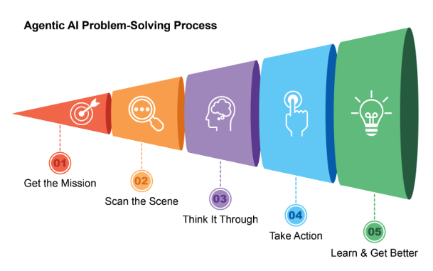
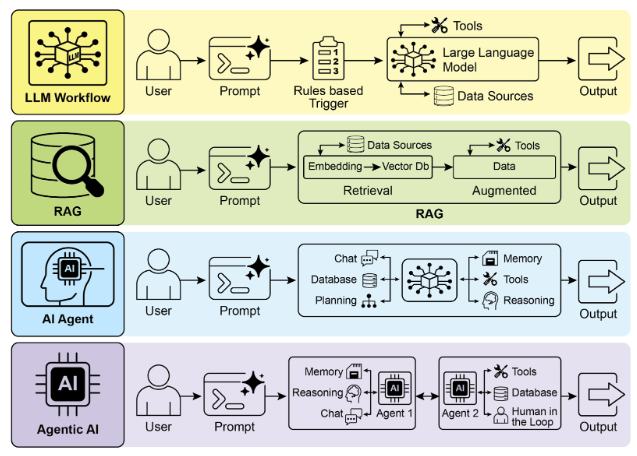
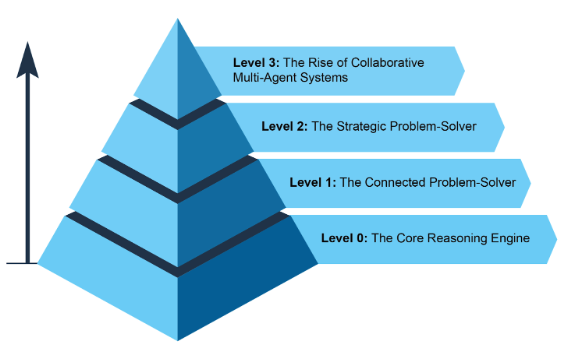
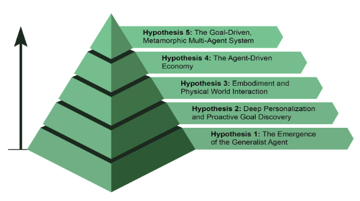

# 什麼讓 AI 系統成為代理？

簡而言之，**人工智慧代理**是一個旨在感知其環境並採取行動以實現特定目標的系統。它是標準大型語言模型（LLM） 的演變，增強了規劃、使用工具以及與周圍環境互動的能力。將 代理式 AI 視為在工作中學習的智慧助理。它遵循一個簡單的五步驟循環來完成工作（見圖 1）：

1. **獲得使命：** 你給它一個目標，例如「安排我的日程安排」。
2. **掃描場景：** 它收集所有必要的資訊 - 閱讀電子郵件、檢查日曆和訪問聯絡人 - 以了解正在發生的情況。
3. **徹底思考：** 它透過考慮實現目標的最佳方法來制定行動計劃。
4. **採取行動：** 它透過發送邀請、安排會議和更新日曆來執行計劃。
5. **學習並變得更好：**它觀察成功的結果並做出相應的調整。例如，如果重新安排會議，系統會從該事件中學習以提高其未來的效能。

圖 1：代理式 AI 擔任智慧助手，透過經驗不斷學習。它透過簡單的五步驟循環來完成任務。

代理人正以驚人的速度變得越來越受歡迎。根據最近的研究，大多數大型 IT 公司都在積極使用這些代理，其中五分之一是在去年才開始使用的。金融市場也注意到了這一點。截至 2024 年底，人工智慧代理新創公司已籌集超過 20 億美元，市場估值為 52 億美元。預計到 2034 年，其價值將激增至近 2,000 億美元。簡而言之，所有跡像都表明人工智慧在我們未來的經濟中發揮著巨大作用。

在短短兩年內，人工智慧範式發生了巨大轉變，從簡單的自動化轉向複雜的自主系統（見圖 2）。最初，工作流程依賴基本提示和觸發器來使用大型語言模型（LLM）處理資料。這是隨著檢索增強生成（檢索增強生成（RAG））的發展而發展的，它透過基於事實資訊的模型來增強可靠性。然後我們看到了能夠使用各種工具的單一人工智慧代理的發展。  今天，我們正在進入智能體人工智慧時代，專業智能體團隊協同工作以實現複雜的目標，這標誌著人工智慧協作能力的重大飛躍。

圖 2：從 大型語言模型（LLM） 過渡到 檢索增強生成（RAG），然後過渡到 代理式 檢索增強生成（RAG），最後過渡到 代理式 AI。

本書的目的是討論專業代理商如何協同工作和協作以實現複雜目標的設計模式，您將在每一章中看到一種協作和互動的範例。

在此之前，讓我們檢查一下涵蓋代理複雜性範圍的範例（請參閱圖 3）。

## 0級：核心推理引擎

雖然大型語言模型（LLM）本身並不是代理，但它可以作為基本代理系統的推理核心。在「0 級」配置中，大型語言模型（LLM） 無需工具、記憶體或環境互動即可運行，僅根據其預先訓練的知識進行回應。它的優勢在於利用其廣泛的訓練數據來解釋既定的概念。這種強大的內在推理的代價是完全缺乏時事意識。例如，如果該資訊超出其預先訓練的知識範圍，它將無法提名 2025 年奧斯卡「最佳影片」獎得主。

## 第 1 級：互聯問題解決者

在這個層級上，大型語言模型（LLM）透過連結和利用外部工具成為功能代理。它的問題解決不再局限於其預先訓練的知識。相反，它可以執行一系列操作來收集和處理來自互聯網（透過搜尋）或資料庫（透過檢索增強生成或 檢索增強生成（RAG））等來源的資訊。詳細資訊請參閱第 14 章。

例如，要尋找新的電視節目，代理商會識別對當前資訊的需求，使用搜尋工具進行查找，然後綜合結果。至關重要的是，它還可以使用專門的工具來提高準確性，例如呼叫金融 API 來獲取 AAPL 的即時股票價格。這種跨多個步驟與外界互動的能力是 1 級代理的核心能力。

## 第二級：策略問題解決者

在此層級上，代理的能力顯著擴展，包括策略規劃、主動協助和自我完善，並將即時工程和環境工程作為核心支援技能。

首先，代理超越了單一工具的使用，透過策略性的問題解決來解決複雜的、多部分的問題。當它執行一系列操作時，它會主動執行情境工程：為每個步驟選擇、打包和管理最相關資訊的策略過程。例如，要尋找兩個位置之間的咖啡店，它首先使用地圖工具。然後，它會設計此輸出，策劃一個簡短的、集中的上下文（可能只是街道名稱列表），以輸入本地搜尋工具，防止認知過載並確保第二步高效且準確。為了讓人工智慧獲得最大的準確性，必須為其提供簡短、集中且強大的上下文。情境工程是一門透過從所有可用來源策略性地選擇、包裝和管理最關鍵資訊來實現這一目標的學科。它有效地管理模型的有限注意力，以防止過載並確保在任何給定任務上高品質、高效的性能。詳細資訊請參閱附錄 A。

這個水平導致主動和持續的操作。連結到您的電子郵件的旅行助理透過從詳細的航班確認電子郵件中設計上下文來演示這一點；它僅選擇關鍵詳細資訊（航班號、日期、位置）來打包，以便後續工具調用您的日曆和天氣 API。

在軟體工程等專業領域，代理商透過應用這一學科來管理整個工作流程。當分配錯誤報告時，它會讀取報告並存取程式碼庫，然後策略性地將這些大量資訊來源設計成一個有效的、集中的上下文，使其能夠有效地編寫、測試和提交正確的程式碼修補程式。

最後，代理透過完善自己的情境工程流程來實現自我改進。當它要求有關如何改進提示的回饋時，它正在學習如何更好地管理其初始輸入。這使得它能夠自動改進為未來任務打包資訊的方式，創建一個強大的自動化回饋循環，隨著時間的推移提高其準確性和效率。有關詳細信息，請參閱第 17 章。

圖 3：展示代理複雜性範圍的各種實例。

## 第三級：協作多代理系統的興起

在第三級，我們看到人工智慧開發的重大範式轉變，從追求單一、全能的超級智慧體轉向複雜、協作的多代理系統的興起。從本質上講，這種方法認識到複雜的挑戰通常不是由單一通才最好地解決，而是由專家團隊協同工作來解決。該模型直接反映了人類組織的結構，其中不同的部門被分配特定的角色並協作以解決多方面的目標。這種體系的集體力量就在於這種分工和協同作用所產生的合力。詳細資訊請參閱第 7 章\。

為了將這個概念變為現實，請考慮推出新產品的複雜工作流程。 「專案經理」代理可以充當中央協調員，而不是由一個代理人試圖處理各個方面。該經理將透過將任務委派給其他專門代理來協調整個流程：「市場研究」代理負責收集消費者數據，「產品設計」代理負責開發概念，「行銷」代理負責製作宣傳材料。他們成功的關鍵是他們之間的無縫溝通和資訊共享，確保所有個人努力一致以實現集體目標。

雖然這種基於團隊的自主自動化的願景已經在開發中，但重要的是要承認當前的障礙。目前，此類多代理系統的有效性受到其所使用的大型語言模型（LLM）的推理限制的限制。此外，他們作為一個有凝聚力的整體真正相互學習和提高的能力仍處於早期階段。克服這些技術瓶頸是關鍵的下一步，這樣做將釋放這一級別的深遠前景：從頭到尾自動化整個業務工作流程的能力。

## 智能體的未來：5 大假設

人工智慧代理的開發正在以前所未有的速度在軟體自動化、科學研究和客戶服務等領域取得進展。雖然目前的系統令人印象深刻，但它們只是一個開始。下一波創新可能會集中在讓智能體更加可靠、更具協作性並深入融入我們的生活。以下是接下來的五個主要假設（見圖 4）。

### 假設1：多面手代理人的出現

第一個假設是，人工智慧代理將從狹隘的專家發展成為真正的通才，能夠以高可靠性管理複雜、模糊和長期的目標。例如，您可以給代理商一個簡單的提示，例如「計劃下季度我公司在里斯本為 30 人舉辦異地靜修會」。然後，代理人將管理整個專案數週，處理從預算批准和航班談判到場地選擇的所有事務，並根據員工回饋建立詳細的行程，同時提供定期更新。要實現這種程度的自主性需要在人工智慧推理、記憶和近乎完美的可靠性方面取得根本性突破。另一種但不互相排斥的方法是小語言模型 (SLM) 的興起。這種「樂高式」概念涉及由小型、專業的專家代理組成系統，而不是擴展單一整體模型。這種方法有望使系統更便宜、調試速度更快、更容易部署。最終，大型通用模型的開發和小型專業模型的組合都是可行的前進道路，它們甚至可以相互補充。

### 假設 2：深度個人化與主動目標發現

第二個假設認為，代理人將成為高度個人化和積極主動的合作夥伴。我們正在見證一類新型態代理商的出現：積極主動的合作夥伴。透過學習您獨特的模式和目標，這些系統開始從僅僅遵循命令轉變為預測您的需求。當人工智慧系統超越簡單地回應聊天或指令時，它們將作為代理運行。他們代表用戶啟動和執行任務，並在過程中積極協作。  這超越了簡單的任務執行，進入了主動目標發現的領域。

例如，如果您正在探索永續能源，代理商可能會識別您的潛在目標，並透過建議課程或總結研究來主動支持您的目標。雖然這些系統仍在開發中，但它們的發展軌跡是明確的。他們會變得越來越主動，當高度確信該行動會有所幫助時，他們會學習為您採取主動。最終，代理人成為不可或缺的盟友，幫助您發現並實現您尚未完全闡明的抱負。

圖 4：關於智能體未來的五種假設

### 假設3：具身化與物理世界交互

這個假設預見到代理人將擺脫純粹的數位限制，並在物理世界中運作。透過將代理人工智慧與機器人技術結合，我們將看到「實體代理」的興起。您可以要求您的家庭代理商修理漏水的水龍頭，而不是只預訂雜工。該代理商將使用其視覺感測器來感知問題，存取管道知識庫來製定計劃，然後精確控制其機器人操縱器來執行修復。這將是一個里程碑式的一步，彌合數位智慧和實際行動之間的差距，並改變從製造和物流到老年人護理和家庭維護的一切。

### 假設 4：代理驅動經濟

第四個假設是，高度自主的代理人將成為經濟的積極參與者，創造新的市場和商業模式。我們可以看到代理人充當獨立的經濟實體，其任務是最大化特定結果，例如利潤。企業家可以設立一個代理商來經營整個電子商務業務。該代理商將透過分析社群媒體來識別趨勢產品，產生行銷文案和視覺效果，透過與其他自動化系統互動來管理供應鏈物流，並根據即時需求動態調整定價。這種轉變將創造一種新的、超高效的“代理經濟”，其運行速度和規模是人類無法直接管理的。

### 假設 5：目標驅動的變形多代理系統

這個假設假設智慧系統的出現不是透過顯式程式設計而是透過聲明的目標來運作。使用者只要說出想要的結果，系統就會自主地找出如何實現它。這標誌著朝向能夠在個人和集體層面真正自我改進的變質多代理系統的根本轉變。

該系統將是一個動態實體，而不是單一代理。它將有能力分析自己的績效並修改其多代理勞動力的拓撲，根據需要創建、複製或刪除代理，以形成最有效的團隊來完成手頭上的任務。這種演變發生在多個層面：

* 架構修改：在最深層次上，單一代理可以重寫自己的原始程式碼並重新架構其內部結構以提高效率，就像最初的假設一樣。
* 指令修改：在更高的層面上，系統不斷地執行自動提示工程和情境工程。它完善了向每個代理提供的指示和訊息，確保他們在沒有任何人為幹預的情況下按照最佳指導進行操作。

例如，企業家只需聲明意圖：「推出一家成功的電子商務企業，銷售手工咖啡。」該系統無需進一步編程，即可立即啟動。它最初可能會產生一個“市場研究”代理和一個“品牌”代理。根據初步調查結果，它可以決定刪除品牌代理商並產生三個新的專屬代理商：「商標設計」代理商、「網路商店平台」代理商和「供應鏈」代理商。它會不斷調整他們的內部提示以獲得更好的性能。如果網路商店代理成為瓶頸，系統可能會將其複製為三個並行代理，以在網站的不同部分上工作，從而有效地動態重新建構其自身的結構，以最好地實現所聲明的目標。

## 結論

從本質上講，人工智慧代理人代表了傳統模型的重大飛躍，作為一個自主系統，可以感知、計劃和行動以實現特定目標。這項技術的發展正在從單一的、使用工具的代理發展到複雜的、協作的多代理系統，以解決多方面的目標。未來的假設預測，通才型、個人化型甚至物理型代理的出現將成為經濟的積極參與者。這一持續的發展標誌著向自我改進、目標驅動系統的重大範式轉變，該系統有望實現整個工作流程的自動化，並從根本上重新定義我們與技術的關係。

## 參考

1. Cloudera, Inc.（2025 年 4 月），96% 的企業正在增加 AI 代理的使用。 [https://www.cloudera.com/about/news-and-blogs/press-releases/2025-04-16-96-percent-of-enterprises-are-expanding-use-of-ai-agents-according-to-latest-data-from-cloudera.html](https://www.cloudera.com/about/news-and-blogs/press-releases/2025-04-16-96-percent-of-enterprises-are-expanding-use-of-ai-agents-according-to-latest-data-from-cloudera.html)
2. 自主生成人工智慧代理：[https://www.deloitte.com/us/en/insights/industry/technology/technology-media-and-telecom-predictions/2025/autonomous-generative-ai-agents-still-under-development.html](https://www.deloitte.com/us/en/insights/industry/technology/technology-media-and-telecom-predictions/2025/autonomous-generative-ai-agents-still-under-development.html)
3. Market.us。 2025-2034 年全球代理人工智慧市場規模、趨勢與預測。 [https://market.us/report/agentic-ai-market/](https://market.us/report/agentic-ai-market/)