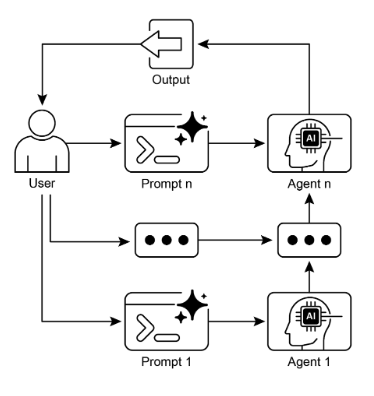

# 第 1 章：提示鏈

## 提示鏈模式概述

提示鏈（有時稱為管道模式）代表了在利用大型語言模型 (LLM) 時處理複雜任務的強大範例。與其期望LLM能夠透過單一的、整體的步驟解決複雜的問題，不如採用分而治之的策略。其核心思想是將最初的、令人畏懼的問題分解為一系列更小、更易於管理的子問題。每個子問題都透過專門設計的提示單獨解決，並且從一個提示產生的輸出有策略地作為輸入輸入到鏈中的後續提示。

這種順序處理技術本質上將模組化和清晰度引入了與LLM的交互中。透過分解複雜的任務，可以更輕鬆地理解和調試每個單獨的步驟，從而使整個過程更加健壯和可解釋。鏈條中的每個步驟都可以精心設計和優化，以專注於更大問題的特定方面，從而產生更準確和更有針對性的輸出。

一個步驟的輸出作為下一步的輸入至關重要。這種資訊傳遞建立了一個依賴鏈（因此得名），其中先前操作的上下文和結果指導後續處理。這使得LLM能夠以先前的工作為基礎，完善其理解，並逐步接近所需的解決方案。

此外，提示鏈不僅在於分解問題，還在於解決問題。它還可以整合外部知識和工具。在每一步中，LLM都可以按照指示與外部系統、API 或資料庫進行交互，從而豐富其內部培訓資料以外的知識和能力。這種能力極大地擴展了LLM的潛力，使它們不僅可以作為孤立的模型發揮作用，而且可以作為更廣泛、更聰明的系統的組成部分。

提示鏈的意義不僅在於解決簡單的問題。它是建構複雜人工智慧代理的基礎技術。這些代理可以利用提示鏈在動態環境中自主規劃、推理和行動。透過策略性地建構提示序列，代理可以參與需要多步驟推理、規劃和決策的任務。這種代理工作流程可以更接近地模仿人類思考過程，從而允許與複雜領域和系統進行更自然、更有效的互動。

**單一提示的限制：** 對於多方面的任務，對於 LLM 使用單一、複雜的提示可能效率低下，導致模型與約束和指令作鬥爭，可能導致指令忽略（部分提示被忽略）、上下文漂移（模型失去對初始上下文的跟踪）、錯誤傳播（早期錯誤放大）、提示需要更長的上下文窗口（模型無法獲得足夠的信息來響應）以及幻覺（認知機會）以及幻覺增加了錯誤的信息。例如，要求分析市場研究報告、總結調查結果、透過資料點識別趨勢以及起草電子郵件的查詢可能會失敗，因為模型可能總結得很好，但無法正確提取資料或起草電子郵件。

**透過順序分解增強可靠性：** 提示鏈透過將複雜的任務分解為集中的順序工作流程來解決這些挑戰，從而顯著提高可靠性和控制力。鑑於上面的範例，管道或鍊式方法可以描述如下：

1. 初步提示（總結）：「總結以下市場研究報告的主要發現：\[文本\]。」該模型的唯一關注點是總結，從而提高初始步驟的準確性。  
2. 第二個提示（趨勢識別）：「使用摘要，識別前三個新興趨勢並提取支持每個趨勢的具體數據點：\[第 1 步的輸出\]。」現在，此提示受到更多限制，並直接基於經過驗證的輸出構建。  
3. 第三個提​​示（電子郵件撰寫）：“起草一封簡潔的電子郵件給行銷團隊，概述以下趨勢及其支持數據：\[第 2 步的輸出\]。”

這種分解允許對過程進行更精細的控制。每個步驟都更簡單、更明確，這減少了模型的認知負擔，並帶來更準確、更可靠的最終輸出。這種模組化類似於計算管道，其中每個函數在將其結果傳遞給下一個函數之前執行特定的操作。為了確保對每個特定任務的準確回應，可以在每個階段為模型分配不同的角色。例如，在給定的場景中，可以將初始提示指定為“市場分析師”，將後續提示指定為“交易分析師”，將第三個提示指定為“專家文件編寫者”，等等。

**結構化輸出的作用：**提示鏈的可靠性高度依賴步驟之間傳遞的資料的完整性。如果一個提示的輸出不明確或格式不正確，則後續提示可能會因輸入錯誤而失敗。為了緩解這種情況，指定結構化輸出格式（例如 JSON 或 XML）至關重要。

例如，趨勢識別步驟的輸出可以格式化為 JSON 物件：

```json
{  "trends": [    
        {      
            "trend_name": "AI-Powered Personalization",      
            "supporting_data": "73% of consumers prefer to do business with brands that use personal information to make their shopping experiences more relevant."    
        },    
        {      
            "trend_name": "Sustainable and Ethical Brands",      
            "supporting_data": "Sales of products with ESG-related claims grew 28% over the last five years, compared to 20% for products without."    
        } 
    ] 
}
```

這種結構化格式確保資料是機器可讀的，並且可以精確解析並毫無歧義地插入到下一個提示中。這種做法可以最大限度地減少解釋自然語言時可能出現的錯誤，並且是建立穩健的、多步驟的基於LLM的系統的關鍵組成部分。

## 實際應用和用例

提示鏈是一種通用模式，適用於建構代理系統時的各種場景。其核心用途在於將複雜的問題分解為連續的、可管理的步驟。以下是一些實際應用和用例：

### 1. 資訊處理工作流程

許多任務涉及透過多次轉換來處理原始資訊。例如，總結文件、擷取關鍵實體，然後使用這些實體查詢資料庫或產生報表。提示鏈可能如下圖所示：

* 提示1：從給定的URL或文件中提取文字內容。  
* 提示2：總結清理後的文字。  
* 提示 3：從摘要或原始文字中擷取特定實體（例如姓名、日期、地點）。  
* 提示4：使用實體搜尋內部知識庫。  
* 提示 5：產生包含摘要、實體和搜尋結果的最終報告。

該方法應用於自動內容分析、人工智慧驅動的研究助理的開發以及複雜的報告生成等領域。

### 2. 複雜查詢應答

回答需要多個推理或資訊檢索步驟的複雜問題是一個主要用例。例如，“1929年股市崩盤的主要原因是什麼？政府政策如何應對？”

* 提示1：辨識使用者查詢中的核心子問題（崩潰原因、政府回應）。  
* 提示 2：專門研究或檢索 1929 年空難原因的資訊。  
* 提示 3：專門研究或檢索有關政府對 1929 年股市崩盤的政策反應的資訊。  
* 提示 4：將步驟 2 和 3 的資訊綜合為原始查詢的連貫答案。

這種順序處理方法是開發能夠進行多步驟推理和資訊合成的人工智慧系統不可或缺的一部分。當查詢無法從單一資料點得到答案而是需要一系列邏輯步驟或整合來自不同來源的資訊時，就需要此類系統。

例如，旨在產生有關特定主題的綜合報告的自動化研究代理執行混合計算工作流程。最初，系統檢索大量相關文章。從每篇文章中提取關鍵資訊的後續任務可以針對每個來源同時執行。此階段非常適合併行處理，其中獨立的子任務同時運行以最大限度地提高效率。

然而，一旦單獨的提取完成，該過程就本質上是連續的。系統必須先整理提取的數據，然後將其合成為連貫的草案，最後審查和完善該草案以產生最終報告。後面的每個階段在邏輯上都依賴前一個階段的成功完成。這就是提示鏈的應用場景：整理後的資料用作合成提示的輸入，而產生的合成文字將成為最終審閱提示的輸入。因此，複雜的操作經常將獨立資料收集的平行處理與合成和細化的相關步驟的提示鏈結合起來。

### 3.資料擷取與轉換

非結構化文字到結構化格式的轉換通常是透過迭代過程來實現的，需要順序修改以提高輸出的準確性和完整性。

* 提示 1：嘗試從發票文件中提取特定欄位（例如名稱、地址、金額）。  
* 處理：檢查是否提取了所有必填欄位以及是否符合格式要求。  
* 提示 2（有條件）：如果欄位遺失或格式錯誤，請製作一個新提示，要求模型專門查找遺失/格式錯誤的訊息，或許可以提供失敗嘗試的上下文。  
* 處理：再次驗證結果。如有必要，請重複。  
* 輸出：提供擷取的、經過驗證的結構化資料。

這種順序處理方法特別適用於從非結構化來源（例如表單、發票或電子郵件）中提取和分析資料。例如，解決複雜的光學字元辨識 (OCR) 問題（例如處理 PDF 表單）可以透過分解的多步驟方法更有效地處理。

最初，採用大型語言模型從文件影像中執行主要文字擷取。接下來，模型處理原始輸出以標準化數據，這一步驟可能會將數位文字（例如「一千五十」）轉換為其等效數字 1050\。LLM面臨的一項重大挑戰是進行精確的數學計算。因此，在後續步驟中，系統可以將任何所需的算術運算委託給外部計算器工具。LLM確定必要的計算，將標準化數字提供給工具，然後合併精確的結果。這種文字擷取、資料規範化和外部工具使用的鍊式序列實現了最終的準確結果，而這種結果通常很難從單一 LLM 查詢中可靠地獲得。

### 4. 內容產生工作流程

複雜內容的構成是一項程序性任務，通常分解為不同的階段，包括初步構思、結構概述、起草和後續修訂

* 提示1：根據使用者的普遍興趣產生5個主題創意。  
* 處理：允許使用者選擇一種想法或自動選擇最佳的一種。  
* 提示2：根據選定的主題，產生詳細的提綱。  
* 提示3：根據大綱中的第一點寫一個草稿部分。  
* 提示 4：根據大綱中的第二點撰寫草稿部分，並提供上一節的上下文。對所有輪廓點繼續此操作。  
* 提示 5：檢視並完善完整草稿的連貫性、語氣和文法。

該方法用於一系列自然語言生成任務，包括創意敘述、技術文件和其他形式的結構化文字內容的自動組成。

### 5. 具有狀態的會話代理

儘管全面的狀態管理架構採用比順序連結更複雜的方法，但提示鏈提供了保持會話連續性的基本機制。該技術透過將每個對話回合建構成新的提示來維護上下文，該提示系統地合併資訊或從對話序列中先前的互動中提取的實體。

* 提示1：處理使用者話語1，辨識意圖和關鍵實體。  
* 處理：用意圖和實體更新對話狀態。  
* 提示 2：根據目前狀態，產生回應和/或識別下一個所需的資訊。  
* 對後續輪次重複，每個新使用者話語都會啟動一個利用累積對話歷史記錄（狀態）的鏈。

這項原則對於會話代理的發展至關重要，使它們能夠在擴展的多輪對話中保持上下文和連貫性。透過保留對話歷史記錄，系統可以理解並適當地回應依賴先前交換的資訊的使用者輸入。

### 6. 程式碼產生與細化

功能程式碼的產生通常是一個多階段過程，需要將問題分解為一系列逐步執行的離散邏輯操作

* 提示1：了解使用者對程式碼功能的要求。產生偽代碼或大綱。  
* 提示2：根據大綱寫出最初的程式碼草稿。  
* 提示 3：識別程式碼中潛在的錯誤或需要改進的地方（可能使用靜態分析工具或其他 LLM 呼叫）。  
* 提示4：根據發現的問題重寫或精簡程式碼。  
* 提示5：新增文件或測試案例。

在人工智慧輔助軟體開發等應用中，提示鏈的實用性源於其將複雜的程式設計任務分解為一系列可管理的子問題的能力。這種模組化結構降低了大型語言模型每一步的操作複雜度。重要的是，這種方法還允許在模型呼叫之間插入確定性邏輯，從而在工作流程中實現中間資料處理、輸出驗證和條件分支。透過這種方法，可能會導致不可靠或不完整結果的單一多方面請求被轉換為由底層執行框架管理的結構化操作序列。

### 7. 多模式與多步驟推理

分析具有不同模式的資料集需要將問題分解為更小的、基於提示的任務。例如，解釋包含嵌入文字的圖片、突出顯示特定文字段的標籤以及解釋每個標籤的表格資料的圖像需要這種方法。

* 提示1：從使用者的圖片請求中提取並理解文字。  
* 提示2：將擷取的圖像文字與其對應的標籤連結。  
* 提示 3：使用表格解釋收集到的資訊以確定所需的輸出。

# 實踐程式碼範例

實現提示鏈的範圍包括從腳本內直接、順序的函數呼叫到使用專門的框架來管理控制流程、狀態和元件整合。 LangChain、LangGraph、Crew AI 和 Google 代理 Development Kit (ADK) 等框架提供了用於構建和執行這些多步驟流程的結構化環境，這對於複雜的架構特別有利。

出於演示目的，LangChain 和 LangGraph 是合適的選擇，因為它們的核心 API 是專門為建立操作鍊和圖而設計的。 LangChain 為線性序列提供了基礎抽象，而 LangGraph 擴展了這些功能以支援有狀態和循環計算，這對於實現更複雜的代理行為是必需的。此範例將重點放在基本線性序列。

以下程式碼實作了一個兩步驟提示鏈，充當資料處理管道。初始階段旨在解析非結構化文字並提取特定資訊。然後，後續階段接收提取的輸出並將其轉換為結構化資料格式。

要複製此過程，必須先安裝所需的庫。這可以使用以下命令來完成：

```bash
pip install langchain langchain-community langchain-openai langgraph
```

請注意，langchain-openai 可以替換為不同模型提供者的適當套件。隨後，必須為執行環境配置所選語言模型提供者（例如 OpenAI、Google Gemini 或 Anthropic）所需的 API 憑證。

```python
import os 
from langchain_openai import ChatOpenAI 
from langchain_core.prompts import ChatPromptTemplate 
from langchain_core.output_parsers import StrOutputParser 

# For better security, load environment variables from a .env file 
# from dotenv import load_dotenv 
# load_dotenv() 
# Make sure your OPENAI_API_KEY is set in the .env file 

# Initialize the Language Model (using ChatOpenAI is recommended) 

llm = ChatOpenAI(temperature=0) 

# --- Prompt 1: Extract Information ---

prompt_extract = ChatPromptTemplate.from_template(
    "Extract the technical specifications from the following text:\n\n{text_input}" 
) 

# --- Prompt 2: Transform to JSON --- 

prompt_transform = ChatPromptTemplate.from_template(
    "Transform the following specifications into a JSON object with 'cpu', 'memory', and 'storage' as keys:\n\n{specifications}" 
) 

# --- Build the Chain using LCEL --- 
# The StrOutputParser() converts the LLM's message output to a simple string. 
extraction_chain = prompt_extract | llm | StrOutputParser() 

# The full chain passes the output of the extraction chain into the 'specifications' 
# variable for the transformation prompt. 
full_chain = (    
    {"specifications": extraction_chain}
        | 
    prompt_transform
        | 
    llm
        | 
    StrOutputParser() 
) 

# --- Run the Chain --- 

input_text = "The new laptop model features a 3.5 GHz octa-core processor, 16GB of RAM, and a 1TB NVMe SSD." 

# Execute the chain with the input text dictionary. 
final_result = full_chain.invoke({"text_input": input_text})
print("\n--- Final JSON Output ---")
print(final_result)
```

此Python程式碼示範如何使用LangChain函式庫來處理文字。它使用兩個單獨的提示：一個從輸入字串中提取技術規範，另一個將這些規範格式化為 JSON 物件。 ChatOpenAI 模型用於語言模型交互，StrOutputParser 確保輸出採用可用的字串格式。 LangChain 表達式語言（LCEL）用於將這些提示和語言模型優雅地連結在一起。第一個鏈 `extraction_chain` 提取規範。然後 `full_chain` 取得提取的輸出並將其用作轉換提示的輸入。提供了描述筆記型電腦的範例輸入文字。使用此文字呼叫 `full_chain`，透過這兩個步驟對其進行處理。然後列印最終結果，即包含提取和格式化規範的 JSON 字串。

## 情境工程與即時工程

情境工程（見圖 1）是在代幣生成之前設計、建構和向 AI 模型提供完整資訊環境的系統學科。此方法斷言模型輸出的品質較少依賴模型的架構本身，而更多地依賴所提供的上下文的豐富性。


圖 1：情境工程是為 AI 建構豐富、全面的資訊環境的學科，因為該情境的品質是實現高階 代理式 效能的主要因素。

它代表了傳統提示工程的重大演變，傳統提示工程主要專注於優化使用者即時查詢的措詞。情境工程將此範圍擴展到包括多個資訊層，例如**系統提示**，這是定義人工智慧操作參數的基本指令集，例如，*「您是技術作家；您的語氣必須正式且精確。」*外部資料進一步豐富了上下文。這包括檢索到的文件，其中人工智慧主動從知識庫中獲取資訊以告知其回應，例如提取專案的技術規格。它還包含工具輸出，這些輸出是人工智慧使用外部 API 獲取即時資料的結果，例如查詢日曆以確定使用者的可用性。這些顯式資料與關鍵的隱式資料結合，例如使用者身分、互動歷史記錄和環境狀態。核心原則是，即使是先進的模型，在提供有限或構造不良的操作環境視圖時也會表現不佳。

因此，這種做法將任務從僅僅回答問題重新定義為為代理建立全面的操作圖。例如，上下文工程代理不僅會回應查詢，還會先整合使用者的行事曆可用性（工具輸出）、與電子郵件收件者的專業關係（隱式資料）以及先前會議的筆記（檢索到的文件）。這使得模型能夠產生高度相關、個人化且實用的輸出。 「工程」元件涉及創建強大的管道以在運行時獲取和轉換此數據，並建立反饋循環以不斷提高上下文品質。

為了實現這一點，可以使用專門的調整系統來大規模自動化改進流程。例如，像 Google 的 Vertex AI 提示優化器這樣的工具可以透過根據一組樣本輸入和預先定義的評估指標系統地評估回應來增強模型效能。這種方法可以有效地適應不同模型的提示和系統指令，而無需大量的手動重寫。透過為此類優化器提供範例提示、系統指令和模板，它可以以程式設計方式細化上下文輸入，從而提供一種結構化方法來實現複雜的上下文工程所需的回饋循環。

這種結構化方法是將基本的人工智慧工具與更複雜的上下文感知系統區分開來的。它將上下文本身視為主要組成部分，極其重視代理知道什麼、何時知道以及如何使用該資訊。這種實踐確保模型對使用者的意圖、歷史和當前環境有全面的了解。最終，情境工程是將無狀態聊天機器人推進為高效能、情境感知系統的關鍵方法。

## 概覽

**內容：** 在單一提示中處理時，複雜的任務通常會讓LLM不堪重負，從而導致嚴重的性能問題。模型上的認知負荷增加了出錯的可能性，例如忽略指令、失去上下文以及產生不正確的資訊。單一的提示很難有效管理多個限制和順序推理步驟。這會導致輸出不可靠和不準確，因為LLM無法解決多方面請求的所有方面。

**原因：** 提示鏈透過將複雜問題分解為一系列較小的、相互關聯的子任務，提供了標準化的解決方案。鏈中的每個步驟都使用集中提示來執行特定操作，從而顯著提高可靠性和控制力。一個提示的輸出將作為輸入傳遞到下一個提示，從而創建一個逐步建立最終解決方案的邏輯工作流程。這種模組化、分而治之的策略使流程更易於管理、更易於調試，並允許在步驟之間整合外部工具或結構化資料格式。此模式是開發複雜的多步驟 代理式 系統的基礎，該系統可以規劃、推理和執行複雜的工作流程。

**經驗法則：** 當任務對於單一提示來說過於複雜、涉及多個不同的處理階段、需要在步驟之間與外部工具交互，或建立需要執行多步驟推理和維護狀態的代理系統時，請使用此模式。

**視覺總結：**



圖 2：提示鏈模式：代理從使用者接收一系列提示，每個代理的輸出作為鏈中下一個代理的輸入。

## 要點

以下是一些要點：

* 提示鏈將複雜的任務分解為一系列較小的、集中的步驟。這有時稱為管道模式。  
* 鏈中的每個步驟都涉及 LLM 呼叫或處理邏輯，使用上一個步驟的輸出作為輸入。  
* 此模式提高了與語言模型的複雜互動的可靠性和可管理性。  
* LangChain/LangGraph 和 Google ADK 等框架提供了強大的工具來定義、管理和執行這些多步驟序列。

## 結論

透過將複雜問題解構為一系列更簡單、更易於管理的子任務，提示鏈為指導大型語言模型提供了一個強大的框架。這種「分而治之」策略透過將模型一次集中於一個特定操作，顯著增強了輸出的可靠性和控制。作為一種基礎模式，它支援開發能夠進行多步驟推理、工具整合和狀態管理的複雜人工智慧代理。最終，掌握提示鏈對於建立強大的上下文感知系統至關重要，這些系統可以執行遠遠超出單一提示功能的複雜工作流程。

## 參考

1. LangChain LCEL 文件：[https://python.langchain.com/v0.2/docs/core_modules/expression_language/](https://python.langchain.com/v0.2/docs/core_modules/expression_language/)
2. LangGraph 文件：[https://langchain-ai.github.io/langgraph/](https://langchain-ai.github.io/langgraph/)
3. 提示工程指南 \- 連結提示：[https://www.promptingguide.ai/techniques/chaining](https://www.promptingguide.ai/techniques/chaining)
4. OpenAI API文件（一般提示概念）：[https://platform.openai.com/docs/guides/gpt/prompting](https://platform.openai.com/docs/guides/gpt/prompting)
5. Crew AI 文件（任務和流程）：[https://docs.crewai.com/](https://docs.crewai.com/)
6. Google AI for Developers（提示指南）：[https://cloud.google.com/discover/what-is-prompt-engineering?hl=en](https://cloud.google.com/discover/what-is-prompt-engineering?hl=en)
7. 頂點提示優化器[https://cloud.google.com/vertex-ai/generative-ai/docs/learn/prompts/prompt-optimizer](https://cloud.google.com/vertex-ai/generative-ai/docs/learn/prompts/prompt-optimizer)
