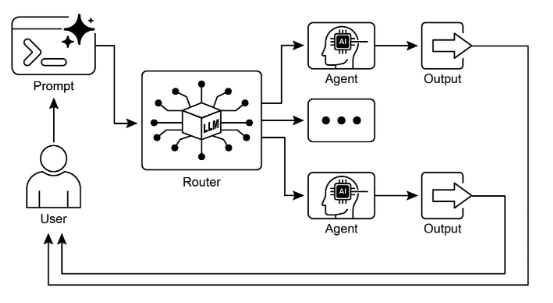

# 第 2 章：路由

## 路由模式概述

雖然透過提示鏈進行順序處理是使用語言模型執行確定性線性工作流程的基礎技術，但其適用性在需要自適應回應的場景中受到限制。現實世界的代理系統通常必須根據偶然因素（例如環境狀態、使用者輸入或先前操作的結果）在多個潛在操作之間進行仲裁。這種動態決策能力是透過一種稱為路由的機制來實現的，它控制著不同專業功能、工具或子流程的控制流。

路由將條件邏輯引入代理的操作框架，從而實現從固定執行路徑到代理動態評估特定標準以從一組可能的後續操作中進行選擇的模型的轉變。這允許更靈活和上下文感知的系統行為。

例如，專為客戶查詢而設計的代理在配備路由功能時，可以先對傳入查詢進行分類，以確定使用者的意圖。基於這種分類，它可以將查詢定向到專門的代理進行直接問答、帳戶資訊的資料庫檢索工具或複雜問題的升級程序，而不是預設為單一的、預定的回應路徑。  因此，使用路由的更複雜的代理可以：

1. 分析用戶的查詢。  
2. **根據查詢的*意圖*路由**查詢：
   * 如果意圖是“檢查訂單狀態”，則路由到與訂單資料庫互動的子代理或工具鏈。  
   * 如果意圖是“產品資訊”，則路由至搜尋產品目錄的子代理或連鎖店。  
   * 如果目的是“技術支援”，請路由至其他鏈以存取故障排除指南或升級至人工。  
   * 如果意圖不清楚，請轉至澄清子代理或提示鏈。

路由模式的核心元件是執行評估和引導流程的機制。該機制可以透過多種方式實現：

* **基於LLM的路由：** 可以提示語言模型本身分析輸入並輸出指示下一步或目的地的特定識別碼或指令。例如，提示可能會要求LLM「分析以下使用者查詢並僅輸出類別：『訂單狀態』、『產品資訊』、『技術支援』或『其他』。」然後，代理系統讀取該輸出並相應地指導工作流程。  
* **基於嵌入的路由：** 輸入查詢可以轉換為向量嵌入（請參閱 RAG，第 14 章）。然後將該嵌入與代表不同路線或功能的嵌入進行比較。查詢被路由到嵌入最相似的路由。這對於語義路由非常有用，其中決策基於輸入的含義而不僅僅是關鍵字。  
* **基於規則的路由：** 這涉及使用基於從輸入中提取的關鍵字、模式或結構化資料的預先定義規則或邏輯（例如 if-else 語句、switch case）。這比基於 LLM 的路由更快、更具確定性，但在處理細微差別或新穎的輸入時靈活性較差。  
* **基於機器學習模型的路由**：它採用判別模型，例如分類器，該模型經過了小型標記資料集的專門訓練來執行路由任務。雖然它與基於嵌入的方法在概念上相似，但其關鍵特徵是監督微調過程，該過程調整模型的參數以創建專門的路由函數。此技術與基於 LLM 的路由不同，因為決策元件不是在推理時執行提示的生成模型。相反，路由邏輯被編碼在微調模型的學習權重中。雖然 LLM 可用於預處理步驟來產生合成資料以增強訓練集，但它們本身並不參與即時路由決策。

路由機制可以在代理操作週期內的多個時刻實施。它們可以在開始時應用以對主要任務進行分類，在處理鏈內的中間點應用以確定後續操作，或在子程式期間從給定的集合中選擇最合適的工具。

LangChain、LangGraph 和 Google 代理開發工具包 (ADK) 等運算框架提供了定義和管理此類條件邏輯的明確建構。憑藉其基於狀態的圖架構，LangGraph 特別適合複雜的路由場景，其中決策取決於整個系統的累積狀態。同樣，Google 的 ADK 提供了用於建立代理功能和互動模型的基礎元件，作為實現路由邏輯的基礎。在這些框架提供的執行環境中，開發人員定義可能的操作路徑以及指示計算圖中節點之間的轉換的函數或基於模型的評估。

路由的實作使系統能夠超越確定性順序處理。它有助於開發更具適應性的執行流程，可以動態且適當地回應更廣泛的輸入和狀態變化。

## 實際應用和用例

路由模式是自適應代理系統設計中的關鍵控制機制，使它們能夠動態改變其執行路徑以回應可變輸入和內部狀態。它的實用性透過提供必要的條件邏輯層來跨越多個領域。

在人機互動中，例如與虛擬助理或人工智慧驅動的導師，路由用於解釋使用者意圖。對自然語言查詢的初步分析確定最合適的後續操作，無論是呼叫特定的資訊檢索工具、升級為人類操作員，或是根據使用者表現選擇課程中的下一個模組。這使得系統能夠超越線性對話流並根據上下文做出回應。

在自動化資料和文件處理管道中，路由可作為分類和分發功能。根據內容、元數據或格式分析傳入數據，例如電子郵件、支援票證或 API 負載。然後，系統將每個專案導向到相應的工作流程，例如銷售線索擷取流程、JSON 或 CSV 格式的特定資料轉換功能或緊急問題升級路徑。

在涉及多個專用工具或代理的複雜系統中，路由充當高級調度程序。由用於搜尋、總結和分析資訊的不同代理組成的研究系統將使用路由器根據當前目標將任務分配給最合適的代理。同樣，人工智慧程式設計助理在將程式碼片段傳遞給正確的專用工具之前，使用路由來識別程式語言和使用者的意圖（進行調試、解釋或翻譯）。

最終，路由提供了邏輯仲裁的能力，這對於創建功能多樣化和上下文感知的系統至關重要。它將代理從預先定義序列的靜態執行器轉變為動態系統，可以決定在不斷變化的條件下完成任務的最有效方法。

## 實作程式碼範例 (LangChain)

在程式碼中實現路由涉及定義可能的路徑以及決定採用哪一條路徑的邏輯。 LangChain 和 LangGraph 等框架為此提供了特定的組件和結構。 LangGraph 基於狀態的圖結構對於視覺化和實現路由邏輯特別直觀。

該程式碼演示了一個使用 LangChain 和 Google 生成人工智慧的簡單的類似代理的系統。它設定一個“協調器”，根據請求的意圖（預訂、資訊或不清楚）將使用者請求路由到不同的模擬“子代理”處理程序。該系統使用語言模型對請求進行分類，然後將其委託給適當的處理函數，模擬多代理架構中常見的基本委託模式。

首先，請確保您安裝了必要的庫：

```bash
pip install langchain langgraph google-cloud-aiplatform langchain-google-genai google-adk deprecated pydantic
```

您還需要使用您選擇的語言模型（例如 OpenAI、Google Gemini、Anthropic）的 API 金鑰來設定您的環境。

```python
# Copyright (c) 2025 Marco Fago
# https://www.linkedin.com/in/marco-fago/
#
# This code is licensed under the MIT License.
# See the LICENSE file in the repository for the full license text.

from langchain_google_genai import ChatGoogleGenerativeAI
from langchain_core.prompts import ChatPromptTemplate
from langchain_core.output_parsers import StrOutputParser
from langchain_core.runnables import RunnablePassthrough, RunnableBranch


# --- Configuration ---
# Ensure your API key environment variable is set (e.g., GOOGLE_API_KEY)
try:
    llm = ChatGoogleGenerativeAI(model="gemini-2.5-flash", temperature=0)
    print(f"Language model initialized: {llm.model}")
except Exception as e:
    print(f"Error initializing language model: {e}")
    llm = None


# --- Define Simulated Sub-Agent Handlers (equivalent to ADK sub_agents) ---
def booking_handler(request: str) -> str:
    """Simulates the Booking Agent handling a request."""
    print("\n--- DELEGATING TO BOOKING HANDLER ---")
    return f"Booking Handler processed request: '{request}'. Result: Simulated booking action."


def info_handler(request: str) -> str:
    """Simulates the Info Agent handling a request."""
    print("\n--- DELEGATING TO INFO HANDLER ---")
    return f"Info Handler processed request: '{request}'. Result: Simulated information retrieval."


def unclear_handler(request: str) -> str:
    """Handles requests that couldn't be delegated."""
    print("\n--- HANDLING UNCLEAR REQUEST ---")
    return f"Coordinator could not delegate request: '{request}'. Please clarify."


# --- Define Coordinator Router Chain (equivalent to ADK coordinator's instruction) ---
# This chain decides which handler to delegate to.
coordinator_router_prompt = ChatPromptTemplate.from_messages([
    (
        "system",
        """Analyze the user's request and determine which specialist handler should process it.
        - If the request is related to booking flights or hotels,
           output 'booker'.
        - For all other general information questions, output 'info'.
        - If the request is unclear or doesn't fit either category,
           output 'unclear'.
        ONLY output one word: 'booker', 'info', or 'unclear'."""
    ),
    ("user", "{request}")
])

if llm:
    coordinator_router_chain = coordinator_router_prompt | llm | StrOutputParser()


# --- Define the Delegation Logic (equivalent to ADK's Auto-Flow based on sub_agents) ---
# Use RunnableBranch to route based on the router chain's output.

# Define the branches for the RunnableBranch
branches = {
    "booker": RunnablePassthrough.assign(
        output=lambda x: booking_handler(x['request']['request'])
    ),
    "info": RunnablePassthrough.assign(
        output=lambda x: info_handler(x['request']['request'])
    ),
    "unclear": RunnablePassthrough.assign(
        output=lambda x: unclear_handler(x['request']['request'])
    ),
}

# Create the RunnableBranch. It takes the output of the router chain
# and routes the original input ('request') to the corresponding handler.
delegation_branch = RunnableBranch(
    (lambda x: x['decision'].strip() == 'booker', branches["booker"]),  # Added .strip()
    (lambda x: x['decision'].strip() == 'info', branches["info"]),      # Added .strip()
    branches["unclear"]  # Default branch for 'unclear' or any other output
)

# Combine the router chain and the delegation branch into a single runnable
# The router chain's output ('decision') is passed along with the original input ('request')
# to the delegation_branch.
coordinator_agent = {
    "decision": coordinator_router_chain,
    "request": RunnablePassthrough()
} | delegation_branch | (lambda x: x['output'])  # Extract the final output


# --- Example Usage ---
def main():
    if not llm:
        print("\nSkipping execution due to LLM initialization failure.")
        return

    print("--- Running with a booking request ---")
    request_a = "Book me a flight to London."
    result_a = coordinator_agent.invoke({"request": request_a})
    print(f"Final Result A: {result_a}")

    print("\n--- Running with an info request ---")
    request_b = "What is the capital of Italy?"
    result_b = coordinator_agent.invoke({"request": request_b})
    print(f"Final Result B: {result_b}")

    print("\n--- Running with an unclear request ---")
    request_c = "Tell me about quantum physics."
    result_c = coordinator_agent.invoke({"request": request_c})
    print(f"Final Result C: {result_c}")


if __name__ == "__main__":
    main()
```

如前所述，這段 Python 程式碼使用 LangChain 程式庫和 Google 的生成式 AI 模型（特別是 Gemini-2.5-flash）建立了一個簡單的類似代理的系統。具體來說，它定義了三個模擬子代理處理程序：`booking_handler`、`info_handler`和`unclear_handler`，每個處理程序都設計用於處理特定類型的請求。

核心元件是 `coordinator_router_chain`，它利用 ChatPromptTemplate 指示語言模型將傳入的使用者請求分類為三個類別之一：`booker`、`info` 或 `unclear`PLACEHOLDER_3__。然後 RunnableBranch 使用此路由器鏈的輸出將原始請求委託給對應的處理程序函數。 RunnableBranch 檢查語言模型的決策，並將請求資料導向至 `booking_handler`、`info_handler` 或 `unclear_handler`。 `coordinator_agent` 組合了這些元件，首先路由決策請求，然後將請求傳遞給所選處理程序。最終輸出是從處理程序的回應中提取的。

主函數透過三個範例請求示範了系統的用法，展示了模擬代理如何路由和處理不同的輸入。包括語言模型初始化的錯誤處理以確保穩健性。程式碼結構模仿基本的多代理框架，其中中央協調器根據意圖將任務委託給專門的代理。

## 實作程式碼範例 (Google ADK)

代理開發工具包 (ADK) 是用於工程代理系統的框架，提供用於定義代理的功能和行為的結構化環境。與基於明確計算圖的架構相比，ADK 範例中的路由通常是透過定義一組代表代理功能的離散「工具」來實現的。回應使用者查詢而選擇適當的工具是由框架的內部邏輯管理的，該邏輯利用底層模型將使用者意圖與正確的功能處理程序相匹配。

此 Python 程式碼示範了使用 Google ADK 程式庫的代理開發套件 (ADK) 應用程式的範例。它設定了一個「協調器」代理，根據定義的指令將使用者請求路由到專門的子代理（「Booker」用於預訂，「Info」用於一般資訊）。然後，子代理使用特定工具來模擬處理請求，展示代理系統內的基本委託模式

```python
# Copyright (c) 2025 Marco Fago
#
# This code is licensed under the MIT License.
# See the LICENSE file in the repository for the full license text.

import uuid
from typing import Dict, Any, Optional

from google.adk.agents import Agent
from google.adk.runners import InMemoryRunner
from google.adk.tools import FunctionTool
from google.genai import types
from google.adk.events import Event


# --- Define Tool Functions ---
# These functions simulate the actions of the specialist agents.
def booking_handler(request: str) -> str:
    """
    Handles booking requests for flights and hotels.

    Args:
        request: The user's request for a booking.

    Returns:
        A confirmation message that the booking was handled.
    """
    print("-------------------------- Booking Handler Called ----------------------------")
    return f"Booking action for '{request}' has been simulated."


def info_handler(request: str) -> str:
    """
    Handles general information requests.

    Args:
        request: The user's question.

    Returns:
        A message indicating the information request was handled.
    """
    print("-------------------------- Info Handler Called ----------------------------")
    return f"Information request for '{request}'. Result: Simulated information retrieval."


def unclear_handler(request: str) -> str:
    """Handles requests that couldn't be delegated."""
    return f"Coordinator could not delegate request: '{request}'. Please clarify."


# --- Create Tools from Functions ---
booking_tool = FunctionTool(booking_handler)
info_tool = FunctionTool(info_handler)

# Define specialized sub-agents equipped with their respective tools
booking_agent = Agent(
    name="Booker",
    model="gemini-2.0-flash",
    description="A specialized agent that handles all flight "
                "and hotel booking requests by calling the booking tool.",
    tools=[booking_tool],
)

info_agent = Agent(
    name="Info",
    model="gemini-2.0-flash",
    description="A specialized agent that provides general information "
                "and answers user questions by calling the info tool.",
    tools=[info_tool],
)

# Define the parent agent with explicit delegation instructions
coordinator = Agent(
    name="Coordinator",
    model="gemini-2.0-flash",
    instruction=(
        "You are the main coordinator. Your only task is to analyze "
        "incoming user requests "
        "and delegate them to the appropriate specialist agent. Do not try to answer the user directly.\n"
        "- For any requests related to booking flights or hotels, delegate to the 'Booker' agent.\n"
        "- For all other general information questions, delegate to the 'Info' agent."
    ),
    description="A coordinator that routes user requests to the correct specialist agent.",
    # The presence of sub_agents enables LLM-driven delegation (Auto-Flow) by default.
    sub_agents=[booking_agent, info_agent],
)


# --- Execution Logic ---
async def run_coordinator(runner: InMemoryRunner, request: str):
    """Runs the coordinator agent with a given request and delegates."""
    print(f"\n--- Running Coordinator with request: '{request}' ---")
    final_result = ""
    try:
        user_id = "user_123"
        session_id = str(uuid.uuid4())

        await runner.session_service.create_session(
            app_name=runner.app_name,
            user_id=user_id,
            session_id=session_id,
        )

        for event in runner.run(
            user_id=user_id,
            session_id=session_id,
            new_message=types.Content(
                role='user',
                parts=[types.Part(text=request)],
            ),
        ):
            if event.is_final_response() and event.content:
                # Try to get text directly from event.content to avoid iterating parts
                if hasattr(event.content, 'text') and event.content.text:
                    final_result = event.content.text
                elif event.content.parts:
                    # Fallback: Iterate through parts and extract text (might trigger warning)
                    text_parts = [part.text for part in event.content.parts if getattr(part, "text", None)]
                    final_result = "".join(text_parts)
                # Assuming the loop should break after the final response
                break

        print(f"Coordinator Final Response: {final_result}")
        return final_result

    except Exception as e:
        print(f"An error occurred while processing your request: {e}")
        return f"An error occurred while processing your request: {e}"


async def main():
    """Main function to run the ADK example."""
    print("--- Google ADK Routing Example (ADK Auto-Flow Style) ---")
    print("Note: This requires Google ADK installed and authenticated.")

    runner = InMemoryRunner(coordinator)

    # Example Usage
    result_a = await run_coordinator(runner, "Book me a hotel in Paris.")
    print(f"Final Output A: {result_a}")

    result_b = await run_coordinator(runner, "What is the highest mountain in the world?")
    print(f"Final Output B: {result_b}")

    result_c = await run_coordinator(runner, "Tell me a random fact.")  # Should go to Info
    print(f"Final Output C: {result_c}")

    result_d = await run_coordinator(runner, "Find flights to Tokyo next month.")  # Should go to Booker
    print(f"Final Output D: {result_d}")


if __name__ == "__main__":
    import nest_asyncio

    nest_asyncio.apply()
    await main()
```

這個腳本由一個主要的 Coordinator 代理和兩個專門的 `sub_agents` 組成：Booker 和 Info。每個專門的代理都配備了一個 FunctionTool，它包裝了一個模擬動作的 Python 函數。 `booking_handler` 函數模擬處理航班和飯店預訂，而 `info_handler` 函數模擬檢索一般資訊。 `unclear_handler` 被包含作為協調器無法委託的請求的後備，儘管當前協調器邏輯沒有在主 `run_coordinator` 函數中明確使用它來處理委託失敗。

協調器代理的主要角色（如其指令中所定義）是分析傳入的使用者訊息並將其委託給 Booker 或 Info 代理。此委託由 ADK 的自動流機制自動處理，因為協調器已定義 `sub_agents` 。 `run_coordinator` 函數設定一個 InMemoryRunner，建立使用者和會話 ID，然後使用該運算元透過協調器代理處理使用者的請求。 runner.run 方法處理請求並產生事件，程式碼從 event.content 中提取最終回應文字。

主函數透過執行具有不同請求的協調器來示範系統的用法，展示它如何將預訂請求委託給 Booker 並將資訊請求委託給 Info 代理。

## 概覽

**內容**：代理系統通常必須回應各種輸入和情況，而這些輸入和情況無法透過單一線性流程處理。簡單的順序工作流程缺乏根據情境做出決策的能力。如果沒有為特定任務選擇正確工具或子流程的機制，系統就會保持僵化且不具適應性。這種限制使得建立能夠管理現實世界用戶請求的複雜性和可變性的複雜應用程式變得困難。

**為什麼：** 路由模式透過將條件邏輯引入代理的操作框架來提供標準化的解決方案。它使系統能夠首先分析傳入的查詢以確定其意圖或性質。基於此分析，代理動態地將控制流引導至最合適的專用工具、功能或子代理。這項決定可以透過多種方法來驅動，包括提示LLM、應用預先定義的規則或使用基於嵌入的語義相似性。最終，路由將靜態的、預定的執行路徑轉換為靈活的、情境感知的工作流程，能夠選擇最佳的可能操作。

**經驗法則：** 當代理必須根據使用者的輸入或當前狀態在多個不同的工作流程、工具或子代理之間做出決定時，請使用路由模式。對於需要對傳入請求進行分類或分類以處理不同類型任務的應用程式至關重要，例如區分銷售查詢、技術支援和帳戶管理問題的客戶支援機器人。

**視覺摘要：**



圖 1：路由器模式，使用 LLM 作為路由器

## 要點

* 路由使代理能夠根據條件對工作流程的下一步做出動態決策。  
* 它允許代理處理不同的輸入並調整他們的行為，超越線性執行。  
* 路由邏輯可以使用 LLM、基於規則的系統或嵌入相似性來實現。  
* LangGraph 和 Google ADK 等框架提供了結構化方法來定義和管理代理工作流程中的路由，儘管架構方法不同。

## 結論

路由模式是建立真正動態和響應式代理系統的關鍵步驟。透過實施路由，我們超越了簡單的線性執行流程，使我們的代理能夠就如何處理資訊、響應用戶輸入以及利用可用工具或子代理做出明智的決策。

我們已經了解如何將路由應用於從客戶服務聊天機器人到複雜的資料處理管道的各個領域。分析輸入和有條件地指導工作流程的能力是創建能夠處理現實世界任務固有可變性的代理的基礎。

使用 LangChain 和 Google ADK 的程式碼範例示範了兩種不同但有效的路由實作方法。 LangGraph 基於圖形的結構提供了一種可視化且明確的方式來定義狀態和轉換，使其成為具有複雜路由邏輯的複雜、多步驟工作流程的理想選擇。另一方面，Google ADK 通常專注於定義不同的功能（工具），並依賴框架將使用者請求路由到適當的工具處理程序的能力，這對於具有一組明確定義的離散操作的代理來說可能更簡單。

掌握路由模式對於建立能夠智慧地導航不同場景並根據上下文提供客製化回應或操作的代理至關重要。它是創建多功能且強大的代理應用程式的關鍵元件。

## 參考

1. LangGraph 文件：[https://www.langchain.com/](https://www.langchain.com/)
2. Google 代理 開發工具包文件：[https://google.github.io/adk-docs/](https://google.github.io/adk-docs/)
