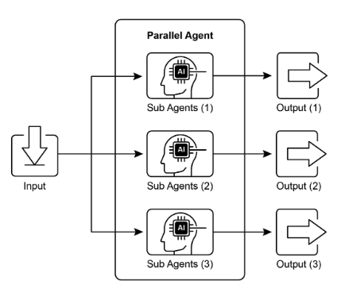
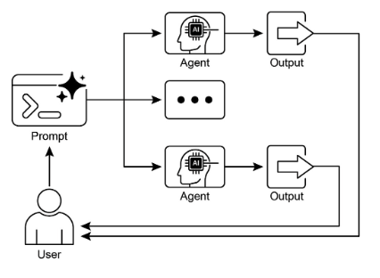

# 第 3 章：平行化

## 平行化模式概述

在前面的章節中，我們探索了順序工作流程的提示鏈和動態決策的路由以及不同路徑之間的轉換。雖然這些模式很重要，但許多複雜的代理任務涉及多個子任務，這些子任務可以「同時」執行，而不是一個接一個地執行。這就是**並行化**模式變得至關重要的地方。

並行化涉及同時執行多個元件，例如 LLM 呼叫、工具使用，甚至整個子代理（見圖 1）。並行執行允許獨立任務同時運行，而不是等待一個步驟完成後再開始下一個步驟，從而顯著減少可分解為獨立部分的任務的總體執行時間。

考慮一個旨在研究某個主題並總結其發現的代理。順序方法可能：

1. 搜尋來源 A。  
2. 總結來源 A。  
3. 搜尋來源 B。  
4. 總結來源 B。  
5. 根據摘要 A 和 B 綜合得出最終答案。

相反，並行方法可以：

1. 同時搜尋來源 A * 和* 搜尋來源 B。  
2. 兩個搜尋完成後，同時彙總來源 A *和* 彙總來源 B。  
3. 根據摘要 A 和 B 合成最終答案（此步驟通常是連續的，等待並行步驟完成）。

核心思想是識別工作流程中不依賴其他部分輸出的部分並並行執行它們。這在處理有延遲的外部服務（例如 API 或資料庫）時特別有效，因為您可以同時發出多個請求。

實作並行化通常需要支援非同步執行或多執行緒/多處理的框架。現代代理框架在設計時考慮了非同步操作，使您可以輕鬆定義可以並行運行的步驟。



圖1.與子代理並行化的範例

LangChain、LangGraph 和 Google ADK 等框架提供了平行執行機制。在LangChain表達式語言（LCEL）中，您可以透過使用|等運算子組合可運行物件來實現並行執行。 （對於順序）並透過建立鍊或圖來具有同時執行的分支。 LangGraph 及其圖形結構可讓您定義可以從單一狀態轉換執行的多個節點，從而有效地在工作流程中啟用並行分支。 Google ADK 提供了強大的本機機制來促進和管理代理的平行執行，從而顯著提高複雜的多代理系統的效率和可擴展性。 ADK 框架內的這種固有功能可讓開發人員設計和實作多個代理可以同時而不是順序操作的解決方案。

並行化模式對於提高代理系統的效率和回應能力至關重要，特別是在處理涉及多個獨立查找、計算或與外部服務互動的任務時。這是優化複雜代理工作流程效能的關鍵技術。

## 實際應用和用例

並行化是跨各種應用程式優化代理效能的強大模式：

### 1. 資訊收集與研究

同時從多個來源收集資訊是一個經典的用例。

* **用例：** 研究公司的代理。  
  * **並行任務：** 搜尋新聞文章、提取股票資料、檢查社交媒體提及以及查詢公司資料庫，所有這些都同時進行。  
  * **優點：** 比順序查找更快地收集全面視圖。

### 2.資料處理與分析

應用不同的分析技術或同時處理不同的資料段。

* **用例：** 代理分析客戶回饋。  
  * **並行任務：** 執行情緒分析、提取關鍵字、對回饋進行分類，並在一批回饋條目中同時識別緊急問題。  
  * **好處：** 快速提供多方面的分析。

### 3. 多API或工具交互

呼叫多個獨立的API或工具來收集不同類型的信息或執行不同的操作。

* **用例：** 旅行規劃代理。  
  * **並行任務：** 同時檢查航班價格、搜尋飯店供應情況、尋找當地活動並尋找餐廳推薦。  
  * **好處：** 更快呈現完整的旅行計劃。

### 4. 使用多個元件產生內容

並行產生複雜內容的不同部分。

* **用例：** 代理建立行銷電子郵件。  
  * **並行任務：** 產生主題行、起草電子郵件正文、尋找相關圖像並同時建立號召性用語按鈕文字。  
  * **好處：** 更有效地組合最終電子郵件。

### 5. 驗證與驗證

同時執行多個獨立的檢查或驗證。

* **用例：** 代理驗證使用者輸入。  
  * **並行任務：** 檢查電子郵件格式、驗證電話號碼、根據資料庫驗證地址，並同時檢查是否有髒話。  
  * **好處：** 提供有關輸入有效性的更快回饋。

### 6. 多模態處理

同時處理相同輸入的不同形式（文字、圖像、音訊）。

* **用例：** 代理分析帶有文字和圖像的社交媒體貼文。  
  * **並行任務：** 分析文本中的情緒和關鍵字 * 並* 同時分析圖像中的物件和場景描述。  
  * **好處：** 更快整合來自不同模式的見解。

### 7. A/B 測試或多選項生成

並行產生響應或輸出的多個變體以選擇最佳的一個。

* **用例：** 產生不同創意文字選項的代理。  
  * **並行任務：** 使用略有不同的提示或模型同時為一篇文章產生三個不同的標題。  
  * **好處：** 允許快速比較並選擇最佳選項。

並行化是代理設計中的基本最佳化技術，可讓開發人員透過利用獨立任務的並行執行來建立效能更高、反應更快的應用程式。

## 實作程式碼範例 (LangChain)

LangChain 表達式語言（LCEL）促進了 LangChain 框架內的平行執行。主要方法涉及在字典或列表構造中建立多個可運行元件。當此集合作為輸入傳遞到鏈中的後續元件時，LCEL 運行時會同時執行所包含的可運行物件。

在 LangGraph 的脈絡中，此原理應用於圖的拓樸。並行工作流程是透過建立圖形來定義的，以便可以從單一公共節點啟動多個缺乏直接順序依賴性的節點。這些並行路徑在其結果可以在圖中的後續收斂點聚合之前獨立執行。

下面的實作示範了使用LangChain框架建立的平行處理工作流程。此工作流程旨在同時執行兩個獨立的操作以回應單一使用者查詢。這些並行過程被實例化為不同的鍊或函數，並且它們各自的輸出隨後被聚合成統一的結果。

此實作的先決條件包括安裝必需的 Python 套件，例如 langchain、langchain-community 和模型提供者庫（例如 langchain-openai）。此外，必須在本機環境中配置所選語言模型的有效 API 金鑰以進行身份驗證。

```python
import os
import asyncio
from typing import Optional

from langchain_openai import ChatOpenAI
from langchain_core.prompts import ChatPromptTemplate
from langchain_core.output_parsers import StrOutputParser
from langchain_core.runnables import Runnable, RunnableParallel, RunnablePassthrough


# --- Configuration ---
# Ensure your API key environment variable is set (e.g., OPENAI_API_KEY)
try:
    llm: Optional[ChatOpenAI] = ChatOpenAI(model="gpt-4o-mini", temperature=0.7)
except Exception as e:
    print(f"Error initializing language model: {e}")
    llm = None


# --- Define Independent Chains ---
# These three chains represent distinct tasks that can be executed in parallel.
summarize_chain: Runnable = (
    ChatPromptTemplate.from_messages([
        ("system", "Summarize the following topic concisely:"),
        ("user", "{topic}"),
    ])
    | llm
    | StrOutputParser()
)

questions_chain: Runnable = (
    ChatPromptTemplate.from_messages([
        ("system", "Generate three interesting questions about the following topic:"),
        ("user", "{topic}"),
    ])
    | llm
    | StrOutputParser()
)

terms_chain: Runnable = (
    ChatPromptTemplate.from_messages([
        ("system", "Identify 5-10 key terms from the following topic, separated by commas:"),
        ("user", "{topic}"),
    ])
    | llm
    | StrOutputParser()
)


# --- Build the Parallel + Synthesis Chain ---
# 1. Define the block of tasks to run in parallel. The results of these,
#    along with the original topic, will be fed into the next step.
map_chain = RunnableParallel(
    {
        "summary": summarize_chain,
        "questions": questions_chain,
        "key_terms": terms_chain,
        "topic": RunnablePassthrough(),  # Pass the original topic through
    }
)

# 2. Define the final synthesis prompt which will combine the parallel results.
synthesis_prompt = ChatPromptTemplate.from_messages([
    (
        "system",
        """Based on the following information:
        Summary: {summary}
        Related Questions: {questions}
        Key Terms: {key_terms}
        Synthesize a comprehensive answer."""
    ),
    ("user", "Original topic: {topic}"),
])

# 3. Construct the full chain by piping the parallel results directly
#    into the synthesis prompt, followed by the LLM and output parser.
full_parallel_chain = map_chain | synthesis_prompt | llm | StrOutputParser()


# --- Run the Chain ---
async def run_parallel_example(topic: str) -> None:
    """
    Asynchronously invokes the parallel processing chain with a specific topic
    and prints the synthesized result.

    Args:
        topic: The input topic to be processed by the LangChain chains.
    """
    if not llm:
        print("LLM not initialized. Cannot run example.")
        return

    print(f"\n--- Running Parallel LangChain Example for Topic: '{topic}' ---")
    try:
        # The input to `ainvoke` is the single 'topic' string,
        # then passed to each runnable in the `map_chain`.
        response = await full_parallel_chain.ainvoke(topic)
        print("\n--- Final Response ---")
        print(response)
    except Exception as e:
        print(f"\nAn error occurred during chain execution: {e}")


if __name__ == "__main__":
    test_topic = "The history of space exploration"
    # In Python 3.7+, asyncio.run is the standard way to run an async function.
    asyncio.run(run_parallel_example(test_topic))
```

提供的Python程式碼實現了LangChain應用程序，該應用程式旨在透過利用平行執行來有效地處理給定主題。請注意，asyncio 提供並發性，而不是並行性。它透過使用事件循環在單一執行緒上實現這一目標，該事件循環在任務空閒時（例如，等待網路請求）在任務之間智慧切換。這會造成多個任務同時進行的效果，但程式碼本身仍然僅由一個執行緒執行，受到 Python 全域解釋器鎖定 (GIL) 的約束。

程式碼首先從 `langchain_openai` 和 `langchain_core` 匯入基本模組，包括語言模型、提示、輸出解析和可運行結構的元件。程式碼嘗試初始化 ChatOpenAI 實例，特別是使用「gpt-4o-mini」模型，並使用指定的溫度來控制創造力。 try-except 區塊用於在語言模型初始化期間提供穩健性。然後定義三個獨立的 LangChain“鏈”，每個鏈都設計用於對輸入主題執行不同的任務。第一條鏈用於使用系統訊息和包含主題佔位符的使用者訊息來簡潔地總結主題。第二條鏈被配置為產生三個與該主題相關的有趣問題。第三條鏈用於識別輸入主題中的 5 到 10 個關鍵術語，並要求它們以逗號分隔。每個獨立鏈都包含一個針對其特定任務定制的 ChatPromptTemplate，後面跟著初始化的語言模型和一個將輸出格式化為字串的 StrOutputParser。

然後建立一個 RunnableParallel 區塊來捆綁這三個鏈，使它們能夠同時執行。此並行可運行物件還包括 RunnablePassthrough，以確保原始輸入主題可用於後續步驟。為最終綜合步驟定義了一個單獨的 ChatPromptTemplate，將摘要、問題、關鍵術語和原始主題作為輸入以產生全面的答案。名為 `full_parallel_chain` 的完整端對端處理鍊是透過將 `map_chain` （平行區塊）排序到綜合提示中建立的，然後是語言模型和輸出解析器。提供了非同步函數 `run_parallel_example` 來示範如何呼叫此 `full_parallel_chain`。此函數將主題作為輸入並使用 invoke 來運行非同步鏈。最後，標準 Python `if __name__ \== "__main__":` 區塊展示如何使用範例主題（在本例中為「太空探索的歷史」）執行 `run_parallel_example`，並使用 asyncio.run 管理非同步執行。

本質上，此程式碼設定了一個工作流程，其中針對給定主題同時發生多個 LLM 呼叫（用於總結、問題和術語），然後將它們的結果由最終的 LLM 呼叫組合起來。這展示了使用 LangChain 在代理工作流程中並行化的核心想法。

## 實作程式碼範例 (Google ADK)

好的，現在讓我們將注意力轉向在 Google ADK 框架內說明這些概念的具體範例。我們將研究如何應用 ADK 原語（例如 ParallelAgent 和 SequentialAgent）來建立利用並發執行來提高效率的代理流程。

```python
from google.adk.agents import LlmAgent, ParallelAgent, SequentialAgent
from google.adk.tools import google_search

GEMINI_MODEL = "gemini-2.0-flash"


# --- 1. Define Researcher Sub-Agents (to run in parallel) ---

# Researcher 1: Renewable Energy
researcher_agent_1 = LlmAgent(
    name="RenewableEnergyResearcher",
    model=GEMINI_MODEL,
    instruction="""You are an AI Research Assistant specializing in energy. Research the latest advancements in 'renewable energy sources'. Use the Google Search tool provided. Summarize your key findings concisely (1-2 sentences). Output *only* the summary. """,
    description="Researches renewable energy sources.",
    tools=[google_search],
    # Store result in state for the merger agent
    output_key="renewable_energy_result",
)

# Researcher 2: Electric Vehicles
researcher_agent_2 = LlmAgent(
    name="EVResearcher",
    model=GEMINI_MODEL,
    instruction="""You are an AI Research Assistant specializing in transportation. Research the latest developments in 'electric vehicle technology'. Use the Google Search tool provided. Summarize your key findings concisely (1-2 sentences). Output *only* the summary. """,
    description="Researches electric vehicle technology.",
    tools=[google_search],
    # Store result in state for the merger agent
    output_key="ev_technology_result",
)

# Researcher 3: Carbon Capture
researcher_agent_3 = LlmAgent(
    name="CarbonCaptureResearcher",
    model=GEMINI_MODEL,
    instruction="""You are an AI Research Assistant specializing in climate solutions. Research the current state of 'carbon capture methods'. Use the Google Search tool provided. Summarize your key findings concisely (1-2 sentences). Output *only* the summary. """,
    description="Researches carbon capture methods.",
    tools=[google_search],
    # Store result in state for the merger agent
    output_key="carbon_capture_result",
)


# --- 2. Create the ParallelAgent (Runs researchers concurrently) ---
# This agent orchestrates the concurrent execution of the researchers.
# It finishes once all researchers have completed and stored their results in state.
parallel_research_agent = ParallelAgent(
    name="ParallelWebResearchAgent",
    sub_agents=[researcher_agent_1, researcher_agent_2, researcher_agent_3],
    description="Runs multiple research agents in parallel to gather information.",
)


# --- 3. Define the Merger Agent (Runs after the parallel agents) ---
# This agent takes the results stored in the session state by the parallel agents
# and synthesizes them into a single, structured response with attributions.
merger_agent = LlmAgent(
    name="SynthesisAgent",
    model=GEMINI_MODEL,  # Or potentially a more powerful model if needed for synthesis
    instruction="""You are an AI Assistant responsible for combining research findings into a structured report. Your primary task is to synthesize the following research summaries, clearly attributing findings to their source areas. Structure your response using headings for each topic. Ensure the report is coherent and integrates the key points smoothly.

**Crucially:** Your entire response MUST be grounded *exclusively* on the information provided in the 'Input Summaries' below. Do NOT add any external knowledge, facts, or details not present in these specific summaries.

**Input Summaries:**
*   **Renewable Energy:**
    {renewable_energy_result}
*   **Electric Vehicles:**
    {ev_technology_result}
*   **Carbon Capture:**
    {carbon_capture_result}

**Output Format:**
## Summary of Recent Sustainable Technology Advancements

### Renewable Energy Findings (Based on RenewableEnergyResearcher's findings)
[Synthesize and elaborate *only* on the renewable energy input summary provided above.]

### Electric Vehicle Findings (Based on EVResearcher's findings)
[Synthesize and elaborate *only* on the EV input summary provided above.]

### Carbon Capture Findings (Based on CarbonCaptureResearcher's findings)
[Synthesize and elaborate *only* on the carbon capture input summary provided above.]

### Overall Conclusion
[Provide a brief (1-2 sentence) concluding statement that connects *only* the findings presented above.]

Output *only* the structured report following this format. Do not include introductory or concluding phrases outside this structure, and strictly adhere to using only the provided input summary content.
""",
    description="Combines research findings from parallel agents into a structured, cited report, strictly grounded on provided inputs.",
    # No tools needed for merging
    # No output_key needed here, as its direct response is the final output of the sequence
)


# --- 4. Create the SequentialAgent (Orchestrates the overall flow) ---
# This is the main agent that will be run. It first executes the ParallelAgent
# to populate the state, and then executes the MergerAgent to produce the final output.
sequential_pipeline_agent = SequentialAgent(
    name="ResearchAndSynthesisPipeline",
    # Run parallel research first, then merge
    sub_agents=[parallel_research_agent, merger_agent],
    description="Coordinates parallel research and synthesizes the results.",
)

root_agent = sequential_pipeline_agent
```

該代碼定義了一個多代理系統，用於研究和綜合可持續技術進步的資訊。它設置了三個 LlmAgent 實例來充當專門的研究人員。 `ResearcherAgent_1` 專注於再生能源，`ResearcherAgent_2` 研究電動汽車技術，`ResearcherAgent_3` 研究碳捕獲方法。每個研究人員代理都配置為使用 `GEMINI_MODEL` 和 `google_search` 工具。他們被要求簡潔地總結他們的發現（1-2 個句子），並使用 `output_key` 將這些摘要儲存在會話狀態中。

然後建立一個名為 ParallelWebResearchAgent 的 ParallelAgent 以同時執行這三個研究人員代理。這使得研究可以並行進行，從而可能節省時間。一旦 ParallelAgent 的所有子代理（研究人員）完成並填滿狀態，ParallelAgent 就會完成執行。

接下來，定義一個MergerAgent（也是一個LlmAgent）來綜合研究結果。該代理將並行研究人員儲存在會話狀態中的摘要作為輸入。其指令強調輸出必須嚴格僅基於提供的輸入摘要，禁止添加外部知識。 MergerAgent 旨在將合併的結果建構成一份報告，其中包含每個主題的標題和簡短的總體結論。

最後，建立一個名為 ResearchAndSynthesisPipeline 的 SequentialAgent 來編排整個工作流程。作為主控制器，該主代理首先執行ParallelAgent 來執行研究。一旦ParallelAgent完成，SequentialAgent就會執行MergerAgent來綜合收集到的資訊。 `sequential_pipeline_agent` 設定為 `root_agent`，表示運行此多代理系統的入口點。整個流程旨在有效地並行地從多個來源收集信息，然後將其組合成一個單一的結構化報告。

## 概覽

**內容：** 許多代理工作流程涉及多個子任務，必須完成這些子任務才能實現最終目標。純粹的順序執行（其中每個任務都等待前一個任務完成）通常效率低且緩慢。當任務依賴外部 I/O 操作（例如呼叫不同的 API 或查詢多個資料庫）時，這種延遲會成為一個重要的瓶頸。如果沒有並發執行機制，總處理時間就是所有單一任務持續時間的總和，阻礙了系統的整體效能和反應能力。

**原因：** 並行化模式透過支援同時執行獨立任務來提供標準化解決方案。它的工作原理是識別工作流程的元件，例如工具使用或 LLM 調用，這些元件不依賴彼此的即時輸出。 LangChain 和 Google ADK 等代理框架提供內建結構來定義和管理這些並發操作。例如，主進程可以呼叫多個並行運行的子任務，並等待所有子任務完成，然後再繼續下一步。透過同時運行這些獨立任務而不是一個接一個地運行，這種模式大大減少了總執行時間。

**經驗法則：** 當工作流程包含多個可以同時執行的獨立操作時，請使用此模式，例如從多個 API 取得資料、處理不同的資料區塊或產生多個內容以供日後綜合。

**視覺總結：**



圖2：平行化設計模式

## 要點

以下是重點：

* 並行化是一種並行執行獨立任務以提高效率的模式。  
* 當任務涉及等待外部資源（例如 API 呼叫）時，它特別有用。  
* 採用並發或平行架構會帶來巨大的複雜性和成本，影響設計、除錯和系統日誌記錄等關鍵開發階段。  
* 像 LangChain 和 Google ADK 這樣的框架提供了對定義和管理並行執行的內建支援。  
* 在 LangChain 表達式語言 (LCEL) 中，RunnableParallel 是並行運行多個可運行物件的關鍵建構。  
* Google ADK 可以透過 LLM 驅動的委託促進並行執行，其中協調器代理的 LLM 識別獨立的子任務並觸發專門子代理的並發處理。  
* 並行化有助於減少整體延遲，並使代理系統對複雜任務的反應更加靈敏。

## 結論

並行化模式是一種透過並行執行獨立子任務來最佳化計算工作流程的方法。這種方法減少了整體延遲，特別是在涉及多個模型推理或調用外部服務的複雜操作中。

框架提供了實現此模式的獨特機制。在 LangChain 中，像 RunnableParallel 這樣的構造用於明確定義並同時執行多個處理鏈。相較之下，像 Google 代理 Developer Kit (ADK) 這樣的框架可以透過多代理委託來實現並行化，其中主協調器模型將不同的子任務分配給可以並發操作的專用代理。

透過將平行處理與順序（連結）和條件（路由）控制流程集成，可以建立能夠有效管理各種複雜任務的複雜、高效能運算系統。

## 參考

以下是一些用於進一步閱讀並行化模式和相關概念的資源：

1. LangChain表達式語言（LCEL）文件（平行）：[https://python.langchain.com/docs/concepts/lcel/](https://python.langchain.com/docs/concepts/lcel/)
2. Google 代理 開發工具包 (ADK) 文件（多代理系統）：[https://google.github.io/adk-docs/代理/multi-代理/](https://google.github.io/adk-docs/代理/multi-代理/)
3.Python `asyncio` 文件：[https://docs.python.org/3/library/asyncio.html](https://docs.python.org/3/library/asyncio.html)
