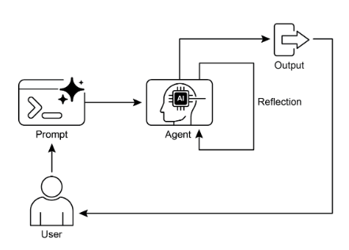
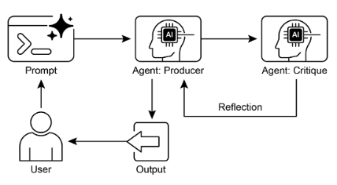

# 第 4 章：反思

## 反思模式概述

在前面的章節中，我們探索了基本的代理模式：用於順序執行的連結、用於動態路徑選擇的路由以及用於並行任務執行的並行化。這些模式使代理能夠更有效、更靈活地執行複雜的任務。然而，即使採用複雜的工作流程，代理的初始輸出或計劃也可能不是最佳的、準確的或完整的。這就是**反思**模式發揮作用的地方。

反思模式涉及代理評估其自身的工作、輸出或內部狀態，並使用該評估來提高其性能或完善其響應。這是一種自我修正或自我改進的形式，允許代理根據回饋、內部批評或與所需標準的比較迭代地完善其輸出或調整其方法。有時可以透過單獨的代理來促進反思，而該代理的具體作用是分析初始代理的輸出。

與輸出直接傳遞到下一步的簡單順序鏈或選擇路徑的路由不同，反思引入了反饋循環。代理不僅產生輸出，而且產生輸出。然後，它檢查該輸出（或產生該輸出的過程），識別潛在問題或需要改進的領域，並使用這些見解來產生更好的版本或修改其未來的操作。

該過程通常涉及：

1. **執行：** 代理執行任務或產生初始輸出。  
2. **評估/批評：** 代理（通常使用另一個 LLM 呼叫或一組規則）分析上一個步驟的結果。此評估可能會檢查事實的準確性、連貫性、風格、完整性、對說明的遵守情況或其他相關標準。  
3. **反思/改進：** 根據批評，代理決定如何改進。這可能涉及產生精確的輸出、調整後續步驟的參數，甚至修改總體計畫。  
4. **迭代（可選但常見）：** 然後可以執行細化的輸出或調整的方法，並且可以重複反思過程，直到獲得滿意的結果或滿足停止條件。

反思模式的一個關鍵且高效的實現將流程分為兩個不同的邏輯角色：生產者和評論家。這通常稱為“生成者-評論家”或“生產者-審查者”模型。雖然單一代理可以執行自我反思，但使用兩個專門的代理（或具有不同系統提示的兩個單獨的 LLM 調用）通常會產生更穩健和公正的結果。

1. 生產者代理：此代理的主要職責是執行任務的初始執行。它完全專注於生成內容，無論是編寫程式碼、起草部落格文章還是創建計劃。它接受初始提示並產生輸出的第一個版本。

2. Critic 代理：此代理的唯一目的是評估 Producer 產生的輸出。它被賦予一組不同的指令，通常是一個獨特的角色（例如，“你是一名高級軟體工程師”，“你是一個一絲不苟的事實核查員”）。 Critic 的指令指導它根據特定標準（例如事實準確性、程式碼品質、風格要求或完整性）分析 Producer 的工作。它旨在發現缺陷、提出改進建議並提供結構化回饋。

這種關注點分離非常強大，因為它可以防止代理在審查自己的工作時出現「認知偏差」。 Critic 代理以全新的視角處理輸出，完全致力於發現錯誤和需要改進的地方。然後，來自 Critic 的回饋被傳遞回 Producer 代理，Producer 代理將其用作產生新的、改進的輸出版本的指南。提供的 LangChain 和 ADK 程式碼範例都實現了這種雙代理模型：LangChain 範例使用特定的 `reflector_prompt` 來創建評論者角色，而 ADK 範例明確定義了生產者和審查者代理。

實現反思通常需要建立代理的工作流程以包含這些回饋循環。這可以透過程式碼中的迭代循環或使用支援狀態管理和基於評估結果的條件轉換的框架來實現。雖然單一評估和細化步驟可以在 LangChain/LangGraph、ADK 或 Crew.AI 鏈中實現，但真正的迭代反思通常涉及更複雜的編排。

反思模式對於建立能夠產生高品質輸出、處理細緻入微的任務並表現出一定程度的自我意識和適應性的代理至關重要。它將代理從簡單地執行指令轉向更複雜的問題解決和內容生成形式。

反思與目標設定和監控（請參閱第 11 章）的交叉點值得注意。目標為智能體的自我評估提供了最終基準，而監控則追蹤其進度。在許多實際情況下，反思可能會充當糾正引擎，使用監控的回饋來分析偏差並調整其策略。這種協同作用將代理從被動的執行者轉變為有目的的系統，可以自適應地實現其目標。

此外，當LLM保留對話的記憶時，反思模式的有效性會顯著增強（參見第 8 章）。這種對話歷史為評估階段提供了重要的背景，使代理不僅可以孤立地評估其輸出，還可以根據先前的互動、使用者回饋和不斷變化的目標來評估其輸出。它使代理能夠從過去的批評中學習並避免重複錯誤。沒有記憶，每一次反思都是一個獨立的事件；有了記憶，反思就變成了一個累積的過程，每個週期都建立在上一個週期的基礎上，從而導致更加智能和上下文感知的改進。

## 實際應用和用例

在輸出品質、準確性或遵守複雜約束至關重要的場景中，反思模式非常有價值：

### 1.創意寫作與內容生成

精煉生成的文本、故事、詩歌或行銷文案。

* **用例：** 代理撰寫部落格文章。  
  * **反思：** 產生草稿，對其流程、語氣和清晰度進行批評，然後根據批評進行重寫。重複直到帖子符合品質標準。  
  * **好處：** 產生更精緻、更有效的內容。

### 2. 程式碼產生與偵錯

編寫程式碼，識別錯誤並修復它們。

* **用例：** 編寫 Python 函數的代理。  
  * **反思：** 編寫初始程式碼，執行測試或靜態分析，識別錯誤或效率低下，然後根據發現修改程式碼。  
  * **好處：** 產生更健壯、功能更強大的程式碼。

### 3. 解決複雜問題

評估多步驟推理任務中的中間步驟或建議的解決方案。

* **用例：** 解決邏輯難題的代理。  
  * **反思：** 提出一個步驟，評估它是否更接近解決方案或引入矛盾，如果需要，回溯或選擇不同的步驟。  
  * **好處：** 提升代理處理複雜問題空間的能力。

### 4. 總結與資訊綜合

精煉摘要以確保準確性、完整性和簡潔性。

* **用例：** 代理總結長文件。  
  * **反思：** 產生初始摘要，將其與原始文件中的關鍵點進行比較，完善摘要以包含缺失的資訊或提高準確性。  
  * **好處：** 建立更準確、更全面的摘要。

### 5. 規劃與策略

評估擬議的計劃並識別潛在的缺陷或改進。

* **用例：** 代理規劃一系列行動以實現目標。  
  * **反思：** 生成計劃，模擬其執行或針對約束評估其可行性，根據評估修改計劃。  
  * **好處：** 制定更有效、更現實的計劃。

### 6. 會話代理

回顧先前的對話，以維持上下文、糾正誤解或提高回應品質。

* **用例：** 客服聊天機器人。  
  * **反思：** 在使用者回覆後，檢視對話歷史與最後一則生成訊息，確保上下文連貫，並準確處理使用者最新的輸入。  
  * **好處：** 讓對話更自然、更有效。

反思為代理系統添加了一層元認知，使它們能夠從自己的輸出和過程中學習，從而產生更聰明、更可靠和高品質的結果。

## 實作程式碼範例 (LangChain)

完整的、迭代的反思過程的實作需要狀態管理和循環執行的機制。雖然這些是在 LangGraph 等基於圖形的框架中本地處理的，或者是透過自訂程式碼處理的，但可以使用 LCEL（LangChain 表達式語言）的組合語法有效地演示單一反思週期的基本原理。

此範例使用 Langchain 函式庫和 OpenAI 的 GPT-4o 模型實作反思循環，以迭代產生和細化計算數位階乘的 Python 函數。這個過程從任務提示開始，產生初始程式碼，然後根據模擬的高級軟體工程師角色的批評反覆反思程式碼，在每次迭代中完善程式碼，直到批評階段確定程式碼完美或達到最大迭代次數。最後，它會列印生成的精煉程式碼。

首先，請確保您安裝了必要的庫：

```bash
pip install langchain langchain-community langchain-openai
```

您還需要使用您選擇的語言模型（例如 OpenAI、Google Gemini、Anthropic）的 API 金鑰來設定您的環境。

```python
import os
from dotenv import load_dotenv
from langchain_openai import ChatOpenAI
from langchain_core.prompts import ChatPromptTemplate
from langchain_core.messages import SystemMessage, HumanMessage


# --- Configuration ---
# Load environment variables from .env file (for OPENAI_API_KEY)
load_dotenv()

# Check if the API key is set
if not os.getenv("OPENAI_API_KEY"):
    raise ValueError("OPENAI_API_KEY not found in .env file. Please add it.")

# Initialize the Chat LLM. We use gpt-4o for better reasoning.
# A lower temperature is used for more deterministic outputs.
llm = ChatOpenAI(model="gpt-4o", temperature=0.1)


def run_reflection_loop():
    """
    Demonstrates a multi-step AI reflection loop to progressively improve a Python function.
    """
    # --- The Core Task ---
    task_prompt = """
    Your task is to create a Python function named `calculate_factorial`.
    This function should do the following:
    1.  Accept a single integer `n` as input.
    2.  Calculate its factorial (n!).
    3.  Include a clear docstring explaining what the function does.
    4.  Handle edge cases: The factorial of 0 is 1.
    5.  Handle invalid input: Raise a ValueError if the input is a negative number.
    """

    # --- The Reflection Loop ---
    max_iterations = 3
    current_code = ""

    # We will build a conversation history to provide context in each step.
    message_history = [HumanMessage(content=task_prompt)]

    for i in range(max_iterations):
        print("\n" + "=" * 25 + f" REFLECTION LOOP: ITERATION {i + 1} " + "=" * 25)

        # --- 1. GENERATE / REFINE STAGE ---
        # In the first iteration, it generates. In subsequent iterations, it refines.
        if i == 0:
            print("\n>>> STAGE 1: GENERATING initial code...")
            # The first message is just the task prompt.
            response = llm.invoke(message_history)
            current_code = response.content
        else:
            print("\n>>> STAGE 1: REFINING code based on previous critique...")
            # The message history now contains the task,
            # the last code, and the last critique.
            # We instruct the model to apply the critiques.
            message_history.append(HumanMessage(content="Please refine the code using the critiques provided."))
            response = llm.invoke(message_history)
            current_code = response.content

        print("\n--- Generated Code (v" + str(i + 1) + ") ---\n" + current_code)
        message_history.append(response)  # Add the generated code to history

        # --- 2. REFLECT STAGE ---
        print("\n>>> STAGE 2: REFLECTING on the generated code...")
        # Create a specific prompt for the reflector agent.
        # This asks the model to act as a senior code reviewer.
        reflector_prompt = [
            SystemMessage(content="""
                You are a senior software engineer and an expert
                in Python.
                Your role is to perform a meticulous code review.
                Critically evaluate the provided Python code based
                on the original task requirements.
                Look for bugs, style issues, missing edge cases,
                and areas for improvement.
                If the code is perfect and meets all requirements,
                respond with the single phrase 'CODE_IS_PERFECT'.
                Otherwise, provide a bulleted list of your critiques.
            """),
            HumanMessage(content=f"Original Task:\n{task_prompt}\n\nCode to Review:\n{current_code}"),
        ]

        critique_response = llm.invoke(reflector_prompt)
        critique = critique_response.content

        # --- 3. STOPPING CONDITION ---
        if "CODE_IS_PERFECT" in critique:
            print("\n--- Critique ---\nNo further critiques found. The code is satisfactory.")
            break

        print("\n--- Critique ---\n" + critique)
        # Add the critique to the history for the next refinement loop.
        message_history.append(HumanMessage(content=f"Critique of the previous code:\n{critique}"))

    print("\n" + "=" * 30 + " FINAL RESULT " + "=" * 30)
    print("\nFinal refined code after the reflection process:\n")
    print(current_code)


if __name__ == "__main__":
    run_reflection_loop()
```

程式碼首先設定環境、載入 API 金鑰，並初始化強大的語言模型（如 GPT-4o），以低溫實現集中輸出。核心任務是透過提示要求 Python 函數計算數字的階乘來定義的，包括文件字串、邊緣情況（階乘為 0）和負輸入的錯誤處理的特定要求。 `run_reflection_loop` 函數協調迭代細化過程。在循環內，在第一次迭代中，語言模型會根據任務提示產生初始程式碼。在隨後的迭代中，它根據上一步的批評來完善程式碼。一個單獨的「反思器」角色，也由語言模型扮演，但具有不同的系統提示，充當高級軟體工程師，根據原始任務要求批判生成的程式碼。此批評以問題項目符號清單的形式提供，如果未發現問題，則以短語 `CODE_IS_PERFECT` 的形式提供。循環繼續，直到批評表明程式碼是完美的或達到最大迭代次數。在每個步驟中，對話歷史記錄都會被維護並傳遞到語言模型，以便為生成/細化和反思階段提供上下文。最後，腳本在循環結束後列印最後產生的程式碼版本。

## 實作程式碼範例 (ADK)

現在讓我們來看看使用 Google ADK 實作的概念程式碼範例。  具體來說，程式碼透過採用生成器-評論家結構來展示這一點，其中一個元件（生成器）生成初始結果或計劃，另一個元件（評論家）提供關鍵回饋或批評，引導生成器獲得更完善或更準確的最終輸出。

```python
from google.adk.agents import SequentialAgent, LlmAgent


# The first agent generates the initial draft.
generator = LlmAgent(
    name="DraftWriter",
    description="Generates initial draft content on a given subject.",
    instruction="Write a short, informative paragraph about the user's subject.",
    output_key="draft_text",  # The output is saved to this state key.
)

# The second agent critiques the draft from the first agent.
reviewer = LlmAgent(
    name="FactChecker",
    description="Reviews a given text for factual accuracy and provides a structured critique.",
    instruction="""
    You are a meticulous fact-checker.
    1. Read the text provided in the state key 'draft_text'.
    2. Carefully verify the factual accuracy of all claims.
    3. Your final output must be a dictionary containing two keys:
       - "status": A string, either "ACCURATE" or "INACCURATE".
       - "reasoning": A string providing a clear explanation for your status, citing specific issues if any are found.
    """,
    output_key="review_output",  # The structured dictionary is saved here.
)

# The SequentialAgent ensures the generator runs before the reviewer.
review_pipeline = SequentialAgent(
    name="WriteAndReview_Pipeline",
    sub_agents=[generator, reviewer],
)

# Execution Flow:
# 1. generator runs -> saves its paragraph to state['draft_text'].
# 2. reviewer runs -> reads state['draft_text'] and saves its dictionary output to state['review_output'].
```

此程式碼示範如何使用 Google ADK 中的順序代理管道來產生和審查文字。它定義了兩個 LlmAgent 實例：生成器和審核器。生成器代理旨在建立有關給定主題的初始草稿段落。它被指示編寫一個簡短且資訊豐富的片段，並將其輸出保存到狀態鍵 `draft_text` 中。審閱者代理充當生成器產生的文本的事實檢查者。它被指示讀取 `draft_text` 中的文字並驗證其事實準確性。審閱者的輸出是一個結構化字典，有兩個鍵：狀態和推理。狀態指示文本是“準確”還是“不準確”，而推理則提供狀態的解釋。此字典儲存到狀態鍵`review_output`。建立一個名為 `review_pipeline` 的 SequentialAgent 來管理兩個代理的執行順序。它確保生成器首先運行，然後是審查器。整體執行流程是生成器生成文本，然後將其儲存到狀態。隨後，審閱者從狀態讀取此文本，執行事實檢查，並將其發現（狀態和推理）保存回狀態。此管道允許使用單獨的代理進行內容創建和審核的結構化過程。

**注意：** 有興趣的人也可以使用 ADK 的 LoopAgent 的替代實作。

在得出結論之前，重要的是要考慮到，雖然反思模式顯著提高了輸出品質，但它也帶來了重要的權衡。迭代過程雖然功能強大，但可能會導致更高的成本和延遲，因為每個細化循環可能需要新的 LLM 調用，這使得它對時間敏感的應用程式來說不是最佳選擇。此外，該模式是記憶體密集型的；隨著每次迭代，對話歷史都會擴展，包括最初的輸出、批評和後續的改進。

## 概覽

**內容：** 代理的初始輸出通常不是最佳的，存在不準確、不完整或無法滿足複雜要求的問題。基本代理工作流程缺乏代理识别和修复自身错误的内置流程。這是透過讓智能體評估自己的工作來解決的，或者更可靠的是，透過引入一個單獨的邏輯智能體來充當批評者，防止最初的回應成為最終的回應，無論品質如何。

**為什麼：** 反思模式透過引入自我修正和細化機制提供了解決方案。它建立了一個反饋循環，其中“生產者”代理生成輸出，然後“批評者”代理（或生產者本身）根據預先定義的標準對其進行評估。然後使用該批評來產生改進版本。這種生成、評估和完善的迭代過程逐步提高了最終結果的品質，從而產生更準確、連貫和可靠的結果。

**經驗法則：** 當最終輸出的品質、準確性和細節比速度和成本更重要時，請使用反思模式。它對於生成精美的長格式內容、編寫和調試程式碼以及創建詳細計劃等任務特別有效。當任務需要高度客觀性或專門評估而通才生產者代理可能會錯過時，請僱用單獨的批評家代理。

**視覺總結：**



圖1：反思設計模式，自我反思



圖2：反思設計模式、生產者與批評代理

## 要點

* 反思模式的主要優點是它能夠迭代地自我修正和完善輸出，從而顯著提高品質、準確性並遵守複雜的指令。  
* 它涉及執行、評估/批評和完善的回饋循環。反思對於需要高品質、準確或細緻的輸出的任務至關重要。  
* 一個強大的實現是 Producer-Critic 模型，其中單獨的代理（或提示角色）評估初始輸出。這種關注點分離增強了客觀性，並允許更專業、結構化的回饋。  
* 然而，這些好處的代價是增加延遲和計算費用，以及超出模型上下文視窗或被 API 服務限制的更高風險。  
* 雖然完整的迭代反思通常需要有狀態的工作流程（如 LangGraph），但可以使用 LCEL 在 LangChain 中實現單一反思步驟，以傳遞輸出以供批評和後續細化。  
* Google ADK 可以透過順序工作流程促進反思，其中一個代理的輸出受到另一個代理的批評，從而允許後續的細化步驟。  
* 此模式使代理能夠進行自我修正並隨著時間的推移提高其效能。

## 結論

反思模式為代理工作流程中的自我修正提供了重要的機制，從而實現了單遍執行之外的迭代改進。這是透過創建一個循環來實現的，系統在該循環中產生輸出，根據特定標準對其進行評估，然後使用該評估來產生精確的結果。這種評估可以由代理本身（自我反思）執行，或者通常更有效地由不同的批評代理執行，這代表了模式中的關鍵架構選擇。

雖然完全自主的多步驟反思過程需要強大的狀態管理架構，但其核心原則在單一生成-批評-細化週期中得到了有效證明。作為一種控制結構，反思可以與其他基礎模式集成，以建立更強大、功能更複雜的代理系統。

## 參考

以下是一些用於進一步閱讀反思模式和相關概念的資源：

1. 透過強化學習訓練語言模式進行自我修正，[https://arxiv.org/abs/2409.12917](https://arxiv.org/abs/2409.12917)
2. LangChain表達式語言（LCEL）文件：[https://python.langchain.com/docs/introduction/](https://python.langchain.com/docs/introduction/)
3. LangGraph文件：[https://www.langchain.com/langgraph](https://www.langchain.com/langgraph)
4. Google 代理 開發工具包 (ADK) 文件（多代理系統）：[https://google.github.io/adk-docs/代理/multi-代理/](https://google.github.io/adk-docs/代理/multi-代理/)
