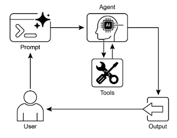

# 第5章：工具調用(函式呼叫)

## 工具使用模式概述

到目前為止，我們已經討論了代理模式，主要涉及編排語言模型之間的交互以及管理代理內部工作流程（連結、路由、並行化、反思）內的資訊流。然而，為了使代理真正有用並與現實世界或外部系統交互，他們需要能夠使用工具。

工具使用模式通常透過稱為函數呼叫的機制實現，使代理能夠與外部 API、資料庫、服務甚至執行程式碼進行互動。它允許代理核心的LLM根據使用者的請求或任務的當前狀態來決定何時以及如何使用特定的外部函數。

該過程通常涉及：

1. **工具定義：** 向LLM定義和描述外部功能或能力。此描述包括函數的用途、名稱、接受的參數及其類型和描述。  
2. **LLM 決策：** LLM 收到使用者的請求和可用的工具定義。根據對請求和工具的理解，LLM決定是否需要調用一個或多個工具來滿足請求。  
3. **函數呼叫產生：** 如果LLM決定使用某個工具，它會產生一個結構化輸出（通常是一個JSON物件），該輸出指定要呼叫的工具的名稱以及要傳遞給它的參數（參數），這些參數是從使用者的請求中提取的。  
4. **工具執行：** 代理框架或編排層攔截此結構化輸出。它識別所請求的工具並使用提供的參數執行實際的外部函數。  
5. **觀察/結果：** 工具執行的輸出或結果回傳給代理。  
6. **LLM 處理（可選但常見）：** LLM 接收工具的輸出作為上下文，並使用它來製定對使用者的最終回應或決定工作流程中的下一步（這可能涉及呼叫另一個工具、反映或提供最終答案）。

這種模式很重要，因為它打破了 LLM 訓練資料的限制，並允許其存取最新資訊、執行內部無法執行的計算、與使用者特定的資料互動或觸發現實世界的操作。函數呼叫是一種技術機制，它彌合了LLM的推理能力和大量可用的外部功能之間的差距。

雖然「函數呼叫」恰當地描述了呼叫特定的、預先定義的程式碼函數，但考慮「工具呼叫」的更廣泛的概念是有用的。這個更廣泛的術語承認代理的能力可以遠遠超出簡單的功能執行。 「工具」可以是傳統功能，但也可以是複雜的 API 端點、對資料庫的請求，甚至是針對另一個專門代理的指令。這種視角使我們能夠設想更複雜的系統，例如，主要代理可以將複雜的資料分析任務委託給專用的「分析代理」或透過其 API 查詢外部知識庫。從「工具調用」角度思考，可以更好地捕捉代理在數位資源和其他智慧實體的多樣化生態系統中充當協調者的全部潛力。

LangChain、LangGraph 和 Google 代理 Developer Kit (ADK) 等框架為定義工具並將其整合到代理工作流程中提供了強大的支持，通常利用現代LLM（如 Gemini 或 OpenAI 系列中的那些）的本機函數呼叫功能。在這些框架的「畫布」上，您定義工具，然後配置代理（通常是 LLM 代理）以了解並能夠使用這些工具。

工具使用是建立強大的、互動的、外部感知代理的基石模式。

## 實際應用和用例

工具使用模式幾乎適用於代理需要超越生成文字來執行操作或檢索特定動態資訊的任何場景：

### 1. 從外部來源檢索訊息

存取LLM培訓數據中不存在的即時數據或資訊。

* **用例：** 天氣代理。  
  * **工具：** 取得位置並傳回目前天氣狀況的天氣 API。  
  * **代理流程：** 用戶詢問“倫敦的天氣怎麼樣？”，LLM 確定對天氣工具的需求，用“倫敦”調用該工具，工具返回數據，LLM 將數據格式化為用戶友好的響應。

### 2. 與資料庫和 API 交互

對結構化資料執行查詢、更新或其他操作。

* **用例：** 電子商務代理。  
  * **工具：** API 呼叫來檢查產品庫存、取得訂單狀態或處理付款。  
  * **代理流程：** 使用者詢問“產品 X 有庫存嗎？”，LLM 呼叫庫存 API，工具返回庫存計數，LLM 告訴使用者庫存狀態。

### 3. 執行計算與資料分析

使用外部計算器、資料分析庫或統計工具。

* **用例：** 財務代理。  
  * **工具：** 計算機功能、股市資料API、電子表格工具。  
  * **代理流程：** 用戶詢問“AAPL 的當前價格是多少，併計算如果我以 150 美元購買 100 股的潛在利潤？”，LLM 調用股票 API，獲取當前價格，然後調用計算器工具，獲取結果，格式化響應。

### 4. 發送通訊

發送電子郵件、訊息或對外部通訊服務進行 API 呼叫。

* **用例：** 私人助理代理。  
  * **工具：** 電子郵件發送 API。  
  * **代理流程：** 使用者說，“向 John 發送一封有關明天會議的電子郵件。”，LLM 調用電子郵件工具，並從請求中提取收件人、主題和正文。

### 5. 執行程式碼

在安全環境中執行程式碼片段以執行特定任務。

* **用例：** 程式設計助理代理。  
  * **工具：** 程式碼解釋器。  
  * **代理流程：** 使用者提供Python程式碼片段並詢問“這段程式碼的作用是什麼？”，LLM使用解釋器工具運行程式碼並分析其輸出。

### 6. 控制其他系統或設備

與智慧家庭設備、物聯網平台或其他連接系統互動。

* **用例：** 智慧家庭代理。  
  * **工具：** 用於控制智慧燈的 API。  
  * ** 代理流程：** 使用者說：「關掉客廳的燈。」LLM 使用指令和目標裝置呼叫智慧家庭工具。

工具使用是將語言模型從文本生成器轉變為能夠在數位或物理世界中感知、推理和行動的代理（見圖 1\）


圖 1：代理 使用工具的一些範例

## 實作程式碼範例 (LangChain)

LangChain框架內工具使用的實作分為兩個階段。最初，通常透過封裝現有的 Python 函數或其他可運行元件來定義一個或多個工具。隨後，這些工具被綁定到語言模型，從而當模型確定需要外部函數呼叫來滿足使用者的查詢時，授予模型產生結構化工具使用請求的能力。

The following implementation will demonstrate this principle by first defining a simple function to simulate an information retrieval tool. Following this, an 代理 will be constructed and configured to leverage this tool in response to user input. The execution of this example requires the installation of the core LangChain libraries and a model-specific provider package. Furthermore, proper authentication with the selected language model service, typically via an API key configured in the local environment, is a necessary prerequisite.

```python
import os
import getpass
import asyncio
import nest_asyncio
from typing import List
from dotenv import load_dotenv
import logging

from langchain_google_genai import ChatGoogleGenerativeAI
from langchain_core.prompts import ChatPromptTemplate
from langchain_core.tools import tool as langchain_tool
from langchain.agents import create_tool_calling_agent, AgentExecutor


# UNCOMMENT
# Prompt the user securely and set API keys as environment variables
os.environ["GOOGLE_API_KEY"] = getpass.getpass("Enter your Google API key: ")
os.environ["OPENAI_API_KEY"] = getpass.getpass("Enter your OpenAI API key: ")

try:
    # A model with function/tool calling capabilities is required.
    llm = ChatGoogleGenerativeAI(model="gemini-2.0-flash", temperature=0)
    print(f"✅ Language model initialized: {llm.model}")
except Exception as e:
    print(f"🛑 Error initializing language model: {e}")
    llm = None


# --- Define a Tool ---
@langchain_tool
def search_information(query: str) -> str:
    """
    Provides factual information on a given topic. Use this tool to find answers to phrases
    like 'capital of France' or 'weather in London?'.
    """
    print(f"\n--- 🛠️ Tool Called: search_information with query: '{query}' ---")

    # Simulate a search tool with a dictionary of predefined results.
    simulated_results = {
        "weather in london": "The weather in London is currently cloudy with a temperature of 15°C.",
        "capital of france": "The capital of France is Paris.",
        "population of earth": "The estimated population of Earth is around 8 billion people.",
        "tallest mountain": "Mount Everest is the tallest mountain above sea level.",
        "default": f"Simulated search result for '{query}': No specific information found, but the topic seems interesting.",
    }
    result = simulated_results.get(query.lower(), simulated_results["default"])
    print(f"--- TOOL RESULT: {result} ---")
    return result


tools = [search_information]


# --- Create a Tool-Calling Agent ---
if llm:
    # This prompt template requires an `agent_scratchpad` placeholder for the agent's internal steps.
    agent_prompt = ChatPromptTemplate.from_messages([
        ("system", "You are a helpful assistant."),
        ("human", "{input}"),
        ("placeholder", "{agent_scratchpad}"),
    ])

    # Create the agent, binding the LLM, tools, and prompt together.
    agent = create_tool_calling_agent(llm, tools, agent_prompt)

    # AgentExecutor is the runtime that invokes the agent and executes the chosen tools.
    # The 'tools' argument is not needed here as they are already bound to the agent.
    agent_executor = AgentExecutor(agent=agent, verbose=True, tools=tools)


async def run_agent_with_tool(query: str):
    """Invokes the agent executor with a query and prints the final response."""
    print(f"\n--- 🏃 Running Agent with Query: '{query}' ---")
    try:
        response = await agent_executor.ainvoke({"input": query})
        print("\n--- ✅ Final Agent Response ---")
        print(response["output"])
    except Exception as e:
        print(f"\n🛑 An error occurred during agent execution: {e}")


async def main():
    """Runs all agent queries concurrently."""
    tasks = [
        run_agent_with_tool("What is the capital of France?"),
        run_agent_with_tool("What's the weather like in London?"),
        run_agent_with_tool("Tell me something about dogs."),  # Should trigger the default tool response
    ]
    await asyncio.gather(*tasks)


nest_asyncio.apply()
asyncio.run(main())

```

程式碼使用 LangChain 函式庫和 Google Gemini 模型設定工具呼叫代理。它定義了一個 `search_information` 工具，用於模擬為特定查詢提供事實答案。該工具預先定義了「倫敦天氣」、「法國首都」和「地球人口」的回應，以及其他查詢的預設回應。 ChatGoogleGenerativeAI 模型已初始化，確保其具有工具呼叫功能。建立 ChatPromptTemplate 是為了指導代理的互動。 `create_tool_calling_agent` 函數用於將語言模型、工具和提示組合到代理中。然後設定 AgentExecutor 來管理代理的執行和工具呼叫。 `run_agent_with_tool` 非同步函數定義為使用給定查詢呼叫代理並列印結果。主要的非同步函數準備多個並發運行的查詢。這些查詢旨在測試 `search_information` 工具的特定回應和預設回應。最後，asyncio.run(main()) 呼叫執行所有代理任務。程式碼包括在繼續代理設定和執行之前檢查 LLM 初始化是否成功。

# 實踐程式碼範例 (CrewAI)

此程式碼提供如何在 CrewAI 框架內實作函數呼叫（工具）的實際範例。它設置了一個簡單的場景，其中代理配備了查找資訊的工具。此範例具體示範如何使用此代理和工具來取得模擬股票價格。

```python
# pip install crewai langchain-openai

import os
from crewai import Agent, Task, Crew
from crewai.tools import tool
import logging


# --- Best Practice: Configure Logging ---
# A basic logging setup helps in debugging and tracking the crew's execution.
logging.basicConfig(level=logging.INFO, format='%(asctime)s - %(levelname)s - %(message)s')


# --- Set up your API Key ---
# For production, it's recommended to use a more secure method for key management
# like environment variables loaded at runtime or a secret manager.
#
# Set the environment variable for your chosen LLM provider (e.g., OPENAI_API_KEY)
# os.environ["OPENAI_API_KEY"] = "YOUR_API_KEY"
# os.environ["OPENAI_MODEL_NAME"] = "gpt-4o"


# --- 1. Refactored Tool: Returns Clean Data ---
# The tool now returns raw data (a float) or raises a standard Python error.
# This makes it more reusable and forces the agent to handle outcomes properly.
@tool("Stock Price Lookup Tool")
def get_stock_price(ticker: str) -> float:
    """
    Fetches the latest simulated stock price for a given stock ticker symbol.
    Returns the price as a float. Raises a ValueError if the ticker is not found.
    """
    logging.info(f"Tool Call: get_stock_price for ticker '{ticker}'")
    simulated_prices = {
        "AAPL": 178.15,
        "GOOGL": 1750.30,
        "MSFT": 425.50,
    }
    price = simulated_prices.get(ticker.upper())
    if price is not None:
        return price
    else:
        # Raising a specific error is better than returning a string.
        # The agent is equipped to handle exceptions and can decide on the next action.
        raise ValueError(f"Simulated price for ticker '{ticker.upper()}' not found.")


# --- 2. Define the Agent ---
# The agent definition remains the same, but it will now leverage the improved tool.
financial_analyst_agent = Agent(
    role='Senior Financial Analyst',
    goal='Analyze stock data using provided tools and report key prices.',
    backstory="You are an experienced financial analyst adept at using data sources to find stock information. You provide clear, direct answers.",
    verbose=True,
    tools=[get_stock_price],
    # Allowing delegation can be useful, but is not necessary for this simple task.
    allow_delegation=False,
)


# --- 3. Refined Task: Clearer Instructions and Error Handling ---
# The task description is more specific and guides the agent on how to react
# to both successful data retrieval and potential errors.
analyze_aapl_task = Task(
    description=(
        "What is the current simulated stock price for Apple (ticker: AAPL)? "
        "Use the 'Stock Price Lookup Tool' to find it. "
        "If the ticker is not found, you must report that you were unable to retrieve the price."
    ),
    expected_output=(
        "A single, clear sentence stating the simulated stock price for AAPL. "
        "For example: 'The simulated stock price for AAPL is $178.15.' "
        "If the price cannot be found, state that clearly."
    ),
    agent=financial_analyst_agent,
)


# --- 4. Formulate the Crew ---
# The crew orchestrates how the agent and task work together.
financial_crew = Crew(
    agents=[financial_analyst_agent],
    tasks=[analyze_aapl_task],
    verbose=True  # Set to False for less detailed logs in production
)


# --- 5. Run the Crew within a Main Execution Block ---
# Using a __name__ == "__main__": block is a standard Python best practice.
def main():
    """Main function to run the crew."""
    # Check for API key before starting to avoid runtime errors.
    if not os.environ.get("OPENAI_API_KEY"):
        print("ERROR: The OPENAI_API_KEY environment variable is not set.")
        print("Please set it before running the script.")
        return

    print("\n## Starting the Financial Crew...")
    print("---------------------------------")

    # The kickoff method starts the execution.
    result = financial_crew.kickoff()

    print("\n---------------------------------")
    print("## Crew execution finished.")
    print("\nFinal Result:\n", result)


if __name__ == "__main__":
    main()
```

此程式碼示範了一個使用 Crew.ai 函式庫來模擬財務分析任務的簡單應用程式。它定義了一個自訂工具 `get_stock_price`，用於模擬尋找預定義股票價格的股票價格。該工具旨在為有效的程式碼傳回浮點數，或為無效的程式碼引發 ValueError。創建了一個名為 `financial_analyst_agent` 的 Crew.ai 代理，其角色是高級財務分析師。該代理被給予 `get_stock_price` 工具來與之互動。定義了一個任務 `analyze_aapl_task`，專門指示代理使用該工具來尋找 AAPL 的模擬股票價格。任務描述包括有關如何在使用該工具時處理成功和失敗案例的明確說明。一個 Crew 已組裝完畢，由 `financial_analyst_agent` 和 `analyze_aapl_task` 組成。為代理和工作人員啟用詳細設置，以便在執行期間提供詳細的日誌記錄。腳本的主要部分使用標準 `if __name__ \== "__main__":` 區塊中的 kickoff() 方法來執行工作人員的任務。在啟動船員之前，它會檢查是否設定了 `OPENAI_API_KEY` 環境變量，這是代理運行所必需的。船員執行的結果，即任務的輸出，然後被印到控制台。該程式碼還包括基本的日誌記錄配置，以便更好地追蹤工作人員的操作和工具呼叫。它使用環境變數進行 API 金鑰管理，但它指出建議在生產環境中使用更安全的方法。簡而言之，核心邏輯展示瞭如何定義工具、代理和任務以在 Crew.ai 中創建協作工作流程。

## 實踐程式碼（Google ADK）

Google 代理 開發工具包 (ADK) 包含一個本機整合工具庫，可直接合併到代理的功能中。

**Google 搜尋：** 此類元件的主要範例是 Google 搜尋工具。該工具充當 Google 搜尋引擎的直接接口，為代理配備執行網路搜尋和檢索外部資訊的功能。

```python
from google.adk.agents import Agent as ADKAgent
from google.adk.runners import Runner
from google.adk.sessions import InMemorySessionService
from google.adk.tools import google_search
from google.genai import types
import nest_asyncio
import asyncio


# Define variables required for Session setup and Agent execution
APP_NAME = "Google Search Agent"
USER_ID = "user1234"
SESSION_ID = "1234"


# Define Agent with access to search tool
root_agent = ADKAgent(
    name="basic_search_agent",
    model="gemini-2.0-flash-exp",
    description="Agent to answer questions using Google Search.",
    instruction="I can answer your questions by searching the internet. Just ask me anything!",
    tools=[google_search],  # Google Search is a pre-built tool to perform Google searches.
)


# Agent Interaction
async def call_agent(query: str):
    """
    Helper function to call the agent with a query.
    """
    # Session and Runner
    session_service = InMemorySessionService()
    await session_service.create_session(
        app_name=APP_NAME,
        user_id=USER_ID,
        session_id=SESSION_ID,
    )

    runner = Runner(agent=root_agent, app_name=APP_NAME, session_service=session_service)

    content = types.Content(role='user', parts=[types.Part(text=query)])
    events = runner.run(user_id=USER_ID, session_id=SESSION_ID, new_message=content)

    for event in events:
        if event.is_final_response() and event.content:
            # Safely extract text from the final response
            if hasattr(event.content, "text") and event.content.text:
                final_response = event.content.text
            elif event.content.parts:
                final_response = "".join(
                    part.text for part in event.content.parts if getattr(part, "text", None)
                )
            else:
                final_response = ""
            print("Agent Response:", final_response)


nest_asyncio.apply()
asyncio.run(call_agent("what's the latest ai news?"))
```

此程式碼示範如何建立和使用由 Google ADK for Python 提供支援的基本代理。該代理旨在利用 Google 搜尋作為工具來回答問題。首先，匯入來自 IPython、google.adk 和 google.genai 的必要庫。定義了應用程式名稱、使用者 ID 和會話 ID 的常數。建立名為 `basic_search_agent` 的代理實例，並附有指示其用途的描述和說明。它配置為使用 Google 搜尋工具，這是 ADK 提供的預先建置工具。 InMemorySessionService（請參閱第 8 章）被初始化來管理代理的會話。為指定的應用程式、使用者和會話 ID 建立新會話。 Runner 被實例化，將建立的代理與會話服務連結起來。此運行程序負責在會話中執行代理的互動。定義輔助函數 `call_agent` 是為了簡化向代理傳送查詢和處理回應的過程。在 `call_agent` 內部，使用者的查詢被格式化為具有「user」角色的 types.Content 物件。使用使用者 ID、會話 ID 和新訊息內容來呼叫 runner.run 方法。 runner.run 方法傳回表示代理的操作和回應的事件清單。程式碼循環存取這些事件以找到最終回應。如果事件被識別為最終回應，則提取該回應的文字內容。然後，提取的代理回應將列印到控制台。最後，呼叫 `call_agent` 函數並查詢「最新的人工智慧新聞是什麼？」演示代理的實際操作。

**程式碼執行：** Google ADK 具有用於專門任務的整合元件，包括動態程式碼執行環境。 `built_in_code_execution` 工具為代理提供了沙盒 Python 解釋器。這允許模型編寫和運行程式碼來執行計算任務、操作資料結構和執行程式腳本。這種功能對於解決需要確定性邏輯和精確計算的問題至關重要，這些問題超出了機率語言生成的範圍。

```python
import os
import getpass
import asyncio
import nest_asyncio
from typing import List
from dotenv import load_dotenv
import logging

from google.adk.agents import Agent as ADKAgent, LlmAgent
from google.adk.runners import Runner
from google.adk.sessions import InMemorySessionService
from google.adk.tools import google_search
from google.adk.code_executors import BuiltInCodeExecutor
from google.genai import types


# Define variables required for Session setup and Agent execution
APP_NAME = "calculator"
USER_ID = "user1234"
SESSION_ID = "session_code_exec_async"


# Agent Definition
code_agent = LlmAgent(
    name="calculator_agent",
    model="gemini-2.0-flash",
    code_executor=BuiltInCodeExecutor(),
    instruction="""You are a calculator agent.
    When given a mathematical expression, write and execute Python code to calculate the result.
    Return only the final numerical result as plain text, without markdown or code blocks.
    """,
    description="Executes Python code to perform calculations.",
)


# Agent Interaction (Async)
async def call_agent_async(query: str):
    # Session and Runner
    session_service = InMemorySessionService()
    await session_service.create_session(app_name=APP_NAME, user_id=USER_ID, session_id=SESSION_ID)

    runner = Runner(agent=code_agent, app_name=APP_NAME, session_service=session_service)

    content = types.Content(role='user', parts=[types.Part(text=query)])
    print(f"\n--- Running Query: {query} ---")

    try:
        # Use run_async
        async for event in runner.run_async(user_id=USER_ID, session_id=SESSION_ID, new_message=content):
            print(f"Event ID: {event.id}, Author: {event.author}")

            if event.content and event.content.parts and event.is_final_response():
                for part in event.content.parts:  # Iterate through all parts
                    if getattr(part, "executable_code", None):
                        # Access the actual code string via .code
                        print(f"  Debug: Agent generated code:\n```python\n{part.executable_code.code}\n```")
                    elif getattr(part, "code_execution_result", None):
                        # Access outcome and output correctly
                        print(
                            "  Debug: Code Execution Result: "
                            f"{part.code_execution_result.outcome} - Output:\n{part.code_execution_result.output}"
                        )
                    elif getattr(part, "text", None) and not part.text.isspace():
                        # Also print any text parts found in any event for debugging
                        print(f"  Text: '{part.text.strip()}'")

                # --- Check for final response AFTER specific parts ---
                text_parts = [part.text for part in event.content.parts if getattr(part, "text", None)]
                final_result = "".join(text_parts)
                print(f"==> Final Agent Response: {final_result}")

    except Exception as e:
        print(f"ERROR during agent run: {e}")

    print("-" * 30)


# Main async function to run the examples
async def main():
    await call_agent_async("Calculate the value of (5 + 7) * 3")
    await call_agent_async("What is 10 factorial?")


# Execute the main async function
try:
    nest_asyncio.apply()
    asyncio.run(main())
except RuntimeError as e:
    # Handle specific error when running asyncio.run in an already running loop (like Jupyter/Colab)
    if "cannot be called from a running event loop" in str(e):
        print("\nRunning in an existing event loop (like Colab/Jupyter).")
        print("Please run `await main()` in a notebook cell instead.")
        # If in an interactive environment like a notebook, you might need to run:
        # await main()
    else:
        raise e  # Re-raise other runtime errors
```

該腳本使用 Google 的代理開發工具包 (ADK) 建立一個代理，透過編寫和執行 Python 程式碼來解決數學問題。它定義了一個專門指示充當計算器的 LlmAgent，並為其配備了 `built_in_code_execution` 工具。主要邏輯位於 `call_agent_async` 函數中，該函數將使用者的查詢傳送至代理的執行程式並處理結果事件。在這個函數內部，非同步循環遍歷事件，列印產生的 Python 程式碼及其執行結果以進行偵錯。該程式碼仔細地區分這些中間步驟和包含數字答案的最終事件。最後，主函數使用兩個不同的數學表達式來運行代理，以展示其執行計算的能力。

**企業搜尋：** 此程式碼使用 Python 中的 google.adk 程式庫定義 Google ADK 應用程式。它特別使用 VSearchAgent，該代理旨在透過搜尋指定的 Vertex AI Search 資料儲存來回答問題。程式碼初始化一個名為 `q2_strategy_vsearch_agent` 的 VSearchAgent，提供描述、要使用的模型 (“gemini-2.0-flash-exp”) 以及 Vertex AI Search 資料儲存的 ID。 `DATASTORE_ID` 應設定為環境變數。然後，它為代理設定一個 Runner，使用 InMemorySessionService 來管理對話歷史記錄。定義非同步函數 `call_vsearch_agent_async` 來與代理互動。此函數接受查詢，建構訊息內容對象，並呼叫執行程式的 `run_async` 方法將查詢傳送給代理。然後，函數在代理的回應到達時將其串流回控制台。它還列印有關最終回應的信息，包括資料儲存中的任何來源屬性。錯誤處理包含在代理執行期間捕獲異常，提供有關潛在問題（例如不正確的資料儲存 ID 或缺少權限）的資訊性訊息。提供了另一個非同步函數 `run_vsearch_example` 來示範如何使用範例查詢呼叫代理。主執行區塊檢查 `DATASTORE_ID` 是否已設置，然後使用 asyncio.run 運行範例。它包括一項檢查，以處理程式碼在已執行事件循環的環境（如 Jupyter 筆記本）中運行的情況。

```python
import asyncio
import os

from google.genai import types
from google.adk import agents
from google.adk.runners import Runner
from google.adk.sessions import InMemorySessionService


# --- Configuration ---
# Ensure you have set your GOOGLE_API_KEY and DATASTORE_ID environment variables
# For example:
# os.environ["GOOGLE_API_KEY"] = "YOUR_API_KEY"
# os.environ["DATASTORE_ID"] = "YOUR_DATASTORE_ID"
DATASTORE_ID = os.environ.get("DATASTORE_ID")


# --- Application Constants ---
APP_NAME = "vsearch_app"
USER_ID = "user_123"  # Example User ID
SESSION_ID = "session_456"  # Example Session ID


# --- Agent Definition (Updated with the newer model from the guide) ---
vsearch_agent = agents.VSearchAgent(
    name="q2_strategy_vsearch_agent",
    description="Answers questions about Q2 strategy documents using Vertex AI Search.",
    model="gemini-2.0-flash-exp",  # Updated model based on the guide's examples
    datastore_id=DATASTORE_ID,
    model_parameters={"temperature": 0.0},
)


# --- Runner and Session Initialization ---
runner = Runner(
    agent=vsearch_agent,
    app_name=APP_NAME,
    session_service=InMemorySessionService(),
)


# --- Agent Invocation Logic ---
async def call_vsearch_agent_async(query: str):
    """Initializes a session and streams the agent's response."""
    print(f"User: {query}")
    print("Agent: ", end="", flush=True)
    try:
        # Construct the message content correctly
        content = types.Content(role='user', parts=[types.Part(text=query)])

        # Process events as they arrive from the asynchronous runner
        async for event in runner.run_async(
            user_id=USER_ID,
            session_id=SESSION_ID,
            new_message=content,
        ):
            # For token-by-token streaming of the response text
            if hasattr(event, "content_part_delta") and event.content_part_delta:
                print(event.content_part_delta.text, end="", flush=True)

            # Process the final response and its associated metadata
            if event.is_final_response():
                print()  # Newline after the streaming response
                if getattr(event, "grounding_metadata", None):
                    print(
                        f"  (Source Attributions: "
                        f"{len(event.grounding_metadata.grounding_attributions)} sources found)"
                    )
                else:
                    print("  (No grounding metadata found)")
                print("-" * 30)
    except Exception as e:
        print(f"\nAn error occurred: {e}")
        print("Please ensure your datastore ID is correct and that the service account has the necessary permissions.")
        print("-" * 30)


# --- Run Example ---
async def run_vsearch_example():
    # Replace with a question relevant to YOUR datastore content
    await call_vsearch_agent_async("Summarize the main points about the Q2 strategy document.")
    await call_vsearch_agent_async("What safety procedures are mentioned for lab X?")


# --- Execution ---
if __name__ == "__main__":
    if not DATASTORE_ID:
        print("Error: DATASTORE_ID environment variable is not set.")
    else:
        try:
            asyncio.run(run_vsearch_example())
        except RuntimeError as e:
            # This handles cases where asyncio.run is called in an environment
            # that already has a running event loop (like a Jupyter notebook).
            if "cannot be called from a running event loop" in str(e):
                print("Skipping execution in a running event loop. Please run this script directly.")
            else:
                raise e
```

總體而言，此程式碼提供了用於建立對話式 AI 應用程式的基本框架，該應用程式利用 Vertex AI Search 根據資料儲存中儲存的資訊回答問題。它演示瞭如何定義代理、設定運行程序以及在串流響應時與代理非同步互動。重點是從特定資料儲存中檢索和合成資訊以回答使用者查詢。

**Vertex 擴充：** Vertex AI 擴充功能是一種結構化 API 包裝器，可讓模型與外部 API 連接以進行即時資料處理和操作執行。擴展提供企業級安全性、資料隱私和效能保證。它們可用於產生和運行程式碼、查詢網站以及分析私有資料儲存中資訊的資訊。 Google 為 Code Interpreter 和 Vertex AI Search 等常見用例提供了預先建置的擴展，並且可以選擇建立自訂擴充功能。擴充功能的主要好處包括強大的企業控制以及與其他 Google 產品的無縫整合。擴展和函數呼叫之間的主要區別在於它們的執行：Vertex AI 會自動執行擴展，而函數呼叫需要使用者或客戶端手動執行。

## 概覽

**內容：** LLM是強大的文本生成器，但它們從根本上與外界脫節。他們的知識是靜態的，僅限於他們接受訓練的數據，並且缺乏執行操作或檢索即時資訊的能力。這種固有的限制使他們無法完成需要與外部 API、資料庫或服務互動的任務。如果沒有與這些外在系統的橋樑，它們解決現實問題的效用就會受到嚴重限制。

**為什麼：** 工具使用模式通常透過函數呼叫實現，為這個問題提供了標準化的解決方案。它的工作原理是用LLM可以理解的方式向LLM描述可用的外部函數或“工具”。根據使用者的請求，代理 LLM 可以決定是否需要工具並產生結構化資料物件（如 JSON），指定要呼叫哪個函數以及使用哪些參數。編排層執行此函數呼叫、檢索結果並將其回饋給 LLM。這使得LLM能夠將最新的外部資訊或行動結果納入其最終回應中，從而有效地賦予其採取行動的能力。

**經驗法則：** 每當代理需要突破 LLM 的內部知識並與外部世界互動時，請使用工具使用模式。這對於需要即時資料（例如，檢查天氣、股票價格）、存取私人或專有資訊（例如，查詢公司的資料庫）、執行精確計算、執行程式碼或觸發其他系統中的操作（例如，發送電子郵件、控制智慧型裝置）的任務至關重要。

**視覺總結：**



圖2：工具使用設計模式

## 要點

* 工具使用（函數呼叫）允許代理與外部系統互動並存取動態資訊。  
* 它涉及定義具有LLM可以理解的清晰描述和參數的工具。  
* LLM 決定何時使用工具並產生結構化函數呼叫。  
* 代理框架執行實際的工具呼叫並將結果傳回 LLM。  
* 工具的使用對於建立能夠執行現實世界操作並提供最新資訊的代理至關重要。  
* LangChain使用@tool裝飾器簡化了工具定義，並提供`create_tool_calling_agent`和AgentExecutor來建立使用工具的代理。  
* Google ADK 有許多非常有用的預先建置工具，例如 Google 搜尋、程式碼執行和 Vertex AI 搜尋工具。

## 結論

工具使用模式是一個關鍵的架構原則，用於將大型語言模型的功能範圍擴展到其固有的文字生成功能之外。透過為模型配備與外部軟體和資料來源互動的能力，該範例允許代理執行操作、執行計算並從其他系統檢索資訊。此過程涉及模型在確定需要滿足使用者查詢時產生呼叫外部工具的結構化請求。 LangChain、Google ADK 和 Crew AI 等框架提供了結構化抽象和組件，有助於這些外部工具的整合。這些框架管理向模型公開工具規格並解析其後續工具使用請求的過程。這簡化了複雜代理系統的開發，這些系統可以與外部數位環境互動並在外部數位環境中採取行動。

## 參考

1. LangChain文件（工具）：[https://python.langchain.com/docs/integrations/tools/](https://python.langchain.com/docs/integrations/tools/)
2. Google 代理 開發工具包 (ADK) 文件（工具）：[https://google.github.io/adk-docs/tools/](https://google.github.io/adk-docs/tools/)
3.OpenAI函數呼叫文件：[https://platform.openai.com/docs/guides/function-calling](https://platform.openai.com/docs/guides/function-calling)
4. CrewAI 文件（工具）：[https://docs.crewai.com/concepts/tools](https://docs.crewai.com/concepts/tools)
