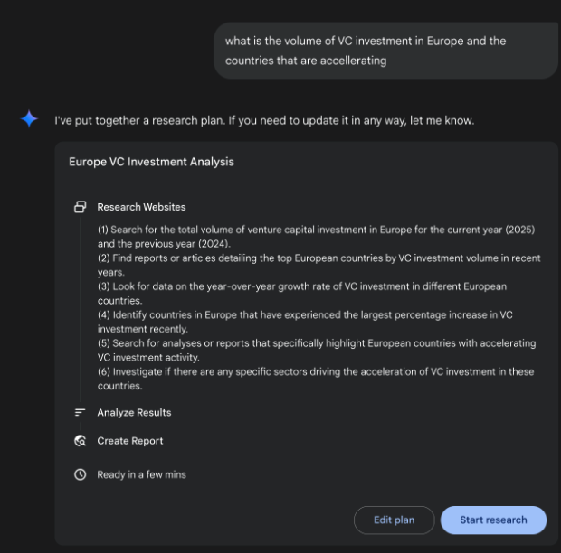
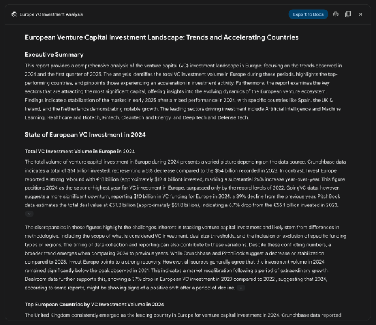
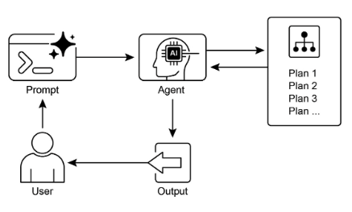

# 第 6 章：規劃

智能行為通常不僅涉及對即時輸入的反應。它需要遠見，將複雜的任務分解為更小的、可管理的步驟，並制定如何實現預期結果的策略。這就是規劃模式發揮作用的地方。從本質上講，規劃是智能體或智能體系統制定一系列行動以從初始狀態轉向目標狀態的能力。

## 規劃模式概述

在人工智慧的背景下，將規劃代理視為您向其委託複雜目標的專家是有幫助的。當你要求它「在異地組織一個團隊」時，你是在定義什麼——目標及其限制——而不是如何定義。代理的核心任務是自主制定實現該目標的路線。它必須先了解初始狀態（例如預算、參與者數量、期望日期）和目標狀態（成功異地預訂），然後發現連接它們的最佳操作順序。該計劃事先未知；它是為了響應請求而創建的。

這個過程的一個特徵是適應性。最初的計劃只是一個起點，而不是嚴格的腳本。代理的真正威力在於其整合新資訊並引導專案繞過障礙的能力。例如，如果首選場地不可用或所選餐飲服務商已被預訂滿，有能力的代理不會簡單地失敗。它會適應。它記錄新的限制，重新評估其選擇，並製定新的計劃，也許是透過建議替代地點或日期。

然而，認識到靈活性和可預測性之間的權衡至關重要。動態規劃是一種特定的工具，而不是通用的解決方案。當問題的解決方案已被充分理解且可重複時，將代理限制在預定的固定工作流程中會更有效。這種方法限制了代理的自主權，以減少不確定性和不可預測行為的風險，確保可靠且一致的結果。因此，使用規劃代理還是簡單的任務執行代理的決定取決於一個問題：是否需要發現“如何”，或者是否已經知道？

## 實際應用和用例

規劃模式是自治系統中的核心計算過程，使代理能夠綜合一系列操作以實現指定目標，特別是在動態或複雜的環境中。此流程將高階目標轉換為由離散的可執行步驟組成的結構化計劃。

在程式任務自動化等領域，規劃用於編排複雜的工作流程。例如，像新員工入職這樣的業務流程可以分解為一系列有向的子任務，例如建立系統帳戶、分配培訓模組以及與不同部門進行協調。代理產生一個計劃，以邏輯順序執行這些步驟，呼叫必要的工具或與各種系統互動以管理依賴性。

在機器人技術和自主導航中，規劃是狀態空間遍歷的基礎。一個系統，無論是實體機器人還是虛擬實體，都必須產生一條路徑或一系列動作，以從初始狀態過渡到目標狀態。這涉及優化時間或能源消耗等指標，同時遵守環境限制，例如避開障礙物或遵守交通法規。

這種模式對於結構化資訊合成也至關重要。當負責產生研究報告等複雜輸出時，代理可以製定一個計劃，其中包括資訊收集、資料匯總、內容結構和迭代細化的不同階段。同樣，在涉及多步驟問題解決的客戶支援場景中，客服人員可以創建並遵循系統的診斷、解決方案實施和升級計劃。

從本質上講，規劃模式允許代理超越簡單的反應性操作，轉向以目標為導向的行為。它提供了解決需要連貫的相互依賴操作序列的問題所必需的邏輯框架。

## 動手程式碼（Crew AI）

以下部分將示範使用 Crew AI 框架實作 Planner 模式。此模式涉及一個代理，該代理首先制定一個多步驟計劃來解決複雜的查詢，然後按順序執行該計劃。

```python
import os
from dotenv import load_dotenv
from crewai import Agent, Task, Crew, Process
from langchain_openai import ChatOpenAI


# Load environment variables from .env file for security
load_dotenv()


# 1. Explicitly define the language model for clarity
llm = ChatOpenAI(model="gpt-4-turbo")


# 2. Define a clear and focused agent
planner_writer_agent = Agent(
    role='Article Planner and Writer',
    goal='Plan and then write a concise, engaging summary on a specified topic.',
    backstory=(
        'You are an expert technical writer and content strategist. '
        'Your strength lies in creating a clear, actionable plan before writing, '
        'ensuring the final summary is both informative and easy to digest.'
    ),
    verbose=True,
    allow_delegation=False,
    llm=llm,  # Assign the specific LLM to the agent
)


# 3. Define a task with a more structured and specific expected output
topic = "The importance of Reinforcement Learning in AI"

high_level_task = Task(
    description=(
        f"1. Create a bullet-point plan for a summary on the topic: '{topic}'.\n"
        f"2. Write the summary based on your plan, keeping it around 200 words."
    ),
    expected_output=(
        "A final report containing two distinct sections:\n\n"
        "### Plan\n"
        "- A bulleted list outlining the main points of the summary.\n\n"
        "### Summary\n"
        "- A concise and well-structured summary of the topic."
    ),
    agent=planner_writer_agent,
)


# Create the crew with a clear process
crew = Crew(
    agents=[planner_writer_agent],
    tasks=[high_level_task],
    process=Process.sequential,
)


# Execute the task
print("## Running the planning and writing task ##")
result = crew.kickoff()

print("\n\n---\n## Task Result ##\n---")
print(result)
```

此程式碼使用 CrewAI 庫建立一個 AI 代理，該代理可以規劃並編寫給定主題的摘要。首先匯入必要的庫，包括 Crew.ai 和 `langchain_openai`，並從 .env 檔案載入環境變數。 ChatOpenAI 語言模型被明確定義為與代理一起使用。建立名為 `planner_writer_agent` 的代理具有特定的角色和目標：計劃然後編寫簡潔的摘要。該代理的背景故事強調了其在規劃和技術寫作方面的專業知識。任務的定義有清晰的描述，首先創建一個計劃，然後編寫關於「人工智慧中強化學習的重要性」主題的摘要，並使用預期輸出的特定格式。 Crew 與代理和任務組合在一起，設定為按順序處理它們。最後呼叫crew.kickoff()方法執行定義的任務並列印結果。

## 谷歌深度研究

Google Gemini DeepResearch（見圖 1）是一個基於代理的系統，專為自主資訊擷取和合成而設計。它透過多步驟代理管道運行，動態地、迭代地查詢 Google 搜索，以系統地探索複雜的主題。該系統旨在處理大量基於網路的資源，評估收集的數據的相關性和知識差距，並執行後續搜尋來解決這些問題。最終輸出將經過審查的資訊合併為結構化的多頁摘要，並引用原始來源。

在此基礎上擴展，系統的操作不是單一查詢回應事件，而是託管的、長期運行的過程。它首先將使用者的提示解構為多點研究計畫（見圖 1），然後將其呈現給使用者進行審查和修改。這允許在執行之前協作塑造研究軌跡。一旦計劃獲得批准，代理管道就會啟動其迭代搜尋和分析循環。這不僅涉及執行一系列預先定義的搜尋；代理根據收集的資訊動態地制定和完善其查詢，主動識別知識差距，證實資料點並解決差異。



圖 1：Google Deep Research 代理產生使用 Google 搜尋作為工具的執行計劃。

一個關鍵的架構元件是系統非同步管理此過程的能力。這種設計確保可能涉及分析數百個來源的調查能夠抵禦單點故障，並允許用戶在完成後退出並收到通知。該系統還可以整合用戶提供的文件，將私人來源的資訊與其基於網路的研究相結合。最終的產出不僅僅是一個串聯的調查結果列表，而是一份結構化的多頁報告。在綜合階段，該模型對收集的資訊進行批判性評估，確定主要主題並將內容組織成具有邏輯部分的連貫敘述。該報告被設計為互動式的，通常包括音訊概述、圖表和原始引用來源的連結等功能，以便用戶進行驗證和進一步探索。除了綜合結果之外，模型還明確傳回其搜尋和查閱的來源的完整清單（見圖 2）。這些內容以引文形式呈現，提供完全的透明度和對主要資訊的直接存取。整個過程將簡單的查詢轉化為全面、綜合的知識體系。


圖 2：正在執行的深度研究計畫的範例，導致 Google 搜尋被用作搜尋各種網路資源的工具。

透過減少手動資料收集和合成所需的大量時間和資源投入，Gemini DeepResearch 提供了一種更結構化和詳盡的資訊發現方法。該系統的價值在跨不同領域的複雜、多面向的研究任務中尤其明顯。

例如，在競爭分析中，可以指導代理系統地收集和整理有關市場趨勢、競爭對手產品規格、來自不同線上來源的公眾情緒以及行銷策略的數據。這種自動化流程取代了手動追蹤多個競爭對手的繁瑣任務，使分析師能夠專注於更高階的策略解釋，而不是資料收集（見圖 3）。



圖 3：Google 深度研究代理產生的最終輸出，代表我們分析使用 Google 搜尋作為工具獲得的來源。

同樣，在學術探索中，該系統可以作為進行廣泛文獻綜述的有力工具。它可以識別和總結基礎論文，追蹤眾多出版物中概念的發展，並繪製出特定領域內的新興研究前沿，從而加速學術探究的初始和最耗時的階段。

這種方法的效率源自於迭代搜尋和過濾週期的自動化，這是手動研究的核心瓶頸。綜合性是透過系統處理比人類研究人員在可比較的時間範圍內通常可行的更多數量和種類的資訊來源的能力來實現的。這種更廣泛的分析範圍有助於減少選擇偏差的可能性，並增加發現不太明顯但潛在關鍵資訊的可能性，從而對主題有更可靠和有充分支持的理解。

## OpenAI 深度研究 API

OpenAI Deep Research API 是一款專用工具，旨在自動執行複雜的研究任務。它採用先進的代理模型，可以獨立推理、規劃和綜合來自現實世界的資訊。與簡單的問答模型不同，它採用高級查詢並自動將其分解為子問題，使用其內置工具執行網絡搜索，並提供結構化的、引用豐富的最終報告。 API 提供對整個過程的直接編程訪問，在編寫模型時使用 o3-deep-research-2025-06-26 來實現高品質綜合，使用更快的 o4-mini-deep-research-2025-06-26 來實現對延遲敏感的應用程序

Deep Research API 非常有用，因為它可以自動完成原本需要數小時的手動研究，提供專業級的數據驅動報告，適合為業務戰略、投資決策或政策建議提供資訊。其主要優點包括：

* **結構化的引用輸出：** 它產生組織良好的報告，其中內嵌引用連結到來源元數據，確保聲明可驗證且有數據支援。  
* **透明度：** 與 ChatGPT 中的抽象流程不同，API 公開了所有中間步驟，包括代理的推理、其執行的特定 Web 搜尋查詢以及其運行的任何程式碼。這樣可以進行詳細的調試、分析，並更深入地了解最終答案的建構方式。  
* **可擴展性：** 它支援模型上下文協定（MCP），使開發人員能夠將代理連接到私有知識庫和內部資料來源，將公共網路研究與專有資訊整合在一起。

若要使用 API，您需要向 client.responses.create 端點傳送請求，指定模型、輸入提示以及代理可以使用的工具。輸入通常包括定義代理角色和所需輸出格式的 `system_message` 以及 `user_query`。您還必須包含 `web_search_preview` 工具，並且可以選擇新增其他工具，例如 `code_interpreter` 或自訂 MCP 工具（請參閱第 10 章）以取得內部資料。

```python
from openai import OpenAI


# Initialize the client with your API key
client = OpenAI(api_key="YOUR_OPENAI_API_KEY")


# Define the agent's role and the user's research question
system_message = """
You are a professional researcher preparing a structured, data-driven report.
Focus on data-rich insights, use reliable sources, and include inline citations.
"""

user_query = "Research the economic impact of semaglutide on global healthcare systems."


# Create the Deep Research API call
response = client.responses.create(
    model="o3-deep-research-2025-06-26",
    input=[
        {
            "role": "developer",
            "content": [{"type": "input_text", "text": system_message}],
        },
        {
            "role": "user",
            "content": [{"type": "input_text", "text": user_query}],
        },
    ],
    reasoning={"summary": "auto"},
    tools=[{"type": "web_search_preview"}],
)


# Access and print the final report from the response
final_report = response.output[-1].content[0].text
print(final_report)


# --- ACCESS INLINE CITATIONS AND METADATA ---
print("--- CITATIONS ---")
annotations = response.output[-1].content[0].annotations

if not annotations:
    print("No annotations found in the report.")
else:
    for i, citation in enumerate(annotations):
        # The text span the citation refers to
        cited_text = final_report[citation.start_index : citation.end_index]
        print(f"Citation {i + 1}:")
        print(f"  Cited Text: {cited_text}")
        print(f"  Title: {citation.title}")
        print(f"  URL: {citation.url}")
        print(f"  Location: chars {citation.start_index}–{citation.end_index}")

print("\n" + "=" * 50 + "\n")


# --- INSPECT INTERMEDIATE STEPS ---
print("--- INTERMEDIATE STEPS ---")

# 1. Reasoning Steps: Internal plans and summaries generated by the model.
try:
    reasoning_step = next(item for item in response.output if item.type == "reasoning")
    print("\n[Found a Reasoning Step]")
    for summary_part in reasoning_step.summary:
        print(f"  - {summary_part.text}")
except StopIteration:
    print("\nNo reasoning steps found.")

# 2. Web Search Calls: The exact search queries the agent executed.
try:
    search_step = next(item for item in response.output if item.type == "web_search_call")
    print("\n[Found a Web Search Call]")
    print(f"  Query Executed: '{search_step.action['query']}'")
    print(f"  Status: {search_step.status}")
except StopIteration:
    print("\nNo web search steps found.")

# 3. Code Execution: Any code run by the agent using the code interpreter.
try:
    code_step = next(item for item in response.output if item.type == "code_interpreter_call")
    print("\n[Found a Code Execution Step]")
    print("  Code Input:")
    print(f"  ```python\n{code_step.input}\n  ```")
    print("  Code Output:")
    print(f"  {code_step.output}")
except StopIteration:
    print("\nNo code execution steps found.")
```

此程式碼片段利用 OpenAI API 執行「深度研究」任務。首先使用您的 API 金鑰初始化 OpenAI 用戶端，這對於身份驗證至關重要。然後，將人工智慧代理的角色定義為專業研究人員，並設定使用者關於索馬魯肽的經濟影響的研究問題。該程式碼建構對 o3-deep-research-2025-06-26 模型的 API 調用，提供定義的系統訊息和使用者查詢作為輸入。它還請求自動總結推理並啟用網路搜尋功能。進行 API 呼叫後，它會提取並列印最終產生的報告。

隨後，它嘗試存取並顯示報告註釋中的內聯引用和元數據，包括報告中引用的文字、標題、URL 和位置。最後，它檢查並列印有關模型所採取的中間步驟的詳細信息，例如推理步驟、網路搜尋呼叫（包括執行的查詢）以及任何程式碼執行步驟（如果使用程式碼解釋器）。

## 概覽

**內容：** 複雜的問題通常無法透過單一行動解決，需要有遠見才能達到預期的結果。如果沒有結構化方法，代理系統將難以處理涉及多個步驟和依賴關係的多方面請求。這使得將高階目標分解為一系列可管理的較小的可執行任務變得困難。因此，系統無法有效地制定策略，從而在面對複雜的目標時導致不完整或不正確的結果。

**原因：** 規劃模式透過讓代理系統首先創建一個連貫的計劃來實現目標，從而提供標準化的解決方案。它涉及將高級目標分解為一系列較小的、可操作的步驟或子目標。這使得系統能夠管理複雜的工作流程、編排各種工具並以邏輯順序處理依賴關係。LLM特別適合這一點，因為他們可以根據大量的培訓數據制定合理且有效的計劃。這種結構化方法將簡單的反應代理轉變為策略執行者，可以主動實現複雜的目標，甚至在必要時調整其計劃。

**經驗法則：** 當使用者的要求過於複雜而無法透過單一操作或工具處理時，請使用此模式。它非常適合自動化多步驟流程，例如產生詳細的研究報告、新員工入職或執行競爭分析。每當任務需要一系列相互依賴的操作才能達到最終的綜合結果時，請應用規劃模式。

**視覺總結**



圖4；規劃設計模式

## 要點

* 規劃使代理能夠將複雜的目標分解為可操作的連續步驟。  
* 它對於處理多步驟任務、工作流程自動化和駕馭複雜環境至關重要。  
* LLM可以根據任務描述產生逐步方法來執行規劃。  
* 明確提示或設計需要規劃步驟的任務會鼓勵代理框架中的這種行為。  
* Google Deep Research 是代表我們分析使用 Google 搜尋作為工具獲得的資源的代理。它反映、計劃和執行

## 結論

總之，規劃模式是一個基本組件，它將代理系統從簡單的反應響應者提升為策略性的、以目標為導向的執行者。現代大型語言模型為此提供了核心功能，自動將高階目標分解為連貫的、可操作的步驟。這種模式從簡單、順序的任務執行（如 CrewAI 代理創建和遵循寫作計劃所證明的那樣）擴展到更複雜和動態的系統。 Google DeepResearch 代理體現了這種先進的應用程序，創建了基於持續資訊收集進行調整和發展的迭代研究計劃。最終，規劃在人類意圖和複雜問題的自動執行之間架起了重要的橋樑。透過建立解決問題的方法，該模式使代理能夠管理複雜的工作流程並提供全面的綜合結果。

## 參考

1. Google DeepResearch（雙子座功能）：[gemini.google.com](http://gemini.google.com)
2. OpenAI，引入深度研究[https://openai.com/index/introducing-deep-research/](https://openai.com/index/introducing-deep-research/)
3. 困惑，困惑深度研究簡介，[https://www.perplexity.ai/hub/blog/introducing-perplexity-deep-research](https://www.perplexity.ai/hub/blog/introducing-perplexity-deep-research)
