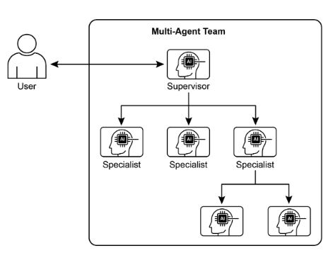
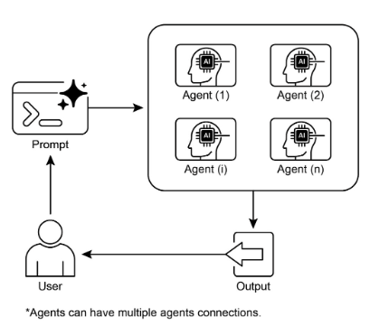

# 第 7 章：多智能體協作

雖然整體代理架構可以有效解決明確定義的問題，但在面對複雜的多域任務時，其功能通常會受到限制。多代理協作模式透過將系統建構成不同的專業代理的協作整體來解決這些限制。這種方法基於任務分解的原則，其中高階目標被分解為離散的子問題。然後將每個子問題分配給擁有最適合該任務的特定工具、資料存取或推理能力的代理。

例如，一個複雜的研究查詢可能會被分解並分配給一個用於資訊檢索的研究代理、一個用於統計處理的資料分析代理以及一個用於產生最終報告的綜合代理。這種系統的有效性不僅取決於分工，而且很大程度取決於代理間通訊的機制。這需要一個標準化的通訊協定和一個共享的本體，允許代理交換資料、委派子任務並協調他們的行動，以確保最終輸出是一致的。

這種分散式架構具有多種優勢，包括增強的模組化、可擴展性和穩健性，因為單一代理的故障不一定會導致整個系統故障。這種協作可以產生協同結果，其中多智能體系統的集體表現超過了整體中任何單一智能體的潛在能力。

## 多智能體協作模式概述

多代理協作模式涉及設計多個獨立或半獨立代理共同工作以實現共同目標的系統。每個代理通常都有一個明確的角色、與整體目標一致的具體目標，並且可能存取不同的工具或知識庫。這種模式的力量在於這些代理之間的互動和協同作用。

協作可以採取多種形式：

* **順序切換：** 一個代理完成一項任務，並將其輸出傳遞給另一個代理以進行管道中的下一步（類似於規劃模式，但明確涉及不同的代理）。  
* **並行處理：** 多個代理同時處理問題的不同部分，然後將它們的結果組合起來。  
* **辯論與共識：** 多代理協作，具有不同觀點和資訊來源的代理參與討論以評估選項，最終達成共識或更明智的決策。  
* **分層結構：** 管理代理可以根據其工具存取或外掛程式功能動態地將任務委託給工作代理，並綜合其結果。每個代理還可以處理相關的工具組，而不是單一代理處理所有工具。  
* **專家團隊：** 具有不同領域專業知識的代理（例如研究人員、作家、編輯）協作產生複雜的產出。

* **評論家-審查者：** 代理建立初始輸出，例如計劃、草稿或答案。然後，第二組代理嚴格評估該產出是否遵守策略、安全性、合規性、正確性、品質以及與組織目標的一致性。原始創建者或最終代理根據此回饋修改輸出。這種模式對於程式碼產生、研究寫作、邏輯檢查和確保道德一致性特別有效。這種方法的優點包括提高穩健性、提高品質以及減少幻覺或錯誤的可能性。

多代理系統（見圖 1）從根本上包括代理角色和職責的劃分、代理交換資訊的通訊管道的建立以及指導其協作工作的任務流程或互動協議的製定。



圖1：多智能體系統範例

Crew AI 和 Google ADK 等框架旨在透過提供代理、任務及其互動過程的規範結構來促進這種範例。這種方法對於需要各種專業知識、涵蓋多個離散階段或利用並發處理和跨代理資訊驗證的優勢的挑戰特別有效。

## 實際應用和用例

多代理協作是適用於眾多領域的強大模式：

* **複雜的研究與分析：** 一組代理可以合作進行一個研究計畫。一個代理可能專門搜尋學術資料庫，另一個代理總結發現，第三個代理識別趨勢，第四個代理將資訊綜合成報告。這反映了人類研究團隊的運作方式。  
* **軟體開發：** 想像一下代理協作建立軟體。一個代理可以是需求分析師，另一個是程式碼產生器，第三個是測試人員，第四個是文件編寫者。他們可以在彼此之間傳遞輸出以構建和驗證組件。  
* **創意內容生成：** 創建行銷活動可能需要市場研究代理、文案代理、圖形設計代理（使用圖像生成工具）和社交媒體調度代理，所有這些都一起工作。  
* **財務分析：** 多代理系統可以分析金融市場。代理可能專注於獲取股票數據、分析新聞情緒、執行技術分析以及產生投資建議。  
* **客戶支援升級：** 一線支援代理可以處理初始查詢，在需要時將複雜問題升級給專業代理（例如技術專家或計費專家），展示基於問題複雜性的順序移交。  
* **供應鏈最佳化：** 代理可以代表供應鏈中的不同節點（供應商、製造商、分銷商），並協作優化庫存水準、物流和調度，以回應不斷變化的需求或中斷。  
* **網路分析與修復**：自主操作可以從代理架構中受益匪淺，特別是在故障定位方面。多個代理可以協作對問題進行分類和修復，並提出最佳操作建議。這些代理還可以與傳統的機器學習模型和工具集成，利用現有系統，同時提供生成式人工智慧的優勢。

描述專門代理並精心協調其相互關係的能力使開發人員能夠建立具有增強的模組化性、可擴展性以及解決單一整合代理無法克服的複雜性的系統。

## 多智能體協作：探索相互關係與溝通結構

了解代理互動和通訊的複雜方式是設計有效的多代理系統的基礎。如圖 2 所示，存在一系列相互關係和通訊模型，從最簡單的單代理場景到複雜的客製化設計的協作框架。每種模型都有獨特的優點和挑戰，影響多智能體系統的整體效率、穩健性和適應性。

### 1.單一代理

在最基本的層面上，「單一代理」自主運行，無需與其他實體直接互動或通訊。雖然此模型易於實施和管理，但其功能本質上受到單一代理的範圍和資源的限制。它適用於可分解為獨立子問題的任務，每個子問題都可由單一自給自足的代理解決。

### 2. 網路

「網路」模型代表了協作的重要一步，其中多個代理以分散的方式直接相互互動。通訊通常是點對點進行的，允許共享資訊、資源甚至任務。這個模型增強了彈性，因為一個代理的失敗並不一定會削弱整個系統。然而，在大型非結構化網路中管理通訊開銷並確保一致的決策可能具有挑戰性。

### 3.主管

在「監督者」模型中，一個專門的代理（即「監督者」）負責監督和協調一組下屬代理的活動。主管充當溝通、任務分配和衝突解決的中心樞紐。這種層次結構提供了清晰的權限，並且可以簡化管理和控制。然而，它引入了單點故障（主管），如果主管因大量下屬或複雜任務而不堪重負，則可能成為瓶頸。

### 4. 主管作為工具

該模型是「主管」概念的微妙延伸，其中主管的角色不再是直接命令和控制，而是更多地為其他代理提供資源、指導或分析支援。主管可能會提供工具、數據或計算服務，使其他代理能夠更有效地執行他們的任務，而不必命令他們的每一個行動。這種方法旨在利用主管的能力，而不強制實施嚴格的自上而下的控制。

### 5. 層次結構

「層級」模型擴展了主管概念，創造了多層組織結構。這涉及多個層級的監管者，較高層級的監管者監督較低層級的監管者，最終是最低層級的一組營運代理。這種結構非常適合可以分解為子問題的複雜問題，每個子問題都由層次結構的特定層管理。它提供了一種結構化的可擴展性和複雜性管理方法，允許在定義的邊界內進行分散式決策。


圖 2：代理以各種方式進行通訊和互動。

### 6. 自訂

「客製化」模型代表了多代理系統設計的終極靈活性。它允許創建獨特的相互關係和通訊結構，這些結構專門針對給定問題或應用程式的特定要求而客製化。這可能涉及結合前面提到的模型中的元素的混合方法，或從環境的獨特限制和機會中出現的全新設計。客製化模型通常是由於需要優化特定效能指標、處理高度動態的環境或將特定領域的知識合併到系統架構中而產生的。設計和實作自訂模型通常需要深入了解多代理系統原理，並仔細考慮通訊協定、協調機制和緊急行為。

總之，多智能體系統的相互關係和溝通模型的選擇是一個關鍵的設計決策。每種模型都有獨特的優點和缺點，最佳選擇取決於任務的複雜性、代理的數量、所需的自治等級、穩健性需求以及可接受的通訊開銷等因素。多智能體系統的未來進步可能會繼續探索和完善這些模型，並開發新的協作智慧範例。

## 實踐程式碼（Crew AI）

此 Python 程式碼定義了一個由 AI 驅動的團隊，使用 CrewAI 框架產生有關 AI 趨勢的部落格文章。它首先設定環境，從 .env 檔案載入 API 金鑰。該應用程式的核心涉及定義兩個代理：一個是研究人員，用於查找和總結人工智慧趨勢；另一個是作者，用於根據研究創建部落格文章。

相應地定義了兩個任務：一個用於研究趨勢，另一個用於撰寫部落格文章，寫作任務取決於研究任務的輸出。然後，這些代理和任務被組裝成一個 Crew，指定任務按順序執行的順序過程。 Crew 使用代理、任務和語言模型（特別是「gemini-2.0-flash」模型）進行初始化。主函數使用 kickoff() 方法執行該工作人員，協調代理之間的協作以產生所需的輸出。最後，程式碼列印了crew執行的最終結果，也就是產生的博文。

```python
import os
from dotenv import load_dotenv
from crewai import Agent, Task, Crew, Process
from langchain_google_genai import ChatGoogleGenerativeAI


def setup_environment():
    """Loads environment variables and checks for the required API key."""
    load_dotenv()
    if not os.getenv("GOOGLE_API_KEY"):
        raise ValueError("GOOGLE_API_KEY not found. Please set it in your .env file.")


def main():
    """
    Initializes and runs the AI crew for content creation using the latest Gemini model.
    """
    setup_environment()

    # Define the language model to use.
    # Updated to a model from the Gemini 2.0 series for better performance and features.
    # For cutting-edge (preview) capabilities, you could use "gemini-2.5-flash".
    llm = ChatGoogleGenerativeAI(model="gemini-2.0-flash")

    # Define Agents with specific roles and goals
    researcher = Agent(
        role='Senior Research Analyst',
        goal='Find and summarize the latest trends in AI.',
        backstory="You are an experienced research analyst with a knack for identifying key trends and synthesizing information.",
        verbose=True,
        allow_delegation=False,
    )

    writer = Agent(
        role='Technical Content Writer',
        goal='Write a clear and engaging blog post based on research findings.',
        backstory="You are a skilled writer who can translate complex technical topics into accessible content.",
        verbose=True,
        allow_delegation=False,
    )

    # Define Tasks for the agents
    research_task = Task(
        description="Research the top 3 emerging trends in Artificial Intelligence in 2024-2025. Focus on practical applications and potential impact.",
        expected_output="A detailed summary of the top 3 AI trends, including key points and sources.",
        agent=researcher,
    )

    writing_task = Task(
        description="Write a 500-word blog post based on the research findings. The post should be engaging and easy for a general audience to understand.",
        expected_output="A complete 500-word blog post about the latest AI trends.",
        agent=writer,
        context=[research_task],
    )

    # Create the Crew
    blog_creation_crew = Crew(
        agents=[researcher, writer],
        tasks=[research_task, writing_task],
        process=Process.sequential,
        llm=llm,
        verbose=2,  # Set verbosity for detailed crew execution logs
    )

    # Execute the Crew
    print("## Running the blog creation crew with Gemini 2.0 Flash... ##")
    try:
        result = blog_creation_crew.kickoff()
        print("\n------------------\n")
        print("## Crew Final Output ##")
        print(result)
    except Exception as e:
        print(f"\nAn unexpected error occurred: {e}")


if __name__ == "__main__":
    main()
```

現在，我們將深入研究 Google ADK 框架內的更多範例，特別強調分層、平行和順序協調範例，以及將代理作為操作工具的實作。

## 實踐程式碼（Google ADK）

以下程式碼範例示範了透過建立父子關係在 Google ADK 內建立分層代理結構。程式碼定義了兩種類型的代理：LlmAgent 和派生自 BaseAgent 的自訂 TaskExecutor 代理。 TaskExecutor 專為特定的非 LLM 任務而設計，在本例中，它只是產生「任務成功完成」事件。名為greeter 的LlmAgent 使用指定的模型和指令進行初始化，以充當友善的greeter。自訂 TaskExecutor 實例化為 `task_doer`。創建一個稱為協調器的父 LlmAgent，也帶有模型和指令。協調器的指令引導它將問候委託給問候者，並將任務執行委託給 `task_doer`。 greeter 和 `task_doer` 作為子代理加入協調器中，建立父子關係。然後程式碼斷言此關係已正確設定。最後，它會列印一條訊息，指示代理層次結構已成功建立。

```python
from typing import AsyncGenerator

from google.adk.agents import LlmAgent, BaseAgent
from google.adk.agents.invocation_context import InvocationContext
from google.adk.events import Event


# Correctly implement a custom agent by extending BaseAgent
class TaskExecutor(BaseAgent):
    """A specialized agent with custom, non-LLM behavior."""
    name: str = "TaskExecutor"
    description: str = "Executes a predefined task."

    async def _run_async_impl(self, context: InvocationContext) -> AsyncGenerator[Event, None]:
        """Custom implementation logic for the task."""
        # This is where your custom logic would go.
        # For this example, we'll just yield a simple event.
        yield Event(author=self.name, content="Task finished successfully.")


# Define individual agents with proper initialization
# LlmAgent requires a model to be specified.
greeter = LlmAgent(
    name="Greeter",
    model="gemini-2.0-flash-exp",
    instruction="You are a friendly greeter.",
)

# Instantiate our concrete custom agent
task_doer = TaskExecutor()

# Create a parent agent and assign its sub-agents
# The parent agent's description and instructions should guide its delegation logic.
coordinator = LlmAgent(
    name="Coordinator",
    model="gemini-2.0-flash-exp",
    description="A coordinator that can greet users and execute tasks.",
    instruction="When asked to greet, delegate to the Greeter. When asked to perform a task, delegate to the TaskExecutor.",
    sub_agents=[
        greeter,
        task_doer,
    ],
)

# The ADK framework automatically establishes the parent-child relationships.
# These assertions will pass if checked after initialization.
assert greeter.parent_agent == coordinator
assert task_doer.parent_agent == coordinator

print("Agent hierarchy created successfully.")
```

此程式碼摘錄說明如何在 Google ADK 框架內使用 LoopAgent 建立迭代工作流程。程式碼定義了兩個代理：ConditionChecker 和ProcessingStep。 ConditionChecker 是一個自訂代理，用於檢查會話狀態中的「狀態」值。如果“狀態”為“已完成”，ConditionChecker 會升級事件以停止循環。否則，它會產生一個事件來繼續循環。 `ProcessingStep` 是一個使用「gemini-2.0-flash-exp」模型的 LlmAgent。它的指令是執行一項任務，並將會話 `status` 設定為「已完成」（如果這是最後一步）。建立一個名為 StatusPoller 的 LoopAgent。 StatusPoller 配置為 `max_iterations=10`。 StatusPoller 包含ProcessingStep 和ConditionChecker 實例作為子代理。 LoopAgent 將依序執行子代理最多 10 次迭代，如果 ConditionChecker 發現狀態為「已完成」則停止。

```python
import asyncio
from typing import AsyncGenerator

from google.adk.agents import LoopAgent, LlmAgent, BaseAgent
from google.adk.events import Event, EventActions
from google.adk.agents.invocation_context import InvocationContext


# Best Practice: Define custom agents as complete, self-describing classes.
class ConditionChecker(BaseAgent):
    """A custom agent that checks for a 'completed' status in the session state."""
    name: str = "ConditionChecker"
    description: str = "Checks if a process is complete and signals the loop to stop."

    async def _run_async_impl(
        self, context: InvocationContext
    ) -> AsyncGenerator[Event, None]:
        """Checks state and yields an event to either continue or stop the loop."""
        status = context.session.state.get("status", "pending")
        is_done = status == "completed"

        if is_done:
            # Escalate to terminate the loop when the condition is met.
            yield Event(author=self.name, actions=EventActions(escalate=True))
        else:
            # Yield a simple event to continue the loop.
            yield Event(author=self.name, content="Condition not met, continuing loop.")


# Correction: The LlmAgent must have a model and clear instructions.
process_step = LlmAgent(
    name="ProcessingStep",
    model="gemini-2.0-flash-exp",
    instruction=(
        "You are a step in a longer process. Perform your task. "
        "If you are the final step, update session state by setting 'status' to 'completed'."
    ),
)


# The LoopAgent orchestrates the workflow.
poller = LoopAgent(
    name="StatusPoller",
    max_iterations=10,
    sub_agents=[
        process_step,
        ConditionChecker(),  # Instantiating the well-defined custom agent.
    ],
)

# This poller will now execute 'process_step'
# and then 'ConditionChecker' repeatedly until the status is 'completed'
# or 10 iterations have passed.
```

此程式碼摘錄闡明了 Google ADK 中的 SequentialAgent 模式，該模式是為建立線性工作流程而設計的。此程式碼使用 google.adk.agents 庫定義了一個順序代理管道。此管道由兩個代理組成：step1 和step2。步驟1被命名為`Step1_Fetch`，其輸出將儲存在會話狀態中的鍵`data`下。步驟2被命名為`Step2_Process`，並被指示分析儲存在`session.state["data"]`中的資訊並提供摘要。名為「MyPipeline」的 SequentialAgent 協調這些子代理的執行。當管道使用初始輸入運行時，step1 將首先執行。步驟 1 的回應將被儲存到「data」鍵下的會話狀態。隨後，步驟 2 將執行，利用步驟 1 根據其指令放入狀態的資訊。這種結構允許建構工作流程，其中一個代理的輸出成為下一個代理的輸入。這是創建多步驟人工智慧或資料處理管道的常見模式。

```python
from google.adk.agents import SequentialAgent, Agent


# This agent's output will be saved to session.state["data"]
step1 = Agent(
    name="Step1_Fetch",
    output_key="data",
)

# This agent will use the data from the previous step.
# We instruct it on how to find and use this data.
step2 = Agent(
    name="Step2_Process",
    instruction="Analyze the information found in state['data'] and provide a summary.",
)

pipeline = SequentialAgent(
    name="MyPipeline",
    sub_agents=[step1, step2],
)

# When the pipeline is run with an initial input, Step1 will execute,
# its response will be stored in session.state["data"], and then
# Step2 will execute, using the information from the state as instructed.
```

以下程式碼範例說明了 Google ADK 中的 ParallelAgent 模式，該模式有利於多個代理任務的並發執行。 `data_gatherer` 设计用于同时运行两个子代理：`weather_fetcher` 和 `news_fetcher`。 `weather_fetcher` 代理被指示获取给定位置的天气并将结果存储在 `session.state["weather_data"]` 中。同样，`news_fetcher` 代理被指示检索给定主题的热门新闻报道并将其存储在 `session.state["news_data"]` 中。每個子代理都配置為使用“gemini-2.0-flash-exp”模型。 ParallelAgent 協調這些子代理的執行，使它們能夠並行工作。 `weather_fetcher` 和 `news_fetcher` 的结果将被收集并存储在会话状态中。最后，该範例展示了在代理执行完成后如何从 `final_state` 访问收集的天气和新闻数据。

```python
from google.adk.agents import Agent, ParallelAgent


# It's better to define the fetching logic as tools for the agents.
# For simplicity in this example, we'll embed the logic in the agent's instruction.
# In a real-world scenario, you would use tools.

# Define the individual agents that will run in parallel
weather_fetcher = Agent(
    name="weather_fetcher",
    model="gemini-2.0-flash-exp",
    instruction="Fetch the weather for the given location and return only the weather report.",
    output_key="weather_data",  # The result will be stored in session.state["weather_data"]
)

news_fetcher = Agent(
    name="news_fetcher",
    model="gemini-2.0-flash-exp",
    instruction="Fetch the top news story for the given topic and return only that story.",
    output_key="news_data",  # The result will be stored in session.state["news_data"]
)

# Create the ParallelAgent to orchestrate the sub-agents
data_gatherer = ParallelAgent(
    name="data_gatherer",
    sub_agents=[
        weather_fetcher,
        news_fetcher,
    ],
)
```

提供的程式碼段舉例說明了 Google ADK 中的「代理作為工具」範例，使代理能夠以類似於函數呼叫的方式利用另一個代理的功能。具體來說，該程式碼使用 Google 的 LlmAgent 和 AgentTool 類別定義了一個圖像生成系統。它由兩個代理組成：父代理 `artist_agent` 和子代理 `image_generator_agent`。 `generate_image` 函數是一個簡單的工具，可以模擬影像創建，傳回模擬影像資料。 `image_generator_agent` 負責根據收到的文字提示使用此工具。 `artist_agent` 的作用是先發明一個創意圖像提示。然後，它透過 AgentTool 包裝器呼叫 `image_generator_agent`。 AgentTool 充當橋樑，允許一個代理使用另一個代理作為工具。當 `artist_agent` 呼叫 `image_tool` 時，AgentTool 使用藝術家發明的提示符呼叫 `image_generator_agent` 。然後 `image_generator_agent` 使用帶有該提示的 `generate_image` 函數。最後，生成的圖像（或模擬數據）透過代理返回。該架構演示了分層代理系統，其中較高級別的代理協調較低級別的專門代理來執行任務。

```python
from google.adk.agents import LlmAgent
from google.adk.tools import agent_tool
from google.genai import types


# 1. A simple function tool for the core capability.
# This follows the best practice of separating actions from reasoning.
def generate_image(prompt: str) -> dict:
    """
    Generates an image based on a textual prompt.

    Args:
        prompt: A detailed description of the image to generate.

    Returns:
        A dictionary with the status and the generated image bytes.
    """
    print(f"TOOL: Generating image for prompt: '{prompt}'")
    # In a real implementation, this would call an image generation API.
    # For this example, we return mock image data.
    mock_image_bytes = b"mock_image_data_for_a_cat_wearing_a_hat"
    return {
        "status": "success",
        # The tool returns the raw bytes, the agent will handle the Part creation.
        "image_bytes": mock_image_bytes,
        "mime_type": "image/png",
    }


# 2. Refactor the ImageGeneratorAgent into an LlmAgent.
# It now correctly uses the input passed to it.
image_generator_agent = LlmAgent(
    name="ImageGen",
    model="gemini-2.0-flash",
    description="Generates an image based on a detailed text prompt.",
    instruction=(
        "You are an image generation specialist. Your task is to take the user's request "
        "and use the `generate_image` tool to create the image. "
        "The user's entire request should be used as the 'prompt' argument for the tool. "
        "After the tool returns the image bytes, you MUST output the image."
    ),
    tools=[generate_image],
)


# 3. Wrap the corrected agent in an AgentTool.
# The description here is what the parent agent sees.
image_tool = agent_tool.AgentTool(
    agent=image_generator_agent,
    description="Use this tool to generate an image. The input should be a descriptive prompt of the desired image.",
)


# 4. The parent agent remains unchanged. Its logic was correct.
artist_agent = LlmAgent(
    name="Artist",
    model="gemini-2.0-flash",
    instruction=(
        "You are a creative artist. First, invent a creative and descriptive prompt for an image. "
        "Then, use the `ImageGen` tool to generate the image using your prompt."
    ),
    tools=[image_tool],
)
```

## 概覽

**內容：** 複雜的問題通常超出單一基於 LLM 的整體代理的能力。單獨的代理可能缺乏多樣化的專業技能或無法獲得解決多方面任務的所有部分所需的特定工具。這種限製造成了瓶頸，降低了系統的整體有效性和可擴展性。因此，解決複雜的多領域目標變得效率低下，並可能導致不完整或次優的結果。

**原因：** 多代理協作模式透過創建多個合作代理的系統來提供標準化的解決方案。一個複雜的問題被分解為更小、更易於管理的子問題。然後，每個子問題都被分配給一個專門的代理，該代理具有解決該問題所需的精確工具和能力。這些代理透過定義的通訊協定和互動模型（例如順序切換、平行工作流程或分層委託）協同工作。這種代理的分散式方法產生了協同效應，使團隊能夠實現任何單一代理不可能實現的結果。

**經驗法則：** 當任務對於單一代理而言過於複雜並且可以分解為需要專門技能或工具的不同子任務時，請使用此模式。它非常適合受益於多樣化專業知識、平行處理或多階段結構化工作流程的問題，例如複雜的研究和分析、軟體開發或創意內容生成。

**視覺總結：**



圖3：多Agent設計模式

## 要點

* 多代理協作涉及多個代理共同努力實現共同目標。  
* 此模式利用專門角色、分散式任務和代理間通訊。  
* 協作可以採取順序交接、並行處理、辯論或分層結構等形式。  
* 此模式非常適合需要不同專業知識或多個不同階段的複雜問題。

## 結論

本章探討了多代理協作模式，展示了在系統內編排多個專用代理的好處。我們研究了各種協作模型，強調此模式在解決不同領域的複雜、多面向問題上的重要角色。了解智能體協作自然會引發對它們與外在環境的互動的探究。

## 參考

1. 多元代理協作機制：LLM調查，[https://arxiv.org/abs/2501.06322](https://arxiv.org/abs/2501.06322)
2. 多重代理系統－協作的力量，[https://aravindakumar.medium.com/introducing-multi-代理-frameworks-the-power-of-collaboration-e9db31bba1b6](https://aravindakumar.medium.com/introducing-multi-代理-frameworks-the-power-of-collaboration-e9db31bba1b6)
