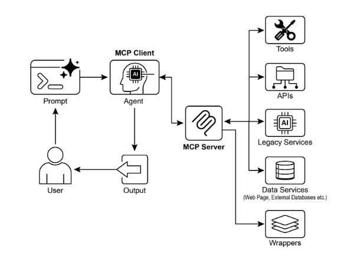

# 第 10 章：模型上下文協定

為了使LLM能夠有效地發揮代理的作用，他們的能力必須超越多模式生成。與外部環境的互動是必要的，包括存取當前資料、使用外部軟體以及執行特定的操作任務。模型上下文協定 (MCP) 透過為 LLM 提供與外部資源互動的標準化介面來滿足這一需求。該協議是促進一致和可預測整合的關鍵機制。

## MCP 模式概述

想像一下通用適配器，它允許任何LLM插入任何外部系統、資料庫或工具，而無需為每個系統、資料庫或工具進行自訂整合。這本質上就是模型上下文協定 (MCP)。它是一個開放標準，旨在標準化 Gemini、OpenAI 的 GPT 模型、Mixtral 和 Claude 等LLM與外部應用、資料來源和工具的通訊方式。將其視為一種通用連接機制，可簡化LLM獲取上下文、執行操作以及與各種系統互動的方式。

MCP 在客戶端-伺服器架構上運作。它定義了 MCP 伺服器如何公開不同的元素——資料（稱為資源）、互動式範本（本質上是提示）和可操作功能（稱為工具）。然後，這些由 MCP 用戶端使用，該用戶端可以是 LLM 主機應用程式或 AI 代理本身。這種標準化方法大大降低了將LLM整合到不同營運環境中的複雜性。

然而，MCP 是一個「代理介面」的契約，其有效性在很大程度上取決於它所公開的底層 API 的設計。有這樣的風險：開發人員只是簡單地包裝預先存在的遺留 API 而不進行修改，這對代理來說可能不是最理想的。例如，如果票務系統的 API 只允許逐一檢索完整的票證詳細信息，則要求匯總高優先級票證的客服人員在處理量較大時會很慢且不准確。為了真正有效，應該使用過濾和排序等確定性功能來改進底層 API，以幫助非確定性代理高效工作。這凸顯了代理不會神奇地取​​代確定性工作流程；他們往往需要更強大的確定性支援才能成功。

此外，MCP 可以包裝其輸入或輸出仍然不能被代理本質上理解的 API。只有當 API 的資料格式對代理友好時，API 才有用，而 MCP 本身並不會強制執行此保證。例如，如果使用代理無法解析 PDF 內容，則為以 PDF 形式傳回文件的文件儲存體建立 MCP 伺服器幾乎毫無用處。更好的方法是先建立一個傳回文件文字版本的 API，例如 Markdown，代理可以實際讀取和處理它。這表明開發人員不僅必須考慮連接，還必須考慮所交換資料的性質，以確保真正的相容性。

## MCP 與工具函數調用

模型上下文協定 (MCP) 和工具函數呼叫是不同的機制，使 LLM 能夠與外部功能（包括工具）互動並執行操作。雖然兩者都將LLM的功能擴展到文本生成之外，但它們的方法和抽象層次有所不同。

工具函數呼叫可以被認為是LLM對特定的、預先定義的工具或函數的直接請求。請注意，在這種情況下，我們可以互換使用「工具」和「功能」這兩個詞。這種互動的特點是一對一的通訊模型，其中LLM根據其對需要外部操作的使用者意圖的理解來格式化請求。然後應用程式程式碼執行該請求並將結果傳回給 LLM。這個過程通常是專有的，並且因不同的LLM提供者而異。

相比之下，模型上下文協定 (MCP) 作為 LLM 發現、通訊和利用外部功能的標準化介面運作。它作為一種開放協議，促進與各種工具和系統的交互，旨在建立一個生態系統，任何合規的LLM都可以訪問任何合規的工具。這促進了不同系統和實作之間的互通性、可組合性和可重複使用性。透過採用聯合模型，我們顯著提高了互通性並釋放了現有資產的價值。這項策略使我們能夠將不同的遺留服務引入現代生態系統，只需將它們包裝在符合 MCP 的介面中即可。這些服務繼續獨立運行，但現在可以組合成新的應用程式和工作流程，並由LLM精心安排協作。這可以提高敏捷性和可重複使用性，而無需對基礎系統進行昂貴的重寫。

以下是 MCP 和工具函數呼叫之間基本差異的細分：

|特色 |工具函數呼叫 |模型上下文協定（MCP）|
| -----| -----| -----|
| **標準化** |專有且特定於供應商。不同的 LLM 提供者的格式和實施方式有所不同。 |開放、標準化的協議，促進不同LLM和工具之間的互通性。 |
| **範圍** | LLM 請求執行特定的預定義函數的直接機制。 |一個更廣泛的框架，用於指導LLM和外部工具如何相互發現和通信。 |
| **架構** | LLM 和應用程式的工具處理邏輯之間的一對一互動。 |客戶端-伺服器架構，LLM 支援的應用程式（客戶端）可以連接並利用各種 MCP 伺服器（工具）。 |
| **發現** |LLM被明確告知在特定對話的脈絡中哪些工具可用。 |啟用可用工具的動態發現。 MCP 用戶端可以查詢伺服器以查看它提供的功能。 |
| **可重複使用性** |工具整合通常與所使用的特定應用程式和LLM緊密結合。 |促進可重複使用、獨立的「MCP 伺服器」的開發，任何相容的應用程式都可以存取這些伺服器。 |

將工具函數呼叫視為為人工智慧提供一組特定的客製化工具，例如特定的扳手和螺絲起子。這對於具有一組固定任務的車間來說非常有效。另一方面，MCP（模型上下文協定）就像創建一個通用的標準化電源插座系統。它本身不提供工具，但它允許任何製造商提供的任何相容工具插入並工作，從而實現動態且不斷擴展的車間。

簡而言之，函數呼叫提供了對一些特定函數的直接訪問，而 MCP 是標準化的通訊框架，可讓 LLM 發現和使用大量外部資源。對於簡單的應用，特定的工具就足夠了；對於需要適應的複雜、互連的人工智慧系統，像 MCP 這樣的通用標準至關重要。

## MCP 的其他注意事項

雖然 MCP 提供了一個強大的框架，但全面的評估需要考慮影響其對給定用例的適用性的幾個關鍵方面。讓我們更詳細地看看一些方面：

* **工具與資源與提示**：了解這些元件的具體角色非常重要。資源是靜態資料（例如 PDF 檔案、資料庫記錄）。工具是執行操作（例如發送電子郵件、查詢 API）的可執行函數。提示是一個模板，指導LLM如何與資源或工具交互，確保交互結構化且有效。  
* **可發現性**：MCP 的一個關鍵優勢是 MCP 用戶端可以動態查詢伺服器以了解其提供的工具和資源。這種「及時」發現機制對於需要適應新功能而無需重新部署的代理來說非常強大。  
* **安全性**：透過任何協定公開工具和資料都需要強大的安全措施。 MCP 實作必須包括身份驗證和授權，以控制哪些用戶端可以存取哪些伺服器以及允許它們執行哪些特定操作。  
* **實現**：雖然 MCP 是一個開放標準，但其實現可能很複雜。然而，提供者開始簡化此過程。例如，一些模型提供者（例如 Anthropic 或 FastMCP）提供的 SDK 可以抽像出大部分樣板程式碼，使開發人員可以更輕鬆地建立和連接 MCP 用戶端和伺服器。  
* **錯誤處理**：全面的錯誤處理策略至關重要。該協定必須定義如何將錯誤（例如，工具執行失敗、伺服器不可用、無效請求）傳達回 LLM，以便 LLM 能夠理解失敗並可能嘗試替代方法。  
* **本機與遠端伺服器**：MCP 伺服器可以本地部署在與代理相同的電腦上，也可以遠端部署在不同的伺服器上。可以選擇本地伺服器來提高敏感資料的速度和安全性，而遠端伺服器架構則允許對整個組織內的常用工具進行共享、可擴展的存取。  
* **按需與批次**：MCP 可以支援按需、互動式會話和更大規模的批次。選擇取決於應用程序，從需要立即工具存取的即時對話代理到批量處理記錄的資料分析管道。  
* **傳輸機制**：此協定也定義了通訊的底層傳輸層。對於本地交互，它使用基於 STDIO（標準輸入/輸出）的 JSON-RPC 來實現高效的進程間通訊。對於遠端連接，它利用 Streamable HTTP 和伺服器發送事件 (SSE) 等 Web 友好協定來實現持久且高效的客戶端-伺服器通訊。

模型上下文協定使用客戶端-伺服器模型來標準化資訊流。了解元件互動是 MCP 高階代理行為的關鍵：

1. **大型語言模型（LLM）**：核心智能。它處理使用者請求、制定計劃並決定何時需要存取外部資訊或執行操作。  
2. **MCP 客戶端**：這是 LLM 的應用程式或包裝器。它充當中介，將 LLM 的意圖轉化為符合 MCP 標準的正式請求。它負責發現、連接 MCP 伺服器並與之通訊。  
3. **MCP伺服器**：這是通往外部世界的網關。它向任何授權的 MCP 用戶端公開一組工具、資源和提示。每台伺服器通常負責特定網域，例如與公司內部資料庫、電子郵件服務或公共 API 的連接。  
4.**可選第三方 (3P) 服務：** 這代表 MCP 伺服器管理和公開的實際外部工具、應用程式或資料來源。它是執行請求操作的最終端點，例如查詢專有資料庫、與 SaaS 平台互動或呼叫公共天氣 API。

互動流程如下：

1. **發現**：MCP 用戶端代表 LLM 查詢 MCP 伺服器以詢問其提供的功能。伺服器使用清單回應，列出其可用工具（例如，send_email）、資源（例如，customer_database）和提示。  
2. **請求制定**：LLM確定需要使用已發現的工具之一。例如，它決定發送一封電子郵件。它制定一個請求，指定要使用的工具（send_email）和必要的參數（收件者、主題、正文）。  
3. **客戶端通訊**：MCP 用戶端接受 LLM 制定的請求並將其作為標準化呼叫傳送到相應的 MCP 伺服器。  
4. **伺服器執行**：MCP 伺服器接收請求。它對客戶端進行身份驗證，驗證請求，然後透過與底層軟體互動（例如，呼叫電子郵件 API 的 send() 函數）來執行指定的操作。  
5. **回應和上下文更新**：執行後，MCP 伺服器將標準化回應傳回 MCP 用戶端。此回應指示操作是否成功並包含任何相關輸出（例如，已傳送電子郵件的確認 ID）。然後，客戶將此結果傳回 LLM，更新其上下文並使其能夠繼續執行下一步任務。

## 實際應用和用例

MCP 顯著拓寬了 AI/LLM 的能力，使它們更加通用和強大。以下是九個關鍵用例：

* **資料庫整合：** MCP 允許LLM和代理無縫存取資料庫中的結構化資料並與之互動。例如，使用 MCP Toolbox for Databases，代理可以查詢 Google BigQuery 資料集以檢索即時資訊、產生報告或更新記錄，所有這些都由自然語言命令驅動。  
* **產生媒體編排：** MCP 使代理能夠與高級生成媒體服務整合。透過 Genmedia Services 的 MCP 工具，代理可以編排涉及用於圖像生成的 Google Imagen、用於視訊創建的 Google Veo、用於真實聲音的 Google Chirp 3 HD 或用於音樂創作的 Google Lyria 的工作流程，從而允許在 AI 應用程式中創建動態內容。  
* **外部 API 互動：** MCP 為 LLM 提供了一種標準化的方式來呼叫和接收來自任何外部 API 的回應。這意味著代理可以獲取即時天氣資料、拉動股票價格、發送電子郵件或與 CRM 系統交互，從而將其功能擴展到其核心語言模型之外。  
* **基於推理的資訊提取：** 利用LLM強大的推理技能，MCP 促進了有效的、依賴於查詢的資訊提取，超越了傳統的搜尋和檢索系統。代理可以分析文字並提取直接回答使用者複雜問題的精確子句、圖形或語句，而不是傳回整個文件的傳統搜尋工具。  
* **自訂工具開發：** 開發人員可以建立自訂工具並透過 MCP 伺服器公開它們（例如，使用 FastMCP）。這允許以標準化、易於使用的格式向LLM和其他代理提供專門的內部功能或專有系統，而無需直接修改LLM。  
* **標準化的 LLM 到應用程式通訊：** MCP 確保 LLM 與其互動的應用程式之間的通訊層一致。這減少了整合開銷，促進了不同 LLM 提供者和主機應用程式之間的互通性，並簡化了複雜代理系統的開發。  
* **複雜的工作流程編排：** 透過組合各種 MCP 公開的工具和資料來源，代理可以編排高度複雜的多步驟工作流程。例如，代理可以從資料庫中檢索客戶數據，產生個人化行銷圖像，起草客製化電子郵件，然後發送，所有這一切都是透過與不同的 MCP 服務互動來實現的。  
* **物聯網設備控制：** MCP 可以促進 LLM 與物聯網 (IoT) 設備的互動。代理可以使用 MCP 向智慧家電、工業感測器或機器人發送命令，從而實現物理系統的自然語言控制和自動化。  
* **金融服務自動化：** 在金融服務中，MCP 可以使LLM能夠與各種金融資料來源、交易平台或合規系統互動。代理可以分析市場數據、執行交易、產生個人化的財務建議或自動化監管報告，同時保持安全和標準化的通訊。

簡而言之，模型上下文協定 (MCP) 可讓代理從資料庫、API 和 Web 資源存取即時資訊。它還允許代理透過整合和處理來自各種來源的資料來執行發送電子郵件、更新記錄、控制設備以及執行複雜任務等操作。此外，MCP 支援人工智慧應用的媒體生成工具。

## ADK 的實作程式碼範例

本節概述如何連接到提供檔案系統操作的本機 MCP 伺服器，使 ADK 代理能夠與本機檔案系統互動。

### 使用 MCPToolset 設定代理

要設定檔系統互動的代理，必須建立 `agent.py` 檔案（例如，在 `./adk_agent_samples/mcp_agent/agent.py` 處）。 `MCPToolset` 在 `LlmAgent` 物件的 `tools` 清單中實例化。將 `args` 清單中的 `"/path/to/your/folder"` 替換為 MCP 伺服器可以存取的本機系統上目錄的絕對路徑至關重要。該目錄將是代理執行的檔案系統操作的根目錄。

```python
import os

from google.adk.agents import LlmAgent
from google.adk.tools.mcp_tool.mcp_toolset import MCPToolset, StdioServerParameters


# Create a reliable absolute path to a folder named 'mcp_managed_files'
# within the same directory as this agent script.
# This ensures the agent works out-of-the-box for demonstration.
# For production, you would point this to a more persistent and secure location.
TARGET_FOLDER_PATH = os.path.join(
    os.path.dirname(os.path.abspath(__file__)),
    "mcp_managed_files",
)

# Ensure the target directory exists before the agent needs it.
os.makedirs(TARGET_FOLDER_PATH, exist_ok=True)

root_agent = LlmAgent(
    model="gemini-2.0-flash",
    name="filesystem_assistant_agent",
    instruction=(
        "Help the user manage their files. You can list files, read files, and write files. "
        f"You are operating in the following directory: {TARGET_FOLDER_PATH}"
    ),
    tools=[
        MCPToolset(
            connection_params=StdioServerParameters(
                command="npx",
                args=[
                    "-y",  # Argument for npx to auto-confirm install
                    "@modelcontextprotocol/server-filesystem",
                    # This MUST be an absolute path to a folder.
                    TARGET_FOLDER_PATH,
                ],
            ),
            # Optional: You can filter which tools from the MCP server are exposed.
            # For example, to only allow reading:
            # tool_filter=['list_directory', 'read_file']
        )
    ],
)
```

`npx`（節點包執行）與 npm（節點包管理器）版本 5.2.0 及更高版本捆綁在一起，是一個實用程序，可以從 npm 註冊表直接執行 Node.js 包。這消除了全域安裝的需要。本質上，`npx` 充當 npm 套件運行程序，通常用於運行許多社區 MCP 伺服器，這些伺服器作為 Node.js 套件分發。

必須建立 `__init__.py` 檔案才能確保 agent.py 檔案被識別為代理開發工具包 (ADK) 可發現的 Python 套件的一部分。該檔案應與 [agent.py](http://agent.py) 位於同一目錄中。

```python
# ./adk_agent_samples/mcp_agent/__init__.py 
from . import agent
```

當然，其他支援的指令也可以使用。例如連接python3可以透過以下方式實現：

```python
connection_params = StdioConnectionParams(
    server_params={
        "command": "python3",
        "args": ["./agent/mcp_server.py"],
        "env": {
            "SERVICE_ACCOUNT_PATH": SERVICE_ACCOUNT_PATH,
            "DRIVE_FOLDER_ID": DRIVE_FOLDER_ID,
        },
    }
)
```

UVX，在Python的上下文中，指的是一種命令列工具，它利用uv在臨時的、隔離的Python環境中執行命令。本質上，它允許您運行 Python 工具和套件，而無需在全域或專案環境中安裝它們。您可以透過 MCP 伺服器運行它。

```python
connection_params = StdioConnectionParams(
    server_params={
        "command": "uvx",
        "args": ["mcp-google-sheets@latest"],
        "env": {
            "SERVICE_ACCOUNT_PATH": SERVICE_ACCOUNT_PATH,
            "DRIVE_FOLDER_ID": DRIVE_FOLDER_ID,
        },
    }
)
```

創建 MCP 伺服器後，下一步是連接到它。

## 將 MCP 伺服器與 ADK Web 連接

首先，執行“adk web”。在終端機中導航至 mcp_agent 的父目錄（例如 adk_agent_samples）並執行：

```python
cd ./adk_agent_samples # Or your equivalent parent directory 
adk web
```

ADK Web UI 在瀏覽器中載入後，從代理選單中選擇 `filesystem_assistant_agent`。接下來，請嘗試使用以下提示：

*“顯示該資料夾的內容。”
* “讀取`sample.txt`文件。”（這假設 `sample.txt` 位於 `TARGET_FOLDER_PATH`。）
*“`another_file.md` 中有什麼？”

## 使用 FastMCP 建立 MCP 伺服器

FastMCP 是一個高階 Python 框架，旨在簡化 MCP 伺服器的開發。它提供了一個抽象層，簡化了協定的複雜性，使開發人員能夠專注於核心邏輯。

該程式庫可以使用簡單的 Python 裝飾器快速定義工具、資源和提示。一個顯著的優點是它的自動模式生成，它可以智慧地解釋 Python 函數簽名、類型提示和文件字串，以建立必要的 AI 模型介面規格。這種自動化最大限度地減少了手動配置並減少了人為錯誤。

除了基本工具創建之外，FastMCP 還促進了伺服器組合和代理等高級架構模式。這使得能夠對複雜的多組件系統進行模組化開發，並將現有服務無縫整合到人工智慧可存取的框架中。此外，FastMCP 還包括針對高效能、分散式和可擴展的人工智慧驅動應用程式的最佳化。

## 使用 FastMCP 設定伺服器

## 為了說明這一點，請考慮伺服器提供的基本「問候」工具。一旦工具處於活動狀態，ADK 代理和其他 MCP 用戶端就可以使用 HTTP 與該工具進行交互

```python
# fastmcp_server.py
# This script demonstrates how to create a simple MCP server using FastMCP.
# It exposes a single tool that generates a greeting.
# 1. Make sure you have FastMCP installed:
# pip install fastmcp

from fastmcp import FastMCP, Client


# Initialize the FastMCP server.
mcp_server = FastMCP()


# Define a simple tool function.
# The `@mcp_server.tool` decorator registers this Python function as an MCP tool.
# The docstring becomes the tool's description for the LLM.
@mcp_server.tool
def greet(name: str) -> str:
    """
    Generates a personalized greeting.

    Args:
        name: The name of the person to greet.

    Returns:
        A greeting string.
    """
    return f"Hello, {name}! Nice to meet you."


# Or if you want to run it from the script:
if __name__ == "__main__":
    mcp_server.run(
        transport="http",
        host="127.0.0.1",
        port=8000,
    )
```

這個Python 腳本定義了一個名為greet 的函數，它接受一個人的名字並傳回個人化的問候語。該函數上方的 @tool() 裝飾器會自動將其註冊為 AI 或其他程式可以使用的工具。 FastMCP 使用函數的文件字串和類型提示來告訴代理該工具如何運作、需要什麼輸入以及將傳回什麼。

執行腳本時，它會啟動 FastMCP 伺服器，該伺服器會偵聽 localhost:8000 上的請求。這使得問候功能可以作為網路服務。然後可以將代理配置為連接到該伺服器並使用問候工具產生問候語，作為更大任務的一部分。伺服器持續運行，直到被手動停止。

## 透過 ADK 代理使用 FastMCP 伺服器

ADK 代理可以設定為 MCP 用戶端以使用正在執行的 FastMCP 伺服器。這需要使用 FastMCP 伺服器的網路位址來設定 HttpServerParameters，通常為 <http://localhost:8000>.

可以包含 `tool_filter` 參數來將代理的工具使用限制為伺服器提供的特定工具，例如「greet」。當提示「Greet John Doe」之類的請求時，代理的嵌入式 LLM 會識別透過 MCP 可用的「greet」工具，使用參數「John Doe」呼叫它，並傳回伺服器的回應。此流程示範了透過 MCP 公開的使用者定義工具與 ADK 代理的整合。

要建立此配置，需要一個代理檔案（例如，位於 ./adk_agent_samples/fastmcp_client_agent/ 中的agent.py）。該檔案將實例化 ADK 代理並使用 HttpServerParameters 與執行的 FastMCP 伺服器建立連線。

```python
# ./adk_agent_samples/fastmcp_client_agent/agent.py
import os

from google.adk.agents import LlmAgent
from google.adk.tools.mcp_tool.mcp_toolset import MCPToolset, HttpServerParameters


# Define the FastMCP server's address.
# Make sure your fastmcp_server.py (defined previously) is running on this port.
FASTMCP_SERVER_URL = "http://localhost:8000"

root_agent = LlmAgent(
    model="gemini-2.0-flash",  # Or your preferred model
    name="fastmcp_greeter_agent",
    instruction='You are a friendly assistant that can greet people by their name. Use the "greet" tool.',
    tools=[
        MCPToolset(
            connection_params=HttpServerParameters(
                url=FASTMCP_SERVER_URL,
            ),
            # Optional: Filter which tools from the MCP server are exposed
            # For this example, we're expecting only 'greet'
            tool_filter=["greet"],
        )
    ],
)
```

該腳本定義了一個名為 `fastmcp_greeter_agent` 的代理，它使用 Gemini 語言模型。它被賦予了充當友好助手的具體指令，其目的是向人們打招呼。至關重要的是，程式碼為該代理配備了執行其任務的工具。它將 MCPToolset 配置為連接到在 localhost:8000 上運行的單獨伺服器，該伺服器預計是上一個範例中的 FastMCP 伺服器。該代理被專門授予對該伺服器上託管的問候工具的存取權限。本質上，這段程式碼設定了系統的客戶端，創建了一個智慧代理，它了解其目標是迎接人們，並確切地知道要使用哪個外部工具來完成它。

需要在 `fastmcp_client_agent` 目錄中建立 `__init__.py` 檔案。這可確保代理被識別為 ADK 的可發現 Python 套件。

首先，開啟一個新終端並執行 `python fastmcp_server.py` 以啟動 FastMCP 伺服器。接下來，前往終端中 `fastmcp_client_agent` 的父目錄（例如 `adk_agent_samples`）並執行 `adk web`。 ADK Web UI 在瀏覽器中載入後，從代理選單中選擇 `fastmcp_greeter_agent`。然後，您可以輸入“Greet John Doe”等提示來測試它。代理將使用 FastMCP 伺服器上的 `greet` 工具來建立回應。

## 概覽

**內容：** 為了發揮有效代理的作用，LLM必須超越簡單的文本生成。它們需要能夠與外部環境互動以存取當前數據並利用外部軟體。如果沒有標準化的通訊方法，LLM與外部工具或資料來源之間的每次整合都會成為客製化的、複雜的且不可重複使用的工作。這種臨時方法阻礙了可擴展性，並使建構複雜、互連的人工智慧系統變得困難且低效。

**原因：** 模型情境協定 (MCP) 透過充當LLM和外部系統之間的通用介面來提供標準化解決方案。它建立了一個開放的標準化協議，定義瞭如何發現和使用外部功能。 MCP 在客戶端-伺服器模型上運行，允許伺服器向任何相容的客戶端公開工具、資料資源和互動式提示。 LLM 支援的應用程式可作為這些客戶端，以可預測的方式動態發現可用資源並與之互動。這種標準化方法培育了一個由可互通和可重複使用組件組成的生態系統，大大簡化了複雜代理工作流程的開發。

**經驗法則：** 在建立需要與多樣化且不斷發展的外部工具、資料來源和 API 集進行互動的複雜、可擴展或企業級代理系統時，請使用模型上下文協定 (MCP)。當優先考慮不同LLM和工具之間的互通性，以及代理需要能夠動態發現新功能而無需重新部署時，它是理想的選擇。對於具有固定且有限數量的預定義函數的簡單應用程序，直接工具函數呼叫可能就足夠了。

**視覺總結：**



圖1：模型上下文協定

## 要點

以下是關鍵要點：

* 模型上下文協定 (MCP) 是一種開放標準，促進LLM與外部應用程式、資料來源和工具之間的標準化通訊。  
* 它採用客戶端-伺服器架構，定義公開和使用資源、提示和工具的方法。  
* 代理開發工具包 (ADK) 支援利用現有的 MCP 伺服器和透過 MCP 伺服器公開 ADK 工具。  
* FastMCP 簡化了 MCP 伺服器的開發和管理，特別是對於公開 Python 實作的工具。  
* Genmedia Services 的 MCP 工具允許代理與 Google Cloud 的生成媒體功能（Imagen、Veo、Chirp 3 HD、Lyria）整合。  
* MCP 使LLM和代理能夠與現實世界的系統互動、存取動態資訊並執行文字生成之外的操作。

## 結論

模型上下文協定 (MCP) 是一種開放標準，可促進大型語言模型 (LLM) 與外部系統之間的通訊。它採用客戶端伺服器架構，使LLM能夠透過標準化工具存取資源、利用提示並執行操作。 MCP 允許LLM與資料庫互動、管理生成媒體工作流程、控制物聯網設備以及自動化金融服務。實際範例示範如何設定代理以與 MCP 伺服器通信，包括檔案系統伺服器和使用 FastMCP 建置的伺服器，說明其與代理開發套件 (ADK) 的整合。 MCP 是開發超出基本語言功能的互動式 AI 代理的關鍵元件。

## 參考

1. 模型上下文協定 (MCP) 文件。 （最新的）。 *模型上下文協定（MCP）*。 [https://google.github.io/adk-docs/mcp/](https://google.github.io/adk-docs/mcp/)
2.FastMCP 文件。快速MCP。 [https://github.com/jlowin/fastmcp](https://github.com/jlowin/fastmcp)
3. Genmedia 服務的 MCP 工具。 *用於 Genmedia 服務的 MCP 工具*。 [https://google.github.io/adk-docs/mcp/\#mcp-servers-for-google-cloud-genmedia](https://google.github.io/adk-docs/mcp/#mcp-servers-for-google-cloud-genmedia)
4. MCP Toolbox 資料庫文件。 （最新的）。 *MCP 資料庫工具箱*。 [https://google.github.io/adk-docs/mcp/databases/](https://google.github.io/adk-docs/mcp/databases/)
