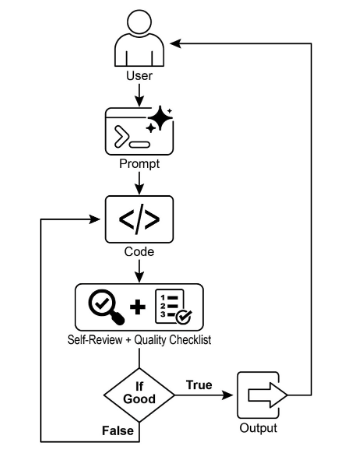
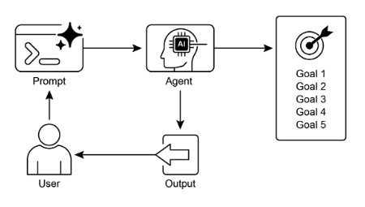

# 第 11 章：目標設定與監控

為了使人工智慧代理真正有效且有目的，他們需要的不僅僅是處理資訊或使用工具的能力；他們需要清晰的方向感和知道自己是否真正成功的方法。這就是目標設定和監控模式發揮作用的地方。它是為代理提供具體的工作目標，並為他們提供追蹤進度並確定這些目標是否已實現的方法。

## 目標設定與監控模式概述

考慮計劃一次旅行。您不會自發性地出現在目的地。你決定你想去哪裡（目標狀態），弄清楚你從哪裡出發（初始狀態），考慮可用的選項（交通、路線、預算），然後製定一系列步驟：訂票、收拾行李、前往機場/車站、登上交通工具、到達、尋找住宿等。這個循序漸進的過程通常會考慮依賴性和約束，這就是我們在代理系統中進行規劃的根本意義。

在人工智慧代理的背景下，規劃通常涉及代理採取高級目標並自主或半自主地產生一系列中間步驟或子目標。然後，這些步驟可以按順序執行或以更複雜的流程執行，可能涉及其他模式，例如工具使用、路由或多代理協作。規劃機制可能涉及複雜的搜尋演算法、邏輯推理，或越來越多地利用大型語言模型 (LLM) 的功能，根據訓練資料和對任務的理解產生合理且有效的計劃。

良好的規劃能力使代理能夠解決不簡單的單步查詢問題。它使他們能夠處理多方面的請求，透過重新規劃來適應不斷變化的環境，並協調複雜的工作流程。它是支撐許多高階代理行為的基礎模式，將簡單的反應系統轉變為可以主動實現既定目標的系統。

## 實際應用和用例

目標設定和監控模式對於建立能夠在複雜的現實場景中自主可靠運作的代理至關重要。以下是一些實際應用：

* **客戶支援自動化：** 代理的目標可能是「解決客戶的帳單查詢」。它監視對話、檢查資料庫條目並使用工具調整計費。透過確認帳單變更和收到正面的客戶回饋來監控成功情況。如果問題無法解決，問題就會升級。  
* **個人化學習系統：** 學習代理的目標可能是「提高學生對代數的理解」。它監控學生的練習進度，調整教材，追蹤準確性和完成時間等表現指標，並在學生遇到困難時調整其方法。  
* **專案管理助理：** 代理的任務是「確保專案里程碑 X 在 Y 日期之前完成」。它監控任務狀態、團隊溝通和資源可用性，標記延遲並在目標面臨風險時建議糾正措施。  
* **自動交易機器人：** 交易代理的目標可能是「在保持風險承受能力範圍內的同時最大化投資組合收益」。它持續監控市場數據、當前投資組合價值和風險指標，在條件符合其目標時執行交易，並在風險閾值被突破時調整策略。  
* **機器人和自動駕駛汽車：** 自動駕駛汽車的主要目標是「安全地將乘客從 A 地運送到 B 地」。它不斷監控其環境（其他車輛、行人、交通號誌）、自身狀態（速度、燃油）以及沿著計畫路線的進度，調整其駕駛行為以安全且有效率地實現目標。  
* **內容審核：** 代理的目標可能是「識別並刪除平台 X 上的有害內容」。它監控傳入的內容，應用分類模型，並追蹤誤報/漏報等指標，調整其過濾標準或將不明確的案例上報給人工審核員。

這種模式對於需要可靠運作、實現特定結果並適應動態條件的代理至關重要，為智慧自我管理提供了必要的框架。

## 實踐程式碼範例

為了說明目標設定和監控模式，我們有一個使用 LangChain 和 OpenAI API 的範例。這個 Python 腳本概述了一個旨在產生和優化 Python 程式碼的自主 AI 代理。其核心功能是為特定問題提供解決方案，確保遵守使用者定義的品質基準。

它採用「目標設定和監控」模式，不僅產生一次程式碼，而是進入創建、自我評估和改進的迭代循環。代理的成功是透過其自身的人工智慧驅動判斷產生的程式碼是否成功滿足初始目標來衡量的。最終的輸出是一個經過修飾、註釋且隨時可用的 Python 文件，它代表了這個細化過程的頂峰。

**依賴關係**：

```python
pip install langchain_openai openai python-dotenv .env file with key in OPENAI_API_KEY
```

您可以透過將其想像為分配給某個專案的自主 AI 程式設計師來最好地理解該腳本（請參閱圖 1）。當你向人工智慧提供詳細的專案簡介時，這個過程就開始了，這是它需要解決的具體編碼問題。

```python
# MIT License
# Copyright (c) 2025 Mahtab Syed
# https://www.linkedin.com/in/mahtabsyed/

"""
Hands-On Code Example - Iteration 2
-  To illustrate the Goal Setting and Monitoring pattern, we have an example using LangChain and OpenAI APIs:

Objective: Build an AI Agent which can write code for a specified use case based on specified goals:
-  Accepts a coding problem (use case) in code or can be as input.
-  Accepts a list of goals (e.g., "simple", "tested", "handles edge cases")  in code or can be input.
-  Uses an LLM (like GPT-4o) to generate and refine Python code until the goals are met. (I am using max 5 iterations, this could be based on a set goal as well)
-  To check if we have met our goals I am asking the LLM to judge this and answer just True or False which makes it easier to stop the iterations.
-  Saves the final code in a .py file with a clean filename and a header comment.
"""

import os
import random
import re
from pathlib import Path

from langchain_openai import ChatOpenAI
from dotenv import load_dotenv, find_dotenv


# 🔐 Load environment variables
_ = load_dotenv(find_dotenv())
OPENAI_API_KEY = os.getenv("OPENAI_API_KEY")
if not OPENAI_API_KEY:
    raise EnvironmentError("❌ Please set the OPENAI_API_KEY environment variable.")

# ✅ Initialize OpenAI model
print("📡 Initializing OpenAI LLM (gpt-4o)...")
llm = ChatOpenAI(
    model="gpt-4o",  # If you dont have access to got-4o use other OpenAI LLMs
    temperature=0.3,
    openai_api_key=OPENAI_API_KEY,
)


# --- Utility Functions ---
def generate_prompt(
    use_case: str, goals: list[str], previous_code: str = "", feedback: str = ""
) -> str:
    print("📝 Constructing prompt for code generation...")
    base_prompt = f"""
You are an AI coding agent. Your job is to write Python code based on the following use case:

Use Case: {use_case}

Your goals are:
{chr(10).join(f"- {g.strip()}" for g in goals)}
"""
    if previous_code:
        print("🔄 Adding previous code to the prompt for refinement.")
        base_prompt += f"\nPreviously generated code:\n{previous_code}"
    if feedback:
        print("📋 Including feedback for revision.")
        base_prompt += f"\nFeedback on previous version:\n{feedback}\n"

    base_prompt += "\nPlease return only the revised Python code. Do not include comments or explanations outside the code."
    return base_prompt


def get_code_feedback(code: str, goals: list[str]) -> str:
    print("🔍 Evaluating code against the goals...")
    feedback_prompt = f"""
You are a Python code reviewer. A code snippet is shown below. Based on the following goals:

{chr(10).join(f"- {g.strip()}" for g in goals)}

Please critique this code and identify if the goals are met. Mention if improvements are needed for clarity, simplicity, correctness, edge case handling, or test coverage.

Code:
{code}
"""
    return llm.invoke(feedback_prompt)


def goals_met(feedback_text: str, goals: list[str]) -> bool:
    """
    Uses the LLM to evaluate whether the goals have been met based on the feedback text.
    Returns True or False (parsed from LLM output).
    """
    review_prompt = f"""
You are an AI reviewer.

Here are the goals:
{chr(10).join(f"- {g.strip()}" for g in goals)}

Here is the feedback on the code:
\"\"\"
{feedback_text}
\"\"\"

Based on the feedback above, have the goals been met?

Respond with only one word: True or False.
"""
    response = llm.invoke(review_prompt).content.strip().lower()
    return response == "true"


def clean_code_block(code: str) -> str:
    lines = code.strip().splitlines()
    if lines and lines[0].strip().startswith("```"):
        lines = lines[1:]
    if lines and lines[-1].strip() == "```":
        lines = lines[:-1]
    return "\n".join(lines).strip()


def add_comment_header(code: str, use_case: str) -> str:
    comment = f"# This Python program implements the following use case:\n# {use_case.strip()}\n"
    return comment + "\n" + code


def to_snake_case(text: str) -> str:
    text = re.sub(r"[^a-zA-Z0-9 ]", "", text)
    return re.sub(r"\s+", "_", text.strip().lower())


def save_code_to_file(code: str, use_case: str) -> str:
    print("💾 Saving final code to file...")

    summary_prompt = (
        f"Summarize the following use case into a single lowercase word or phrase, "
        f"no more than 10 characters, suitable for a Python filename:\n\n{use_case}"
    )
    raw_summary = llm.invoke(summary_prompt).content.strip()
    short_name = re.sub(r"[^a-zA-Z0-9_]", "", raw_summary.replace(" ", "_").lower())[:10]

    random_suffix = str(random.randint(1000, 9999))
    filename = f"{short_name}_{random_suffix}.py"
    filepath = Path.cwd() / filename

    with open(filepath, "w") as f:
        f.write(code)

    print(f"✅ Code saved to: {filepath}")
    return str(filepath)


# --- Main Agent Function ---
def run_code_agent(use_case: str, goals_input: str, max_iterations: int = 5) -> str:
    goals = [g.strip() for g in goals_input.split(",")]

    print(f"\n🎯 Use Case: {use_case}")
    print("🎯 Goals:")
    for g in goals:
        print(f"  - {g}")

    previous_code = ""
    feedback = ""

    for i in range(max_iterations):
        print(f"\n=== 🔁 Iteration {i + 1} of {max_iterations} ===")
        prompt = generate_prompt(
            use_case,
            goals,
            previous_code,
            feedback if isinstance(feedback, str) else feedback.content,
        )

        print("🚧 Generating code...")
        code_response = llm.invoke(prompt)
        raw_code = code_response.content.strip()
        code = clean_code_block(raw_code)
        print("\n🧾 Generated Code:\n" + "-" * 50 + f"\n{code}\n" + "-" * 50)

        print("\n📤 Submitting code for feedback review...")
        feedback = get_code_feedback(code, goals)
        feedback_text = feedback.content.strip()
        print("\n📥 Feedback Received:\n" + "-" * 50 + f"\n{feedback_text}\n" + "-" * 50)

        if goals_met(feedback_text, goals):
            print("✅ LLM confirms goals are met. Stopping iteration.")
            break

        print("🛠️ Goals not fully met. Preparing for next iteration...")
        previous_code = code

    final_code = add_comment_header(code, use_case)
    return save_code_to_file(final_code, use_case)


# --- CLI Test Run ---
if __name__ == "__main__":
    print("\n🧠 Welcome to the AI Code Generation Agent")

    # Example 1
    use_case_input = "Write code to find BinaryGap of a given positive integer"
    goals_input = "Code simple to understand, Functionally correct, Handles comprehensive edge cases, Takes positive integer input only, prints the results with few examples"
    run_code_agent(use_case_input, goals_input)

    # Example 2
    # use_case_input = "Write code to count the number of files in current directory and all its nested sub directories, and print the total count"
    # goals_input = (
    #     "Code simple to understand, Functionally correct, Handles comprehensive edge cases, Ignore recommendations for performance, Ignore recommendations for test suite use like unittest or pytest"
    # )
    # run_code_agent(use_case_input, goals_input)

    # Example 3
    # use_case_input = "Write code which takes a command line input of a word doc or docx file and opens it and counts the number of words, and characters in it and prints all"
    # goals_input = "Code simple to understand, Functionally correct, Handles edge cases"
    # run_code_agent(use_case_input, goals_input)
```

除了這份簡介之外，您還提供了嚴格的品質檢查表，它代表了最終程式碼必須滿足的目標，例如「解決方案必須簡單」、「它必須在功能上正確」或「它需要處理意外的邊緣情況」。



圖 1：目標設定和監控範例

完成這項任務後，人工智慧程式設計師開始工作並編寫程式碼初稿。然而，它並沒有立即提交這個初始版本，而是暫停執行一個關鍵步驟：嚴格的自我審查。它會仔細地將自己的創作與您提供的品質檢查表上的每一項進行比較，充當自己的品質保證檢查員。經過這次檢查，它會對自己的進展做出一個簡單、公正的判斷：如果工作符合所有標準，則為「真」；如果未達到標準，則為「假」。

如果判決是“錯”，人工智慧不會放棄。它進入了深思熟慮的修改階段，利用自我批評的見解來找出弱點並聰明地重寫程式碼。這種起草、自我審查和完善的循環仍在繼續，每次迭代都旨在更接近目標。這個過程不斷重複，直到人工智慧透過滿足每個要求而最終達到「真實」狀態，或直到達到預定義的嘗試限制，就像開發人員在截止日期前工作一樣。一旦程式碼通過了最終檢查，腳本就會打包完善的解決方案，添加有用的註釋並將其保存到一個乾淨的新 Python 檔案中，以供使用。

**注意事項和注意事項：** 請務必注意，這是範例性說明，而不是可用於生產的程式碼。對於實際應用，必須考慮幾個因素。LLM可能無法完全掌握目標的預期含義，並可能錯誤地將其績效評估為成功。即使目標很好理解，模型也可能產生幻覺。當同一個LLM既負責編寫程式碼又負責判斷其品質時，可能更難發現程式碼走錯了方向。

最終，LLM不會神奇地產生完美的程式碼；您仍然需要運行並測試生成的程式碼。此外，簡單範例中的「監視」是基本的，並且會產生進程永遠運行的潛在風險。

```text
Act as an expert code reviewer with a deep commitment to producing clean, correct, and simple code. Your core mission is to eliminate code "hallucinations" by ensuring every suggestion is grounded in reality and best practices. When I provide you with a code snippet, I want you to: -- Identify and Correct Errors: Point out any logical flaws, bugs, or potential runtime errors. -- Simplify and Refactor: Suggest changes that make the code more readable, efficient, and maintainable without sacrificing correctness. -- Provide Clear Explanations: For every suggested change, explain why it is an improvement, referencing principles of clean code, performance, or security. -- Offer Corrected Code: Show the "before" and "after" of your suggested changes so the improvement is clear. Your feedback should be direct, constructive, and always aimed at improving the quality of the code.
```

更穩健的方法是透過為一組代理分配特定的角色來分離這些問題。例如，我使用 Gemini 建立了一個由 AI 代理組成的個人團隊，其中每個代理都有特定的角色：

* 同行程式設計師：幫助編寫程式碼並集思廣益。  
* 程式碼審查者：發現錯誤並提出改進建議。  
* 文件產生器：產生清晰簡潔的文件。  
* 測試編寫者：建立全面的單元測試。  
* Prompt Refiner：優化與人工智慧的互動。

在這個多代理系統中，代碼審查員作為與程式設計師代理分離的實體，具有類似於範例中的法官的提示，這顯著提高了評估的客觀性。這種結構自然會帶來更好的實踐，因為測試編寫器代理可以滿足為對等程式設計師產生的程式碼編寫單元測試的需求。

我將添加這些更複雜的控制項並使程式碼更接近生產就緒的任務留給有興趣的讀者。

## 概覽

**內容**：人工智慧代理通常缺乏明確的方向，導致它們無法有目的地執行簡單、反應性任務以外的任務。如果沒有明確的目標，他們就無法獨立解決複雜的多步驟問題或協調複雜的工作流程。此外，他們沒有固有的機制來確定他們的行為是否會帶來成功的結果。這限制了他們的自主權，並阻止他們在動態的、現實世界的場景中真正有效，在這些場景中，僅僅執行任務是不夠的。

**為什麼**：目標設定和監控模式透過將目的感和自我評估嵌入到代理系統中來提供標準化的解決方案。它涉及明確定義代理要實現的清晰、可衡量的目標。同時，它建立了一個監控機制，根據這些目標持續追蹤代理的進度及其環境狀態。這創建了一個關鍵的回饋循環，使代理能夠評估其績效，糾正其路線，並在偏離成功之路時調整其計劃。透過實現這種模式，開發人員可以將簡單的反應性代理轉變為能夠自主可靠運作的主動的、目標導向的系統。

**經驗法則**：當人工智慧代理必須自主執行多步驟任務、適應動態條件並可靠地實現特定的高級目標而無需持續的人工幹預時，請使用此模式。

**視覺總結**：



圖2：目標設計模式

## 要點

主要要點包括：

* 目標設定和監控為代理提供追蹤進度的目的和機制。  
* 目標應該是具體、可衡量、可實現、相關且有時限（SMART）。  
* 明確定義指標和成功標準對於有效監控至關重要。  
* 監控涉及觀察代理行為、環境狀態和工具輸出。  
* 監控的回饋循環允許代理適應、修改計劃或升級問題。  
* 在Google的ADK中，目標通常透過代理指令來傳達，並透過狀態管理和工具互動來完成監控。

## 結論

本章重點在於目標設定和監控的關鍵範式。我強調了這個概念如何將人工智慧代理從單純的反應性系統轉變為主動的、目標驅動的實體。案文強調了定義明確、可衡量的目標並建立嚴格的監測程序來追蹤進展的重要性。實際應用展示了該範例如何支援跨多個領域（包括客戶服務和機器人技術）的可靠自主操作。概念性程式設計範例說明了這些原則在結構化框架內的實現，使用代理指令和狀態管理來指導和評估代理實現其指定目標的情況。最終，讓智能體具備制定和監督目標的能力是建立真正智慧和負責任的人工智慧系統的基本步驟。

## 參考

1. 智能目標框架。 [https://en.wikipedia.org/wiki/SMART\_criteria](https://en.wikipedia.org/wiki/SMART_criteria)
