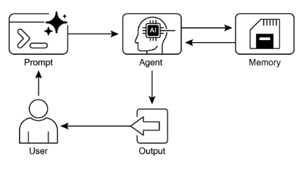

# 第 8 章：記憶體管理

有效的記憶體管理對於智慧代理保留資訊至關重要。代理需要不同類型的記憶，就像人類一樣，才能有效運作。本章深入研究記憶體管理，特別是解決代理的即時（短期）和持久（長期）記憶體需求。

在代理系統中，記憶是指代理保留和利用過去互動、觀察和學習經驗中的資訊的能力。此功能使代理能夠做出明智的決策、維護對話上下文並隨著時間的推移進行改進。代理記憶體通常分為兩種主要類型：

* **短期記憶（情境記憶）：** 與工作記憶類似，它保存目前正在處理或最近訪問的資訊。對於使用大型語言模型（LLM）的代理來說，短期記憶主要存在於情境視窗內。該視窗包含最近的訊息、代理回應、工具使用結果以及當前互動的代理反映，所有這些都通知 LLM 的後續回應和操作。上下文視窗的容量有限，限制了代理可以直接存取的最新資訊量。有效的短期記憶管理涉及在有限的空間內保留最相關的訊息，可能透過總結較舊的對話片段或強調關鍵細節等技術。具有「長上下文」視窗的模型的出現只是擴展了短期記憶的大小，從而允許在單次互動中保存更多資訊。然而，這種上下文仍然是短暫的，一旦會話結束就會丟失，並且每次處理都可能成本高昂且效率低下。因此，智能體需要單獨的記憶類型來實現真正的持久性，從過去的互動中回憶訊息，並建立持久的知識庫。  
* **長期記憶（持久記憶）：** 這充當代理需要在各種互動、任務或長時間內保留的資訊儲存庫，類似於長期知識庫。資料通常儲存在代理的直接處理環境之外，通常儲存在資料庫、知識圖或向量資料庫中。在向量資料庫中，資訊被轉換為數值向量並儲存，使代理能夠基於語義相似性而不是精確的關鍵字匹配來檢索數據，這一過程稱為語義搜尋。當智能體需要長期記憶中的信息時，它會查詢外部儲存，檢索相關數據，並將其集成到短期上下文中以供立即使用，從而將先驗知識與當前交互結合。

## 實際應用和用例

記憶體管理對於代理追蹤資訊並隨著時間的推移智慧執行至關重要。這對於代理超越基本的問答能力至關重要。應用包括：

* **聊天機器人和對話式人工智慧：** 維持對話流程依賴短期記憶。聊天機器人需要記住先前的使用者輸入以提供連貫的回應。長期記憶使聊天機器人能夠回憶起使用者偏好、過去的問題或先前的討論，從而提供個人化和持續的互動。  
* **任務導向的代理：** 管理多步驟任務的代理需要短期記憶來追蹤先前的步驟、當前的進度和總體目標。此資訊可能駐留在任務的上下文或暫存中。長期記憶對於存取非直接情境中的特定使用者相關資料至關重要。  
* **個人化體驗：** 提供客製化互動的代理利用長期記憶來儲存和檢索使用者偏好、過去的行為和個人資訊。這使得代理能夠調整他們的回應和建議。  
* **學習與改進：** 代理可以透過從過去的互動中學習來改進他們的表現。成功的策略、錯誤和新資訊都會儲存在長期記憶中，以利於未來的適應。強化學習代理以這種方式儲存學習的策略或知識。  
* **資訊檢索（RAG）：** 為回答問題而設計的代理存取知識庫，即它們的長期記憶，通常在檢索增強生成（RAG）中實現。代理檢索相關文件或資料以通知其回應。  
* **自主系統：** 機器人或自動駕駛汽車需要地圖、路線、物體位置和學習行為的記憶體。這涉及對周圍環境的短期記憶和對一般環境知識的長期記憶。

記憶使智能體能夠維護歷史、學習、個人化互動以及管理複雜的、與時間相關的問題。

## 實作程式碼：Google 代理 Developer Kit (ADK) 中的記憶體管理

Google 代理 Developer Kit (ADK) 提供了一種用於管理上下文和記憶體的結構化方法，包括實際應用的元件。穩固掌握 ADK 的會話、狀態和記憶體對於建立需要保留資訊的代理至關重要。

就像在人類互動中一樣，智能體需要能夠回想起先前的交流來進行連貫、自然的對話。 ADK 透過三個核心概念及其相關服務簡化了情境管理。

與代理的每次互動都可以被視為一個獨特的對話線程。代理可能需要存取早期互動中的資料。 ADK 的架構如下：

* **會話：** 一個單獨的聊天線程，用於記錄該特定互動的訊息和操作（事件），也儲存與該對話相關的臨時資料（狀態）。  
* **狀態 (`session.state`)：** 會話中儲存的數據，包含僅與目前活動聊天執行緒相關的資訊。  
* **記憶體：** 來自各種過去的聊天或外部來源的可搜尋資訊儲存庫，作為即時對話以外的資料檢索資源。

ADK 提供專門的服務來管理建置複雜、有狀態和上下文感知代理所需的關鍵元件。 SessionService 透過處理聊天線程（Session 物件）的啟動、記錄和終止來管理聊天線程，而 MemoryService 則監督長期知識（記憶體）的儲存和檢索。

SessionService和MemoryService都提供了多種設定選項，讓使用者可以根據應用需求選擇儲存方式。記憶體中選項可用於測試目的，但資料不會在重新啟動後保留。為了持久儲存和可擴展性，ADK還支援資料庫和基於雲端的服務。

### 會話：追蹤每次聊天

ADK 中的 Session 物件旨在追蹤和管理各個聊天執行緒。啟動與代理的對話後，SessionService 會產生一個 Session 對象，表示為 `google.adk.sessions.Session`。此物件封裝與特定對話執行緒相關的所有數據，包括唯一識別碼（`id`、`app\_name`、`user\_id`）、作為事件物件的事件的時間記錄、稱為狀態的特定於工作階段的資料的儲存區域以及指示臨時更新的時間物件（開發人員通常透過 SessionService 間接與 Session 物件互動。 SessionService 負責管理對話會話的生命週期，其中包括啟動新會話、恢復先前的會話、記錄會話活動（包括狀態更新）、識別活動會話以及管理會話資料的刪除。 ADK 提供了多種 SessionService 實現，這些實現具有不同的會話歷史記錄和臨時資料儲存機制，例如 InMemorySessionService，它適合測試，但不提供跨應用程式重新啟動的資料持久性。

```python
# Example: Using InMemorySessionService 
# This is suitable for local development and testing where data 
# persistence across application restarts is not required. 
from google.adk.sessions import InMemorySessionService
session_service = InMemorySessionService()
```

如果您希望可靠地儲存到您管理的資料庫中，那麼可以使用 DatabaseSessionService。

```python
# Example: Using DatabaseSessionService 
# This is suitable for production or development requiring persistent storage. 
# You need to configure a database URL (e.g., for SQLite, PostgreSQL, etc.). 
# Requires: pip install google-adk[sqlalchemy] and a database driver (e.g., psycopg2 for PostgreSQL) 
from google.adk.sessions import DatabaseSessionService 
# Example using a local SQLite file: 
db_url = "sqlite:///./my_agent_data.db"
session_service = DatabaseSessionService(db_url=db_url)
```

此外，還有 VertexAiSessionService，它使用 Vertex AI 基礎架構在 Google Cloud 上進行可擴展生產。

```python
# Example: Using VertexAiSessionService
# This is suitable for scalable production on Google Cloud Platform, leveraging
# Vertex AI infrastructure for session management.
# Requires: pip install google-adk[vertexai] and GCP setup/authentication

from google.adk.sessions import VertexAiSessionService


PROJECT_ID = "your-gcp-project-id"  # Replace with your GCP project ID
LOCATION = "us-central1"  # Replace with your desired GCP location

# The app_name used with this service should correspond to the Reasoning Engine ID or name
REASONING_ENGINE_APP_NAME = (
    "projects/your-gcp-project-id/locations/us-central1/reasoningEngines/your-engine-id"
)  # Replace with your Reasoning Engine resource name

session_service = VertexAiSessionService(project=PROJECT_ID, location=LOCATION)

# When using this service, pass REASONING_ENGINE_APP_NAME to service methods:
# session_service.create_session(app_name=REASONING_ENGINE_APP_NAME, ...)
# session_service.get_session(app_name=REASONING_ENGINE_APP_NAME, ...)
# session_service.append_event(session, event, app_name=REASONING_ENGINE_APP_NAME)
# session_service.delete_session(app_name=REASONING_ENGINE_APP_NAME, ...)
```

選擇合適的 SessionService 至關重要，因為它決定了代理的交互歷史記錄和臨時資料的儲存方式及其持久性。

每個訊息交換都涉及一個循環過程：接收訊息，Runner 使用 SessionService 檢索或建立會話，代理使用會話的上下文（狀態和歷史交互）處理訊息，代理產生回應並可能更新狀態，Runner 將其封裝為事件，`session\_service.append\_event` 方法記錄新事件並更新儲存中的狀態。然後會話等待下一則訊息。理想情況下，交互結束時使用 `delete\_session` 方法終止會話。此過程說明了 SessionService 如何透過管理特定於會話的歷史記錄和臨時資料來保持連續性。

### 狀態：會話的便條本

在 ADK 中，每個會話代表一個聊天線程，包含一個狀態元件，類似於代理在特定對話期間的臨時工作記憶體。 session.events 記錄整個聊天歷史記錄，而 session.state 儲存並更新與活動聊天相關的動態資料點。

從根本上講，session.state 作為字典運行，將資料儲存為鍵值對。其核心功能是使代理能夠保留和管理連貫對話所必需的細節，例如使用者偏好、任務進度、增量資料收集或影響後續代理操作的條件標誌。

狀態的結構包含與可序列化 Python 類型的值配對的字串鍵，包括包含這些基本類型的字串、數字、布林值、列表和字典。狀態是動態的，在整個對話過程中不斷變化。這些變更的持久性取決於配置的 SessionService。

狀態組織可以使用鍵前綴來定義資料範圍和持久性來實現。沒有前綴的密鑰是特定於會話的。

* user: 前綴將所有會話中的資料與使用者 ID 相關聯。
* app: 前綴表示應用程式的所有使用者之間共享的資料。
* temp: 前綴表示資料僅對目前處理回合有效，且不會持久儲存。

代理透過單一 session.state 字典存取所有狀態資料。 SessionService 處理資料檢索、合併和持久化。透過 `session\_service.append\_event()` 將事件新增至會話歷史記錄後，應更新狀態。這確保了準確的追蹤、持久服務的正確保存以及狀態變更的安全處理。

#### 1. 簡單方法：使用 `output\_key` （用於代理文字回應）

如果您只想將代理的最終文字回應直接儲存到狀態中，這是最簡單的方法。當您設定 LlmAgent 時，只需告訴它您要使用的輸出\_key 即可。 Runner 會看到這一點，並在附加事件時自動建立必要的動作來儲存對狀態的回應。讓我們來看一個程式碼範例，示範透過 `output\_key` 進行狀態更新。

```python
# Import necessary classes from the Google Agent Developer Kit (ADK)
from google.adk.agents import LlmAgent
from google.adk.sessions import InMemorySessionService, Session
from google.adk.runners import Runner
from google.genai.types import Content, Part


# Define an LlmAgent with an output_key.
greeting_agent = LlmAgent(
 name="Greeter",
 model="gemini-2.0-flash",
 instruction="Generate a short, friendly greeting.",
 output_key="last_greeting",
)


# --- Setup Runner and Session ---
app_name, user_id, session_id = "state_app", "user1", "session1"

session_service = InMemorySessionService()

runner = Runner(
    agent=greeting_agent,
    app_name=app_name,
    session_service=session_service,
)

session = session_service.create_session(
    app_name=app_name,
    user_id=user_id,
    session_id=session_id,
)

print(f"Initial state: {session.state}")


# --- Run the Agent ---
user_message = Content(parts=[Part(text="Hello")])

print("\n--- Running the agent ---")
for event in runner.run(
    user_id=user_id,
    session_id=session_id,
    new_message=user_message,
):
    if event.is_final_response():
        print("Agent responded.")


# --- Check Updated State ---
# Correctly check the state after the runner has finished processing all events.
updated_session = session_service.get_session(app_name, user_id, session_id)
print(f"\nState after agent run: {updated_session.state}")
```

在幕後，Runner 會看到您的 `output\_key` 並在呼叫 `append\_event` 時自動使用 `state\_delta` 建立必要的操作。

#### 2. 標準方法：使用 `EventActions.state\_delta` （用於更複雜的更新）

有時，當您需要執行更複雜的操作（例如一次更新多個鍵、保存不僅僅是文本的內容、定位特定範圍（如 user: 或 app:）或進行與代理的最終文本回复無關的更新時，您將手動構建狀態更改的字典（`state\_delta`）並將其包含在您要附加的事件的 EventActions 中。讓我們看一個例子：

```python
import time

from google.adk.tools.tool_context import ToolContext
from google.adk.sessions import InMemorySessionService


# --- Define the Recommended Tool-Based Approach ---
def log_user_login(tool_context: ToolContext) -> dict:
    """
    Updates the session state upon a user login event.
    This tool encapsulates all state changes related to a user login.

    Args:
        tool_context: Automatically provided by ADK, gives access to session state.

    Returns:
        A dictionary confirming the action was successful.
    """
    # Access the state directly through the provided context.
    state = tool_context.state

    # Get current values or defaults, then update the state.
    # This is much cleaner and co-locates the logic.
    login_count = state.get("user:login_count", 0) + 1
    state["user:login_count"] = login_count
    state["task_status"] = "active"
    state["user:last_login_ts"] = time.time()
    state["temp:validation_needed"] = True

    print("State updated from within the `log_user_login` tool.")

    return {
        "status": "success",
        "message": f"User login tracked. Total logins: {login_count}.",
    }


# --- Demonstration of Usage ---
# In a real application, an LLM Agent would decide to call this tool.
# Here, we simulate a direct call for demonstration purposes.

# 1. Setup
session_service = InMemorySessionService()
app_name, user_id, session_id = "state_app_tool", "user3", "session3"

session = session_service.create_session(
    app_name=app_name,
    user_id=user_id,
    session_id=session_id,
    state={"user:login_count": 0, "task_status": "idle"},
)

print(f"Initial state: {session.state}")

# 2. Simulate a tool call (in a real app, the ADK Runner does this)
# We create a ToolContext manually just for this standalone example.
from google.adk.tools.tool_context import InvocationContext

mock_context = ToolContext(
    invocation_context=InvocationContext(
        app_name=app_name,
        user_id=user_id,
        session_id=session_id,
        session=session,
        session_service=session_service,
    )
)

# 3. Execute the tool
log_user_login(mock_context)

# 4. Check the updated state
updated_session = session_service.get_session(app_name, user_id, session_id)
print(f"State after tool execution: {updated_session.state}")

# Expected output will show the same state change as the "Before" case,
# but the code organization is significantly cleaner and more robust.
```

此程式碼示範了一種基於工具的方法，用於管理應用程式中的使用者會話狀態。它定義了一個函數*log\_user\_login*，它作為一個工具。該工具負責在使用者登入時更新會話狀態。  
此函數採用 ADK 提供的 ToolContext 物件來存取和修改會話的狀態字典。在工具內部，它會增加 *user:login\_count*，將 t*ask\_status* 設為“active”，記錄 *user:last\_login\_ts（時間戳記）*，並新增臨時標誌 temp:validation\_needed。

程式碼的演示部分模擬如何使用該工具。它設定記憶體中會話服務並建立具有某種預定義狀態的初始會話。然後手動建立 ToolContext 以模擬 ADK Runner 執行該工具的環境。使用此模擬上下文呼叫 `log\_user\_login` 函數。最後，程式碼再次檢索會話以顯示狀態已透過工具的執行進行更新。目標是展示與在工具外部直接操作狀態相比，在工具中封裝狀態變更如何使程式碼更乾淨、更有組織。

請注意，強烈建議不要在檢索會話後直接修改 `session.state` 字典，因為它會繞過標準事件處理機制。此類直接變更不會記錄在會話的事件歷史記錄中，可能不會由所選的 `SessionService` 持久保存，可能會導致並發問題，並且不會更新時間戳等基本元資料。更新會話狀態的建議方法是在 `LlmAgent` 上使用 `output\_key` 參數（特別是針對代理的最終文字回應），或在透過 `session\_service.append\_event()` 附加事件時在 __MARKWN___PLACEHOLDER_48___PLACE 中包含狀態變更。 `session.state` 主要用於讀取現有資料。

回顧一下，在設計狀態時，保持簡單，使用基本資料類型，為鍵提供清晰的名稱並正確使用前綴，避免深層嵌套，並始終使用append_event過程更新狀態。

## 記憶體：MemoryService 的長期知識

在代理系统中，会话组件维护当前聊天历史记录（事件）和特定于单个对话的临时数据（状态）的记录。然而，对于代理来说，要在多次交互中保留信息或访问外部数据，长期的知识管理是必要的。 MemoryService 促進了這一點。

```python
# Example: Using InMemoryMemoryService
# This is suitable for local development and testing where data
# persistence across application restarts is not required.
# Memory content is lost when the app stops.

from google.adk.memory import InMemoryMemoryService

memory_service = InMemoryMemoryService()
```

會話和狀態可以概念化為單一聊天會話的短期記憶，而由 MemoryService 管理的長期知識則充當持久且可搜尋的儲存庫。此儲存庫可能包含來自多個過去互動或外部來源的資訊。由 BaseMemoryService 介面定義的 MemoryService 建立了管理這種可搜尋的長期知識的標準。其主要功能包括添加資訊（涉及從會話中提取內容並使用 add\_session\_to\_memory 方法儲存它）和檢索資訊（這允許代理使用 search\_memory 方法查詢儲存並接收相關資料）。

ADK 提供了多種用於建立此長期知識儲存的實作。 InMemoryMemoryService 提供了適合測試目的的暫存解決方案，但在應用程式重新啟動時不會保留資料。對於生產環境，通常使用 VertexAiRagMemoryService。本服務利用 Google Cloud 的檢索增強生成 (RAG) 服務，實現可擴展、持久和語義搜尋功能（另請參閱有關 RAG 的第 14 章）。

```python
# Example: Using VertexAiRagMemoryService
# This is suitable for scalable production on GCP, leveraging
# Vertex AI RAG (Retrieval Augmented Generation) for persistent,
# searchable memory.
# Requires: pip install google-adk[vertexai], GCP
# setup/authentication, and a Vertex AI RAG Corpus.

from google.adk.memory import VertexAiRagMemoryService


# The resource name of your Vertex AI RAG Corpus
RAG_CORPUS_RESOURCE_NAME = (
    "projects/your-gcp-project-id/locations/us-central1/ragCorpora/your-corpus-id"
)  # Replace with your Corpus resource name

# Optional configuration for retrieval behavior
SIMILARITY_TOP_K = 5  # Number of top results to retrieve
VECTOR_DISTANCE_THRESHOLD = 0.7  # Threshold for vector similarity

memory_service = VertexAiRagMemoryService(
    rag_corpus=RAG_CORPUS_RESOURCE_NAME,
    similarity_top_k=SIMILARITY_TOP_K,
    vector_distance_threshold=VECTOR_DISTANCE_THRESHOLD,
)

# When using this service, methods like add_session_to_memory
# and search_memory will interact with the specified Vertex AI
# RAG Corpus.
```

## 動手程式碼：LangChain 和 LangGraph 中的記憶體管理

在 LangChain 和 LangGraph 中，記憶體是創建智慧且自然的對話應用程式的關鍵元件。它允許人工智慧代理記住過去互動中的信息，從回饋中學習並適應用戶偏好。 LangChain的記憶功能為此提供了基礎，透過引用儲存的歷史記錄來豐富當前的提示，然後記錄最新的交易以供將來使用。隨著代理處理更複雜的任務，此功能對於效率和使用者滿意度變得至關重要。

**短期記憶：** 這是線程範圍的，這意味著它跟踪單個會話或線程內正在進行的對話。它提供即時上下文，但完整的歷史記錄可能會挑戰LLM的上下文窗口，可能導致錯誤或性能不佳。 LangGraph 將短期記憶體作為代理狀態的一部分進行管理，該狀態透過檢查指標進行持久化，從而允許執行緒隨時恢復。

**長期記憶體：** 它跨會話儲存使用者特定或應用程式級數據，並在會話執行緒之間共享。它保存在自訂“命名空間”中，並且可以隨時在任何執行緒中呼叫。 LangGraph 提供儲存來保存和調用長期記憶，使代理能夠無限期地保留知識。

LangChain 提供了多種用於管理對話歷史記錄的工具，從手動控製到鏈內自動整合。

**ChatMessageHistory：手動記憶體管理。 ** 對於在正式鏈之外直接、簡單地控制對話歷史記錄，ChatMessageHistory 類別是理想的選擇。它允許手動追蹤對話交流。

```python
from langchain.memory import ChatMessageHistory


# Initialize the history object
history = ChatMessageHistory()

# Add user and AI messages
history.add_user_message("I'm heading to New York next week.")
history.add_ai_message("Great! It's a fantastic city.")

# Access the list of messages
print(history.messages)
```

**ConversationBufferMemory：鏈的自動記憶體**。為了將記憶體直接整合到鏈中，ConversationBufferMemory 是一個常見的選擇。它保存對話的緩衝區並使其可用於您的提示。可以使用兩個關鍵參數來自訂其行為：

* `memory\_key`：一個字串，指定提示中儲存聊天歷史記錄的變數名稱。它預設為“歷史”。  
* `return\_messages`：決定歷史格式的布林值。  
  * 如果 `False` （預設值），它會傳回單一格式化字串，這對於標準 LLM 來說是理想的。  
  * 如果`True`，它傳回訊息物件列表，這是聊天模型的建議格式。

```python
from langchain.memory import ConversationBufferMemory


# Initialize memory
memory = ConversationBufferMemory()

# Save a conversation turn
memory.save_context(
    {"input": "What's the weather like?"},
    {"output": "It's sunny today."},
)

# Load the memory as a string
print(memory.load_memory_variables({}))
```

將此記憶體整合到 LLMChain 中允許模型存取對話的歷史記錄並提供上下文相關的回應

```python
from langchain_openai import OpenAI
from langchain.chains import LLMChain
from langchain.prompts import PromptTemplate
from langchain.memory import ConversationBufferMemory


# 1. Define LLM and Prompt
llm = OpenAI(temperature=0)

template = """You are a helpful travel agent.
Previous conversation: {history}
New question: {question}
Response:"""
prompt = PromptTemplate.from_template(template)

# 2. Configure Memory
# The memory_key "history" matches the variable in the prompt
memory = ConversationBufferMemory(memory_key="history")

# 3. Build the Chain
conversation = LLMChain(llm=llm, prompt=prompt, memory=memory)

# 4. Run the Conversation
response = conversation.predict(question="I want to book a flight.")
print(response)

response = conversation.predict(question="My name is Sam, by the way.")
print(response)

response = conversation.predict(question="What was my name again?")
print(response)
```

為了提高聊天模型的有效性，建議透過設定 \`return\_messages=True\` 來使用訊息物件的結構化清單。

```python
from langchain_openai import ChatOpenAI
from langchain.chains import LLMChain
from langchain.memory import ConversationBufferMemory
from langchain_core.prompts import (
    ChatPromptTemplate,
    MessagesPlaceholder,
    SystemMessagePromptTemplate,
    HumanMessagePromptTemplate,
)


# 1. Define Chat Model and Prompt
llm = ChatOpenAI()

prompt = ChatPromptTemplate(
    messages=[
        SystemMessagePromptTemplate.from_template("You are a friendly assistant."),
        MessagesPlaceholder(variable_name="chat_history"),
        HumanMessagePromptTemplate.from_template("{question}"),
    ]
)

# 2. Configure Memory
# return_messages=True is essential for chat models
memory = ConversationBufferMemory(memory_key="chat_history", return_messages=True)

# 3. Build the Chain
conversation = LLMChain(llm=llm, prompt=prompt, memory=memory)

# 4. Run the Conversation
response = conversation.predict(question="Hi, I'm Jane.")
print(response)

response = conversation.predict(question="Do you remember my name?")
print(response)
```

**長期記憶的類型**：長期記憶允許系統保留不同對話中的信息，提供更深層的脈絡和個人化。類似人類記憶，它可以分為三種：

* **語意記憶：記住事實：** 這涉及保留特定的事實和概念，例如使用者偏好或領域知識。它用於為座席的回應奠定基礎，從而實現更個人化和相關的互動。這些資訊可以作為持續更新的使用者「設定檔」（JSON 文件）或作為單一事實文件的「集合」進行管理。  
* **情景記憶：記住經驗：** 這涉及回憶過去的事件或行為。對於人工智慧代理來說，情景記憶通常用於記住如何完成任務。在實踐中，它經常透過少量範例提示來實現，其中代理從過去成功的互動序列中學習以正確執行任務。  
* **程序記憶：記住規則：** 這是如何執行任務的記憶－代理的核心指令和行為，通常包含在其係統提示中。代理修改自己的提示以適應和改進是很常見的。一種有效的技術是“反思”，即向代理提示其當前指令和最近的交互，然後要求其完善自己的指令。

下面的偽代碼示範了代理如何使用反思來更新儲存在 LangGraph BaseStore 中的程式記憶體

```python
# Node that updates the agent's instructions
def update_instructions(state: State, store: BaseStore):
    namespace = ("instructions",)

    # Get the current instructions from the store
    current_instructions = store.search(namespace)[0]

    # Create a prompt to ask the LLM to reflect on the conversation
    # and generate new, improved instructions
    prompt = prompt_template.format(
        instructions=current_instructions.value["instructions"],
        conversation=state["messages"],
    )

    # Get the new instructions from the LLM
    output = llm.invoke(prompt)
    new_instructions = output["new_instructions"]

    # Save the updated instructions back to the store
    store.put(("agent_instructions",), "agent_a", {"instructions": new_instructions})


# Node that uses the instructions to generate a response
def call_model(state: State, store: BaseStore):
    namespace = ("agent_instructions",)

    # Retrieve the latest instructions from the store
    instructions = store.get(namespace, key="agent_a")[0]

    # Use the retrieved instructions to format the prompt
    prompt = prompt_template.format(
        instructions=instructions.value["instructions"]
    )
    # ... application logic continues
```

LangGraph 將長期記憶儲存為 JSON 文件儲存在儲存中。每個記憶體都組織在自訂命名空間（如資料夾）和不同的鍵（如檔案名稱）下。這種層次結構可以輕鬆組織和檢索資訊。以下程式碼示範如何使用 InMemoryStore 來放置、取得和搜尋記憶體。

```python
from langgraph.store.memory import InMemoryStore


# A placeholder for a real embedding function
def embed(texts: list[str]) -> list[list[float]]:
    # In a real application, use a proper embedding model
    return [[1.0, 2.0] for _ in texts]


# Initialize an in-memory store. For production, use a database-backed store.
store = InMemoryStore(index={"embed": embed, "dims": 2})

# Define a namespace for a specific user and application context
user_id = "my-user"
application_context = "chitchat"
namespace = (user_id, application_context)

# 1. Put a memory into the store
store.put(
    namespace,
    "a-memory",  # The key for this memory
    {
        "rules": [
            "User likes short, direct language",
            "User only speaks English & python",
        ],
        "my-key": "my-value",
    },
)

# 2. Get the memory by its namespace and key
item = store.get(namespace, "a-memory")
print("Retrieved Item:", item)

# 3. Search for memories within the namespace, filtering by content
# and sorting by vector similarity to the query.
items = store.search(
    namespace,
    filter={"my-key": "my-value"},
    query="language preferences",
)
print("Search Results:", items)
```

## 頂點記憶體庫

Memory Bank 是 Vertex AI 代理 Engine 中的一項託管服務，為代理提供持久的長期記憶體。該服務使用 Gemini 模型非同步分析對話歷史記錄，以提取關鍵事實和使用者偏好。

這些資訊被持久儲存，按用戶 ID 等定義的範圍進行組織，並智慧更新以整合新數據並解決矛盾。開始新會話後，代理透過完整資料呼叫或使用嵌入的相似性搜尋來檢索相關記憶。此过程允许代理保持会话的连续性，并根据召回的信息个性化响应。

代理的運行程序與首先初始化的 VertexAiMemoryBankService 進行互動。此服務處理代理對話期間產生的記憶的自動儲存。每個記憶體都標有唯一的 USER\_ID 和 APP\_NAME，確保將來準確檢索。

```python
from google.adk.memory import VertexAiMemoryBankService


agent_engine_id = agent_engine.api_resource.name.split("/")[-1]

memory_service = VertexAiMemoryBankService(
    project="PROJECT_ID",
    location="LOCATION",
    agent_engine_id=agent_engine_id,
)

session = await session_service.get_session(
    app_name=app_name,
    user_id="USER_ID",
    session_id=session.id,
)

await memory_service.add_session_to_memory(session)
```

Memory Bank 與 Google ADK 無縫集成，提供即時開箱即用的體驗。對於其他代理框架（例如 LangGraph 和 CrewAI）的用戶，Memory Bank 也透過直接 API 呼叫提供支援。有興趣的讀者可以隨時獲取演示這些整合的線上程式碼範例。

## 概覽

**什麼**：代理系統需要記住過去互動中的信息，以執行複雜的任務並提供連貫的體驗。如果沒有記憶機制，代理是無狀態的，無法維護對話情境、從經驗中學習或為使用者提供個人化回應。這從根本上限制了它們只能進行簡單的一次性交互，無法處理多步驟流程或不斷變化的用戶需求。核心問題是如何有效地管理單一對話的即時、臨時資訊和隨著時間的推移收集的大量、持久的知識。

**原因：** 標準化解決方案是實現區分短期儲存和長期儲存的雙組件儲存系統。短期情境記憶在LLM的脈絡視窗內保存最近的互動數據，以維持對話流程。對於必須持久的信息，長期記憶解決方案使用外部資料庫（通常是向量儲存）來進行高效的語義檢索。像 Google ADK 這樣的代理框架提供了特定的元件來管理它，例如用於會話執行緒的 Session 和用於其臨時資料的 State。專用的 MemoryService 用於與長期知識庫交互，允許代理檢索相關的過去資訊並將其合併到當前上下文中。

**經驗法則：** 當客服人員需要做的不僅僅是回答一個問題時，請使用此模式。對於必須在整個對話過程中保持上下文、追蹤多步驟任務的進度或透過呼叫使用者偏好和歷史記錄來個性化互動的代理來說，這一點至關重要。每當代理需要根據過去的成功、失敗或新獲得的資訊進行學習或適應時，就實施記憶體管理。

**視覺總結：**



圖1：記憶體管理設計模式

## 要點

快速回顧一下記憶體管理的要點：

* 記憶對於代理追蹤事物、學習和個人化互動來說非常重要。  
* 對話式人工智慧既依賴單次聊天中即時情境的短期記憶，也依賴多個會話中持久知識的長期記憶。  
* 短期记忆（即时的东西）是暂时的，通常受到法学硕士的上下文窗口或框架如何传递上下文的限制。  
* 長期記憶（持久的東西）使用向量資料庫等外部儲存來保存不同聊天中的信息，並透過搜尋進行存取。  
* 像 ADK 這樣的框架有特定的部分，如 Session（聊天線程）、State（臨時聊天資料）和 MemoryService（可搜尋的長期知識）來管理記憶體。  
* ADK 的 SessionService 處理聊天會話的整個生命週期，包括其歷史記錄（事件）和臨時資料（狀態）。  
* ADK的session.state是臨時聊天資料的字典。前綴（user:、app:、temp:）告訴您資料所屬的位置以及資料是否保留。  
* 在ADK中，新增事件時應使用EventActions.state\_delta或output\_key來更新狀態，而不是直接變更狀態字典。  
* ADK 的 MemoryService 用于将信息放入长期存储中并让代理通常使用工具进行搜索。  
* LangChain 提供 ConversationBufferMemory 等實用工具，自動將單一對話的歷史記錄注入提示中，讓客服人員能夠回憶起即時情境。  
* LangGraph 透過使用儲存來保存和檢索語義事實、情境體驗，甚至跨不同使用者會話的可更新程式規則，從而實現高級、長期記憶。  
* Memory Bank 是一項託管服務，透過自動提取、儲存和調用用戶特定訊息，為代理提供持久、長期的記憶，從而實現跨 Google ADK、LangGraph 和 CrewAI 等框架的個人化、連續對話。

## 結論

本章深入探討了代理系統記憶體管理的真正重要工作，展示了短暫的上下文和長期存在的知識之間的區別。我們討論了這些類型的記憶體是如何設定的，以及它們在建立能夠記住事物的智慧代理時的用途。我們詳細了解了 Google ADK 如何為您提供特定的部分（例如 Session、State 和 MemoryService）來處理此問題。現在我們已經介紹了智能體如何記住短期和長期的事情，我們可以繼續討論它們如何學習和適應。下一個模式「學習和適應」是關於智能體根據新的經驗或數據改變其思考、行為或知識的方式。

## 參考

1.ADK記憶體，[https://google.github.io/adk-docs/sessions/memory/](https://google.github.io/adk-docs/sessions/memory/)
2. LangGraph記憶體，[https://langchain-ai.github.io/langgraph/concepts/memory/](https://langchain-ai.github.io/langgraph/concepts/memory/)
3. Vertex AI 代理引擎記憶體庫，[https://cloud.google.com/blog/products/ai-machine-learning/vertex-ai-memory-bank-in-public-preview](https://cloud.google.com/blog/products/ai-machine-learning/vertex-ai-memory-bank-in-public-preview)
