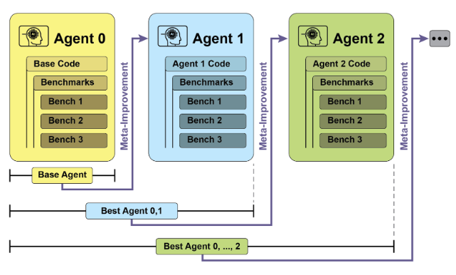
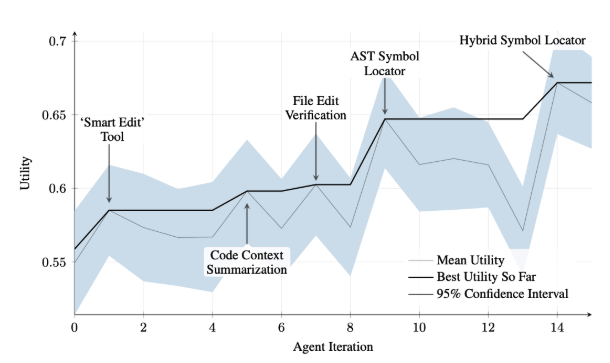
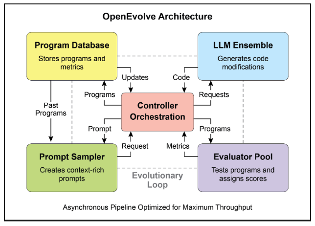
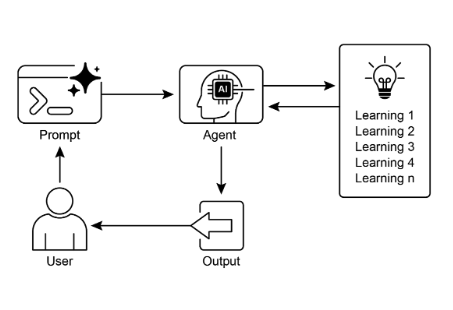

# 第 9 章：學習與適應

學習和適應對於增強人工智慧代理的能力至關重要。這些過程使代理能夠超越預先定義的參數，從而使它們能夠透過經驗和環境互動進行自主改進。透過學習和適應，代理可以有效地管理新情況並優化其性能，而無需持續的人工幹預。本章詳細探討了代理學習和適應的原理和機制。

## 大局觀

智能體透過根據新的經驗和數據改變思維、行動或知識來學習和適應。這使得代理能夠從簡單地遵循指令發展成為隨著時間的推移變得更加聰明。

* **強化學習：** 智能體嘗試採取行動，並因積極結果而獲得獎勵，因消極結果而受到懲罰，在不斷變化的情況下學習最佳行為。對於控制機器人或玩遊戲的代理很有用。  
* **監督學習：** 代理從標記的範例中學習，將輸入連接到所需的輸出，從而實現決策和模式識別等任務。非常適合代理對電子郵件進行排序或預測趨勢。  
* **無監督學習：** 代理發現未標記資料中隱藏的聯繫和模式，有助於洞察、組織並創建其環境的心理地圖。對於在沒有特定指導的情況下探索數據的代理很有用。  
* **使用基於 LLM 的代理進行少樣本/零樣本學習：** 利用 LLM 的代理可以透過最少的範例或清晰的指令快速適應新任務，從而能夠快速回應新命令或情況。  
* **線上學習：** 智能體不斷用新數據更新知識，這對於動態環境中的即時反應和持續適應至關重要。對於處理連續資料流的代理至關重要。  
* **基於記憶的學習：** 智能體回想過去的經驗，以在類似情況下調整當前的行動，從而增強情境意識和決策。對於具有記憶回憶能力的特務有效。

代理透過基於學習改變策略、理解或目標來適應。這對於處於不可預測、變化或新環境中的代理來說至關重要。

**近端策略最佳化 (PPO)** 是一種強化學習演算法，用於在具有連續動作範圍的環境中訓練代理，例如控制機器人的關節或遊戲中的角色。其主要目標是可靠且穩定地改善代理的決策策略（稱為策略）。

PPO 背後的核心思想是對代理的政策進行小而仔細的更新。它避免了可能導致性能崩潰的劇烈變化。它的工作原理如下：

1. 收集資料：代理使用其當前策略與其環境互動（例如，玩遊戲）並收集一批經驗（狀態、動作、獎勵）。  
2. 評估「替代」目標：PPO 計算潛在的政策更新將如何改變預期獎勵。然而，它不只是最大化這個獎勵，而是使用一個特殊的「剪輯」目標函數。  
3. 「削波」機制：這是PPO穩定的關鍵。它圍繞著當前政策創建了一個「信任區域」或安全區域。防止演算法進行與當前策略相差太大的更新。這種剪裁就像一個安全制動器，確保智能體不會採取一個巨大的、危險的步驟來撤銷它的學習。

簡而言之，PPO 在提高績效與保持接近已知的工作策略之間取得平衡，這可以防止訓練期間發生災難性失敗並導致更穩定的學習。

**直接偏好最佳化 (DPO)** 是一種更新的方法，專門用於使大型語言模型 (LLM) 與人類偏好保持一致。它提供了一種比使用 PPO 來完成此任務更簡單、更直接的替代方案。

要理解DPO，首先需要了解傳統的基於PPO的對齊方法：

* PPO 方法（兩步驟過程）：
  1. 訓練獎勵模型：首先，您收集人類回饋數據，人們對不同的 LLM 回應進行評分或比較（例如，「回應 A 比回應 B 更好」）。這些數據用於訓練一個單獨的人工智慧模型，稱為獎勵模型，其工作是預測人類會對任何新反應給出什麼分數。  
  2.使用PPO微調：接下來，使用PPO對LLM進行微調。LLM的目標是產生從獎勵模型中獲得盡可能高分的答案。獎勵模型充當訓練遊戲中的“法官”。

這個兩步驟過程可能很複雜且不穩定。例如，LLM可能會發現一個漏洞，並學習「破解」獎勵模型，以獲得不良反應的高分。

* DPO 方法（直接流程）：DPO 完全跳過獎勵模型。 DPO 不是將人類偏好轉換為獎勵分數，然後針對該分數進行最佳化，而是直接使用偏好資料來更新 LLM 的政策。  
* 它的工作原理是使用數學關係將偏好資料直接連結到最優策略。它本質上教導模型：“增加生成諸如*首選*響應之類的響應的概率，並降低生成諸如*不喜歡*響應之類的響應的概率。”

本質上，DPO 透過直接優化人類偏好資料的語言模型來簡化對齊。這避免了訓練和使用單獨的獎勵模型的複雜性和潛在的不穩定性，使對齊過程更加高效和穩健。

## 實際應用和用例

自適應代理透過經驗資料驅動的迭代更新在可變環境中表現出增強的效能。

* **個人化助理代理** 透過對個人使用者行為的縱向分析來完善互動協議，確保高度優化的回應產生。  
* **交易機器人代理** 透過基於高解析度、即時市場資料動態調整模型參數來優化決策演算法，從而最大化財務回報並降低風險因素。  
* **應用程式代理** 透過基於觀察到的使用者行為的動態修改來優化使用者介面和功能，從而提高使用者參與度和系統直覺性。  
* **機器人和自動駕駛車輛代理**透過整合感測器數據和歷史動作分析來增強導航和響應能力，從而在不同的環境條件下實現安全高效的操作。  
* **詐欺偵測代理** 透過使用新識別的詐欺模式完善預測模型來改善異常檢測，增強系統安全性並最大限度地減少財務損失。  
* **推薦代理** 透過採用使用者偏好學習演算法來提高內容選擇精度，提供高度個人化和上下文相關的推薦。  
* **遊戲人工智慧代理** 透過動態調整策略演算法來增強玩家參與度，從而增加遊戲的複雜性和挑戰性。  
* **知識庫學習代理**：代理可以利用檢索增強生成（RAG）來維護問題描述和經過驗證的解決方案的動態知識庫（請參閱第 14 章）。透過儲存成功的策略和遇到的挑戰，智能體可以在決策過程中參考這些數據，從而能夠透過應用先前的成功模式或避免已知的陷阱來更有效地適應新情況。

## 案例研究：自我改進Coding Agent (SICA)

自我改進Coding Agent (SICA) 由 Maxime Robeyns、Laurence Aitchison 和 Martin Szummer 開發，代表了基於代理的學習的進步，展示了代理修改自身原始碼的能力。這與傳統方法形成鮮明對比，在傳統方法中，一個代理可以訓練另一個代理。 SICA 既充當修改者又充當被修改實體，迭代地完善其程式碼庫，以提高應對各種編碼挑戰的效能。

SICA的自我完善是透過一個迭代循環進行的（見圖1）。最初，SICA 會審查其過去版本的檔案及其在基準測試中的表現。它選擇性能得分最高的版本，該得分是根據考慮成功、時間和計算成本的加權公式計算得出的。這個選定的版本然後進行下一輪的自我修改。它分析存檔以識別潛在的改進，然後直接更改其程式碼庫。隨後根據基準測試修改後的代理，並將結果記錄在存檔中。這個過程不斷重複，有助於直接從過去的表現中學習。這種自我改進機制使 SICA 能夠在不需要傳統培訓模式的情況下發展其能力。



圖1：SICA在過去版本的基礎上的自我完善、學習與適應

SICA 進行了重大的自我改進，從而在程式碼編輯和導航方面取得了進展。最初，SICA 使用基本的文件覆蓋方法來更改程式碼。隨後，它開發了一個“智慧編輯器”，能夠進行更聰明和上下文編輯。這演變成了“差異增強型智慧編輯器”，合併了用於有針對性的修改和基於模式的編輯的差異，以及減少處理需求的“快速覆蓋工具”。

SICA 進一步實施了“最小差異輸出最佳化”和“上下文敏感差異最小化”，並使用抽象語法樹 (AST) 解析來提高效率。此外，還新增了「SmartEditor 輸入標準化器」。在導航方面，SICA 獨立創建了“AST 符號定位器”，使用程式碼的結構圖 (AST) 來識別程式碼庫中的定義。後來，開發了“混合符號定位器”，將快速搜尋與 AST 檢查相結合。透過「混合符號定位器中的最佳化 AST 解析」進一步優化，專注於相關程式碼部分，提高搜尋速度。 （見圖 2）



圖 2：跨迭代的效能。關鍵改進透過相應的工具或代理修改進行註釋。 （馬克西姆羅賓斯、馬丁蘇默、勞倫斯艾奇森提供）

SICA 的架構包括一個用於基本文件操作、命令執行和算術計算的基礎工具包。它包括結果提交和調用專門的子代理（編碼、問題解決和推理）的機制。這些子代理分解複雜的任務並管理LLM的上下文長度，特別是在延長的改進週期期間。

另一位LLM是一位非同步監督者，負責監控 SICA 的行為，識別潛在問題，例如循環或停滯。它與 SICA 進行通信，並可以在必要時進行幹預以停止執行。監督員收到 SICA 操作的詳細報告，包括呼叫圖以及訊息和工具操作日誌，以識別模式和低效率。

SICA 的LLM以對其操作至關重要的結構化方式在其上下文視窗（短期記憶）內組織資訊。該結構包括定義代理目標、工具和子代理文件以及系統指令的系統提示。核心提示包含問題陳述或說明、開啟檔案的內容以及目錄對應。助理訊息記錄座席的逐步推理、工具和子座席通話記錄和結果以及監督者通訊。該組織促進了高效的資訊流動，增強了LLM的運作並減少了處理時間和成本。最初，文件變更被記錄為差異，僅顯示修改並定期合併。

**SICA：程式碼概覽：** 深入研究 SICA 的實現，可以發現支撐其功能的幾個關鍵設計選擇。如所討論的，該系統採用模組化架構構建，包含多個子代理，例如Coding Agent、問題解決代理和推理代理。這些子代理由主代理調用，就像工具調用一樣，用於分解複雜的任務並有效地管理上下文長度，特別是在那些擴展的元改進迭代期間。

該專案正在積極開發中，旨在為那些對工具使用和其他代理任務的LLM培訓後感興趣的人提供一個強大的框架，完整的程式碼可在 [https://github.com/MaximeRobeyns/self_improving_coding_agent/](https://github.com/MaximeRobeyns/self_improving_coding_agent/) GitHub 儲存庫中進一步探索和貢獻。

為了安全性，該專案非常強調 Docker 容器化，這意味著代理在專用的 Docker 容器中運行。這是一項至關重要的措施，因為它提供了與主機的隔離，鑑於代理執行 shell 命令的能力，可以減輕無意的檔案系統操作等風險。

為了確保透明度和控制，系統透過互動式網頁提供強大的可觀察性，該網頁將事件總線和代理呼叫圖上的事件視覺化。這提供了對代理行為的全面洞察，允許用戶檢查單一事件、閱讀監督者訊息並折疊子代理追蹤以獲得更清晰的理解。

就其核心智慧而言，代理框架支援來自不同提供者的LLM集成，從而能夠對不同的模型進行實驗，以找到最適合特定任務的模型。最後，一個關鍵元件是非同步監督者，一個與主代理同時運作的 LLM。此監督者定期評估智能體的行為是否存在病態偏差或停滯，並可以透過​​發送通知進行幹預，甚至在必要時取消智能體的執行。它接收系統狀態的詳細文字表示，包括呼叫圖和 LLM 訊息、工具呼叫和回應的事件流，這使其能夠檢測低效模式或重複工作。

最初 SICA 實施的一個顯著挑戰是促使基於 LLM 的代理在每次元改進迭代期間獨立提出新穎、創新、可行且有吸引力的修改。這種限制，特別是在培養LLM代理的開放式學習和真正的創造力方面，仍然是目前研究的關鍵研究領域。

## AlphaEvolve 和 OpenEvolve

**AlphaEvolve** 是 Google 开发的人工智能代理，旨在发现和优化算法。它结合了法学硕士，特别是 Gemini 模型（Flash 和 Pro）、自动评估系统和进化算法框架。該系統旨在推進理論數學和實際計算應用。

AlphaEvolve 採用了 Gemini 模型的集合。 Flash用於產生廣泛的初始演算法建議，而Pro則提供更深入的分析和細化。然後根據預先定義的標準自動評估和評分所提出的演算法。此評估提供回饋，用於迭代改進解決方案，從而產生最佳化的新穎演算法。

在實際計算中，AlphaEvolve 已部署在 Google 的基礎架構內。它展示了資料中心調度方面的改進，使全球運算資源使用量減少了 0.7%。它還透過建議對即將推出的張量處理單元 (TPU) 中的 Verilog 程式碼進行最佳化，為硬體設計做出了貢獻。此外，AlphaEvolve 也加速了 AI 效能，包括 Gemini 架構核心核心速度提升 23%，FlashAttention 低階 GPU 指令優化高達 32.5%。

在基礎研究領域，AlphaEvolve 為矩陣乘法的新演算法的發現做出了貢獻，包括使用 48 次標量乘法的 4x4 複值矩陣方法，超越了先前已知的解決方案。在更廣泛的數學研究中，它在 75% 的情況下重新發現了 50 多個開放問題的現有最先進解決方案，並在 20% 的情況下改進了現有解決方案，其中的例子包括接吻數問題的進展。

**OpenEvolve** 是一種進化Coding Agent，它利用 LLM（見圖 3）迭代優化程式碼。它協調了 LLM 驅動的程式碼產生、評估和選擇的流程，以不斷增強針對各種任務的程序。 OpenEvolve 的一個關鍵方面是它能夠演化整個程式碼文件，而不是僅限於單一功能。此代理的設計具有多功能性，支援多種程式語言，並與任何 LLM 的 OpenAI 相容 API 相容。此外，它還結合了多目標最佳化，允許靈活的提示工程，並且能夠進行分散式評估以有效地處理複雜的編碼挑戰。



圖 3：OpenEvolve 內部架構由控制器管理。此控制器協調幾個關鍵組件：程式採樣器、程式資料庫、評估器池和 LLM 整合。其主要功能是促進他們的學習和適應過程，以提高程式碼品質。

此程式碼片段使用 OpenEvolve 函式庫對程式執行進化優化。它使用初始程式、評估檔案和設定檔的路徑來初始化 OpenEvolve 系統。 evolution.run(iterations=1000) 行啟動進化過程，運行 1000 次迭代以找到程式的改進版本。最後，它印在演化過程中找到的最佳程序的指標，格式為小數點後四位。

```python
from openevolve import OpenEvolve


# Initialize the system
evolve = OpenEvolve(
    initial_program_path="path/to/initial_program.py",
    evaluation_file="path/to/evaluator.py",
    config_path="path/to/config.yaml",
)

# Run the evolution
best_program = await evolve.run(iterations=1000)

print("Best program metrics:")
for name, value in best_program.metrics.items():
    print(f"  {name}: {value:.4f}")
```

## 概覽

**內容：** 人工智慧代理通常在動態且不可預測的環境中運行，而預編程邏輯是不夠的。當遇到初始設計期間沒有預料到的新情況時，它們的性能可能會下降。如果沒有從經驗中學習的能力，代理就無法隨著時間的推移優化其策略或個人化其互動。這種僵化限制了它們的有效性，並阻止它們在複雜的現實場景中實現真正的自主。

**原因：** 標準化解決方案是整合學習和適應機制，將靜態代理轉變為動態的、不斷演化的系統。這使得代理能夠根據新數據和互動自主地完善其知識和行為。代理系統可以使用各種方法，從強化學習到更先進的技術，如自我修改，如自我改進Coding Agent (SICA) 所示。像 Google 的 AlphaEvolve 這樣的先進系統利用LLM和演化演算法來發現複雜問題的全新且更有效的解決方案。透過不斷學習，智能體可以掌握新任務、提高效能並適應不斷變化的條件，而無需不斷地手動重新編程。

**經驗法則：** 在建立必須在動態、不確定或不斷變化的環境中運行的代理時，請使用此模式。對於需要個性化、持續性能改進以及自主處理新情況的能力的應用程式來說至關重要。

**視覺總結：**



圖4：學習與適應模式

## 要點

* 學習和適應是指代理更好地完成自己的工作並利用他們的經驗處理新情況。  
*「適應」是主體行為或知識因學習而發生的明顯改變。  
* SICA，自我改進Coding Agent，透過根據過去的表現修改代碼來進行自我改進。這催生了智慧編輯器和 AST 符號定位器等工具。  
* 擁有專門的「子代理」和「監督者」有助於這些自我改進的系統管理大型任務並保持在正軌上。  
* LLM「上下文視窗」的設定方式（具有系統提示、核心提示和輔助訊息）對於代理的工作效率非常重要。  
* 對於需要在不斷變化、不確定或需要個人風格的環境中操作的代理來說，這種模式至關重要。  
* 建立經常學習的代理意味著將它們與機器學習工具連接起來並管理資料的流動方式。  
* 代理系統配備基本的Coding 工具，可自主編輯自身，從而提高其在基準任務上的效能
* AlphaEvolve 是 Google 的 AI 代理，它利用LLM和進化框架來自主發現和優化演算法，顯著增強基礎研究和實際計算應用。

## 結論

本章探討了學習和適應在人工智慧中的關鍵作用。人工智慧代理透過持續的數據採集和經驗來提高其性能。自我改進Coding Agent（SICA）透過程式碼修改自主改進其功能就證明了這一點。

我們回顧了代理工智慧的基本組成部分，包括架構、應用程式、規劃、多代理協作、記憶體管理以及學習和適應。學習原則對於多智能體系統的協調改進尤其重要。為了實現這一目標，調整資料必須準確反映完整的互動軌跡，捕捉每個參與代理的單獨輸入和輸出。

這些元素促成了重大進步，例如 Google 的 AlphaEvolve。該人工智慧系統透過LLM、自動評估和演化方法獨立發現和完善演算法，推動科學研究和計算技術的進步。這些模式可以組合起來建構複雜的人工智慧系統。 AlphaEvolve 等開發成果表明，人工智慧代理的自主演算法發現和優化是可以實現的。

## 參考

1.R.S. 薩頓和 A.G. 巴托 (2018)。 *強化學習：簡介*。麻省理工學院出版社。
2. Goodfellow, I.、Bengio, Y. 與 Courville, A. (2016)。 *深度學習*。麻省理工學院出版社。
3. 米切爾，T.M.（1997）。 *機器學習*。麥格勞-希爾。
4. **近端策略優化演算法**，作者：John Schulman、Filip Wolski、Prafulla Dhariwal、Alec Radford 和 Oleg Klimov。您可以在 arXiv 上找到它：[https://arxiv.org/abs/1707.06347](https://arxiv.org/abs/1707.06347)
5.Robeyns, M.、Aitchison, L. 與 Szummer, M. (2025)。 *自我改進的Coding Agent*。 arXiv：2504.15228v2。 [https://arxiv.org/pdf/2504.15228](https://arxiv.org/pdf/2504.15228) [https://github.com/MaximeRobeyns/self_improving_coding_agent](https://github.com/MaximeRobeyns/self_improving_coding_agent)
6.AlphaEvolve 博客，[https://deepmind.google/discover/blog/alphaevolve-a-gemini-powered-coding-代理-for-designing-advanced-algorithms/](https://deepmind.google/discover/blog/alphaevolve-a-gemini-powered-coding-代理-for-designing-advanced-algorithms/)
7.OpenEvolve，[https://github.com/codelion/openevolve](https://github.com/codelion/openevolve)
