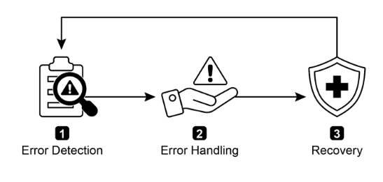
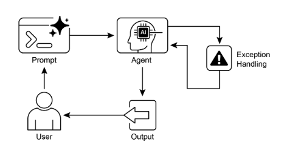

# 第 12 章：例外處理與恢復

為了讓人工智慧代理在不同的現實環境中可靠運行，它們必須能夠管理不可預見的情況、錯誤和故障。就像人類適應意外障礙一樣，智慧代理也需要強大的系統來偵測問題、啟動復原程序或至少確保故障受控。這項基本要求構成了例外處理和復原模式的基礎。

此模式著重於開發異常耐用和有彈性的代理，儘管存在各種困難和異常，但仍可以保持不間斷的功能和操作完整性。它強調主動準備和反應策略的重要性，以確保即使面臨挑戰也能持續運作。這種適應性對於代理在複雜且不可預測的環境中成功運作至關重要，最終提高其整體效率和可信度。

處理突發事件的能力確保這些人工智慧系統不僅智能，而且穩定可靠，這增強了對其部署和效能的信心。整合全面的監控和診斷工具進一步增強了代理快速識別和解決問題的能力，防止潛在的中斷並確保在不斷變化的條件下更順利地運作。這些先進的系統對於維持人工智慧營運的完整性和效率、增強其管理複雜性和不可預測性的能力至關重要。

這種模式有時可以與反思一起使用。例如，如果初始嘗試失敗並引發異常，反思過程可以分析失敗並使用改進的方法（例如改進的提示）重新嘗試任務以解決錯誤。

## 例外處理與恢復模式概述

例外處理和復原模式解決了人工智慧代理管理作業故障的需求。此模式涉及預測潛在問題（例如工具錯誤或服務不可用），並制定緩解這些問題的策略。這些策略可能包括錯誤記錄、重試、回退、優雅降級和通知。此外，該模式強調狀態回滾、診斷、自我糾正和升級等恢復機制，以將代理恢復到穩定運行。實現這種模式可以增強人工智慧代理的可靠性和穩健性，使它們能夠在不可預測的環境中發揮作用。實際應用的範例包括管理資料庫錯誤的聊天機器人、處理財務錯誤的交易機器人以及解決設備故障的智慧家庭代理。此模式確保代理在遇到複雜性和故障時仍能繼續有效運作。



圖 1：人工智慧 代理例外處理和復原的關鍵元件

**錯誤檢測：** 這涉及在出現操作問題時仔細識別它們。這可能表現為無效或格式錯誤的工具輸出、特定 API 錯誤（例如 404（未找到）或 500（內部伺服器錯誤）代碼）、服務或 API 的回應時間異常長，或偏離預期格式的不連貫且無意義的回應。此外，可以實施其他代理或專門監控系統的監控，以實現更主動的異常檢測，使系統能夠在潛在問題升級之前捕獲它們。

**錯誤處理**：一旦偵測到錯誤，就必須制定經過深思熟慮的回應計畫。這包括在日誌中仔細記錄錯誤詳細信息，以便以後調試和分析（日誌記錄）。重試操作或請求（有時稍微調整參數）可能是一種可行的策略，特別是對於暫時性錯誤（重試）。使用替代策略或方法（後備）可以確保維護某些功能。如果無法立即完全恢復，代理可以維持部分功能以提供至少一些價值（優雅降級）。最後，對於需要人工幹預或協作（通知）的情況，向人類操作員或其他代理發出警報可能至關重要。

**恢復：** 此階段是將代理或系統在發生錯誤後恢復到穩定且可運作的狀態。它可能涉及逆轉最近的更改或事務以消除錯誤的影響（狀態回滾）。徹底調查錯誤原因對於防止錯誤再次發生至關重要。可能需要透過自我修正機製或重新規劃流程來調整代理的計畫、邏輯或參數，以避免將來出現相同的錯誤。在複雜或嚴重的情況下，將問題委託給操作員或更高層級的系統（升級）可能是最好的行動方案。

實施這種強大的例外處理和恢復模式可以將人工智慧代理從脆弱且不可靠的系統轉變為強大、可靠的組件，能夠在充滿挑戰和高度不可預測的環境中有效和彈性地運作。這可以確保代理保持功能，最大限度地減少停機時間，並提供無縫且可靠的體驗，即使在遇到意外問題時也是如此。

## 實際應用程式和用例

對於在無法保證完美條件的現實場景中部署的任何代理來說，例外處理和復原至關重要。

* **客戶服務聊天機器人：** 如果聊天機器人嘗試存取客戶資料庫並且資料庫暫時關閉，它不應該崩潰。相反，它應該檢測 API 錯誤，通知用戶臨時問題，也許建議稍後重試，或將查詢升級給人工代理。

* **自動金融交易：** 嘗試執行交易的交易機器人可能會遇到「資金不足」錯誤或「市場關閉」錯誤。它需要透過記錄錯誤來處理這些異常，而不是重複嘗試相同的無效交易，並可能通知使用者或調整其策略。

* **智慧家庭自動化：** 控制智慧燈的代理可能因網路問題或裝置故障而無法開啟燈。它應該檢測到此故障，也許重試，如果仍然不成功，則通知用戶燈無法打開並建議手動幹預。

* **資料處理代理：** 負責處理一批文件的代理可能會遇到損壞的文件。它應該跳過損壞的文件，記錄錯誤，繼續處理其他文件，並在最後報告跳過的文件，而不是停止整個過程。

* **網頁抓取代理：** 當網頁抓取代理遇到驗證碼、變更的網站結構或伺服器錯誤（例如，404 未找到、503 服務不可用）時，它需要妥善處理這些問題。這可能涉及暫停、使用代理或報告失敗的特定 URL。

* **機器人和製造：** 執行組裝任務的機械手臂可能會因未對準而無法拾取組件。它需要檢測這種故障（例如，透過感測器回饋），嘗試重新調整，重試拾取，如果持續存在，則提醒操作人員或切換到不同的元件。

簡而言之，這種模式對於建立智能代理至關重要，這些代理在面對現實世界的複雜性時不僅具有智能，而且可靠、有彈性且用戶友好。

## 實作程式碼範例 (ADK)

例外處理和恢復對於系統的穩健性和可靠性至關重要。例如，考慮代理對失敗的工具呼叫的回應。此類故障可能源自於不正確的工具輸入或該工具所依賴的外部服務的問題。

```python
from google.adk.agents import Agent, SequentialAgent


# Agent 1: Tries the primary tool. Its focus is narrow and clear.
primary_handler = Agent(
    name="primary_handler",
    model="gemini-2.0-flash-exp",
    instruction="""
    Your job is to get precise location information. Use the get_precise_location_info
    tool with the user's provided address.
    """,
    tools=[get_precise_location_info],
)

# Agent 2: Acts as the fallback handler, checking state to decide its action.
fallback_handler = Agent(
    name="fallback_handler",
    model="gemini-2.0-flash-exp",
    instruction="""
    Check if the primary location lookup failed by looking at state["primary_location_failed"].
    - If it is True, extract the city from the user's original query and use the get_general_area_info tool.
    - If it is False, do nothing.
    """,
    tools=[get_general_area_info],
)

# Agent 3: Presents the final result from the state.
response_agent = Agent(
    name="response_agent",
    model="gemini-2.0-flash-exp",
    instruction="""
    Review the location information stored in state["location_result"]. Present this information
    clearly and concisely to the user. If state["location_result"] does not exist or is empty,
    apologize that you could not retrieve the location.
    """,
    tools=[],  # This agent only reasons over the final state.
)

# The SequentialAgent ensures the handlers run in a guaranteed order.
robust_location_agent = SequentialAgent(
    name="robust_location_agent",
    sub_agents=[primary_handler, fallback_handler, response_agent],
)
```

此程式碼使用 ADK 的 SequentialAgent 和三個子代理定義了一個強大的位置擷取系統。 `primary_handler` 是第一個代理，嘗試使用 `get_precise_location_info` 工具來取得精確的位置資訊。 `fallback_handler` 作為備份，透過檢查狀態變數來檢查主查找是否失敗。如果主要查找失敗，後備代理會從使用者的查詢中提取城市並使用 `get_general_area_info` 工具。 `response_agent` 是序列中的最後一個代理。它審查儲存在狀態中的位置資訊。該代理旨在向用戶呈現最終結果。如果沒有找到位置資訊，我們深表歉意。 SequentialAgent 確保這三個代理以預先定義的順序執行。這種結構允許採用分層方法進行位置資訊檢索。

## 概覽

**內容：** 在現實環境中運行的人工智慧代理不可避免地會遇到不可預見的情況、錯誤和系統故障。這些中斷的範圍可能包括工具故障、網路問題和無效數據，威脅代理完成任務的能力。如果沒有結構化的方法來管理這些問題，代理可能會變得脆弱、不可靠，並且在遇到意外障礙時容易徹底失敗。這種不可靠性使得很難將它們部署在關鍵或複雜的應用程式中，而在這些應用程式中，一致的效能至關重要。

**為什麼**：例外處理和恢復模式為建立強大且有彈性的 人工智慧 代理提供了標準化的解決方案。它為他們提供了預測、管理和從操作故障中恢復的代理能力。此模式涉及主動錯誤偵測（例如監控工具輸出和 API 回應）以及被動處理策略（例如診斷日誌記錄、重試瞬態故障或使用回退機制）。對於更嚴重的問題，它定義了恢復協議，包括恢復到穩定狀態、透過調整計劃進行自我糾正或將問題升級給手動操作員。這種系統化方法可確保代理能夠保持操作完整性、從故障中學習並在不可預測的環境中可靠地運作。

**經驗法則：** 將此模式用於部署在動態現實環境中的任何 人工智慧 代理，在這種環境中，系統故障、工具錯誤、網路問題或不可預測的輸入都可能發生，並且操作可靠性是關鍵要求。

**視覺摘要：**



圖2：例外處理模式

## 要點

要記住的重點：

* 例外處理和復原對於建立健壯且可靠的代理至關重要。

* 此模式涉及偵測錯誤、妥善處理錯誤以及實施復原策略。

* 錯誤偵測可能涉及驗證工具輸出、檢查 API 錯誤代碼和使用逾時。

* 處理策略包括日誌記錄、重試、回退、優雅降級和通知。

* 恢復的重點是透過診斷、自我修正或升級來恢復穩定運作。

* 這種模式確保代理即使在不可預測的現實環境中也能有效運作。

## 結論

本章探討例外處理和恢復模式，這對於開發強大且可靠的人工智慧代理至關重要。該模式解決了人工智慧代理如何識別和管理意外問題、實施適當的回應並恢復到穩定的運作狀態。本章討論了該模式的各個方面，包括錯誤檢測、透過日誌記錄、重試和回退等機制處理這些錯誤，以及用於將代理或系統恢復到正常功能的策略。例外處理和復原模式的實際應用在多個領域進行了說明，以證明其在處理現實世界的複雜性和潛在故障方面的相關性。這些應用程式展示了為人工智慧代理配備例外處理功能如何有助於其在動態環境中的可靠性和適應性。

## 參考

1. 麥康奈爾，S. (2004)。 *程式碼完整（第二版）*。微軟出版社。

2. 施勇、裴浩、馮立、張勇、姚丹 (2024)。 *邁向多代理強化學習中的容錯*。 arXiv 預印本 arXiv：2412.00534。

3. 奧尼爾，V.（2022）。 *使用情報傳輸提高異質多代理物聯網系統的容錯性和可靠性*。電子學，11(17), 2724。