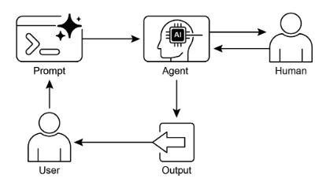

# 第 13 章：人機交互

人類在回圈中 (HITL) 模式代表了代理開發和部署的關鍵策略。它有意將人類認知的獨特優勢（例如判斷力、創造力和細緻的理解力）與人工智慧的運算能力和效率交織在一起。這種策略整合不僅是一種選擇，而且往往是一種必要，特別是當人工智慧系統越來越多地嵌入關鍵決策過程時​​。

HITL的核心原則是確保人工智慧在道德邊界內運行，遵守安全協議，並以最佳效果實現其目標。這些擔憂在複雜、模糊或重大風險的領域尤其嚴重，在這些領域，人工智慧錯誤或誤解的影響可能很大。在這種情況下，完全自主——人工智慧系統在沒有任何人為幹預的情況下獨立運作——可能被證明是不謹慎的。 HITL 承認這一現實，並強調即使人工智慧技術快速發展，人類監督、策略輸入和協作互動仍然不可或缺。

HITL 方法從根本上圍繞著人工智慧和人類智慧之間的協同理念。 HITL 並未將人工智慧視為人類工人的替代品，而是將人工智慧定位為增強和增強人類能力的工具。這種增強可以採取多種形式，從自動化日常任務到提供數據驅動的見解來指導人類決策。最終目標是創建一個協作生態系統，人類和人工智慧代理都可以利用各自的獨特優勢來實現任何一方都無法單獨實現的成果。

在實踐中，HITL可以透過多種方式實施。一種常見的方法是由人類充當驗證者或審查者，檢查人工智慧輸出以確保準確性並識別潛在錯誤。另一種實現涉及人類主動引導人工智慧行為、提供回饋或即時糾正。在更複雜的設定中，人類可以作為合作夥伴與人工智慧協作，透過互動式對話或共享介面共同解決問題或做出決策。無論具體實施如何，HITL 模式都強調了維持人類控制和監督的重要性，確保人工智慧系統與人類道德、價值觀、目標和社會期望保持一致。

## 人類在回圈中模式概述

人類在環 (HITL) 模式將人工智慧與人類輸入結合，以增強 代理 的能力。這種方法承認，最佳的人工智慧效能通常需要自動化處理和人類洞察力的結合，特別是在具有高度複雜性或道德考量的場景中。 HITL 的目標不是取代人類輸入，而是透過確保關鍵判斷和決策基於人類理解來增強人類能力。

HITL 包含幾個關鍵方面： 人工監督，涉及監控 人工智慧 代理的性能和輸出（例如，透過日誌審查或即時儀表板），以確保遵守準則並防止不良結果。當人工智慧代理遇到錯誤或模棱兩可的場景並可能請求人工幹預時，就會發生幹預和糾正；人類操作員可以糾正錯誤、提供缺失的數據或指導代理，這也為未來的代理改進提供資訊。收集人類學習回饋並用於完善人工智慧模型，特別是在具有人類回饋的強化學習等方法中，人類偏好直接影響代理的學習軌跡。決策增強是人工智慧代理向人類提供分析和建議，然後人類做出最終決定，透過人工智慧產生的見解而不是完全自主來增強人類決策。人機協作是人類和人工智慧體發揮各自優勢的合作互動；常規數據處理可以由代理來處理，而創造性的問題解決或複雜的談判則由人類來管理。最後，升級策略是既定的協議，規定代理應何時以及如何將任務升級給人工操作員，以防止在超出代理能力的情況下出現錯誤。

實作 HITL 模式可以在完全自治不可行或不允許的敏感領域使用代理。它還提供了一種透過回饋循環進行持續改進的機制。例如，在金融領域，大型企業貸款的最終批准需要人力信貸員評估領導品質等定性因素。同樣，在法律領域，正義和問責的核心原則要求人類法官對量刑等涉及複雜道德推理的關鍵決策保留最終權力。

> **注意事項：** 儘管 HITL 模式有很多好處，但它也有重要的注意事項，其中最主要的是缺乏可擴展性。雖然人工監督可以提供高精度，但操作員無法管理數百萬個任務，這就產生了基本的權衡，通常需要採用一種混合方法，將自動化實現規模化和 HITL 實現準確性相結合。此外，這種模式的有效性在很大程度上取決於操作人員的專業知識；例如，雖然人工智慧可以產生軟體程式碼，但只有熟練的開發人員才能準確識別細微的錯誤並提供正確的指導來修復它們。這種對專業知識的需求也適用於使用 HITL 產生訓練資料時，因為人類註釋者可能需要特殊訓練才能學習如何以產生高品質資料的方式修正 人工智慧。最後，實作 HITL 會引發嚴重的隱私問題，因為敏感資訊在暴露給操作員之前通常必須嚴格匿名，從而增加了另一層流程複雜性。

## 實際應用程式和用例

人類在回圈中模式在廣泛的行業和應用中至關重要，特別是在準確性、安全性、道德或細緻入微的理解至關重要的情況下。

* **內容審核：** 人工智慧代理可以快速過濾大量線上內容是否有違規行為（例如仇恨言論、垃圾郵件）。然而，模稜兩可的案例或邊界內容會升級給人工審核員進行審查和最終決定，以確保細緻的判斷和遵守複雜的政策。

* **自動駕駛：** 雖然自動駕駛汽車可以自主處理大多數駕駛任務，但它們的設計目的是在人工智慧無法自信地導航的複雜、不可預測或危險的情況下（例如極端天氣、異常路況）將控制權移交給人類駕駛員。

* **金融詐欺偵測：** 人工智慧系統可以根據模式標記可疑交易。然而，高風險或不明確的警報通常會發送給人工分析師，由他們進一步調查、聯繫客戶並最終確定交易是否有詐欺。

* **法律文件審查：** 人工智慧可以快速掃描和分類數千份法律文件，以識別相關條款或證據。然後，人類法律專業人員會審查人工智慧調查結果的準確性、背景和法律影響，特別是對於關鍵案件。

* **客戶支援（複雜查詢）：** 聊天機器人可以處理日常客戶查詢。如果使用者的問題太複雜、情緒激動，或需要人工智慧無法提供的同理心，對話就會無縫地移交給人類支援代理。

* **資料標記與註解：** 人工智慧 模型通常需要大型標記資料集進行訓練。人類被置於循環中，準確地標記圖像、文字或音頻，從而提供人工智慧學習的基本事實。隨著模型的發展，這是一個持續的過程。

* **產生人工智慧細化：** 當大型語言模型產生創意內容（例如，行銷文案、設計理念）時，人類編輯或設計師會審查和細化輸出，確保其符合品牌準則、與目標受眾產生共鳴並保持品質。

* **自主網路：** 人工智慧系統能夠利用關鍵績效指標 (KPI) 和已識別的模式來分析警報並預測網路問題和流量異常。儘管如此，關鍵決策（例如解決高風險警報）經常升級給人類分析師。這些分析師將進行進一步調查，並就是否批准網路變更做出最終決定。

此模式體現了人工智慧實現的實用方法。它利用人工智慧來增強可擴展性和效率，同時保持人工監督以確保品質、安全和道德合規性。

「人類在環」是這種模式的變體，其中人類專家定義總體政策，然後人工智慧處理立即行動以確保合規性。讓我們考慮兩個例子：

* **自動化金融交易系統**：在這種情況下，人類金融專家製定整體投資策略和規則。例如，人類可能將策略定義為：「維持 70% 科技股和 30% 債券的投資組合，對任何一家公司的投資不超過 5%，並自動出售比其購買價格低 10% 的任何股票。」然後，人工智慧即時監控股票市場，並在滿足這些預定義條件時立即執行交易。人工智慧根據人類操作員制定的較慢、更具策略性的策略來處理即時、高速的行動。

* **現代呼叫中心**：在此設定中，人類經理為客戶互動建立高級策略。例如，經理可能會制定諸如「任何提及『服務中斷』的呼叫應立即轉接至技術支援專家」等規則，或者「如果客戶的語氣表明非常沮喪，系統應將他們直接連接到人工代理。」然後，人工智慧系統處理最初的客戶交互，實時傾聽和解釋他們的需求。它透過立即路由呼叫或提供升級來自動執行經理的策略，而無需對每個案例進行人工幹預。這使得人工智慧能夠根據人類操作員提供的較慢的策略指導來管理大量的即時行動。

## 實踐程式碼範例

為了演示人機互動模式，ADK 代理可以識別需要人工審核的場景並啟動升級流程。這允許在代理自主決策能力有限或需要複雜判斷的情況下進行人為幹預。這不是一個孤立的特徵；其他流行的框架也採用了類似的功能。例如，LangChain 也提供了實現這些類型互動的工具。

```python
from typing import Optional

from google.adk.agents import Agent
from google.adk.tools.tool_context import ToolContext
from google.adk.callbacks import CallbackContext
from google.adk.models.llm import LlmRequest
from google.genai import types


# Placeholder for tools (replace with actual implementations if needed)
def troubleshoot_issue(issue: str) -> dict:
    return {"status": "success", "report": f"Troubleshooting steps for {issue}."}


def create_ticket(issue_type: str, details: str) -> dict:
    return {"status": "success", "ticket_id": "TICKET123"}


def escalate_to_human(issue_type: str) -> dict:
    # This would typically transfer to a human queue in a real system
    return {"status": "success", "message": f"Escalated {issue_type} to a human specialist."}


technical_support_agent = Agent(
    name="technical_support_specialist",
    model="gemini-2.0-flash-exp",
    instruction="""
    You are a technical support specialist for our electronics company.
    FIRST, check if the user has a support history in state["customer_info"]["support_history"].
    If they do, reference this history in your responses.

    For technical issues:
    1. Use the troubleshoot_issue tool to analyze the problem.
    2. Guide the user through basic troubleshooting steps.
    3. If the issue persists, use create_ticket to log the issue.

    For complex issues beyond basic troubleshooting:
    1. Use escalate_to_human to transfer to a human specialist.

    Maintain a professional but empathetic tone. Acknowledge the frustration technical issues can cause,
    while providing clear steps toward resolution.
    """,
    tools=[troubleshoot_issue, create_ticket, escalate_to_human],
)


def personalization_callback(
    callback_context: CallbackContext, llm_request: LlmRequest
) -> Optional[LlmRequest]:
    """Adds personalization information to the LLM request."""
    # Get customer info from state
    customer_info = callback_context.state.get("customer_info")
    if customer_info:
        customer_name = customer_info.get("name", "valued customer")
        customer_tier = customer_info.get("tier", "standard")
        recent_purchases = customer_info.get("recent_purchases", [])

        personalization_note = (
            f"\nIMPORTANT PERSONALIZATION:\n"
            f"Customer Name: {customer_name}\n"
            f"Customer Tier: {customer_tier}\n"
        )
        if recent_purchases:
            personalization_note += f"Recent Purchases: {', '.join(recent_purchases)}\n"

        if llm_request.contents:
            # Add as a system message before the first content
            system_content = types.Content(
                role="system",
                parts=[types.Part(text=personalization_note)],
            )
            llm_request.contents.insert(0, system_content)

    return None  # Return None to continue with the modified request
```

此程式碼提供了使用 Google ADK 建立技術支援代理的藍圖，該 ADK 是圍繞 HITL 框架設計的。該代理充當智慧的第一線支持，配置了特定指令並配備了 `troubleshoot_issue`、`create_ticket` 和 `escalate_to_human` 等工具來管理完整的支援工作流程。升級工具是 HITL 設計的核心部分，確保將複雜或敏感的案例傳遞給人類專家。

該架構的一個關鍵特性是其透過專用回呼函數實現深度個人化的能力。在聯絡 大型語言模型 之前，此功能會從代理的狀態動態檢索客戶特定的數據，例如他們的姓名、等級和購買歷史記錄。然後，此上下文作為系統訊息注入到提示中，使代理能夠提供引用用戶歷史記錄的高度自訂和知情的回應。透過將結構化工作流程與基本的人工監督和動態個人化相結合，該程式碼可以作為 ADK 如何促進複雜且強大的 人工智慧 支援解決方案的開發的實際範例。

## 概覽

**內容：** 人工智慧系統，包括高級大型語言模型，經常難以完成需要細緻入微的判斷、道德推理或對複雜、模糊背景的深入理解的任務。在高風險環境中部署完全自主的人工智慧會帶來巨大的風險，因為錯誤可能會導致嚴重的安全、財務或道德後果。這些系統缺乏人類固有的創造力和常識性推理。因此，在關鍵決策過程中僅依賴自動化往往是不謹慎的，並且可能損害系統的整體有效性和可信度。

**原因：** 人類在回圈中 (HITL) 模式透過策略性地將人類監督整合到人工智慧工作流程中來提供標準化解決方案。這種代理方法創建了一種共生夥伴關係，其中人工智慧處理繁重的計算和資料處理，而人類則提供關鍵的驗證、回饋和介入。透過這樣做，HITL 確保人工智慧行為符合人類價值觀和安全協議。這種協作框架不僅降低了完全自動化的風險，而且還透過不斷學習人類輸入來增強系統的功能。最終，這會帶來更穩健、更準確、更合乎道德的結果，而人類和人工智慧都無法單獨實現這一目標。

**經驗法則：** 在錯誤會產生重大安全、道德或財務後果的領域（例如醫療保健、金融或自治系統）中部署人工智慧時，請使用此模式。對於大型語言模型無法可靠處理的涉及模糊性和細微差別的任務（例如內容審核或複雜的客戶支援升級）來說，這一點至關重要。當目標是使用高品質的人工標記資料不斷改進 人工智慧 模型或改進生成式 人工智慧 輸出以滿足特定的品質標準時，請使用 HITL。

**視覺摘要：**



圖1：人類在回圈中設計模式

## 要點

主要要點包括：

* 人類在回圈中 (HITL) 將人類智慧和判斷整合到人工智慧工作流程中。

* 在複雜或高風險的場景中，這對於安全、道德和有效性至關重要。

* 關鍵面向包括人類監督、介入、學習回饋和決策增強。

* 升級策略對於代理了解何時將其移交給人工至關重要。

* HITL 允許負責任的人工智慧部署和持續改進。

* 人機互動的主要缺點是其固有的缺乏可擴展性，需要在準確性和數量之間進行權衡，並且依賴高技能的領域專家進行有效幹預。

* 其實施帶來了營運挑戰，包括需要培訓人類操作員進行資料生成，並透過匿名敏感資訊來解決隱私問題。

## 結論

本章探討了至關重要的人類在回圈中（HITL）模式，強調其在創建強大、安全和道德的人工智慧系統中的作用。我們討論瞭如何將人工監督、幹預和反饋整合到代理工作流程中可以顯著提高其性能和可信度，尤其是在複雜和敏感的領域。實際應用證明了 HITL 的廣泛實用性，從內容審核和醫療診斷到自動駕駛和客戶支援。概念程式碼範例讓我們了解 ADK 如何透過升級機制促進這些人機互動。隨著人工智慧能力的不斷進步，HITL 仍然是負責任的人工智慧開發的基石，確保人類價值和專業知識仍然是智慧系統設計的核心。

## 參考

1. 機器學習中的人機互動綜述，Xingjiao Wu、Luwei Shaw、Yixuan Sun、Junhang 張、Tianlong Ma、Liang He，[https://arxiv.org/abs/2108.00941](https://arxiv.org/abs/2108.00941)