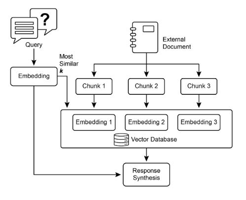
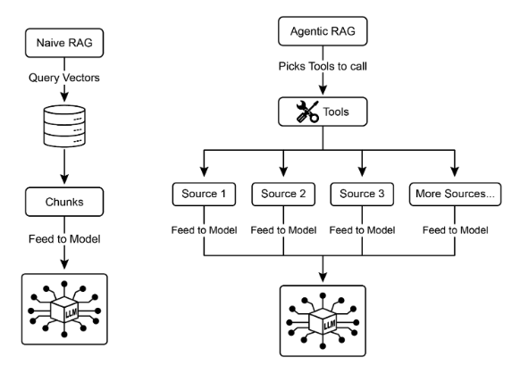
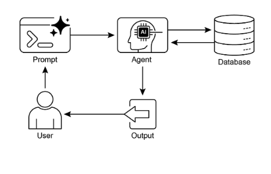
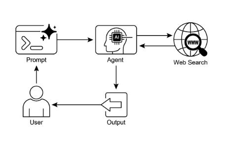

# 第 14 章：知識檢索（RAG）

大型語言模型在生成類人文本方面表現出強大的能力。然而，他們的知識庫通常僅限於他們接受培訓的數據，限制了他們對即時資訊、特定公司數據或高度專業化細節的存取。知識檢索（RAG，或檢索增強生成）解決了這個限制。 RAG 使大型語言模型能夠存取和整合外部、當前和特定背景的信息，從而提高其輸出的準確性、相關性和事實基礎。

对于人工智能代理来说，这至关重要，因为它使他们能够在静态训练之外的实时、可验证的数据中建立自己的行动和响应。此功能使他们能够准确地执行复杂的任务，例如访问最新的公司政策来回答特定问题或在下订单之前检查当前库存。透過整合外部知識，RAG 將代理從簡單的對話者轉變為能夠執行有意義的工作的有效的資料驅動工具。

## 知識檢索 (RAG) 模式概述

知識檢索 (RAG) 模式允許大型語言模型在產生回應之前存取外部知識庫，從而顯著增強了大型語言模型的能力。 RAG 不再僅僅依賴他們內部的、預先訓練的知識，而是允許大型語言模型「查找」訊息，就像人類查閱書籍或搜尋網路一樣。這個過程使大型語言模型能夠提供更準確、最新且可驗證的答案。

當使用者使用 RAG 向人工智慧系統提出問題或給予提示時，查詢不會直接發送到大型語言模型。相反，系統首先在龐大的外部知識庫（高度組織的文件、資料庫或網頁庫）中搜尋相關資訊。這個搜尋不是簡單的關鍵字匹配；這是一種“語義搜尋”，可以理解用戶的意圖及其詞語背後的含義。這個初始搜尋會提取出最相關的資訊片段或「區塊」。然後，這些提取的片段會被「增強」或添加到原始提示中，從而創建更豐富、更明智的查詢。最後，這個增強的提示被發送給大型語言模型。有了這些額外的背景，大型語言模型可以產生不僅流暢、自然，而且基於檢索到的數據的事實的回應。

RAG 框架提供了幾個顯著的好處。它允許大型語言模型訪問最新信息，從而克服靜態訓練數據的限制。這種方法還透過將響應基於可驗證的數據來降低「幻覺」（產生虛假資訊）的風險。此外，大型語言模型可以利用公司內部文件或維基中的專業知識。這個過程的一個重要優勢是能夠提供“引用”，從而找出資訊的確切來源，從而提高人工智慧回應的可信度和可驗證性。

要充分理解 RAG 的功能，必須了解一些核心概念（見圖 1）：

### 嵌入

在大型語言模型的背景下，嵌入是文本的數字表示，例如單字、短語或整個文件。這些表示法採用向量的形式，即數字列表。關鍵思想是捕捉數學空間中不同文字片段之間的語義和關係。具有相似含義的單字或短語在這個向量空間中將具有彼此更接近的嵌入。例如，想像一個簡單的二維圖。單字「cat」可能由座標 (2, 3) 表示，而「kitten」則非常接近 (2.1, 3.1)。相較之下，「car」這個字會有一個遙遠的座標，如 (8, 1)，反映了它不同的意義。實際上，這些嵌入位於具有數百甚至數千維度的高維空間中，允許對語言進行非常細緻的理解。

### 文字相似度

文本相似度是指衡量兩段文本的相似程度。這可以是在表面層面上，查看單字的重疊（詞彙相似性），也可以在更深的、基於意義的層面上。在 RAG 的背景下，文字相似性對於在知識庫中尋找與使用者查詢相對應的最相關資訊至關重要。例如，考慮以下句子：「法國的首都是什麼？」和「哪個城市是法國的首都？」。雖然措辭不同，但他們問的是同一個問題。一個好的文本相似度模型會識別這一點，並為這兩個句子分配高相似度分數，即使它們隻共享幾個單字。這通常是使用文本的嵌入來計算的。

### 語意相似度和距離

語義相似性是文本相似性的一種更高級的形式，它純粹關注文本的含義和上下文，而不僅僅是所使用的單字。它的目的是了解兩段文本是否傳達相同的概念或想法。語意距離是其倒數；高語意相似度意味著低語意距離，反之亦然。在 RAG 中，語意搜尋依賴尋找與使用者查詢具有最小語意距離的文件。例如，短語“毛茸茸的貓科動物伴侶”和“家貓”除了“a”之外沒有任何共同詞。然而，理解語義相似性的模型會認識到它們指的是同一件事，並認為它們高度相似。這是因為它們的嵌入在向量空間中非常接近，表明語義距離很小。這就是“智慧搜尋”，即使使用者的措辭與知識庫中的文字不完全匹配，RAG 也能找到相關資訊。



圖 1：RAG 核心概念：分塊、嵌入與向量資料庫

### 檔案分塊

分塊是將大型文件分解為更小、更易於管理的部分或「區塊」的過程。為了使 RAG 系統高效運作，它無法將整個大型文件輸入 大型語言模型。相反，它處理這些較小的塊。文件的分塊方式對於保留資訊的上下文和含義非常重要。例如，分塊策略可能不會將 50 頁的使用者手冊視為單一文字區塊，而是將其分解為部分、段落甚至句子。例如，「故障排除」部分將與「安裝指南」分開。當使用者詢問有關特定問題的問題時，RAG 系統可以檢索最相關的故障排除區塊，而不是整個手冊。這使得檢索過程更快，並且提供給大型語言模型的資訊更有針對性並且與使用者的直接需求相關。一旦文件被分塊，RAG 系統必須採用檢索技術來尋找與給定查詢最相關的片段。主要方法是向量搜索，它使用嵌入和語義距離來查找概念上與使用者問題相似的區塊。 BM25 是一種較舊但仍然有價值的技術，它是一種基於關鍵字的演算法，可以根據術語頻率對區塊進行排名，而無需理解語義。為了實現兩全其美，通常使用混合搜尋方法，將 BM25 的關鍵字精度與語義搜尋的上下文理解相結合。這種融合可以實現更穩健、更準確的檢索，捕捉字面匹配和概念相關性。

### 向量資料庫

向量資料庫是一種專門類型的資料庫，旨在有效地儲存和查詢嵌入。將文件分塊並轉換為嵌入後，這些高維向量將儲存在向量資料庫中。傳統的檢索技術（例如基於關鍵字的搜尋）非常適合從查詢中尋找包含確切單字的文件，但缺乏對語言的深入理解。他們不會認識到「毛茸茸的貓科動物伴侶」意味著「貓」。這就是向量資料庫的優勢所在。它們是專門為語義搜尋而建構的。透過將文字儲存為數值向量，他們可以根據概念意義找到結果，而不僅僅是關鍵字重疊。當使用者的查詢也轉換為向量時，資料庫使用高度最佳化的演算法（如 HNSW \- Hierarchical Navigable Small World）快速搜尋數百萬個向量並找到含義「最接近」的向量。這種方法對於 RAG 來說優越得多，因為即使使用者的措辭與來源文件完全不同，它也能揭示相關上下文。本質上，其他技術搜尋單詞，而向量資料庫搜尋含義。該技術以多種形式實現，從 Pinecone 和 Weaviate 等託管資料庫到 Chroma DB、Milvus 和 Qdrant 等開源解決方案。即使是現有資料庫也可以透過向量搜尋功能進行增強，如 Redis、Elasticsearch 和 Postgres（使用 pgvector 擴充）。核心檢索機制通常由 Meta 人工智慧 的 FAISS 或 Google Research 的 ScaNN 等函式庫提供支持，這些函式庫對於這些系統的效率至關重要。

### RAG 的挑戰

儘管 RAG 模式很強大，但它也面臨挑戰。當回答查詢所需的資訊不限於單一區塊而是分佈在文件的多個部分甚至多個文件時，就會出現主要問題。在這種情況下，檢索器可能無法收集所有必要的上下文，導致答案不完整或不準確。系統的有效性也高度依賴分塊和檢索過程的品質；如果檢索到不相關的區塊，可能會引入噪音並混淆 大型語言模型。此外，有效地綜合來自潛在矛盾來源的資訊仍然是這些系統的一個重大障礙。  除此之外，另一個挑戰是RAG需要對整個知識庫進行預處理並儲存在專門的資料庫中，例如向量或圖形資料庫，這是一項艱鉅的任務。因此，這些知識需要定期核對以保持最新，這在處理公司維基等不斷變化的資源時是一項至關重要的任務。整個過程會對效能產生顯著影響，增加延遲、營運成本以及最終提示中使用的令牌數量。

總之，檢索增強生成（RAG）模式代表了人工智慧在變得更加知識豐富和可靠方面的重大飛躍。透過將外部知識檢索步驟無縫整合到生成過程中，RAG 解決了獨立大型語言模型的一些核心限制。嵌入和語義相似性的基本概念與關鍵字和混合搜尋等檢索技術相結合，使系統能夠智慧地查找相關信息，並透過策略分塊使其易於管理。整個檢索過程由專門的向量資料庫提供支持，該資料庫旨在大規模儲存和有效查詢數百萬個嵌入。雖然檢索零碎或矛盾資訊的挑戰仍然存在，但 RAG 使大型語言模型能夠提供不僅適合上下文而且基於可驗證事實的答案，從而增強對人工智慧的信任和實用性。

### 圖片 RAG

GraphRAG 是檢索增強生成的高級形式，它利用知識圖表而不是簡單的向量資料庫進行資訊檢索。它透過導航此結構化知識庫中資料實體（節點）之間的顯式關係（邊緣）來回答複雜的查詢。一個關鍵優勢是它能夠從多個文件中分散的資訊合成答案，這是傳統 RAG 的常見缺陷。透過了解這些聯繫，GraphRAG 可以提供更上下文準確且細緻入微的回應。

使用案例包括複雜的財務分析、將公司與市場事件聯繫起來以及發現基因與疾病之間關係的科學研究。然而，主要缺點是建立和維護高品質知識圖譜所需的複雜性、成本和專業知識非常高。與更簡單的向量搜尋系統相比，這種設定也不太靈活，並且可能會帶來更高的延遲。系統的有效性完全取決於底層圖結構的品質和完整性。因此，GraphRAG 為複雜的問題提供了卓越的上下文推理，但實施和維護成本要高得多。總之，它在深入、相互關聯的見解比標準 RAG 的速度和簡單性更重要的情況下表現出色。

### 代理 RAG

這種模式的演變被稱為**代理 RAG**（見圖 2），引入了推理和決策層，以顯著增強資訊擷取的可靠性。 「代理」（一種專門的人工智慧元件）不僅僅是檢索和增強，而是充當關鍵的看門人和知識提煉者。該代理不是被動地接受最初檢索的數據，而是主動詢問其品質、相關性和完整性，如以下場景所示。

首先，代理擅長反思和來源驗證。如果使用者問：「我們公司對遠距工作的政策是什麼？」標準 RAG 可能會在 2025 年官方政策文件旁邊顯示 2020 年部落格文章。然而，代理會分析文件的元數據，將 2025 年政策識別為最新、最權威的來源，並丟棄過時的部落格文章，然後將正確的上下文發送給大型語言模型以獲得準確的答案。



圖 2：代理式 RAG 引入了一個推理代理，可以主動評估、協調和細化檢索到的信息，以確保更準確和更值得信賴的最終響應。

其次，代理善於協調知識衝突。想像一下，一位財務分析師問：「Alpha 專案第一季的預算是多少？」系統檢索兩份文件：一份列出 50,000 歐元預算的初始提案和一份列出預算為 65,000 歐元的最終財務報告。 代理式 RAG 將識別這一矛盾，優先將財務報告作為更可靠的來源，並向 大型語言模型 提供經過驗證的數據，確保最終答案是基於最準確的數據。

第三，代理可以執行多步驟推理來合成複雜的答案。如果用戶問：「我們產品的功能和定價與競爭對手 X 相比如何？」代理會將其分解為單獨的子查詢。它將針對自己產品的功能、定價、競爭對手 X 的功能以及競爭對手 X 的定價發起不同的搜尋。在收集這些單獨的資訊後，代理會將它們合成為結構化的比較上下文，然後將其提供給大型語言模型，從而實現簡單檢索無法產生的全面回應。

第四，代理可以識別知識差距並使用外部工具。假設用戶問：「市場對我們昨天推出的新產品的立即反應是什麼？」代理搜尋每週更新的內部知識庫，但沒有找到相關資訊。在認識到這一差距後，它可以啟動一個工具（例如即時網路搜尋 API）來尋找最近的新聞文章和社交媒體情緒。然後，代理使用這些新收集的外部資訊來提供最新的答案，克服其靜態內部資料庫的限制。

### 代理式 RAG 的挑戰

雖然代理層功能強大，但它也帶來了自己的一系列挑戰。主要缺點是複雜性和成本顯著增加。設計、實現和維護代理的決策邏輯和工具整合需要大量的工程工作並增加計算費用。這種複雜性也可能導致延遲增加，因為代理的反思週期、工具使用和多步驟推理比標準的直接檢索過程需要更多的時間。此外，代理本身也可能成為新的錯誤來源；有缺陷的推理過程可能會導致其陷入無用的循環、誤解任務或不正確地丟棄相關訊息，最終降低最終回應的品質。

＃## 總之

代理式 RAG 代表了標準檢索模式的複雜演變，將其從被動資料管道轉變為主動的問題解決框架。透過嵌入可以評估來源、協調衝突、分解複雜問題和使用外部工具的推理層，代理可以顯著提高生成答案的可靠性和深度。這項進步使人工智慧更加值得信賴和強大，儘管它在系統複雜性、延遲和成本方面帶來了必須仔細管理的重要權衡。

## 實際應用程式和用例

知識檢索 (RAG) 正在改變大型語言模型 (大型語言模型) 在各行業中的使用方式，增強其提供更準確和上下文相關回應的能力。

應用包括：

* **企業搜尋與問答：** 組織可以開發內部聊天機器人，使用人力資源政策、技術手冊和產品規格等內部文件來回應員工的詢問。 RAG 系統從這些文件中提取相關部分，以告知大型語言模型的答案。

* **客戶支援和幫助台：** 基於 RAG 的系統可以透過存取產品手冊、常見問題 (FAQ) 和支援票證中的信息，對客戶的查詢提供精確且一致的回應。這可以減少對日常問題直接人為介入的需要。

* **個人化內容推薦：** RAG 可以識別和檢索在語義上與使用者偏好或先前互動相關的內容（文章、產品），而不是基本的關鍵字匹配，從而產生更相關的推薦。

* **新聞和時事摘要：** 大型語言模型可以與即時新聞源整合。當提示當前事件時，RAG 系統會檢索最近的文章，使大型語言模型能夠產生最新的摘要。

透過整合外部知識，RAG 將大型語言模型的功能擴展到簡單的溝通之外，以充當知識處理系統。

## 實作程式碼範例 (ADK)

為了說明知識檢索 (RAG) 模式，讓我們來看三個範例。

首先，是如何使用Google搜尋進行RAG和地面LLM來搜尋結果。由於 RAG 涉及存取外部信息，因此 Google 搜尋工具是可以增強大型語言模型知識的內建檢索機制的直接範例。

```python
from google.adk.tools import google_search
from google.adk.agents import Agent


search_agent = Agent(
    name="research_assistant",
    model="gemini-2.0-flash-exp",
    instruction="You help users research topics. When asked, use the Google Search tool",
    tools=[google_search],
)
```

其次，本節介紹如何利用 Google ADK 中的 Vertex 人工智慧 RAG 功能。提供的程式碼示範了 ADK 中 VertexAiRagMemoryService 的初始化。這允許建立與 Google Cloud Vertex 人工智慧 RAG 語料庫的連接。此服務是透過指定語料庫資源名稱和可選參數（例如 `SIMILARITY_TOP_K` 和 `VECTOR_DISTANCE_THRESHOLD`）來配置的。這些參數會影響檢索過程。 `SIMILARITY_TOP_K` 定義要檢索的最相似結果的數量。 `VECTOR_DISTANCE_THRESHOLD` 對檢索結果的語意距離設定限制。此設定使代理能夠從指定的 RAG 語料庫執行可擴展且持久的語義知識檢索。此流程有效地將 Google Cloud 的 RAG 功能整合到 ADK 代理中，從而支援基於事實資料的回應的開發。

```python
# Import the necessary VertexAiRagMemoryService class from the google.adk.memory module.
from google.adk.memory import VertexAiRagMemoryService


RAG_CORPUS_RESOURCE_NAME = "projects/your-gcp-project-id/locations/us-central1/ragCorpora/your-corpus-id"

# Define an optional parameter for the number of top similar results to retrieve.
# This controls how many relevant document chunks the RAG service will return.
SIMILARITY_TOP_K = 5

# Define an optional parameter for the vector distance threshold.
# This threshold determines the maximum semantic distance allowed for retrieved results;
# results with a distance greater than this value might be filtered out.
VECTOR_DISTANCE_THRESHOLD = 0.7

# Initialize an instance of VertexAiRagMemoryService.
# This sets up the connection to your Vertex AI RAG Corpus.
# - rag_corpus: Specifies the unique identifier for your RAG Corpus.
# - similarity_top_k: Sets the maximum number of similar results to fetch.
# - vector_distance_threshold: Defines the similarity threshold for filtering results.
memory_service = VertexAiRagMemoryService(
    rag_corpus=RAG_CORPUS_RESOURCE_NAME,
    similarity_top_k=SIMILARITY_TOP_K,
    vector_distance_threshold=VECTOR_DISTANCE_THRESHOLD,
)
```

## 實作程式碼範例 (LangChain)

第三，讓我們來看一個使用 LangChain 的完整範例。

```python
import os
import requests
from typing import List, Dict, Any, TypedDict

from langchain_community.document_loaders import TextLoader
from langchain_core.documents import Document
from langchain_core.prompts import ChatPromptTemplate
from langchain_core.output_parsers import StrOutputParser
from langchain_community.embeddings import OpenAIEmbeddings
from langchain_community.vectorstores import Weaviate
from langchain_openai import ChatOpenAI
from langchain.text_splitter import CharacterTextSplitter
from langchain.schema.runnable import RunnablePassthrough
from langgraph.graph import StateGraph, END

import weaviate
from weaviate.embedded import EmbeddedOptions
import dotenv


# Load environment variables (e.g., OPENAI_API_KEY)
dotenv.load_dotenv()

# Set your OpenAI API key (ensure it's loaded from .env or set here)
# os.environ["OPENAI_API_KEY"] = "YOUR_OPENAI_API_KEY"


# --- 1. Data Preparation (Preprocessing) ---

# Load data
url = "https://github.com/langchain-ai/langchain/blob/master/docs/docs/how_to/state_of_the_union.txt"
res = requests.get(url)
with open("state_of_the_union.txt", "w") as f:
    f.write(res.text)

loader = TextLoader("./state_of_the_union.txt")
documents = loader.load()

# Chunk documents
text_splitter = CharacterTextSplitter(chunk_size=500, chunk_overlap=50)
chunks = text_splitter.split_documents(documents)

# Embed and store chunks in Weaviate
client = weaviate.Client(embedded_options=EmbeddedOptions())

vectorstore = Weaviate.from_documents(
    client=client,
    documents=chunks,
    embedding=OpenAIEmbeddings(),
    by_text=False,
)

# Define the retriever
retriever = vectorstore.as_retriever()

# Initialize LLM
llm = ChatOpenAI(model_name="gpt-3.5-turbo", temperature=0)


# --- 2. Define the State for LangGraph ---
class RAGGraphState(TypedDict):
    question: str
    documents: List[Document]
    generation: str


# --- 3. Define the Nodes (Functions) ---
def retrieve_documents_node(state: RAGGraphState) -> RAGGraphState:
    """Retrieves documents based on the user's question."""
    question = state["question"]
    documents = retriever.invoke(question)
    return {"documents": documents, "question": question, "generation": ""}


def generate_response_node(state: RAGGraphState) -> RAGGraphState:
    """Generates a response using the LLM based on retrieved documents."""
    question = state["question"]
    documents = state["documents"]

    # Prompt template from the PDF
    template = """You are an assistant for question-answering tasks. Use the following pieces of retrieved context to answer the question. If you don't know the answer, just say that you don't know. Use three sentences maximum and keep the answer concise.
Question: {question}
Context: {context}
Answer: """
    prompt = ChatPromptTemplate.from_template(template)

    # Format the context from the documents
    context = "\n\n".join([doc.page_content for doc in documents])

    # Create the RAG chain
    rag_chain = prompt | llm | StrOutputParser()

    # Invoke the chain
    generation = rag_chain.invoke({"context": context, "question": question})

    return {"question": question, "documents": documents, "generation": generation}


# --- 4. Build the LangGraph Graph ---
workflow = StateGraph(RAGGraphState)

# Add nodes
workflow.add_node("retrieve", retrieve_documents_node)
workflow.add_node("generate", generate_response_node)

# Set the entry point
workflow.set_entry_point("retrieve")

# Add edges (transitions)
workflow.add_edge("retrieve", "generate")
workflow.add_edge("generate", END)

# Compile the graph
app = workflow.compile()


# --- 5. Run the RAG Application ---
if __name__ == "__main__":
    print("\n--- Running RAG Query ---")
    query = "What did the president say about Justice Breyer"
    inputs = {"question": query}
    for s in app.stream(inputs):
        print(s)

    print("\n--- Running another RAG Query ---")
    query_2 = "What did the president say about the economy?"
    inputs_2 = {"question": query_2}
    for s in app.stream(inputs_2):
        print(s)
```

此 Python 程式碼說明了使用 LangChain 和 LangGraph 實現的檢索增強生成 (RAG) 管道。這個過程首先創建從文本文件派生的知識庫，該知識庫被分割成區塊並轉換為嵌入。然後，這些嵌入被儲存在 Weaviate 向量儲存中，以促進高效的資訊檢索。 LangGraph 中的 StateGraph 用於管理兩個關鍵函數之間的工作流程：`retrieve_documents_node` 和 `generate_response_node`。 `retrieve_documents_node` 函數查詢向量儲存以根據使用者的輸入識別相關文件區塊。隨後，`generate_response_node` 函數利用檢索到的資訊和預先定義的提示模板，使用 OpenAI 大型語言模型 (大型語言模型) 產生回應。 `app.stream` 方法允許透過 RAG 管道執行查詢，展示系統產生上下文相關輸出的能力。

## 概覽

**內容：** 大型語言模型擁有令人印象深刻的文本生成能力，但從根本上受到訓練資料的限制。這些知識是靜態的，這意味著它不包括即時資訊或私有的、特定領域的資料。因此，他們的回答可能過時、不準確或缺乏專門任務所需的具體背景。這一差距限制了它們對於需要當前和事實答案的應用的可靠性。

**原因：** 檢索增強生成 (RAG) 模式透過將大型語言模型連接到外部知識來源，提供了標準化的解決方案。當收到查詢時，系統會先從指定的知識庫中檢索相關資訊片段。然後，這些片段將附加到原始提示中，透過及時且特定的上下文來豐富它。然後，該增強提示會發送至大型語言模型，使其能夠產生準確、可驗證且基於外部數據的回應。這個過程有效地將大型語言模型從閉卷推理轉變為開卷推理，顯著增強了其實用性和可信度。

**經驗法則：** 當您需要大型語言模型回答問題或根據不屬於其原始培訓數據的特定、最新或專有資訊生成內容時，請使用此模式。它非常適合在內部文件、客戶支援機器人以及需要可驗證、基於事實的回應（帶引用）的應用程式上建立問答系統。

**視覺摘要：**



知識檢索模式：人工智慧代理從結構化資料庫查詢和檢索資訊



圖 3：知識檢索模式：人工智慧代理從公共互聯網中尋找和綜合資訊以回應使用者查詢。

## 要點

* 知識檢索 (RAG) 允許大型語言模型訪問外部的、最新的和特定的信息，從而增強大型語言模型的能力。

* 該過程涉及檢索（在知識庫中搜尋相關片段）和增強（將這些片段添加到大型語言模型的提示中）。

* RAG 幫助大型語言模型克服過時的訓練資料等限制，減少“幻覺”，並實現特定領域的知識整合。

* RAG 允許可歸因的答案，因為大型語言模型的回答是基於檢索到的來源。

* GraphRAG 利用知識圖來理解不同資訊之間的關係，使其能夠回答需要綜合多個來源的資料的複雜問題。

* 代理式 RAG 超越了簡單的資訊檢索，它使用智慧代理主動推理、驗證和提煉外部知識，確保得到更準確、更可靠的答案。

* 實際應用涵蓋企業搜尋、客戶支援、法律研究和個人化推薦。

## 結論

總之，檢索增強生成（RAG）透過將大型語言模型連接到外部最新資料來源來解決大型語言模型靜態知識的核心限制。這個過程的工作原理是首先檢索相關資訊片段，然後增強使用者的提示，使大型語言模型能夠產生更準確和上下文感知的回應。這是透過嵌入、語義搜尋和向量資料庫等基礎技術實現的，這些技術根據含義而不僅僅是關鍵字來查找資訊。透過將輸出基於可驗證的數據，RAG 顯著減少了事實錯誤，並允許使用專有信息，透過引用增強信任。

代理式 RAG 是一種先進的演變，引入了一個推理層，可以主動驗證、協調和綜合檢索到的知識，以獲得更高的可靠性。同樣，GraphRAG 等專門方法利用知識圖來導航明確資料關係，使系統能夠綜合高度複雜、互連的查詢的答案。此代理可以解決衝突資訊、執行多步驟查詢並使用外部工具查找遺失的資料。雖然這些先進的方法增加了複雜性和延遲，但它們極大地提高了最終響應的深度和可信度。這些模式的實際應用已經在改變產業，從企業搜尋和客戶支援到個人化內容交付。儘管面臨挑戰，RAG 仍然是讓 人工智慧 變得更加知識豐富、可靠和有用的關鍵模式。最終，它將大型語言模型從封閉式的對話者轉變為強大的開放式推理工具。

## 參考

1. 路易斯，P.，等人。 （2020）。 *知識密集型 NLP 任務的檢索增強生成*。 [https://arxiv.org/abs/2005.11401](https://arxiv.org/abs/2005.11401)

2. Google 人工智慧 開發者文件。  *檢索增強生成 - [https://cloud.google.com/vertex-ai/generative-ai/docs/rag-engine/rag-overview](https://cloud.google.com/vertex-ai/generative-ai/docs/rag-engine/rag-overview)*

3. 圖檢索增強生成（GraphRAG），[https://arxiv.org/abs/2501.00309](https://arxiv.org/abs/2501.00309)

4. LangChain 和 LangGraph：Leonie Monigatti，“檢索增強生成（RAG）：從理論到 LangChain 實現”，[*https://medium.com/data-science/retrieval-augmented- Generation-rag-from-theory-to-langchain-implementation-4e9bd5f6afrom-theory-to-langchain-implementation-4e9bd5f6afURLb-__KfUR_URL_UR02_UR902)

5. Google Cloud Vertex 人工智慧 RAG 語料庫 [*https://cloud.google.com/vertex-ai/generative-ai/docs/rag-engine/manage-your-rag-corpus#corpus-management*](https://cloud.google.com/vertex-ai/generative-ai/docs/rag-engine/manage-your-rag-corpus#corpus-management)