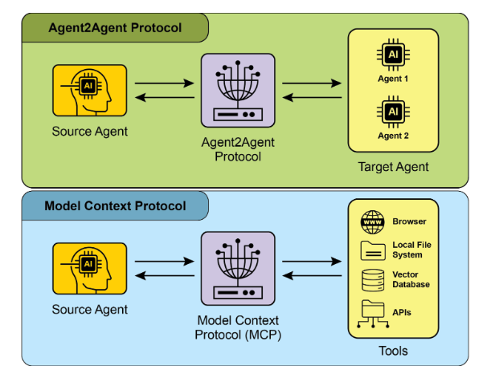
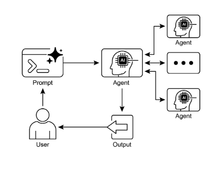

# 第 15 章：代理間通訊 (A2A)

即使具有先進的功能，單一人工智慧代理在處理複雜、多方面的問題時也常常面臨限制。為了克服這個問題，代理間通訊（A2A）使不同的人工智慧代理（可能使用不同的框架建構）能夠有效地協作。這種協作涉及無縫協調、任務委派和資訊交換。

Google 的 A2A 協定是一個開放標準，旨在促進這種通用通訊。本章將探討 A2A、其實際應用及其在 Google ADK 中的實作。

## 代理間通訊模式概述

Agent2Agent (A2A) 協定是一種開放標準，旨在實現不同 人工智慧 代理框架之間的通訊和協作。它確保了互通性，允許使用 LangGraph、CrewAI 或 Google ADK 等技術開發的 人工智慧 代理能夠協同工作，無論其起源或框架差異如何。

A2A 得到了一系列技術公司和服務提供者的支持，包括 Atlassian、Box、LangChain、MongoDB、Salesforce、SAP 和 ServiceNow。微軟計劃將 A2A 整合到 Azure 人工智慧 Foundry 和 Copilot Studio 中，以展示其對開放協議的承諾。此外，Auth0 和 SAP 正在將 A2A 支援整合到他們的平台和代理中。

作為一個開源協議，A2A 歡迎社群做出貢獻，以促進其發展和廣泛採用。

## A2A的核心概念

A2A 協定為代理互動提供了一種基於幾個核心概念的結構化方法。對於開發或整合 A2A 相容系統的任何人來說，徹底掌握這些概念至關重要。 A2A 的基本支柱包括核心參與者、代理卡、代理發現、通訊和任務、互動機制和安全性，所有這些都將被詳細審查。

**核心參與者：** A2A 涉及三個主要實體：

* 使用者：發起請求代理協助。

* A2A 用戶端（客戶端代理）：代表使用者要求操作或資訊的應用程式或 人工智慧 代理。

* A2A 伺服器（遠端代理）：提供 HTTP 端點來處理客戶端請求並傳回結果的 人工智慧 代理或系統。遠端代理作為「不透明」系統運行，這意味著客戶端不需要了解其內部操作細節。

**代理卡：** 代理的數位身分由其代理卡定義，通常是 JSON 檔案。該文件包含客戶端互動和自動發現的關鍵訊息，包括代理的身份、端點 URL 和版本。它還詳細介紹了支援的功能，例如串流或推播通知、特定技能、預設輸入/輸出模式和身份驗證要求。以下是 WeatherBot 的代理卡範例。

```json
{
    "name": "WeatherBot",
    "description": "Provides accurate weather forecasts and historical data.",
    "url": "http://weather-service.example.com/a2a",
    "version": "1.0.0",
    "capabilities": {
        "streaming": true,
        "pushNotifications": false,
        "stateTransitionHistory": true
    },
    "authentication": {
        "schemes": [
            "apiKey"
        ]
    },
    "defaultInputModes": [
        "text"
    ],
    "defaultOutputModes": [
        "text"
    ],
    "skills": [
        {
            "id": "get_current_weather",
            "name": "Get Current Weather",
            "description": "Retrieve real-time weather for any location.",
            "inputModes": [
                "text"
            ],
            "outputModes": [
                "text"
            ],
            "examples": [
                "What's the weather in Paris?",
                "Current conditions in Tokyo"
            ],
            "tags": [
                "weather",
                "current",
                "real-time"
            ]
        },
        {
            "id": "get_forecast",
            "name": "Get Forecast",
            "description": "Get 5-day weather predictions.",
            "inputModes": [
                "text"
            ],
            "outputModes": [
                "text"
            ],
            "examples": [
                "5-day forecast for New York",
                "Will it rain in London this weekend?"
            ],
            "tags": [
                "weather",
                "forecast",
                "prediction"
            ]
        }
    ]
}
```

**代理發現：**它允許客戶端查找代理卡，該卡描述了可用 A2A 伺服器的功能。此過程存在多種策略：

* 眾所周知的 URI：代理將其代理卡託管在標準化路徑（例如 /.well-known/代理.json）。這種方法為公共或特定領域的使用提供了廣泛的、通常是自動化的可訪問性。

* 精選註冊表**：** 這些提供了一個集中目錄，代理卡在其中發布，並且可以根據特定標準進行查詢。這非常適合需要集中管理和存取控制的企業環境。

* 直接設定**：** 座席卡資訊嵌入或私密分享。此方法適用於動態發現並不重要的緊密耦合或私有系統。

無論選擇哪一種方法，保護代理卡端點的安全性都很重要。這可以透過存取控制、雙向 TLS (mTLS) 或網路限制來實現，特別是當卡片包含敏感（儘管非秘密）資訊時。

**通訊與任務：** 在 A2A 框架中，通訊是圍繞非同步任務建構的，非同步任務代表長期運作流程的基本工作單元。每個任務都分配有一個唯一的標識符，並經歷一系列狀態（例如已提交、正在工作或已完成），這種設計支援複雜操作中的並行處理。代理之間的通信透過訊息進行。

此通訊包含屬性，這些屬性是描述訊息的鍵值元資料（例如其優先權或建立時間），以及一個或多個部分，這些部分承載正在傳遞的實際內容，例如純文字、檔案或結構化 JSON 資料。代理在任務期間產生的有形輸出稱為工件。與訊息一樣，工件也由一個或多個部分組成，並且可以在結果可用時增量串流。 A2A 框架內的所有通訊均透過 HTTP(S) 進行，使用 JSON-RPC 2.0 協定作為有效負載。為了保持多個互動的連續性，伺服器產生的 contextId 用於對相關任務進行分組並保留上下文。

**互動機制**：請求/回應（輪詢）伺服器發送事件 (SSE)。 A2A提供多種互動方式來滿足各種AI應用需求，每種互動方式都有獨特的機制：

* 同步請求/回應：用於快速、立即操作。在此模型中，客戶端發送請求並主動等待伺服器處理該請求並在單一同步交換中傳回完整的回應。

* 非同步輪詢：適合需要較長時間處理的任務。客戶端發送請求，伺服器立即以「工作」狀態和任務 ID 確認該請求。然後，客戶端可以自由地執行其他操作，並且可以透過發送新請求來定期輪詢伺服器以檢查任務的狀態，直到將其標記為「已完成」或「失敗」。

* 串流更新（伺服器發送的事件 \- SSE）：非常適合接收即時增量結果。此方法建立從伺服器到客戶端的持久性單向連線。它允許遠端代理持續推送更新，例如狀態變更或部分結果，而客戶端無需發出多個請求。

* 推播通知（Webhooks）：專為長時間運作或資源密集任務而設計，在這些任務中維持持續連線或頻繁輪詢效率低下。用戶端可以註冊一個 webhook URL，當任務的狀態發生顯著變化（例如完成時）時，伺服器將向該 URL 發送非同步通知（「推送」）。

代理卡指定代理是否支援串流或推播通知功能。此外，A2A 與模態無關，這意味著它不僅可以促進文字的互動模式，還可以促進音訊和視訊等其他資料類型的互動模式，從而實現豐富的多模態 人工智慧 應用。串流媒體和推播通知功能均在代理卡中指定。

```json
# Synchronous Request Example 
{
    "jsonrpc": "2.0",
    "id": "1",
    "method": "sendTask",
    "params": {
        "id": "task-001",
        "sessionId": "session-001",
        "message": {
            "role": "user",
            "parts": [
                {
                    "type": "text",
                    "text": "What is the exchange rate from USD to EUR?"
                }
            ]
        },
        "acceptedOutputModes": [
            "text/plain"
        ],
        "historyLength": 5
    }
}
```

同步請求使用 sendTask 方法，客戶端請求並期望對其查詢得到一個完整的答案。相反，流請求使用 sendTaskSubscribe 方法建立持久連接，允許代理隨著時間的推移發回多個增量更新或部分結果。

```json
# Streaming Request Example 
{
    "jsonrpc": "2.0",
    "id": "2",
    "method": "sendTaskSubscribe",
    "params": {
        "id": "task-002",
        "sessionId": "session-001",
        "message": {
            "role": "user",
            "parts": [
                {
                    "type": "text",
                    "text": "What's the exchange rate for JPY to GBP today?"
                }
            ]
        },
        "acceptedOutputModes": [
            "text/plain"
        ],
        "historyLength": 5
    }
}
```

**安全性：** 代理間通訊 (A2A)：代理間通訊 (A2A) 是系統架構的重要組成部分，可實現代理之間安全、無縫的資料交換。它透過多種內建機制確保穩健性和完整性。

相互傳輸層安全性（TLS）：建立加密和經過驗證的連接，以防止未經授權的存取和資料攔截，確保安全通訊。

全面的審核日誌：所有代理間的通訊都被仔細記錄，詳細記錄資訊流、涉及的代理和操作。此審計追蹤對於問責制、故障排除和安全分析至關重要。

代理卡聲明：身份驗證要求在代理卡中明確聲明，代理卡是概述代理身份、功能和安全性策略的配置工件。這集中並簡化了身份驗證管理。

憑證處理：代理通常使用透過 HTTP 標頭傳遞的安全性憑證（例如 OAuth 2.0 令牌或 API 金鑰）進行驗證。此方法可防止 URL 或訊息正文中的憑證暴露，從而增強整體安全性。

## A2A 與 MCP

A2A 是一個補充 Anthropic 模型上下文協定 (MCP) 的協議（見圖 1）。 MCP 專注於為代理建立上下文及其與外部資料和工具的交互，而 A2A 則促進代理之間的協調和通信，從而實現任務委派和協作。



圖 1：A2A 和 MCP 協定比較

A2A 的目標是在複雜的多代理工智慧系統的開發中提高效率、降低整合成本並促進創新和互通性。因此，深入了解 A2A 的核心組件和操作方法對於其有效設計、實現和應用構建協作和可互通的人工智慧代理系統至關重要。

## 實際應用程式和用例

代理間通訊對於跨不同領域建構複雜的人工智慧解決方案、實現模組化、可擴展性和增強智慧是不可或缺的。

* **多框架協作：** A2A 的主要用例是使獨立的 人工智慧 代理能夠進行通訊和協作，無論其底層框架如何（例如 ADK、LangChain、CrewAI）。這是建構複雜的多代理系統的基礎，其中不同的代理專門解決問題的不同面向。

* **自動化工作流程編排：** 在企業設定中，A2A 可以透過使代理能夠委派和協調任務來促進複雜的工作流程。例如，一個代理可能會處理初始資料收集，然後委託給另一個代理進行分析，最後委託給第三個代理來產生報告，所有這些都透過 A2A 協定進行通訊。

* **動態資訊檢索：** 代理可以進行通訊以檢索和交換即時資訊。主要代理可能會從專門的「數據獲取代理」請求即時市場數據，然後使用外部 API 收集資訊並將其發回。

## 實踐程式碼範例

讓我們來看看 A2A 協定的實際應用。 [https://github.com/google-a2a/a2a-samples/tree/main/samples](https://github.com/google-a2a/a2a-samples/tree/main/samples) 上的儲存庫提供了 Java、Go 和 Python 範例，說明了各種代理框架（例如 LangGraph、CrewAI、Azure 人工智慧 Foundry 和 AG2）如何使用 A2A 進行通訊。此儲存庫中的所有程式碼均在 Apache 2.0 許可證下發布。為了進一步說明 A2A 的核心概念，我們將回顧程式碼摘錄，並專注於使用基於 ADK 的代理和 Google 驗證的工具來設定 A2A 伺服器。查看 [https://github.com/google-a2a/a2a-samples/blob/main/samples/python/代理/birthday_planner_adk/calendar_agent/adk_agent.py](https://github.com/google-a2a/a2a-samples/blob/main/samples/python/agents/birthday_planner_adk/calendar_agent/adk_agent.py)

```python
import datetime

from google.adk.agents import LlmAgent  # type: ignore[import-untyped]
from google.adk.tools.google_api_tool import CalendarToolset  # type: ignore[import-untyped]


async def create_agent(client_id: str, client_secret: str) -> LlmAgent:
    """Constructs the ADK agent."""
    toolset = CalendarToolset(client_id=client_id, client_secret=client_secret)
    return LlmAgent(
        model="gemini-2.0-flash-001",
        name="calendar_agent",
        description="An agent that can help manage a user's calendar",
        instruction=(
            f""" You are an agent that can help manage a user's calendar. Users will request information about the state of their calendar """
            f""" or to make changes to their calendar. Use the provided tools for interacting with the calendar API. """
            f""" If not specified, assume the calendar the user wants is the 'primary' calendar. """
            f""" When using the Calendar API tools, use well-formed RFC3339 timestamps. Today is {datetime.datetime.now()}. """
        ),
        tools=await toolset.get_tools(),
    )
```

此 Python 程式碼定義了一個建構 ADK LlmAgent 的非同步函數 `create_agent`。首先使用提供的客戶端憑證初始化 `CalendarToolset` 來存取 Google Calendar API。隨後，建立一個 `LlmAgent` 實例，並配置指定的 Gemini 模型、描述性名稱以及管理使用者行事曆的說明。該代理配備了 `CalendarToolset` 中的日曆工具，使其能夠與日曆 API 互動並回應有關日曆狀態或修改的使用者查詢。代理的指令動態地結合了時間上下文的當前日期。為了說明如何建立代理，讓我們檢查 GitHub 上 A2A 範例中的 `calendar_agent` 中的關鍵部分。

下面的程式碼顯示如何使用其特定指令和工具來定義代理。請注意，僅顯示了解釋此功能所需的程式碼；您可以在此處存取完整文件：[https://github.com/a2aproject/a2a-samples/blob/main/samples/python/代理/birthday_planner_adk/calendar_agent/__main__.py](__3LINK_URL__

```python
def main(host: str = "0.0.0.0", port: int = 8000):
    # Verify an API key is set.
    # Not required if using Vertex AI APIs.
    if os.getenv("GOOGLE_GENAI_USE_VERTEXAI") != "TRUE" and not os.getenv("GOOGLE_API_KEY"):
        raise ValueError(
            "GOOGLE_API_KEY environment variable not set and "
            "GOOGLE_GENAI_USE_VERTEXAI is not TRUE."
        )

    skill = AgentSkill(
        id="check_availability",
        name="Check Availability",
        description="Checks a user's availability for a time using their Google Calendar",
        tags=["calendar"],
        examples=["Am I free from 10am to 11am tomorrow?"],
    )

    agent_card = AgentCard(
        name="Calendar Agent",
        description="An agent that can manage a user's calendar",
        url=f"http://{host}:{port}/",
        version="1.0.0",
        defaultInputModes=["text"],
        defaultOutputModes=["text"],
        capabilities=AgentCapabilities(streaming=True),
        skills=[skill],
    )

    adk_agent = asyncio.run(
        create_agent(
            client_id=os.getenv("GOOGLE_CLIENT_ID"),
            client_secret=os.getenv("GOOGLE_CLIENT_SECRET"),
        )
    )

    runner = Runner(
        app_name=agent_card.name,
        agent=adk_agent,
        artifact_service=InMemoryArtifactService(),
        session_service=InMemorySessionService(),
        memory_service=InMemoryMemoryService(),
    )
    agent_executor = ADKAgentExecutor(runner, agent_card)

    async def handle_auth(request: Request) -> PlainTextResponse:
        await agent_executor.on_auth_callback(
            str(request.query_params.get("state")),
            str(request.url),
        )
        return PlainTextResponse("Authentication successful.")

    request_handler = DefaultRequestHandler(
        agent_executor=agent_executor,
        task_store=InMemoryTaskStore(),
    )

    a2a_app = A2AStarletteApplication(
        agent_card=agent_card,
        http_handler=request_handler,
    )
    routes = a2a_app.routes()
    routes.append(
        Route(
            path="/authenticate",
            methods=["GET"],
            endpoint=handle_auth,
        )
    )
    app = Starlette(routes=routes)

    uvicorn.run(app, host=host, port=port)


if __name__ == "__main__":
    main()
```

此 Python 程式碼示範如何設定符合 A2A 標準的“日曆代理”，以使用 Google 日曆檢查使用者的可用性。它涉及驗證 API 金鑰或 Vertex 人工智慧 配置以進行身份驗證。代理的功能（包括「check_availability」技能）在 AgentCard 中定義，該代理卡還指定代理的網路位址。隨後，建立一個 ADK 代理，並配置記憶體中服務來管理工件、會話和記憶體。然後，程式碼初始化 Starlette Web 應用程序，合併身份驗證回調和 A2A 協定處理程序，並使用 Uvicorn 執行它以透過 HTTP 公開代理。

這些範例說明了建置符合 A2A 標準的代理的過程，從定義其功能到將其作為 Web 服務運行。透過利用代理卡和 ADK，開發人員可以創建能夠與 Google 日曆等工具整合的可互通的 人工智慧 代理。這種實用方法展示了 A2A 在建立多代理生態系的應用。

建議透過 [https://www.trickle.so/blog/how-to-build-google-a2a-project](https://www.trickle.so/blog/how-to-build-google-a2a-project) 上的程式碼示範進一步探索 A2A。此連結提供的資源包括 Python 和 JavaScript 中的範例 A2A 用戶端和伺服器、多代理 Web 應用程式、命令列介面以及各種代理框架的範例實作。

## 概覽

**內容：** 單一人工智慧代理，尤其是那些建構在不同框架上的人工智慧代理，經常獨自努力解決複雜、多方面的問題。主要挑戰是缺乏允許他們有效溝通和協作的通用語言或協議。這種隔離阻止了創建複雜的系統，在該系統中，多個專業代理可以結合其獨特的技能來解決更大的任務。如果沒有標準化的方法，整合這些不同的代理成本高昂、耗時，並且阻礙了更強大、更有凝聚力的人工智慧解決方案的開發。

**原因：** 代理間通訊 (A2A) 協定為此問題提供了開放、標準化的解決方案。它是一種基於 HTTP 的協議，可實現互通性，允許不同的 人工智慧 代理無縫協調、委派任務和共享訊息，無論其底層技術如何。核心元件是座席卡，這是一個數位身分文件，描述座席的能力、技能和溝通端點，促進發現和互動。 A2A定義了各種互動機制，包括同步和非同步通信，以支援不同的用例。透過創建代理協作的通用標準，A2A 培育了一個模組化且可擴展的生態系統，用於建立複雜的多代理 代理式 系統。

**經驗法則：** 當您需要協調兩個或多個 人工智慧 代理之間的協作時，特別是如果它們是使用不同的框架（例如 Google ADK、LangGraph、CrewAI）構建的，請使用此模式。它非常適合建立複雜的模組化應用程序，其中專門的代理處理工作流程的特定部分，例如將資料分析委託給一個代理並將報告產生委託給另一個代理。當代理需要動態發現和使用其他代理的功能來完成任務時，這種模式也很重要。

**視覺摘要：**



圖2：A2A代理間通訊模式

## 要點

要點：

* Google A2A 協定是一種開放的、基於 HTTP 的標準，可促進使用不同框架建構的 人工智慧 代理之間的通訊和協作。

* 代理卡充當代理的數字標識符，允許其他代理自動發現和了解其功能。

* A2A 提供同步請求-回應互動（使用 `tasks/send`）和串流更新（使用 `tasks/sendSubscribe`），以滿足不同的通訊需求。

* 此協定支援多輪對話，包括 `input-required` 狀態，該狀態允許代理在互動期間請求附加資訊並維護上下文。

* A2A 鼓勵模組化架構，其中專用代理可以在不同連接埠上獨立運行，從而實現系統可擴展性和分佈。

* Trickle 人工智慧 等工具有助於視覺化和追蹤 A2A 通信，從而幫助開發人員監控、調試和優化多代理系統。

* 雖然 A2A 是用於管理不同代理之間的任務和工作流程的高級協議，但模型上下文協定 (MCP) 為 大型語言模型 提供了一個標準化介面來與外部資源進行交互

## 結論

代理間通訊 (A2A) 協定建立了一個至關重要的開放標準，以克服各個人工智慧代理固有的隔離性。透過提供基於 HTTP 的通用框架，它確保在不同平台（例如 Google ADK、LangGraph 或 CrewAI）上建立的代理之間的無縫協作和互通性。核心元件是代理卡，它充當數位身份，明確定義代理的功能並允許其他代理動態發現。該協定的靈活性支援各種互動模式，包括同步請求、非同步輪詢和即時串流，滿足廣泛的應用需求。

這使得能夠創建模組化和可擴展的架構，其中可以組合專用代理來編排複雜的自動化工作流程。安全性是一個基本方面，具有 mTLS 等內建機制和明確身份驗證要求來保護通訊。在補充 MCP 等其他標準的同時，A2A 的獨特重點是代理之間的高級協調和任務委派。主要科技公司的大力支持和實際實施的可用性凸顯了其日益增長的重要性。該協議為開發人員建構更複雜、分散式和智慧的多代理系統鋪平了道路。最終，A2A 是培育創新和可互通的協作人工智慧生態系統的基礎支柱。

## 參考

1. Chen, B.（2025 年，4 月 22 日）。 *如何建立您的第一個 Google A2A 專案：逐步教學*。 Trickle.so 博客。 [https://www.trickle.so/blog/how-to-build-google-a2a-project](https://www.trickle.so/blog/how-to-build-google-a2a-project)

2.GoogleA2A GitHub儲存庫。 [https://github.com/google-a2a/A2A](https://github.com/google-a2a/A2A)

3. Google 代理開發套件 (ADK) [https://google.github.io/adk-docs/](https://google.github.io/adk-docs/)

4. 代理到代理 (A2A) 協定入門：[https://codelabs.developers.google.com/intro-a2a-purchasing-concierge\#0](https://codelabs.developers.google.com/intro-a2a-purchasing-concierge#0)

5. Google AgentDiscovery \- [https://a2a-protocol.org/latest/](https://a2a-protocol.org/latest/)

6. LangGraph、CrewAI、Google ADK等不同AI框架之間的通訊 [https://www.trickle.so/blog/how-to-build-google-a2a-project](https://www.trickle.so/blog/how-to-build-google-a2a-project#setting-up-your-a2a-development-environment)

7. 使用 A2A 協定設計協作多代理系統 [https://www.oreilly.com/radar/designing-collaborative-multi-代理-systems-with-the-a2a-protocol/](https://www.oreilly.com/radar/designing-collaborative-multi-agent-systems-with-the-a2a-protocol/)