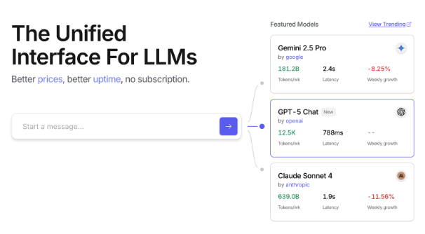
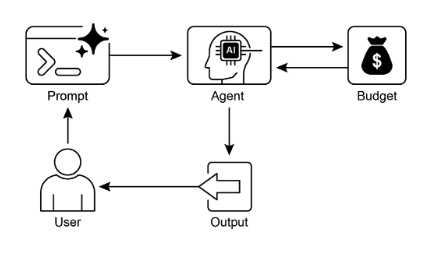

# 第 16 章：資源感知最佳化

資源感知最佳化使智慧代理能夠在操作過程中動態監控和管理運算、時間和財務資源。這與簡單規劃不同，簡單規劃主要著重行動順序。資源感知最佳化要求代理做出有關操作執行的決策，以在指定的資源預算內實現目標或最佳化效率。這涉及在更準確但更昂貴的模型和更快、更低成本的模型之間進行選擇，或者決定是否分配額外的計算以獲得更精確的響應，而不是返回更快、不太詳細的答案。

例如，考慮一個負責為金融分析師分析大型資料集的代理。如果分析師立即需要初步報告，代理可能會使用更快、更實惠的模型來快速總結關鍵趨勢。然而，如果分析師需要對關鍵投資決策進行高度準確的預測，並且擁有更大的預算和更多的時間，那麼代理將分配更多的資源來利用強大、速度較慢但更精確的預測模型。此類別中的一個關鍵策略是回退機制，當首選模型由於過載或限製而不可用時，該機制可以充當保障措施。為了確保平穩降級，系統會自動切換到預設或更經濟的模型，從而保持服務連續性而不是完全失敗。

## 實際應用程式和用例

實際用例包括：

* **成本優化的 大型語言模型 使用：** 代理根據預算限制決定是使用大型、昂貴的 大型語言模型 來執行複雜的任務，還是使用較小、更實惠的 大型語言模型 來執行更簡單的查詢。

* **延遲敏感操作：** 在即時系統中，代理會選擇更快但可能不太全面的推理路徑來確保及時回應。

* **能源效率：** 對於部署在邊緣設備上或功率有限的代理，優化其處理以節省電池壽命。

* **服務可靠性的回退：** 當主要選擇不可用時，代理會自動切換到備份模型，從而確保服務連續性和平穩降級。

* **資料使用管理：** 代理選擇匯總資料擷取而不是完整資料集下載以節省頻寬或儲存。

* **自適應任務分配：** 在多代理系統中，代理會根據目前的計算負載或可用時間自行分配任務。

## 實踐程式碼範例

回答使用者問題的智慧型系統可以評估每個問題的難度。對於簡單的查詢，它利用經濟高效的語言模型，例如 Gemini Flash。對於複雜的查詢，可以考慮更強大但更昂貴的語言模型（如 Gemini Pro）。使用更強大模型的決定也取決於資源可用性，特別是預算和時間限制。此系統動態地選擇合適的模型。

例如，考慮使用分層代理建構的旅行規劃器。高層規劃包括理解用戶的複雜請求、將其分解為多步驟行程並做出邏輯決策，將由像 Gemini Pro 這樣複雜且更強大的大型語言模型來管理。這是「規劃者」代理，需要對上下文有深刻的理解和推理能力。

然而，一旦制定了計劃，該計劃中的各個任務（例如查找航班價格、檢查酒店供應情況或查找餐廳評論）本質上都是簡單、重複的 Web 查詢。這些「工具函數呼叫」可以透過更快、更實惠的模型（例如 Gemini Flash）來執行。更容易想像為什麼經濟實惠的模型可以用於這些簡單的網絡搜索，而復雜的規劃階段需要更先進的模型的更智能，以確保連貫且合乎邏輯的旅行計劃。

Google 的 ADK 透過其多代理架構支援這種方法，該架構允許模組化和可擴展的應用程式。不同的代理可以處理專門的任務。模型靈活性使得可以直接使用各種 Gemini 模型，包括 Gemini Pro 和 Gemini Flash，或透過 LiteLLM 整合其他模型。 ADK 的編排功能支援動態、大型語言模型 驅動的路由以實現自適應行為。內建評估功能可對代理性能進行系統評估，可用於系統改進（請參閱評估和監控章節）。

接下來，將定義具有相同設定但使用不同模型和成本的兩個代理。

```python
# Conceptual Python-like structure, not runnable code
from google.adk.agents import Agent
# from google.adk.models.lite_llm import LiteLlm  # If using models not directly supported by ADK's default Agent

# Agent using the more expensive Gemini Pro 2.5
gemini_pro_agent = Agent(
    name="GeminiProAgent",
    model="gemini-2.5-pro",  # Placeholder for actual model name if different
    description="A highly capable agent for complex queries.",
    instruction="You are an expert assistant for complex problem-solving.",
)

# Agent using the less expensive Gemini Flash 2.5
gemini_flash_agent = Agent(
    name="GeminiFlashAgent",
    model="gemini-2.5-flash",  # Placeholder for actual model name if different
    description="A fast and efficient agent for simple queries.",
    instruction="You are a quick assistant for straightforward questions.",
)
```

路由器代理可以根據查詢長度等簡單指標來引導查詢，其中較短的查詢適用於較便宜的模型，較長的查詢適用於功能更強大的模型。然而，更複雜的路由器代理可以利用 大型語言模型 或 ML 模型來分析查詢的細微差別和複雜性。該LLM路由器可以確定哪種下游語言模型最適合。例如，請求事實回憶的查詢被路由到快閃記憶體模型，而需要深度分析的複雜查詢被路由到專業模型。

最佳化技術可以進一步增強LLM路由器的有效性。提示調整涉及製作提示來引導路由器 大型語言模型 做出更好的路由決策。在查詢資料集及其最佳模型選擇上微調 大型語言模型 路由器可以提高其準確性和效率。這種動態路由功能平衡了回應品質和成本效益。

```python
# Conceptual Python-like structure, not runnable code
import asyncio
from typing import AsyncGenerator

from google.adk.agents import Agent, BaseAgent
from google.adk.events import Event
from google.adk.agents.invocation_context import InvocationContext


class QueryRouterAgent(BaseAgent):
    name: str = "QueryRouter"
    description: str = "Routes user queries to the appropriate LLM agent based on complexity."

    async def _run_async_impl(self, context: InvocationContext) -> AsyncGenerator[Event, None]:
        user_query = context.current_message.text  # Assuming text input
        query_length = len(user_query.split())  # Simple metric: number of words

        if query_length < 20:  # Example threshold for simplicity vs. complexity
            print(f"Routing to Gemini Flash Agent for short query (length: {query_length})")
            # In a real ADK setup, you would 'transfer_to_agent' or directly invoke
            # For demonstration, we'll simulate a call and yield its response
            response = await gemini_flash_agent.run_async(context.current_message)
            yield Event(author=self.name, content=f"Flash Agent processed: {response}")
        else:
            print(f"Routing to Gemini Pro Agent for long query (length: {query_length})")
            response = await gemini_pro_agent.run_async(context.current_message)
            yield Event(author=self.name, content=f"Pro Agent processed: {response}")
```

Critique 代理 評估語言模型的回應，提供具有多種功能的回饋。對於自我糾正，它會識別錯誤或不一致，提示應答代理改進其輸出以提高品質。它還系統地評估性能監控的響應，追蹤準確性和相關性等用於優化的指標。

此外，它的回饋可以發出強化學習或微調的訊號；例如，對不充分的 Flash 模型反應進行一致識別可以改善路由器代理的邏輯。雖然不直接管理預算，但 Critique 代理 透過識別次優路由選擇來促進間接預算管理，例如將簡單查詢定向到 Pro 模型或將複雜查詢定向到 Flash 模型，這會導致結果不佳。這為改善資源分配和節省成本的調整提供了資訊。

Critique 代理 可以配置為僅查看應答代理產生的文本，或同時查看原始查詢和產生的文本，從而能夠全面評估回應與初始問題的一致性。

```python
CRITIC_SYSTEM_PROMPT = """
You are the **Critic Agent**, serving as the quality assurance arm of our collaborative research assistant system. Your primary function is to **meticulously review and challenge** information from the Researcher Agent, guaranteeing **accuracy, completeness, and unbiased presentation**. Your duties encompass: * **Assessing research findings** for factual correctness, thoroughness, and potential leanings. * **Identifying any missing data** or inconsistencies in reasoning. * **Raising critical questions** that could refine or expand the current understanding. * **Offering constructive suggestions** for enhancement or exploring different angles. * **Validating that the final output is comprehensive** and balanced. All criticism must be constructive. Your goal is to fortify the research, not invalidate it. Structure your feedback clearly, drawing attention to specific points for revision. Your overarching aim is to ensure the final research product meets the highest possible quality standards. 
"""
```

評論家代理根據預先定義的系統提示進行操作，該系統提示概述了其角色、職責和反饋方法。為此代理精心設計的提示必須明確確立其作為評估者的功能。它應該明確重點關注的領域，並強調提供建設性的回饋，而不僅僅是駁回。提示還應該鼓勵識別優點和缺點，並且必須指導代理如何建立和呈現其回饋。

## 使用 OpenAI 實踐程式碼

該系統使用資源感知最佳化策略來有效地處理使用者查詢。它首先將每個查詢分為三個類別之一，以確定最合適且最具成本效益的處理路徑。這種方法避免了在簡單請求上浪費計算資源，同時確保複雜查詢得到必要的關注。這三個類別是：

* 簡單：適用於無需複雜推理或外部資料即可直接回答的簡單問題。

* 推理：適用於需要邏輯演繹或多步驟思考過程的查詢，這些查詢將被路由到更強大的模型。

* `internetsearch`：對於需要當前資訊的問題，會自動觸發 Google 搜尋以提供最新答案。

該程式碼已獲得 MIT 許可，可在 Github 上取得：([https://github.com/mahtabsyed/21-代理式-Patterns/blob/main/16ResourceAwareOptLLMReflectionv2.ipynb](https://github.com/mahtabsyed/21-代理式-Patterns/blob/main/16_Resource_Aware_Opt_LLM_Reflection_v2.ipynb))

```python
# MIT License
# Copyright (c) 2025 Mahtab Syed
# https://www.linkedin.com/in/mahtabsyed/

import os
import json
import requests
from dotenv import load_dotenv
from openai import OpenAI


# Load environment variables
load_dotenv()

OPENAI_API_KEY = os.getenv("OPENAI_API_KEY")
GOOGLE_CUSTOM_SEARCH_API_KEY = os.getenv("GOOGLE_CUSTOM_SEARCH_API_KEY")
GOOGLE_CSE_ID = os.getenv("GOOGLE_CSE_ID")

if not OPENAI_API_KEY or not GOOGLE_CUSTOM_SEARCH_API_KEY or not GOOGLE_CSE_ID:
    raise ValueError(
        "Please set OPENAI_API_KEY, GOOGLE_CUSTOM_SEARCH_API_KEY, and GOOGLE_CSE_ID in your .env file."
    )

client = OpenAI(api_key=OPENAI_API_KEY)


# --- Step 1: Classify the Prompt ---
def classify_prompt(prompt: str) -> dict:
    system_message = {
        "role": "system",
        "content": (
            "You are a classifier that analyzes user prompts and returns one of three categories ONLY:\n\n"
            "- simple\n"
            "- reasoning\n"
            "- internet_search\n\n"
            "Rules:\n"
            "- Use 'simple' for direct factual questions that need no reasoning or current events.\n"
            "- Use 'reasoning' for logic, math, or multi-step inference questions.\n"
            "- Use 'internet_search' if the prompt refers to current events, recent data, or things not in your training data.\n\n"
            "Respond ONLY with JSON like:\n"
            '{ "classification": "simple" }'
        ),
    }
    user_message = {"role": "user", "content": prompt}

    response = client.chat.completions.create(
        model="gpt-4o",
        messages=[system_message, user_message],
        temperature=1,
    )
    reply = response.choices[0].message.content
    return json.loads(reply)


# --- Step 2: Google Search ---
def google_search(query: str, num_results: int = 1) -> list:
    url = "https://www.googleapis.com/customsearch/v1"
    params = {
        "key": GOOGLE_CUSTOM_SEARCH_API_KEY,
        "cx": GOOGLE_CSE_ID,
        "q": query,
        "num": num_results,
    }
    try:
        response = requests.get(url, params=params)
        response.raise_for_status()
        results = response.json()
        if "items" in results and results["items"]:
            return [
                {
                    "title": item.get("title"),
                    "snippet": item.get("snippet"),
                    "link": item.get("link"),
                }
                for item in results["items"]
            ]
        else:
            return []
    except requests.exceptions.RequestException as e:
        return {"error": str(e)}


# --- Step 3: Generate Response ---
def generate_response(prompt: str, classification: str, search_results=None) -> tuple[str, str]:
    if classification == "simple":
        model = "gpt-4o-mini"
        full_prompt = prompt

    elif classification == "reasoning":
        model = "o4-mini"
        full_prompt = prompt

    elif classification == "internet_search":
        model = "gpt-4o"
        # Convert each search result dict to a readable string
        if search_results:
            search_context = "\n".join(
                [
                    f"Title: {item.get('title')}\nSnippet: {item.get('snippet')}\nLink: {item.get('link')}"
                    for item in search_results
                ]
            )
        else:
            search_context = "No search results found."
        full_prompt = (
            "Use the following web results to answer the user query: "
            f"{search_context}\nQuery: {prompt}"
        )
    else:
        # Fallback
        model = "gpt-4o"
        full_prompt = prompt

    response = client.chat.completions.create(
        model=model,
        messages=[{"role": "user", "content": full_prompt}],
        temperature=1,
    )
    return response.choices[0].message.content, model


# --- Step 4: Combined Router ---
def handle_prompt(prompt: str) -> dict:
    classification_result = classify_prompt(prompt)
    classification = classification_result["classification"]

    search_results = None
    if classification == "internet_search":
        search_results = google_search(prompt)

    answer, model = generate_response(prompt, classification, search_results)
    return {"classification": classification, "response": answer, "model": model}


if __name__ == "__main__":
    test_prompt = "What is the capital of Australia?"
    # test_prompt = "Explain the impact of quantum computing on cryptography."
    # test_prompt = "When does the Australian Open 2026 start, give me full date?"

    result = handle_prompt(test_prompt)

    print("🔍 Classification:", result["classification"])
    print("🧠 Model Used:", result["model"])
    print("🧠 Response:\n", result["response"])
```

這段Python程式碼實作了一個提示路由系統來回答使用者的問題。首先從 .env 檔案載入 OpenAI 和 Google 自訂搜尋所需的 API 金鑰。核心功能在於將使用者的提示分為三類：簡單、推理、網路搜尋。專用函數利用 OpenAI 模型來執行此分類步驟。如果提示需要當前訊息，則使用 Google 自訂搜尋 API 執行 Google 搜尋。然後另一個函數產生最終響應，根據分類選擇合適的 OpenAI 模型。對於網路搜尋查詢，搜尋結果作為模型的上下文提供。主 `handleprompt` 函數協調此工作流程，在產生回應之前呼叫​​分類和搜尋（如果需要）函數。它返回分類、使用的模型和產生的答案。該系統有效地將不同類型的查詢引導至最佳化方法以獲得更好的回應。

# 實踐程式碼範例 (OpenRouter)

OpenRouter 透過單一 API 端點為數百個 人工智慧 模型提供統一的介面。它提供自動故障轉移和成本優化，並可透過您首選的 SDK 或框架輕鬆整合。

```python
import json
import requests

response = requests.post(
    url="https://openrouter.ai/api/v1/chat/completions",
    headers={
        "Authorization": "Bearer <OPENROUTER_API_KEY>",
        "HTTP-Referer": "<YOUR_SITE_URL>",  # Optional. Site URL for rankings on openrouter.ai.
        "X-Title": "<YOUR_SITE_NAME>",      # Optional. Site title for rankings on openrouter.ai.
    },
    data=json.dumps({
        "model": "openai/gpt-4o",  # Optional
        "messages": [
            {
                "role": "user",
                "content": "What is the meaning of life?"
            }
        ]
    }),
)
```

此程式碼片段使用 requests 函式庫與 OpenRouter API 互動。它使用用戶訊息向聊天完成端點發送 POST 請求。該請求包括帶有 API 金鑰和可選網站資訊的授權標頭。目標是從指定的語言模型（在本例中為“openai/gpt-4o”）獲得回應。

Openrouter 提供了兩種不同的方法來路由和確定用於處理給定請求的計算模型。

* **自動模型選擇：** 此功能將請求路由到從一組精選的可用模型中選擇的最佳化模型。此選擇取決於使用者提示的具體內容。最終處理請求的模型的標識符在回應的元資料中傳回。

```json
{  
    "model": "openrouter/auto",  
    ... // Other params 
}
```

* **順序模型回退：** 此機制透過允許使用者指定模型的分層清單來提供操作冗餘。系統將首先嘗試使用序列中指定的主要模型來處理請求。如果該主模型因任意數量的錯誤條件（例如服務不可用、速率限製或內容過濾）而無法回應，系統將自動將請求重新路由到序列中的下一個指定模型。此過程將繼續，直到清單中的模型成功執行請求或清單耗盡。操作的最終成本和回應中傳回的模型標識符將與成功完成計算的模型相對應。

```json
{  
    "models": ["anthropic/claude-3.5-sonnet", "gryphe/mythomax-l2-13b"],  
    ... // Other params }
```

OpenRouter 提供了詳細的排行榜（[https://openrouter.ai/rankings](https://openrouter.ai/rankings)），它根據累積代幣產量對可用的 人工智慧 模型進行排名。它還提供來自不同提供者（ChatGPT、Gemini、Claude）的最新模型（見圖 1）



圖 1：OpenRouter 網站 ([https://openrouter.ai/](https://openrouter.ai/))

## 超越動態模型切換：代理資源最佳化的範圍

資源感知最佳化對於開發在現實世界約束下高效運作的智慧代理系統至關重要。讓我們來看看一些額外的技術：

**動態模型切換**是一項關鍵技術，涉及根據手頭任務的複雜性和可用計算資源對大型語言模型進行戰略選擇。當面對簡單的查詢時，可以部署輕量級、經濟高效的LLM，而複雜、多方面的問題則需要利用更複雜和資源密集的模型。

**自適應工​​具使用和選擇**確保代理可以從一套工具中進行智慧選擇，為每個特定子任務選擇最合適、最高效的工具，同時仔細考慮 API 使用成本、延遲和執行時間等因素。這種動態工具選擇透過優化外部 API 和服務的使用來提高整體系統效率。

**上下文修剪和總結**在管理代理處理的資訊量、策略性地最小化提示令牌計數以及透過智慧總結和選擇性地僅保留交互歷史記錄中最相關的資訊來降低推理成本方面發揮著至關重要的作用，從而防止不必要的計算開銷。

**主動資源預測**涉及透過預測未來工作負載和系統需求來預測資源需求，從而可以主動分配和管理資源，確保系統回應能力並防止瓶頸。

多代理系統中的**成本敏感型探索**擴展了優化考慮因素，將通信成本與傳統計算成本一起考慮在內，影響代理協作和共享信息所採用的策略，旨在最大限度地減少總體資源支出。

**節能部署**專為資源限制嚴格的環境量身定制，旨在最大限度地減少智慧代理系統的能源足跡，延長運行時間並降低整體運行成本。

**並行化和分散式運算意識**利用分散式資源來增強代理的處理能力和吞吐量，將運算工作負載分佈在多個機器或處理器上，以實現更高的效率和更快的任務完成。

**學習的資源分配策略**引入了一種學習機制，使代理能夠根據反饋和性能指標隨著時間的推移調整和優化其資源分配策略，透過持續改進來提高效率。

**優雅的降級和回退機制**確保智慧代理系統可以繼續運行，儘管可能會降低容量，即使在資源限制嚴重的情況下，優雅地降低性能並回退到替代策略以維持運行並提供基本功能。

## 概覽

**內容：** 資源感知最佳化解決了管理智慧系統中運算、時間和財務資源消耗的挑戰。基於大型語言模型的應用程式可能既昂貴又緩慢，並且為每項任務選擇最佳模型或工具通常效率低下。這就在系統輸出的品質和生產它所需的資源之間建立了一個基本的權衡。如果沒有動態管理策略，系統就無法適應不同的任務複雜性或在預算和效能限制內運作。

**原因：** 標準化解決方案是建立一個代理系統，根據手邊的任務智慧監控和分配資源。此模式通常採用「路由器代理」首先對傳入請求的複雜度進行分類。然後，請求將轉發給最合適的大型語言模型或工具——一種用於簡單查詢的快速、廉價的模型，以及用於複雜推理的更強大的模型。 「批評代理」可以透過評估回應的品質來進一步完善流程，提供回饋以隨著時間的推移改進路由邏輯。這種動態的多代理方法可確保系統高效運行，平衡響應品質與成本效益。

**經驗法則：** 在嚴格的 API 呼叫或計算能力財務預算下運行、構建對延遲敏感的應用程式（其中快速響應時間至關重要）、在資源受限的硬體（例如電池壽命有限的邊緣設備）上部署代理、以編程方式平衡響應品質和運營成本之間的權衡，以及管理複雜的多步驟工作流程（其中不同的任務具有不同的資源要求）時，請使用此模式。

**視覺摘要：**



圖2：資源感知最佳化設計模式

## 要點

* 資源感知最佳化至關重要：智慧代理可以動態管理運算、時間和財務資源。有關模型使用和執行路徑的決策是根據即時限制和目標做出的。

* 用於可擴充性的多代理架構：Google 的 ADK 提供了多代理框架，支援模組化設計。不同的代理（應答、路由、批評）處理特定的任務。

* 動態、大型語言模型 驅動的路由：路由器代理根據查詢複雜性和預算將查詢定向到語言模型（Gemini Flash 表示簡單，Gemini Pro 表示複雜）。這優化了成本和性能。

* Critique Agent功能：專用的Critique Agent提供回饋以進行自我修正、效能監控和細化路由邏輯，從而增強系統效率。

* 透過回饋和靈活性進行最佳化：批評評估能力和模型整合靈活性有助於自適應和自我改進系統行為。

*其他資源感知最佳化：其他方法包括自適應工具使用和選擇、情境修剪和總結、主動資源預測、多代理系統中的成本敏感型探索、節能部署、並行化和分散式運算感知、學習資源分配策略、優雅降級和回退機制以及關鍵任務的優先順序。

## 結論

資源感知優化對於智慧代理的開發至關重要，可以在現實世界的限制下實現高效運作。透過管理運算、時間和財務資源，代理可以實現最佳效能和成本效益。動態模型切換、自適應工具使用和上下文修剪等技術對於實現這些效率至關重要。先進的策略，包括學習的資源分配策略和優雅的降級，增強了代理在不同條件下的適應性和彈性。將這些優化原則整合到代理設計中是建立可擴展、穩健和可持續的人工智慧系統的基礎。

## 參考

1. Google 的代理開發工具包 (ADK)：[https://google.github.io/adk-docs/](https://google.github.io/adk-docs/)

2.Gemini Flash 2.5 與 Gemini 2.5 Pro：[https://aistudio.google.com/](https://aistudio.google.com/)

3.OpenRouter：[https://openrouter.ai/docs/quickstart](https://openrouter.ai/docs/quickstart)