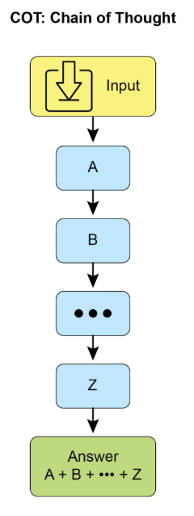
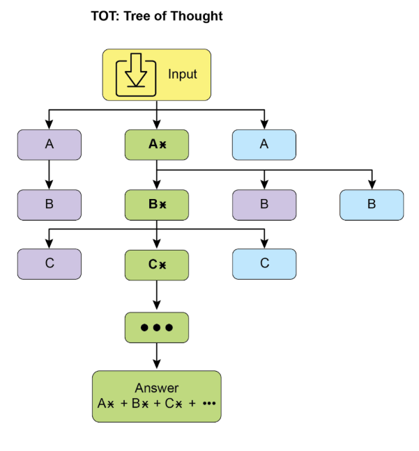
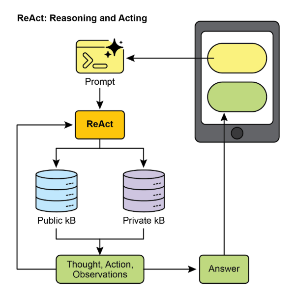
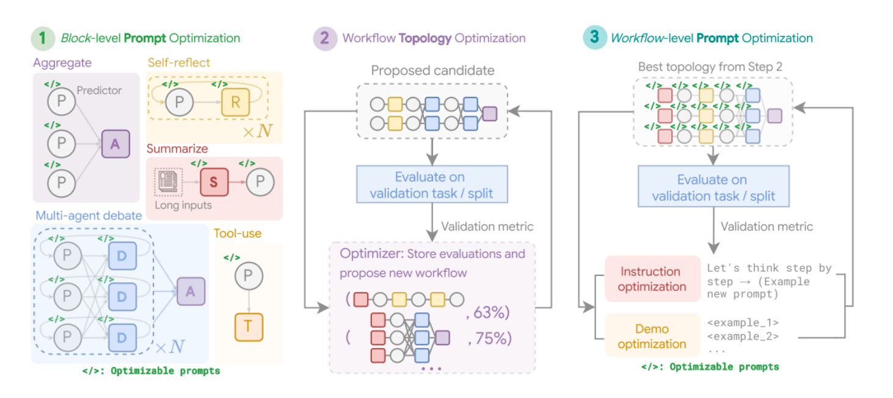
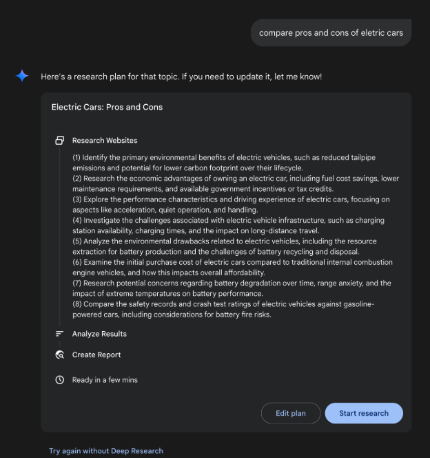
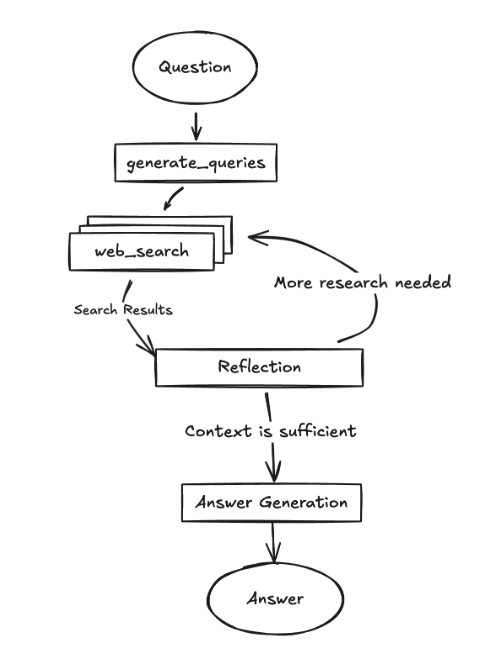
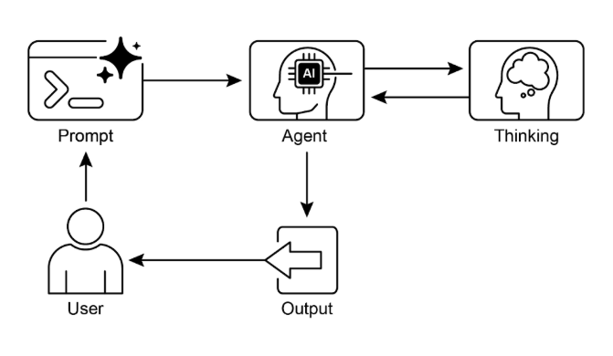

# 第 17 章：推理技巧

本章深入研究智能代理的高階推理方法，重點在於多步驟邏輯推理和問題解決。這些技巧超越了簡單的順序操作，使代理的內部推理變得明確。這使得代理能夠分解問題、考慮中間步驟並得出更穩健和準確的結論。  這些先進方法的核心原則是在推理過程中分配更多的計算資源。這意味著授予代理或底層 大型語言模型 更多的處理時間或步驟來處理查詢並產生回應。代理可以進行迭代細化、探索多個解決方案路徑或利用外部工具，而不是快速單次傳遞。推理過程中處理時間的延長通常會顯著提高準確性、連貫性和穩健性，特別是對於需要更深入分析和審議的複雜問題。

## 實際應用程式和用例

實際應用包括：

* **複雜問答：** 促進多跳查詢的解決，這需要整合不同來源的資料並執行邏輯推演，可能涉及多個推理路徑的檢查，並受益於延長的推理時間來綜合資訊。

* **數學問題解決：** 將數學問題分成更小的可解決部分，說明逐步過程，並使用程式碼執行進行精確計算，其中長時間的推理可以實現更複雜的程式碼產生和驗證。

* **程式碼偵錯與產生：** 支援代理解釋其產生或修正程式碼的基本原理，按順序找出潛在問題，並根據測試結果迭代地完善程式碼（自我修正），利用延長的推理時間進行徹底的偵錯週期。

* **策略規劃：** 透過對各種選項、後果和先決條件進行推理，並根據即時回饋 (ReAct) 調整計劃，協助制定全面計劃，其中擴展的審議可以產生更有效和可靠的計劃。

* **醫學診斷：** 幫助代理系統地評估症狀、測試結果和患者病史以達成診斷，闡明每個階段的推理，並可能利用外部儀器進行資料檢索 (ReAct)。增加推理時間可以實現更全面的鑑別診斷。

* **法律分析：** 支持對法律文件和先例的分析，以製定論點或提供指導，詳細說明所採取的邏輯步驟，並透過自我糾正確保邏輯一致性。增加推理時間可以進行更深入的法律研究和論證建構。

## 推理技巧

首先，讓我們深入研究用於增強人工智慧模型解決問題能力的核心推理技術。

**思維鏈 (CoT)** 提示透過模仿逐步的思考過程，顯著增強了大型語言模型的複雜推理能力（見圖 1）。 CoT 提示不是提供直接答案，而是指導模型產生一系列中間推理步驟。這種明確的分解使得大型語言模型能夠透過將複雜問題分解為更小、更易於管理的子問題來解決這些問題。該技術顯著提高了模型在需要多步驟推理的任務上的性能，例如算術、常識推理和符號操作。 CoT 的主要優點是能夠將困難的單步驟問題轉化為一系列更簡單的步驟，從而提高大型語言模型推理過程的透明度。這種方法不僅提高了準確性，而且還為模型的決策提供了寶貴的見解，有助於調試和理解。  CoT 可以使用各種策略來實現，包括提供少量範例來演示逐步推理或簡單地指示模型「逐步思考」。它的有效性源於它能夠引導模型​​的內部處理朝著更深思熟慮和合乎邏輯的方向發展。因此，思想鏈已成為當代大型語言模型實現高級推理能力的基石技術。這種增強的透明度以及將複雜問題分解為可管理的子問題對於自主代理來說尤其重要，因為它使它們能夠在複雜的環境中執行更可靠和可審計的操作。



圖 1：CoT 提示以及代理產生的詳細逐步回應。

讓我們來看一個例子。  它首先是一組指令，告訴人工智慧如何思考、定義其角色以及要遵循的明確的五步驟流程。這是引發結構化思考的提示。

接下來，該範例顯示了正在運行的 CoT 流程。標示為「代理的思考過程」的部分是模型執行指示步驟的內在獨白。這就是字面上的「思想鏈」。最後，「代理的最終答案」是經過仔細、逐步的推理過程而產生的經過精心處理的綜合輸出

```markdown
You are an Information Retrieval Agent. Your goal is to answer the user's question comprehensively and accurately by thinking step-by-step. 

Here's the process you must follow: 
1.  **Analyze the Query:** Understand the core subject and specific requirements of the user's question. Identify key entities, keywords, and the type of information being sought. 
2.  **Formulate Search Queries (for Knowledge Base):** Based on your analysis, generate a list of precise search queries that you would use to retrieve relevant information from a knowledge base or external tools. 
3.  **Simulate Information Retrieval (Self-Correction/Reasoning):** For each search query, mentally consider what kind of information you expect to find. If you were to retrieve the content, what would be the most relevant snippets? Think about potential ambiguities or missing pieces. 
4.  **Synthesize Information:** Based on the simulated retrieval and your understanding of the user's original query, synthesize the gathered information into a coherent and complete answer. Ensure all aspects of the query are addressed. 
5.  **Review and Refine:** Before finalizing, critically evaluate your answer. Is it accurate? Is it comprehensive? Is it easy to understand? Is it concise? If not, identify what needs to be improved and how. 

**User Query:** "Explain the main differences between classical computers and quantum computers, and briefly describe a potential application of quantum computing." 

**Agent's Thought Process (Internal CoT Output - encouraged by the prompt):** 

**Thought 1 (Analyze Query):** 
The user wants two things: 
    1.  Main differences between classical and quantum computers. 
    2.  One potential application of quantum computing. Keywords: classical computers, quantum computers, differences, potential application. 

**Thought 2 (Formulate Search Queries):** 
    - "differences classical vs quantum computers" 
    - "how quantum computers work" 
    - "how classical computers work" 
    - "applications of quantum computing" 
    
**Thought 3 (Simulate Information Retrieval & Identify Key Concepts):** 
    - From "differences": Expect concepts like bits vs. qubits, superposition, entanglement, probabilistic nature, computational power for specific problems. 
    - From "how they work": Classical uses transistors/binary. Quantum uses quantum mechanics. 
    - From "applications": Expect drug discovery, material science, cryptography, optimization. 

**Thought 4 (Synthesize Information):** 
Classical computers use bits (0 or 1), processing information sequentially. Quantum computers use qubits, which can be 0, 1, or both simultaneously (superposition), and can be entangled, allowing for vastly different computational approaches. This enables them to solve certain problems (like factoring large numbers or simulating complex molecules) far more efficiently than classical computers. A potential application is in drug discovery, where quantum computers could simulate molecular interactions with unprecedented accuracy, accelerating the development of new medicines. 

**Thought 5 (Review and Refine):** 
    - Differences are covered (bits vs qubits, superposition, entanglement, processing). 
    - Application is given (drug discovery). - Is it brief? Yes. - Is it clear? Yes. - Looks good. 

**Agent's Final Answer (Output to User):** 
Classical computers process information using bits, which can be either a 0 or a 1 at any given time, performing operations sequentially. In contrast, quantum computers utilize qubits, which can exist in multiple states simultaneously through superposition and can be linked through entanglement, allowing for exponentially more complex computations. This fundamental difference enables quantum machines to tackle certain problems, such as simulating molecular structures or breaking complex encryption, that are intractable for even the most powerful classical supercomputers. A significant potential application of quantum computing lies in drug discovery, where its ability to precisely model molecular behavior could revolutionize the development of new pharmaceuticals.
```

**思想樹 (ToT)** 是一種建立在思想鏈 (CoT) 之上的推理技術。它允許大型語言模型透過分支到不同的中間步驟來探索多個推理路徑，形成樹狀結構（見圖2\）。這種方法透過啟用回溯、自我糾正和探索替代解決方案來支援複雜的問題解決。維護可能性樹允許模型在最終確定答案之前評估各種推理軌跡。這個迭代過程增強了模型處理需要策略規劃和決策的挑戰性任務的能力。



圖2：思想樹範例

**自我修正**，也稱為自我完善，是代理推理過程的一個重要方面，特別是在思維鏈提示中。它涉及代理對其生成的內容和中間思維過程的內部評估。這種嚴格的審查使代理能夠識別其理解或解決方案中的歧義、資訊差距或不準確之處。這種審查和細化的迭代循環允許代理調整其方法，提高響應品質，並在提供最終輸出之前確保準確性和徹底性。這種內部批評增強了代理產生可靠和高品質結果的能力，如專門第 4 章中的範例所示。

這個例子展示了一個系統的自我修正過程，對於完善人工智慧產生的內容至關重要。它涉及起草、審查原始要求以及實施具體改進的迭代循環。插圖首先概述了人工智慧作為「自我糾正代理」的功能，並定義了五步驟分析和修訂工作流程。隨後，社群媒體貼文的「初稿」品質不佳。 「自我修正代理的思考過程」構成了演示的核心。在這裡，代理根據其指示對草案進行批判性評估，找出諸如參與度低和行動呼籲模糊等弱點。然後，它提出了具體的改進建議，包括使用更有影響力的動詞和表情符號。這個過程以「最終修訂內容」結束，這是一個經過打磨且顯著改進的版本，整合了自我識別的調整。

```markdown
You are a highly critical and detail-oriented Self-Correction Agent. Your task is to review a previously generated piece of content against its original requirements and identify areas for improvement. Your goal is to refine the content to be more accurate, comprehensive, engaging, and aligned with the prompt. 

Here's the process you must follow for self-correction: 

1.  **Understand Original Requirements:** Review the initial prompt/requirements that led to the content's creation. What was the *original intent*? What were the key constraints or goals? 
2.  **Analyze Current Content:** Read the provided content carefully. 
3.  **Identify Discrepancies/Weaknesses:** Compare the current content against the original requirements. Look for:    
    * **Accuracy Issues:** Are there any factual errors or misleading statements?    
    * **Completeness Gaps:** Does it fully address all aspects of the original prompt? Is anything missing?    
    * **Clarity & Coherence:** Is the language clear, concise, and easy to understand? Does it flow logically?    
    * **Tone & Style:** Does it match the desired tone and style (e.g., professional, engaging, concise)?    
    * **Engagement:** Is it captivating? Does it hold the reader's attention?    
    * **Redundancy/Verbosity:** Can any parts be condensed or removed without losing meaning? 
4.  **Propose Specific Improvements:** For each identified weakness, suggest concrete and actionable changes. Do not just state the problem; propose a solution. 
5.  **Generate Revised Content:** Based on your proposed improvements, rewrite the original content to incorporate all the necessary changes. Ensure the revised content is polished and ready for final use. 

**Original Prompt/Requirements:** "Write a short, engaging social media post (max 150 characters) announcing a new eco-friendly product line: 'GreenTech Gadgets'." 

**Initial Draft (Content to be corrected):** "We have new products. They are green and techy. Buy GreenTech Gadgets now!" 

**Self-Correction Agent's Thought Process (Internal CoT Output - encouraged by the prompt):** 

**Thought 1 (Understand Original Requirements):** 
    - Short, engaging social media post. 
    - Max 150 characters. 
    - Announce "GreenTech Gadgets" - a new eco-friendly product line. 

**Thought 2 (Analyze Current Content):** 
"We have new products. They are green and techy. Buy GreenTech Gadgets now!" (64 characters) 

**Thought 3 (Identify Discrepancies/Weaknesses):** - **Engaging:** Not very engaging. Sounds generic. - **Eco-friendly:** Implied by "green," but not explicitly highlighted as a benefit. - **Call to Action:** "Buy now!" is okay, but could be more compelling. - **Conciseness:** It's short, but could use stronger verbs/phrasing. - **Impact:** Lacks excitement for a new product launch. 

**Thought 4 (Propose Specific Improvements):** - Make it more dynamic and exciting. - Emphasize "eco-friendly" and "innovation." - Use stronger verbs and more active voice. - Add a clear, engaging call to action. - Ensure it stays under 150 characters. **Thought 5 (Generate Revised Content):** Original: "We have new products. They are green and techy. Buy GreenTech Gadgets now!" Revised idea 1: "🌱 Discover GreenTech Gadgets! Our new eco-friendly line blends innovation with sustainability. Go green, go smart! Shop now! #EcoFriendly #GreenTech" (148 characters) This revision directly addresses eco-friendliness, uses emojis for engagement, adds a stronger call to action, and includes relevant hashtags while staying within the character limit. **Self-Correction Agent's Final Revised Content (Output to User):** 🌱 Discover GreenTech Gadgets! Our new eco-friendly line blends innovation with sustainability. Go green, go smart! Shop now! #EcoFriendly #GreenTech
```

從根本上說，該技術將品質控制措施直接整合到代理的內容生成中，產生更精細、更精確、更卓越的結果，更有效地滿足複雜的用戶需求。

**程序輔助語言模型 (PALM)** 將大型語言模型與符號推理功能整合。這種整合允許大型語言模型產生和執行程式碼，例如Python，作為其解決問題過程的一部分。 PALM 將複雜的計算、邏輯運算和資料操作轉移到確定性程式設計環境中。這種方法利用了傳統程式設計的優勢來完成大型語言模型可能在準確性或一致性方面有其限制的任務。當面臨符號挑戰時，模型可以產生程式碼、執行程式碼，並將結果轉換為自然語言。這種混合方法將大型語言模型的理解和生成能力與精確計算相結合，使模型能夠解決更廣泛的複雜問題，並可能提高可靠性和準確性。這對於代理來說非常重要，因為它允許他們透過利用精確計算以及理解和生成能力來執行更準確和可靠的操作。一個例子是使用 Google ADK 中的外部工具來產生程式碼。

```python
from google.adk.tools import agent_tool
from google.adk.agents import Agent
from google.adk.tools import google_search
from google.adk.code_executors import BuiltInCodeExecutor


search_agent = Agent(
    model="gemini-2.0-flash",
    name="SearchAgent",
    instruction="""
    You're a specialist in Google Search
    """,
    tools=[google_search],
)

coding_agent = Agent(
    model="gemini-2.0-flash",
    name="CodeAgent",
    instruction="""
    You're a specialist in Code Execution
    """,
    code_executor=BuiltInCodeExecutor(),
)

root_agent = Agent(
    name="RootAgent",
    model="gemini-2.0-flash",
    description="Root Agent",
    tools=[
        agent_tool.AgentTool(agent=search_agent),
        agent_tool.AgentTool(agent=coding_agent),
    ],
)
```

**具有可驗證獎勵的強化學習 (RLVR)：** 雖然有效，但許多大型語言模型使用的標準思想鏈 (CoT) 提示是一種基本的推理方法。它產生單一的、預定的思路，而不適應問題的複雜性。為了克服這些限制，開發了一類新的專門「推理模型」。這些模型的運作方式不同，在提供答案之前會投入不同數量的「思考」時間。這個「思考」過程產生了一個更廣泛和動態的思想鏈，可以有數千個令牌長。這種擴展推理允許更複雜的行為，例如自我糾正和回溯，模型將更多精力投入更困難的問題。支持這些模型的關鍵創新是一種名為「可驗證獎勵強化學習」(RLVR) 的訓練策略。透過針對已知正確答案（例如數學或程式碼）的問題訓練模型，它可以透過反覆試驗來學習，以產生有效的長式推理。這使得模型能夠在沒有人類直接監督的情況下發展其解決問題的能力。最終，這些推理模型不僅會產生答案，還會產生答案。他們產生一個“推理軌跡”，展示規劃、監控和評估等高級技能。這種增強的推理和製定策略的能力是自主人工智慧代理開發的基礎，它可以在最少的人工幹預下分解和解決複雜的任務。

**ReAct**（推理和行動，見圖 3，其中 KB 代表知識庫）是一種將思想鏈 (CoT) 提示與代理透過工具與外部環境互動的能力整合在一起的範例。與產生最終答案的生成模型不同，ReAct 代理會推理要採取哪些操作。此推理階段涉及內部規劃過程，類似於 CoT，代理確定後續步驟、考慮可用工具並預測結果。接下來，代理透過執行工具或函數呼叫來進行操作，例如查詢資料庫、執行計算或與 API 互動。



圖3：推理與行動

ReAct 以交錯的方式運作：代理執行操作，觀察結果，並將觀察納入後續推理中。這種「思想、行動、觀察、思想…」的迭代循環允許代理動態調整其計劃、糾正錯誤並實現需要與環境進行多次互動的目標。與線性 CoT 相比，這提供了更強大、更靈活的問題解決方法，因為代理會回應即時回饋。透過將語言模型理解和產生與使用工具的能力相結合，ReAct 使代理能夠執行需要推理和實際執行的複雜任務。這種方法對於代理來說至關重要，因為它不僅使它們能夠推理，而且能夠實際執行步驟並與動態環境互動。

**CoD**（辯論鏈）是微軟提出的一個正式的人工智慧框架，其中多個不同的模型透過協作並爭論來解決問題，超越了單一人工智慧的「思想鏈」。這個系統的運作就像人工智慧理事會會議，不同的模型提出初步想法，批評彼此的推理，並交換反駁。主要目標是透過利用集體智慧來提高準確性、減少偏差並提高最終答案的整體品質。作為同行評審的人工智慧版本，該方法創建了推理過程的透明且值得信賴的記錄。最終，它代表了從單獨的代理提供答案轉向由代理組成的協作團隊共同尋找更強大和經過驗證的解決方案。

**GoD**（辯論圖）是一種先進的代理框架，它將討論重新想像為動態的非線性網絡，而不是簡單的鏈條。在這個模型中，論點是由邊連接的各個節點，表示「支持」或「反駁」等關係，反映了真實辯論的多線程性質。這種結構允許新的探究線動態分支、獨立發展，甚至隨著時間的推移而合併。結論不是在序列結束時得出的，而是透過識別整個圖中最穩健和支持最充分的參數簇來得出的。在這種情況下，「有充分支持的」是指牢固建立和可驗證的知識。這可以包括被認為是基本事實的訊息，這意味著它本質上是正確的並且被廣泛接受為事實。此外，它還包含透過搜尋基礎獲得的事實證據，其中資訊根據外部來源和現實世界數據進行驗證。最後，它還涉及多個模型在辯論中達成的共識，表明對所提供資訊的高度一致和信心。這種全面的方法確保了所討論的資訊具有更穩健和可靠的基礎。這種方法為複雜的協作人工智慧推理提供了更全面、更現實的模型。

**MASS（可選高級主題）：** 對多代理系統設計的深入分析表明，其有效性很大程度上取決於用於對各個代理進行編程的提示的品質以及決定其交互的拓撲。設計這些系統的複雜性非常高，因為它涉及廣闊而複雜的搜尋空間。為了應對這項挑戰，開發了一種名為多代理系統搜尋 (MASS) 的新穎框架來自動化和優化 MAS 的設計。

MASS 採用多階段最佳化策略，透過交錯提示和拓樸最佳化來系統性地導航複雜的設計空間（見圖 4）

**1.區塊級提示最佳化：** 流程首先對單一代理類型或「區塊」的提示進行本機最佳化，以確保每個元件在整合到更大的系統之前有效地發揮其作用。這個初始步驟至關重要，因為它確保後續的拓撲優化建立在性能良好的代理的基礎上，而不是遭受配置不良的代理的複合影響。例如，在優化 HotpotQA 資料集時，創造性地設計了「Debator」代理的提示，指示其充當「主要出版物的專家事實檢查者」。其優化的任務是仔細審查其他代理提出的答案，將它們與提供的上下文段落交叉引用，並識別任何不一致或不受支持的主張。這種專門的角色扮演提示是在塊級優化期間發現的，旨在使辯論者代理在將信息放入更大的工作流程之前高效地合成信息

**2.工作流程拓撲最佳化：** 在本地最佳化之後，MASS 透過從可自訂的設計空間中選擇和安排不同的代理互動來最佳化工作流程拓撲。為了提高搜尋效率，MASS 採用了影響力加權方法。該方法透過測量每個拓撲相對於基線代理的效能增益來計算每個拓撲的“增量影響”，並使用這些分數來指導搜尋更有希望的組合。例如，當優化 MBPP 程式設計任務時，拓撲搜尋發現特定的混合工作流程最有效。最好的拓樸不是簡單的結構，而是迭代細化過程與外部工具使用的組合。具體來說，它由一個參與多輪反思的預測器代理組成，其程式碼由一個針對測試案例運行程式碼的執行器代理進行驗證。這個發現的工作流程表明，對於編碼而言，將迭代自我校正與外部驗證相結合的結構優於更簡單的 MAS 設計



圖 4：（作者提供）：多代理系統搜尋 (MASS) 框架是一個三階段優化過程，可導航包含可優化提示（說明和演示）和可配置代理構建塊（聚合、反思、辯論、總結和工具使用）的搜尋空間。第一階段，塊級提示優化，獨立優化每個代理模組的提示。第二階段，工作流程拓樸最佳化，從影響加權的設計空間中取樣有效的系統配置，整合最佳化的提示。最後階段，工作流程級提示最佳化，在確定第二階段的最佳工作流程後，涉及對整個多代理系統進行第二輪提示最佳化

**3.工作流程層級提示最佳化：**最後階段涉及整個系統提示的全域最佳化。在確定性能最佳的拓撲後，提示將作為單一整合實體進行微調，以確保它們針對編排進行定制，並優化代理之間的相互依賴關係。例如，在找到 DROP 資料集的最佳拓撲後，最後的最佳化階段會完善「預測器」代理的提示。最終的優化提示非常詳細，首先向代理提供資料集本身的摘要，並指出其重點是「提取問題回答」和「數位資訊」。然後，它包括幾個正確問答行為的例子，並將核心指令構建為高風險場景：「你是一個高度專業化的人工智慧，負責為緊急新聞報道提取關鍵數位資訊。直播依賴於你的準確性和速度」。這種多方面的提示結合了元知識、範例和角色扮演，專門針對最終工作流程進行了調整，以最大限度地提高準確性

主要發現和原則：實驗表明，透過 MASS 優化的 MAS 在一系列任務中的表現顯著優於現有的手動設計系統和其他自動化設計方法。從這項研究中得出的有效 MAS 的關鍵設計原則有三：

* 在編寫單一代理之前，使用高品質的提示對其進行最佳化。

* 透過建立有影響力的拓撲來建構 MAS，而不是探索不受約束的搜尋空間。

* 透過最終的工作流程層級聯合優化，對代理之間的相互依賴關係進行建模和優化。

在我們對關鍵推理技術的討論的基礎上，讓我們先檢視一個核心表現原則：大型語言模型的縮放推理定律。該定律指出，隨著分配給模型的計算資源的增加，模型的效能可預測地提高。我們可以在像深度研究這樣的複雜系統中看到這一原理的實際應用，其中人工智能代理利用這些資源來自主研究一個主題，將其分解為子問題，使用網絡搜索作為工具，並綜合其發現。

**深度研究。 ** 「深度研究」一詞描述了一類人工智慧代理工具，旨在充當不知疲倦、有條不紊的研究助手。該領域的主要平台包括 Perplexity 人工智慧、Google 的 Gemini 研究功能以及 ChatGPT 中 OpenAI 的高級功能（見圖 5）。



圖 5：Google 資訊收集深度研究

這些工具帶來的根本轉變是搜尋過程本身的改變。標準搜尋提供即時鏈接，將綜合工作留給您。深度研究採用不同的模型。在這裡，你給人工智慧一個複雜的查詢任務，並授予它一個「時間預算」——通常是幾分鐘。作為耐心的回報，您將收到詳細的報告。

在此期間，人工智慧以代理方式代表您工作。它會自動執行一系列複雜的步驟，這對人來說非常耗時：

1. 初步探索：它根據您的初始提示運行多個有針對性的搜尋。

2. 推理與提煉：閱讀和分析第一波結果，綜合結果，批判性地找出差距、矛盾或需要更多細節的領域。

3. 後續調查：根據其內部推理，進行新的、更細緻的搜索，以填補這些空白並加深理解。

4. 最終綜合：經過幾輪迭代搜尋和推理，它將所有經過驗證的資訊編譯成一個單一的、連貫的、結構化的摘要。

這種系統方法確保了全面且合理的回應，顯著提高了資訊收集的效率和深度，從而促進了更代理的決策。

## 縮放推理法

這項關鍵原則規定了大型語言模型的表現與其操作階段所分配的計算資源之間的關係，即推理。推理縮放定律與更熟悉的訓練縮放定律不同，後者著重於模型創建過程中如何隨著資料量和計算能力的增加而提高模型品質。相反，該定律專門研究了大型語言模型主動產生輸出或答案時發生的動態權衡。

該定律的基石是，透過增加推理時的計算投入，相對較小的大型語言模型通常可以獲得優異的結果。這並不一定意味著使用更強大的 GPU，而是採用更複雜或資源密集的推理策略。這種策略的一個主要例子是指示模型產生多個潛在答案（可能透過不同波束搜尋或自洽方法等技術），然後採用選擇機制來識別最佳輸出。這種迭代細化或多候選生成過程需要更多的計算週期，但可以顯著提高最終響應的品質。

這項原則為代理系統部署中的明智且經濟合理的決策提供了一個重要的框架。它挑戰了直覺觀念，即更大的模型總是會產生更好的表現。該定律認為，較小的模型在推理過程中獲得更大量的「思考預算」時，有時可以超越依賴較簡單、計算密集度較低的生成過程的較大模型的表現。這裡的「思維預算」是指在推理過程中應用的額外計算步驟或複雜演算法，允許較小的模型探索更廣泛的可能性或在確定答案之前應用更嚴格的內部檢查。

因此，縮放推理法成為建構高效且具成本效益的代理系統的基礎。它提供了一種精心平衡幾個相互關聯的因素的方法：

* **模型尺寸：** 較小的模型本質上對記憶體和儲存的要求較低。

* **反應延遲：** 雖然推理時間計算的增加會增加延遲，但該定律有助於確定效能增益超過這種增加的點，或如何策略性地應用計算以避免過度延遲。

* **營運成本：** 由於功耗和基礎設施要求增加，部署和運行較大的模型通常會產生更高的持續營運成本。該定律展示瞭如何在不不必要地增加這些成本的情況下優化效能。

透過理解和應用擴展推理定律，開發人員和組織可以做出策略選擇，從而為特定代理應用程式帶來最佳效能，確保將運算資源分配到對大型語言模型輸出的品質和效用產生最重大影響的地方。這允許採用更細緻且經濟上可行的人工智慧部署方法，超越簡單的「越大越好」範式。

## 實踐程式碼範例

DeepSearch 程式碼由 Google 開源，可透過 gemini-fullstack-langgraph-quickstart 儲存庫取得（圖 6）。此儲存庫為開發人員提供了使用 Gemini 2.5 和 LangGraph 編排框架建立全端 人工智慧 代理的範本。此開源堆疊有助於基於代理的架構進行實驗，並且可以與本地 LLLM（例如 Gemma）整合。它利用 Docker 和模組化專案腳手架進行快速原型設計。應該注意的是，此版本作為結構良好的演示，並不打算作為生產就緒的後端。



圖 6：（作者提供）具有多個反思步驟的深度搜尋範例

該專案提供了一個全端應用程序，具有 React 前端和 LangGraph 後端，專為高級研究和對話式人工智慧而設計。 LangGraph 代理使用 Google Gemini 模型動態產生搜尋查詢，並透過 Google 搜尋 API 整合網路研究。系統採用反思推理來識別知識差距，迭代優化搜索，並透過引用綜合答案。前端和後端支援熱重載。此項目的結構包括單獨的 frontend/ 和 backend/ 目錄。設定需求包括 Node.js、npm、Python 3.8+ 和 Google Gemini API 金鑰。在後端的 .env 檔案中設定 API 金鑰後，可以安裝後端（使用 pip install ）和前端（npm install）的依賴項。開發伺服器可以與 make dev 同時運行，也可以單獨運行。後端代理在 backend/src/代理/graph.py 中定義，產生初始搜尋查詢、進行網路研究、執行知識差距分析、迭代最佳化查詢，並使用 Gemini 模型合成引用的答案。生產部署涉及後端伺服器提供靜態前端構建，並需要 Redis 來串流即時輸出和 Postgres 資料庫來管理資料。可以使用 docker-compose up 建置和執行 Docker 映像，這也需要 docker-compose.yml 範例的 LangSmith API 金鑰。該應用程式利用 React 與 Vite、Tailwind CSS、Shadcn UI、LangGraph 和 Google Gemini。此專案根據 Apache License 2.0 授權。

| ``# Create our Agent Graph builder = StateGraph(OverallState, config_schema=Configuration) # Define the nodes we will cycle between builder.add_node("generate_query", generate_query) builder.add_node("web_research", web_research) builder.add_node("reflection", reflection) builder.add_node("finalize_answer", finalize_answer) # Set the entrypoint as `generate_query` # This means that this node is the first one called builder.add_edge(START, "generate_query") # Add conditional edge to continue with search queries in a parallel branch builder.add_conditional_edges(    "generate_query", continue_to_web_research, ["web_research"] ) # Reflect on the web research builder.add_edge("web_research", "reflection") # Evaluate the research builder.add_conditional_edges(    "reflection", evaluate_research, ["web_research", "finalize_answer"] ) # Finalize the answer builder.add_edge("finalize_answer", END) graph = builder.compile(name="pro-search-agent")`` |
| :---- |

圖 4：使用 LangGraph 進行深度搜尋的範例（程式碼來自 backend/src/代理/graph.py）

## 那麼，代理是怎麼想的呢？

總而言之，代理的思考過程是一種結合推理和行動來解決問題的結構化方法。此方法允許代理明確地規劃其步驟、監視其進度並與外部工具互動以收集資訊。

從本質上講，代理的「思考」是由強大的大型語言模型促進的。該大型語言模型產生一系列指導代理後續行動的想法。過程通常遵循思想-行動-觀察循環：

1. **思想：** 代理首先產生文本思想，分解問題、制定計劃或分析當前情況。這種內心獨白使得代理的推理過程變得透明且可操縱。

2. **行動：** 根據想法，代理從預先定義的、離散的選項集中選擇一個行動。例如，在問答場景中，操作空間可能包括線上搜尋、從特定網頁檢索資訊或提供最終答案。

3. **觀察：** 然後，代理根據所採取的操作從其環境接收回饋。這可能是網路搜尋的結果或網頁的內容。

這個循環不斷重複，每次觀察都會通知下一個想法，直到代理確定它已達到最終解決方案並執行「完成」操作。

這種方法的有效性取決於底層大型語言模型的高級推理和規劃能力。為了指導代理，ReAct 框架通常採用小樣本學習，其中向 大型語言模型 提供類人問題解決軌蹟的範例。這些例子示範如何有效地結合思想和行動來解決類似的任務。

代理思考的頻率可以根據任務進行調整。對於事實檢查等知識密集型推理任務，思想通常與每個行動交織在一起，以確保資訊收集和推理的邏輯流程。相較之下，對於需要許多動作的決策任務（例如在模擬環境中導航），可能會更加謹慎地使用思想，從而允許代理決定何時需要思考

## 概覽

**什麼**：複雜的問題解決通常需要多個直接答案，這對人工智慧構成了重大挑戰。核心問題是使人工智慧代理能夠處理需要邏輯推理、分解和策略規劃的多步驟任務。如果沒有結構化方法，代理可能無法處理複雜的問題，從而導致不準確或不完整的結論。這些先進的推理方法旨在使代理的內部「思維」過程變得明確，使其能夠系統地應對挑戰。

**原因：** 標準化解決方案是一套推理技術，為代理的問題解決過程提供結構化框架。思想鏈（CoT）和思想樹（ToT）等方法指導大型語言模型分解問題並探索多種解決方案路徑。自校正允許迭代細化答案，確保更高的準確性。像 ReAct 這樣的代理框架將推理與行動相結合，使代理能夠與外部工具和環境進行交互，以收集資訊並調整其計劃。這種明確推理、探索、改進和工具使用的結合創造了更強大、透明和有能力的人工智慧系統。

**經驗法則：** 當問題對於單遍答案來說過於複雜並且需要分解、多步驟邏輯、與外部資料來源或工具互動或策略規劃和適應時，請使用這些推理技術。它們非常適合展示「工作」或思考過程與最終答案同樣重要的任務。

**視覺摘要：**



圖7：推理設計模式

## 要點

* 透過明確推理，代理可以製定透明的、多步驟的計劃，這是自主行動和使用者信任的基礎能力。

* ReAct 框架為代理提供了核心操作循環，使它們能夠超越單純的推理，並與外部工具交互，在環境中動態地行動和適應。

* 縮放推理法意味著代理的性能不僅取決於其底層模型的大小，還取決於其分配的“思考時間”，從而允許更深思熟慮和更高品質的自主行動。

* 思想鏈 (CoT) 作為代理的內部獨白，透過將複雜的目標分解為一系列可管理的行動，提供了一種制定計劃的結構化方法。

* 思想樹和自我修正為代理提供了至關重要的深思熟慮的能力，使他們能夠評估多種策略，從錯誤中回溯，並在執行前改進自己的計劃。

* 像 Chain of Debates (CoD) 這樣的協作框架標誌著從單獨代理到多代理系統的轉變，其中代理團隊可以一起推理來解決更複雜的問題並減少個人偏見。

* Deep Research 等應用程式展示了這些技術如何最終使代理能夠代表用戶完全自主地執行複雜、長時間運行的任務，例如深入調查。

* 為了建立有效的代理團隊，MASS 等框架可以自動優化各個代理的指示方式和互動方式，確保整個多代理系統以最佳狀態運作。

* 透過整合這些推理技術，我們所建構的代理不僅是自動化的，而且是真正自主的，能夠在沒有直接監督的情況下規劃、行動和解決複雜的問題。

## 結論

現代人工智慧正從被動工具演變為自主代理，能夠透過結構化推理來解決複雜的目標。這種代理行為始於內部獨白，由思想鏈（CoT）等技術提供支持，它允許代理在行動之前製定連貫的計劃。真正的自主需要深思熟慮，代理透過自我修正和思想樹（ToT）來實現這一點，使他們能夠評估多種策略並獨立改進自己的工作。完全代理系統的關鍵飛躍來自 ReAct 框架，它使代理能夠超越思考並開始使用外部工具採取行動。這建立了思想、行動和觀察的核心代理循環，允許代理根據環境回饋動態調整其策略。

縮放推理定律增強了代理的深度思考能力，更多的計算「思考時間」直接轉化為更強大的自主行動。下一個前沿領域是多代理系統，其中諸如 Chain of Debates (CoD) 之類的框架創建協作代理社會，它們共同推理以實現共同目標。這不是理論上的；而是真實的。像深度研究這樣的代理應用程式已經展示了自主代理如何代表用戶執行複雜的、多步驟的調查。總體目標是設計可靠且透明的自主代理，可以信賴它們能夠獨立管理和解決複雜的問題。最終，透過將明確的推理與行動的能力結合，這些方法正在完成人工智慧向真正的代理問題解決者的轉變。

## 參考

相關研究包括：

1. “Chain-of-Thought 提示 Elicits Reasoning in Large Language Models”，作者：Wei 等人。 (2022)

2. Yao 等人的《思想之樹：使用大型語言模型故意解決問題》。 (2023)

3. 高等人的「程式輔助語言模式」。 (2023)

4.“ReAct：在語言模型中協同推理和行動”，作者：Yao 等人。 (2023)

5. 推理擴展法則：大型語言模型解決問題的計算最優推理的實證分析，2024

6. 多代理設計：用更好的提示和拓樸優化代理，[https://arxiv.org/abs/2502.02533](https://arxiv.org/abs/2502.02533)