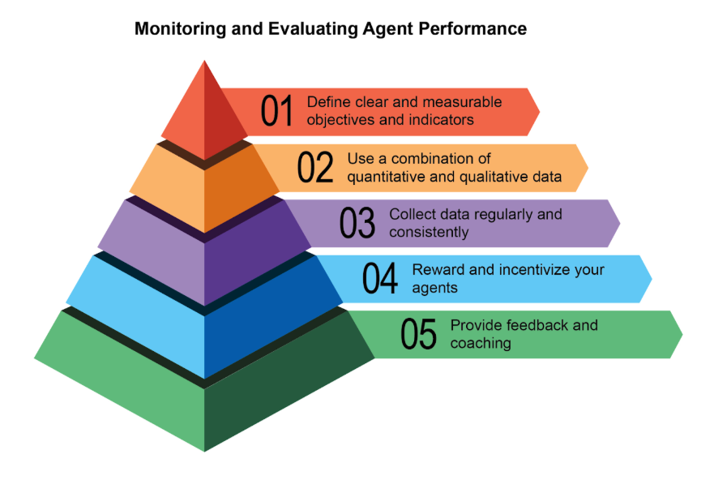
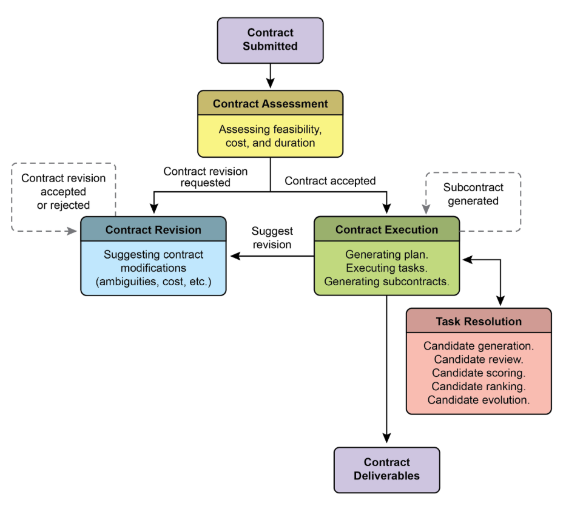
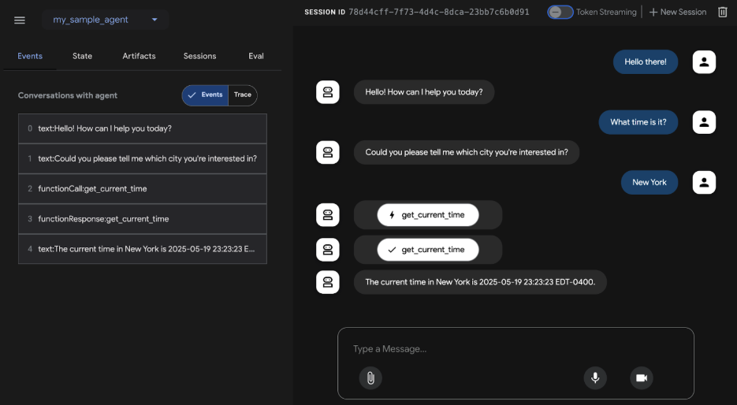
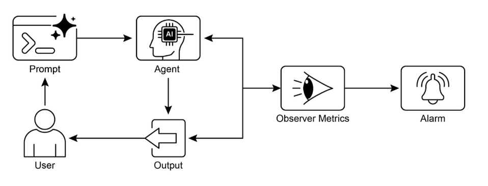

# 第 19 章：評估與監測

本章研究了允許智慧代理系統地評估其性能、監控目標進展並檢測操作異常的方法。雖然第 11 章概述了目標設定和監控，第 17 章討論了推理機制，但本章重點關注對代理的有效性、效率和對要求的遵守情況的連續（通常是外部的）測量。這包括定義指標、建立回饋循環和實施報告系統，以確保代理績效符合營運環境中的預期（見圖 1）



圖：1.評估與監控的最佳實踐

## 實際應用程式和用例

最常見的應用程式和用例：

* **即時系統中的效能追蹤：** 持續監控生產環境中部署的代理的準確性、延遲和資源消耗（例如，客戶服務聊天機器人的解決率、回應時間）。

* **針對代理改進的 A/B 測試：** 系統地並行比較不同代理版本或策略的性能，以確定最佳方法（例如，為物流代理嘗試兩種不同的規劃演算法）。

* **合規性和安全審計：** 產生自動審計報告，追蹤代理隨時間推移遵守道德準則、監管要求和安全協議的情況。這些報告可以由人類在回圈中或其他代理進行驗證，並且可以在識別問題時產生 KPI 或觸發警報。

* **企業系統：** 為了管理企業系統中的代理工智慧，需要一種新的控制工具，即人工智慧「合約」。這種動態協定將人工智慧委託任務的目標、規則和控制編入法典。

* **漂移偵測：** 隨著時間的推移監控代理輸出的相關性或準確性，偵測其效能何時會因輸入資料分佈的變化（概念漂移）或環境變化而下降。

* **代理行為中的異常偵測：** 識別代理採取的異常或意外操作，這些操作可能表示錯誤、惡意攻擊或緊急的不良行為。

* **學習進度評估：** 對於旨在學習的代理，追蹤其學習曲線、特定技能的改進或對不同任務或資料集的泛化能力。

## 實踐程式碼範例

為人工智慧代理開發一個全面的評估框架是一項具有挑戰性的工作，其複雜性堪比一門學科或一本實質出版物。這一困難源於需要考慮的多種因素，例如模型效能、使用者互動、道德影響和更廣泛的社會影響。然而，在實際實施中，重點可以縮小到對於人工智慧代理的高效和有效運作至關重要的關鍵用例。

**代理響應評估：** 此核心流程對於評估代理輸出的品質和準確性至關重要。它涉及確定代理是否響應給定的輸入提供相關、正確、合乎邏輯、公正且準確的資訊。評估指標可能包括事實正確性、流暢性、語法準確性以及對使用者預期目的的遵守。

```python
def evaluate_response_accuracy(agent_output: str, expected_output: str) -> float:
    """Calculates a simple accuracy score for agent responses."""
    # This is a very basic exact match; real-world would use more sophisticated metrics
    return 1.0 if agent_output.strip().lower() == expected_output.strip().lower() else 0.0


# Example usage
agent_response = "The capital of France is Paris."
ground_truth = "Paris is the capital of France."
score = evaluate_response_accuracy(agent_response, ground_truth)
print(f"Response accuracy: {score}")
```

Python 函數 `evaluate_response_accuracy` 在刪除前導或尾隨空格後，透過在代理的輸出和預期輸出之間執行精確的、不區分大小寫的比較，計算 人工智慧 代理響應的基本準確性分數。對於完全匹配，它會傳回 1.0 的分數，否則傳回 0.0，表示二進位正確或不正確的評估。這種方法雖然對於簡單檢查來說很簡單，但沒有考慮釋義或語意等價等變化。

問題在於它的比較方法。此函數對兩個字串執行嚴格的逐字比較。在提供的範例中：

* `agent_response`：“法國的首都是巴黎。”

* `ground_truth`：“巴黎是法國的首都。”

即使刪除空格並轉換為小寫後，這兩個字串也不相同。因此，函數將錯誤地傳回 `0.0` 的準確度分數，即使這兩個句子傳達相同的含義。

直接比較無法評估語意相似性，只有當代理的反應與預期輸出完全匹配時才能成功。更有效的評估需要先進的自然語言處理（NLP）技術來辨別句子之間的含義。為了在現實場景中進行全面的人工智慧代理評估，更複雜的指標通常是必不可少的。這些指標可以包括字串相似性測量（例如 Levenshtein 距離和 Jaccard 相似性）、針對特定關鍵字是否存在的關鍵字分析、使用嵌入模型的餘弦相似性的語義相似性、大型語言模型 作為法官評估（稍後討論以評估細微的正確性和有用性）以及 RAG 特定的指標（例如忠實性和相關性）。

**延遲監控：** 在 人工智慧 代理的回應或操作速度是關鍵因素的應用程式中，代理操作的延遲監控至關重要。此過程測量代理處理請求和產生輸出所需的持續時間。延遲增加可能會對使用者體驗和代理的整體效率產生不利影響，特別是在即時或互動式環境中。在實際應用中，僅僅將延遲資料列印到控制台是不夠的。建議將此資訊記錄到持久性儲存系統。選項包括結構化日誌檔案（例如 JSON）、時間序列資料庫（例如 InfluxDB、Prometheus）、資料倉儲（例如 Snowflake、BigQuery、PostgreSQL）或可觀測平台（例如 Datadog、Splunk、Grafana Cloud）。

**追蹤 大型語言模型 互動的令牌使用：** 對於 大型語言模型 支援的代理來說，追蹤令牌使用情況對於管理成本和最佳化資源分配至關重要。 大型語言模型 互動的計費通常取決於處理的令牌數量（輸入和輸出）。因此，有效的代幣使用直接降低了營運費用。此外，監控令牌計數有助於識別提示工程或回應產生過程中需要改進的潛在領域。

```python
# This is conceptual as actual token counting depends on the LLM API
class LLMInteractionMonitor:
    def __init__(self):
        self.total_input_tokens = 0
        self.total_output_tokens = 0

    def record_interaction(self, prompt: str, response: str):
        # In a real scenario, use LLM API's token counter or a tokenizer
        input_tokens = len(prompt.split())  # Placeholder
        output_tokens = len(response.split())  # Placeholder
        self.total_input_tokens += input_tokens
        self.total_output_tokens += output_tokens
        print(f"Recorded interaction: Input tokens={input_tokens}, Output tokens={output_tokens}")

    def get_total_tokens(self):
        return self.total_input_tokens, self.total_output_tokens


# Example usage
monitor = LLMInteractionMonitor()
monitor.record_interaction("What is the capital of France?", "The capital of France is Paris.")
monitor.record_interaction("Tell me a joke.", "Why don't scientists trust atoms? Because they make up everything!")
input_t, output_t = monitor.get_total_tokens()
print(f"Total input tokens: {input_t}, Total output tokens: {output_t}")
```

本節介紹一個概念性 Python 類別 `LLMInteractionMonitor`，它是為追蹤大型語言模型互動中的標記使用情況而開發的。此類別包含輸入和輸出標記的計數器。它的 `record_interaction` 方法透過分割提示和回應字串來模擬令牌計數。在實際實作中，將採用特定的 大型語言模型 API 標記器來進行精確的標記計數。當互動發生時，監視器會累積總輸入和輸出令牌計數。 `get_total_tokens` 方法提供對這些累積總數的訪問，這對於成本管理和 大型語言模型 使用最佳化至關重要。

**使用大型語言模型作為法官的「樂於助人」的自訂指標：** 評估人工智慧代理的「樂於助人」等主觀品質提出了超出標準客觀指標的挑戰。一個潛在的框架涉及使用大型語言模型作為評估者。這種大型語言模型作為法官的方法根據預先定義的「有用性」標準評估另一個人工智慧代理的輸出。此方法利用大型語言模型的先進語言能力，提供細緻入微的、類似人類的主觀品質評估，超越簡單的關鍵字匹配或基於規則的評估。儘管處於開發階段，但該技術顯示出自動化和擴展定性評估的前景。

```python
import os
import json
import logging
from typing import Optional

import google.generativeai as genai

# --- Configuration ---
logging.basicConfig(level=logging.INFO, format='%(asctime)s - %(levelname)s - %(message)s')

# Set your API key as an environment variable to run this script
# For example, in your terminal: export GOOGLE_API_KEY='your_key_here'
try:
    genai.configure(api_key=os.environ["GOOGLE_API_KEY"])
except KeyError:
    logging.error("Error: GOOGLE_API_KEY environment variable not set.")
    exit(1)

# --- LLM-as-a-Judge Rubric for Legal Survey Quality ---
LEGAL_SURVEY_RUBRIC = """
 You are an expert legal survey methodologist and a critical legal reviewer. Your task is to evaluate the quality of a given legal survey question. Provide a score from 1 to 5 for overall quality, along with a detailed rationale and specific feedback.

 Focus on the following criteria:

 1.  **Clarity & Precision (Score 1-5):**
    * 1: Extremely vague, highly ambiguous, or confusing.
    * 3: Moderately clear, but could be more precise.
    * 5: Perfectly clear, unambiguous, and precise in its legal terminology (if applicable) and intent.

 2.  **Neutrality & Bias (Score 1-5):**
    * 1: Highly leading or biased, clearly influencing the respondent towards a specific answer.
    * 3: Slightly suggestive or could be interpreted as leading.
    * 5: Completely neutral, objective, and free from any leading language or loaded terms.

 3.  **Relevance & Focus (Score 1-5):**
    * 1: Irrelevant to the stated survey topic or out of scope.
    * 3: Loosely related but could be more focused.
    * 5: Directly relevant to the survey's objectives and well-focused on a single concept.

 4.  **Completeness (Score 1-5):**
    * 1: Omits critical information needed to answer accurately or provides insufficient context.
    * 3: Mostly complete, but minor details are missing.
    * 5: Provides all necessary context and information for the respondent to answer thoroughly.

 5.  **Appropriateness for Audience (Score 1-5):**
    * 1: Uses jargon inaccessible to the target audience or is overly simplistic for experts.
    * 3: Generally appropriate, but some terms might be challenging or oversimplified.
    * 5: Perfectly tailored to the assumed legal knowledge and background of the target survey audience.

 **Output Format:**
 Your response MUST be a JSON object with the following keys:
 * `overall_score`: An integer from 1 to 5 (average of criterion scores, or your holistic judgment).
 * `rationale`: A concise summary of why this score was given, highlighting major strengths and weaknesses.
 * `detailed_feedback`: A bullet-point list detailing feedback for each criterion (Clarity, Neutrality, Relevance, Completeness, Audience Appropriateness). Suggest specific improvements.
 * `concerns`: A list of any specific legal, ethical, or methodological concerns.
 * `recommended_action`: A brief recommendation (e.g., "Revise for neutrality", "Approve as is", "Clarify scope").
"""

class LLMJudgeForLegalSurvey:
    """A class to evaluate legal survey questions using a generative AI model."""

    def __init__(self, model_name: str = 'gemini-1.5-flash-latest', temperature: float = 0.2):
        """
        Initializes the LLM Judge.

        Args:
            model_name (str): The name of the Gemini model to use.
                              'gemini-1.5-flash-latest' is recommended for speed and cost.
                              'gemini-1.5-pro-latest' offers the highest quality.
            temperature (float): The generation temperature. Lower is better for deterministic evaluation.
        """
        self.model = genai.GenerativeModel(model_name)
        self.temperature = temperature

    def _generate_prompt(self, survey_question: str) -> str:
        """Constructs the full prompt for the LLM judge."""
        return f"{LEGAL_SURVEY_RUBRIC}\n\n---\n**LEGAL SURVEY QUESTION TO EVALUATE:**\n{survey_question}\n---"

    def judge_survey_question(self, survey_question: str) -> Optional[dict]:
        """
        Judges the quality of a single legal survey question using the LLM.

        Args:
            survey_question (str): The legal survey question to be evaluated.

        Returns:
            Optional[dict]: A dictionary containing the LLM's judgment, or None if an error occurs.
        """
        full_prompt = self._generate_prompt(survey_question)

        try:
            logging.info(f"Sending request to '{self.model.model_name}' for judgment...")
            response = self.model.generate_content(
                full_prompt,
                generation_config=genai.types.GenerationConfig(
                    temperature=self.temperature,
                    response_mime_type="application/json"
                )
            )

            # Check for content moderation or other reasons for an empty response.
            if not response.parts:
                safety_ratings = response.prompt_feedback.safety_ratings
                logging.error(f"LLM response was empty or blocked. Safety Ratings: {safety_ratings}")
                return None

            return json.loads(response.text)
        except json.JSONDecodeError:
            logging.error(f"Failed to decode LLM response as JSON. Raw response: {response.text}")
            return None
        except Exception as e:
            logging.error(f"An unexpected error occurred during LLM judgment: {e}")
            return None


# --- Example Usage ---
if __name__ == "__main__":
    judge = LLMJudgeForLegalSurvey()

    # --- Good Example ---
    good_legal_survey_question = """
    To what extent do you agree or disagree that current intellectual property laws in Switzerland adequately protect emerging AI-generated content, assuming the content meets the originality criteria established by the Federal Supreme Court?
    (Select one: Strongly Disagree, Disagree, Neutral, Agree, Strongly Agree)
    """
    print("\n--- Evaluating Good Legal Survey Question ---")
    judgment_good = judge.judge_survey_question(good_legal_survey_question)
    if judgment_good:
        print(json.dumps(judgment_good, indent=2))

    # --- Biased/Poor Example ---
    biased_legal_survey_question = """
    Don't you agree that overly restrictive data privacy laws like the FADP are hindering essential technological innovation and economic growth in Switzerland?
    (Select one: Yes, No)
    """
    print("\n--- Evaluating Biased Legal Survey Question ---")
    judgment_biased = judge.judge_survey_question(biased_legal_survey_question)
    if judgment_biased:
        print(json.dumps(judgment_biased, indent=2))

    # --- Ambiguous/Vague Example ---
    vague_legal_survey_question = """
    What are your thoughts on legal tech?
    """
    print("\n--- Evaluating Vague Legal Survey Question ---")
    judgment_vague = judge.judge_survey_question(vague_legal_survey_question)
    if judgment_vague:
        print(json.dumps(judgment_vague, indent=2))
```

Python 程式碼定義了一個 LLMJudgeForLegalSurvey 類，旨在使用生成式 人工智慧 模型評估法律調查問題的品質。它利用 google.`generativeai` 函式庫與 Gemini 模型進行互動。

核心功能包括向模型發送調查問題以及詳細的評估標準。標題規定了判斷調查問題的五個標準：清晰度和精確性、中立性和偏見、相關性和焦點、完整性和受眾適當性。對於每個標準，都會分配 1 到 5 的分數，並且輸出中需要詳細的理由和回饋。該程式碼建立一個提示，其中包括要評估的標題和調查問題。

`judge_survey_question` 方法將此提示傳送至配置的 Gemini 模型，請求根據定義的結構格式化的 JSON 回應。預期輸出 JSON 包括總體分數、摘要理由、每個標準的詳細回饋、問題清單和建議的操作。該類別處理 人工智慧 模型互動期間的潛在錯誤，例如 JSON 解碼問題或空響應。該腳本透過評估法律調查問題的範例來演示其操作，說明人工智慧如何根據預先定義的標準評估品質。

在結束之前，讓我們檢查一下各種評估方法，並考慮它們的優點和缺點。

|評價方法|優點 |弱點|
| :---- | :---- | :---- |
|人類評估|捕捉微妙的行為 |由於考慮了主觀人為因素，難以擴展、昂貴且耗時。 |
|法官大型語言模型|一致、高效且可擴展。  |中間步驟可能會被忽略。受 大型語言模型 能力限制。 |
|自動化指標 |可擴展、有效率、客觀 |捕捉完整功能的潛在限制。 |

## 代理軌跡

評估代理的軌跡至關重要，因為傳統的軟體測試是不夠的。標準代碼產生可預測的通過/失敗結果，而代理以機率方式操作，需要對最終輸出和代理的軌跡（達成解決方案所採取的步驟序列）進行定性評估。評估多代理系統具有挑戰性，因為它們不斷變化。這需要發展超越個人績效的複雜指標來衡量溝通和團隊合作的有效性。此外，環境本身不是靜態的，要求評估方法（包括測試案例）隨著時間的推移而適應。

這涉及檢查決策的品質、推理過程和整體結果。實施自動化評估很有價值，特別是對於原型階段之後的開發。分析軌跡和工具使用包括評估代理實現目標所採用的步驟，例如工具選擇、策略和任務效率。例如，處理客戶產品查詢的代理在理想情況下可能會遵循涉及意圖確定、資料庫搜尋工具使用、結果審查和報告產生的軌跡。將代理的實際行動與預期的或真實的軌跡進行比較，以識別錯誤和低效率。比較方法包括精確匹配（要求與理想序列完美匹配）、有序匹配（按順序正確操作，允許額外步驟）、任意順序匹配（按任意順序正確操作，允許額外步驟）、精度（測量預測操作的相關性）、召回率（測量捕獲了多少基本操作）和單一工具使用（檢查特定操作）。指標選擇取決於特定的代理要求，高風險場景可能需要精確匹配，而更靈活的情況可能會使用按順序或任意順序匹配。

人工智慧 代理的評估涉及兩種主要方法：使用測試文件和使用評估集文件。 JSON 格式的測試檔案表示單一、簡單的代理模型互動或會話，非常適合主動開發期間的單元測試，重點在於快速執行和簡單的會話複雜性。每個測試文件包含具有多個回合的單一會話，其中回合是使用者與代理交互，包括使用者的查詢、預期工具使用軌跡、中間代理回應和最終回應。例如，測試檔案可能會詳細說明使用者要求“關閉臥室中的 `device_2`”，指定代理使用 `set_device_info` 工具，並帶有位置：臥室、`device_id: device_2` 和狀態：OFF 等參數，以及預期的最終回應「我已將 `device_2` 狀態關閉。測試檔案可以組織到資料夾中，並且可能包含 `test_config`.json 檔案來定義評估標準。評估集文件利用稱為「評估集」的資料集來評估交互，其中包含多個可能很長的會話，適合模擬複雜的多輪對話和整合測試。評估集檔案包含多個“評估”，每個“評估”代表一個具有一個或多個“回合”的不同會話，其中包括使用者查詢、預期工具使用、中間回應和參考最終回應。範例評估集可能包括使用者首先詢問「你能做什麼？」的會話。然後說“擲兩次 10 面骰子，然後檢查 9 是否是質數”，定義預期的 `roll_die` 工具調用和 `check_prime` 工具調用，以及總結骰子擲出和質數檢查的最終響應。

**多代理**：評估具有多個代理的複雜人工智慧系統非常類似於評估團隊專案。因為有很多步驟和交接，所以它的複雜性是一個優勢，可以讓你檢查每個階段的工作品質。您可以檢查每個單獨的「代理」執行其特定工作的情況，但您還必須評估整個系統的整體執行情況。

為此，您需要詢問有關團隊動態的關鍵問題，並輔以具體範例：

* 代理是否有效合作？例如，在「航班預訂代理」預訂航班後，是否成功將正確的日期和目的地傳遞給「飯店預訂代理」？合作失敗可能會導致飯店預訂錯誤的一周。

* 他們是否制定了良好的計劃並堅持執行？想像一下，計劃是先預訂航班，然後預訂酒店。如果「飯店代理」試圖在航班確認之前預訂房間，則偏離了計劃。您還可以檢查代理是否陷入困境，例如，無休止地尋找「完美」的租賃汽車並且永遠不會繼續下一步。

* 是否為正確的任務選擇了正確的代理？如果用戶詢問其旅行的天氣，系統應使用專門的「天氣代理」來提供即時數據。如果它使用「常識代理」來給出諸如「夏天通常很溫暖」之類的通用答案，那麼它就選擇了錯誤的工具來完成這項工作。

* 最後，增加更多代理是否會提高效能？如果您在團隊中新增一個新的“餐廳預訂代理”，是否會使整體旅行計劃變得更好、更有效率？或者它會產生衝突並減慢系統速度，表明可擴展性存在問題？

## 從代理到高級承包商

最近，有人提出（代理 Companion、gulli 等人）從簡單的人工智慧代理到高級「承包商」的演變，從機率性、通常不可靠的系統轉向為複雜、高風險環境設計的更具確定性和負責任的系統（見圖 2）

當今常見的人工智慧代理根據簡短的、未指定的指令進行操作，這使得它們適合簡單的演示，但在生產中卻很脆弱，模糊性會導致失敗。 「承包商」模型透過在使用者和人工智慧之間建立嚴格的、正式的關係來解決這個問題，這種關係建立在明確定義和共同商定的條款的基礎上，就像人類世界中的法律服務協議一樣。這一轉變得到了四個關鍵支柱的支持，這些支柱共同確保了以前超出自主系統範圍的任務的清晰度、可靠性和穩健執行

首先是形式化合約的支柱，這是一個詳細的規範，作為任務的唯一事實來源。它遠遠超出了簡單的提示。例如，財務分析任務的合約不會只寫「分析上一季的銷售額」；還會寫「分析上一季的銷售額」。它將要求「一份 20 頁的 PDF 報告，分析 2025 年第一季的歐洲市場銷售情況，包括五個具體的數據可視化、與 2024 年第一季度的比較分析，以及基於所包含的供應鏈中斷數據集的風險評估。」該合約明確定義了所需的可交付成果、其精確的規格、可接受的數據源、工作範圍，甚至可完成預期的計算結果，使預期的計算結果，客觀的時間來源、可確定的時間來源，甚至可完成預期的計算結果，客觀的時間來源、可接受的數據源、可完成時間，甚至可實現預期的計算結果，客觀的時間來源、可接受的數據源、可完成時間，甚至可實現預期的計算結果，客觀的時間來源、可接受的數據源、可完成時間，甚至可完成計算結果，使預期的計算結果，客觀可完成的時間來源、確定時間，甚至可完成預期的計算結果，客觀的時間來源、可接受的數據源、可完成時間，甚至可實現預期的計算結果，客觀的時間來源、可接受的數據源、可完成時間，甚至可預期計算。

其次是談判和回饋動態生命週期的支柱。契約不是靜態的命令，而是對話的開始。承包商代理可以分析初始條款並進行談判。例如，如果合約要求使用代理無法存取的特定專有資料來源，它可以回傳



圖2：代理之間的合約執行範例

第三個支柱是以品質為中心的迭代執行。與專為低延遲響應而設計的代理不同，承包商優先考慮正確性和品質。它的運作遵循自我驗證和糾正的原則。例如，對於程式碼產生合約，代理不僅要編寫程式碼，還要編寫程式碼。它將產生多種演算法方法，根據合約中定義的一套單元測試來編譯和運行它們，根據效能、安全性和可讀性等指標對每個解決方案進行評分，並且僅提交通過所有驗證標準的版本。這種生成、審查和改進自己的工作直到滿足合約規範的內部循環對於建立對其輸出的信任至關重要。

最後，第四個支柱是透過分包進行分層分解。對於非常複雜的任務，主承包商代理可以充當專案經理，將主要目標分解為更小、更易於管理的子任務。它透過產生新的、正式的「分包合約」來實現這一目標。例如，「建立電子商務行動應用程式」的主合約可以由主代理分解為「設計 UI/UX」、「開發用戶身份驗證模組」、「建立產品資料庫模式」和「整合支付網關」的子合約。每個分包合約都是完整、獨立的合同，具有自己的可交付成果和規格，可以分配給其他專業代理。這種結構化分解使系統能夠以高度組織和可擴展的方式處理巨大的、多方面的項目，標誌著人工智慧從簡單的工具轉變為真正自主且可靠的問題解決引擎。

最終，這個承包商框架透過將正式規範、協商和可驗證執行的原則直接嵌入到代理的核心邏輯中，重新構想了人工智慧互動。這種有條不紊的方法將人工智慧從一個有前途但往往不可預測的助手提升為一個可靠的系統，能夠以可審計的精度自主管理複雜的專案。透過解決模糊性和可靠性方面的關鍵挑戰，該模型為在信任和問責制至關重要的關鍵任務領域部署人工智慧鋪平了道路。

## 谷歌的 ADK

在結束之前，讓我們先來看一個支持評估的框架的具體範例。使用 Google ADK 進行代理評估（見圖 3）可以透過三種方法進行：用於互動式評估和資料集產生的基於 Web 的 UI (adk web)、使用 pytest 進行程式設計整合以納入測試管道，以及用於適合常規建置產生和驗證流程的自動評估的直接命令列介面 (adk eval)。



圖3：Google ADK的評估支持

基於 Web 的 UI 可以建立互動式會話並將其儲存到現有或新的評估集中，並顯示評估狀態。 Pytest 整合允許透過呼叫 AgentEvaluator.evaluate、指定代理模組和測試檔案路徑來執行測試檔案作為整合測試的一部分。

命令列介面透過提供代理模組路徑和評估集檔案以及指定設定檔或列印詳細結果的選項來促進自動評估。可以透過在評估集檔案名稱後面列出並以逗號分隔來選擇較大評估集中的特定評估來執行。

## 概覽

**內容：** 代理系統和大型語言模型在複雜、動態的環境中運行，其性能可能會隨著時間的推移而下降。它們的機率性和非確定性本質意味著傳統的軟體測試不足以確保可靠性。評估動態多代理系統是一項重大挑戰，因為它們不斷變化的性質及其環境需要開發自適應測試方法和複雜的指標，以衡量超越個人績效的協作成功。部署後可能會出現資料漂移、意外互動、工具呼叫以及偏離預期目標等問題。因此，有必要進行持續評估，以衡量代理的有效性、效率以及對操作和安全要求的遵守情況。

**原因：** 標準化的評估和監控框架提供了一種系統化的方法來評估和確保智慧代理的持續性能。這涉及定義準確度、延遲和資源消耗的明確指標，例如大型語言模型的令牌使用情況。它還包括先進的技術，例如分析代理軌跡以了解推理過程，以及聘請大型語言模型作為法官進行細緻入微的定性評估。透過建立回饋循環和報告系統，該框架允許持續改進、A/B 測試以及異常或效能漂移的檢測，確保代理與其目標保持一致。

**經驗法則：** 在即時效能和可靠性至關重要的即時生產環境中部署代理時，請使用此模式。此外，當需要係統地比較代理的不同版本或其底層模型以推動改進時，以及在需要合規性、安全性和道德審計的受監管或高風險領域運作時，可以使用它。當代理的效能可能因資料或環境的變化（漂移）而隨著時間的推移而下降時，或在評估複雜的代理行為時，包括動作序列（軌跡）和主觀輸出的品質（如幫助性）時，此模式也適用。

**視覺摘要：**



圖4：評估與監控設計模式

## 要點

* 評估智能代理超越傳統測試，持續衡量其有效性、效率以及對現實環境中要求的遵守情況。

* 代理評估的實際應用包括即時系統中的效能追蹤、改進的 A/B 測試、合規性審計以及檢測行為中的偏差或異常​​。

* 基本代理評估涉及評估回應準確性，而現實場景需要更複雜的指標，例如 大型語言模型 支援的代理的延遲監控和令牌使用情況追蹤。

* 代理軌跡（代理採取的步驟順序）對於評估、將實際行動與理想的、真實的路徑進行比較以識別錯誤和低效率至關重要。

* ADK 透過用於單元測試的單獨測試文件和用於整合測試的綜合評估集文件提供結構化評估方法，兩者都定義了預期的代理行為。

* 代理評估可以透過基於 Web 的 UI 執行互動式測試，使用 pytest 以程式設計方式執行 CI/CD 集成，或透過命令列介面執行自動化工作流程。

* 為了使人工智慧可靠地執行複雜、高風險的任務，我們必須從簡單的提示轉向精確定義可驗證的可交付成果和範圍的正式「合約」。這種結構化協議允許代理進行談判、澄清歧義並迭代驗證自己的工作，將其從不可預測的工具轉變為負責任且值得信賴的系統。

## 結論

總之，有效評估人工智慧代理需要超越簡單的準確性檢查，而是對其在動態環境中的表現進行連續、多方面的評估。這涉及對延遲和資源消耗等指標的實際監控，以及透過代理的軌跡對其決策過程進行複雜的分析。對於諸如樂於助人之類的細緻入微的品質，像 大型語言模型-as-a-Judge 這樣的創新方法正變得至關重要，而像 Google 的 ADK 這樣的框架則為單元測試和集成測試提供了結構化工具。隨著多代理系統的發展，這項挑戰變得更加嚴峻，重點轉向評估協作成功和有效合作。

為了確保關鍵應用的可靠性，範式正在從簡單的、即時驅動的代理轉變為受正式協議約束的高級「承包商」。這些承包商代理按照明確、可驗證的條款運作，使他們能夠談判、分解任務並自我驗證其工作，以滿足嚴格的品質標準。這種結構化方法將代理從不可預測的工具轉變為能夠處理複雜、高風險任務的負責任的系統。最終，這種演進對於建立在關鍵任務領域部署複雜的代理工智慧所需的信任至關重要。

## 參考

相關研究包括：

1. ADK 網站：[https://github.com/google/adk-web](https://github.com/google/adk-web)

2. ADK 評估：[https://google.github.io/adk-docs/evaluate/](https://google.github.io/adk-docs/evaluate/)

3. 大型語言模型 代理評估調查，[https://arxiv.org/abs/2503.16416](https://arxiv.org/abs/2503.16416)

4. 代理為法官：與代理一起評估代理，[https://arxiv.org/abs/2410.10934](https://arxiv.org/abs/2410.10934)

5. 代理 Companion，gulli 等人：[https://www.kaggle.com/whitepaper-代理-companion](https://www.kaggle.com/whitepaper-agent-companion)