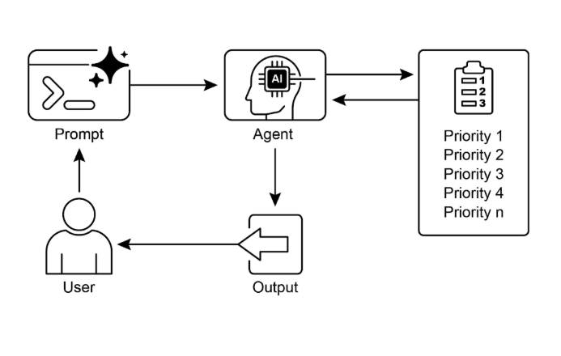

# 第 20 章：優先順序

在複雜、動態的環境中，代理經常遇到大量潛在的行動、相互衝突的目標和有限的資源。如果沒有確定後續行動的明確流程，代理可能會遇到效率降低、操作延遲或無法實現關鍵目標的情況。優先模式透過使代理能夠根據任務、目標或行動的重要性、緊迫性、依賴性和既定標準對任務、目標或行動進行評估和排序來解決此問題。這可以確保代理將精力集中在最關鍵的任務上，從而提高效率和目標一致性。

## 優先權模式概述

代理利用優先順序來有效管理任務、目標和子目標，指導後續行動。此流程有助於在解決多種需求時做出明智的決策，將重要或緊急的活動優先於較不重要的活動。它在資源有限、時間有限且目標可能衝突的現實場景中尤其重要。

代理優先順序的基本面向通常涉及幾個要素。首先，標準定義建立任務評估的規則或指標。這些可能包括緊迫性（任務的時間敏感性）、重要性（對主要目標的影響）、依賴性（該任務是否是其他任務的先決條件）、資源可用性（必要工具或資訊的準備情況）、成本/效益分析（努力與預期結果）以及個人化代理的使用者偏好。其次，任務評估涉及根據這些定義的標準評估每項潛在任務，使用從簡單規則到複雜評分或大型語言模型推理的方法。第三，調度或選擇邏輯是指基於評估來選擇最佳的下一個動作或任務序列的演算法，可能利用佇列或高階規劃元件。最後，動態重新確定優先順序允許代理根據情況變化（例如出現新的關鍵事件或臨近截止日期）修改優先級，從而確保代理的適應性和回應能力。

優先順序劃分可以發生在各個層級：選擇總體目標（進階目標優先順序劃分）、計畫內的步驟排序（子任務優先順序劃分）或從可用選項中選擇下一個立即行動（行動選擇）。有效的優先順序劃分使代理能夠表現出更聰明、更有效率、更穩健的行為，尤其是在複雜的多目標環境中。這反映了人類團隊組織，管理者透過考慮所有成員的意見來確定任務的優先順序。

## 實際應用程式和用例

在各種現實應用中，人工智慧代理展示瞭如何複雜地使用優先順序來做出及時有效的決策。

* **自動化客戶支援**：代理優先處理緊急請求（例如係統中斷報告），而不是常規事務（例如密碼重設）。他們也可能為高價值客戶提供優惠待遇。

* **雲端運算**：人工智慧透過在高峰需求期間優先分配給關鍵應用程式來管理和調度資源，同時將不太緊急的批次作業轉移到非高峰時段以優化成本。

* **自動駕駛系統**：不斷確定行動的優先順序，以確保安全和效率。例如，煞車以避免碰撞優先於維持車道紀律或優化燃油效率。

* **金融交易**：機器人透過分析市場狀況、風險承受能力、利潤率和即時新聞等因素來確定交易的優先級，從而能夠迅速執行高優先級的交易。

* **專案管理**：人工智慧代理根據截止日期、依賴性、團隊可用性和策略重要性對專案板上的任務進行優先排序。

* **網路安全**：監控網路流量的代理透過評估威脅嚴重性、潛在影響和資產關鍵性來確定警報的優先級，確保立即回應最危險的威脅。

* **個人助理人工智慧**：利用優先順序來管理日常生活，根據使用者定義的重要性、即將到來的截止日期和當前上下文組織日曆事件、提醒和通知。

這些例子共同說明了確定優先順序的能力對於在各種情況下增強人工智慧代理的效能和決策能力至關重要。

## 實踐程式碼範例

以下示範使用LangChain開發一個Project Manager AI代理。該代理有助於創建任務、確定優先順序以及將任務分配給團隊成員，展示大型語言模型與自動化專案管理客製化工具的應用。

```python
import os
import asyncio
from typing import List, Optional, Dict, Type

from dotenv import load_dotenv
from pydantic import BaseModel, Field
from langchain_core.prompts import ChatPromptTemplate
from langchain_core.tools import Tool
from langchain_openai import ChatOpenAI
from langchain.agents import AgentExecutor, create_react_agent
from langchain.memory import ConversationBufferMemory


# --- 0. Configuration and Setup ---
# Loads the OPENAI_API_KEY from the .env file.
load_dotenv()

# The ChatOpenAI client automatically picks up the API key from the environment.
llm = ChatOpenAI(temperature=0.5, model="gpt-4o-mini")


# --- 1. Task Management System ---
class Task(BaseModel):
    """Represents a single task in the system."""
    id: str
    description: str
    priority: Optional[str] = None  # P0, P1, P2
    assigned_to: Optional[str] = None  # Name of the worker


class SuperSimpleTaskManager:
    """An efficient and robust in-memory task manager."""

    def __init__(self):
        # Use a dictionary for O(1) lookups, updates, and deletions.
        self.tasks: Dict[str, Task] = {}
        self.next_task_id = 1

    def create_task(self, description: str) -> Task:
        """Creates and stores a new task."""
        task_id = f"TASK-{self.next_task_id:03d}"
        new_task = Task(id=task_id, description=description)
        self.tasks[task_id] = new_task
        self.next_task_id += 1
        print(f"DEBUG: Task created - {task_id}: {description}")
        return new_task

    def update_task(self, task_id: str, **kwargs) -> Optional[Task]:
        """Safely updates a task using Pydantic's model_copy."""
        task = self.tasks.get(task_id)
        if task:
            # Use model_copy for type-safe updates.
            update_data = {k: v for k, v in kwargs.items() if v is not None}
            updated_task = task.model_copy(update=update_data)
            self.tasks[task_id] = updated_task
            print(f"DEBUG: Task {task_id} updated with {update_data}")
            return updated_task

        print(f"DEBUG: Task {task_id} not found for update.")
        return None

    def list_all_tasks(self) -> str:
        """Lists all tasks currently in the system."""
        if not self.tasks:
            return "No tasks in the system."

        task_strings = []
        for task in self.tasks.values():
            task_strings.append(
                f"ID: {task.id}, Desc: '{task.description}', "
                f"Priority: {task.priority or 'N/A'}, "
                f"Assigned To: {task.assigned_to or 'N/A'}"
            )
        return "Current Tasks:\n" + "\n".join(task_strings)


task_manager = SuperSimpleTaskManager()


# --- 2. Tools for the Project Manager Agent ---
# Use Pydantic models for tool arguments for better validation and clarity.
class CreateTaskArgs(BaseModel):
    description: str = Field(description="A detailed description of the task.")


class PriorityArgs(BaseModel):
    task_id: str = Field(description="The ID of the task to update, e.g., 'TASK-001'.")
    priority: str = Field(description="The priority to set. Must be one of: 'P0', 'P1', 'P2'.")


class AssignWorkerArgs(BaseModel):
    task_id: str = Field(description="The ID of the task to update, e.g., 'TASK-001'.")
    worker_name: str = Field(description="The name of the worker to assign the task to.")


def create_new_task_tool(description: str) -> str:
    """Creates a new project task with the given description."""
    task = task_manager.create_task(description)
    return f"Created task {task.id}: '{task.description}'."


def assign_priority_to_task_tool(task_id: str, priority: str) -> str:
    """Assigns a priority (P0, P1, P2) to a given task ID."""
    if priority not in ["P0", "P1", "P2"]:
        return "Invalid priority. Must be P0, P1, or P2."
    task = task_manager.update_task(task_id, priority=priority)
    return f"Assigned priority {priority} to task {task.id}." if task else f"Task {task_id} not found."


def assign_task_to_worker_tool(task_id: str, worker_name: str) -> str:
    """Assigns a task to a specific worker."""
    task = task_manager.update_task(task_id, assigned_to=worker_name)
    return f"Assigned task {task.id} to {worker_name}." if task else f"Task {task_id} not found."


# All tools the PM agent can use
pm_tools = [
    Tool(
        name="create_new_task",
        func=create_new_task_tool,
        description="Use this first to create a new task and get its ID.",
        args_schema=CreateTaskArgs
    ),
    Tool(
        name="assign_priority_to_task",
        func=assign_priority_to_task_tool,
        description="Use this to assign a priority to a task after it has been created.",
        args_schema=PriorityArgs
    ),
    Tool(
        name="assign_task_to_worker",
        func=assign_task_to_worker_tool,
        description="Use this to assign a task to a specific worker after it has been created.",
        args_schema=AssignWorkerArgs
    ),
    Tool(
        name="list_all_tasks",
        func=task_manager.list_all_tasks,
        description="Use this to list all current tasks and their status."
    ),
]


# --- 3. Project Manager Agent Definition ---
pm_prompt_template = ChatPromptTemplate.from_messages([
    ("system", """You are a focused Project Manager LLM agent. Your goal is to manage project tasks efficiently.
      When you receive a new task request, follow these steps:
    1.  First, create the task with the given description using the `create_new_task` tool. You must do this first to get a `task_id`.
    2.  Next, analyze the user's request to see if a priority or an assignee is mentioned.
        - If a priority is mentioned (e.g., "urgent", "ASAP", "critical"), map it to P0. Use `assign_priority_to_task`.
        - If a worker is mentioned, use `assign_task_to_worker`.
    3.  If any information (priority, assignee) is missing, you must make a reasonable default assignment (e.g., assign P1 priority and assign to 'Worker A').
    4.  Once the task is fully processed, use `list_all_tasks` to show the final state.

    Available workers: 'Worker A', 'Worker B', 'Review Team'
    Priority levels: P0 (highest), P1 (medium), P2 (lowest)
    """),
    ("placeholder", "{chat_history}"),
    ("human", "{input}"),
    ("placeholder", "{agent_scratchpad}")
])

# Create the agent executor
pm_agent = create_react_agent(llm, pm_tools, pm_prompt_template)
pm_agent_executor = AgentExecutor(
    agent=pm_agent,
    tools=pm_tools,
    verbose=True,
    handle_parsing_errors=True,
    memory=ConversationBufferMemory(memory_key="chat_history", return_messages=True)
)


# --- 4. Simple Interaction Flow ---
async def run_simulation():
    print("--- Project Manager Simulation ---")

    # Scenario 1: Handle a new, urgent feature request
    print("\n[User Request] I need a new login system implemented ASAP. It should be assigned to Worker B.")
    await pm_agent_executor.ainvoke({"input": "Create a task to implement a new login system. It's urgent and should be assigned to Worker B."})

    print("\n" + "-" * 60 + "\n")

    # Scenario 2: Handle a less urgent content update with fewer details
    print("[User Request] We need to review the marketing website content.")
    await pm_agent_executor.ainvoke({"input": "Manage a new task: Review marketing website content."})

    print("\n--- Simulation Complete ---")


# Run the simulation
if __name__ == "__main__":
    asyncio.run(run_simulation())
```

程式碼使用Python和LangChain實作了一個簡單的任務管理系統，旨在模擬由大型語言模型支援的專案經理代理。

系統採用 SuperSimpleTaskManager 類別來有效管理記憶體中的任務，並利用字典結構進行快速資料檢索。每個任務都由 Task Pydantic 模型表示，該模型包含諸如唯一識別碼、描述性文字、可選優先順序（P0、P1、P2）和可選受讓人指定等屬性。記憶體使用情況會根據任務類型、工作人員數量和其他影響因素而變化。任務管理器提供任務建立、任務修改和檢索所有任務的方法。

代理透過一組定義的工具與任務管理器互動。這些工具有助於建立新任務、分配任務優先順序、將任務分配給人員以及列出所有任務。每個工具都經過封裝，可以與 SuperSimpleTaskManager 的實例進行互動。 Pydantic 模型用於描述工具的必要參數，從而確保資料驗證。

AgentExecutor 配置語言模型、工具集和會話記憶體元件，以保持上下文連續性。定義特定的 ChatPromptTemplate 來指導代理在其專案管理角色中的行為。此提示指示代理透過建立任務來啟動，隨後依指定指派優先順序和人員，最後提供一份全面的任務清單。對於缺少資訊的情況，提示中規定了預設分配，例如 P1 優先順序和「工作人員 A」。

程式碼結合了非同步性質的模擬函數（`run_simulation`）來示範代理的操作能力。此模擬執行兩個不同的場景：由指定人員管理緊急任務，以及以最少的輸入管理不太緊急的任務。由於 AgentExecutor 中 verbose=True 的激活，代理的動作和邏輯過程被輸出到控制台。

# 概覽

**內容：** 在複雜環境中運作的人工智慧代理面臨著大量潛在的行動、相互衝突的目標和有限的資源。如果沒有明確的方法來確定下一步行動，這些代理將面臨效率低下和無效的風險。這可能會導致嚴重的營運延誤或完全無法實現主要目標。核心挑戰是管理如此多的選擇，以確保代理有目的地、有邏輯地行動。

**原因：** 優先模式透過使代理能夠對任務和目標進行排序，為該問題提供了標準化的解決方案。這是透過建立明確的標準（例如緊迫性、重要性、依賴性和資源成本）來實現的。然後，代理根據這些標準評估每個潛在的行動，以確定最關鍵和最及時的行動方案。這種代理功能允許系統動態地適應不斷變化的環境並有效地管理有限的資源。透過專注於最高優先事項的項目，代理的行為變得更加聰明、穩健，並與其策略目標保持一致。

**經驗法則：** 當 代理式 系統必須在資源限制下自主管理多個經常相互衝突的任務或目標，以便在動態環境中有效運作時，請使用優先權模式。

**視覺總結：**

**

圖1：優先設計模式

# 要點

* 優先排序使人工智慧代理能夠在複雜、多方面的環境中有效發揮作用。

* 代理利用既定標準（例如緊迫性、重要性和依賴性）來評估任務並對其進行排名。

* 動態重新優先權允許代理調整其操作重點以回應即時變化。

* 優先順序劃分發生在各個層面，包括整體策略目標和即時戰術決策。

* 有效的優先順序劃分可以提高人工智慧代理的效率和操作穩健性。

# 結論

總之，優先模式是有效代理工智慧的基石，使系統能夠有目的地和智慧地駕馭動態環境的複雜性。它允許代理自主評估大量相互衝突的任務和目標，就將有限的資源集中在哪裡做出合理的決定。這種代理能力超越了簡單的任務執行，使系統能夠充當主動的策略決策者。透過權衡緊迫性、重要性和依賴性等標準，代理展示了複雜的、類似人類的推理過程。

這種代理行為的一個關鍵特徵是動態重新確定優先級，它賦予代理在條件變化時即時調整其焦點的自主權。如程式碼範例所示，代理解釋不明確的請求，自主選擇和使用適當的工具，並按邏輯順序排列其操作以實現其目標。這種自我管理工作流程的能力是將真正的代理系統與簡單的自動化腳本區分開來的。最終，掌握優先順序對於創建強大且智慧的代理至關重要，這些代理可以在任何複雜的現實場景中有效且可靠地運作。

＃ 參考

1. 檢視人工智慧在專案管理中的安全性：以人工智慧驅動的資訊系統專案排程與資源分配為例； [https://www.irejournals.com/paper-details/1706160](https://www.irejournals.com/paper-details/1706160)

2. 敏捷軟體專案管理中人工智慧驅動的決策支援系統：增強風險緩解和資源分配； [https://www.mdpi.com/2079-8954/13/3/208](https://www.mdpi.com/2079-8954/13/3/208)