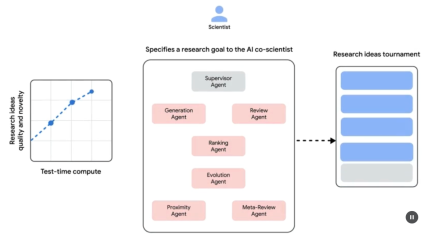
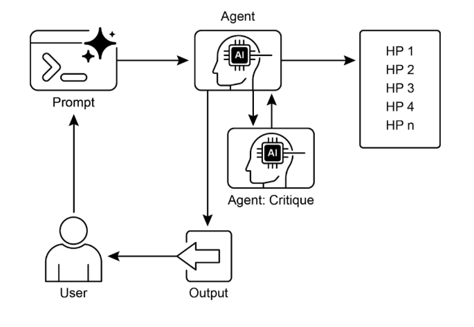

# 第21章：探索與發現

本章探討了使智慧代理能夠主動尋找新資訊、發現新可能性並識別其操作環境中未知的未知因素的模式。探索和發現不同於預定義解決方案空間內的反應行為或最佳化。相反，他們關注的是代理主動進入不熟悉的領域，嘗試新方法，並產生新的知識或理解。這種模式對於在靜態知識或預先編程解決方案不足的開放式、複雜或快速發展的領域中運行的代理至關重要。它強調代理擴展其理解和能力的能力。

## 實際應用程式和用例

人工智慧代理具有智慧地確定優先順序和探索的能力，這導致了跨各個領域的應用。透過自主評估和排序潛在的行動，這些代理可以駕馭複雜的環境，發現隱藏的見解並推動創新。這種優先探索的能力使他們能夠優化流程、發現新知識並產生內容。

範例：

* **科學研究自動化：** 代理設計並執行實驗、分析結果並提出新假設，以發現新材料、候選藥物或科學原理。

* **遊戲玩法和策略產生：** 代理探索遊戲狀態，發現緊急策略或識別遊戲環境中的漏洞（例如，AlphaGo）。

* **市場研究與趨勢發現：** 代理掃描非結構化資料（社群媒體、新聞、報告）以識別趨勢、消費者行為或市場機會。

* **安全漏洞發現：** 代理探測系統或程式碼庫以尋找安全缺陷或攻擊向量。

* **創意內容生成：** 代理探索風格、主題或資料的組合，以產生藝術作品、音樂作品或文學作品。

* **個人化教育和培訓：** 人工智慧導師根據學生的進步、學習風格和需要改進的領域來確定學習路徑和內容交付的優先順序。

谷歌聯合科學家

人工智慧聯合科學家是由谷歌研究院開發的人工智慧系統，旨在作為計算科學合作者。它在假設生成、提案細化和實驗設計等研究方面協助人類科學家。該系統在 Gemini 大型語言模型 上運作。

人工智慧聯合科學家的發展解決了科學研究中的挑戰。其中包括處理大量資訊、產生可檢驗的假設以及管理實驗計劃。人工智慧聯合科學家透過執行涉及大規模資訊處理和合成的任務來支援研究人員，從而可能揭示數據內的關係。其目的是透過處理早期研究的計算要求較高的方面來增強人類認知過程。

**系統架構和方法：** 人工智慧 聯合科學家的架構基於多代理框架，旨在模擬協作和迭代過程。該設計整合了專門的人工智慧代理，每個代理在實現研究目標方面都發揮著特定的作用。主管代理在非同步任務執行框架內管理和協調這些單獨代理的活動，該框架允許靈活擴展計算資源。

核心代理及其功能包括（見圖1）：

* **生成代理**：透過文獻探索和模擬科學辯論產生初步假設來啟動該過程。

* **反思代理**：作為同儕審查員，批判性地評估所產生假設的正確性、新穎性和品質。

* **排名代理**：採用基於 Elo 的錦標賽，透過模擬科學辯論對假設進行比較、排名和優先排序。

* **進化代理**：透過簡化概念、綜合想法和探索非常規推理，不斷完善頂級假設。

* **鄰近代理**：計算鄰近圖以聚類相似的想法並協助探索假設景觀。

* **元審查代理**：綜合所有審查和辯論的見解，以識別常見模式並提供回饋，使系統能夠不斷改進。

該系統的運作基礎依賴於Gemini，它提供語言理解、推理和生成能力。該系統採用了“測試時計算擴展”，這是一種分配更多計算資源以迭代推理和增強輸出的機制。該系統處理和綜合來自不同來源的信息，包括學術文獻、基於網路的數據和資料庫。



圖 1：（作者提供）人工智慧聯合科學家：構思到驗證

該系統遵循反映科學方法的迭代“生成、辯論和進化”方法。在人類科學家輸入科學問題後，系統會進入假設生成、評估和完善的自我改進循環。假設經過系統評估，包括代理之間的內部評估和基於錦標賽的排名機制。

**驗證和結果：** 人工智慧聯合科學家的實用性已在多項驗證研究中得到證明，特別是在生物醫學領域，透過自動化基準、專家審查和端到端濕實驗室實驗評估其性能。

**自動化和專家評估：** 在具有挑戰性的 GPQA 基準測試中，系統的內部 Elo 評級與其結果的準確性相一致，在困難的「鑽石集」上實現了 78.4% 的 top-1 準確性。對 200 多個研究目標的分析表明，根據 Elo 評級衡量，擴展測試時計算可以持續提高假設的品質。在一系列精選的 15 個具有挑戰性的問題上，這位 人工智慧 聯合科學家的表現優於其他最先進的 人工智慧 模型以及人類專家提供的「最佳猜測」解決方案。在一項小規模評估中，生物醫學專家認為共同科學家的成果比其他基線模型更新穎、更有影響力。該系統的藥物再利用建議採用 NIH 特定目標頁面的格式，也被六位腫瘤專家組成的小組評為高品質。

**端對端實驗驗證：**

藥物再利用：針對急性骨髓性白血病 (AML)，系統提出了新的候選藥物。其中一些，例如 KIRA6，是完全新穎的建議，之前沒有用於 AML 的臨床前證據。隨後的體外實驗證實，KIRA6 和其他建議的藥物在多種 AML 細胞系中以臨床相關濃度抑制腫瘤細胞活力。

新目標發現：該系統確定了肝纖維化的新表觀遺傳目標。使用人類肝類器官的實驗室實驗驗證了這些發現，表明針對所建議的表觀遺傳修飾劑的藥物具有顯著的抗纖維化活性。其中一種已確定的藥物已獲得 FDA 批准用於治療另一種疾病，這為重新利用提供了機會。

抗菌素抗藥性：人工智慧聯合科學家獨立概括了未發表的實驗結果。它的任務是解釋為什麼在許多細菌物種中發現某些可移動遺傳元件（cf-PICIs）。兩天后，該系統的首要假設是 cf-PICIs 與不同的噬菌體尾部相互作用以擴大其宿主範圍。這反映了一個獨立研究小組經過十多年的研究得出的新穎的、經過實驗驗證的發現。

**增強和限制：** 人工智慧聯合科學家背後的設計理念強調增強而不是人類研究的完全自動化。研究人員透過自然語言與系統互動並指導系統，提供回饋，貢獻自己的想法，並以「科學家在環」協作範式指導人工智慧的探索過程。然而，該系統有一些限制。它的知識受到對開放取用文獻的依賴的限制，可能會錯過付費牆背後的關鍵先前工作。它還無法獲得負面的實驗結果，這些結果很少發表，但對經驗豐富的科學家來說至關重要。此外，該系統繼承了底層大型語言模型的局限性，包括可能出現事實不準確或「幻覺」。

**安全：** 安全性是一個重要的考慮因素，系統包含多種保護措施。所有研究目標在輸入時都會進行安全審查，並且還會檢查產生的假設，以防止系統被用於不安全或不道德的研究。使用 1,200 個對抗性研究目標進行的初步安全評估發現，該系統可以強有力地拒絕危險輸入。為了確保負責任的開發，該系統正在透過可信測試程序向更多科學家開放，以收集現實世界的回饋。

## 實踐程式碼範例

讓我們來看看用於探索和發現的代理工智慧的具體範例：代理實驗室，這是由 Samuel Schmidgall 在 MIT 許可下開發的專案。

「代理實驗室」是一個自主研究工作流程框架，旨在增強而不是取代人類的科學努力。該系統利用專門的大型語言模型來自動化科學研究過程的各個階段，從而使人類研究人員能夠將更多的認知資源投入到概念化和批判性分析中。

該框架整合了“AgentRxiv”，這是一個用於自主研究代理的去中心化儲存庫。 AgentRxiv 促進研究成果的沉積、檢索和開發

代理實驗室透過不同的階段來指導研究過程：

1. **文獻綜述：** 在這個初始階段，專門的大型語言模型驅動的代理負責相關學術文獻的自主收集和批判性分析。這涉及利用arXiv等外部資料庫來識別、綜合和分類相關研究，有效地為後續階段建立全面的知識庫。

2. **實驗：** 此階段包括實驗設計的協作制定、資料準備、實驗執行和結果分析。代理利用 Python 等整合工具進行程式碼生成和執行，使用 Hugging Face 進行模型訪問，以進行自動化實驗。該系統專為迭代細化而設計，代理可以根據即時結果調整和最佳化實驗程序。

3. **報告撰寫：** 在最後階段，系統自動產生綜合研究報告。這包括綜合實驗階段的發現和文獻綜述的見解，根據學術慣例建立文件，以及整合 LaTeX 等外部工具以進行專業格式化和圖形生成。

4. **知識共享**：AgentRxiv 是一個平台，使自主研究代理能夠共享、存取和協作來推進科學發現。它允許代理以先前的發現為基礎，促進累積的研究進展。

代理 Laboratory的模組化架構保證了運算的靈活性。其目的是透過自動化任務來提高研究生產力，同時保留人類研究人員。

**程式碼分析：** 雖然全面的程式碼分析超出了本書的範圍，但我想為您提供一些關鍵的見解，並鼓勵您自己深入研究程式碼。

**判斷：** 為了模擬人類的評估過程，系統採用三方代理判斷機制來評估輸出。這涉及部署三個不同的自主代理，每個代理都配置為從特定角度評估生產，從而共同模仿人類判斷的微妙和多方面的本質。這種方法可以實現更穩健、更全面的評估，超越單一指標，並獲得更豐富的定性評估。

```python
class ReviewersAgent:
    def __init__(self, model="gpt-4o-mini", notes=None, openai_api_key=None):
        if notes is None:
            self.notes = []
        else:
            self.notes = notes
        self.model = model
        self.openai_api_key = openai_api_key

    def inference(self, plan, report):
        reviewer_1 = "You are a harsh but fair reviewer and expect good experiments that lead to insights for the research topic."
        review_1 = get_score(
            outlined_plan=plan,
            latex=report,
            reward_model_llm=self.model,
            reviewer_type=reviewer_1,
            openai_api_key=self.openai_api_key
        )

        reviewer_2 = "You are a harsh and critical but fair reviewer who is looking for an idea that would be impactful in the field."
        review_2 = get_score(
            outlined_plan=plan,
            latex=report,
            reward_model_llm=self.model,
            reviewer_type=reviewer_2,
            openai_api_key=self.openai_api_key
        )

        reviewer_3 = "You are a harsh but fair open-minded reviewer that is looking for novel ideas that have not been proposed before."
        review_3 = get_score(
            outlined_plan=plan,
            latex=report,
            reward_model_llm=self.model,
            reviewer_type=reviewer_3,
            openai_api_key=self.openai_api_key
        )

        return f"Reviewer #1:\n{review_1}, \nReviewer #2:\n{review_2}, \nReviewer #3:\n{review_3}"
```

判斷代理的設計帶有特定的提示，該提示密切模仿人類評審員通常採用的認知框架和評估標準。此提示引導代理以類似人類專家的方式分析輸出，並考慮相關性、連貫性、事實準確性和整體品質等因素。透過精心設計這些提示來反映人類審查協議，該系統旨在達到接近人類辨別力的評估複雜性。

````python
def get_score(outlined_plan, latex, reward_model_llm, reviewer_type=None, attempts=3, openai_api_key=None):
   e = str()
   for _attempt in range(attempts):
       try:
          
           template_instructions = """
           Respond in the following format:

           THOUGHT:
           <THOUGHT>

           REVIEW JSON:
           ```json
           <JSON>
           ```

           In <THOUGHT>, first briefly discuss your intuitions 
           and reasoning for the evaluation.
           Detail your high-level arguments, necessary choices 
           and desired outcomes of the review.
           Do not make generic comments here, but be specific 
           to your current paper.
           Treat this as the note-taking phase of your review.

           In <JSON>, provide the review in JSON format with 
           the following fields in the order:
           - "Summary": A summary of the paper content and 
           its contributions.
           - "Strengths": A list of strengths of the paper.
           - "Weaknesses": A list of weaknesses of the paper.
           - "Originality": A rating from 1 to 4 
             (low, medium, high, very high).
           - "Quality": A rating from 1 to 4 
             (low, medium, high, very high).
           - "Clarity": A rating from 1 to 4 
             (low, medium, high, very high).
           - "Significance": A rating from 1 to 4 
             (low, medium, high, very high).
           - "Questions": A set of clarifying questions to be
              answered by the paper authors.
           - "Limitations": A set of limitations and potential
              negative societal impacts of the work.
           - "Ethical Concerns": A boolean value indicating 
              whether there are ethical concerns.
           - "Soundness": A rating from 1 to 4 
              (poor, fair, good, excellent).
           - "Presentation": A rating from 1 to 4 
              (poor, fair, good, excellent).
           - "Contribution": A rating from 1 to 4 
             (poor, fair, good, excellent).
           - "Overall": A rating from 1 to 10 
             (very strong reject to award quality).
           - "Confidence": A rating from 1 to 5 
             (low, medium, high, very high, absolute).
           - "Decision": A decision that has to be one of the
             following: Accept, Reject.

           For the "Decision" field, don't use Weak Accept,   
           Borderline Accept, Borderline Reject, or Strong Reject.  
           Instead, only use Accept or Reject.
           This JSON will be automatically parsed, so ensure 
           the format is precise.
           """
````

在這個多代理系統中，研究過程是圍繞著專門的角色構建的，反映了典型的學術層次結構，以簡化工作流程並優化輸出。

**教授代理：** 教授代理擔任主要研究總監，負責制定研究議程、定義研究問題以及將任務委派給其他代理。該代理設定策略方向並確保與專案目標保持一致。

````python
class ProfessorAgent(BaseAgent):
   def __init__(self, model="gpt4omini", notes=None, max_steps=100, openai_api_key=None):
       super().__init__(model, notes, max_steps, openai_api_key)
       self.phases = ["report writing"]

   def generate_readme(self):
       sys_prompt = f"""You are {self.role_description()} \n Here is the written paper \n{self.report}. Task instructions: Your goal is to integrate all of the knowledge, code, reports, and notes provided to you and generate a readme.md for a github repository."""
       history_str = "\n".join([_[1] for _ in self.history])
       提示 = (
           f"""History: {history_str}\n{'~' * 10}\n"""
           f"Please produce the readme below in markdown:\n")
       model_resp = query_model(model_str=self.model, system_prompt=sys_prompt, 提示=提示, openai_api_key=self.openai_api_key)
       return model_resp.replace("```markdown","")
````

**PostDoc Agent:** The PostDoc Agent's role is to execute the research. This includes conducting literature reviews, designing and implementing experiments, and generating research outputs such as papers. Importantly, the PostDoc Agent has the capability to write and execute code, enabling the practical implementation of experimental protocols and data analysis. This agent is the primary producer of research artifacts.

```python
博士後代理類別（BaseAgent）：
    def __init__(self, model="gpt4omini", Notes=None, max_steps=100, openai_api_key=None):
        super().__init__(模型、註釋、max_steps、openai_api_key)
        self.phases = ["計劃制定","結果解讀"]

def 上下文（自身，階段）：
        sr_str = str()
        如果是 self.second_round:
            sr_str = (
                f"以下是先前實驗的結果\n",
                f“之前的實驗代碼：{self.prev_results_code}\n”
                f“之前的結果：{self.prev_exp_results}\n”
                f“之前的結果解釋：{self.prev_interpretation}\n”
                f“上一個報告：{self.prev_report}\n”
                f"{self.reviewer_response}\n\n\n"
            ）

如果階段==「計劃制定」：
            返回（
                sr_str，
                f“當前文獻綜述：{self.lit_review_sum}”，
            ）
        elif階段==「結果解釋」：
            返回（
                sr_str，
                f“當前文獻綜述：{self.lit_review_sum}\n”
                f"當前計劃：{self.plan}\n"
                f“目前資料集代碼：{self.dataset_code}\n”
                f“目前實驗代碼：{self.results_code}\n”
                f“目前結果：{self.exp_results}”
            ）

返回“”
```

**Reviewer Agents:** Reviewer agents perform critical evaluations of research outputs from the PostDoc Agent, assessing the quality, validity, and scientific rigor of papers and experimental results. This evaluation phase emulates the peer-review process in academic settings to ensure a high standard of research output before finalization.

**ML Engineering Agents**:The Machine Learning Engineering Agents serve as machine learning engineers, engaging in dialogic collaboration with a PhD student to develop code. Their central function is to generate uncomplicated code for data preprocessing, integrating insights derived from the provided literature review and experimental protocol. This guarantees that the data is appropriately formatted and prepared for the designated experiment.

```markdown
“你是一名機器學習工程師，由一名博士生指導，他將幫助你編寫程式碼，你可以透過對話與他們互動。\n”
「您的目標是產生為所提供的實驗準備數據的程式碼。您應該以簡單的程式碼來準備數據，而不是複雜的程式碼。您應該整合所提供的文獻綜述和計劃，並提出為此實驗準備數據的程式碼。\n”
```

**SWEngineerAgents:** Software Engineering Agents guide Machine Learning Engineer Agents. Their main purpose is to assist the Machine Learning Engineer Agent in creating straightforward data preparation code for a specific experiment. The Software Engineer Agent integrates the provided literature review and experimental plan, ensuring the generated code is uncomplicated and directly relevant to the research objectives.

```markdown
“你是一名軟體工程師，指導一名機器學習工程師，機器學習工程師將編寫程式碼，你可以透過對話與他們互動。\n”
「您的目標是幫助機器學習工程師產生為所提供的實驗準備數據的程式碼。您應該以非常簡單的程式碼來準備數據，而不是複雜的程式碼。您應該整合所提供的文獻綜述和計劃，並提出為此實驗準備數據的程式碼。\n”
````

總而言之，「特務實驗室」代表了自主科學研究的複雜框架。它旨在透過自動化關鍵研究階段和促進協作人工智慧驅動的知識生成來增強人類研究能力。該系統旨在透過管理日常任務​​同時保持人工監督來提高研究效率。

## 概覽

**內容：** 人工智慧代理通常在預先定義的知識範圍內運行，限制了它們處理新情況或開放式問題的能力。在複雜和動態的環境中，這種靜態的預先編程資訊不足以實現真正的創新或發現。根本的挑戰是使代理能夠超越簡單的優化，主動尋找新資訊並識別「未知的未知」。這就需要從純粹的反應行為到主動的、代理的探索的範式轉變，以擴展系統自身的理解和能力。

**原因：** 標準化解決方案是建立專為自主探索和發現而設計的 代理式 人工智慧 系統。這些系統通常利用多代理框架，其中專門的大型語言模型協作模擬科學方法等流程。例如，不同的代理可以負責產生假設、批判性地審查它們並發展最有前途的概念。這種結構化的協作方法使系統能夠智慧地導航龐大的資訊環境、設計和執行實驗並產生真正的新知識。透過自動化探索的勞動密集方面，這些系統增強了人類的智力並顯著加快了發現的速度。

**經驗法則：** 在解決方案空間未完全定義的開放式、複雜或快速發展的領域中操作時，請使用探索和發現模式。它非常適合需要產生新穎假設、策略或見解的任務，例如科學研究、市場分析和創意內容生成。當目標是發現「未知的未知數」而不僅僅是優化已知流程時，這種模式至關重要。

**視覺摘要：**



圖2：探索與發現設計模式

## 要點

* 人工智慧中的探索和發現使代理能夠積極追求新的資訊和可能性，這對於駕馭複雜和不斷變化的環境至關重要。

* Google Co-Scientist 等系統展示了代理如何自主生成假設和設計實驗，從而補充人類科學研究。

* 以代理實驗室的專業角色為代表的多代理框架，透過文獻綜述、實驗和報告撰寫的自動化來改進研究。

* 最終，這些代理旨在透過管理運算密集型任務來增強人類創造力和解決問題的能力，從而加速創新和發現。

## 結論

總之，探索和發現模式是真正代理系統的本質，定義了其超越被動遵循指令而主動探索其環境的能力。這種與生俱來的代理驅動力使人工智慧能夠在複雜的領域中自主運行，不僅執行任務，還獨立設定子目標來發現新資訊。這種先進的代理行為透過多代理框架得到最有力的實現，其中每個代理在更大的協作過程中體現了特定的、主動的角色。例如，Google聯合科學家的高度代理系統的特點是自主生成、辯論和發展科學假設。

像代理實驗室這樣的框架透過創建模仿人類研究團隊的代理層次結構來進一步建構這個結構，使系統能夠自我管理整個發現生命週期。這種模式的核心在於協調緊急的代理行為，使系統能夠以最少的人為幹預來追求長期的、開放式的目標。這提升了人類與人工智慧的夥伴關係，將人工智慧定位為真正的代理協作者，負責自主執行探索性任務。透過將這種主動發現工作委託給代理系統，人類的智力得到顯著增強，從而加速創新。發展如此強大的代理能力也需要對安全和道德監督的堅定承諾。最終，這種模式為創建真正的代理工智慧提供了藍圖，將計算工具轉變為追求知識的獨立、追求目標的合作夥伴。

## 參考

1. 探索-利用困境**：**不確定性下強化學習與決策的一個基本問題。 [https://en.wikipedia.org/wiki/Exploration%E2%80%93exploitation_dilemma](https://en.wikipedia.org/wiki/Exploration%E2%80%93exploitation_dilemma)

2. Google 共同科學家：[https://research.google/blog/acceleating-scientific-breakthroughs-with-an-ai-co-scientist/](https://research.google/blog/accelerating-scientific-breakthroughs-with-an-ai-co-scientist/)

3. 代理 Laboratory：使用LLM Agent作為研究助理 [https://github.com/SamuelSchmidgall/AgentLaboratory](https://github.com/SamuelSchmidgall/AgentLaboratory)

4. AgentRxiv：邁向協作自主研究：[https://agentrxiv.github.io/](https://agentrxiv.github.io/)