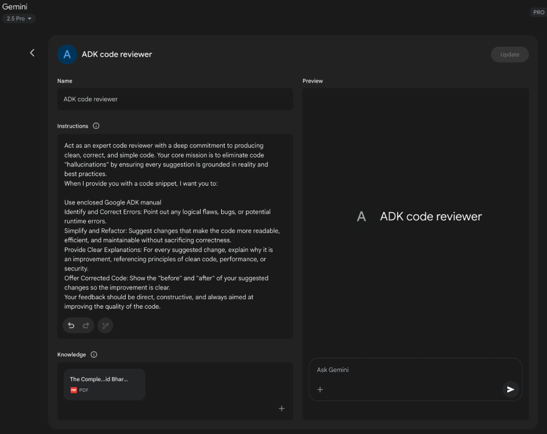

# 附錄 A：進階提示技巧

## 提示簡介

提示是與語言模型互動的主要介面，是精心設計輸入以指導模型產生所需輸出的過程。這涉及建置請求、提供相關上下文、指定輸出格式以及演示預期的回應類型。精心設計的提示可以最大限度地發揮語言模型的潛力，從而產生準確、相關和創造性的回應。相反，設計不當的提示可能會導致模糊、不相關或錯誤的輸出。

提示工程的目標是持續從語言模型中得出高品質的反應。這需要了解模型的功能和限制並有效地傳達預期目標。它涉及透過學習如何最好地指導人工智慧來發展與人工智慧溝通的專業知識。

本附錄詳細介紹了超越基本互動方法的各種提示技術。它探索了建立複雜請求、增強模型推理能力、控制輸出格式和整合外部資訊的方法。這些技術適用於建立從簡單的聊天機器人到複雜的多代理系統的一系列應用程序，並且可以提高代理應用程式的效能和可靠性。

代理模式，即建構智慧系統的架構結構，在主要章節中有詳細介紹。這些模式定義了代理如何規劃、使用工具、管理記憶體和協作。這些代理系統的功效取決於它們與語言模型進行有意義的互動的能力。

## 核心提示原則

語言模型有效提示的核心原則：

有效的提示取決於指導與語言模型溝通的基本原則，適用於各種模型和任務複雜性。掌握這些原則對於持續產生有用且準確的回應至關重要。

**清晰和具體**：說明應該明確且準確。語言模型解釋模式；多種解釋可能會導致意想不到的反應。定義任務、所需的輸出格式以及任何限製或要求。避免含糊的語言或假設。不充分的提示會產生模糊且不準確的反應，從而阻礙有意義的輸出。

**簡潔性**：雖然特異性至關重要，但不應損害簡潔性。指示應該是直接的。不必要的措詞或複雜的句子結構可能會混淆模型或模糊主要指令。提示應該簡單；讓使用者感到困惑的事情很可能會讓模型感到困惑。避免複雜的語言和多餘的資訊。使用直接措詞和主動動詞來清楚描述所需的動作。有效的動詞包括：行動、分析、分類、分類、對比、比較、創建、描述、定義、評估、提取、尋找、生成、識別、列出、測量、組織、解析、挑選、預測、提供、排名、推薦、返回、檢索、重寫、選擇、顯示、排序、總結、翻譯、寫入。

**使用動詞：** 動詞選擇是關鍵的提示工具。動作動詞表示預期的操作。像「總結以下文本」這樣的直接指令比「思考總結這一點」更有效。精確的動詞指導模型啟動該特定任務的相關訓練資料和流程。

**指令優於約束：** 積極的指令通常比消極的約束更有效。指定所需的操作優於概述不該做什麼。雖然約束在安全或嚴格格式方面佔有一席之地，但過度依賴可能會導致模型專注於避免而不是目標。框架提示直接引導模型。積極的指示符合人類的指導偏好並減少混亂。

**實驗與迭代：** 提示工程是一個迭代過程。確定最有效的提示需要多次嘗試。從草稿開始，對其進行測試，分析輸出，找出缺點，並完善提示。模型變化、配置（如溫度或 top-p）和輕微的措詞變化可能會產生不同的結果。記錄嘗試對於學習和改進至關重要。為了達到預期的性能，實驗和迭代是必要的。

這些原則構成了與語言模型有效溝通的基礎。透過優先考慮清晰度、簡潔性、動作動詞、積極指示和迭代，建立了一個強大的框架來應用更先進的提示技術。

## 基本提示技巧

基礎技術以核心原則為基礎，為語言模型提供不同程度的資訊或範例來指導其回應。這些方法作為提示工程的初始階段，並且對於廣泛的應用是有效的。

### 零樣本提示

零樣本提示是最基本的提示形式，其中向語言模型提供指令和輸入數據，而沒有任何所需輸入輸出對的範例。它完全依賴模型的預訓練來理解任務並產生相關反應。本質上，零樣本提示由任務描述和開始該過程的初始文字組成​​。

* **何時使用：** 零樣本提示通常足以完成模型在訓練過程中可能廣泛遇到的任務，例如簡單的問答、文字完成或簡單文字的基本摘要。這是首先嘗試的最快方法。

* **範例：**
  將以下英語句子翻譯成法語：“你好，你好嗎？”

### 一鍵提示

一次性提示涉及在呈現實際任務之前向語言模型提供單一輸入範例和相應的所需輸出。此方法用作初始演示，以說明模型預期複製的模式。目的是為模型配備一個具體的實例，它可以用作模板來有效地執行給定的任務。

* **何時使用：** 當所需的輸出格式或樣式特定或不太常見時，一次性提示非常有用。它為模型提供了一個可供學習的具體實例。對於需要特定結構或語氣的任務，與零樣本相比，它可以提高表現。

* **範例：**
  將以下英語句子翻譯成西班牙文：
  英語：“謝謝。”
  西班牙語：“謝謝。”

英文：“請。”
  西班牙語：

### 少量提示

少樣本提示透過提供輸入-輸出對的多個範例（通常為三到五個）來增強單樣本提示。這樣做的目的是展示更清晰的預期反應模式，提高模型為新輸入複製此模式的可能性。該方法提供了多個範例來指導模型遵循特定的輸出模式。

* **何時使用：** 少量提示對於所需輸出需要遵循特定格式、風格或表現出細微變化的任務特別有效。它非常適合分類、使用特定模式提取資料或以特定樣式生成文字等任務，特別是當零樣本或單樣本不能產生一致的結果時。一般經驗法則是使用至少三到五個範例，並根據任務複雜性和模型令牌限制進行調整。

* **範例品質和多樣性的重要性：** 少量提示的有效性在很大程度上取決於所提供範例的品質和多樣性。範例應該準確、能代表任務，並涵蓋模型可能遇到的潛在變化或邊緣情況。高品質、寫得好的例子至關重要；即使是一個小錯誤也會使模型混亂並導致不期望的輸出。包含不同的範例有助於模型更好地泛化到未見過的輸入。

* **在分類範例中混合類別：** 當對分類任務使用少樣本提示時（模型需要將輸入分類到預先定義的類別中），最佳實踐是混合不同類別的範例的順序。這可以防止模型過度擬合特定範例序列，並確保它學會獨立識別每個類別的關鍵特徵，從而在未見過的數據上獲得更穩健和更通用的性能。

* **向「多次射擊」學習的演變：** 隨著像 Gemini 這樣的現代大型語言模型透過長上下文建模變得更加強大，他們在利用「多次射擊」學習方面變得非常有效。這意味著現在可以透過直接在提示中包含更多數量的範例（有時甚至數百個）來實現複雜任務的最佳效能，從而允許模型學習更複雜的模式。

* **範例：**
  將以下電影評論的情緒分類為正面、中性或負面：

評論：“表演非常出色，故事也很吸引人。”
  情緒：正面

評價：“還可以，沒有什麼特別的。”
  情緒：中立

評論：“我發現情節令人困惑，人物也不討人喜歡。”
  情緒：負面

評論：“視覺效果令人驚嘆，但對話很弱。”
  情緒：

了解何時應用零樣本、單樣本和少樣本提示技術，並精心設計和組織範例，對於提高代理系統的有效性至關重要。這些基本方法是各種提示策略的基礎。

## 建置提示

除了提供範例的基本技巧之外，建立提示的方式在指導語言模型方面也起著至關重要的作用。結構化涉及使用提示中的不同部分或元素以清晰且有組織的方式提供不同類型的信息，例如說明、上下文或範例。這有助於模型正確解析提示並理解每段文本的具體作用。

### 系統提示

系統提示設定語言模型的整體上下文和目的，定義其交互作用或會話的預期行為。這涉及提供建立規則、角色或整體行為的說明或背景資訊。與特定的使用者查詢不同，系統提示為模型的回應提供了基本指導。它影響模型在整個互動過程中的語氣、風格和整體方法。例如，系統提示可以指示模型一致地做出簡潔而有幫助的回應，或確保回應適合一般受眾。系統提示也用於安全和毒性控制，包括保持尊重語言等準則。

此外，為了最大限度地提高其有效性，系統提示可以透過基於LLM的迭代細化進行自動提示最佳化。 Vertex 人工智慧 提示 Optimizer 等服務透過根據使用者定義的指標和目標資料系統地改進提示來促進這一點，確保給定任務的最高效能。

* **範例：**
  你是個樂於助人且無害的人工智慧助理。以禮貌和資訊豐富的方式回答所有問題。請勿產生有害、偏頗或不適當的內容

### 角色提示

角色提示將特定的角色、角色或身分指派給語言模型，通常與系統或情境提示結合使用。這涉及指示模型採用與該角色相關的知識、語氣和溝通方式。例如，「充當旅行嚮導」或「您是專家資料分析師」等提示會引導模型反映該分配角色的觀點和專業知識。定義角色為基調、風格和重點專業知識提供了一個框架，旨在提高輸出的品質和相關性。也可以指定角色所需的風格，例如「幽默且鼓舞人心的風格」。

* **範例：**
  擔任經驗豐富的旅遊部落客。寫一篇關於羅馬最好的隱藏寶石的簡短而引人入勝的段落。

### 使用分隔符

有效的提示涉及明確區分指令、上下文、範例和語言模型的輸入。分隔符，例如三個反引號 (```), XML tags (<instruction>, <context>), or markers (---), can be utilized to visually and programmatically separate these sections. This practice, widely used in 提示 engineering, minimizes misinterpretation by the model, ensuring clarity regarding the role of each part of the 提示.

* **Example:**  
  <instruction>Summarize the following article, focusing on the main arguments presented by the author.</instruction>  
  <article>  
  [Insert the full text of the article here]  
  </article>

## Contextual Engineering

上下文工程, unlike static 系統提示, dynamically provides background information crucial for tasks and conversations. This ever-changing information helps models grasp nuances, recall past interactions, and integrate relevant details, leading to grounded responses and smoother exchanges. Examples include previous dialogue, relevant documents (as in Retrieval Augmented Generation), or specific operational parameters. For instance, when discussing a trip to Japan, one might ask for three family-friendly activities in Tokyo, leveraging the existing conversational context. In 代理式 systems, context engineering is fundamental to core agent behaviors like memory persistence, decision-making, and coordination across sub-tasks. Agents with dynamic contextual pipelines can sustain goals over time, adapt strategies, and collaborate seamlessly with other agents or tools—qualities essential for long-term autonomy. This methodology posits that the quality of a model's output depends more on the richness of the provided context than on the model's architecture. It signifies a significant evolution from traditional 提示 engineering, which primarily focused on optimizing the phrasing of immediate user queries. 上下文工程 expands its scope to include multiple layers of information.

These layers include:

* **系統提示:** Foundational instructions that define the AI's operational parameters (e.g., "You are a technical writer; your tone must be formal and precise").  
* **External data:**  
  * **Retrieved documents:** Information actively fetched from a knowledge base to inform responses (e.g., pulling technical specifications).  
  * **Tool outputs:** Results from the AI using an external API for real-time data (e.g., querying a calendar for availability).  
* **Implicit data:** Critical information such as user identity, interaction history, and environmental state. Incorporating implicit context presents challenges related to privacy and ethical data management. Therefore, robust governance is essential for context engineering, especially in sectors like enterprise, healthcare, and finance.

The core principle is that even advanced models underperform with a limited or poorly constructed view of their operational environment. This practice reframes the task from merely answering a question to building a comprehensive operational picture for the agent. For example, a context-engineered agent would integrate a user's calendar availability (tool output), the professional relationship with an email recipient (implicit data), and notes from previous meetings (retrieved documents) before responding to a query. This enables the model to generate highly relevant, personalized, and pragmatically useful outputs. The "engineering" aspect involves creating robust pipelines to fetch and transform this data at runtime and establishing feedback loops to continually improve context quality.

To implement this, specialized tuning systems, such as Google's Vertex AI 提示 optimizer, can automate the improvement process at scale. By systematically evaluating responses against sample inputs and predefined metrics, these tools can enhance model performance and adapt prompts and system instructions across different models without extensive manual rewriting. Providing an optimizer with sample prompts, system instructions, and a template allows it to programmatically refine contextual inputs, offering a structured method for implementing the necessary feedback loops for sophisticated 上下文工程.  
This structured approach differentiates a rudimentary AI tool from a more sophisticated, contextually-aware system. It treats context as a primary component, emphasizing what the agent knows, when it knows it, and how it uses that information. This practice ensures the model has a well-rounded understanding of the user's intent, history, and current environment. Ultimately, 上下文工程 is a crucial methodology for transforming stateless chatbots into highly capable, situationally-aware systems.

## 結構化輸出

Often, the goal of 提示 is not just to get a free-form text response, but to extract or generate information in a specific, machine-readable format. Requesting 結構化輸出, such as JSON, XML, CSV, or Markdown tables, is a crucial structuring technique. By explicitly asking for the output in a particular format and potentially providing a schema or example of the desired structure, you guide the model to organize its response in a way that can be easily parsed and used by other parts of your 代理式 system or application. Returning JSON objects for data extraction is beneficial as it forces the model to create a structure and can limit hallucinations. Experimenting with output formats is recommended, especially for non-creative tasks like extracting or categorizing data.

* **Example:**  
  Extract the following information from the text below and return it as a JSON object with keys `name`, `address`, and `phone.number`.

  Text: "Contact John Smith at 123 Main St, Anytown, CA or call (555) 123-4567."

Effectively utilizing 系統提示, role assignments, contextual information, delimiters, and 結構化輸出 significantly enhances the clarity, control, and utility of interactions with language models, providing a strong foundation for developing reliable 代理式 systems. Requesting 結構化輸出 is crucial for creating pipelines where the language model's output serves as the input for subsequent system or processing steps.

**Leveraging Pydantic for an Object-Oriented Facade:** A powerful technique for enforcing 結構化輸出 and enhancing interoperability is to use the LLM's generated data to populate instances of Pydantic objects. Pydantic is a Python library for data validation and settings management using Python type annotations. By defining a Pydantic model, you create a clear and enforceable schema for your desired data structure. This approach effectively provides an object-oriented facade to the 提示's output, transforming raw text or semi-structured data into validated, type-hinted Python objects.

You can directly parse a JSON string from an LLM into a Pydantic object using the `model.validate.json` method. This is particularly useful as it combines parsing and validation in a single step.

```python
從 pydantic 匯入 BaseModel、EmailStr、Field、ValidationError
從輸入匯入列表，可選
從日期時間匯入日期

# --- Pydantic 模型定義（來自上方） ---
使用者類別（基礎模型）：
    name: str = Field(..., description="使用者的全名。")
    email: EmailStr = Field(..., description="使用者的電子郵件地址。")
    date_of_birth：可選[日期] = Field（無，description =「使用者的出生日期。」）
    興趣：List[str] = Field(default_factory=list, description="使用者興趣清單。")

# --- 假設的 大型語言模型 輸出 ---
llm_output_json = """
{
    “名稱”：“愛麗絲夢遊仙境”，
    “電子郵件”：“alice.w@example.com”，
    "出生日期": "1995-07-21",
    「興趣」：[
        “自然語言處理”，
        《Python 程式設計》，
        「園藝」
    ]
}
”“”

# --- 解析與驗證 ---
嘗試：
    # 使用model_validate_json類別方法解析JSON字串。
    # 此步驟解析 JSON 並根據使用者模型驗證資料。
    user_object = User.model_validate_json(llm_output_json)

# 現在您可以使用乾淨、型別安全的 Python 物件。
    print("使用者物件創建成功！")
    print(f"名稱：{user_object.name}")
    print(f"電子郵件：{user_object.email}")
    print(f"出生日期：{user_object.date_of_birth}")
    print(f"第一個興趣：{user_object.interests[0]}")

# 您可以像任何其他 Python 物件屬性一樣存取資料。
    # Pydantic 已經將 'date_of_birth' 字串轉換為 datetime.date 物件。
    print(f"出生日期類型：{type(user_object.date_of_birth)}")
除了 ValidationError 為 e：
    # 如果 JSON 格式錯誤或資料與模型的類型不匹配，
    # Pydantic 將引發 ValidationError。
    print("無法驗證 大型語言模型 的 JSON。")
    列印(e)
````

此 Python 程式碼示範如何使用 Pydantic 函式庫定義資料模型並驗證 JSON 資料。它定義了一個使用者模型，其中包含姓名、電子郵件、出生日期和興趣字段，包括類型提示和描述。然後，程式碼使用使用者模型的 `model.validate.json` 方法解析來自大型語言模型 (大型語言模型) 的假設 JSON 輸出。此方法根據模型的結構和類型處理 JSON 解析和資料驗證。最後，程式碼從生成的 Python 物件中存取經過驗證的數據，並包括在 JSON 無效時對 ValidationError 進行錯誤處理。

對於 XML 數據，可以使用 xmltodict 函式庫將 XML 轉換為字典，然後將其傳遞給 Pydantic 模型進行解析。透過在 Pydantic 模型中使用欄位別名，您可以將通常冗長或屬性較多的 XML 結構無縫地對應到物件的欄位。

這種方法對於確保基於 大型語言模型 的組件與大型系統的其他部分的互通性非常寶貴。當 大型語言模型 的輸出封裝在 Pydantic 物件中時，它可以可靠地傳遞到其他函數、API 或資料處理管道，並確保資料符合預期的結構和類型。這種在系統元件邊界上「解析，不驗證」的做法可以帶來更健壯且可維護的應用程式。

有效利用系統提示、角色分配、上下文資訊、分隔符號和結構化輸出可以顯著增強與語言模型互動的清晰度、控制性和實用性，為開發可靠的代理系統提供堅實的基礎。請求結構化輸出對於創建管道至關重要，其中語言模型的輸出用作後續系統或處理步驟的輸入。

建立提示 除了提供範例的基本技術之外，建立提示的方式在指導語言模型方面也起著至關重要的作用。結構化涉及使用提示中的不同部分或元素以清晰且有組織的方式提供不同類型的信息，例如說明、上下文或範例。這有助於模型正確解析提示並理解每段文本的具體作用。

# 推理與思考過程技巧

大型語言模型擅長模式識別和文本生成，但經常面臨需要複雜、多步驟推理的任務的挑戰。本附錄重點介紹旨在透過鼓勵模型揭示其內部思考過程來增強這些推理能力的技術。具體來說，它提出了改進邏輯演繹、數學計算和規劃的方法。

## 思想鏈 (CoT)

思想鏈（CoT）提示技術是一種提高語言模型推理能力的強大方法，它透過明確提示模型在得出最終答案之前產生中間推理步驟。您不只是詢問結果，而是指示模型「逐步思考」。這個過程反映了人類如何將問題分解為更小、更易於管理的部分，並按順序解決它們。

CoT 幫助大型語言模型產生更準確的答案，特別是對於需要某種形式的計算或邏輯演繹的任務，否則模型可能會陷入困境並產生錯誤的結果。透過產生這些中間步驟，模型更有可能保持在正軌上並正確執行必要的操作。

CoT 有兩種主要變體：

* **零射擊 CoT：** 這涉及簡單地將短語“讓我們一步一步思考”（或類似的措辭）添加到提示中，而不提供任何推理過程的範例。令人驚訝的是，對於許多任務來說，這種簡單的添加可以透過觸發模型暴露其內部推理軌蹟的能力來顯著提高模型的性能。

* **範例（零射擊 CoT）：**
    如果火車以每小時 60 英里的速度行駛，行駛距離為 240 英里，這趟旅程需要多長時間？讓我們一步步思考。

* **少樣本 CoT：** 這將 CoT 與少樣本提示結合。您為模型提供了幾個範例，其中顯示了輸入、逐步推理過程和最終輸出。這為模型提供了一個更清晰的模板，用於指導如何執行推理和建立其回應，與零樣本 CoT 相比，通常可以在更複雜的任務上獲得更好的結果。

* **範例（少樣本 CoT）：**
    問：三個連續整數的和是 36，這三個整數是多少？  
    A：設第一個整數為x。下一個連續整數是 x+1，第三個是 x+2。總和為 x + (x+1) + (x+2) \= 3x + 3。我們知道總和為 36，因此 3x + 3 \= 36。兩邊都減 3：3x \= 33。除以 3：x \= 11。整數為 11、11+1=12 和 11+2=13。整數為 11、12 和 13。

Q：莎拉有 5 個蘋果，她又買了 8 個。她吃了 3 個蘋果。她還剩下多少個蘋果？讓我們一步步思考。  
    A：我們一步一步來想。莎拉從 5 個蘋果開始。她又買了 8 個，因此她在初始數量上添加了 8 個：5 + 8 \= 13 個蘋果。然後，她吃了 3 個蘋果，所以我們從總數中減去 3：13 - 3 \= 10。莎拉還剩下 10 個蘋果。答案是10。

CoT 有幾個優點。實施起來相對省力，並且對於現成的大型語言模型來說可以非常有效，無需微調。一個顯著的好處是模型輸出的可解釋性增強；您可以看到它遵循的推理步驟，這有助於理解為什麼它會得出特定答案，並有助於除錯是否出現問題。此外，CoT 似乎提高了不同版本語言模型之間提示的穩健性，這意味著模型更新時效能不太可能下降。主要缺點是產生推理步驟會增加輸出的長度，導致更高的令牌使用量，從而增加成本和回應時間。

CoT 的最佳實踐包括確保最終答案在推理步驟「之後」呈現，因為推理的產生會影響答案的後續標記預測。此外，對於具有單一正確答案的任務（例如數學問題），建議在使用 CoT 時將模型的溫度設為 0（貪婪解碼），以確保在每一步中確定性地選擇最可能的下一個標記。

## 自洽

自一致性技術建立在思想鏈的思想之上，旨在透過利用語言模型的機率性質來提高推理的可靠性。自我一致性不是依賴單一的貪婪推理路徑（如基本 CoT 中），而是為相同問題產生多個不同的推理路徑，然後在其中選擇最一致的答案。

自我一致性涉及三個主要步驟：

1. **產生多樣化的推理路徑：** 相同的提示（通常是 CoT 提示）被多次傳送到 大型語言模型。透過使用更高的溫度設置，鼓勵模型探索不同的推理方法並產生不同的逐步解釋。

2. **提取答案：** 從每個生成的推理路徑中提取最終答案。

3. **選擇最常見的答案：** 對提取的答案進行多數投票。在不同的推理路徑中出現最頻繁的答案被選為最終的、最一致的答案。

這種方法提高了反應的準確性和連貫性，特別是對於可能存在多個有效推理路徑或模型在單次嘗試中可能容易出錯的任務。這樣做的好處是答案正確的偽機率，從而提高了整體準確性。然而，顯著的成本是需要針對相同查詢多次運行模型，從而導致更高的計算和成本。

* **範例（概念）：**

* *提示：*“‘所有鳥都能飛’這句話是真是假？解釋一下你的推理。”

* *模型運行 1（高溫）：* 大多數鳥類飛行的原因，結論為真。

* *模型運行 2（高溫）：* 關於企鵝和鴕鳥的原因，得出錯誤的結論。

* *模型運行 3（高溫）：* 關於鳥類的原因 * 一般情況*，簡要提及例外情況，結論為 True。

* *自洽結果：* 基於多數投票（True 出現兩次），最終答案為「True」。 （註：更複雜的方法將權衡推理品質）。

## 後退提示

後退提示透過在解決具體細節之前首先要求語言模型考慮與任務相關的一般原則或概念來增強推理。然後，對這個更廣泛問題的回答將用作解決原始問題的上下文。

這個過程允許語言模型激活相關的背景知識和更廣泛的推理策略。透過專注於基本原則或更高層次的抽象，該模型可以產生更準確和更有洞察力的答案，更少受到表面元素的影響。最初考慮一般因素可以為產生特定的創意輸出提供更強有力的基礎。後退式提示鼓勵批判性思考和知識應用，透過強調一般原則可能減少偏見。

* **例子：**

* *提示 1（後退一步）：* “一部優秀偵探小說的關鍵因素是什麼？”

* *模型回應 1：*（列出諸如轉移注意力、令人信服的動機、有缺陷的主角、邏輯線索、令人滿意的解決方案等元素）。

* *提示 2（原始任務 + 後退上下文）：* “利用優秀偵探故事的關鍵因素 [在此處插入模型響應 1]，為一部以小鎮為背景的新懸疑小說寫一個簡短的情節摘要。”

## 思想樹 (ToT)

思想樹（ToT）是一種高階推理技術，擴展了思想鏈方法。它使語言模型能夠同時探索多個推理路徑，而不是遵循單一線性過程。該技術利用樹結構，其中每個節點代表一個「思想」——充當中間步驟的連貫語言序列。從每個節點，模型都可以分支，探索替代的推理路線。

ToT 特別適合需要探索、回溯或在得出解決方案之前評估多種可能性的複雜問題。雖然與線性思維鏈方法相比，計算要求更高且實施起來更複雜，但 ToT 可以在需要深思熟慮和探索性解決問題的任務上取得優異的結果。它允許代理考慮不同的觀點，並透過調查「思想樹」中的替代分支來潛在地從最初的錯誤中恢復。

* **範例（概念）：** 對於一項複雜的創意寫作任務，例如“根據這些情節點為故事制定三種不同的可能結局”，ToT 將允許模型從關鍵轉折點探索不同的敘事分支，而不僅僅是生成一個線性延續。

這些推理和思考過程技術對於建立能夠處理簡單資訊檢索或文字生成以外的任務的代理至關重要。透過促使模型揭示其推理、考慮多種觀點或回到一般原則，我們可以顯著增強它們在代理系統中執行複雜認知任務的能力。

# 動作和互動技巧

除了生成文字之外，智慧代理還具有主動參與環境的能力。這包括利用工具、執行外部功能以及參與觀察、推理和行動的迭代循環。本節研究旨在實現這些主動行為的提示技術。

## 工具使用/函數調用

代理的一項重要能力是使用外部工具或呼叫函數來執行超出其內部能力的操作。這些操作可能包括網路搜尋、資料庫存取、傳送電子郵件、執行計算或與外部 API 互動。工具使用的有效提示涉及設計提示，指導模型使用工具的適當時機和方法。

現代語言模型經常針對「函數呼叫」或「工具使用」進行微調。這使他們能夠解釋可用工具的描述，包括其用途和參數。收到使用者請求後，模型可以確定使用工具的必要性，識別適當的工具，並格式化其呼叫所需的參數。該模型不直接執行該工具。相反，它會產生結構化輸出（通常採用 JSON 格式），指定工具及其參數。然後，代理系統處理該輸出，執行該工具，並將工具的結果提供回模型，將其整合到正在進行的互動中。

* **範例：**
  您可以使用天氣工具來取得指定城市的當前天氣。工具名為「`get.current.weather`」並採用「`city`」參數（字串）。

用戶：倫敦現在的天氣怎麼樣？

* *預期模型輸出（函數呼叫）：*
    {
      "tool.code": "取得目前天氣",
      "tool.name": "取得目前天氣",
      「參數」：{
        “城市”：“倫敦”
      }
    }

## ReAct（理由與行動）

ReAct 是 Reason 和 Act 的縮寫，是一種提示範例，它將思想鍊式推理與以交錯方式使用工具執行操作的能力結合起來。 ReAct 模仿人類的運作方式——我們透過口頭推理並採取行動來收集更多資訊或朝著目標取得進展。

ReAct 模式涉及一個循環：

1. **思考：** 模型產生一個思考過程，解釋其當前的理解和計劃。

2. **操作：** 基於想法，模型決定執行操作，通常使用工具（例如搜尋、計算器、API 呼叫）。它輸出工具的名稱和所需的輸入。

3. **觀察：** 代理系統執行工具並將結果（觀察）提供回模型。

4. 循環繼續，模型根據最新的“觀察”產生新的“想法”，導致進一步的“行動”和“觀察”，直到任務完成並且模型輸出“最終答案”。

這種思考和行動的交錯過程允許代理動態收集訊息，對工具輸出做出反應，並完善其方法，使其對於需要與動態環境或外部知識源互動的任務特別有效。

* **範例（說明性反應追蹤）：**
  用戶：法國的首都是多少？目前有多少人口？

想法：使用者詢問兩個資訊：法國的首都及其人口。我可以使用搜尋工具來查找此資訊。我將從確認首都開始，儘管我可能知道它。  
  操作：搜尋({"query": "法國首都"})
  觀察：巴黎

心想：好吧，首都是巴黎。現在我需要找到巴黎的人口。  
  操作：Search({"query": "巴黎當前人口"})
  觀察：2023 年巴黎人口估計約 210 萬人。

想法：這兩個訊息我都找到了。我現在可以向用戶提供最終答案。  
  最終答案：法國首都為巴黎，預計2023年人口約210萬人。

這些技術對於建立能夠主動與世界互動、檢索即時資訊以及執行需要與外部系統互動的任務的代理至關重要。

## 先進技術

除了基礎、結構和推理模式之外，還有其他幾種提示技術可以進一步增強代理系統的功能和效率。這些範圍從使用人工智慧優化提示到整合外部知識和根據用戶特徵自訂回應。

### 自動提示工程（APE）

自動提示工程 (APE) 認識到製作有效的提示可能是一個複雜且迭代的過程，因此探索使用語言模型本身來產生、評估和完善提示。該方法旨在自動化提示編寫過程，從而潛在地提高模型性能，而無需在提示設計中進行大量的人力工作。

總體想法是擁有一個「元模型」或一個接受任務描述並產生多個候選提示的流程。然後，根據給定輸入集產生的輸出品質來評估這些提示（可能使用 BLEU 或 ROUGE 等指標，或手動評估）。可以選擇效果最好的提示，並可能進一步細化，並將其用於目標任務。使用大型語言模型產生使用者查詢的變體來訓練聊天機器人就是一個例子。

* **範例（概念）：** 開發人員提供了描述：「我需要一個可以從電子郵件中提取日期和寄件者的提示。」APE 系統會產生多個候選提示。這些在範例電子郵件上進行了測試，並選擇了始終提取正確資訊的提示。

當然。以下是使用 DSPy 等框架的程序化提示最佳化的重新表述和稍微擴展的解釋：

另一種強大的提示優化技術，特別是由 DSPy 框架推廣的，涉及不將提示視為靜態文本，而是將其視為可以自動優化的程式設計模組。這種方法超越了手動試錯，轉變為更系統化、數據驅動的方法。

該技術的核心依賴於兩個關鍵組件：

1. **黃金集（或高品質資料集）：** 這是高品質輸入和輸出對的代表性集合。它充當“基本事實”，定義了對給定任務的成功回應。

2. **目標函數（或評分指標）：** 這是一個根據資料集中對應的「黃金」輸出自動評估 大型語言模型 輸出的函數。它會傳回一個分數，表示反應的品質、準確性或正確性。

使用這些組件，優化器（例如貝葉斯優化器）可以系統地細化提示。此過程通常涉及兩種主要策略，可以單獨使用或協同使用：

* **少樣本範例最佳化：** 優化器以程式設計方式從黃金集中對範例的不同組合進行採樣，而不是開發人員手動為少樣本提示選擇範例。然後，它測試這些組合，以確定最有效地指導模型產生所需輸出的特定範例集。

* **指令提示最佳化：** 在這個方法中，最佳化器會自動細化提示的核心指令。它使用大型語言模型作為「元模型」來迭代地改變和重新措辭提示的文本——調整措辭、語氣或結構——以發現哪種措辭在目標函數中產生最高分。

這兩種策略的最終目標都是最大化目標函數的分數，有效地「訓練」提示以產生始終接近高品質黃金組的結果。透過結合這兩種方法，系統可以同時優化“給出模型的指令”和展示模型的“範例”，從而產生針對特定任務進行機器優化的高效且強大的提示。

### 迭代提示/細化

該技術涉及從簡單、基本的提示開始，然後根據模型的初始響應迭代地完善它。如果模型的輸出不太正確，您可以分析缺陷並修改提示以解決這些問題。這與自動化流程（如 APE）無關，而更多與人類驅動的迭代設計循環有關。

* **例子：**

* *嘗試 1：*“為新型咖啡機編寫產品說明。” （結果太籠統）。

* *嘗試 2：* “為新型咖啡機撰寫產品說明。突出其速度和易於清潔。” （結果更好，但缺乏細節）。

* *嘗試 3：* “為“SpeedClean Coffee Pro”撰寫產品說明。強調其在 2 分鐘內沖泡咖啡壺的能力及其自清潔週期。針對忙碌的專業人士。” （結果更接近期望）。

### 提供反面例子

雖然「指令優於約束」的原則通常成立，但在某些情況下，提供反面例子可能會有所幫助，但要謹慎使用。反例顯示模型的輸入和*不需要的*輸出，或*不應該*產生的輸入和輸出。這可以幫助澄清界限或防止特定類型的錯誤回應。

* **範例：**
  產生巴黎熱門旅遊景點的清單。不包括艾菲爾鐵塔。

不該做什麼的範例：
  輸入：列出巴黎的熱門地標。  
  輸出：艾菲爾鐵塔、羅浮宮、巴黎聖母院。

### 使用類比

使用類比來建立任務有時可以透過將其與熟悉的事物相關聯來幫助模型理解所需的輸出或流程。這對於創造性任務或解釋複雜的角色特別有用。

* **範例：**
  充當“數據廚師”。採取原料（數據點）並準備一份「總結菜」（報告），為商業受眾強調主要風味（趨勢）。

### 因子認知/分解

對於非常複雜的任務，將總體目標分解為更小、更易於管理的子任務並在每個子任務上分別提示模型是有效的。然後將子任務的結果組合起來以獲得最終結果。這與及時的連結和計劃有關，但強調對問題的故意分解。

* **範例：** 撰寫研究論文：

* 提示 1：“為一篇關於人工智慧對就業市場的影響的論文產生詳細的大綱。”

* 提示 2：“根據此大綱編寫引言部分：[插入大綱介紹]。”

* 提示 3：「根據此大綱寫出『對白領工作的影響』部分：[插入大綱部分]。」（對其他部分重複）。

* 提示 N：“結合這些部分並寫出結論。”

### 檢索增強產生 (RAG)

RAG 是一種強大的技術，可在提示過程中讓語言模型存取外部、最新或特定領域的訊息，從而增強語言模型。當使用者提出問題時，系統會先從知識庫（例如資料庫、一組文件、網路）檢索相關文件或資料。然後，檢索到的信息將作為上下文包含在提示中，從而允許語言模型產生基於該外部知識的回應。這可以緩解幻覺等問題，並提供對模型未訓練過的資訊或最近的資訊的存取。對於需要處理動態或專有資訊的代理系統來說，這是一個關鍵模式。

* **例子：**

* *使用者查詢：*“最新版本的Python庫'X'有哪些新功能？”

* *系統操作：* 在文件資料庫中搜尋「Python 庫 X 最新功能」。

* *提示LLM：*“根據以下文件片段：[插入檢索到的文本]，解釋最新版本的Python庫'X'中的新功能。”

### 角色模式（使用者角色）

雖然角色提示將角色指派給*模型*，但角色模式涉及描述模型輸出的使用者或目標受眾。這有助於模型根據語言、複雜性、語氣及其提供的資訊類型自訂其回應。

* **範例：**
  你正在解釋量子物理學。目標受眾是沒有該學科知識的高中生。簡單地解釋一下並使用他們可能理解的類比。

解釋量子物理學：[插入基本解釋請求]

這些先進的補充技術為提示工程師提供了進一步的工具來優化模型行為、整合外部資訊以及為代理工作流程中的特定使用者和任務自訂互動。

## 使用 Google Gems

谷歌的人工智慧「Gems」（見圖 1）代表了其大型語言模型架構中的使用者可設定功能。每個「Gem」都充當核心 Gemini 人工智慧 的專門實例，專為特定的可重複任務量身定制。使用者透過向 Gem 提供一組明確的指令來建立 Gem，這些指令建立了其操作參數。這個初始指令集定義了 Gem 的指定目的、回應方式和知識領域。底層模型旨在整個對話過程中始終遵守這些預先定義的指令。

這允許為重點應用程式創建高度專業化的人工智慧代理。例如，Gem 可以配置為僅引用特定程式庫的程式碼解釋器。另一個人可以被指示分析資料集，產生沒有推測性評論的摘要。不同的 Gem 可能會充當遵循特定正式風格指南的翻譯者。這個過程為人工智慧創建了一個持久的、特定於任務的上下文。

因此，使用者避免了對每個新查詢重新建立相同上下文資訊的需求。這種方法減少了對話冗餘並提高了任務執行的效率。由此產生的互動更加集中，產生的輸出始終符合使用者的初始要求。該框架允許將細粒度、持久的使用者指導應用於通用人工智慧模型。最終，Gems 實現了從通用互動到專門的預定義 人工智慧 功能的轉變。



圖 1：Google Gem 使用範例。

## 使用大型語言模型來完善提示（元方法）

我們探索了多種技巧來製作有效的提示、強調清晰度、結構以及提供上下文或範例。然而，這個過程可能是迭代的，有時甚至具有挑戰性。如果我們可以利用 Gemini 等大型語言模型的強大功能來幫助我們「改進」提示，結果會怎麼樣？這是使用大型語言模型進行快速細化的本質——一種「元」應用程序，其中人工智慧協助優化給予人工智慧的指令。

這種能力特別“酷”，因為它代表了人工智慧自我改進的一種形式，或者至少是人工智慧輔助人類在與人工智慧互動方面的改進。我們可以利用大型語言模型對語言、模式甚至常見提示陷阱的理解，來獲取改進提示的建議，而不是只依靠人類的直覺和試誤。它將大型語言模型轉變為提示工程過程中的合作夥伴。

這在實務上是如何運作的？您可以為語言模型提供您正在嘗試改進的現有提示，以及您希望它完成的任務，甚至可能是您目前獲得的輸出的範例（以及為什麼它不符合您的期望）。然後，您提示大型語言模型分析提示並提出改進建議。

像 Gemini 這樣的模型具有強大的推理和語言生成功能，可以分析您現有的提示，找出潛在的歧義、缺乏特異性或措辭效率低下的領域。它可以建議合併我們討論過的技術，例如添加分隔符號、澄清所需的輸出格式、建議更有效的角色或建議包含少量範例。

這種元提示方法的好處包括：

* **加速迭代：** 比純手動試誤更快獲得改進建議。

* **識別盲點：** 大型語言模型可能會發現您忽略的提示中的歧義或潛在的誤解。

* **學習機會：** 透過查看大型語言模型提出的建議類型，您可以了解更多關於如何使提示有效的信息，並提高您自己的提示工程技能。

* **可擴展性：** 可能會自動化部分提示最佳化流程，特別是在處理大量提示時。

值得注意的是，大型語言模型的建議並不總是完美的，應該像任何手動設計的提示一樣進行評估和測試。然而，它提供了一個強大的起點，並且可以顯著簡化細化過程。

* **最佳化提示範例：**
  分析以下語言模型提示，並提出改進方法，以一致地從新聞文章中提取主要主題和關鍵實體（人員、組織、地點）。當前提示有時會遺漏實體或將主要主題弄錯。

現有提示：
  “總結本文的要點並列出重要的名稱和地點：[插入文章文本]”

改進建議：

在此範例中，我們使用大型語言模型來批評和增強另一個提示。這種元級互動展示了這些模型的靈活性和強大功能，使我們能夠透過首先優化它們收到的基本指令來建立更有效的代理系統。這是一個令人著迷的循環，人工智慧幫助我們更好地與人工智慧對話。

## 提示特定任務

雖然到目前為止討論的技術廣泛適用，但某些任務受益於特定的提示考慮。這些在程式碼和多模式輸入領域尤其相關。

### 程式碼提示

語言模型，尤其是那些在大型程式碼資料集上訓練的語言模型，可以成為開發人員的強大助手。提示輸入程式碼涉及使用 大型語言模型 產生、解釋、翻譯或偵錯程式碼。存在各種用例：

* **提示編寫程式碼：** 要求模型根據所需功能的描述產生程式碼片段或函數。

* **範例：** “編寫一個 Python 函數，它接受數字列表並返回平均值。”

* **提示解釋程式碼：** 提供程式碼片段並要求模型逐行或在摘要中解釋其作用。

* **範例：** “解釋以下 JavaScript 程式碼片段：[插入程式碼]。”

* **提示翻譯程式碼：**要求模型將程式碼從一種程式語言翻譯為另一種程式語言。

* **範例：** “將以下 Java 程式碼翻譯為 C++：[插入程式碼]。”

* **提示偵錯和審查程式碼：** 提供有錯誤或可以改進的程式碼，並要求模型識別問題、提出修復建議或提供重構建議。

* **範例：** “以下 Python 程式碼給出了“NameError”。出了什麼問題，如何修復它？[插入程式碼和回溯]。”

有效的程式碼提示通常需要提供足夠的上下文，指定所需的語言和版本，並明確功能或問題。

### 多模式提示

雖然本附錄和當前大型語言模型互動的大部分內容都是基於文字的，但該領域正在迅速轉向多模式模型，可以跨不同模式（文字、圖像、音訊、視訊等）處理和產生資訊。多模式提示涉及使用輸入組合來指導模型。這是指使用多種輸入格式而不僅僅是文字。

* **範例：** 提供圖表圖像並要求模型解釋圖表中顯示的過程（圖像輸入 + 文字提示）。或提供圖像並要求模型生成描述性標題（圖像輸入 + 文字提示 -> 文字輸出）。

隨著多模式功能變得更加複雜，提示技術將不斷發展以有效地利用這些組合的輸入和輸出。

## 最佳實踐與實驗

成為熟練的提示工程師是一個迭代過程，涉及不斷學習和實驗。一些有價值的最佳實踐值得重申和強調：

* **提供範例：** 提供一個或幾個範例是指導模型最有效的方法之一。

* **設計簡單：** 保持提示簡潔、清晰且易於理解。避免不必要的行話或過於複雜的措詞。

* **具體說明輸出：** 明確定義模型回應所需的格式、長度、樣式和內容。

* **使用指令而不是約束：** 專注於告訴模型您希望它做什麼，而不是您不希望它做什麼。

* **控制最大令牌長度：** 使用模型配置或明確提示指令來管理產生的輸出的長度。

* **在提示中使用變數：** 對於應用程式中使用的提示，使用變數使其動態且可重複使用，避免寫死程式碼特定值。

* **嘗試輸入格式和寫作風格：** 試著以不同的方式表達提示（問題、陳述、說明），並嘗試不同的語氣或風格，看看哪種方式能產生最佳結果。

* **對於具有分類任務的少樣本提示，混合類別：** 隨機化不同類別的範例順序以防止過度擬合。

* **適應模型更新：** 語言模型不斷更新。準備好在新模型版本上測試現有提示並調整它們以利用新功能或保持效能。

* **嘗試輸出格式：** 特別是對於非創造性任務，請嘗試請求結構化輸出（例如 JSON 或 XML）。

* **與其他提示工程師一起實驗：** 與其他人合作可以提供不同的觀點並導致發現更有效的提示。

* **CoT 最佳實踐：** 記住思考鏈的具體實踐，例如將答案放在推理之後，以及將具有單一正確答案的任務的溫度設為 0。

* **記錄各種提示嘗試：** 這對於追蹤哪些有效、哪些無效以及原因至關重要。維護提示、配置和結果的結構化記錄。

* **將提示保存在程式碼庫中：** 將提示整合到應用程式中時，將它們儲存在單獨的、組織良好的檔案中，以便於維護和版本控制。

* **依賴自動化測試和評估：** 對於生產系統，實施自動化測試和評估程序以監控即時效能並確保推廣到新資料。

提示工程是一項可以透過實務提高的技能。透過應用這些原則和技術，並透過維護系統的實驗和文件方法，您可以顯著增強建立有效代理系統的能力。

## 結論

本附錄對提示進行了全面的概述，將其重新定義為一種有紀律的工程實踐，而不是簡單的提問行為。其中心目的是展示如何將通用語言模型轉換為用於特定任務的專用、可靠且功能強大的工具。這趟旅程始於不容置疑的核心原則，例如清晰、簡潔和迭代實驗，這些是與人工智慧有效溝通的基石。這些原則至關重要，因為它們減少了自然語言中固有的歧義，有助於引導模型的機率輸出朝著單一、正確的意圖發展。在此基礎上，零樣本、單樣本和少樣本提示等基本技術成為透過範例展示預期行為的主要方法。這些方法提供了不同層次的情境指導，有力地塑造了模型的反應風格、語氣和格式。除了範例之外，具有明確角色、系統級指令和清晰分隔符的結構化提示為對模型進行細粒度控制提供了必要的架構層。

這些技術的重要性在建構自主代理的背景下變得至關重要，它們為複雜的多步驟操作提供了必要的控制和可靠性。為了使代理有效地創建和執行計劃，它必須利用思想鍊和思想樹等高級推理模式。這些複雜的方法迫使模型將其邏輯步驟具體化，系統地將複雜的目標分解為一系列可管理的子任務。整個代理系統的運作可靠性取決於每個元件輸出的可預測性。這正是為什麼請求 JSON 等結構化資料並使用 Pydantic 等工具以程式方式驗證它不僅是一種方便，而且是強大自動化的絕對必要。如果沒有這種紀律，代理的內部認知元件就無法可靠地進行通信，導致自動化工作流程中發生災難性故障。最終，這些結構化和推理技術成功地將模型的機率文本生成轉換為代理的確定性且值得信賴的認知引擎。

此外，這些提示賦予代理感知環境並對其採取行動的關鍵能力，從而彌合了數位思維與現實世界互動之間的差距。像 ReAct 和本機函數呼叫這樣的面向操作的框架是充當代理的雙手的重要機制，允許代理使用工具、查詢 API 和操作資料。同時，檢索增強生成（RAG）等技術和更廣泛的情境工程學科也充當了代理的感官。他們主動從外部知識庫檢索相關的即時訊息，確保代理的決策基於當前的事實。這項關鍵功能可防止代理在真空中運行，在真空中它將僅限於靜態且可能過時的訓練資料。因此，掌握全方位的提示是將通才語言模型從簡單的文本生成器提升為真正複雜的代理的決定性技能，能夠以自主性、意識和智能執行複雜的任務。

## 參考

以下是進一步閱讀和深入探索提示工程技術的資源清單：

1. 提示工程，[https://www.kaggle.com/whitepaper-提示-engineering](https://www.kaggle.com/whitepaper-提示-engineering)

2. 思考鏈提示引發大型語言模式中的推理，[https://arxiv.org/abs/2201.11903](https://arxiv.org/abs/2201.11903)

3. 自洽改善了語言模型中的思考推理鏈，[https://arxiv.org/pdf/2203.11171](https://arxiv.org/pdf/2203.11171)

4. ReAct：在語言模式中協同推理與行動，[https://arxiv.org/abs/2210.03629](https://arxiv.org/abs/2210.03629)

5. 思想之樹：用大型語言模式刻意解決問題，[https://arxiv.org/pdf/2305.10601](https://arxiv.org/pdf/2305.10601)

6. 退一步：透過大型語言模式中的抽象引發推理，[https://arxiv.org/abs/2310.06117](https://arxiv.org/abs/2310.06117)

7. DSPy：程式設計－而非提示－基礎模型 [https://github.com/stanfordnlp/dspy](https://github.com/stanfordnlp/dspy)