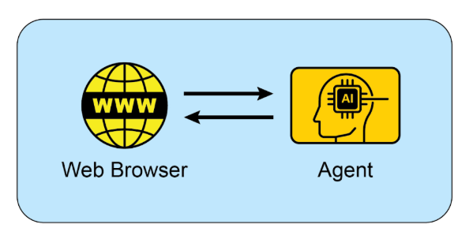

# 附錄 B - 人工智慧 代理互動：從 GUI 到現實世界環境

人工智慧代理越來越多地透過與數位介面和實體世界互動來執行複雜的任務。它們在這些不同環境中感知、處理和行動的能力正在從根本上改變自動化、人機互動和智慧系統。本附錄探討了代理如何與電腦及其環境交互，重點介紹了進展和專案。

## 互動：代理與計算機

人工智慧從對話夥伴到主動的、面向任務的代理的演變是由代理電腦介面（ACI）驅動的。這些介面允許人工智慧直接與電腦的圖形使用者介面（GUI）交互，使其能夠像人類一樣感知和操作圖標和按鈕等視覺元素。這種新方法超越了依賴 API 和系統呼叫的僵化的、依賴開發人員的傳統自動化腳本。透過使用軟體的視覺“前門”，人工智慧現在可以以更靈活和更強大的方式自動執行複雜的數位任務，該過程涉及幾個關鍵階段：

* **視覺感知：** 代理首先捕捉螢幕的視覺表示，本質上是截取螢幕截圖。

* **GUI 元素辨識：** 然後分析該影像以區分各種 GUI 元素。它必須學會將螢幕“視為”，而不是僅僅將其視為像素的集合，而是將其視為具有互動組件的結構化佈局，從靜態橫幅圖像中辨別出可點擊的“提交”按鈕，或從簡單的標籤中辨別出可編輯的文字欄位。

* **上下文解釋：** ACI 模組充當視覺資料和代理核心智慧（通常是大型語言模型或 大型語言模型）之間的橋樑，在任務上下文中解釋這些元素。它知道放大鏡圖示通常意味著“搜尋”，或一系列單選按鈕代表一個選擇。該模組對於增強大型語言模型的推理能力至關重要，使其能夠根據視覺證據制定計劃。

* **動態操作和回應：** 然後，代理以程式控制滑鼠和鍵盤來執行其計劃 - 按一下、鍵入、捲動和拖曳。至關重要的是，它必須不斷監視螢幕的視覺回饋，動態回應變更、載入畫面、彈出通知或錯誤，才能成功導航多步驟工作流程。

這項技術不再是理論上的。幾個領先的人工智慧實驗室已經開發了功能代理，展示了 GUI 互動的強大功能：

**ChatGPT Operator (OpenAI)：** ChatGPT Operator 被設想為數位合作夥伴，旨在直接從桌面自動執行各種應用程式的任務。它理解螢幕上的元素，使其能夠執行一些操作，例如將資料從電子表格傳輸到客戶關係管理 (CRM) 平台、在航空公司和飯店網站上預訂複雜的旅行行程，或填寫詳細的線上表格，而無需為每項服務存取專門的 API。這使其成為一種通用的工具，旨在透過接管重複的數位雜務來提高個人和企業的生產力。

**Google Project Mariner：** 作為一個研究原型，Project Mariner 在 Chrome 瀏覽器中作為代理運行（見圖 1）。其目的是了解使用者的意圖並代表他們自主執行基於網路的任務。例如，用戶可以要求它在特定預算和社區內找到三套出租公寓；然後，Mariner 將導航到房地產網站，應用過濾器，瀏覽列表，並將相關資訊提取到文件中。該專案代表了谷歌對創建真正有用且「主動」的網路體驗的探索，其中瀏覽器主動為用戶工作。

圖 1：代理 與 Web 瀏覽器之間的交互

**Anthropic 的電腦使用：** 此功能使 Anthropic 的 人工智慧 模型 Claude 能夠成為電腦桌面環境的直接使用者。透過擷取螢幕截圖來感知螢幕並以程式方式控制滑鼠和鍵盤，Claude 可以編排跨多個未連接的應用程式的工作流程。使用者可以要求它分析 PDF 報告中的數據，打開電子表格應用程式以對該數據執行計算，生成圖表，然後將該圖表貼到電子郵件草稿中——這一系列任務以前需要不斷的人工輸入。

**瀏覽器使用**：這是一個開源程式庫，為編程式瀏覽器自動化提供進階 API。它透過授予 人工智慧 代理存取和控製文件物件模型 (DOM) 的權限，使 人工智慧 代理能夠與網頁互動。 API 將瀏覽器控制協定中複雜的低階命令抽象化為一組更簡化和直覺的函數。這允許代理執行複雜的操作序列，包括從巢狀元素中提取資料、表單提交以及跨多個頁面的自動導航。因此，該庫有助於將非結構化網路資料轉換為人工智慧代理可以系統地處理和利用以進行分析或決策的結構化格式。

## 互動：主體與環境

超越電腦螢幕的限制，人工智慧代理越來越多地被設計為與複雜、動態的環境進行交互，通常反映現實世界。這需要複雜的感知、推理和執行能力。

Google 的 **Project Astra** 是突破代理與環境互動界限的舉措的典型例子。 Astra 旨在創建一個對日常生活有幫助的通用人工智慧代理，利用多模式輸入（視覺、聲音、語音）和輸出來理解世界並與世界互動。該專案專注於快速理解、推理和響應，讓代理透過相機和麥克風「看到」和「聽到」周圍的環境，並進行自然的對話，同時提供即時幫助。 Astra 的願景是一種代理，可以透過了解其觀察到的環境，無縫地幫助使用者完成從尋找遺失的物品到調試程式碼等任務。這超越了簡單的語音指令，真正體現了對使用者直接物理環境的理解。

Google 的 **Gemini Live** 將標準的人工智慧互動轉變為流暢、動態的對話。用戶可以與人工智慧對話，並以最小的延遲以自然的聲音接收回應，甚至可以在句子中打斷或改變話題，促使人工智慧立即適應。該介面不僅限於語音，還允許用戶透過使用手機相機、共享螢幕或上傳檔案來合併視覺訊息，以進行更具上下文感知的討論。更高級的版本甚至可以感知使用者的語氣並聰明地過濾掉不相關的背景噪音，以便更好地理解對話。這些功能結合起來可以創建豐富的交互，例如只需將相機對準某項任務即可接收即時指令。

OpenAI 的**GPT-4o 模型**是專為「全方位」互動而設計的替代方案，這意味著它可以跨語音、視覺和文字進行推理。它以低延遲處理這些輸入，反映了人類的反應時間，從而允許即時對話。例如，用戶可以向人工智慧展示即時視頻，詢問正在發生的事情，或將其用於語言翻譯。 OpenAI 為開發人員提供「即時 API」來建立需要低延遲語音互動的應用程式。

OpenAI 的 **ChatGPT 代理** 代表了其前身的重大架構進步，具有新功能的整合框架。其設計融合了幾個關鍵的功能模式：即時資料擷取的即時互聯網自主導航能力、為資料分析等任務動態生成和執行計算程式碼的能力，以及直接與第三方軟體應用程式互動的功能。這些功能的綜合允許代理根據單一使用者指令來編排和完成複雜的、連續的工作流程。因此，它可以自主管理整個流程，例如執行市場分析並產生相應的演示文稿，或規劃物流安排並執行必要的交易。在發布的同時，OpenAI 也主動解決了此類系統固有的緊急安全問題。隨附的「系統卡」描述了與能夠在線上執行操作的人工智慧相關的潛在操作危險，並承認新的濫用向量。為了減輕這些風險，代理的架構包括精心設計的保護措施，例如要求對某些類別的操作進行明確的使用者授權以及部署強大的內容過濾機制。該公司目前正在與最初的用戶群合作，透過反饋驅動的迭代過程進一步完善這些安全協議。

**Seeing 人工智慧** 是 Microsoft 的一款免費行動應用程序，透過提供周圍環境的即時敘述，為盲人或弱視人士提供協助。該應用程式透過設備的攝影機利用人工智慧來識別和描述各種元素，包括物體、文本，甚至人。其核心功能包括閱讀文件、識別貨幣、透過條碼識別產品以及描述場景和顏色。透過增強對視覺資訊的訪問，Seeing 人工智慧 最終為視障用戶提供了更大的獨立性。

**Anthropic 的 Claude 4 系列** Anthropic 的 Claude 4 是另一種具有高級推理和分析功能的替代方案。儘管 Claude 4 歷來專注於文本，但它具有強大的視覺功能，使其能夠處理來自圖像、圖表和文件的資訊。該模型適合處理複雜的多步驟任務並提供詳細分析。雖然與其他模型相比，即時對話方面不是其主要關注點，但其底層智慧旨在建立高性能的人工智慧代理。

## Vibe coding：利用 人工智慧 進行直覺開發

除了與 GUI 和物理世界的直接互動之外，開發人員如何使用 人工智慧 建立軟體的新範式正在出現：「Vibe coding」。這種方法不再是精確的、逐步的指令，而是依賴開發人員和人工智慧程式設計助理之間更直觀、對話式和迭代的互動。開發人員提供一個高階目標、所需的「氛圍」或整體方向，人工智慧會產生匹配的程式碼。

這個過程的特徵是：

* **對話提示：** 開發人員可能會說，“為新應用程式創建一個簡單、現代的登陸頁面”，或者“重構此函數以使其更加 Pythonic 和可讀性”，而不是編寫詳細的規範。 人工智慧 解釋「現代」或「Pythonic」的「氛圍」並產生對應的程式碼。

* **迭代細化：** 人工智慧 的初始輸出通常是一個起點。然後，開發人員以自然語言提供回饋，例如「這是一個好的開始，但是您可以將按鈕設為藍色嗎？」或者，「添加一些錯誤處理。」這種來回持續，直到程式碼滿足開發人員的期望。

* **創意合作夥伴：** 在Vibe coding 中，人工智慧充當創意合作夥伴，提出開發人員可能沒有考慮過的想法和解決方案。這可以加速開發進程並帶來更多創新成果。

* **專注於「什麼」而不是「如何」：** 開發人員專注於期望的結果（「什麼」），並將實作細節（「如何」）留給人工智慧。這允許快速原型設計和探索不同的方法，而不會陷入樣板程式碼。

* **可選記憶體庫：** 為了在較長的互動過程中保持上下文，開發人員可以使用「記憶體庫」來儲存關鍵資訊、偏好或約束。例如，開發人員可以將特定的程式風格或一組專案要求儲存到人工智慧的記憶體中，確保未來的程式碼產生與既定的「氛圍」保持一致，而無需重複指令。

隨著 GPT-4、Claude 和 Gemini 等整合到開發環境中的強大 人工智慧 模型的興起，Vibe coding 變得越來越流行。這些工具不僅僅是自動完成程式碼；他們積極參與軟體開發的創造性過程，使軟體開發變得更加容易和高效。這種新的工作方式正在改變軟體工程的本質，強調創造力和高層次思維，而不是死記硬背語法和 API。

## 要點

* 人工智慧代理正在從簡單的自動化發展到透過圖形使用者介面進行視覺化控制軟體，就像人類一樣。

* 下一個前沿是現實世界的交互，像谷歌的 Astra 這樣的計畫使用攝影機和麥克風來看到、聽到和理解他們的物理環境。

* 領先的科技公司正在融合這些數位和實體功能，以創建跨兩個領域無縫運行的通用人工智慧助理。

* 這項轉變正在創造一種新的動態、情境感知的人工智慧伴侶，能夠協助使用者完成日常生活中的各種任務。

## 結論

代理正在經歷重大轉變，從基本的自動化轉向與數位和實體環境的複雜互動。透過利用視覺感知來操作圖形使用者介面，這些代理現在可以像人類一樣操作軟體，從而繞過對傳統 API 的需求。主要技術實驗室正在開拓這一領域，其代理能夠直接在用戶桌面上自動執行複雜的多應用程式工作流程。與此同時，下一個前沿正在擴展到物理世界，谷歌的 Project Astra 等計劃使用攝影機和麥克風與周圍環境互動。這些先進的系統專為反映人類互動的多模式即時理解而設計。

最終願景是融合這些數位和實體功能，創建可在所有使用者環境中無縫運行的通用人工智慧助理。這種演變也透過「Vibe coding」重塑軟體創建本身，「Vibe coding」是開發人員和人工智慧之間更直觀、更具對話性的合作夥伴關係。這種新方法優先考慮高階目標和創意意圖，使開發人員能夠專注於期望的結果而不是實現細節。這種轉變透過將人工智慧視為創意合作夥伴來加速發展並促進創新。最終，這些進步為主動、情境感知的人工智慧伴侶的新時代鋪平了道路，這些人工智慧伴侶能夠協助我們完成日常生活中的大量任務。

## 參考

1. 開放 AI 運算子，[https://openai.com/index/introducing-operator/](https://openai.com/index/introducing-operator/)

2. 開啟 人工智慧 ChatGPT 代理：[https://openai.com/index/introducing-chatgpt-代理/](https://openai.com/index/introducing-chatgpt-agent/)

3. 瀏覽器使用：[https://docs.browser-use.com/introduction](https://docs.browser-use.com/introduction)

4. 水手計劃，[https://deepmind.google/models/project-mariner/](https://deepmind.google/models/project-mariner/)

5. 人腦電腦使用：[https://docs.anthropic.com/en/docs/build-with-claude/computer-use](https://docs.anthropic.com/en/docs/build-with-claude/computer-use)

6. 阿斯特拉項目，[https://deepmind.google/models/project-astra/](https://deepmind.google/models/project-astra/)

7. Gemini 直播，[https://gemini.google/overview/gemini-live/?hl=en](https://gemini.google/overview/gemini-live/?hl=en)

8. OpenAI 的 GPT-4，[https://openai.com/index/gpt-4-research/](https://openai.com/index/gpt-4-research/)

9. Claude 4，[https://www.anthropic.com/news/claude-4](https://www.anthropic.com/news/claude-4)