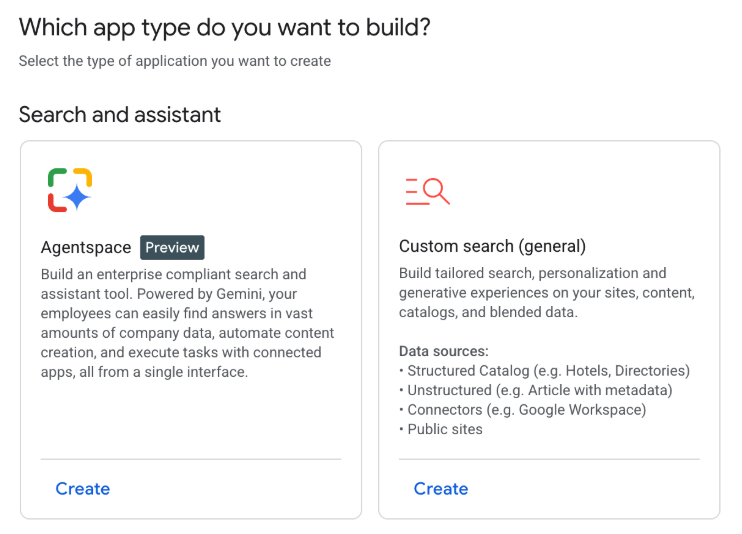
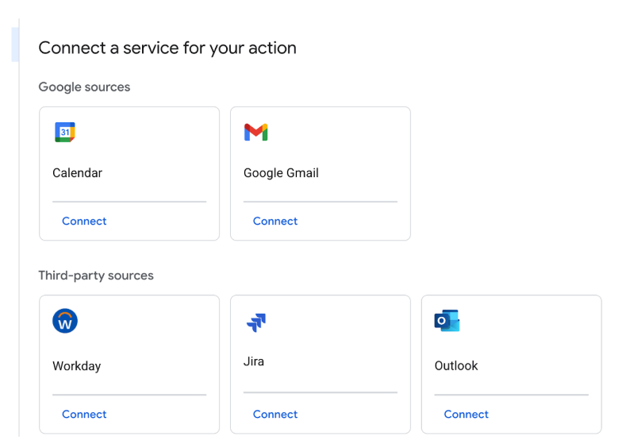
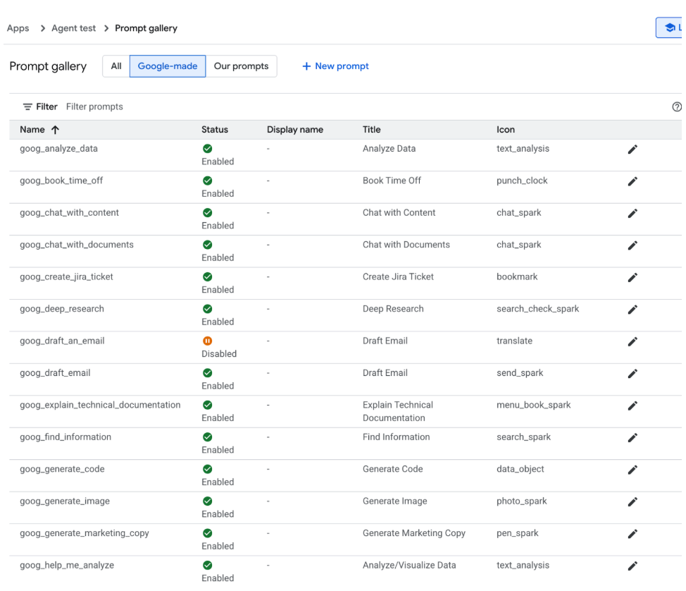
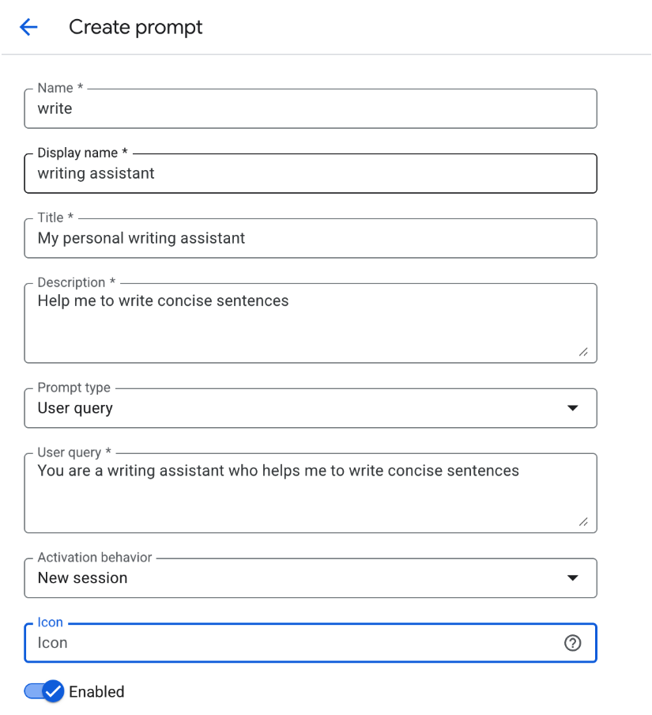
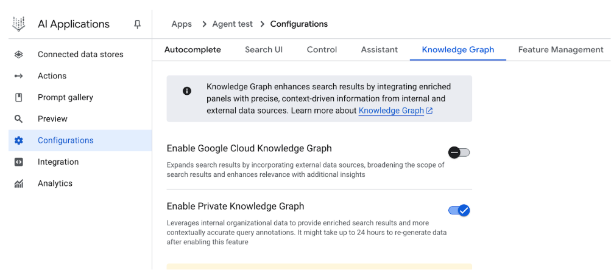
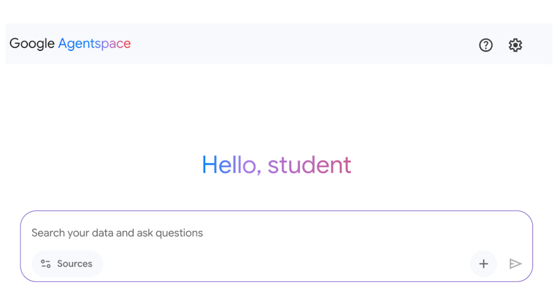

# 附錄 D - 使用 AgentSpace 建構代理

## 概述

AgentSpace 是一個旨在透過將人工智慧整合到日常工作流程中來促進「代理驅動的企業」的平台。它的核心是在組織的整個數位足跡（包括文件、電子郵件和資料庫）中提供統一的搜尋功能。該系統利用先進的人工智慧模型（例如Google的 Gemini）來理解和綜合來自這些不同來源的資訊。

該平台支援創建和部署專門的人工智慧“代理”，這些“代理”可以執行複雜的任務並自動化流程。這些代理不僅僅是聊天機器人，而是聊天機器人。他們可以自主推理、規劃和執行多步驟行動。例如，代理可以研究某個主題、撰寫帶有引文的報告，甚至產生音訊摘要。

為了實現這一目標，AgentSpace 建構了一個企業知識圖譜，以繪製人員、文件和資料之間的關係。這使得人工智慧能夠理解上下文並提供更相關和個性化的結果。該平台還包括一個名為 代理 Designer 的無程式碼介面，用於創建自訂代理，而無需深厚的技術專業知識。

此外，AgentSpace 支援多代理系統，其中不同的 人工智慧 代理可以透過稱為 Agent2Agent (A2A) 協定的開放協定進行通訊和協作。這種互通性允許更複雜和精心安排的工作流程。安全性是一個基礎元件，具有基於角色的存取控制和資料加密等功能來保護敏感的企業資訊。最終，AgentSpace 的目標是透過將智慧、自主系統直接嵌入組織的營運結構中來提高生產力和決策能力。

## 如何使用 AgentSpace UI 建置 代理

圖 1 說明如何透過從 Google Cloud Console 中選擇 人工智慧 應用程式來存取 AgentSpace。

圖1：如何使用Google Cloud Console存取AgentSpace

您的代理可以連接到各種服務，包括日曆、Google Mail、Workaday、Jira、Outlook 和 Service Now（見圖 2）。

圖 2：與各種服務集成，包括 Google 和第三方平台。

然後，代理可以使用自己的提示，該提示是從 Google 提供的預製提示庫中選擇的，如圖 3\ 所示。

圖 3：Google 的預組裝提示庫

或者，您可以建立自己的提示，如圖 4 所示，然後您的代理將使用該提示

圖4：自訂代理提示

AgentSpace 提供了許多高級功能，例如與資料儲存整合以儲存您自己的資料、與 Google Knowledge Graph 或您的私人知識圖整合、用於將您的代理公開到 Web 的 Web 介面以及用於監控使用情況的分析等等（請參閱圖 5\）

圖 5：AgentSpace 進階功能

完成後，即可存取 AgentSpace 聊天介面（圖 6\）。

圖 6：用於啟動與代理聊天的 AgentSpace 使用者介面。

## 結論

總之，AgentSpace 提供了一個功能框架，用於在組織現有的數位基礎設施中開發和部署 人工智慧 代理。該系統的架構將複雜的後端流程（例如自主推理和企業知識圖映射）連結到用於代理構建的圖形使用者介面。透過此介面，使用者可以透過整合各種資料服務並透過提示定義其操作參數來配置代理，從而形成客製化的上下文感知自動化系統。

這種方法抽象化了底層技術的複雜性，無需深厚的程式設計專業知識即可建立專門的多代理系統。主要目標是將自動化分析和操作功能直接嵌入到工作流程中，從而提高流程效率並增強資料驅動的分析。對於實踐指導，可以使用實踐學習模組，例如 Google Cloud Skills Boost 上的「使用 Agentspace 建立 Gen 人工智慧 代理」實驗室，該實驗室為技能獲取提供了結構化環境。

## 參考

1. 使用 代理 Designer 建立無程式碼代理，[https://cloud.google.com/agentspace/agentspace-enterprise/docs/代理-designer](https://cloud.google.com/agentspace/agentspace-enterprise/docs/agent-designer)

2. Google Cloud Skills Boost，[https://www.cloudskillsboost.google/](https://www.cloudskillsboost.google/)