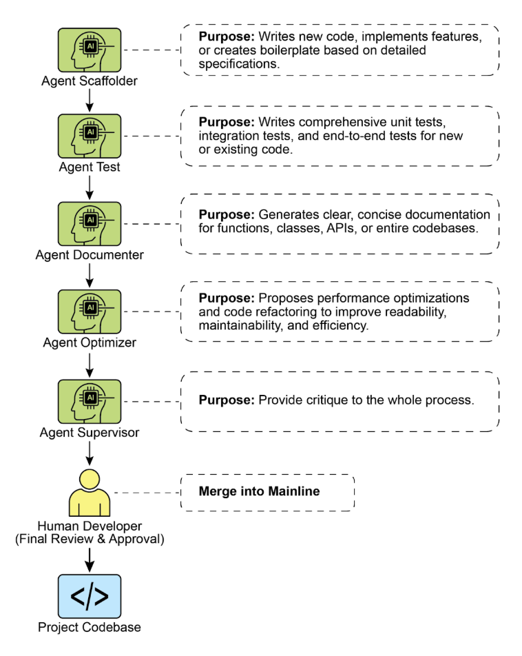

# 附錄 G - Coding Agent

## Vibe coding：起點

「Vibe coding」已成為快速創新和創造性探索的強大技術。這種做法涉及使用大型語言模型生成初始草案、概述複雜的邏輯或建立快速原型，從而顯著減少初始摩擦。它對於克服「空白頁」問題具有無價的價值，使開發人員能夠快速從模糊的概念過渡到有形的、可運行的程式碼。在探索不熟悉的 API 或測試新穎的架構模式時，Vibe coding 特別有效，因為它繞過了完美實現的直接需求。生成的程式碼通常充當創意催化劑，為開發人員進行批評、重構和擴展提供基礎。它的主要優勢在於能夠加速軟體生命週期的初始發現和構思階段。然而，雖然 Vibe coding 擅長腦力激盪，但開發健壯、可擴展且可維護的軟體需要更結構化的方法，從純粹的生成轉變為與專業Coding Agent的協作夥伴關係。

## 代理作為團隊成員

雖然最初的浪潮側重於原始程式碼生成（非常適合構思的「氛圍代碼」），但該行業現在正在轉向更加整合和強大的生產工作範式。最有效的開發團隊不僅僅是將任務委派給 代理；而是將任務委託給 代理。他們正在用一套複雜的Coding Agent來增強自己。這些代理充當不知疲倦的專業團隊成員，放大人類的創造力並顯著提高團隊的可擴展性和速度。

這種演變反映在行業領導者的聲明中。 2025 年初，Alphabet 執行長 Sundar Pichai 指出，在 Google，**「***現在超過 30% 的新程式碼是由我們的 Gemini模型輔助或生成的，從根本上改變了我們的開發速度。

本章提出了一個組織人類代理團隊的框架，其核心理念是人類開發人員充當創意領導者和架構師，而人工智慧代理則充當力量倍增器。此框架基於三個基本原則：

1. **以人為主導的編排：** 開發人員是團隊領導和專案架構師。他們始終參與循環，編排工作流程，設定高階目標並做出最終決策。代理很強大，但他們是支持性的合作者。開發人員指導哪個代理參與，提供必要的背景，最重要的是，對代理產生的任何輸出進行最終判斷，確保其符合專案的品質標準和長期願景。

2. **上下文的首要性：** 代理的效能完全取決於其上下文的品質和完整性。背景不佳的強大大型語言模型毫無用處。因此，我們的框架優先考慮採用細緻的、以人為主導的情境管理方法。避免了自動化的黑盒子上下文檢索。開發人員負責為其代理團隊成員準備完美的「簡報」。這包括：

* **完整的程式碼庫：** 提供所有相關的原始程式碼，以便代理了解現有的模式和邏輯。

* **外部知識：** 提供特定文件、API 定義或設計文件。

* **人類簡介：** 闡明明確的目標、要求、拉取請求描述和風格指南。

3. **直接模型存取：** 為了實現最先進的結果，代理必須透過直接存取前沿模型（例如 Gemini 2.5 PRO、Claude Opus 4、OpenAI、DeepSeek 等）來提供支援。使用功能較弱的模型或透過模糊或截斷上下文的中間平台路由請求會降低效能。該框架建立在人類領導和底層模型的原始功能之間創建盡可能純粹的對話的基礎上，確保每個代理都發揮其最大潛力。

該框架由一組專門的代理組成，每個代理都針對開發生命週期中的核心功能而設計。人類開發人員充當中央協調者，委派任務並整合結果。

## 核心元件

為了有效地利用前沿大型語言模型，該框架為專業代理團隊分配了不同的開發角色。這些代理不是單獨的應用程序，而是透過精心設計的、特定於角色的提示和上下文在大型語言模型中調用的概念角色。這種方法確保模型的巨大功能精確地集中於手頭上的任務，從編寫初始程式碼到執行細緻的批判性審查。

**協調者：人類開發者：** 在這個協作框架中，人類開發者扮演協調者，充當人工智慧代理的中央情報局和最終權威。

* **角色：** 團隊領導、架構師與最終決策者。協調器定義任務、準備上下文並驗證代理完成的所有工作。

* **介面：** 開發人員自己的終端、編輯器和所選代理的本機 Web UI。

**上下文暫存區域：** 作為任何成功的代理互動的基礎，上下文暫存區域是開發人員精心準備完整且特定於任務的簡報的地方。

* **角色：** 每項任務都有專用的工作空間，確保客服人員收到完整、準確的簡報。

* **實作：** 一個臨時目錄（task-context/），包含目標的 markdown 文件、程式碼檔案和相關文件

**專家代理：** 透過使用有針對性的提示，我們可以建立一個專家代理團隊，每個專家代理都針對特定的開發任務量身定制。

* **鷹架代理：實施者**

* **目的：** 編寫新程式碼、實作功能或根據詳細規格建立樣板。  
    * **呼叫提示：** “您是高級軟體工程師，根據01_BRIEF.md中的需求和02_CODE/中現有的模式，實現該功能...*”

* **測試工程師代理：品質衛士**
    * **目的：** 為新的或現有的程式碼編寫全面的單元測試、整合測試和端到端測試。  
    * **呼叫提示：** “您是品質保證工程師。對於02_CODE/中提供的程式碼，使用[測試框架，例如pytest]編寫全套單元測試。涵蓋所有邊緣情況並遵守專案的測試理念。”

* **記錄代理：抄寫員**
    * **目的：** 為函數、類別、API 或整個程式碼庫產生清晰、簡潔的文件。  
    * **呼叫提示：**“您是技術作家。為提供的程式碼中定義的 API 端點產生 markdown 文件。包括請求/回應範例並解釋每個參數。”

* **優化器代理：重構夥伴**
    * **目的：** 提出效能最佳化和程式碼重構，以提高可讀性、可維護性和效率。  
    * **呼叫提示：**“分析所提供的程式碼，找出性能瓶頸或可以重構的區域，以確保清晰。提出具體的更改，並解釋為什麼它們是改進。”

* **流程代理：程式碼主管**
    * **批評：** 代理執行初始傳遞，識別潛在的錯誤、風格違規和邏輯缺陷，就像靜態分析工具一樣。  
    * **反思：** 然後代理分析自己的批評。它綜合了調查結果，優先考慮最關鍵的問題，駁回迂腐或低影響的建議，並為人類開發人員提供高層次、可操作的摘要。  
    * **呼叫提示：** “您是首席工程師，正在進行程式碼審查。首先，對變更進行詳細的批評。其次，反思您的批評，以提供最重要回饋的簡明、優先摘要。”

最終，這種以人為主導的模型在開發人員的戰略方向和代理的戰術執行之間創造了強大的協同作用。因此，開發人員可以超越日常任務，將他們的專業知識集中在可帶來最大價值的創意和架構挑戰上。

## 實際實施

### 設定清單

為了有效實施人工代理團隊框架，建議採用以下設置，重點在於保持控制的同時提高效率。

1. **提供對前沿模型的存取** 為至少兩個領先的大型語言模型（例如 Gemini 2.5 Pro 和 Claude 4 Opus）提供安全 API 金鑰。這種雙提供者方法可以進行比較分析並避免單一平台的限製或停機。這些憑證應該像管理任何其他生產機密一樣進行安全管理。

2. **實作本機上下文編排器** 使用輕量級 CLI 工具或本機代理執行程式來管理上下文，而不是臨時腳本。這些工具應該允許您在專案根目錄中定義一個簡單的設定檔（例如 context.toml），該檔案指定將哪些檔案、目錄甚至 URL 編譯成 大型語言模型 提示字元的單一有效負載。這可確保您對模型在每個請求上看到的內容保持完全、透明的控制。

3. **建立版本控制的提示庫** 在專案的 Git 儲存庫中建立專用的 /prompts 目錄。在其中，將每個專家代理的呼叫提示（例如，reviewer.md、documenter.md、tester.md）儲存為 Markdown 檔案。將您的提示視為程式碼可以讓整個團隊隨著時間的推移對向 人工智慧 代理髮出的指令進行協作、完善和版本化。

4. **將代理工作流程與 Git Hooks 整合** 使用本機 Git Hooks 自動化您的審閱節奏。例如，可以將預提交掛鉤配置為在分階段變更時自動觸發 Reviewer 代理。代理的批評和反思摘要可以直接在您的終端中呈現，在您最終完成提交之前提供即時回饋，並將品質保證步驟直接融入您的開發過程中。

圖 1：程式設計專家範例

### 領導增強團隊的原則

成功領導這個框架需要從唯一的貢獻者發展成為人類人工智慧團隊的領導者，並遵循以下原則：

* **維護架構所有權** 您的角色是設定策略方向並擁有高層架構。您可以定義“什麼”和“為什麼”，並使用代理團隊來加速“如何”。您是設計的最終**仲裁者**，確保每個組件都符合專案的長期願景和品質標準。

* **掌握摘要的藝術** 代理輸出的品質直接反映了其輸入的品質。透過為每項任務提供清晰、明確和全面的背景來掌握摘要的藝術。不要將您的提示視為簡單的命令，而是為新的、能力很強的團隊成員提供完整的簡報包。

* **充當終極品質閘** 代理的輸出始終是建議，而不是命令。將審閱代理的回饋視為強大的訊號，但您是最終的品質閘。應用您的領域專業知識和特定於專案的知識來驗證、質疑和批准所有更改，充當程式碼庫完整性的最終守護者。

* **參與迭代對話** 最好的結果來自對話，而不是獨白。如果代理的初始輸出不完美，不要丟棄它 - 改進它。提供糾正回饋，添加澄清上下文，並提示再次嘗試。這種迭代對話至關重要，尤其是與審閱代理進行對話，其「反思」輸出旨在成為協作討論的開始，而不僅僅是最終報告。

## 結論

程式碼開發的未來已經到來，而且還在不斷增強。孤獨程式設計師的時代已經讓位給一種新的範式，開發人員領導專門的人工智慧代理團隊。這種模式並沒有削弱人類的作用；反而減少了人類的作用。它透過自動化日常任務、擴大個人影響力以及實現以前難以想像的發展速度來提升它。

透過將戰術執行工作交給代理，開發人員現在可以將他們的認知精力投入到真正重要的事情上：戰略創新、彈性架構設計以及構建令用戶滿意的產品所需的創造性問題解決。基本關係被重新定義；它不再是人類與機器的較量，而是人類的聰明才智與人工智慧之間的合作夥伴關係，作為一個無縫整合的團隊進行工作。

## 參考

1. 人工智慧 負責產生 Google 30% 以上的程式碼 [https://www.reddit.com/r/singularity/comments/1k7rxo0/ai_is_now_writing_well_over_30_of_the_code_at/](https://www.reddit.com/r/singularity/comments/1k7rxo0/ai_is_now_writing_well_over_30_of_the_code_at/)

2. 人工智慧 負責產生 Microsoft 30% 以上的程式碼 [https://www.businesstoday.in/tech-today/news/story/30-of-microsofts-code-is-now-ai- generated-says-ceo-satya-nadella-474167-2025-04-30](__K2_URL_2025-04-30](__212)__