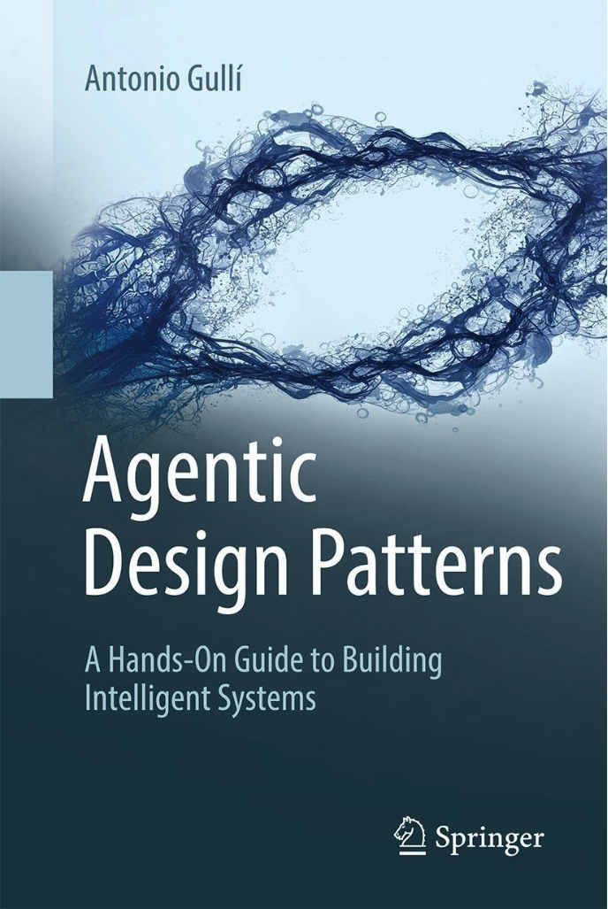

# 代理設計模式

該儲存庫包含 Antonio Gulli 和 Mauro Sauco 所著的《代理設計模式》一書的全文。該內容由 Tom Mathews 編譯和組織，以便社群輕鬆存取和參考。

## 作者與致謝

- **作者：** [安東尼奧古利](https://www.linkedin.com/in/searchguy/) 和 [莫羅·紹科](https://www.linkedin.com/in/maurosauco/)
- **編譯者：** [湯姆馬修斯](https://www.linkedin.com/in/mathews-tom/)

### 這本書的獨特之處是什麼？

這本 424 頁的指南解決了我們在建立智慧、自主 AI 系統時面臨的真正挑戰。它彌合了理論與實施之間的差距——這正是我們的領域目前所需要的。對於任何認真建立真正的人工智慧系統的人來說，這是最好的資源。如果您是工程師、研究員或產品經理，準備超越基本的大型語言模型（LLM）應用程式並建立真正強大的人工智慧代理，那麼這就是為您準備的。

本書涵蓋了基本的代理模式，包括提示鏈、路由、規劃和多代理系統，所有這些都帶有基於程式碼的實用範例。您將找到有關工具使用、記憶體管理和 檢索增強生成（RAG） 實現的全面介紹，以及推理技術和代理間通訊等高級主題。

在裡面你會發現：

- **真實程式碼範例：** 不只是理論，還有有效的實作。
- **經過驗證的模式：** 記憶體處理、例外處理、資源控制、安全護欄。
- **先進技術：** 多代理編排、代理間訊息傳遞、人機互動。
- **有關 MCP（模型上下文協定）的完整章節：** 將工具與代理整合的關鍵框架。

它涵蓋 4 個部分的 21 個核心模式：

1. 基礎模式（提示鏈、路由、工具使用）
2. 先進系統（記憶、學習、監控）
3. 生產問題（錯誤處理、安全、評估）
4. 多代理架構

大多數人工智慧內容都停留在「如何呼叫 API」。但在現實世界的系統中你需要問：

- 如果代理在任務中陷入困境怎麼辦？
- 如何在長時間的會話中保持記憶？
- 當您執行 10 多個代理時，如何防止混亂？

本書透過您可以實際應用的模式回答了所有這些問題。僅 70 多頁的附錄就值得投資，其中包含高級提示技術和代理框架概述。

## 目錄

### 簡介

- [致敬](00-Introduction/01-Dedication-1cQ61mNpiWn6eSORmWjEjF44vN2Lpba8kyKmNwIC60ig.md)
- [致謝](00-Introduction/02-Acknowledgment-1u2y6tY48bw8nriDUuwWEf9s8g66vyIqBKSKZDOS-n0s.md)
- [序言](00-Introduction/03-Foreword-18Q9kfZuCTL37ztrSjLxwf8Elr5UfAiAavmnj0IqSpbU.md)
- [思想領袖的觀點：權力與責任](00-Introduction/04-A_Thought_Leaders_Perspective_Power_and_Responsibility-1PWhaXD_UNKgJaxYe3JBxRFRt3_B8Wm67CFxtSBQ4LkU.md)
- [簡介](00-Introduction/05-Introduction-1K5jwqB6jh20uHL0TTWxqWOxFk-dzFxRvHzrRRV79hrg.md)
- [什麼讓 AI 系統成為代理？](00-Introduction/06-What_makes_an_AI_system_an_Agent-1Nw6hRa7ItdLr_Tj5hF2q-OH8B_uPKb--RLn8SXZKA94.md)

### 第一部分：基礎模式

- [第 1 章：提示鏈](01-Part_One/Chapter_1-Prompt_Chaining-1flxKGrbnF2g8yh3F-oVD5Xx7ZumId56HbFpIiPdkqLI.md)
- [第 2 章：路由](01-Part_One/Chapter_2-Routing-1ux_n8n3T4bYndOjs1DKW5ccpC802KISdy2IWnlvYbas.md)
- [第 3 章：平行化](01-Part_One/Chapter_3-Parallelization-1XVMp4RcRkoUJTVbrP2foWZX703CUJpWkrhyFU2cfUOA.md)
- [第 4 章：反思](01-Part_One/Chapter_4-Reflection-1HXXJOQIMWowtLw4WMiSR360caDAlZPtl5dPPgvq9IT4.md)
- [第 5 章：工具調用(函式呼叫)](01-Part_One/Chapter_5-Tool_Use-1bE4iMljhppqGY1p48gQWtZvk6MfRuJRCiba1yRykGNE.md)
- [第 6 章：規劃](01-Part_One/Chapter_6-Planning-18vvNESEwHnVUREzIipuaDNCnNAREGqEfy9MQYC9wb4o.md)
- [第 7 章：多代理協作](01-Part_One/Chapter_7-Multi-Agent_Collaboration-1RZ5-2fykDQKOBx01pwfKkDe0GCs5ydca7xW9Q4wqS_M.md)

### 第二部分：進階系統

- [第 8 章：記憶體管理](02-Part_Two/Chapter_8-Memory_Management-1asVTObtzIye0I9ypAztaeeI_sr_Hx2TORE02uUuqH_c.md)
- [第 9 章：學習與適應](02-Part_Two/Chapter_9-Learning_and_Adaptation-1UHTEDCmSM1nwB-iyMoHuYzVcu_B_4KkJ2ITGGUKqo8s.md)
- [第 10 章：模型上下文協定（MCP）](02-Part_Two/Chapter_10-Model_Context_Protocol_MCP-1e6XimYczKmhX9zpqEyxLFWPQgGuG0brp7Hic2sFl_qw.md)
- [第 11 章：目標設定與監控](02-Part_Two/Chapter_11-Goal_Setting_and_Monitoring-10ndlCB39BWjyFRWKpcoKib4vuPD1ojD-x0-ynMaf5uw.md)

### 第三部分：生產環境考量

- [第 12 章：例外處理和恢復](03-Part_Three/Chapter_12-Exception_Handling_and_Recovery-1C07AuMur6-infwE0viCp4QtAy_wWI-uceFm6MaYHQGk.md)
- [第 13 章：人類在回圈中](03-Part_Three/Chapter_13-Human_in_the_Loop-1ImOZcw6yeb7a-uRBMNP1VdovYfyip4IdsAcLu9yue-0.md)
- [第 14 章：知識檢索（RAG）](03-Part_Three/Chapter_14-Knowledge_Retrieval_RAG-1v96Oobio6xDOqbK8ejsXjmOc4Dp2uoLMo5_gfJgi-NE.md)

### 第四部分：多代理架構

- [第 15 章：代理間通訊（A2A）](04-Part_Four/Chapter_15-Inter_Agent_Communication_A2A-1H6HmUYcy5kugt5gt7Kh2Zzb8C62d5pu36RsgMNDCX24.md)
- [第 16 章：資源感知優化](04-Part_Four/Chapter_16-Resource_Aware_Optimization-1nAN58l6JjqEJHk43126uh7xgdEblCpcbsNUHXgtBmJQ.md)
- [第 17 章：推理技巧](04-Part_Four/Chapter_17-Reasoning_Techniques-1Yt1W_hLaC6ZNgJXfT4W6NrCL4TzNVdKOX50kgpHiIq4.md)
- [第 18 章：護欄與安全模式](04-Part_Four/Chapter_18-Guardrails_Safety_Patterns-1Gpc5af_okze1kprRLohP6-81e1KwL6HggjeLvxQyIuk.md)
- [第 19 章：評估與監測](04-Part_Four/Chapter_19-Evaluation_and_Monitoring-1G3zOZM2ZOd0gUp5dy66FUjKMOcALh9l-JpvPxgGMm8w.md)
- [第 20 章：優先順序](04-Part_Four/Chapter_20-Prioritization-1qyXxGM2hNqW_qjXuBFxrEUeoYVO79BoW1ogKu1bfdCY.md)
- [第 21 章：探索與發現](04-Part_Four/Chapter_21-Exploration_and_Discovery-1zeeMVTqjqRIli6G9MMWThhoQhvKqLOjJF2EHHUXLhdk.md)

### 附錄

- [附錄 A：進階提示技巧](05-Appendix/Appendix_A-Advanced_Prompting_Techniques-1V7EKEWibOH6IhHD_PtbFZiml492-2191jDQCcTkhtTI.md)
- [附錄 B：AI 代理互動：從 GUI 到現實世界環境](05-Appendix/Appendix_B-AI_Agentic_Interactions_From_GUI_to_Real_World_Environment-11pma_tCoC7uZ2SFKjcR5KyIq0_ooMGSoadI6f9mxG2I.md)
- [附錄 C：代理框架快速概述](05-Appendix/Appendix_C-Quick_Overview_of_Agentic_Frameworks-151rGsiEYOkXUcNDRus_N8TxxuvjoyTDViBhzt9z0Mfw.md)
- [附錄 D：使用 AgentSpace 建立代理（僅限線上）](05-Appendix/Appendix_D-Building_an_Agent_with_AgentSpace__on_line_only_-1bDRJ8mKtLTeWNC-cGD0Cr8pEJQgJHNcjqz5ekloAjaE.md)
- [附錄 E：CLI 上的 AI 代理](05-Appendix/Appendix_E-AI_Agents_on_the_CLI-1W4znto0a8Ikajw5a4tEyRAaB2nJPJw_iFc4w4qNnjho.md)
- [附錄 F：底層：代理推理引擎的內部觀察](05-Appendix/Appendix_F-Under_the_Hood_An_Inside_Look_at_the_Agents_Reasoning_Engines-14q3fQ-FZmDgiughno_WLSILMWkURvUgR7mlGiFtvwd4.md)
- [附錄 G：Coding Agent](05-Appendix/Appendix_G-Coding_Agents-1tVyhgwrD4fu_D_pHUrwhNxoguRG3tLc1KObXFxrxE_s.md)

## 授權

該儲存庫已依據 [MIT 授權條款](LICENSE) 公開授權。

<!--  -->
