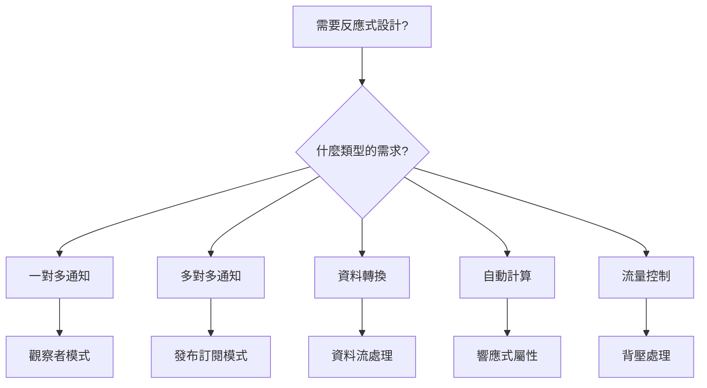

# 反應式設計模式 (Reactive Design Patterns)

## 什麼是反應式編程？

想像你訂閱了 YouTube 頻道，每當頻道發布新影片，你就會自動收到通知。這就是反應式編程的核心概念：**當某件事發生變化時，相關的東西會自動更新**。

## 1. 觀察者模式 (Observer Pattern)

### 概念說明
就像訂閱 YouTube 頻道或追蹤 Instagram，當你關注的對象有更新時，你會自動收到通知。

### 生活化例子：外送訂單追蹤

```python
class 外送訂單:
    def __init__(self, 訂單編號):
        self.訂單編號 = 訂單編號
        self.狀態 = "準備中"
        self.觀察者們 = []  # 所有想收到通知的人
    
    def 加入觀察者(self, 觀察者):
        """讓某人開始追蹤這個訂單"""
        self.觀察者們.append(觀察者)
        print(f"✅ {觀察者.名稱} 開始追蹤訂單 {self.訂單編號}")
    
    def 更新狀態(self, 新狀態):
        """訂單狀態改變時，通知所有人"""
        print(f"\n📦 訂單 {self.訂單編號} 狀態更新: {新狀態}")
        self.狀態 = 新狀態
        
        # 通知所有觀察者
        for 觀察者 in self.觀察者們:
            觀察者.收到通知(self.訂單編號, 新狀態)

class 顧客:
    def __init__(self, 名稱):
        self.名稱 = 名稱
    
    def 收到通知(self, 訂單編號, 狀態):
        print(f"  👤 {self.名稱} 收到通知: 訂單 {訂單編號} - {狀態}")

class 外送員:
    def __init__(self, 名稱):
        self.名稱 = 名稱
    
    def 收到通知(self, 訂單編號, 狀態):
        if 狀態 == "準備完成":
            print(f"  🛵 {self.名稱} 收到通知: 可以取餐了！")

# 使用範例
訂單 = 外送訂單("A001")
小明 = 顧客("小明")
外送員小王 = 外送員("小王")

訂單.加入觀察者(小明)
訂單.加入觀察者(外送員小王)

# 模擬訂單流程
訂單.更新狀態("製作中")
訂單.更新狀態("準備完成")
訂單.更新狀態("配送中")
訂單.更新狀態("已送達")
```

### 輸出結果
```
✅ 小明 開始追蹤訂單 A001
✅ 小王 開始追蹤訂單 A001

📦 訂單 A001 狀態更新: 製作中
  👤 小明 收到通知: 訂單 A001 - 製作中

📦 訂單 A001 狀態更新: 準備完成
  👤 小明 收到通知: 訂單 A001 - 準備完成
  🛵 小王 收到通知: 可以取餐了！

📦 訂單 A001 狀態更新: 配送中
  👤 小明 收到通知: 訂單 A001 - 配送中

📦 訂單 A001 狀態更新: 已送達
  👤 小明 收到通知: 訂單 A001 - 已送達
```

## 2. 發布-訂閱模式 (Pub-Sub Pattern)

### 概念說明
像是公司的公告系統，不同部門可以訂閱不同類型的消息。HR 發布的消息只有訂閱 HR 頻道的人會收到。

### 生活化例子：學校通知系統

```python
class 學校通知中心:
    def __init__(self):
        self.訂閱清單 = {
            "考試通知": [],
            "活動通知": [],
            "放假通知": []
        }
    
    def 訂閱(self, 通知類型, 訂閱者):
        """訂閱特定類型的通知"""
        if 通知類型 in self.訂閱清單:
            self.訂閱清單[通知類型].append(訂閱者)
            print(f"✅ {訂閱者.名字} 訂閱了 {通知類型}")
    
    def 發布通知(self, 通知類型, 內容):
        """發布通知給所有訂閱者"""
        print(f"\n📢 發布 {通知類型}: {內容}")
        
        if 通知類型 in self.訂閱清單:
            for 訂閱者 in self.訂閱清單[通知類型]:
                訂閱者.接收通知(通知類型, 內容)

class 學生:
    def __init__(self, 名字):
        self.名字 = 名字
    
    def 接收通知(self, 類型, 內容):
        print(f"  👨‍🎓 {self.名字} 收到 {類型}: {內容}")

class 家長:
    def __init__(self, 名字):
        self.名字 = 名字
    
    def 接收通知(self, 類型, 內容):
        print(f"  👨‍👩‍👧 {self.名字} 收到 {類型}: {內容}")

# 使用範例
通知中心 = 學校通知中心()

學生小華 = 學生("小華")
學生小美 = 學生("小美")
家長王爸爸 = 家長("王爸爸")

# 不同的人訂閱不同的通知
通知中心.訂閱("考試通知", 學生小華)
通知中心.訂閱("考試通知", 學生小美)
通知中心.訂閱("放假通知", 學生小華)
通知中心.訂閱("放假通知", 學生小美)
通知中心.訂閱("放假通知", 家長王爸爸)
通知中心.訂閱("活動通知", 學生小美)

# 發布不同類型的通知
通知中心.發布通知("考試通知", "下週一數學考試")
通知中心.發布通知("放假通知", "下週五校慶放假一天")
通知中心.發布通知("活動通知", "本週六籃球比賽")
```

### 輸出結果
```
✅ 小華 訂閱了 考試通知
✅ 小美 訂閱了 考試通知
✅ 小華 訂閱了 放假通知
✅ 小美 訂閱了 放假通知
✅ 王爸爸 訂閱了 放假通知
✅ 小美 訂閱了 活動通知

📢 發布 考試通知: 下週一數學考試
  👨‍🎓 小華 收到 考試通知: 下週一數學考試
  👨‍🎓 小美 收到 考試通知: 下週一數學考試

📢 發布 放假通知: 下週五校慶放假一天
  👨‍🎓 小華 收到 放假通知: 下週五校慶放假一天
  👨‍🎓 小美 收到 放假通知: 下週五校慶放假一天
  👨‍👩‍👧 王爸爸 收到 放假通知: 下週五校慶放假一天

📢 發布 活動通知: 本週六籃球比賽
  👨‍🎓 小美 收到 活動通知: 本週六籃球比賽
```

## 3. 資料流處理 (Stream Processing)

### 概念說明
像是工廠的生產線，原料經過一連串的處理步驟，最後變成成品。

### 生活化例子：社群媒體貼文過濾

```python
class 社群媒體貼文流:
    def __init__(self):
        self.處理步驟 = []
    
    def 加入處理步驟(self, 步驟函數):
        """加入一個處理步驟"""
        self.處理步驟.append(步驟函數)
        return self
    
    def 處理貼文(self, 貼文們):
        """依序執行所有處理步驟"""
        結果 = 貼文們
        for 步驟 in self.處理步驟:
            結果 = 步驟(結果)
        return 結果

# 定義處理步驟
def 過濾敏感詞(貼文們):
    """過濾包含敏感詞的貼文"""
    敏感詞 = ["廣告", "假消息"]
    安全貼文 = []
    
    for 貼文 in 貼文們:
        是否包含敏感詞 = any(詞 in 貼文["內容"] for 詞 in 敏感詞)
        if not 是否包含敏感詞:
            安全貼文.append(貼文)
        else:
            print(f"  ❌ 過濾掉: {貼文['內容']}")
    
    return 安全貼文

def 加入表情符號(貼文們):
    """為貼文加入相應的表情符號"""
    for 貼文 in 貼文們:
        if "開心" in 貼文["內容"]:
            貼文["表情"] = "😊"
        elif "生氣" in 貼文["內容"]:
            貼文["表情"] = "😠"
        else:
            貼文["表情"] = "😐"
    return 貼文們

def 計算熱門度(貼文們):
    """根據按讚數計算熱門度"""
    for 貼文 in 貼文們:
        if 貼文["按讚數"] > 100:
            貼文["熱門度"] = "🔥 熱門"
        elif 貼文["按讚數"] > 50:
            貼文["熱門度"] = "👍 不錯"
        else:
            貼文["熱門度"] = "📝 一般"
    return 貼文們

# 使用範例
貼文流處理器 = 社群媒體貼文流()
貼文流處理器.加入處理步驟(過濾敏感詞)\
            .加入處理步驟(加入表情符號)\
            .加入處理步驟(計算熱門度)

# 模擬貼文資料
原始貼文 = [
    {"作者": "小明", "內容": "今天好開心", "按讚數": 120},
    {"作者": "小華", "內容": "這是廣告請購買", "按讚數": 5},
    {"作者": "小美", "內容": "有點生氣", "按讚數": 60},
    {"作者": "小王", "內容": "分享假消息", "按讚數": 200},
    {"作者": "小李", "內容": "平凡的一天", "按讚數": 30}
]

print("🔄 開始處理貼文流...")
處理後貼文 = 貼文流處理器.處理貼文(原始貼文)

print("\n✅ 處理完成的貼文:")
for 貼文 in 處理後貼文:
    print(f"  {貼文['表情']} {貼文['作者']}: {貼文['內容']} | {貼文['熱門度']}")
```

### 輸出結果
```
🔄 開始處理貼文流...
  ❌ 過濾掉: 這是廣告請購買
  ❌ 過濾掉: 分享假消息

✅ 處理完成的貼文:
  😊 小明: 今天好開心 | 🔥 熱門
  😠 小美: 有點生氣 | 👍 不錯
  😐 小李: 平凡的一天 | 📝 一般
```

## 4. 響應式屬性 (Reactive Properties)

### 概念說明
像 Excel 的公式，當你改變某個儲存格的值，所有引用它的公式會自動重新計算。

### 生活化例子：購物車自動計算

```python
class 響應式數值:
    def __init__(self, 初始值=0):
        self._值 = 初始值
        self._依賴我的計算 = []
    
    @property
    def 值(self):
        return self._值
    
    @值.setter
    def 值(self, 新值):
        if self._值 != 新值:
            self._值 = 新值
            print(f"  📝 數值更新: {新值}")
            # 通知所有依賴我的計算要重新計算
            for 計算 in self._依賴我的計算:
                計算()
    
    def 被依賴(self, 計算函數):
        self._依賴我的計算.append(計算函數)

class 購物車:
    def __init__(self):
        # 響應式屬性
        self.商品單價 = 響應式數值(100)
        self.數量 = 響應式數值(1)
        self.折扣百分比 = 響應式數值(0)
        
        # 計算屬性
        self._小計 = 0
        self._折扣金額 = 0
        self._總價 = 0
        
        # 設定依賴關係
        self.商品單價.被依賴(self._更新計算)
        self.數量.被依賴(self._更新計算)
        self.折扣百分比.被依賴(self._更新計算)
        
        # 初始計算
        self._更新計算()
    
    def _更新計算(self):
        """當任何數值改變時，自動重新計算"""
        self._小計 = self.商品單價.值 * self.數量.值
        self._折扣金額 = self._小計 * (self.折扣百分比.值 / 100)
        self._總價 = self._小計 - self._折扣金額
        
        print(f"  💰 自動重新計算:")
        print(f"     小計: ${self._小計}")
        print(f"     折扣: -${self._折扣金額}")
        print(f"     總價: ${self._總價}")
    
    def 顯示購物車(self):
        print("\n🛒 購物車狀態:")
        print(f"  商品單價: ${self.商品單價.值}")
        print(f"  數量: {self.數量.值}")
        print(f"  折扣: {self.折扣百分比.值}%")
        print(f"  總價: ${self._總價}")

# 使用範例
購物車 = 購物車()
購物車.顯示購物車()

print("\n➕ 增加數量到 3:")
購物車.數量.值 = 3

print("\n🎫 套用 20% 折扣:")
購物車.折扣百分比.值 = 20

print("\n💵 商品漲價到 150:")
購物車.商品單價.值 = 150
```

### 輸出結果
```
  💰 自動重新計算:
     小計: $100
     折扣: -$0.0
     總價: $100.0

🛒 購物車狀態:
  商品單價: $100
  數量: 1
  折扣: 0%
  總價: $100.0

➕ 增加數量到 3:
  📝 數值更新: 3
  💰 自動重新計算:
     小計: $300
     折扣: -$0.0
     總價: $300.0

🎫 套用 20% 折扣:
  📝 數值更新: 20
  💰 自動重新計算:
     小計: $300
     折扣: -$60.0
     總價: $240.0

💵 商品漲價到 150:
  📝 數值更新: 150
  💰 自動重新計算:
     小計: $450
     折扣: -$90.0
     總價: $360.0
```

## 5. 背壓處理 (Backpressure)

### 概念說明
就像餐廳的外送訂單，如果訂單來得太快，廚房處理不過來，就需要暫停接單或通知客人等待時間較長。

### 生活化例子：客服系統

```python
import time
from collections import deque

class 客服中心:
    def __init__(self, 最大等待數=3):
        self.等待隊列 = deque(maxlen=最大等待數)
        self.處理中的客戶 = None
        self.被拒絕的客戶數 = 0
    
    def 新客戶來電(self, 客戶名稱):
        """新客戶打電話進來"""
        print(f"\n☎️  {客戶名稱} 來電...")
        
        if self.處理中的客戶:
            # 客服忙碌中，嘗試加入等待隊列
            if len(self.等待隊列) < self.等待隊列.maxlen:
                self.等待隊列.append(客戶名稱)
                位置 = len(self.等待隊列)
                print(f"  ⏳ {客戶名稱} 進入等待隊列 (第 {位置} 位)")
                self.顯示狀態()
            else:
                # 隊列已滿，實施背壓
                self.被拒絕的客戶數 += 1
                print(f"  ❌ 抱歉 {客戶名稱}，線路忙碌中，請稍後再撥")
                print(f"     (今日已拒絕 {self.被拒絕的客戶數} 通電話)")
        else:
            # 直接服務
            self.處理中的客戶 = 客戶名稱
            print(f"  ✅ 正在服務 {客戶名稱}")
    
    def 完成當前服務(self):
        """完成當前客戶的服務"""
        if self.處理中的客戶:
            print(f"\n👋 {self.處理中的客戶} 服務完成")
            self.處理中的客戶 = None
            
            # 服務下一位等待的客戶
            if self.等待隊列:
                下一位 = self.等待隊列.popleft()
                self.處理中的客戶 = 下一位
                print(f"  ✅ 開始服務 {下一位}")
                self.顯示狀態()
    
    def 顯示狀態(self):
        """顯示客服中心當前狀態"""
        print(f"  📊 狀態: 服務中[{self.處理中的客戶}] | 等待中{list(self.等待隊列)}")

# 使用範例
客服 = 客服中心(最大等待數=2)

# 模擬客戶來電
客戶們 = ["王先生", "李小姐", "張太太", "陳先生", "林小姐"]

for 客戶 in 客戶們:
    客服.新客戶來電(客戶)
    time.sleep(0.5)

# 逐步完成服務
print("\n🔄 開始處理客戶...")
for _ in range(4):
    time.sleep(1)
    客服.完成當前服務()
```

### 輸出結果
```
☎️  王先生 來電...
  ✅ 正在服務 王先生

☎️  李小姐 來電...
  ⏳ 李小姐 進入等待隊列 (第 1 位)
  📊 狀態: 服務中[王先生] | 等待中['李小姐']

☎️  張太太 來電...
  ⏳ 張太太 進入等待隊列 (第 2 位)
  📊 狀態: 服務中[王先生] | 等待中['李小姐', '張太太']

☎️  陳先生 來電...
  ❌ 抱歉 陳先生，線路忙碌中，請稍後再撥
     (今日已拒絕 1 通電話)

☎️  林小姐 來電...
  ❌ 抱歉 林小姐，線路忙碌中，請稍後再撥
     (今日已拒絕 2 通電話)

🔄 開始處理客戶...

👋 王先生 服務完成
  ✅ 開始服務 李小姐
  📊 狀態: 服務中[李小姐] | 等待中['張太太']

👋 李小姐 服務完成
  ✅ 開始服務 張太太
  📊 狀態: 服務中[張太太] | 等待中[]

👋 張太太 服務完成
```

## 6. 使用 RxPY 的進階範例

### 安裝 RxPY
```bash
pip install reactivex
```

### 溫度監控系統

```python
import reactivex as rx
from reactivex import operators as ops
from reactivex.subject import Subject
import time
import random

class 智慧家庭系統:
    def __init__(self):
        self.溫度感測器 = Subject()
        self.濕度感測器 = Subject()
        
        # 設定溫度警報
        self.溫度感測器.pipe(
            ops.filter(lambda 溫度: 溫度 > 30),
            ops.throttle_first(5)  # 5秒內只發送一次警報
        ).subscribe(self.溫度過高警報)
        
        # 設定舒適度計算
        rx.combine_latest(
            self.溫度感測器,
            self.濕度感測器
        ).pipe(
            ops.map(lambda x: self.計算舒適度(x[0], x[1]))
        ).subscribe(lambda 舒適度: print(f"🏠 舒適度: {舒適度}"))
    
    def 溫度過高警報(self, 溫度):
        print(f"🔥 警報! 溫度過高: {溫度}°C")
        print("  💨 自動開啟冷氣")
    
    def 計算舒適度(self, 溫度, 濕度):
        if 20 <= 溫度 <= 26 and 40 <= 濕度 <= 60:
            return "😊 非常舒適"
        elif 18 <= 溫度 <= 28 and 30 <= 濕度 <= 70:
            return "🙂 還可以"
        else:
            return "😰 不太舒適"
    
    def 模擬感測器數據(self):
        """模擬感測器讀數"""
        for _ in range(10):
            溫度 = random.uniform(18, 35)
            濕度 = random.uniform(30, 80)
            
            print(f"\n📊 感測器讀數: 溫度={溫度:.1f}°C, 濕度={濕度:.1f}%")
            
            self.溫度感測器.on_next(溫度)
            self.濕度感測器.on_next(濕度)
            
            time.sleep(1)

# 使用範例
系統 = 智慧家庭系統()
系統.模擬感測器數據()
```

## 總結

### 反應式設計模式的優點

| 優點 | 說明 | 實際應用 |
|------|------|----------|
| **自動更新** | 資料改變時，相關部分自動更新 | Excel 公式、股票看板 |
| **解耦合** | 組件之間沒有直接依賴 | 微服務架構、模組化系統 |
| **即時性** | 立即響應變化 | 聊天應用、即時通知 |
| **可擴展** | 容易加入新的觀察者 | 插件系統、事件系統 |
| **背壓處理** | 自動處理過載情況 | 串流平台、API 限流 |

### 適用場景

#### 即時應用
- 💬 聊天室和即時通訊
- 📊 股票價格監控
- 🎮 多人線上遊戲
- 📺 直播串流

#### 資料處理
- 📈 即時數據分析儀表板
- 🔍 搜尋建議和自動完成
- 📝 表單驗證和計算
- 🗄️ 資料庫變更通知

#### IoT 和感測器
- 🌡️ 溫度監控系統
- 🚗 車輛追蹤系統
- 🏠 智慧家庭自動化
- 🏭 工業監控系統

### 選擇正確的模式



### 實作建議

1. **從簡單開始**
   - 先用觀察者模式解決基本需求
   - 需要解耦時再改用發布訂閱

2. **考慮效能**
   - 大量資料用資料流處理
   - 避免過度訂閱造成記憶體洩漏

3. **處理錯誤**
   - 加入錯誤處理機制
   - 實作重試和降級策略

4. **測試策略**
   - 單元測試每個組件
   - 整合測試資料流

### 記住的重點

> 💡 **反應式編程就像設定「如果...就...」的規則，一旦設定好，系統就會自動按照規則運作，不需要你一直手動檢查和更新。**

### 延伸學習資源

- 📚 [ReactiveX 官方文件](http://reactivex.io/)
- 🐍 [RxPY GitHub](https://github.com/ReactiveX/RxPY)
- 📖 [反應式宣言](https://www.reactivemanifesto.org/zh-TW)
- 🎓 [反應式程式設計介紹](https://gist.github.com/staltz/868e7e9bc2a7b8c1f754)

---

*最後更新：2024*