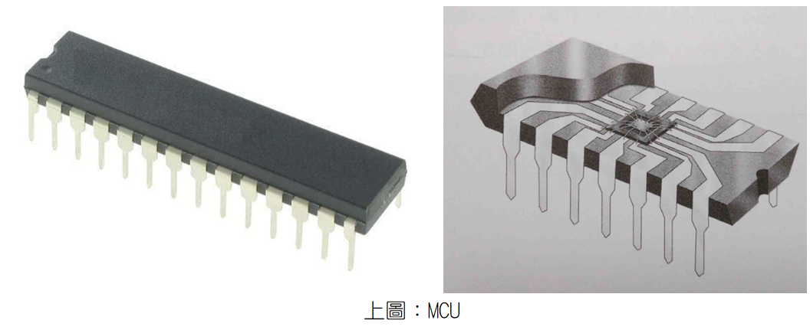
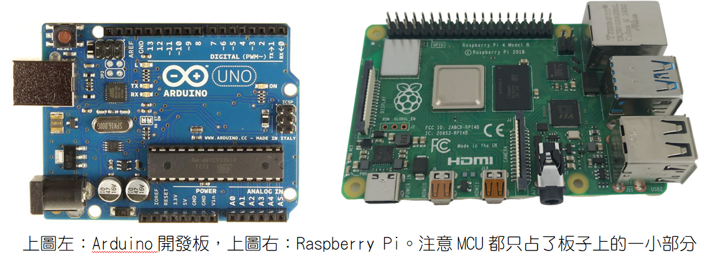
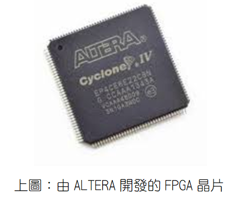
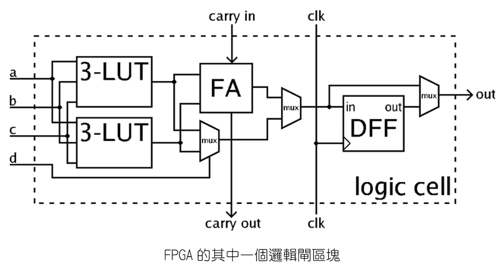
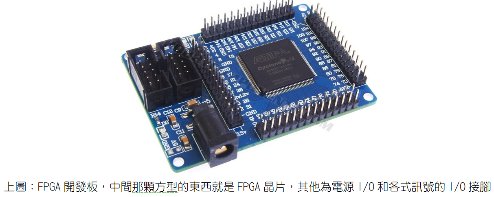
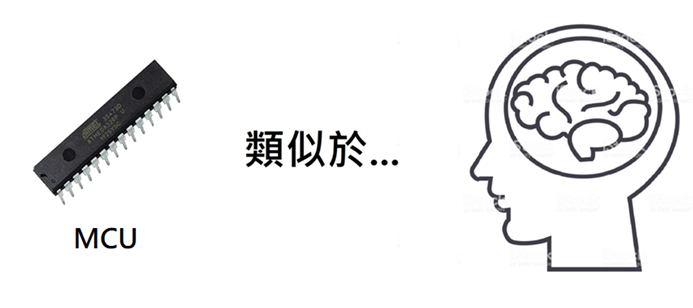
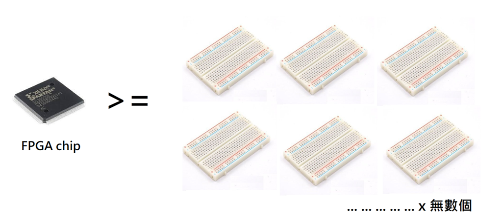
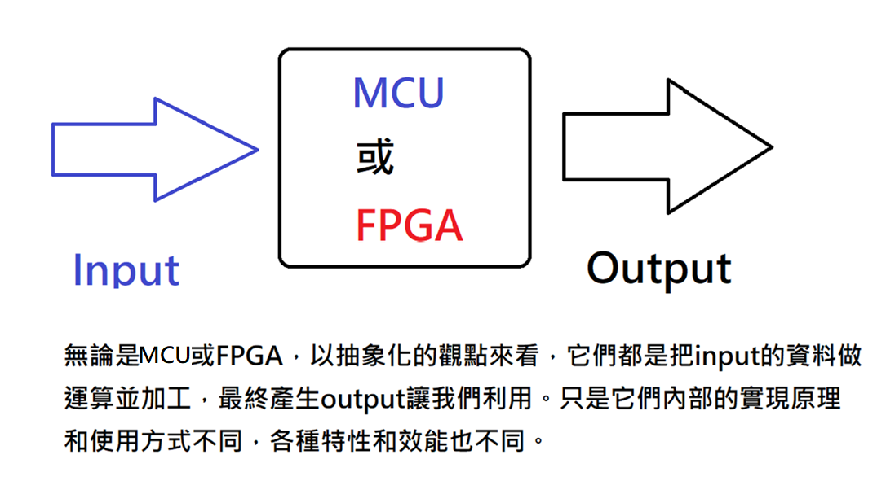

# 什麼是FPGA，它和MCU的差別為何？

我們先說何謂MCU，它是Micro Controller Unit的縮寫，中文翻譯為「微控制器」，但其實它就是一顆CPU（Central Processing Unit），所以我比較喜歡叫它「微處理器」。顧名思義，它就是我們個人電腦（PC，Personal Computer）裡面CPU的微型化版本，我們個人電腦裡面的CPU已經夠小了，不過它還能再縮小，小到能夠塞進一顆IC裡面。如下圖，在IC封裝內部中間那個超小的chip就是MCU的本體，其他都是散熱構造和金屬接點，而整個IC封裝的尺寸就和小拇指差不多。
      

MCU本質上它就是CPU，它執行的就是各種數學和邏輯運算，和我們個人電腦的CPU功能類似，只是效能弱很多，但如果不玩3D遊戲，一些較為簡單的應用場合已經足夠應付了。而如果把MCU安裝到一塊電路板上，並搭配上記憶體模組、電源I/O模組，以及各種訊號的輸入和輸出接腳，便成了一個比手掌還小的電腦，具備有電腦的一切特質和功能，只是不一定有安裝作業系統（Operation System）。

	註：請參考：馮紐曼提出的電腦（或稱計算機，Computer）的五大（硬體）架構。

使用效能比較陽春的MCU，而且沒有安裝作業系統、沒有硬碟，手掌大小的電腦，最著名的產品就是Arduino，俗稱Arduino開發板。

而使用效能比較強、體積比較大一點的MCU，並配上Linux作業系統和更完整的I/O（Input和Output），可以連接和PC一樣的液晶螢幕，還可以使用SD記憶卡充當硬碟，使它更像一台個人電腦，最著名的產品就是樹莓派（Raspberry Pi），所以也有人稱樹莓派為單版電腦。
     

Arduino開發板就像是閹割板的小型電腦，優勢就是簡單、價格便宜，沒有硬碟、沒有作業系統也沒關係，對於一些簡單的電子勞作來說已經足夠應付，例如可以設計Arduino遙控車、監控裝置等。而對於樹莓派（Raspberry Pi），可以純粹把它當作是一台更小的個人電腦即可，當然它也可以做到Arduino能夠做到的一切事情，但殺雞焉用牛刀，一些簡單的應用使用Arduino開發板來做就可以了，即使壞了也比較不心疼。

說完了MCU，我們來看另一種與MCU很像的東西，就是多數人比較陌生的FPGA。FPGA是Field Programmable Gate Array的縮寫，中文翻譯為「現場可程式化邏輯閘陣列」，原文這個名字就很學術和彆扭，如果不是專業人士光聽名字不可能知道它是什麼。其實FPGA就像MCU一樣是處理器，專門用來做數學和邏輯運算。

除了外觀不一樣、體積稍微大一點，那FPGA和MCU到底哪裡不一樣？除了功能相似，但其實它們無論在設計理念，以及實際硬體架構都完全不同，而效能和特性、控制方式也都完全不一樣。

MCU的設計理念比較單純，就是把CPU給進一步縮小（但犧牲效能），所以它的硬體架構和CPU幾乎一樣，裡面一樣是以ALU和控制單元為主，來執行我們輸入給它的一連串軟體指令，並產生運算後的輸出。

不過FPGA的設計理念就不同了，FPGA比較偏向用「純硬體」的方式來執行運算。請看下圖，在這樣一個邏輯閘電路的區塊中，如果電流走上面的全加器路徑，兩個3-LUTs的輸出會被相加，加上carry-in之後就成了一組完整的全加器電路。而如果電流走下面的mux路徑，就不會做加法運算，而是執行二選一的多工運算，因此會在兩個LUT的結果當中，選擇一個作為輸出。

這樣我們就知道FPGA的設計理念了：即使是同樣的一個電路，只要電流走不一樣的路徑，這個電路所做的事情就會不一樣，因此就會產生不同的輸出。而我們只要連接更多這樣的區塊成為一個規模巨大的Logic Array，並且能透過指令來控制電流的走向，我們就能利用這個集成電路來做各式各樣的運算了，這就是FPGA。所以宏觀的來看，雖然FPGA最終的功能和MCU相同，但它們的實現方式和特性非常不同。

在電腦科學領域，能夠用純硬體解決的事情，效能都會比還要使用高階語言的軟體指令還快上非常多，因為軟體還要透過轉譯成組合語言，組合語言又還要再轉譯成機械語言才能讓機器執行，而透過硬體直接操控機器當然省事不少，更加直接而快速。只不過在電腦科學領域，對人類來說，愈接近硬體的東西就愈複雜，例如機械語言的難度高於組合語言，組合語言又比高階語言困難，所以FPGA是比較難學的。

簡單的說，無論是MCU或是FPGA，在人類還沒給它們下達控制指令之前都相當於一張白紙，它們要做什麼運算，輸出什麼東西，純粹都是由人類設計者來決定的。

FPGA晶片也可以像MCU一樣被安裝在電路板上，並集成記憶體模組、電源I/O模組，以及各種訊號的輸入和輸出腳位，成為手掌大小的電腦，俗稱FPGA開發板。
                     

不過，站在使用者的立場，可以不必去理會MCU或FPGA實際的硬體原理，只要拿來用就好。站在使用者的立場，MCU開發板和FPGA開發板最大的不同，就在於其使用的程式語言。由於MCU開發板使用的是微型化的CPU，所以我們可以用一般的高階語言，如C語言、C++、Java、Python … 來撰寫程式、控制它要做的事情，是多數人比較熟悉的方式。

而FPGA則因為硬體結構完全不同，因此FPGA看不懂這些大家熟知的高階語言，它看的是「硬體描述語言」，例如Verilog、VHDL之類的語言。「硬體描述語言」在一些地方和軟體高階程式語言類似，最大的區別是，硬體描述語言能夠對於硬體電路的「時序特性」進行描述，小到簡單的正反器，大到複雜的超大型積體電路，都可以利用硬體描述語言來控制，而這是軟體高階語言所做不到的。
________________________________________________________

	補充說明：
屬於「硬體描述語言」的VHDL是Very High Speed Integrated Circuit Description Language的縮寫，簡單的說，它就是一種專門用來設計硬體電路的程式語言。它的起源是1970年代至1980年代由美國國防部所贊助的計畫，起初VHDL的目的是希望成為描述複雜電路文件的標準，如此一來，一份電路設計的文件就可以讓另一位設計者所了解，同時也希望VHDL可用在利用軟體模擬電路上。

但1984年Xilinx公司發明的FPGA與1983年出現的Verilog與VHDL改變了這種態勢，它們不僅將硬體設計軟體化，也使得一個人要做IC設計成為可能，大型客製化IC設計變成人人可在書房現學現做的東西，再也不是高不可攀的高科技。美國NI（National Instrument，翻譯為國家儀器）公司甚至在它們最核心的產品LabVIEW中擴充了FPGA模組，使得LabVIEW FPGA能像開發其他LabVIEW程式一般使用圖形化的方式來做FPGA程式開發，大大降低了開發FPGA的複雜度。

簡言之，FPGA就像可反覆寫入的USB隨身碟一樣，可以儲存/刪除不同的資料，不過FPGA實現的原理是使用偏向硬體的方式（硬體描述語言）來重新規劃與佈線FPGA裡面的電路圖，和USB隨身碟的原理不同。
________________________________________________________

即使如此，「硬體描述語言」的語法比起大家熟悉的高階語言更加複雜、更加不人性化。所以，就算是精通了C語言或嵌入式C語言的專家，如果要使用FPGA，還是必須學習很多新的東西，並適應差異很大的語法，並不是那麼容易上手。

舉個例子，FPGA的「硬體描述語言」，例如Verilog、VHDL，其執行順序並不是像軟體高階語言那樣由上至下、由左至右，並且它天生就有平行運算的能力（但又不是多核心CPU的概念），所以很多我們在軟體高階語言（如C語言、Java、Python…）的觀念都不同，語法也大相逕庭。

既然如此，那我們為什麼又要學FPGA？既然做的事情都差不多，那我們學MCU就好了啊？

其實FPGA比MCU強大的地方就在於執行效能更快，以及它能更好的與「特殊應用積體電路」（Application Specific Integrated Circuit，縮寫：ASIC）做銜接，因此在商業上能更快地推出新產品，所以在商業的潛力比MCU強（也就是說賺錢比較快啦），因此近幾年來FPGA成為全球商業電子公司主力的開發手段。

從FPGA的原理來看，因為一個產品只會有一些特定的功能，所以完成設計後，FPGA內部一定會有很多用不到的邏輯閘區塊，這樣不是很浪費嗎？所以剛才說的ASIC就是指，依產品需求不同，而客製化的「特殊規格積體電路」，也就是依據FPGA開發完成的功能，再進一步精簡電路設計，讓它成為只有特定功能的電路，這就是ASIC。雖然從此ASIC的功能被固定死了，不能再以程式控制它要做的事情，但這對於銷售來說是個優點，因為單一所以效能強大，並且讓消費者無法隨意修改產品，對手也很難破解。

而因為FPGA本身的原理就是偏向以硬體來做控制，當然能更快、更好的銜接上ASIC。其實，在量產上市的每一個產品都裝FPGA作為運算核心也是可以的，但這樣成本會太高，所以電子公司的研發部門在使用FPGA完成產品原型的開發後，就會把FPGA的設計成果轉變為ASIC，不只可以降低成本，也能更進一步提高運算效能。因此，先期以FPGA開發板完成樣品開發、測試沒問題之後，最終產品就會從FPGA轉成ASIC量產上市。在台灣，台積電（TSMC）就是專門幫全球客戶做ASIC代工製造的生意。

而以上的事情，其實使用MCU開發板也可以做到，但MCU開發板在轉為ASIC的方便度就輸給FPGA，以及運算效能也會比偏向硬體運作的FPGA要差一點。因此在追求價格便宜、效能強大，高CP值的商業市場來說，電子公司自然就會比較偏向使用FPGA來開發新產品，這都是為了能更快的賺到錢，以及讓消費者能以更便宜的價格買到效能更好的產品。

如果不是相關從業人員，一般的電子愛好者或業餘開發者，其實使用MCU開發板（例如Arduino、Raspberry Pi）來製作「新玩具」就已經足夠了，反正不是追求最大利潤、東西也不是要量產賣錢，對一點點的效能差異也不那麼在乎，就不必為此還去研究學習成本和學習曲線很高的FPGA了，除非有朝一日FPGA的開發門檻能夠降低，硬體描述語言能夠再平易近人一點。

做個總結，請看以下的三張圖：

 
    
      

