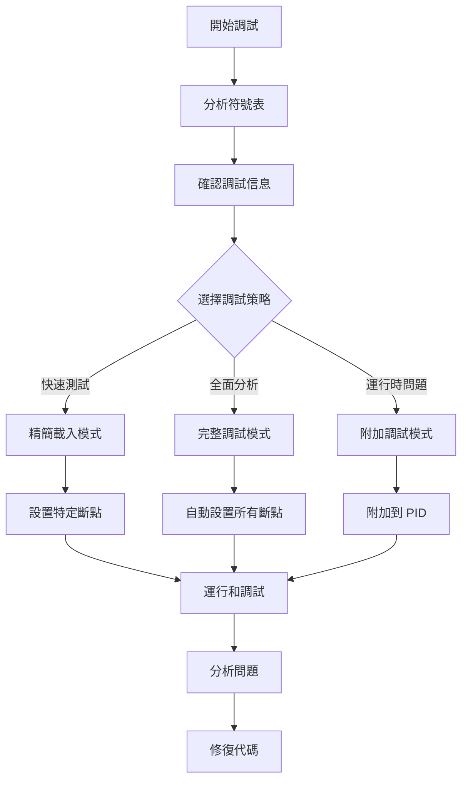

# GDB 調試完全指南 - Rust/C++ 專用

## 📋 概述

本指南提供完整的 GDB 調試技術說明，適用於 Rust 和 C++ 程式的深度調試。包含從基礎指令到進階原理的全面介紹。

## 🎯 調試腳本範例

以下是常見的調試腳本模式：

| 腳本類型 | 用途 | 使用場景 |
|---------|------|----------|
| `list_functions.sh` | 列出特定函數符號 | 調試前偵察，瞭解可用函數 |
| `gdb_minimal.sh` | 精簡調試，只載入核心庫 | 快速測試特定功能 |
| `gdb_full.sh` | 全面調試，設置所有模組斷點 | 深度分析程式執行流程 |
| `gdb_attach.sh` | 附加到運行中的進程 | 調試已運行的程式 |

## 🚀 快速開始

### 1. 查看可用函數
```bash
# 使用 nm 查看函數符號
nm lib.so | grep "T " | grep "function_pattern"

# 或使用腳本
./list_functions.sh
cat functions.txt | grep connect  # 查看特定函數
```

### 2. 選擇調試模式

#### 輕量級調試
```bash
gdb ./program -ex "set auto-solib-add off" -ex "run"
```
- ✅ 啟動快速
- ✅ 專注核心邏輯
- ❌ 某些功能可能受限

#### 全面調試
```bash
gdb ./program -ex "set breakpoint pending on" -ex "rbreak .*pattern.*" -ex "run"
```
- ✅ 完整斷點覆蓋
- ✅ 所有模組追蹤
- ❌ 啟動較慢

#### 運行時調試
```bash
# 附加到運行中的進程
gdb -p $(pgrep program_name)
# 或
gdb -p PID
```
- ✅ 不中斷運行狀態
- ✅ 保持應用上下文
- ❌ 需要適當權限

## 🔧 核心 GDB 指令說明

### 基本設定指令

| 指令 | 作用 | 原因 |
|------|------|------|
| `set pagination off` | 關閉分頁顯示 | 避免大量輸出時需要手動按 Enter |
| `set breakpoint pending on` | 允許延遲斷點 | 可在未載入的函式庫中預設斷點 |
| `set auto-solib-add off` | 關閉自動載入函式庫 | 手動控制載入，提高效率 |
| `set print pretty on` | 美化輸出格式 | 更易讀的結構體顯示 |
| `set confirm off` | 關閉確認提示 | 自動化執行不需確認 |

### 斷點設置指令

#### `break` vs `rbreak`
- **`break function_name`**: 設置單一斷點
  ```gdb
  break main
  break MyClass::myMethod
  break file.cpp:123
  ```

- **`rbreak pattern`**: 正則表達式批量設置
  ```gdb
  rbreak .*::processData.*      # 所有 processData 相關函數
  rbreak ^handle_.*              # 所有 handle_ 開頭的函數
  rbreak .*Service::.*           # Service 類的所有方法
  ```

### 函式庫載入指令

```gdb
# 載入所有函式庫
sharedlibrary

# 載入特定函式庫
sharedlibrary libexample

# 查看已載入的函式庫
info sharedlibrary
```

### 函式庫載入與斷點設置順序

#### 順序比較

| 順序 | 指令流程 | 優點 | 缺點 | 適用場景 |
|------|---------|------|------|----------|
| **先斷點後載入** | 1. `set breakpoint pending on`<br>2. `break function`<br>3. `sharedlibrary` | • 可批量設置<br>• 適合自動化 | • 需要 pending 設定<br>• 符號錯誤不易發現 | 腳本自動化 |
| **先載入後斷點** | 1. `sharedlibrary`<br>2. `break function` | • 立即驗證符號<br>• 支援 TAB 補全 | • 需等待載入完成 | 互動式調試 |

#### 最佳實踐
```gdb
# 推薦順序
set breakpoint pending on          # 1. 允許延遲斷點
sharedlibrary libexample.so        # 2. 載入函式庫
info sharedlibrary                 # 3. 驗證載入
rbreak .*MyNamespace::.*           # 4. 設置斷點
info breakpoints                   # 5. 確認狀態
```

## 🔍 GDB 與程式碼對應機制

### 核心原理架構

```
源碼(.rs) → 編譯器(rustc) → 二進制文件(.so/.exe)
                ↓
        生成調試信息(DWARF)
                ↓
    GDB 讀取調試信息 → 映射到源碼
```

### 調試信息組成

#### 1. 符號表 (Symbol Table)
```bash
# 查看符號表
$ nm libexample.so

0000000000123456 T _Z10initServerv        # T = Text段(函數)
0000000000123789 D global_config          # D = Data段(變數)
0000000000234567 T _ZN7MyClass6methodEv   # T = 類方法
```

**符號類型說明**：
- **T**: Text (code) segment - 函數實現
- **U**: Undefined - 外部引用
- **D**: Data segment - 全局變數
- **B**: BSS segment - 未初始化數據

#### 2. DWARF 調試信息
```bash
# 查看 DWARF 信息
$ objdump --dwarf=info libexample.so
$ readelf --debug-dump=info libexample.so
```

**DWARF 包含**：
- 源檔案路徑與行號對應表
- 變數類型與位置信息
- 函數參數與局部變數
- 內聯函數展開信息

### GDB 映射工作流程

#### 步驟 1: 地址解析
```gdb
(gdb) break MyClass::processData
# GDB 動作：
# 1. 查找符號表
# 2. 找到 MyClass::processData = 0x7ffff7abc123
# 3. 在該地址設置 INT3 斷點指令
```

#### 步驟 2: 行號映射表
```
記憶體地址          源碼位置
0x7ffff7abc123  →  src/server.rs:42
0x7ffff7abc127  →  src/server.rs:43
0x7ffff7abc12b  →  src/server.rs:44
```

#### 步驟 3: 實際對應過程
```gdb
# 程式執行到斷點
Program received signal SIGTRAP
# GDB 處理流程：
# 1. CPU 執行到 0x7ffff7abc123
# 2. 觸發 INT3 陷阱
# 3. GDB 查詢 DWARF：0x7ffff7abc123 → server.rs:42
# 4. 讀取 /path/to/server.rs 第 42 行
# 5. 顯示源碼位置
```

### 編譯時調試信息生成

#### Rust 編譯選項
```bash
# Debug 模式（完整調試信息）
cargo build
# 等同於: rustc -g -C opt-level=0 -C debuginfo=2

# Release 模式 + 調試信息
cargo build --release
# Cargo.toml 配置：
[profile.release]
debug = true  # 或 debug = 2
```

#### 調試信息層級
```toml
# Cargo.toml
[profile.dev]
debug = 2       # 完整調試信息（預設）
debug = 1       # 只有行號信息
debug = 0       # 無調試信息
```

### DWARF 格式詳解

#### DIE (Debugging Information Entry) 結構
```
DW_TAG_compile_unit
├── DW_AT_name: "main.cpp"
├── DW_AT_comp_dir: "/home/user/project/src"
└── DW_TAG_subprogram
    ├── DW_AT_name: "processData"
    ├── DW_AT_low_pc: 0x7ffff7abc123    # 函數起始地址
    ├── DW_AT_high_pc: 0x7ffff7abc456   # 函數結束地址
    ├── DW_AT_decl_file: 1              # 檔案索引
    └── DW_AT_decl_line: 42             # 源碼行號
```

### Name Mangling (符號修飾)

#### C++ 命名轉換
```cpp
// C++ 源碼
class MyClass {
    void processData(int value);
};

// 編譯後符號（Mangled）
_ZN7MyClass11processDataEi

// 解碼後（Demangled）
MyClass::processData(int)
```

#### Rust 命名轉換
```rust
// Rust 源碼
impl DataProcessor {
    pub fn process(&self) -> Result<()> { }
}

// 編譯後符號（Mangled）
_ZN13DataProcessor7process17h8a3f5d2c1b9e7046E

// 解碼後（Demangled）
DataProcessor::process
```

#### GDB 解碼方式
```gdb
# 自動解碼
(gdb) info functions connect
ButtplugClient::connect()

# 手動解碼工具
$ c++filt _ZN14ButtplugClient7connect17h8a3f5d2c1b9e7046E
$ rustfilt _ZN14ButtplugClient7connect17h8a3f5d2c1b9e7046E
```

### 實際查看調試信息

```bash
# 1. 檢查是否有調試信息
$ file libexample.so
# 輸出: with debug_info, not stripped

# 2. 查看調試段大小
$ size -A libexample.so | grep debug
.debug_info    123456   # DWARF 信息
.debug_line    45678    # 行號映射
.debug_str     12345    # 調試字串

# 3. 查看行號映射
$ objdump -d -l libexample.so

# 4. 查看符號詳情
$ readelf -s libexample.so | grep MyClass
$ nm -C libexample.so | grep processData  # -C 自動 demangle
```

### GDB 深層命令

```gdb
# 查看符號來源
(gdb) info symbol 0x7ffff7abc123
MyClass::processData(int) in section .text

# 查看地址對應行號
(gdb) info line *0x7ffff7abc123
Line 42 of "server.rs" starts at 0x7ffff7abc123

# 查看源碼搜索路徑
(gdb) show directories

# 設置源碼路徑映射
(gdb) set substitute-path /original/path /current/path

# 查看 DWARF 原始信息
(gdb) maintenance info sections .debug_*

# 查看載入的符號檔案
(gdb) info sources
```

### 調試信息最佳化影響

| 編譯模式 | 二進制大小 | 調試體驗 | 執行速度 | 變數可見性 |
|---------|-----------|---------|---------|-----------|
| Debug | 100MB | 極佳 | 慢 | 完整 |
| Release | 20MB | 差 | 快 | 多數 optimized out |
| Release+debug | 80MB | 良好 | 快 | 部分可見 |
| Release+split-debuginfo | 20MB+60MB | 良好 | 快 | 部分可見 |

### 常見調試信息問題

#### 問題：No debugging symbols found
```bash
# 解決方案
cargo clean
cargo build  # 確保有調試信息
```

#### 問題：源碼路徑不匹配
```gdb
# 設置源碼搜索路徑
(gdb) directory /new/source/path
(gdb) set substitute-path /build/path /actual/path
```

#### 問題：Optimized out 變數
```rust
// 防止優化的方法
#[inline(never)]
fn function() { }

// 或使用 black_box
use std::hint::black_box;
let x = black_box(42);
```

## 📊 調試工作流程



## 💡 實用調試技巧

### 1. 斷點管理
```gdb
info breakpoints          # 列出所有斷點
disable 1-5              # 暫時禁用斷點 1 到 5
enable 3                 # 啟用斷點 3
delete 10                # 刪除斷點 10
clear function_name      # 清除函數上的斷點
```

### 2. 執行控制
```gdb
run                      # 開始執行
continue (c)             # 繼續執行
step (s)                 # 單步執行（進入函數）
next (n)                 # 單步執行（不進入函數）
finish                   # 執行到當前函數返回
until 123               # 執行到第 123 行
```

### 3. 檢查程式狀態
```gdb
backtrace (bt)          # 查看調用堆疊
frame 2                 # 切換到堆疊第 2 層
info locals             # 查看局部變數
info args               # 查看函數參數
print variable_name     # 打印變數值
print *pointer         # 打印指針內容
x/10x $rsp             # 查看堆疊記憶體（16進制）
```

### 4. Rust 特有調試
```gdb
# 設置 Rust 語言模式
set language rust

# 查看 Result 類型
print result

# 查看 Option 類型
print option_value

# 查看字符串
print string_variable

# 查看 Vec
print vector_name
print vector_name.len
print vector_name.buf.ptr
```

## 🛠️ 常見問題解決

### 問題 1: 找不到符號
**症狀**: `No symbol "function_name" in current context`

**解決方案**:
1. 確認函式庫已載入: `info sharedlibrary`
2. 手動載入: `sharedlibrary libname`
3. 檢查符號表: `nm lib.so | grep function_name`

### 問題 2: 斷點未觸發
**症狀**: 程式執行但斷點沒有停止

**解決方案**:
1. 檢查斷點狀態: `info breakpoints`
2. 確認函數被調用: 添加日誌輸出
3. 使用 `rbreak` 設置更廣泛的斷點

### 問題 3: 無法查看變數
**症狀**: `optimized out` 訊息

**解決方案**:
1. 使用 debug 版本編譯: `cargo build` (不加 --release)
2. 降低優化等級: 在 Cargo.toml 設置 `opt-level = 0`

## 📚 進階技巧

### 腳本範例

#### 列出函數符號腳本 (list_functions.sh)
```bash
#!/bin/bash
LIBRARY=${1:-"lib/libexample.so"}
PATTERN=${2:-".*"}

echo "Extracting function symbols from $LIBRARY..."
nm -C "$LIBRARY" | grep " T " | grep -E "$PATTERN" | awk '{print $3}' > functions.txt
echo "Found $(wc -l < functions.txt) functions"
```

#### 精簡調試腳本 (gdb_minimal.sh)
```bash
#!/bin/bash
cat > /tmp/gdb_commands << 'EOF'
set pagination off
set breakpoint pending on
set auto-solib-add off
file ./program
sharedlibrary libexample
break main
run
EOF

gdb -x /tmp/gdb_commands
```

#### 附加調試腳本 (gdb_attach.sh)
```bash
#!/bin/bash
PROGRAM_NAME=${1:-"program"}
PID=$(pgrep -f "$PROGRAM_NAME" | head -1)

if [ -z "$PID" ]; then
    echo "Process not found: $PROGRAM_NAME"
    exit 1
fi

echo "Attaching to PID: $PID"
gdb -p "$PID"
```

### 條件斷點
```gdb
# 只在特定條件下中斷
break function_name if variable == 42
condition 5 counter > 100  # 為斷點 5 添加條件
```

### 觀察點
```gdb
# 當變數改變時中斷
watch variable_name
rwatch variable_name     # 讀取時中斷
awatch variable_name     # 讀寫時中斷
```

### 自動化調試
```gdb
# 定義命令序列
define print_state
  print variable1
  print variable2
  backtrace 3
end

# 斷點觸發時自動執行
commands 1
  print_state
  continue
end
```

### 日誌記錄
```gdb
# 開啟日誌
set logging on
set logging file debug.log

# 設置日誌等級
set logging overwrite on
set logging redirect on
```

## 🔗 相關資源

- [GDB 官方文檔](https://www.gnu.org/software/gdb/documentation/)
- [Rust GDB 調試指南](https://rust-lang.github.io/rustup/debugging.html)
- [GNU Debugger Documentation](https://sourceware.org/gdb/current/onlinedocs/gdb/)

## 📝 備註

- 需要調試符號的二進制文件（非 stripped）
- 某些功能可能需要 root 權限（如 ptrace）
- C++ 程式建議使用 `-g -O0` 編譯選項
- Rust 程式建議使用 `cargo build` (debug mode)
- 可使用 `gdb-dashboard` 或 `gef` 增強調試體驗

## 🔨 編譯建議

### C++ 編譯選項
```bash
# Debug 版本
g++ -g -O0 -fno-omit-frame-pointer main.cpp

# Release with debug info
g++ -g -O2 main.cpp
```

### Rust 編譯選項
```bash
# Debug 版本
cargo build

# Release with debug info
cargo build --release
# Cargo.toml:
# [profile.release]
# debug = true
```

### CMake 配置
```cmake
# Debug 版本
set(CMAKE_BUILD_TYPE Debug)
set(CMAKE_CXX_FLAGS_DEBUG "-g -O0")

# Release with debug
set(CMAKE_BUILD_TYPE RelWithDebInfo)
```

---
最後更新: 2025-09-17